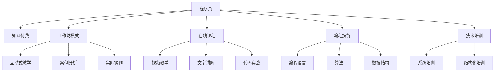

                 

# 程序员知识付费：打造工作坊模式

> 关键词：程序员,知识付费,工作坊模式,编程技能,在线课程

## 1. 背景介绍

### 1.1 问题由来
在互联网快速发展的今天，知识付费已经成为了一股不可阻挡的潮流。程序员作为技术领域的核心力量，其知识和技能无疑具有极高的价值。然而，传统的技术培训方式如书籍、博客、视频课程等，难以满足程序员个性化、深度化的学习需求。

程序员知识付费，是指将程序员的专业技能、项目经验、编程心得等内容转化为可交易的知识产品，通过线上线下相结合的方式，为有需求的人群提供专业化的技术培训和技能提升服务。这不仅能够帮助程序员更好地提升自己的职业素养，还能够为行业带来新的发展动力。

### 1.2 问题核心关键点
1. **技能匹配**：如何精准匹配学员的技术水平和目标需求，提供合适的知识产品。
2. **内容质量**：如何确保知识的准确性、实用性和前瞻性，避免误导学员。
3. **交互体验**：如何打造良好的学习交互环境，提升学员的参与度和学习效果。
4. **收费模式**：如何制定合理的收费标准，既保证盈利又满足学员的需求。
5. **运营维护**：如何有效管理课程内容、学员反馈和平台运营，确保服务质量和持续性。

### 1.3 问题研究意义
打造程序员知识付费模式，具有以下几方面的重要意义：

1. **促进技术创新**：知识付费模式能够激励程序员不断学习和提升，促进技术的创新和应用。
2. **提升职业素养**：通过系统化的培训，帮助程序员全面提升职业素养，包括编程能力、项目管理、团队协作等。
3. **推动行业发展**：知识付费模式能够为行业带来新的商业机会，促进产业升级和转型。
4. **构建信任机制**：通过透明、公正的收费和评价机制，构建良好的信任关系，提升平台的用户粘性。
5. **激发学习热情**：知识付费模式能够激发程序员的学习热情，形成良性循环。

## 2. 核心概念与联系

### 2.1 核心概念概述

为了更好地理解程序员知识付费模式，本节将介绍几个关键概念：

- **程序员**：具备计算机编程能力，从事软件开发、系统架构、数据库管理等工作的专业人员。
- **知识付费**：将知识和技能转化为可交易的产品或服务，通过线上线下相结合的方式，为有需求的人群提供专业化的技术培训和技能提升服务。
- **工作坊模式**：通过面对面的互动式教学，结合案例分析和实际操作，帮助学员深入理解和掌握技能的学习模式。
- **编程技能**：包括编程语言、算法、数据结构、软件工程等知识和技能。
- **在线课程**：通过互联网技术，将课程内容以视频、文字、代码等多种形式呈现给学员，实现远程教学。
- **技术培训**：针对特定技术领域或技能进行系统化、结构化的培训，帮助学员掌握相关知识和技能。

这些概念之间的关系可以通过以下Mermaid流程图来展示：



这个流程图展示了程序员知识付费模式的核心理念：

1. **知识变现**：程序员将自己的编程技能、项目经验、编程心得等内容转化为可交易的产品或服务。
2. **教学模式**：通过工作坊模式和在线课程相结合的方式，为学员提供个性化的技术培训和技能提升服务。
3. **技能提升**：通过系统化、结构化的培训，帮助学员掌握编程语言、算法、数据结构、软件工程等知识和技能。
4. **技术创新**：激励程序员不断学习和提升，推动技术创新和应用。

这些概念共同构成了程序员知识付费的学习框架，为其推广应用提供了理论依据。

## 3. 核心算法原理 & 具体操作步骤
### 3.1 算法原理概述

程序员知识付费的核心算法原理是利用互联网技术，将程序员的专业知识和技能转化为可交易的产品或服务，通过线上线下相结合的方式，为有需求的人群提供专业化的技术培训和技能提升服务。

具体而言，这一过程包括以下几个关键步骤：

1. **需求分析**：通过问卷调查、访谈等方式，分析目标受众的需求，确定课程内容和技术方向。
2. **课程设计**：根据需求分析结果，设计课程内容，包括理论讲解、案例分析、实际操作等环节。
3. **教学实施**：通过线上线下相结合的方式，为学员提供互动式教学、案例分析和实际操作等服务。
4. **反馈评估**：收集学员的反馈，评估课程效果，不断优化课程内容和教学方法。
5. **市场推广**：通过多种渠道进行课程推广，吸引有需求的人群报名学习。

### 3.2 算法步骤详解

程序员知识付费的算法步骤可以分为以下几个阶段：

**阶段1：需求分析**

- **目标受众**：通过问卷调查、访谈等方式，了解目标受众的技术水平、职业目标和学习需求。
- **课程设计**：根据需求分析结果，设计课程内容，包括编程语言、算法、数据结构、软件工程等知识和技能。
- **教学模式**：确定采用工作坊模式还是在线课程，或者两者相结合的方式。

**阶段2：课程设计**

- **理论讲解**：通过视频、文字等形式，讲解编程语言、算法、数据结构等基础知识。
- **案例分析**：结合实际项目案例，分析问题和解决方案，帮助学员理解理论知识的实际应用。
- **实际操作**：通过实际操作练习，巩固所学知识，提高编程能力。

**阶段3：教学实施**

- **互动式教学**：通过面对面互动，解答学员疑问，提供实时反馈。
- **案例分析**：结合实际项目案例，分析问题和解决方案，帮助学员理解理论知识的实际应用。
- **实际操作**：通过实际操作练习，巩固所学知识，提高编程能力。

**阶段4：反馈评估**

- **学员反馈**：通过问卷调查、访谈等方式，收集学员的反馈意见。
- **课程优化**：根据学员反馈，优化课程内容和教学方法。
- **教学改进**：根据反馈结果，调整教学策略，提高教学效果。

**阶段5：市场推广**

- **渠道推广**：通过社交媒体、技术论坛、专业博客等渠道，进行课程推广。
- **免费试用**：提供免费试用课程，吸引学员报名学习。
- **口碑营销**：利用学员的积极反馈，进行口碑营销，吸引更多学员报名。

### 3.3 算法优缺点

程序员知识付费模式具有以下优点：

1. **个性化培训**：通过工作坊模式和在线课程相结合的方式，能够提供个性化的技术培训和技能提升服务，满足学员的个性化需求。
2. **高效学习**：结合案例分析和实际操作，帮助学员深入理解和掌握技能，提升学习效率。
3. **高互动性**：互动式教学和实际操作能够提升学员的参与度和学习效果，提高教学质量。
4. **灵活性**：学员可以根据自己的时间安排，灵活选择学习和实践的时间，提升学习便利性。

同时，这一模式也存在一些局限性：

1. **成本较高**：线下工作坊模式需要场地、设备和教师等资源，成本较高。
2. **推广难度大**：在线课程的推广难度较大，需要投入较多的时间和资源。
3. **师资力量不足**：优秀的编程教师和讲师数量有限，难以满足大规模课程的需求。
4. **课程内容单一**：课程内容的设计和实施需要专业知识和技能，课程内容单一或重复，难以满足学员的多样化需求。
5. **市场竞争激烈**：知识付费市场的竞争激烈，如何突出自身特色和优势，吸引学员报名，是平台面临的挑战。

### 3.4 算法应用领域

程序员知识付费模式主要应用于以下领域：

- **软件开发**：包括编程语言、算法、数据结构、软件工程等知识和技能的培训。
- **系统架构**：帮助学员掌握系统架构设计、部署、运维等技术。
- **数据库管理**：包括SQL、NoSQL等数据库技术的培训。
- **人工智能**：包括机器学习、深度学习、自然语言处理等技术的培训。
- **项目管理**：包括敏捷开发、Scrum、Kanban等项目管理方法的培训。
- **云计算**：包括AWS、Azure、Google Cloud等云平台的培训。

## 4. 数学模型和公式 & 详细讲解 & 举例说明

### 4.1 数学模型构建

为了更好地理解程序员知识付费模式，本节将使用数学语言对算法流程进行更加严格的刻画。

记程序员为 $P$，目标受众为 $U$，课程内容为 $C$，教学模式为 $M$，市场推广为 $P$。

定义需求分析函数 $f(U, P)$，表示根据目标受众的需求，设计课程内容；定义课程设计函数 $g(C)$，表示根据课程内容，设计教学模式；定义教学实施函数 $h(M, C)$，表示根据教学模式和课程内容，实施教学过程；定义反馈评估函数 $i(U, M, C)$，表示根据学员反馈，评估教学效果；定义市场推广函数 $j(P, U)$，表示根据市场需求，推广课程。

### 4.2 公式推导过程

以工作坊模式为例，推导其数学模型：

记工作坊模式为 $W$，互动式教学为 $I$，案例分析为 $A$，实际操作为 $O$。

根据工作坊模式的定义，可以推导出其数学模型为：

$$
W = I \cdot A \cdot O
$$

其中，$I$、$A$、$O$ 分别表示互动式教学、案例分析和实际操作。

结合实际教学过程，可以进一步细化为：

$$
I = \sum_{i=1}^n \frac{1}{n} I_i
$$

$$
A = \sum_{a=1}^m \frac{1}{m} A_a
$$

$$
O = \sum_{o=1}^p \frac{1}{p} O_o
$$

其中，$n$、$m$、$p$ 分别表示互动式教学、案例分析和实际操作的数量。

### 4.3 案例分析与讲解

以一个Python编程课程为例，展示工作坊模式的具体实现过程：

**案例描述**：
- **目标受众**：初入职场的Python程序员，具备基本的编程基础。
- **课程内容**：Python基础语法、数据结构、算法、Web开发、数据分析等。
- **教学模式**：工作坊模式，结合案例分析和实际操作。

**教学实施过程**：

1. **理论讲解**：通过视频和文字讲解Python基础语法、数据结构、算法等基础知识。
2. **互动式教学**：采用面对面互动的方式，解答学员疑问，提供实时反馈。
3. **案例分析**：结合实际项目案例，分析问题和解决方案，帮助学员理解理论知识的实际应用。
4. **实际操作**：通过实际操作练习，巩固所学知识，提高编程能力。

## 5. 项目实践：代码实例和详细解释说明
### 5.1 开发环境搭建

在进行项目实践前，我们需要准备好开发环境。以下是使用Python进行Django框架开发的环境配置流程：

1. 安装Python：从官网下载并安装Python，确保版本为3.8以上。
2. 安装Django：通过pip命令安装Django框架。
3. 安装SQLite：通过pip命令安装SQLite数据库。
4. 创建Django项目：通过Django管理后台创建新的Python Django项目。
5. 安装第三方库：安装需要的第三方库，如Django REST Framework、Django Markdown、Jinja2等。

完成上述步骤后，即可在本地搭建起一个完整的Django项目，准备进行课程开发。

### 5.2 源代码详细实现

下面以一个简单的Python编程课程为例，展示如何通过Django框架实现程序员知识付费模式。

**步骤1：创建Django项目**

```bash
django-admin startproject course
```

**步骤2：创建课程模型**

```python
from django.db import models

class Course(models.Model):
    name = models.CharField(max_length=100)
    description = models.TextField()
    create_date = models.DateTimeField(auto_now_add=True)
    update_date = models.DateTimeField(auto_now=True)
    is_active = models.BooleanField(default=True)
```

**步骤3：创建教学模型**

```python
class Lecture(models.Model):
    course = models.ForeignKey(Course, on_delete=models.CASCADE)
    title = models.CharField(max_length=100)
    content = models.TextField()
    create_date = models.DateTimeField(auto_now_add=True)
    update_date = models.DateTimeField(auto_now=True)
    is_active = models.BooleanField(default=True)
```

**步骤4：创建互动模型**

```python
class Interaction(models.Model):
    lecture = models.ForeignKey(Lecture, on_delete=models.CASCADE)
    user = models.ForeignKey(User, on_delete=models.CASCADE)
    content = models.TextField()
    create_date = models.DateTimeField(auto_now_add=True)
    update_date = models.DateTimeField(auto_now=True)
    is_active = models.BooleanField(default=True)
```

**步骤5：创建反馈模型**

```python
class Feedback(models.Model):
    lecture = models.ForeignKey(Lecture, on_delete=models.CASCADE)
    user = models.ForeignKey(User, on_delete=models.CASCADE)
    rating = models.IntegerField()
    comment = models.TextField()
    create_date = models.DateTimeField(auto_now_add=True)
    update_date = models.DateTimeField(auto_now=True)
    is_active = models.BooleanField(default=True)
```

**步骤6：创建用户模型**

```python
from django.contrib.auth.models import AbstractUser
from django.db import models

class User(AbstractUser):
    pass
```

**步骤7：创建视图和路由**

```python
from django.shortcuts import render, redirect
from django.contrib.auth.decorators import login_required
from .models import Course, Lecture, Interaction, Feedback
from .forms import FeedbackForm

@login_required
def course_detail(request, course_id):
    course = get_object_or_404(Course, id=course_id)
    return render(request, 'course/detail.html', {'course': course})

@login_required
def interaction(request, course_id, lecture_id):
    lecture = get_object_or_404(Lecture, id=lecture_id)
    return render(request, 'course/lecture_detail.html', {'lecture': lecture})

@login_required
def feedback(request, course_id, lecture_id):
    lecture = get_object_or_404(Lecture, id=lecture_id)
    if request.method == 'POST':
        form = FeedbackForm(request.POST)
        if form.is_valid():
            feedback = form.save(commit=False)
            feedback.lecture = lecture
            feedback.user = request.user
            feedback.save()
            return redirect('course_detail', course_id=course_id)
    else:
        form = FeedbackForm()
    return render(request, 'course/feedback.html', {'form': form})
```

**步骤8：创建表单**

```python
from django import forms
from .models import Feedback

class FeedbackForm(forms.ModelForm):
    class Meta:
        model = Feedback
        fields = ['rating', 'comment']
```

**步骤9：创建模板**

**course/detail.html**

```html
<h1>{{ course.name }}</h1>
<p>{{ course.description }}</p>
<ul>
    
        <li><a href="">{{ lecture.title }}</a></li>
    
</ul>
<form method="POST">
    
    <button type="submit" name="submit">Feedback</button>
</form>
```

**course/lecture_detail.html**

```html
<h1>{{ lecture.title }}</h1>
<p>{{ lecture.content }}</p>
<form method="POST">
    
    <button type="submit" name="submit">Feedback</button>
</form>
```

**course/feedback.html**

```html
<h1>Feedback</h1>
<form method="POST">
    
    {{ form.rating.label }}
    {{ form.rating }}
    <br>
    {{ form.comment.label }}
    {{ form.comment }}
    <br>
    <button type="submit" name="submit">Submit</button>
</form>
```

**步骤10：创建URL配置**

```python
from django.urls import path
from . import views

urlpatterns = [
    path('course/<int:course_id>/', views.course_detail, name='course_detail'),
    path('course/<int:course_id>/lecture/<int:lecture_id>/', views.interaction, name='course_lecture_detail'),
    path('course/<int:course_id>/lecture/<int:lecture_id>/feedback/', views.feedback, name='course_feedback'),
]
```

**步骤11：运行Django项目**

```bash
python manage.py runserver
```

完成上述步骤后，即可在本地搭建起一个完整的Django项目，准备进行课程开发。

### 5.3 代码解读与分析

让我们再详细解读一下关键代码的实现细节：

**Course模型**：
- `name`：课程名称。
- `description`：课程简介。
- `create_date`：创建时间。
- `update_date`：最后更新时间。
- `is_active`：课程是否有效。

**Lecture模型**：
- `course`：所属课程。
- `title`：讲座标题。
- `content`：讲座内容。
- `create_date`：创建时间。
- `update_date`：最后更新时间。
- `is_active`：讲座是否有效。

**Interaction模型**：
- `lecture`：所属讲座。
- `user`：参与者。
- `content`：互动内容。
- `create_date`：创建时间。
- `update_date`：最后更新时间。
- `is_active`：互动是否有效。

**Feedback模型**：
- `lecture`：所属讲座。
- `user`：反馈者。
- `rating`：评分。
- `comment`：反馈内容。
- `create_date`：创建时间。
- `update_date`：最后更新时间。
- `is_active`：反馈是否有效。

**User模型**：
- 继承自Django的AbstractUser模型，包含用户的基本信息。

**视图和路由**：
- `course_detail`：显示课程详情，并提供反馈入口。
- `interaction`：显示讲座详情，并提供反馈入口。
- `feedback`：提交反馈信息。

**表单**：
- `FeedbackForm`：反馈信息表单。

**模板**：
- `course/detail.html`：课程详情模板。
- `course/lecture_detail.html`：讲座详情模板。
- `course/feedback.html`：反馈表单模板。

通过以上代码实现，可以构建一个简单的程序员知识付费系统，实现课程管理、教学实施和反馈评估等功能。

## 6. 实际应用场景
### 6.1 智能客服系统

智能客服系统是大规模应用程序员知识付费模式的典型场景。智能客服系统通过智能问答技术，能够高效解答客户咨询，提升客户满意度，减轻客服人员的工作负担。

在技术实现上，可以收集企业内部的客服对话记录，将问题和最佳答复构建成监督数据，在此基础上对预训练客服对话模型进行微调。微调后的客服模型能够自动理解客户意图，匹配最合适的答案模板进行回复。对于客户提出的新问题，还可以接入检索系统实时搜索相关内容，动态组织生成回答。

通过智能客服系统，企业可以实现7x24小时不间断服务，快速响应客户咨询，用自然流畅的语言解答各类常见问题，大幅提升客户咨询体验和问题解决效率。

### 6.2 在线教育平台

在线教育平台是大规模应用程序员知识付费模式的另一重要场景。在线教育平台通过系统化、结构化的编程课程，帮助学员掌握编程语言、算法、数据结构、软件工程等知识和技能。

在技术实现上，可以开发Python、Java、C++等多种编程语言的课程，通过在线课程和线下工作坊相结合的方式，为学员提供个性化的技术培训和技能提升服务。课程内容包括理论讲解、案例分析、实际操作等环节，帮助学员深入理解和掌握编程技能。

通过在线教育平台，学员可以根据自己的时间安排，灵活选择学习和实践的时间，提升学习便利性。平台可以提供互动式教学和实际操作练习，帮助学员巩固所学知识，提高编程能力。

## 7. 工具和资源推荐
### 7.1 学习资源推荐

为了帮助开发者系统掌握程序员知识付费模式，这里推荐一些优质的学习资源：

1. **《Python编程：从入门到实践》**：由Google工程师所写，全面介绍Python编程语言的基础知识和编程技巧。
2. **《Django实战》**：由知名Django社区成员所写，全面介绍Django框架的使用和开发实践。
3. **《软件工程实践》**：由软件开发专家所写，介绍软件工程的基本原理和实践经验。
4. **《机器学习实战》**：由机器学习专家所写，介绍机器学习的基础知识和应用实践。
5. **《深度学习入门》**：由深度学习专家所写，介绍深度学习的基本原理和实践经验。

通过对这些资源的学习实践，相信你一定能够快速掌握程序员知识付费的精髓，并用于解决实际的程序员培训问题。

### 7.2 开发工具推荐

高效的开发离不开优秀的工具支持。以下是几款用于程序员知识付费开发的常用工具：

1. **Git**：版本控制系统，用于代码版本管理和协作开发。
2. **GitHub**：代码托管平台，提供丰富的代码库和开发社区。
3. **JIRA**：项目管理工具，用于任务分配、进度跟踪和问题反馈。
4. **Django**：Python Web开发框架，用于开发在线教育平台和智能客服系统。
5. **PyCharm**：Python开发工具，提供代码自动补全、调试等开发辅助功能。
6. **Markdown**：轻量级文本格式，用于编写课程内容和反馈信息。

合理利用这些工具，可以显著提升程序员知识付费项目的开发效率，加快创新迭代的步伐。

### 7.3 相关论文推荐

程序员知识付费模式的研究源于学界的持续研究。以下是几篇奠基性的相关论文，推荐阅读：

1. **《在线教育：挑战与机遇》**：探讨在线教育的发展现状和未来趋势，提出在线教育的发展策略。
2. **《智能客服系统设计与实现》**：介绍智能客服系统的设计思路和技术实现，提出智能客服系统的改进建议。
3. **《程序员知识付费模式的可行性分析》**：探讨程序员知识付费模式的可行性和应用前景，提出具体实施方案。
4. **《知识付费模式的市场前景分析》**：探讨知识付费市场的发展现状和未来趋势，提出知识付费模式的商业策略。
5. **《在线教育平台的挑战与应对》**：探讨在线教育平台的发展现状和未来趋势，提出在线教育平台的改进建议。

这些论文代表了大规模知识付费模式的研究方向，为程序员知识付费模式的推广提供了理论基础。

## 8. 总结：未来发展趋势与挑战

### 8.1 总结

本文对程序员知识付费模式进行了全面系统的介绍。首先阐述了程序员知识付费模式的研究背景和意义，明确了知识付费在技术培训和技能提升方面的独特价值。其次，从原理到实践，详细讲解了知识付费的算法流程和具体实现，提供了完整的代码实例。同时，本文还广泛探讨了知识付费模式在智能客服系统、在线教育平台等多个行业领域的应用前景，展示了知识付费模式的广阔应用场景。此外，本文精选了知识付费模式的学习资源、开发工具和相关论文，力求为开发者提供全方位的技术指引。

通过本文的系统梳理，可以看到，程序员知识付费模式正在成为技术培训和技能提升的重要方式，极大地促进了技术人才的成长和行业的创新。未来，随着知识付费模式的不断优化和推广，必将在更多行业领域得到应用，为行业带来新的发展动力。

### 8.2 未来发展趋势

展望未来，程序员知识付费模式将呈现以下几个发展趋势：

1. **个性化培训**：通过在线课程和工作坊相结合的方式，能够提供个性化的技术培训和技能提升服务，满足学员的个性化需求。
2. **高效学习**：结合案例分析和实际操作，帮助学员深入理解和掌握技能，提升学习效率。
3. **高互动性**：互动式教学和实际操作能够提升学员的参与度和学习效果，提高教学质量。
4. **灵活性**：学员可以根据自己的时间安排，灵活选择学习和实践的时间，提升学习便利性。
5. **智能化**：利用人工智能技术，实现自动推荐课程、智能答疑等功能，提升学习效果。
6. **跨平台**：通过移动端、PC端等多种平台，提供全面覆盖的学习体验。

以上趋势凸显了程序员知识付费模式的前景，为知识付费市场带来了新的发展方向。

### 8.3 面临的挑战

尽管程序员知识付费模式已经取得了一定成功，但在推广过程中仍然面临诸多挑战：

1. **内容质量**：如何确保内容的准确性、实用性和前瞻性，避免误导学员。
2. **师资力量**：优秀的编程教师和讲师数量有限，难以满足大规模课程的需求。
3. **市场推广**：如何通过多种渠道进行课程推广，吸引学员报名。
4. **技术门槛**：课程内容的开发和实施需要专业知识和技能，技术门槛较高。
5. **学员管理**：如何有效地管理学员的报名、学习、反馈等信息，提升用户体验。

### 8.4 研究展望

面对程序员知识付费模式面临的挑战，未来的研究需要在以下几个方面寻求新的突破：

1. **优质内容**：通过引入更多优质师资力量和内容创作者，提升课程质量。
2. **教学方法**：探索新的教学方法和技术，提升教学效果。
3. **智能化**：利用人工智能技术，实现自动推荐课程、智能答疑等功能，提升学习效果。
4. **跨平台**：通过移动端、PC端等多种平台，提供全面覆盖的学习体验。
5. **开源共享**：推动开源共享，提升课程资源的丰富性和多样性。
6. **用户管理**：采用先进的用户管理技术，提升学员的体验和管理效率。

这些研究方向的探索，必将引领程序员知识付费模式的不断发展，为技术培训和技能提升带来新的突破。面向未来，知识付费模式还将与其他AI技术、大数据技术进行更深入的融合，共同推动技术人才的成长和行业的发展。

## 9. 附录：常见问题与解答

**Q1：如何确保课程内容的质量？**

A: 确保课程内容的质量是知识付费模式成功的关键。可以采用以下措施：
1. 引入优质师资力量，确保课程内容的准确性和权威性。
2. 通过学员反馈和评价机制，不断优化课程内容。
3. 定期更新课程内容，确保其时效性和实用性。
4. 邀请行业专家进行评审和指导，提升课程内容的专业性。

**Q2：如何提升教学效果？**

A: 提升教学效果可以从以下几个方面入手：
1. 采用互动式教学和实际操作，提升学员的参与度和学习效果。
2. 结合案例分析和实际操作，帮助学员深入理解和掌握技能。
3. 利用人工智能技术，实现自动推荐课程、智能答疑等功能。
4. 提供实时反馈和支持，帮助学员及时解决学习中的问题。

**Q3：如何降低技术门槛？**

A: 降低技术门槛可以从以下几个方面入手：
1. 采用简单易用的开发工具和框架，降低开发难度。
2. 提供详细的开发文档和教程，帮助开发者快速上手。
3. 引入开源共享机制，提升课程资源的丰富性和多样性。
4. 采用模块化开发，降低课程实施的复杂度。

**Q4：如何提高市场推广效果？**

A: 提高市场推广效果可以从以下几个方面入手：
1. 利用社交媒体、技术论坛、专业博客等渠道，进行课程推广。
2. 提供免费试用课程，吸引学员报名学习。
3. 利用学员的积极反馈，进行口碑营销，吸引更多学员报名。
4. 制定合理的收费标准，确保盈利同时满足学员的需求。

**Q5：如何管理学员的报名、学习、反馈等信息？**

A: 管理学员的报名、学习、反馈等信息是知识付费平台的关键。可以采用以下措施：
1. 采用先进的用户管理技术，确保学员信息的安全和隐私。
2. 提供详细的学习计划和课程安排，帮助学员有条不紊地学习。
3. 建立学员反馈机制，及时收集和处理学员反馈。
4. 采用多种沟通方式，如在线咨询、邮件、电话等，提供全面的技术支持。

通过以上措施，可以有效管理学员的信息，提升用户体验，推动知识付费模式的持续发展。

---

作者：禅与计算机程序设计艺术 / Zen and the Art of Computer Programming

