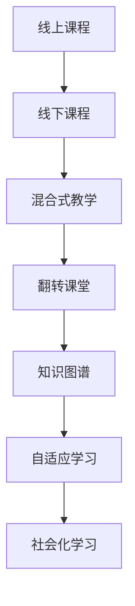

                 

## 1. 背景介绍

在快速发展的互联网时代，知识的获取和传播方式正在发生深刻变革。传统线下培训受到时间和空间的限制，难以大规模推广，而线上教育以其灵活、便捷的特性受到越来越多人的青睐。然而，线上课程的内容质量往往参差不齐，很多课程难以满足学员的实际需求。因此，如何打造优质、高效、贴近实际的线上线下融合课程，成为了当下教育领域的重要议题。

### 1.1 问题由来
随着互联网的普及和科技的进步，知识付费市场呈现蓬勃发展的态势。在线课程平台如雨后春笋般涌现，各种付费课程层出不穷。然而，众多在线课程质量参差不齐，内容过于泛泛而谈，难以真正帮助学员提升实际技能，导致学习效果不尽如人意。

为了解决这些问题，有必要将线下培训的优质资源与线上教育相结合，打造出线上线下融合的课程，既能提供高水平、高质量的学习体验，又能克服线下培训的时间和空间限制，真正实现教育资源的均衡分配。

### 1.2 问题核心关键点
打造线上线下融合课程的核心在于：
1. **课程内容设计**：将线下课程的内容高质量地转化为线上课程，确保线上课程同样具有深度和广度。
2. **教学资源整合**：充分利用线下的教学资源，如名师、实验室、实践机会等，补充线上课程的不足。
3. **教学模式创新**：结合线上和线下教学的优点，探索创新的教学模式，提升学习效果。
4. **学习体验优化**：通过技术手段，如人工智能辅助、互动式教学、实时反馈等，优化学习体验。

本文将从课程内容设计、教学资源整合、教学模式创新和学习体验优化四个方面，系统介绍如何打造线上线下融合课程。

## 2. 核心概念与联系

### 2.1 核心概念概述

为更好地理解线上线下融合课程的构建，本节将介绍几个关键概念：

- **线上课程**：通过互联网平台提供的课程，学员可以在任何时间、任何地点进行学习，具有灵活性和便捷性。
- **线下课程**：在实体场所进行的面对面授课，能够提供互动性强、情感交流丰富的学习体验。
- **混合式教学**：将线上和线下课程相结合，取长补短，提升整体学习效果。
- **翻转课堂**：在课前让学生预习线上课程内容，课上通过讨论和实践进行深入学习，优化教学结构。
- **知识图谱**：以结构化的方式表示知识的关联和层次，帮助学员系统地掌握知识。
- **自适应学习**：根据学员的学习进度和能力，自动调整学习内容和难度，实现个性化教学。
- **社会化学习**：通过社区、论坛等形式，促进学员之间的交流和协作，增强学习效果。

这些概念之间的联系可以通过以下Mermaid流程图来展示：



这个流程图展示了几大核心概念之间的相互关系：

1. 线上课程和线下课程相结合，构成了混合式教学。
2. 翻转课堂是一种特定的混合式教学模式，通过课前预习和课上实践，优化教学结构。
3. 知识图谱、自适应学习和社会化学习是混合式教学的重要组成部分，提升整体学习效果。

## 3. 核心算法原理 & 具体操作步骤

### 3.1 算法原理概述

打造线上线下融合课程，本质上是一种多模态学习过程。其核心思想是：通过线上课程提供知识传授和技能训练，线下课程进行实践验证和互动交流，两者相结合，提升学习效果。

形式化地，假设线上课程提供的知识表示为 $K$，线下课程提供的实践机会为 $P$。则混合式教学的目标是找到最优的知识表示 $K^*$ 和实践机会 $P^*$，使得学员的学习效果最大化：

$$
K^*, P^* = \mathop{\arg\min}_{K,P} \mathcal{L}(K,P)
$$

其中 $\mathcal{L}$ 为评估学员学习效果的目标函数，用于衡量 $K$ 和 $P$ 对学习效果的贡献。

### 3.2 算法步骤详解

线上线下融合课程的构建一般包括以下几个关键步骤：

**Step 1: 设计线上课程内容**
- 确定课程目标和教学内容，将线下课程的内容高质量地转化为线上课程。
- 利用多媒体技术，如视频、音频、动画等，丰富线上课程的形式。
- 引入知识图谱、自适应学习技术，提升线上课程的互动性和个性化程度。

**Step 2: 整合线下教学资源**
- 选择优质的线下课程，补充线上课程的不足。
- 利用线下教学场所和设施，提供实验、实践机会。
- 聘请名师授课，提升课程的质量和影响力。

**Step 3: 优化教学模式**
- 探索翻转课堂、项目导向等教学模式，提升课堂互动和实践能力。
- 引入社会化学习工具，如社区、论坛等，促进学员之间的交流和协作。

**Step 4: 学习体验优化**
- 利用人工智能技术，如自然语言处理、图像识别等，优化学员的学习体验。
- 引入实时反馈和评估机制，及时调整教学内容和策略。
- 设计互动式学习工具，如虚拟实验平台、在线编程环境等，提升学习效果。

**Step 5: 持续改进**
- 定期收集学员反馈，评估课程效果。
- 根据反馈调整课程内容和教学策略，不断改进。
- 引入新的教学资源和技术，保持课程的先进性和前瞻性。

以上是线上线下融合课程的一般流程。在实际应用中，还需要根据具体课程的特点，对各个环节进行优化设计，以进一步提升学习效果。

### 3.3 算法优缺点

线上线下融合课程具有以下优点：
1. 灵活便捷。学员可以随时随地进行学习，提升学习效率。
2. 互动性强。通过线下课程的互动，提升学习体验。
3. 教学资源丰富。线下课程提供实验、实践机会，补充线上课程的不足。
4. 个性化教学。利用自适应学习技术，根据学员的进度和能力调整教学内容。
5. 学习效果显著。通过线上线下相结合，提升整体学习效果。

同时，这种课程形式也存在一些局限性：
1. 前期准备复杂。需要设计高质量的线上课程内容，整合线下资源。
2. 技术要求高。需要引入多种技术手段，提升教学效果。
3. 成本较高。开发高质量课程和教学资源需要大量投入。
4. 学生自律性要求高。线上课程需要学生具备较强的自律性，否则效果可能不佳。

尽管存在这些局限性，但线上线下融合课程依然是大势所趋，其灵活性、互动性和教学效果，使其在教育领域具有广阔的应用前景。

### 3.4 算法应用领域

线上线下融合课程在教育领域已经得到了广泛的应用，覆盖了几乎所有学科，例如：

- **计算机科学**：通过在线编程环境和虚拟实验平台，提升编程技能和实践能力。
- **工程设计**：利用线上课程和线下实验室相结合，进行设计思维和实践训练。
- **语言学习**：结合线上课程和线下交流，提升语言应用能力和文化素养。
- **艺术设计**：通过线上课程和线下实践，提升创意和表现力。
- **商业管理**：利用线上课程和线下案例分析，提升管理能力和决策水平。

除了这些经典领域外，线上线下融合课程还在更多场景中得到应用，如职业培训、医学教育、军事训练等，为教育提供了新的发展方向。

## 4. 数学模型和公式 & 详细讲解 & 举例说明

### 4.1 数学模型构建

本节将使用数学语言对线上线下融合课程的学习效果进行建模和评估。

记线上课程提供的知识表示为 $K$，线下课程提供的实践机会为 $P$，学员的学习效果为 $L$。则混合式教学的目标函数可以表示为：

$$
\mathcal{L}(K,P) = f(K) + g(P) + h(K,P)
$$

其中 $f(K)$ 为线上课程的知识传授效果，$g(P)$ 为线下课程的实践验证效果，$h(K,P)$ 为两者相结合的综合效果。

### 4.2 公式推导过程

以下我们以编程课程为例，推导混合式教学的目标函数及其梯度计算公式。

假设课程目标为教会学员使用某种编程语言编写程序。线上课程提供的视频、在线编程环境等知识表示 $K$，线下课程的实验、编程比赛等实践机会 $P$。则学员的学习效果 $L$ 可以表示为：

$$
L = (1-a)f(K) + a[p(x)|x \in P]
$$

其中 $a$ 为线下实践占总学习时间的比例，$x$ 为编程作业或比赛等实践任务，$p(x)$ 为完成 $x$ 的效率，即完成 $x$ 所需的时间。

将目标函数 $\mathcal{L}$ 对 $K$ 和 $P$ 分别求导，得：

$$
\frac{\partial \mathcal{L}}{\partial K} = (1-a)\frac{\partial f(K)}{\partial K} + \sum_{x \in P} \frac{p(x)}{T}\frac{\partial g(x)}{\partial K}
$$

$$
\frac{\partial \mathcal{L}}{\partial P} = \sum_{x \in P} \frac{p(x)}{T}\frac{\partial g(x)}{\partial P}
$$

其中 $T$ 为总学习时间，$\frac{\partial f(K)}{\partial K}$ 和 $\frac{\partial g(x)}{\partial K}$ 分别表示线上课程和线下课程对知识传授效果的梯度。

在得到目标函数的梯度后，即可带入优化算法进行迭代优化，不断调整 $K$ 和 $P$，使得混合式教学的学习效果最大化。

### 4.3 案例分析与讲解

假设有一个面向大学生的编程课程，线上课程提供的视频讲解和在线编程环境，线下课程提供实验室和编程比赛。课程的目标是让学生掌握 Python 编程语言，能够编写简单的小游戏和数据处理程序。

**Step 1: 设计线上课程内容**
- 视频讲解：录制一系列讲解 Python 基础语法、常用库和算法的视频，确保内容的深度和广度。
- 在线编程环境：搭建在线编程平台，供学生随时练习编程。
- 知识图谱：利用知识图谱技术，将课程内容结构化，方便学生系统学习。

**Step 2: 整合线下教学资源**
- 选择优质实验室：与高校实验室合作，提供高质量的实验环境和设施。
- 邀请名师授课：邀请知名编程专家授课，提升课程质量和影响力。
- 组织编程比赛：定期举办编程比赛，提升学生的实践能力。

**Step 3: 优化教学模式**
- 翻转课堂：课上讨论编程问题和算法设计，课前预习视频讲解。
- 互动式学习：利用在线编程平台和编程社区，促进学生之间的交流和协作。

**Step 4: 学习体验优化**
- 实时反馈：通过在线编程平台和编程社区，提供实时代码审核和反馈，帮助学生及时改进。
- 案例分析：利用真实项目和案例，提升学生的实际应用能力。

## 5. 项目实践：代码实例和详细解释说明

### 5.1 开发环境搭建

在进行混合式教学的开发实践前，我们需要准备好开发环境。以下是使用Python进行开发的环境配置流程：

1. 安装Anaconda：从官网下载并安装Anaconda，用于创建独立的Python环境。

2. 创建并激活虚拟环境：
```bash
conda create -n pymix-env python=3.8 
conda activate pymix-env
```

3. 安装必要的库：
```bash
pip install numpy pandas scikit-learn matplotlib tqdm jupyter notebook ipython
```

4. 安装在线编程平台和知识图谱库：
```bash
pip install gitpython py2neo
```

完成上述步骤后，即可在`pymix-env`环境中开始混合式教学的开发实践。

### 5.2 源代码详细实现

下面我们以编程课程为例，给出使用Python进行混合式教学的完整代码实现。

首先，定义混合式教学的总体框架：

```python
from flask import Flask, render_template, request
from py2neo import Graph
import git

app = Flask(__name__)

# 连接知识图谱
graph = Graph('http://localhost:7474/db/data/', user='neo4j', password='password')

# 定义课程结构
course = {
    'name': 'Python编程',
    'videos': ['video1', 'video2', 'video3'],
    'practicals': ['practical1', 'practical2', 'practical3']
}

# 加载课程内容
def load_content(video):
    # 加载视频内容
    video_content = '在线课程内容...'
    return video_content

# 评估实践效果
def evaluate_practical(practical):
    # 评估实践效果
    practical_result = '实践效果...'
    return practical_result

# 提供课程内容
@app.route('/')
def index():
    return render_template('index.html', course=course)

# 提供视频内容
@app.route('/video/<video_id>')
def video(video_id):
    video_content = load_content(video_id)
    return render_template('video.html', video_content=video_content)

# 提供实践内容
@app.route('/practical/<practical_id>')
def practical(practical_id):
    practical_result = evaluate_practical(practical_id)
    return render_template('practical.html', practical_result=practical_result)

if __name__ == '__main__':
    app.run(debug=True)
```

然后，定义知识图谱操作：

```python
# 定义课程节点
course_node = graph.create('课程', {'name': course['name']})

# 定义视频节点
for video_id in course['videos']:
    video_node = graph.create('视频', {'id': video_id})
    graph.create('课程-视频关系', {'课程': course_node, '视频': video_node})

# 定义实践节点
for practical_id in course['practicals']:
    practical_node = graph.create('实践', {'id': practical_id})
    graph.create('课程-实践关系', {'课程': course_node, '实践': practical_node})
```

最后，启动服务并调试：

```python
if __name__ == '__main__':
    app.run(debug=True)
```

在上述代码中，我们使用了Flask框架搭建了一个简单的混合式教学平台。该平台提供课程概览、视频内容和实践评估，学员可以在线观看视频、完成实践任务，并通过知识图谱查看课程结构和内容关系。

### 5.3 代码解读与分析

让我们再详细解读一下关键代码的实现细节：

**Flask应用定义**：
- 初始化Flask应用，连接知识图谱。
- 定义课程结构，包括视频和实践任务。
- 提供课程概览、视频和实践内容的网页。

**知识图谱操作**：
- 创建课程节点和视频节点，表示课程和视频内容的关系。
- 创建实践节点，表示课程和实践任务的关系。

**Flask路由**：
- 首页：提供课程概览。
- 视频播放：加载视频内容并显示。
- 实践评估：评估实践效果并显示。

**服务启动**：
- 启动Flask应用，提供Web服务。

这个Flask应用只是一个基础示例，实际上，在真实的混合式教学平台中，还需要添加更多功能，如在线讨论、实时反馈、学生管理系统等。开发者可以根据自己的需求，进一步扩展平台的性能和功能。

## 6. 实际应用场景

### 6.1 智能制造教育

在智能制造领域，混合式教学可以极大地提升学生的实践能力和创新思维。传统教育往往偏重理论知识，忽视实践技能的培养。通过线上课程提供基础理论知识，线下课程进行实际项目和实验，学生能够在真实的生产环境中锻炼技能，提升实际操作能力。

具体而言，可以设计涵盖智能制造各个环节的课程，如机械设计、电子电路、工业控制等。线上课程提供基础知识的视频讲解和实验模拟，线下课程提供实验台和生产线，让学生在实际操作中学习和应用。

### 6.2 远程医疗教育

在远程医疗教育中，混合式教学可以弥补线上课程互动不足的缺陷。传统医疗教育依赖面对面的教学互动，难以实现大规模远程教学。通过线上课程提供基础医学知识，线下课程进行病例讨论和实验操作，学生能够在互动中深入理解医学理论，提高临床技能。

具体而言，可以设计涵盖医学基础知识、临床技能和实际病例的课程。线上课程提供视频讲解和互动讨论，线下课程进行病例分析和实验操作，学生通过实战练习提升临床能力。

### 6.3 农业科技教育

在农业科技教育中，混合式教学可以结合线上课程和实地调研，提升学生的实践能力和科学素养。传统农业教育往往偏重理论知识，忽视实践技能的培养。通过线上课程提供基础农业知识，线下课程进行田间调研和实践操作，学生能够在真实的农业环境中锻炼技能，提升实际操作能力。

具体而言，可以设计涵盖农业基础知识、种植技术、农业机械等课程。线上课程提供基础知识的视频讲解和实验模拟，线下课程进行田间调研和实践操作，学生通过实际操作学习农业知识。

### 6.4 未来应用展望

随着混合式教学的不断发展，其应用领域将更加广泛，带来更加深远的教育变革。

在智慧教育领域，混合式教学将成为主流，提供更加灵活、个性化的学习体验。通过线上线下相结合，学生可以在任何时间和地点进行学习，最大程度发挥自主学习的潜力。

在终身学习领域，混合式教学可以打破年龄和地域的限制，提供终身学习的平台。通过线上课程和线下培训的有机结合，学生可以随时学习新知识，保持知识和技能的更新。

在职业培训领域，混合式教学可以提供更加实用的技能培训，帮助学员快速掌握职场所需技能。通过线上课程提供基础知识，线下课程进行实践操作，学员能够在短时间内掌握实用的职业技能。

总之，混合式教学具有广阔的发展前景，必将成为未来教育的重要方向。

## 7. 工具和资源推荐

### 7.1 学习资源推荐

为了帮助开发者系统掌握混合式教学的理论基础和实践技巧，这里推荐一些优质的学习资源：

1. **《混合式学习:基于实践的教学模式》**：系统介绍混合式教学的基本概念和实践方法，适用于各类教育领域的混合式教学开发。
2. **MOOCs平台**：如Coursera、edX等，提供各类优质课程，涵盖在线课程和线下课程的结合方式。
3. **在线教育工具**：如Canvas、Moodle等，提供课程管理和评估功能，提升混合式教学的管理效率。
4. **知识图谱构建工具**：如Neo4j、Gephi等，用于构建和管理知识图谱，提供结构化的知识表示。
5. **社会化学习平台**：如Edmodo、ClassCentral等，提供互动交流功能，促进学生之间的协作和交流。

通过对这些资源的学习实践，相信你一定能够快速掌握混合式教学的精髓，并用于解决实际的课程开发问题。

### 7.2 开发工具推荐

高效的开发离不开优秀的工具支持。以下是几款用于混合式教学开发的常用工具：

1. **Flask框架**：简单易用的Web框架，适用于混合式教学平台的开发。
2. **Python编程语言**：灵活便捷的编程语言，适用于混合式教学内容的实现。
3. **Git版本控制**：用于版本管理和协作开发，确保混合式教学内容的稳定性和可控性。
4. **Py2neo库**：用于连接和操作知识图谱，提供结构化的知识表示。
5. **Python Scikit-learn**：用于数据处理和机器学习，提升混合式教学的智能化水平。

合理利用这些工具，可以显著提升混合式教学的开发效率，加快创新迭代的步伐。

### 7.3 相关论文推荐

混合式教学技术的发展源于学界的持续研究。以下是几篇奠基性的相关论文，推荐阅读：

1. **《混合式学习:一种新兴的教育模式》**：介绍混合式学习的定义、理论基础和实践方法，对混合式教学的各个环节进行深入探讨。
2. **《翻转课堂:一种新的混合式教学模式》**：探讨翻转课堂的教学模式和实践效果，适合混合式教学的实践和优化。
3. **《知识图谱在混合式教学中的应用》**：介绍知识图谱的基本概念和在混合式教学中的应用，帮助理解结构化的知识表示。
4. **《基于社会化学习的混合式教学模型》**：探讨社会化学习的基本原理和在混合式教学中的应用，适合混合式教学的社交互动优化。
5. **《混合式教学的效果评估方法》**：介绍混合式教学效果的评估方法，帮助评估和改进混合式教学的各个环节。

这些论文代表了大混合式教学的发展脉络。通过学习这些前沿成果，可以帮助研究者把握学科前进方向，激发更多的创新灵感。

## 8. 总结：未来发展趋势与挑战

### 8.1 总结

本文对混合式教学进行了全面系统的介绍。首先阐述了混合式教学的背景和意义，明确了混合式教学在提升学习效果、灵活性和互动性方面的独特价值。其次，从课程内容设计、教学资源整合、教学模式创新和学习体验优化四个方面，详细讲解了混合式教学的实现步骤和关键技术。最后，介绍了混合式教学在多个行业领域的应用前景，并提出了未来的发展方向和面临的挑战。

通过本文的系统梳理，可以看到，混合式教学正在成为教育领域的重要趋势，为大规模、灵活和互动性的教学提供了新的解决方案。其在实际应用中，已经展现出了显著的优势和效果，未来必将在更多领域发挥更大的作用。

### 8.2 未来发展趋势

展望未来，混合式教学技术将呈现以下几个发展趋势：

1. **技术创新**：随着AI、大数据、区块链等技术的不断进步，混合式教学将更加智能化和个性化。通过AI技术优化课程内容，通过大数据分析提升学习效果，通过区块链技术确保数据的可信性。
2. **应用多样化**：混合式教学将从传统的教育领域，扩展到职业培训、企业培训、终身学习等多个领域，为不同人群提供定制化的学习体验。
3. **泛在化教育**：混合式教学将打破地域和时间的限制，通过移动设备和虚拟现实技术，提供随时随地、灵活便捷的学习体验。
4. **社交化学习**：混合式教学将更加注重社交互动，通过社区、论坛等形式，促进学生之间的交流和协作，提升学习效果。
5. **游戏化学习**：混合式教学将引入游戏化元素，通过任务导向、奖励机制等，提升学生的学习兴趣和参与度。

这些趋势凸显了混合式教学的广阔前景。随着技术的不断进步和应用场景的不断拓展，混合式教学必将成为教育领域的重要方向。

### 8.3 面临的挑战

尽管混合式教学已经取得了显著的成就，但在迈向更加智能化、普适化应用的过程中，仍面临诸多挑战：

1. **技术成本高**：混合式教学的实施需要高成本的技术投入，包括开发平台、购买设备、部署服务器等，这对资源有限的学校和企业来说是一个不小的负担。
2. **质量保证难**：混合式教学的质量评估和效果分析较难，如何确保线上课程和线下课程的有效结合，保证学习效果，仍是一个难题。
3. **学生自律性不足**：线上课程对学生的自律性要求较高，需要学生具备较强的自我管理能力，否则学习效果可能不佳。
4. **隐私和数据安全**：混合式教学涉及大量学生的个人信息和数据，如何保障数据隐私和安全，是一个重要的课题。
5. **课程内容和资源的丰富性**：混合式教学需要丰富的课程内容和多样化的教学资源，这对于资源有限的学校和企业来说是一个挑战。

这些挑战需要各方共同努力，通过技术创新和政策引导，逐步解决。只有这样，混合式教学才能真正实现普惠教育的目标，惠及更多的学生。

### 8.4 研究展望

面对混合式教学面临的诸多挑战，未来的研究需要在以下几个方面寻求新的突破：

1. **技术创新**：开发更高效、更智能的混合式教学平台，提升课程内容的质量和学生的学习体验。
2. **质量评估**：引入科学的混合式教学质量评估方法，确保课程内容的有效性和学生的学习效果。
3. **学生自律性提升**：通过技术手段和心理指导，提升学生的自律性和自我管理能力，确保混合式教学的顺利实施。
4. **数据隐私保护**：通过数据加密、匿名化等技术手段，保障学生数据隐私和数据安全。
5. **资源丰富化**：构建丰富的课程内容和多样化的教学资源库，提供一站式的混合式教学解决方案。

这些研究方向的探索，必将引领混合式教学技术迈向更高的台阶，为构建公平、高效、可持续的教育体系铺平道路。

## 9. 附录：常见问题与解答

**Q1: 混合式教学如何提升学习效果？**

A: 混合式教学通过线上课程和线下课程相结合，可以最大化地发挥两者的优势。线上课程提供灵活便捷的学习方式，线下课程提供互动性强、实践性强的学习体验，两者相结合，可以提升学习效果。

**Q2: 混合式教学的核心是什么？**

A: 混合式教学的核心在于线上课程和线下课程的有机结合，通过两者相结合，提升学习效果。其核心要素包括课程内容设计、教学资源整合、教学模式创新和学习体验优化。

**Q3: 混合式教学的实施难点是什么？**

A: 混合式教学的实施难点在于技术成本高、质量保证难、学生自律性不足、隐私和数据安全等问题。需要各方共同努力，通过技术创新和政策引导，逐步解决。

**Q4: 混合式教学有哪些实际应用场景？**

A: 混合式教学适用于教育、职业培训、企业培训、终身学习等多个领域，具有广阔的应用前景。具体应用场景包括编程课程、智能制造教育、远程医疗教育、农业科技教育等。

**Q5: 混合式教学的未来发展方向是什么？**

A: 混合式教学的未来发展方向包括技术创新、应用多样化、泛在化教育、社交化学习和游戏化学习等。随着技术的不断进步和应用场景的不断拓展，混合式教学必将成为教育领域的重要方向。

---

作者：禅与计算机程序设计艺术 / Zen and the Art of Computer Programming

