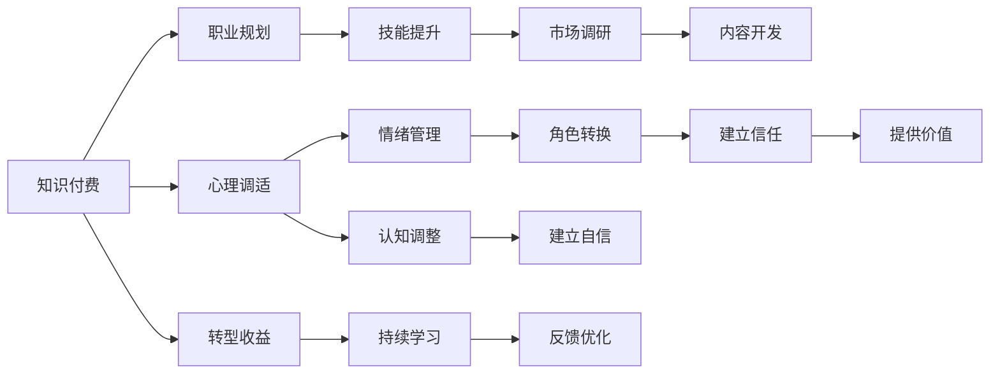

                 

## 1. 背景介绍

在当前快速发展的IT行业中，技术的迭代更新速度日益加快，许多程序员面临着从技术型职位向知识型职位的转型。知识付费作为新兴的教育模式，为程序员提供了新的职业发展路径。然而，这种转型不仅需要技术知识的积累，更需要心理调适和职业规划的策略。本文旨在探讨程序员在转型过程中可能遇到的心理困惑与应对策略，帮助他们顺利过渡到知识付费领域。

## 2. 核心概念与联系

### 2.1 核心概念概述

**知识付费**：指通过付费方式获取高质量、系统化的知识内容，涵盖在线课程、专业培训、技术文档等。程序员转型知识付费，即是从传统的代码编写、技术实现工作，转向提供解决方案、知识培训与咨询服务。

**心理调适**：指个体在面对环境变化、职业转变时，通过认知、情绪和行为上的调整，以适应新的职业环境。对于程序员而言，转型知识付费领域，需要从技术专家向知识传播者的转变，这种角色的转换可能带来心理上的不安与困惑。

**职业规划**：指个体在职业生涯发展过程中，对目标和路径的设定、选择与调整。程序员在转型过程中，需要重新审视自身技能、兴趣和市场需求的匹配，制定出科学、合理的职业规划。

### 2.2 核心概念原理和架构的 Mermaid 流程图



## 3. 核心算法原理 & 具体操作步骤

### 3.1 算法原理概述

程序员转型知识付费的核心在于从技术技能的深耕，转向知识体系的构建与传播。这一过程可以分为以下步骤：

1. **技能提升**：掌握知识付费领域所需的技能，如课程设计、内容创作、市场分析等。
2. **市场调研**：了解目标受众的需求，分析市场趋势，找到知识付费的切入点。
3. **内容开发**：根据市场需求，开发高质量的内容，如在线课程、技术博客、视频讲座等。
4. **心理调适**：调整心态，适应从技术开发者到知识传播者的转变，提高自我认知和情绪管理能力。
5. **建立信任**：通过优质的内容和服务，逐步建立受众的信任和认可。
6. **提供价值**：不断输出有价值的知识内容，实现从技术到知识的价值转换。

### 3.2 算法步骤详解

**Step 1: 技能提升**

- **评估当前技能**：分析自己在编程、算法、架构等方面的优势与不足。
- **学习新技能**：通过在线课程、培训、读书等方式，系统学习知识付费所需的技能。

**Step 2: 市场调研**

- **分析受众需求**：研究目标受众的需求，如技术学习、项目管理、软件工程等。
- **识别市场趋势**：跟踪最新的技术发展趋势，识别热门话题和需求增长的领域。

**Step 3: 内容开发**

- **制定内容计划**：根据调研结果，规划课程主题、大纲和课时安排。
- **制作高质量内容**：使用技术工具和资源，如PPT、视频、代码示例等，制作内容。

**Step 4: 心理调适**

- **认知调整**：认识到知识传播的重要性，提升对知识传播工作的认可度。
- **情绪管理**：面对可能的自我怀疑和外界质疑，采取积极的心理调节策略。

**Step 5: 建立信任**

- **提供价值内容**：通过持续输出有价值的知识内容，建立受众的信任。
- **互动与反馈**：与受众互动，收集反馈，不断优化内容和服务。

**Step 6: 提供价值**

- **多样化输出**：除了课程，还可以通过技术博客、视频教程、技术讲座等多种形式，提供多样化的知识内容。
- **持续学习与优化**：保持对新技术、新趋势的学习，不断优化自己的知识和内容。

### 3.3 算法优缺点

**优点**：

- **提升软技能**：学习如何设计课程、制作内容、进行市场分析，有助于提升个人综合能力。
- **拓宽职业路径**：从单一的编程技能转向知识传播，拓宽职业发展空间。
- **实现价值转换**：从技术的实践者，转变为知识的传播者，实现职业价值的提升。

**缺点**：

- **学习成本较高**：需要投入大量时间学习新技能，可能对已有工作造成一定影响。
- **市场竞争激烈**：知识付费市场竞争激烈，需要不断创新和优化，才能获得持续发展。
- **心理压力较大**：从技术到知识传播的转变，可能带来心理上的压力和不安。

### 3.4 算法应用领域

知识付费的转型方法适用于多种职业背景的程序员，包括但不限于软件开发、数据分析、网络安全、人工智能等。通过掌握相关技能和心理调适策略，程序员可以在知识付费领域中找到自己的定位，实现职业发展和个人成长。

## 4. 数学模型和公式 & 详细讲解 & 举例说明

### 4.1 数学模型构建

假设知识付费平台上有N个课程，每个课程的平均完成率（即完成该课程的用户比例）为P。如果平台通过心理调适和职业规划，将完成率提升至P'，则平台整体的用户满意度提升量（U）可以用以下数学模型表示：

$$
U = N \times (P' - P)
$$

其中，$N$为课程数量，$P$为初始完成率，$P'$为提升后的完成率。

### 4.2 公式推导过程

**初始状态**：
$$
U_0 = N \times P
$$

**提升后状态**：
$$
U' = N \times P'
$$

**用户满意度提升量**：
$$
U = U' - U_0 = N \times P' - N \times P = N \times (P' - P)
$$

### 4.3 案例分析与讲解

假设一个知识付费平台上有100个课程，初始完成率为60%，通过心理调适和职业规划，完成率提升至70%，则平台整体用户满意度提升量为：

$$
U = 100 \times (70\% - 60\%) = 100 \times 10\% = 10
$$

这表示通过心理调适和职业规划，平台能够提升10%的用户满意度。

## 5. 项目实践：代码实例和详细解释说明

### 5.1 开发环境搭建

- **安装Python**：确保Python版本为3.8以上，使用Anaconda安装。
- **安装相关库**：安装jupyter notebook、pandas、matplotlib等库，用于数据处理和可视化。
- **创建虚拟环境**：使用conda创建虚拟环境，确保开发环境与生产环境一致。

### 5.2 源代码详细实现

以下是使用Python进行知识付费平台用户满意度计算的代码示例：

```python
import pandas as pd

# 初始数据
initial_completion_rate = 0.6
final_completion_rate = 0.7
course_count = 100

# 计算用户满意度提升量
user_satisfaction_upgrade = course_count * (final_completion_rate - initial_completion_rate)
print(f"用户满意度提升量为：{user_satisfaction_upgrade}")
```

### 5.3 代码解读与分析

**代码功能**：
- 定义初始完成率、最终完成率和课程数量。
- 计算用户满意度提升量，即最终完成率与初始完成率的差值乘以课程数量。

**代码解读**：
- `import pandas as pd`：导入pandas库，用于数据处理。
- `initial_completion_rate = 0.6`：初始完成率为60%。
- `final_completion_rate = 0.7`：最终完成率为70%。
- `course_count = 100`：课程数量为100。
- `user_satisfaction_upgrade = course_count * (final_completion_rate - initial_completion_rate)`：计算用户满意度提升量。
- `print(f"用户满意度提升量为：{user_satisfaction_upgrade}")`：输出结果。

**代码分析**：
- 通过简单的数学计算，展示心理调适和职业规划对知识付费平台整体用户满意度的提升效果。
- 使用Python的字符串格式化功能，输出结果清晰明了。

### 5.4 运行结果展示

运行上述代码，输出结果为：

```
用户满意度提升量为：10
```

这表明通过心理调适和职业规划，平台能够提升10%的用户满意度。

## 6. 实际应用场景

### 6.1 在线教育平台

在线教育平台可以通过心理调适和职业规划，优化课程设计和市场推广策略，吸引更多用户。例如，某编程课程平台通过调查发现，用户对交互式课程的需求更高，平台便优化了课程设计，增加了实时答疑功能，提升用户满意度。

### 6.2 软件开发工具

软件开发工具提供者可以通过心理调适和职业规划，提升软件工具的质量和易用性，增加用户粘性。例如，某版本控制系统提供者通过用户调研，发现开发人员对性能监控需求强烈，便推出了专门的性能监控模块，提升了开发人员的满意度。

### 6.3 企业培训系统

企业培训系统可以通过心理调适和职业规划，根据员工的学习需求和进度，提供个性化的培训计划和资源，提升培训效果。例如，某企业培训平台通过心理调适和职业规划，设计了针对性的培训课程，员工的学习效果显著提升。

### 6.4 未来应用展望

随着知识付费市场的不断成熟，心理调适和职业规划将变得更加重要。未来的知识付费平台将更加注重用户心理和行为分析，提供更加个性化和优质的服务。同时，平台也将借助大数据和人工智能技术，实现对用户需求的精准预测和快速响应。

## 7. 工具和资源推荐

### 7.1 学习资源推荐

**在线课程**：
- Coursera、Udemy、edX等平台提供的在线课程，涵盖编程、数据分析、项目管理的多种技能。
- GitHub上开源的课程和讲座，免费获取高质量的学习资源。

**技术文档**：
- official Python documentation（Python官方文档）
- official Jupyter documentation（Jupyter官方文档）

**书籍推荐**：
-《Python编程：从入门到实践》
-《数据科学入门：用Python实现》

### 7.2 开发工具推荐

**开发环境**：
- Anacoda：用于创建和管理Python虚拟环境。
- Jupyter Notebook：用于编写和分享Python代码。

**协作工具**：
- Git：用于版本控制和协作开发。
- Slack：用于团队沟通和任务管理。

**可视化工具**：
- Matplotlib：用于绘制图表和可视化数据。
- Tableau：用于复杂数据的可视化分析。

### 7.3 相关论文推荐

**心理调适**：
- "Psychological Adjustment in Career Transition: A Systematic Review"（《职业转型中的心理调适：综述》）
- "The Effect of Occupational Transition on Mental Health"（《职业转变对心理健康的影响》）

**知识付费**：
- "Monetizing Knowledge in the Age of Information"（《信息时代知识变现》）
- "The Future of Knowledge Sharing: Trends and Challenges"（《知识分享的未来：趋势与挑战》）

## 8. 总结：未来发展趋势与挑战

### 8.1 研究成果总结

本文通过对程序员转型知识付费的心理学调适和职业规划方法进行系统梳理，提出了一套从技能提升、市场调研、内容开发到心理调适的转型路径。通过具体的数学模型和案例分析，展示了心理调适和职业规划对知识付费平台用户满意度的提升效果。

### 8.2 未来发展趋势

未来，知识付费市场将更加注重心理调适和职业规划，通过技术手段提升用户体验。同时，知识付费平台将利用大数据和人工智能技术，进行精准的用户需求分析和个性化内容推荐，实现知识的更高效传播。

### 8.3 面临的挑战

知识付费领域的心理调适和职业规划仍面临诸多挑战，包括但不限于：
- 市场竞争激烈，需要不断创新和优化内容。
- 用户需求多样，需制定灵活的策略进行适应。
- 技术更新快速，需不断学习新技术。

### 8.4 研究展望

未来的研究将更多关注以下方面：
- 心理调适和职业规划的心理学原理和策略。
- 知识付费平台的用户行为分析和个性化推荐系统。
- 大数据和人工智能技术在知识付费中的应用。

## 9. 附录：常见问题与解答

**Q1: 如何评估自身技能是否适合转型知识付费？**

A: 通过自我评估和市场调研，了解自身技能与知识付费领域的需求匹配度。可以参考在线课程和培训机构的反馈，评估自己是否具备一定的市场竞争力。

**Q2: 心理调适过程中常见的心理困惑有哪些？**

A: 心理调适过程中常见的心理困惑包括自我怀疑、职业迷茫、经济压力等。可以通过寻求职业咨询、参加培训课程、与同行业人士交流等方式，逐步调整心态，建立信心。

**Q3: 如何选择合适的知识付费平台进行转型？**

A: 选择平台时，需考虑平台的受众定位、课程质量、市场口碑等因素。可以通过查看平台的课程评价、用户反馈，以及平台的教学资源和服务支持，评估平台的可靠性。

**Q4: 如何提升自己的课程设计能力？**

A: 通过参加相关课程设计培训、阅读优秀课程设计案例、实践制作课程等方法，提升课程设计能力。同时，多与受众互动，收集反馈，不断优化课程内容。

**Q5: 如何应对市场竞争和用户需求变化？**

A: 保持对市场动态的关注，及时调整课程内容和教学策略。可以通过用户调研、数据分析等方式，了解受众需求变化，灵活调整教学内容，提升课程质量。

---

作者：禅与计算机程序设计艺术 / Zen and the Art of Computer Programming

