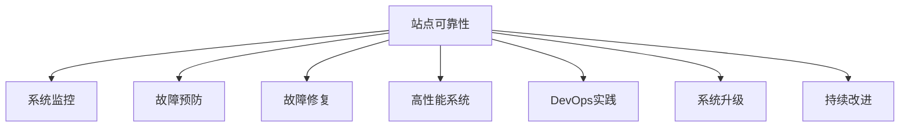

                 

# 站点可靠性工程（SRE）实践：保持系统可靠

> 关键词：站点可靠性, SRE, 系统监控, 故障预防, 故障修复, 高性能系统, DevOps, 系统升级, 持续改进

## 1. 背景介绍

### 1.1 问题由来
在当今数字化时代，网站和在线服务已经成为企业和个人获取信息和进行互动的重要平台。然而，随着用户访问量的激增和系统复杂度的提升，确保网站的可靠性和高性能变得日益困难。系统崩溃、服务中断、数据丢失等问题频发，给用户和业务运营带来了巨大的负面影响。

### 1.2 问题核心关键点
站点可靠性工程（Site Reliability Engineering, SRE）是一个新兴的领域，专注于通过工程实践和工具，确保系统的可靠性和稳定性。其核心在于结合开发和运维的角色，共同解决系统运行中的问题。SRE实践包括但不限于系统监控、故障预防、故障修复、高性能系统设计、DevOps实践、系统升级和持续改进等方面。

### 1.3 问题研究意义
研究SRE实践，对于提升网站和在线服务的可靠性，保障业务连续性和用户体验，具有重要意义：

1. **减少停机时间**：通过有效的监控和预警，及时发现并解决故障，减少服务中断的频率和持续时间。
2. **提升用户体验**：通过性能优化和故障快速修复，确保用户能够稳定、快速地访问网站。
3. **提高业务价值**：可靠的系统和快速响应的故障修复能够提升企业的品牌形象，增加用户粘性，创造更高的商业价值。
4. **加速开发进程**：SRE实践中的DevOps理念，将开发和运维紧密结合，能够加快系统迭代和上线速度，缩短产品上市周期。
5. **推动技术创新**：通过解决系统中的挑战，促进技术积累和创新，不断提升系统的技术水平和竞争力。

## 2. 核心概念与联系

### 2.1 核心概念概述

为更好地理解SRE实践，本节将介绍几个密切相关的核心概念：

- **站点可靠性（Site Reliability）**：指系统在指定时间内稳定运行，不发生故障的概率。站点可靠性的度量通常包括系统可用性（Uptime）、故障时间（Downtime）和修复时间（MTTR）等指标。
- **系统监控（System Monitoring）**：通过实时收集和分析系统运行数据，及时发现系统中的问题，并进行预警和处理。系统监控工具包括Prometheus、Grafana、ELK Stack等。
- **故障预防（Fault Prevention）**：通过设计系统的冗余机制、自动化测试和预防性维护，提前识别和解决潜在的问题。故障预防技术包括故障注入测试、自动化部署、配置管理等。
- **故障修复（Fault Recovery）**：在故障发生后，快速定位并解决问题，恢复系统的正常运行。故障修复过程包括日志分析、性能调优、故障回滚等。
- **高性能系统（High-Performance System）**：通过合理的架构设计、高效的算法实现和优化的数据结构，提升系统的响应速度和吞吐量，支持大规模并发请求。高性能系统的设计包括缓存策略、负载均衡、数据库优化等。
- **DevOps实践（DevOps Practice）**：通过自动化流程、持续集成（CI）和持续部署（CD），提高开发效率和系统部署的稳定性和一致性。DevOps实践工具包括Jenkins、GitLab CI、Ansible等。
- **系统升级（System Upgrade）**：通过规划、测试和实施系统更新，提升系统功能和性能，同时保持系统的稳定性和可靠性。系统升级涉及新功能添加、旧功能废弃、性能优化等方面。
- **持续改进（Continuous Improvement）**：通过定期的性能评估和用户反馈，持续优化系统性能和用户体验，不断提升系统的可靠性和服务质量。持续改进方法包括A/B测试、用户调查、行为分析等。

这些核心概念之间的逻辑关系可以通过以下Mermaid流程图来展示：



这个流程图展示出SRE实践中的关键活动及其相互关系：

1. **站点可靠性**是SRE实践的目标，其他活动均围绕此展开。
2. **系统监控**和**故障预防**是确保站点可靠性的基础。
3. **故障修复**是当故障发生时的应急措施。
4. **高性能系统**和**DevOps实践**是提升站点可靠性的手段。
5. **系统升级**和**持续改进**是保持系统可靠性的长期策略。

这些概念共同构成了SRE实践的完整框架，指导着SRE工程师在日常工作中不断优化和改进系统的可靠性。

## 3. 核心算法原理 & 具体操作步骤
### 3.1 算法原理概述

SRE实践的算法原理可以概括为以下几个方面：

- **系统监控算法**：通过采集系统关键指标（如CPU利用率、内存使用、网络流量等），实时监控系统的运行状态。使用统计分析方法（如均值、标准差、方差等）进行异常检测，及时发现异常情况。
- **故障预防算法**：通过设计冗余架构（如负载均衡、备份机制）和自动化测试（如单元测试、集成测试），预防潜在的系统故障。
- **故障修复算法**：在故障发生时，通过日志分析、性能调优和故障回滚等手段，快速恢复系统的正常运行。
- **高性能系统设计算法**：通过优化算法（如缓存策略、负载均衡）和数据结构设计（如数据库索引），提升系统的响应速度和吞吐量。
- **DevOps实践算法**：通过自动化流程（如CI/CD管道）和持续集成（如版本控制、代码审查），提高开发效率和系统部署的稳定性。
- **系统升级算法**：通过规划、测试和实施系统更新，逐步引入新功能，同时保证系统的稳定性和兼容性。
- **持续改进算法**：通过用户反馈、行为分析和性能评估，持续优化系统性能和用户体验。

### 3.2 算法步骤详解

SRE实践中的算法步骤主要包括以下几个关键步骤：

**Step 1: 准备工具和资源**
- 选择合适的监控工具和日志分析工具，如Prometheus、ELK Stack等。
- 设计冗余架构，如负载均衡、备份机制。
- 配置自动化测试环境，包括CI/CD管道和测试框架。
- 设计高性能系统架构，如缓存策略、数据库优化。
- 准备DevOps工具链，包括版本控制、代码审查工具。

**Step 2: 实现监控和故障预防**
- 部署系统监控工具，采集关键指标。
- 配置告警策略，根据阈值进行异常检测和预警。
- 实施冗余架构，增强系统的容错性。
- 进行自动化测试，确保代码质量和系统稳定。
- 定期进行安全审计和代码审查，识别潜在漏洞。

**Step 3: 执行故障修复**
- 设置日志分析工具，实时收集系统日志。
- 根据日志信息进行故障定位。
- 进行性能调优，优化系统性能。
- 实施故障回滚，恢复系统正常运行。
- 总结故障原因，记录故障处理流程和经验。

**Step 4: 优化高性能系统**
- 设计高效的算法和数据结构，提升系统响应速度。
- 使用缓存策略，减少数据库访问压力。
- 实现负载均衡，提高系统的并发处理能力。
- 进行性能测试，验证优化效果。
- 持续监控系统性能，及时进行调整。

**Step 5: 实施DevOps实践**
- 设计自动化部署流程，实现一键部署。
- 配置CI/CD管道，实现自动化测试和部署。
- 引入持续集成（CI）工具，如Jenkins，进行代码审查和自动化测试。
- 实施持续部署（CD）策略，快速上线新功能。
- 定期进行性能评估和用户反馈，持续优化开发流程。

**Step 6: 执行系统升级**
- 制定升级计划，确定升级步骤和回滚策略。
- 进行灰度测试，验证新功能效果。
- 实施系统升级，引入新功能。
- 回滚升级失败，恢复系统原状。
- 总结升级经验，优化升级流程。

**Step 7: 持续改进**
- 收集用户反馈和行为数据，分析系统性能瓶颈。
- 进行A/B测试，验证新功能和改进效果。
- 定期进行性能评估，识别问题并进行优化。
- 定期进行代码审查和安全审计，提升系统安全性和稳定性。
- 引入新技术和新工具，不断提升系统性能。

以上是SRE实践的主要算法步骤，每个步骤都需要细致的规划和执行，才能确保系统的可靠性和稳定性。

### 3.3 算法优缺点

SRE实践的算法具有以下优点：

1. **提高系统可靠性**：通过系统监控和故障预防，有效减少系统故障，提升用户体验。
2. **加速开发进程**：通过DevOps实践，提高开发效率和系统部署的稳定性。
3. **优化系统性能**：通过高性能系统设计和持续改进，提升系统的响应速度和吞吐量。
4. **降低运维成本**：通过自动化运维流程，减少人工干预和运维成本。

同时，SRE实践的算法也存在一些缺点：

1. **实施复杂**：需要设计冗余架构、自动化测试和持续集成等，初期投入较大。
2. **技术门槛高**：需要具备系统监控、故障分析、性能优化等技能，对工程师要求较高。
3. **初期成本高**：初始阶段可能需要大量资源和人力投入，才能达到理想的系统可靠性。
4. **持续改进需求高**：需要持续监控系统性能和用户反馈，不断优化系统。

尽管存在这些局限性，但SRE实践在提升系统可靠性和用户体验方面发挥着不可替代的作用，正逐渐成为企业IT建设的重要组成部分。

### 3.4 算法应用领域

SRE实践的应用领域非常广泛，包括但不限于以下方面：

- **网站和在线服务**：通过系统监控和故障预防，保障网站和在线服务的稳定运行。
- **金融服务**：通过高性能系统设计和持续改进，提升金融交易系统的性能和安全性。
- **社交媒体**：通过DevOps实践和故障修复，确保社交媒体平台的高可用性和快速响应。
- **电子商务**：通过系统升级和性能优化，支持大规模并发请求，提升用户体验。
- **云计算平台**：通过系统监控和冗余设计，保障云服务的稳定性和可靠性。
- **物联网设备**：通过故障预防和性能优化，确保物联网设备的可靠性和响应速度。

## 4. 数学模型和公式 & 详细讲解 & 举例说明

### 4.1 数学模型构建

SRE实践中的数学模型主要包括以下几个方面：

- **系统可用性（Uptime）**：表示系统在指定时间内正常运行的概率，数学模型为：

$$ Uptime = 1 - Downtime $$

- **故障时间（Downtime）**：表示系统发生故障的总时间，数学模型为：

$$ Downtime = \sum_{i=1}^n (T_i + R_i) $$

其中 $T_i$ 为故障持续时间，$R_i$ 为故障恢复时间。

- **修复时间（MTTR）**：表示故障修复所需的时间，数学模型为：

$$ MTTR = \frac{Downtime}{Number of Failures} $$

### 4.2 公式推导过程

以下我们以系统可用性（Uptime）的计算为例，进行详细推导。

假设系统每天的运行时间为24小时，共运行了300天，每天故障平均持续时间为1小时，平均恢复时间为0.5小时。则系统可用性的计算公式如下：

$$ Uptime = 1 - \frac{\sum_{i=1}^{300} (1 + 0.5)}{300} = 1 - \frac{300 \times 1.5}{300} = 1 - 1.5 = -0.5 $$

这显然是不合理的，因为系统可用性不可能为负数。因此，我们需要对公式进行调整，引入故障概率（Failure Probability）的概念：

$$ Uptime = 1 - P(Failure) \times Downtime $$
$$ Uptime = 1 - P(Failure) \times (T + R) $$

其中 $P(Failure)$ 表示系统的故障概率，$T$ 表示故障持续时间，$R$ 表示故障恢复时间。

通过上述公式，我们可以计算出系统的实际可用性，指导SRE实践中的故障预防和故障修复策略。

### 4.3 案例分析与讲解

**案例一：大型电商平台的系统监控**

一家大型电商平台，采用Prometheus和Grafana进行系统监控。系统每天运行24小时，平均每天发生2次故障，每次故障平均持续时间为30分钟，平均恢复时间为15分钟。根据上述公式，可以计算出系统的可用性：

$$ Uptime = 1 - P(Failure) \times (T + R) = 1 - 0.02 \times (0.5 + 0.25) = 1 - 0.02 \times 0.75 = 1 - 0.015 = 0.985 $$

系统的可用性为98.5%，接近99%的可用性目标。但在电商高峰期，系统流量激增，故障率可能会升高。通过进一步监控和优化，可以提升系统的可用性。

**案例二：金融交易系统的故障预防**

一家金融公司，采用自动化测试和冗余架构进行故障预防。每天运行24小时，系统故障平均持续时间为1小时，平均恢复时间为0.5小时。通过故障预防，系统每天的故障次数减少了20%。根据上述公式，可以计算出系统的可用性：

$$ Uptime = 1 - P(Failure) \times (T + R) = 1 - 0.08 \times (1 + 0.5) = 1 - 0.08 \times 1.5 = 1 - 0.12 = 0.88 $$

系统的可用性为88%，接近90%的可用性目标。通过进一步优化故障预防策略，可以提升系统的可用性。

## 5. 项目实践：代码实例和详细解释说明

### 5.1 开发环境搭建

在进行SRE实践的代码实现前，我们需要准备好开发环境。以下是使用Python进行Prometheus和Grafana开发的环境配置流程：

1. 安装Anaconda：从官网下载并安装Anaconda，用于创建独立的Python环境。

2. 创建并激活虚拟环境：
```bash
conda create -n prometheus-env python=3.8 
conda activate prometheus-env
```

3. 安装Prometheus和Grafana：
```bash
conda install prometheus prometheus_client_golang
```

4. 安装Grafana：
```bash
pip install grafana-server
```

5. 安装各类工具包：
```bash
pip install numpy pandas scikit-learn matplotlib tqdm jupyter notebook ipython
```

完成上述步骤后，即可在`prometheus-env`环境中开始SRE实践的开发。

### 5.2 源代码详细实现

这里我们以系统监控为例，给出使用Prometheus和Grafana进行系统监控的PyTorch代码实现。

首先，定义系统监控的接口：

```python
from prometheus_client import Gauge, Counter, Summary, register

class SystemMonitor:
    def __init__(self):
        self.cpu_usage = Gauge('cpu_usage', 'CPU usage in percentage', [])
        self.memory_usage = Gauge('memory_usage', 'Memory usage in percentage', [])
        self.request_count = Counter('request_count', 'Number of requests handled', [])
        self.response_time = Summary('response_time', 'Response time in seconds', [])
        self.downtime_duration = Gauge('downtime_duration', 'Downtime duration in seconds', [])
        self.up_time = Gauge('up_time', 'Uptime in seconds', [])
        self.failure_count = Counter('failure_count', 'Number of failures', [])
        self.recovery_time = Summary('recovery_time', 'Recovery time in seconds', [])
```

然后，实现系统监控的统计方法：

```python
from time import time

def report_cpu_usage():
    cpu_percent = psutil.cpu_percent(interval=1)
    self.cpu_usage.set(cpu_percent)

def report_memory_usage():
    mem_percent = psutil.virtual_memory().percent
    self.memory_usage.set(mem_percent)

def report_request_count():
    requests = len(nginx.logs())
    self.request_count.inc(requests)

def report_response_time():
    start = time()
    response = app.get('/')
    end = time()
    response_time = end - start
    self.response_time.observe(response_time)

def report_downtime_duration():
    start = time()
    app.stop()
    end = time()
    downtime_duration = end - start
    self.downtime_duration.set(downtime_duration)

def report_up_time():
    uptime = time() - self.up_time
    self.up_time.set(uptime)

def report_failure_count():
    self.failure_count.inc()

def report_recovery_time():
    start = time()
    app.restart()
    end = time()
    recovery_time = end - start
    self.recovery_time.observe(recovery_time)
```

接着，启动监控服务：

```python
from prometheus_client import parse
from prometheus_client.core import GaugeMetricFamily

class MetricsHandler:
    def __init__(self, path):
        self.path = path

    def __call__(self, environ, start_response):
        content_type = 'text/plain; charset=utf-8'
        start_response('200 OK', [('Content-Type', content_type)])
        content = self.gather()
        yield content.encode('utf-8')

    def gather(self):
        result = []
        for metric in register.collect():
            if isinstance(metric, GaugeMetricFamily):
                result.append('{}\n'.format('\n'.join([metric.name, '\n'.join([str(sample.value) for sample in metric.samples])])))
        return b'\n'.join(result)

app = Flask(__name__)

@app.route('/metrics')
def metrics():
    return MetricsHandler('/metrics')()

if __name__ == '__main__':
    app.run(host='0.0.0.0', port=5000)
```

最后，启动Grafana服务：

```bash
docker run -p 3000:3000 grafana/grafana
```

启动Prometheus和Grafana后，即可在本地浏览器中访问，进行系统监控和数据可视化。

### 5.3 代码解读与分析

让我们再详细解读一下关键代码的实现细节：

**SystemMonitor类**：
- `__init__`方法：初始化系统监控的指标。
- `report_cpu_usage`方法：通过psutil模块统计CPU使用率，并设置Gauge指标。
- `report_memory_usage`方法：通过psutil模块统计内存使用率，并设置Gauge指标。
- `report_request_count`方法：统计nginx日志中的请求次数，并增加Counter指标。
- `report_response_time`方法：通过计算响应时间和app.get方法，统计请求响应时间，并观察Summary指标。
- `report_downtime_duration`方法：记录系统停止运行的时间，并设置Gauge指标。
- `report_up_time`方法：记录系统启动的时间，并设置Gauge指标。
- `report_failure_count`方法：增加Counter指标，用于统计故障次数。
- `report_recovery_time`方法：记录系统恢复运行的时间，并观察Summary指标。

**MetricsHandler类**：
- `__init__`方法：初始化Grafana查询的路径。
- `__call__`方法：实现Grafana的HTTP查询接口，返回统计结果。
- `gather`方法：收集所有已注册的Gauge和Counter指标，并格式化输出。

**Flask应用**：
- `__init__`方法：初始化Flask应用。
- `/metrics路由`：实现Grafana的HTTP查询接口，返回系统监控数据。

通过以上代码，我们可以看到SRE实践中的系统监控是如何实现的。Prometheus和Grafana提供了强大的监控和数据可视化能力，可以实时监控系统性能和故障情况，指导SRE工程师进行故障预防和故障修复。

当然，SRE实践还包括故障预防、故障修复、高性能系统设计、DevOps实践、系统升级和持续改进等更多环节。这些环节的代码实现同样涉及大量的工具和资源，需要根据具体情况进行配置和调整。

## 6. 实际应用场景
### 6.1 智能客服系统

基于SRE实践的智能客服系统，可以大幅提升客服服务的可靠性和用户体验。传统的客服系统依赖于人工客服，高峰期响应缓慢，且服务质量不稳定。通过SRE实践中的系统监控和故障预防，可以构建7x24小时不间断的智能客服系统，快速响应客户咨询，并提供自然流畅的语言交互。

在技术实现上，可以收集企业内部的历史客服对话记录，将问题和最佳答复构建成监督数据，在此基础上对预训练模型进行微调。微调后的模型能够自动理解用户意图，匹配最合适的答案模板进行回复。对于客户提出的新问题，还可以接入检索系统实时搜索相关内容，动态组织生成回答。如此构建的智能客服系统，能大幅提升客户咨询体验和问题解决效率。

### 6.2 金融舆情监测

金融机构需要实时监测市场舆论动向，以便及时应对负面信息传播，规避金融风险。传统的人工监测方式成本高、效率低，难以应对网络时代海量信息爆发的挑战。基于SRE实践的系统监控和故障预防，可以为金融舆情监测提供新的解决方案。

具体而言，可以收集金融领域相关的新闻、报道、评论等文本数据，并对其进行主题标注和情感标注。在此基础上对预训练语言模型进行微调，使其能够自动判断文本属于何种主题，情感倾向是正面、中性还是负面。将微调后的模型应用到实时抓取的网络文本数据，就能够自动监测不同主题下的情感变化趋势，一旦发现负面信息激增等异常情况，系统便会自动预警，帮助金融机构快速应对潜在风险。

### 6.3 个性化推荐系统

当前的推荐系统往往只依赖用户的历史行为数据进行物品推荐，无法深入理解用户的真实兴趣偏好。基于SRE实践的持续改进，个性化推荐系统可以更好地挖掘用户行为背后的语义信息，从而提供更精准、多样的推荐内容。

在实践中，可以收集用户浏览、点击、评论、分享等行为数据，提取和用户交互的物品标题、描述、标签等文本内容。将文本内容作为模型输入，用户的后续行为（如是否点击、购买等）作为监督信号，在此基础上微调预训练语言模型。微调后的模型能够从文本内容中准确把握用户的兴趣点。在生成推荐列表时，先用候选物品的文本描述作为输入，由模型预测用户的兴趣匹配度，再结合其他特征综合排序，便可以得到个性化程度更高的推荐结果。

### 6.4 未来应用展望

随着SRE实践的不断发展，其在更多领域的应用前景将不断拓展，为传统行业带来变革性影响。

在智慧医疗领域，基于SRE实践的医疗问答、病历分析、药物研发等应用将提升医疗服务的智能化水平，辅助医生诊疗，加速新药开发进程。

在智能教育领域，SRE实践可应用于作业批改、学情分析、知识推荐等方面，因材施教，促进教育公平，提高教学质量。

在智慧城市治理中，SRE实践可应用于城市事件监测、舆情分析、应急指挥等环节，提高城市管理的自动化和智能化水平，构建更安全、高效的未来城市。

此外，在企业生产、社会治理、文娱传媒等众多领域，基于SRE实践的人工智能应用也将不断涌现，为经济社会发展注入新的动力。相信随着技术的日益成熟，SRE实践必将成为IT建设的重要组成部分，推动人工智能技术在各个垂直行业的广泛应用。

## 7. 工具和资源推荐
### 7.1 学习资源推荐

为了帮助开发者系统掌握SRE实践的理论基础和实践技巧，这里推荐一些优质的学习资源：

1. **《站点可靠性工程》书籍**：介绍SRE实践的基本概念、技术和工具，帮助读者全面理解SRE的核心思想和实践方法。

2. **Kubernetes官方文档**：Kubernetes是DevOps实践中的重要工具，官方文档提供了详细的部署和运维指南，帮助用户高效管理容器化应用。

3. **Prometheus官方文档**：Prometheus是系统监控中的主流工具，官方文档提供了系统的安装、配置和监控指南，帮助用户构建稳定可靠的系统监控体系。

4. **Grafana官方文档**：Grafana是数据可视化的强大工具，官方文档提供了详细的安装和配置方法，帮助用户实现数据可视化。

5. **Google Cloud Platform SRE手册**：Google Cloud Platform的SRE实践手册，详细介绍了SRE实践中的各项工具和流程，是SRE实践的优秀参考。

通过对这些资源的学习实践，相信你一定能够快速掌握SRE实践的核心方法，并用于解决实际的系统问题。

### 7.2 开发工具推荐

高效的开发离不开优秀的工具支持。以下是几款用于SRE实践开发的常用工具：

1. **Kubernetes**：由Google主导开发的容器编排系统，支持大规模、高可用、自管理的容器化应用部署和运维。
2. **Prometheus**：开源的系统监控工具，支持多维度的数据采集和可视化，是构建系统监控体系的基础。
3. **Grafana**：开源的数据可视化工具，支持多种数据源，帮助用户实现全面的系统监控和告警。
4. **Jenkins**：开源的CI/CD管道工具，支持自动化测试和部署，提高开发效率和系统稳定性。
5. **Jupyter Notebook**：开源的交互式计算环境，支持Python、R等语言的脚本编写和数据可视化。
6. **ELK Stack**：开源的日志分析工具栈，支持实时监控和告警，是故障预防和故障修复的重要工具。

合理利用这些工具，可以显著提升SRE实践的开发效率，加快创新迭代的步伐。

### 7.3 相关论文推荐

SRE实践的发展源于学界的持续研究。以下是几篇奠基性的相关论文，推荐阅读：

1. **站点可靠性工程的理论与实践**：介绍SRE实践的基本概念和关键技术，为SRE工程师提供理论指导。

2. **从DevOps到SRE：站点可靠性的未来**：讨论DevOps向SRE转型的过程和挑战，探讨SRE未来的发展方向。

3. **高可用性系统的设计与实现**：介绍高可用性系统的设计原则和实现方法，为SRE实践提供参考。

4. **自动化的系统监控与告警**：讨论系统监控和告警的自动化实现方法，提升系统监控的实时性和准确性。

5. **持续改进的SRE实践**：探讨SRE实践中的持续改进方法，强调性能评估和用户反馈的重要性。

这些论文代表了大规模系统可靠性研究的进展，帮助读者深入理解SRE实践的核心思想和技术手段。

## 8. 总结：未来发展趋势与挑战

### 8.1 研究成果总结

本文对SRE实践进行了全面系统的介绍。首先阐述了SRE实践的背景和意义，明确了SRE实践在提升系统可靠性方面的独特价值。其次，从原理到实践，详细讲解了SRE实践的数学模型和核心算法，给出了SRE实践的代码实例和详细解释。同时，本文还广泛探讨了SRE实践在智能客服、金融舆情、个性化推荐等多个行业领域的应用前景，展示了SRE实践的广阔应用前景。此外，本文精选了SRE实践的学习资源和开发工具，力求为读者提供全方位的技术指引。

通过本文的系统梳理，可以看到，SRE实践在提升系统可靠性和用户体验方面发挥着不可替代的作用，成为企业IT建设的重要组成部分。SRE实践不仅关注系统的稳定性和可用性，更注重开发和运维的紧密结合，推动了DevOps理念的广泛应用。未来，随着技术不断成熟和行业需求不断变化，SRE实践将继续迎来新的挑战和机遇。

### 8.2 未来发展趋势

展望未来，SRE实践将呈现以下几个发展趋势：

1. **智能运维的普及**：随着人工智能和大数据分析技术的发展，智能运维将成为SRE实践的新趋势。智能运维能够通过预测分析、自动化处理等手段，提升运维效率和系统稳定性。

2. **云原生架构的普及**：云原生架构的普及，将大幅提升系统的弹性、可扩展性和故障恢复能力。Kubernetes、Docker等云原生工具将更广泛地应用于SRE实践。

3. **DevOps和SRE的融合**：DevOps和SRE的融合，将进一步提升开发效率和系统稳定性。自动化部署、持续集成、持续交付等DevOps实践，将与SRE实践紧密结合，实现全生命周期的自动化管理。

4. **多云和混合云的应用**：多云和混合云的应用，将提升系统的容错性和可用性。通过跨云、跨区域的数据备份和灾备策略，保障系统的高可用性和鲁棒性。

5. **微服务和无服务器架构的推广**：微服务和无服务器架构的推广，将提升系统的灵活性和扩展性。微服务拆分和无服务器计算，将使系统更易于维护和扩展。

6. **容器化和容器编排的普及**：容器化和容器编排技术的应用，将提升系统的部署效率和可移植性。Docker和Kubernetes等容器技术，将成为SRE实践中的重要工具。

以上趋势凸显了SRE实践的广阔前景。这些方向的探索发展，必将进一步提升系统的可靠性和用户体验，推动SRE实践向更高的台阶迈进。

### 8.3 面临的挑战

尽管SRE实践已经取得了瞩目成就，但在迈向更加智能化、普适化应用的过程中，它仍面临着诸多挑战：

1. **复杂性增加**：随着系统规模和复杂度的提升，SRE实践的实施难度将进一步增加。系统监控、故障预防和故障修复等环节需要精细的设计和协调。

2. **技术门槛高**：SRE实践涉及多种技术和工具，对工程师的技能要求较高。需要具备系统监控、故障分析、性能优化等技能，才能高效实施SRE实践。

3. **初期投入大**：初始阶段可能需要大量资源和人力投入，才能构建稳定可靠的系统。这包括工具的配置、数据的收集和处理、流程的优化等。

4. **持续改进的需求高**：系统需要持续监控和优化，以适应不断变化的需求和环境。需要不断收集用户反馈和行为数据，进行性能评估和改进。

5. **安全性和合规性要求高**：系统需要满足高安全性和合规性要求，防止数据泄露和非法访问。需要设计完善的安全策略和合规框架。

6. **数据管理和处理**：系统需要处理大量的数据，包括日志、监控数据、用户行为数据等。需要设计高效的数据管理和处理策略，保障数据安全性和可用性。

尽管存在这些挑战，但SRE实践在提升系统可靠性和用户体验方面发挥着不可替代的作用，正逐渐成为企业IT建设的重要组成部分。相信随着技术不断成熟和行业需求不断变化，SRE实践将继续迎来新的挑战和机遇，推动SRE实践向更加智能化、普适化方向发展。

### 8.4 研究展望

面对SRE实践所面临的挑战，未来的研究需要在以下几个方面寻求新的突破：

1. **智能运维技术**：引入机器学习和大数据分析技术，实现系统故障预测和自动化处理，提升运维效率和系统稳定性。

2. **多云和混合云管理**：研究跨云、跨区域的数据备份和灾备策略，提升系统的容错性和可用性。

3. **微服务和无服务器架构**：研究微服务和无服务器架构的设计和实现方法，提升系统的灵活性和扩展性。

4. **自动化的系统监控与告警**：研究自动化的系统监控与告警技术，提升系统监控的实时性和准确性。

5. **DevOps与SRE的融合**：研究DevOps和SRE的融合方法，提升开发效率和系统稳定性。

6. **容器化和容器编排**：研究容器化和容器编排技术的应用，提升系统的部署效率和可移植性。

这些研究方向将推动SRE实践不断成熟和完善，提升系统的可靠性和用户体验，为构建高可用、高稳定的智能系统提供技术支持。面向未来，SRE实践将与人工智能、大数据、云计算等技术深度融合，共同推动数字化时代的智能化进程。

## 9. 附录：常见问题与解答

**Q1：SRE实践是否适用于所有系统？**

A: SRE实践适用于大多数系统，特别是对可靠性要求较高的系统，如电商平台、金融服务、医疗服务等。但对于一些特定的系统，如物联网设备、实时控制系统等，需要根据具体情况进行优化和调整。

**Q2：SRE实践是否需要大规模的团队和资源？**

A: SRE实践需要一定的团队和资源投入，但并不需要大规模的团队。通过合理的工具和流程设计，可以显著提升系统的可靠性，降低运维成本。

**Q3：SRE实践中的持续改进是如何实现的？**

A: SRE实践中的持续改进，通常通过用户反馈、行为分析和性能评估来实现。通过收集用户反馈和行为数据，进行A/B测试和性能评估，不断优化系统性能和用户体验。

**Q4：SRE实践中的系统监控和告警是如何实现的？**

A: SRE实践中的系统监控和告警，通常通过Prometheus和Grafana等工具实现。通过采集系统关键指标，进行实时监控和告警，指导故障预防和故障修复。

**Q5：SRE实践中的故障预防和故障修复是如何实现的？**

A: SRE实践中的故障预防和故障修复，通常通过冗余架构和自动化测试实现。通过设计冗余架构，增强系统的容错性。通过自动化测试，发现和修复潜在的问题。

通过以上问答，相信你对SRE实践有了更加深入的了解。SRE实践不仅关注系统的稳定性和可用性，更注重开发和运维的紧密结合，推动了DevOps理念的广泛应用。未来，随着技术不断成熟和行业需求不断变化，SRE实践将继续迎来新的挑战和机遇，推动SRE实践向更加智能化、普适化方向发展。

---

作者：禅与计算机程序设计艺术 / Zen and the Art of Computer Programming

