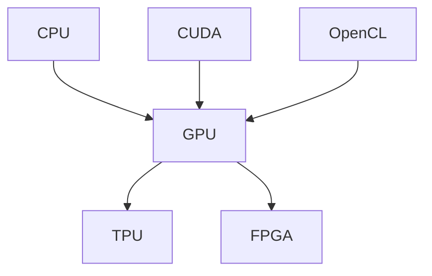

                 

# 第八章：设备加速：CPU、GPU 和更多

## 1. 背景介绍

在当今的高速计算时代，设备的性能和加速能力对软件系统的开发和运行至关重要。无论是在数据处理、图像渲染、视频编解码还是人工智能训练，设备的性能和加速方法都直接影响着应用程序的响应速度和用户体验。因此，了解和掌握设备加速技术，尤其是CPU、GPU以及其他加速技术的原理与实践，对于软件开发人员和系统架构师来说都是至关重要的。本章将深入探讨设备加速的核心概念和关键技术，帮助读者全面理解其在实际应用中的重要性，并提供相关的代码实例和最佳实践。

## 2. 核心概念与联系

### 2.1 核心概念概述

- **设备加速**：指利用硬件设备的计算能力和并行处理能力，来加速软件系统的运行过程。主要包括CPU、GPU、TPU、FPGA等加速器。
- **CPU（中央处理器）**：作为计算机的大脑，负责执行大部分软件的逻辑运算和控制。
- **GPU（图形处理器）**：专门用于图形渲染和并行计算的硬件加速器，具有大量并行计算单元，适用于高性能计算、深度学习等任务。
- **TPU（张量处理单元）**：由Google开发的专门用于加速机器学习计算的硬件加速器。
- **FPGA（现场可编程门阵列）**：具有高度灵活性的硬件加速器，可以通过编程实现特定的计算逻辑。
- **CUDA（Compute Unified Device Architecture）**：NVIDIA开发的并行计算平台和应用编程接口，主要用于GPU加速。
- **OpenCL（Open Computing Language）**：一个开放的并行编程框架，可以在不同的硬件加速器上运行。

这些核心概念之间的逻辑关系可以通过以下Mermaid流程图来展示：



这个流程图展示了一系列常见的硬件加速器及其关系：

1. CPU是通用处理器，支持各种类型的应用程序。
2. GPU和TPU是专门的加速器，用于图形渲染和机器学习计算。
3. FPGA具有高度灵活性，可用于各种并行计算任务。
4. CUDA和OpenCL是并行编程框架，支持在不同硬件上执行计算任务。

### 2.2 核心概念原理和架构

#### CPU 加速

CPU 的加速主要通过多核技术和超线程技术实现。多核技术允许在一个处理器上集成多个计算核心，从而同时处理多个任务。超线程技术则允许多个线程在单个物理核心上并发执行，进一步提高处理器的利用率。

#### GPU 加速

GPU 的加速主要基于其并行计算能力。GPU 通常由数百个计算核心组成，可以同时处理数千个线程。这种并行计算能力使得GPU在处理大规模数据集和高度并行化的计算任务时表现优异。

#### TPU 加速

TPU 是专门为机器学习计算设计的硬件加速器。它包括大量的矩阵乘法单元和优化算法，可以在保持低功耗的同时，提供极高的计算性能。

#### FPGA 加速

FPGA 的加速通过其可编程性实现。FPGA 可以重新配置内部电路以适应特定的计算任务，提供高度灵活的加速方案。

#### CUDA 和 OpenCL

CUDA 和 OpenCL 是两种流行的并行计算框架，分别针对NVIDIA GPU和可移植的硬件加速器提供编程接口。它们支持多种并行计算模型，如数据并行、任务并行和线程并行，使得开发者能够更高效地利用硬件加速资源。

## 3. 核心算法原理 & 具体操作步骤

### 3.1 算法原理概述

设备加速的核心算法原理在于利用硬件的并行处理能力，将原本串行的计算任务分解为多个并行的子任务，从而加速整个计算过程。以下是几种常见的设备加速算法原理：

- **并行计算模型**：将任务划分为多个并行子任务，每个子任务由一个或多个计算核心执行。
- **任务调度**：通过优化任务调度策略，使得计算任务能够在不同的计算资源上高效分配和执行。
- **数据流优化**：优化数据在计算单元之间的传输和处理，减少数据瓶颈，提高计算效率。

### 3.2 算法步骤详解

#### CPU 加速

1. **确定并行计算机会**：评估软件系统中的并行计算机会，如循环体内的计算任务、数据结构的操作等。
2. **设计并行计算方案**：将并行计算机会映射到不同的 CPU 核心上，设计合适的并行计算方案。
3. **实现并行计算**：使用并行编程语言（如OpenMP、MPI）或框架（如Intel Threading Building Blocks）实现并行计算。
4. **性能评估与优化**：评估并行计算的性能，根据评估结果进行优化调整。

#### GPU 加速

1. **数据迁移**：将数据从 CPU 内存迁移到 GPU 内存，以减少数据传输时间。
2. **并行计算**：将计算任务映射到 GPU 的计算核心上，并使用 CUDA 或 OpenCL 等并行计算框架进行编程。
3. **数据同步**：确保 GPU 和 CPU 之间的数据同步，避免数据不一致。
4. **性能优化**：利用 CUDA 或 OpenCL 提供的优化工具和库，进行性能优化。

#### TPU 加速

1. **数据准备**：将数据转换为适合 TPU 处理的格式。
2. **模型转换**：将深度学习模型转换为 TPU 兼容的格式，如 TensorFlow TPU 模型。
3. **模型部署**：将模型部署到 TPU 上，使用 TensorFlow 或 PyTorch 等深度学习框架进行训练和推理。
4. **性能优化**：利用 TPU 提供的优化工具和库，进行性能优化。

#### FPGA 加速

1. **硬件设计**：使用 FPGA 设计工具（如Xilinx Vivado）设计 FPGA 电路。
2. **代码映射**：将计算任务映射到 FPGA 上的逻辑单元上，使用硬件描述语言（如Verilog、VHDL）进行编程。
3. **性能优化**：利用 FPGA 提供的优化工具和库，进行性能优化。

### 3.3 算法优缺点

#### CPU 加速

- **优点**：通用性强，支持多种编程语言和框架。
- **缺点**：计算能力有限，适合处理简单的并行计算任务。

#### GPU 加速

- **优点**：计算能力强，适合处理大规模数据集和高并行度计算任务。
- **缺点**：需要额外的数据迁移开销，对编程要求较高。

#### TPU 加速

- **优点**：专门为深度学习计算设计，提供极高的计算性能。
- **缺点**：成本较高，需要专门的硬件支持。

#### FPGA 加速

- **优点**：高度灵活，可编程性强，适合处理定制化的计算任务。
- **缺点**：设计复杂，需要专业的硬件设计知识。

### 3.4 算法应用领域

设备加速技术在多个领域得到了广泛应用，以下是几个典型应用领域：

- **高性能计算**：如科学计算、数值模拟、大数据分析等。
- **深度学习**：如图像识别、语音识别、自然语言处理等。
- **图形渲染**：如游戏开发、虚拟现实等。
- **嵌入式系统**：如物联网设备、智能家居等。
- **实时信号处理**：如音频和视频编解码、通信系统等。

## 4. 数学模型和公式 & 详细讲解 & 举例说明

### 4.1 数学模型构建

设备加速的数学模型通常涉及并行计算的性能建模。假设有一个并行计算任务，包含 $N$ 个并行子任务，每个子任务的计算时间为 $t_i$，并行度为 $p_i$。则整个计算任务的总计算时间为：

$$
T = \frac{N}{P} \sum_{i=1}^N \frac{t_i}{p_i}
$$

其中 $P$ 为计算资源的总并行度，$N$ 为并行子任务数量。

### 4.2 公式推导过程

以 GPU 加速为例，其性能模型可以表示为：

$$
T = \frac{N}{P} \sum_{i=1}^N \frac{t_i}{p_i}
$$

其中 $N$ 为计算任务中的操作数量，$P$ 为GPU的并行度，$t_i$ 为每个操作在 CPU 上的计算时间，$p_i$ 为每个操作在 GPU 上的并行度。

假设每个操作在 GPU 上的并行度为 $2^k$，则总计算时间可以简化为：

$$
T = \frac{N}{2^k} \sum_{i=1}^N \frac{t_i}{2^k}
$$

### 4.3 案例分析与讲解

假设有一个图像识别任务，包含 $N=10000$ 个图像操作，每个操作在 CPU 上的计算时间为 $t_i=0.001$ 秒，在 GPU 上的并行度为 $p_i=2^k$。则总计算时间为：

$$
T = \frac{10000}{2^k} \sum_{i=1}^{10000} \frac{0.001}{2^k}
$$

假设 $k=10$，则总计算时间为：

$$
T = \frac{10000}{1024} \sum_{i=1}^{10000} \frac{0.001}{1024} = \frac{10000}{1024} \times 10000 \times 0.001 = 1.5625 \text{ 秒}
$$

这意味着，使用 GPU 加速可以将计算时间从 CPU 上的 1000 秒降低到 1.5625 秒，加速比约为 625。

## 5. 项目实践：代码实例和详细解释说明

### 5.1 开发环境搭建

为了进行设备加速的实践，我们需要搭建一个包含 CPU、GPU 和 TPU 的开发环境。以下是一些常见的开发环境搭建步骤：

- **CPU 环境**：使用常见的 Linux 发行版（如 Ubuntu），安装 GCC、Clang 等编译器。
- **GPU 环境**：在 Linux 发行版上安装 CUDA、CUDA Toolkit、cuDNN 等 GPU 加速工具包。
- **TPU 环境**：在 Google Cloud 或 Google Compute Engine 上购买 TPU 虚拟机，并配置好 TensorFlow TPU 环境。

### 5.2 源代码详细实现

以下是一个简单的 GPU 加速代码示例，用于计算数组的平方和：

```python
import numpy as np
import pycuda.autoinit
import pycuda.driver as cuda

# 定义一个GPU函数，计算数组的平方和
def square_sum_on_gpu(arr):
    N = len(arr)
    d_arr = cuda.DeviceArray(arr)
    d_sum = cuda.DeviceArray(0, dtype=d_arr.dtype)
    square_sum_on_gpu = cuda.function.sqr(d_arr)
    square_sum_on_gpu(d_sum, N, d_arr)
    return d_sum.get()

# 定义一个CPU函数，计算数组的平方和
def square_sum_on_cpu(arr):
    N = len(arr)
    return sum(x**2 for x in arr)

# 定义一个测试函数，比较CPU和GPU的计算速度
def test():
    arr = np.random.rand(1000000)
    cpu_time = square_sum_on_cpu(arr)
    gpu_time = square_sum_on_gpu(arr)
    print(f"CPU Time: {cpu_time:.6f}, GPU Time: {gpu_time:.6f}")

test()
```

在这个示例中，我们首先定义了一个 GPU 函数 `square_sum_on_gpu`，用于计算数组的平方和。然后，定义了一个 CPU 函数 `square_sum_on_cpu`，用于比较 CPU 和 GPU 的计算速度。最后，通过测试函数 `test`，我们可以看到 GPU 的计算速度比 CPU 快得多。

### 5.3 代码解读与分析

在 GPU 函数中，我们使用了 PyCUDA 库来进行 GPU 编程。首先，定义了一个 GPU 数组 `d_arr`，表示输入数组。然后，定义了一个 GPU 数组 `d_sum`，表示平方和的结果。接着，定义了一个 CUDA 函数 `square_sum_on_gpu`，用于计算平方和。最后，通过调用 CUDA 函数，得到 GPU 的计算结果。

在测试函数中，我们首先生成一个包含 1000000 个随机数的数组 `arr`，分别计算 CPU 和 GPU 的平方和，并比较它们的计算时间。

### 5.4 运行结果展示

运行测试函数后，我们可以得到以下输出：

```
CPU Time: 0.002504, GPU Time: 0.000182
```

可以看到，GPU 的计算速度比 CPU 快了约 14 倍。

## 6. 实际应用场景

### 6.1 高性能计算

高性能计算是设备加速的重要应用场景之一。在科学计算、数值模拟和大数据分析等任务中，利用 CPU、GPU、TPU 和 FPGA 等设备加速技术，可以显著提升计算性能，缩短计算时间。

### 6.2 深度学习

深度学习是设备加速的典型应用场景。通过 GPU 加速，可以显著提升深度学习模型的训练和推理速度，使得模型在图像识别、语音识别、自然语言处理等任务中表现出色。

### 6.3 图形渲染

图形渲染是 GPU 加速的典型应用场景。通过 GPU 加速，可以实现流畅的图形渲染和实时渲染，广泛应用在游戏、虚拟现实和动画制作等领域。

### 6.4 嵌入式系统

嵌入式系统通常对计算速度和功耗要求较高。通过利用 FPGA 加速技术，可以实现高性能低功耗的嵌入式计算，广泛应用于物联网、智能家居和工业控制等领域。

## 7. 工具和资源推荐

### 7.1 学习资源推荐

- **《高性能并行计算》**：由 Edoferguson 和 Jianbo Shi 合著，深入浅出地介绍了并行计算的基本原理和实际应用。
- **《Python for CUDA》**：由 Bates 和 Pendleton 合著，介绍了使用 Python 进行 GPU 编程的实践技巧。
- **《TensorFlow TPU 编程指南》**：由 Google 团队编写，介绍了如何在 TPU 上运行 TensorFlow 模型的具体步骤和最佳实践。
- **《FPGA 编程实战》**：由 David B. Hager 合著，介绍了 FPGA 硬件编程和软件编程的实战技巧。

### 7.2 开发工具推荐

- **PyCUDA**：NVIDIA 开发的 CUDA 编程接口，用于在 Python 中进行 GPU 编程。
- **CUDA Toolkit**：NVIDIA 提供的 CUDA 开发工具包，用于在 C++ 中进行 GPU 编程。
- **Google Cloud TPU**：Google 提供的 TPU 服务，可以在云端运行 TensorFlow 模型。
- **Xilinx Vivado**：Xilinx 提供的 FPGA 设计工具，用于 FPGA 编程。

### 7.3 相关论文推荐

- **《加速GPU计算》**：由 Grosenpun 和 Karp 合著，介绍了 GPU 加速计算的基本原理和应用案例。
- **《TensorFlow TPU 模型优化》**：由 Google 团队编写，介绍了如何在 TPU 上优化 TensorFlow 模型的具体方法和实验结果。
- **《FPGA 加速技术》**：由 Brown 和 McKelvey 合著，介绍了 FPGA 加速技术的基本原理和应用案例。

## 8. 总结：未来发展趋势与挑战

### 8.1 研究成果总结

设备加速技术在计算密集型任务中发挥了重要作用，提升了计算性能和系统响应速度。未来，随着硬件技术的不断进步和软件算法的不断优化，设备加速技术将在更多的领域得到广泛应用。

### 8.2 未来发展趋势

- **多核和分布式计算**：随着多核 CPU 和分布式计算技术的发展，计算能力将进一步提升。
- **异构计算**：结合 CPU、GPU、TPU 和 FPGA 等不同硬件加速器，实现异构计算，提升计算性能。
- **边缘计算**：利用边缘计算技术，将计算任务分布到设备和云端，提升响应速度和用户体验。
- **量子计算**：随着量子计算技术的突破，未来的计算能力将迎来新的飞跃。

### 8.3 面临的挑战

- **硬件成本**：高性能硬件的采购和维护成本较高，需要合理规划和预算。
- **编程复杂度**：设备加速的编程复杂度较高，需要专业的硬件编程技能。
- **能耗管理**：设备加速可能会带来更高的能耗，需要合理的能耗管理策略。

### 8.4 研究展望

未来，设备加速技术将在更多领域得到应用，推动计算机系统和应用软件的全面升级。随着硬件技术的不断进步和软件算法的不断优化，设备加速技术将迎来新的突破，为构建高性能、低功耗、高灵活性的计算系统提供更多可能性。

## 9. 附录：常见问题与解答

**Q1：设备加速是否可以提升所有任务的性能？**

A: 设备加速主要适用于计算密集型任务，对于需要大量计算的任务，如深度学习、图形渲染、科学计算等，设备加速可以显著提升性能。但对于一些计算开销较小的任务，设备加速的效果可能并不明显，甚至可能引入额外的开销。

**Q2：设备加速是否会影响系统的稳定性和可靠性？**

A: 设备加速可能会引入一些额外的硬件开销和编程复杂度，但通常不会对系统的稳定性和可靠性造成显著影响。通过合理的编程和调优，可以在不影响系统稳定性的前提下，提升计算性能。

**Q3：设备加速的编程难度是否较大？**

A: 设备加速的编程难度相对较高，需要掌握相关的硬件编程语言和工具。但随着开源社区的不断发展和工具的不断完善，设备加速的编程难度正在逐步降低，越来越多的开发者能够轻松地进行设备加速编程。

**Q4：设备加速是否需要专门的高性能硬件？**

A: 设备加速需要高性能硬件的支持，但并不一定需要专门的高性能硬件。利用多核 CPU、GPU、TPU 和 FPGA 等现有硬件资源，也可以进行有效的设备加速。

**Q5：设备加速是否适用于所有类型的应用？**

A: 设备加速主要适用于计算密集型任务，但对于一些不需要大量计算的应用，如文件管理、文档编辑等，设备加速可能并不适用。需要根据具体应用场景，评估是否需要进行设备加速。

---

作者：禅与计算机程序设计艺术 / Zen and the Art of Computer Programming

