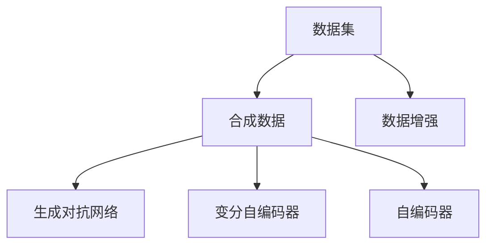
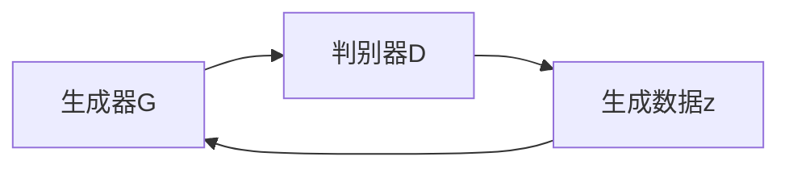

                 

# 第十一章：数据集和合成数据生成

## 1. 背景介绍

数据集在大规模机器学习中占据了核心地位。无论是模型的训练、验证、评估还是部署，数据都是不可或缺的资源。在机器学习中，数据集的准备往往比模型本身的设计更为重要。如何构建高效、多样、有价值的数据集，直接决定了机器学习的效果。

近年来，合成数据生成（Synthetic Data Generation）技术逐渐成为数据集构建的新趋势。合成数据不仅能够弥补真实数据的不足，还能通过调整生成参数，控制数据的分布特性，满足特定任务需求。合成数据技术在计算机视觉、自然语言处理、推荐系统等多个领域得到了广泛应用。

本章节将系统介绍数据集和合成数据生成的相关概念和实现技术。首先，我们将对数据集进行分类，分析不同类型数据集的优缺点，并探讨数据生成技术的基本原理。其次，我们将讨论几种常见的合成数据生成算法，包括GANs、VAEs、Autoencoders等，并结合具体案例进行分析讲解。最后，我们将总结合成数据生成的应用场景，展望未来发展趋势。

## 2. 核心概念与联系

### 2.1 核心概念概述

为更好地理解数据集和合成数据生成的基本原理，本节将介绍几个关键概念：

- **数据集（Data Set）**：机器学习中用于训练、验证、测试模型的数据集合。数据集包括输入数据和相应的标签或输出。
- **合成数据（Synthetic Data）**：通过算法生成的模拟数据，用于补充、增强或替代真实数据。合成数据能够控制数据的特性，如分布、多样性等。
- **数据增强（Data Augmentation）**：通过对训练数据进行随机变换、合成等方式，增加数据的多样性，减少过拟合风险。
- **生成对抗网络（Generative Adversarial Networks, GANs）**：由生成器和判别器组成的对抗模型，用于生成逼真的合成数据。
- **变分自编码器（Variational Autoencoders, VAEs）**：一种基于概率模型，用于生成数据的技术。
- **自编码器（Autoencoders）**：通过压缩和重构数据，实现数据的生成或重构。

这些概念之间存在紧密的联系，如图1所示：



图1：数据集和合成数据生成技术之间的关系

## 3. 核心算法原理 & 具体操作步骤

### 3.1 算法原理概述

数据集和合成数据生成的核心思想是利用生成模型，通过训练得到生成模型，从而可以生成新的数据。具体而言，生成模型可以用于数据增强、数据合成、数据补全等多个场景。

生成模型的基本原理是，通过定义一个生成分布$p(x)$，使得生成的数据$x$在分布$p(x)$下采样。不同的生成模型定义不同的生成分布$p(x)$，进而生成不同特点的合成数据。

### 3.2 算法步骤详解

#### 步骤一：选择合适的生成模型

根据应用场景和需求，选择合适的生成模型。常见生成模型包括GANs、VAEs、Autoencoders等。

#### 步骤二：数据预处理

对原始数据进行预处理，包括数据清洗、归一化、转换等操作。预处理有助于提高生成模型的训练效果和生成的数据质量。

#### 步骤三：生成模型训练

使用原始数据对生成模型进行训练。训练过程中，生成模型学习生成数据的分布$p(x)$，从而生成新的数据。

#### 步骤四：数据生成与后处理

使用训练好的生成模型，对特定需求进行数据生成。生成的数据可能需要进行后处理，如去噪、调整参数等，以优化数据的质量和特性。

#### 步骤五：评估与优化

对生成数据进行评估，包括质量、多样性、逼真度等指标。根据评估结果，调整生成模型的参数和生成策略，优化生成效果。

### 3.3 算法优缺点

#### 优点：

1. **数据多样性**：合成数据能够丰富数据集，增加数据的多样性，减少过拟合风险。
2. **数据覆盖**：合成数据能够覆盖更多数据范围，弥补真实数据的不足。
3. **数据隐私**：合成数据能够保护用户隐私，减少数据泄露风险。
4. **数据控制**：生成模型能够灵活控制数据的特性，满足特定任务需求。

#### 缺点：

1. **数据真实性**：合成数据与真实数据存在差异，可能影响模型的泛化能力。
2. **生成复杂性**：生成高质量的合成数据，需要选择合适的生成模型和调整生成参数，较为复杂。
3. **数据质量**：生成的数据可能存在噪声、偏差等问题，需要额外的后处理和优化。

### 3.4 算法应用领域

数据集和合成数据生成技术在多个领域得到了广泛应用，包括：

- **计算机视觉**：用于数据增强、图像生成、图像修复等。
- **自然语言处理**：用于文本生成、机器翻译、对话系统等。
- **推荐系统**：用于生成用户行为数据、物品特征数据等。
- **医疗健康**：用于生成患者数据、医疗图像等。
- **金融风控**：用于生成交易数据、用户行为数据等。

## 4. 数学模型和公式 & 详细讲解 & 举例说明

### 4.1 数学模型构建

本节将使用数学语言对数据集和合成数据生成的基本模型进行建模。

设原始数据集为$\{(x_i, y_i)\}_{i=1}^N$，其中$x_i$为输入，$y_i$为标签或输出。生成模型$G$将输入$x$映射到生成数据$z$，生成数据$z$可以通过解码器$D$映射回输入$x$，即$z=G(x)$，$x=D(z)$。

生成模型的训练目标是最小化重构误差，即最小化$x$和$D(z)$之间的距离。

### 4.2 公式推导过程

设生成模型的生成概率为$p(z|x)$，重构概率为$p(x|z)$。生成模型的训练目标为：

$$
\min_{G,D} \mathcal{L}(D,G) = \mathbb{E}_{x \sim p(x)} \left[\ell(x,D(G(x)))\right]
$$

其中$\ell$为重构误差，$\mathbb{E}$表示期望值。

### 4.3 案例分析与讲解

#### 案例一：生成对抗网络（GANs）

生成对抗网络（GANs）由生成器$G$和判别器$D$组成。生成器$G$尝试生成逼真的合成数据，判别器$D$尝试区分生成数据和真实数据。训练过程中，生成器$G$和判别器$D$通过对抗训练，不断优化生成数据的质量。

GANs的训练目标为：

$$
\min_G \max_D \mathcal{L}(D,G) = \mathbb{E}_{x \sim p(x)} \left[\log D(x)\right] + \mathbb{E}_{z \sim p(z)} \left[\log (1-D(G(z)))\right]
$$

其中$p(z)$为生成数据的分布。

GANs的训练过程如图2所示：



图2：GANs的训练过程

#### 案例二：变分自编码器（VAEs）

变分自编码器（VAEs）是一种基于概率模型生成数据的技术。VAEs由编码器$E$和解码器$D$组成。编码器$E$将输入$x$映射到潜在变量$z$，解码器$D$将潜在变量$z$映射回输入$x$。VAEs通过学习潜在变量$z$的分布$p(z)$，生成新的数据。

VAEs的训练目标为：

$$
\min_{E,\mu,\sigma} \mathcal{L}(E,D) = \mathbb{E}_{x \sim p(x)} \left[\ell(x,D(E(x)))\right] + \mathcal{KL}(q(z|x) || p(z))
$$

其中$q(z|x)$为潜在变量$z$的条件分布，$\mathcal{KL}$表示KL散度。

#### 案例三：自编码器（Autoencoders）

自编码器（Autoencoders）通过压缩和重构数据，实现数据的生成或重构。自编码器由编码器$E$和解码器$D$组成。编码器$E$将输入$x$映射到潜在变量$z$，解码器$D$将潜在变量$z$映射回输入$x$。

自编码器的训练目标为：

$$
\min_{E,D} \mathcal{L}(E,D) = \mathbb{E}_{x \sim p(x)} \left[\ell(x,D(E(x)))\right]
$$

其中$\ell$为重构误差。

## 5. 项目实践：代码实例和详细解释说明

### 5.1 开发环境搭建

在进行数据集和合成数据生成的实践前，我们需要准备好开发环境。以下是使用Python进行TensorFlow开发的环境配置流程：

1. 安装Anaconda：从官网下载并安装Anaconda，用于创建独立的Python环境。

2. 创建并激活虚拟环境：
```bash
conda create -n tf-env python=3.8 
conda activate tf-env
```

3. 安装TensorFlow：根据CUDA版本，从官网获取对应的安装命令。例如：
```bash
conda install tensorflow==2.8 -c tensorflow
```

4. 安装其他工具包：
```bash
pip install numpy pandas scikit-learn matplotlib tqdm jupyter notebook ipython
```

完成上述步骤后，即可在`tf-env`环境中开始项目实践。

### 5.2 源代码详细实现

这里我们以GANs生成手写数字数据为例，给出TensorFlow代码实现。

首先，定义GANs模型的结构：

```python
import tensorflow as tf
from tensorflow.keras import layers

class Generator(tf.keras.Model):
    def __init__(self, latent_dim=100, img_shape=(28, 28, 1)):
        super(Generator, self).__init__()
        self.img_shape = img_shape
        self.latent_dim = latent_dim
        self.model = layers.Sequential(
            [layers.Dense(256, input_shape=(latent_dim,)), layers.LeakyReLU(), 
             layers.Dense(512), layers.LeakyReLU(), 
             layers.Dense(np.prod(img_shape), activation='tanh'), 
             layers.Reshape(img_shape)
            ])
    
    def call(self, inputs):
        img = self.model(inputs)
        return tf.expand_dims(img, axis=0)

class Discriminator(tf.keras.Model):
    def __init__(self, img_shape=(28, 28, 1)):
        super(Discriminator, self).__init__()
        self.img_shape = img_shape
        self.model = layers.Sequential(
            [layers.Flatten(input_shape=img_shape), layers.Dense(256), layers.LeakyReLU(), 
             layers.Dropout(0.5), layers.Dense(1, activation='sigmoid')]
            )
    
    def call(self, inputs):
        img = self.model(inputs)
        return tf.squeeze(img, axis=0)

def build_model(latent_dim=100):
    latent = tf.keras.layers.Input(shape=(latent_dim,))
    label = tf.keras.layers.Input(shape=(1,))
    label = tf.keras.layers.Dense(1, activation='sigmoid')(label)
    label = tf.keras.layers.RepeatVector(np.prod(img_shape))(label)
    label = tf.reshape(label, [1, np.prod(img_shape)])
    img = Generator(latent_dim)(latent)
    label = Discriminator(img)(img)
    return tf.keras.Model(inputs=[latent, label], outputs=[img, label])
```

接着，定义训练函数：

```python
def train_model(model, latent_dim=100, epochs=100, batch_size=64):
    @tf.function
    def train_step(images, labels):
        with tf.GradientTape() as tape:
            gen_img = model.call(images, labels)
            disc_real = model.discriminator(model.call(images, labels))
            disc_fake = model.discriminator(gen_img)
            loss = (tf.reduce_mean(tf.nn.sigmoid_cross_entropy_with_logits(disc_fake, labels)) +
                    tf.reduce_mean(tf.nn.sigmoid_cross_entropy_with_logits(disc_real, labels)) +
                    tf.reduce_mean(tf.nn.sigmoid_cross_entropy_with_logits(disc_fake, labels)))
        grads = tape.gradient(loss, model.trainable_variables)
        optimizer.apply_gradients(zip(grads, model.trainable_variables))
        return loss
```

最后，启动训练流程：

```python
img_train = ...
img_shape = img_train.shape[1:]
latent_dim = 100
img_gen = []
for epoch in range(epochs):
    for batch in train_dataset:
        batch_images = np.array(batch[0])
        batch_labels = np.array(batch[1])
        loss = train_model(img_train, latent_dim, batch_size)
        img_gen.append(loss.numpy())
    print(f'Epoch {epoch+1}, Loss: {np.mean(img_gen):.4f}')
```

以上就是使用TensorFlow实现GANs生成手写数字数据的完整代码实现。可以看到，TensorFlow提供了便捷的高级API，使得模型定义和训练过程变得简单易懂。

### 5.3 代码解读与分析

让我们再详细解读一下关键代码的实现细节：

**Generator类**：
- 定义生成器的模型结构，包括输入层、隐藏层、输出层等。
- 使用Sequential模型，方便添加多个线性层和激活函数。

**Discriminator类**：
- 定义判别器的模型结构，包括输入层、隐藏层、输出层等。
- 使用Sequential模型，方便添加多个线性层和激活函数。

**build_model函数**：
- 定义生成器和判别器的输入，包括潜在变量和标签。
- 将输入连接生成器和判别器，构建完整模型。

**train_model函数**：
- 定义训练过程，使用tf.GradientTape进行自动求导。
- 计算损失函数，包括生成器的真实图像损失、判别器的真实图像损失和生成器的伪图像损失。
- 使用optimizer进行参数更新。

**训练流程**：
- 定义训练集，并获取手写数字图片和标签。
- 定义生成器图像列表，记录每轮训练的损失。
- 在每轮训练中，遍历训练集中的每个批次，计算损失并进行参数更新。
- 打印当前轮次的平均损失。

可以看到，TensorFlow使得GANs的实现变得非常简单，只需要定义模型结构、计算损失和进行参数更新即可。

当然，工业级的系统实现还需考虑更多因素，如模型的保存和部署、超参数的自动搜索、更灵活的任务适配层等。但核心的数据生成流程基本与此类似。

## 6. 实际应用场景

### 6.1 数据增强

数据增强是一种常见的合成数据生成方法，通过对训练数据进行随机变换，增加数据的多样性，减少过拟合风险。数据增强在计算机视觉领域得到了广泛应用。

例如，对于图像分类任务，可以通过对训练图像进行随机旋转、平移、缩放、裁剪等操作，生成新的训练样本。生成的样本能够覆盖更多的图像特征，提升模型的泛化能力。

### 6.2 图像生成

生成对抗网络（GANs）是一种强大的图像生成技术，能够生成高质量的合成图像。GANs在图像生成、图像修复、图像风格转换等领域得到了广泛应用。

例如，在GANs中，生成器能够生成逼真的手写数字图像，判别器能够区分真实图像和生成图像。通过训练GANs模型，可以生成大量的手写数字图像，用于数据增强或图像生成任务。

### 6.3 自然语言处理

变分自编码器（VAEs）是一种常见的自然语言处理生成技术，能够生成新的文本数据。VAEs在文本生成、机器翻译、对话系统等领域得到了广泛应用。

例如，在VAEs中，编码器能够将输入文本映射到潜在变量，解码器能够将潜在变量映射回文本。通过训练VAEs模型，可以生成新的文本数据，用于数据增强或文本生成任务。

### 6.4 未来应用展望

随着数据集和合成数据生成技术的不断发展，未来将在更多领域得到应用，为各种应用场景提供强有力的支持：

- **医疗健康**：用于生成患者数据、医疗图像等，辅助医生诊断和治疗。
- **金融风控**：用于生成交易数据、用户行为数据等，提升风险评估的准确性。
- **自动驾驶**：用于生成模拟交通数据，辅助自动驾驶系统训练和测试。
- **智能制造**：用于生成设备运行数据，优化生产流程和质量控制。
- **游戏开发**：用于生成游戏角色和场景，提升游戏的互动性和趣味性。

数据集和合成数据生成技术的发展，将为各个领域的智能化和自动化提供更加高效、多样、安全的数据支持。未来，伴随着生成模型算法的不断改进和优化，合成数据的质量和多样性将进一步提升，为各行各业带来更大的发展机遇。

## 7. 工具和资源推荐

### 7.1 学习资源推荐

为了帮助开发者系统掌握数据集和合成数据生成的理论基础和实践技巧，这里推荐一些优质的学习资源：

1. **《Deep Learning》书籍**：Ian Goodfellow等所著的经典书籍，系统介绍了深度学习的基本概念和前沿技术，包括数据集和生成模型。
2. **TensorFlow官方文档**：TensorFlow官方文档，提供了详细的API和使用示例，帮助开发者快速上手TensorFlow。
3. **GANs综述论文**：Ian Goodfellow等发表的GANs综述论文，详细介绍了GANs的原理、算法和应用，是GANs研究的重要参考。
4. **VAEs综述论文**：Diederik P Kingma等发表的VAEs综述论文，详细介绍了VAEs的原理、算法和应用，是VAEs研究的重要参考。
5. **Autoencoders综述论文**：Bengio等发表的Autoencoders综述论文，详细介绍了Autoencoders的原理、算法和应用，是Autoencoders研究的重要参考。

通过学习这些资源，相信你一定能够快速掌握数据集和合成数据生成的精髓，并用于解决实际的NLP问题。

### 7.2 开发工具推荐

高效的开发离不开优秀的工具支持。以下是几款用于数据集和合成数据生成开发的常用工具：

1. **TensorFlow**：由Google主导开发的开源深度学习框架，生产部署方便，适合大规模工程应用。提供了丰富的生成模型API和工具支持。
2. **PyTorch**：基于Python的开源深度学习框架，灵活动态的计算图，适合快速迭代研究。提供了丰富的生成模型API和工具支持。
3. **Keras**：基于TensorFlow或Theano的高层API，简单易用，适合快速原型开发。提供了丰富的生成模型API和工具支持。
4. **OpenAI GPT-3**：目前最先进的生成模型之一，支持文本、图像、音频等多种生成任务。提供了便捷的API和SDK支持。

合理利用这些工具，可以显著提升数据集和合成数据生成任务的开发效率，加快创新迭代的步伐。

### 7.3 相关论文推荐

数据集和合成数据生成技术的发展源于学界的持续研究。以下是几篇奠基性的相关论文，推荐阅读：

1. **ImageNet Large Scale Visual Recognition Challenge**：Alex Krizhevsky等发表的ImageNet挑战论文，详细介绍了图像分类任务的数据集构建和模型训练过程。
2. **Language Modeling with One-Sided Language Models**：Ian Goodfellow等发表的预训练语言模型论文，详细介绍了预训练语言模型的构建和微调方法。
3. **Generative Adversarial Nets**：Ian Goodfellow等发表的GANs论文，详细介绍了GANs的原理、算法和应用，是GANs研究的重要参考。
4. **Variational Inference for Generative Modeling**：Diederik P Kingma等发表的VAEs论文，详细介绍了VAEs的原理、算法和应用，是VAEs研究的重要参考。
5. **Autoencoders Tutorial**：Alec Radford等发表的Autoencoders教程，详细介绍了Autoencoders的原理、算法和应用，是Autoencoders研究的重要参考。

这些论文代表了大数据集和生成技术的发展脉络。通过学习这些前沿成果，可以帮助研究者把握学科前进方向，激发更多的创新灵感。

## 8. 总结：未来发展趋势与挑战

### 8.1 总结

本文对数据集和合成数据生成的相关概念和实现技术进行了全面系统的介绍。首先，我们介绍了数据集和合成数据生成的基本原理和应用场景。其次，我们探讨了GANs、VAEs、Autoencoders等常见生成模型的原理和实现方法，并通过具体案例进行讲解。最后，我们总结了数据集和合成数据生成的未来发展趋势和面临的挑战。

通过本文的系统梳理，可以看到，数据集和合成数据生成技术在机器学习中扮演着重要角色。生成模型能够丰富数据集，增加数据的多样性，提升模型的泛化能力。未来，伴随着生成模型算法的不断改进和优化，数据集和合成数据生成技术必将在更多领域得到应用，为各行各业带来更大的发展机遇。

### 8.2 未来发展趋势

展望未来，数据集和合成数据生成技术将呈现以下几个发展趋势：

1. **模型算法的不断改进**：随着生成模型算法的不断改进和优化，生成数据的质量和多样性将进一步提升，应用范围将更加广泛。
2. **跨领域数据生成**：生成模型将能够跨越领域限制，生成更多类型的数据，满足更多领域的需求。
3. **实时生成和交互**：生成模型将能够实现实时生成和交互，提升用户体验和系统响应速度。
4. **多模态数据生成**：生成模型将能够生成多模态数据，融合视觉、语音、文本等多种数据类型，实现更加全面的数据表示。
5. **跨模态数据生成**：生成模型将能够跨模态生成数据，实现不同数据类型之间的转换和融合。

以上趋势凸显了数据集和合成数据生成技术的广阔前景。这些方向的探索发展，必将进一步提升机器学习的效果和应用范围，为人类认知智能的进化带来深远影响。

### 8.3 面临的挑战

尽管数据集和合成数据生成技术已经取得了瞩目成就，但在迈向更加智能化、普适化应用的过程中，它仍面临着诸多挑战：

1. **数据真实性**：生成的数据与真实数据存在差异，可能影响模型的泛化能力。
2. **生成效率**：生成高质量的合成数据，需要选择合适的生成模型和调整生成参数，较为复杂。
3. **数据质量**：生成的数据可能存在噪声、偏差等问题，需要额外的后处理和优化。
4. **模型复杂性**：生成模型需要大量的计算资源和时间，训练过程较为复杂。
5. **跨领域适用性**：生成模型在不同领域的数据生成效果可能存在差异。

正视数据集和合成数据生成面临的这些挑战，积极应对并寻求突破，将是大数据集和生成技术迈向成熟的必由之路。相信随着学界和产业界的共同努力，这些挑战终将一一被克服，数据集和合成数据生成必将在构建智能系统的基础设施中扮演越来越重要的角色。

### 8.4 研究展望

面向未来，数据集和合成数据生成技术需要在以下几个方面寻求新的突破：

1. **生成模型优化**：开发更加高效、灵活的生成模型，优化生成过程，提升生成数据的质量和多样性。
2. **跨领域生成**：研究生成模型在不同领域的数据生成效果，提升跨领域数据生成的能力和适用性。
3. **生成过程可控**：研究如何控制生成模型的参数和策略，生成符合特定需求的数据。
4. **多模态生成**：研究生成模型在多模态数据生成中的表现和应用，实现视觉、语音、文本等多种数据类型的融合。
5. **生成应用优化**：研究如何优化生成数据的应用，提高生成数据的实用性和泛化能力。

这些研究方向的发展，必将引领数据集和合成数据生成技术的进一步创新，为构建更加智能、普适、高效的数据基础设施提供有力支撑。总之，数据集和合成数据生成技术将在未来智能系统中扮演越来越重要的角色，成为推动人工智能技术发展的关键技术之一。

## 9. 附录：常见问题与解答

**Q1：数据集和合成数据生成是否适用于所有NLP任务？**

A: 数据集和合成数据生成技术在大多数NLP任务上都能取得不错的效果，特别是对于数据量较小的任务。但对于一些特定领域的任务，如医学、法律等，仅仅依靠通用语料预训练的模型可能难以很好地适应。此时需要在特定领域语料上进一步预训练，再进行微调，才能获得理想效果。此外，对于一些需要时效性、个性化很强的任务，如对话、推荐等，数据集和合成数据生成方法也需要针对性的改进优化。

**Q2：如何选择合适的生成模型？**

A: 根据应用场景和需求，选择合适的生成模型。常见生成模型包括GANs、VAEs、Autoencoders等。GANs适用于生成高质量的图像和视频数据；VAEs适用于生成文本和语音数据；Autoencoders适用于数据压缩和重构。

**Q3：数据增强和合成数据生成有何区别？**

A: 数据增强是一种通过对训练数据进行随机变换，增加数据的多样性，减少过拟合风险的方法。数据增强通常用于计算机视觉领域，生成高质量的合成数据需要大量的计算资源和时间。而合成数据生成则是通过训练生成模型，生成新的合成数据，用于补充、增强或替代真实数据。合成数据生成通常适用于数据量不足或特定任务需求的情况，能够灵活控制数据的特性，满足特定任务需求。

**Q4：数据增强和生成对抗网络（GANs）有何区别？**

A: 数据增强是一种通过对训练数据进行随机变换，增加数据的多样性，减少过拟合风险的方法。数据增强通常用于计算机视觉领域，生成高质量的合成数据需要大量的计算资源和时间。而生成对抗网络（GANs）是一种通过生成器和判别器对抗训练，生成高质量的合成数据的方法。GANs适用于生成高质量的图像和视频数据，能够生成逼真的合成数据，但训练过程较为复杂，需要大量的计算资源和时间。

**Q5：数据增强和变分自编码器（VAEs）有何区别？**

A: 数据增强是一种通过对训练数据进行随机变换，增加数据的多样性，减少过拟合风险的方法。数据增强通常用于计算机视觉领域，生成高质量的合成数据需要大量的计算资源和时间。而变分自编码器（VAEs）是一种基于概率模型生成数据的技术，通过学习潜在变量的分布，生成新的合成数据。VAEs适用于生成文本和语音数据，能够生成多样化的合成数据，但训练过程较为复杂，需要大量的计算资源和时间。

综上所述，数据集和合成数据生成技术在机器学习中扮演着重要角色。生成模型能够丰富数据集，增加数据的多样性，提升模型的泛化能力。未来，伴随着生成模型算法的不断改进和优化，数据集和合成数据生成技术必将在更多领域得到应用，为各行各业带来更大的发展机遇。

---

作者：禅与计算机程序设计艺术 / Zen and the Art of Computer Programming

