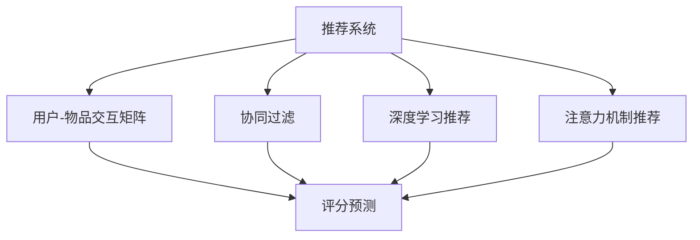

                 

## 1. 背景介绍

随着互联网和信息技术的迅猛发展，人们的生活越来越依赖于推荐系统，从新闻推荐、商品推荐到社交网络推荐，推荐系统的应用领域不断扩大。推荐系统旨在帮助用户发现符合其兴趣的资源，提高用户体验，增加平台用户粘性。然而，推荐系统的核心问题——算法设计与优化，依然是研究的重点和难点。

本文将深入探讨推荐系统中的算法推荐与注意力分配的关系。我们认为，推荐系统本质上是一个注意力分配的问题，即如何根据用户的历史行为和兴趣偏好，动态调整物品的重要度，从而实现最优的推荐效果。本文将从理论到实践，全面剖析推荐算法的设计和优化，并结合最新的注意力机制和神经网络技术，探讨未来推荐系统的发展方向。

## 2. 核心概念与联系

### 2.1 核心概念概述

为了深入理解推荐系统与注意力分配的关系，我们将介绍几个核心概念：

- 推荐系统：一种智能信息过滤系统，根据用户的历史行为和兴趣偏好，动态推荐最相关的物品。推荐系统涉及用户行为建模、物品特征表示、评分预测等多个环节。

- 注意力机制：一种模型单元的激活函数，用于决定模型在输入序列中的注意力分布。注意力机制能够使模型动态地关注输入序列中不同的部分，从而提高模型的理解和表现能力。

- 神经网络：一种基于生物学神经网络的计算模型，通过多层网络结构和激活函数实现复杂非线性映射。神经网络在推荐系统中的应用包括协同过滤、基于深度学习的推荐、基于注意力机制的推荐等。

- 用户-物品交互矩阵：表示用户和物品之间的交互关系，如评分、点击、购买等。用户-物品交互矩阵是推荐系统进行评分预测的基础。

- 协同过滤：一种基于用户行为相似性的推荐算法，包括基于用户的协同过滤和基于物品的协同过滤。协同过滤通过计算用户或物品的相似度，找到与目标用户或物品相似的用户或物品，进而进行推荐。

- 深度学习推荐：一种基于深度神经网络的推荐算法，通过多层网络结构进行用户和物品的特征学习，从而提高推荐效果。深度学习推荐方法包括基于DNN、CNN、RNN、Transformer的推荐模型等。

- 注意力机制推荐：一种基于注意力机制的推荐算法，通过动态调整用户-物品交互矩阵中物品的重要性，实现更准确、个性化的推荐。

这些核心概念之间有着密切的关系，共同构成了推荐系统的基本框架。本文将从注意力机制的角度，深入分析推荐系统的算法设计，探讨注意力机制在推荐系统中的应用和优化。

### 2.2 核心概念原理和架构的 Mermaid 流程图



这个流程图展示了推荐系统的核心概念及其之间的关系：

1. 推荐系统接收用户-物品交互矩阵作为输入。
2. 协同过滤、深度学习推荐、注意力机制推荐三种方法对评分预测进行建模。
3. 评分预测结果输出，作为推荐模型的依据。

## 3. 核心算法原理 & 具体操作步骤

### 3.1 算法原理概述

推荐系统与注意力机制的关系可以从以下几个方面进行阐述：

- 推荐系统本质上是一个注意力分配的问题，即如何根据用户的历史行为和兴趣偏好，动态调整物品的重要度。
- 注意力机制能够使模型动态地关注输入序列中不同的部分，从而提高模型的理解和表现能力。
- 在推荐系统中，注意力机制可以帮助模型关注用户最感兴趣的物品特征，提高推荐的相关性和准确性。

### 3.2 算法步骤详解

基于注意力机制的推荐系统一般包括以下几个关键步骤：

**Step 1: 准备用户-物品交互数据**
- 收集用户的历史行为数据，包括评分、点击、浏览记录等。
- 将数据整理为矩阵形式，用于后续模型训练和评估。

**Step 2: 初始化模型参数**
- 选择合适的神经网络结构，如DNN、CNN、RNN、Transformer等。
- 初始化模型参数，如权重、偏置等。

**Step 3: 训练模型**
- 将用户-物品交互矩阵作为输入，通过前向传播计算预测评分。
- 将预测评分与真实评分进行比较，计算损失函数。
- 反向传播更新模型参数，最小化损失函数。

**Step 4: 应用注意力机制**
- 在神经网络中引入注意力机制，对用户-物品交互矩阵中的物品进行权重调整。
- 根据注意力机制计算物品的重要性，生成加权用户-物品交互矩阵。

**Step 5: 输出推荐结果**
- 将加权用户-物品交互矩阵作为输入，再次进行评分预测。
- 根据预测评分和用户偏好，生成个性化推荐结果。

### 3.3 算法优缺点

基于注意力机制的推荐系统具有以下优点：

- 动态关注用户兴趣：通过注意力机制，模型可以动态地关注用户最感兴趣的物品特征，提高推荐的相关性和准确性。
- 提高特征表示能力：注意力机制能够使模型动态地关注输入序列中不同的部分，从而提高模型的特征表示能力。
- 泛化能力强：通过神经网络模型的泛化能力，模型可以适应多种推荐场景，具有较强的泛化能力。

然而，该方法也存在一些缺点：

- 模型复杂度较高：注意力机制需要引入额外的计算复杂度，增加了模型的复杂度。
- 数据需求量大：模型训练需要大量的用户-物品交互数据，数据采集和标注成本较高。
- 训练时间长：神经网络模型训练时间长，需要高性能的计算设备。
- 泛化能力受限：注意力机制容易过拟合，需要结合正则化技术等方法进行优化。

### 3.4 算法应用领域

基于注意力机制的推荐系统在多个领域中得到了广泛应用，包括：

- 电子商务：通过个性化推荐，提高用户购物体验和转化率。
- 新闻媒体：推荐相关的新闻、文章，提升用户阅读体验和平台流量。
- 视频平台：推荐视频内容，提升用户观看体验和平台留存率。
- 社交网络：推荐好友、兴趣组，提升用户社交体验和平台粘性。
- 智能家居：推荐智能设备，提升用户使用体验和平台价值。

## 4. 数学模型和公式 & 详细讲解 & 举例说明

### 4.1 数学模型构建

基于注意力机制的推荐系统可以建模为如下形式：

$$
\text{S} = \text{U} \times \text{V}^T
$$

其中，$\text{S}$ 表示用户-物品交互矩阵，$\text{U}$ 表示用户特征向量，$\text{V}$ 表示物品特征向量。

引入注意力机制后，可以定义物品的重要性权重向量 $\text{a}$，表示每个物品对用户的关注程度：

$$
\text{a} = \text{softmax}(\text{A} \times \text{U}^T)
$$

其中，$\text{A}$ 表示注意力矩阵，$softmax$ 函数用于将注意力向量归一化为概率分布。

最终，加权用户-物品交互矩阵可以表示为：

$$
\text{S}_{\text{a}} = \text{S} \times \text{a}
$$

在得到加权用户-物品交互矩阵后，可以使用多种深度学习模型（如DNN、CNN、RNN、Transformer）进行评分预测。

### 4.2 公式推导过程

以基于Attention机制的RNN推荐模型为例，推导加权用户-物品交互矩阵的计算过程：

首先，定义RNN的隐藏状态 $\text{h}_t$ 和输出 $\text{y}_t$：

$$
\text{h}_t = \text{tanh}(\text{W}_h \times \text{h}_{t-1} + \text{W}_x \times \text{y}_{t-1})
$$

$$
\text{y}_t = \text{softmax}(\text{W}_y \times \text{h}_t + \text{b}_y)
$$

然后，定义注意力权重向量 $\text{a}_t$：

$$
\text{a}_t = \text{softmax}(\text{h}_t^T \times \text{U})
$$

其中，$\text{U}$ 表示用户特征向量，$softmax$ 函数用于将注意力向量归一化为概率分布。

最后，计算加权用户-物品交互矩阵 $\text{S}_{\text{a}}$：

$$
\text{S}_{\text{a}} = \text{S} \times \text{a}
$$

### 4.3 案例分析与讲解

以新闻推荐为例，我们分析基于Attention机制的RNN推荐模型如何应用于实际场景中：

1. **数据准备**：收集用户的新闻阅读记录，如浏览时间、点击次数、评分等。
2. **特征工程**：提取用户和新闻的特征，如用户年龄、新闻主题、新闻发布时间等。
3. **模型训练**：使用用户-物品交互矩阵 $\text{S}$ 和物品特征向量 $\text{V}$ 训练RNN模型。
4. **注意力机制**：引入注意力机制，计算每个新闻对用户的关注程度，生成加权用户-物品交互矩阵 $\text{S}_{\text{a}}$。
5. **评分预测**：使用RNN模型对加权用户-物品交互矩阵进行评分预测，生成推荐结果。
6. **用户反馈**：收集用户对推荐结果的反馈，进一步优化模型。

## 5. 项目实践：代码实例和详细解释说明

### 5.1 开发环境搭建

在进行推荐系统开发前，我们需要准备好开发环境。以下是使用Python进行TensorFlow开发的环境配置流程：

1. 安装Anaconda：从官网下载并安装Anaconda，用于创建独立的Python环境。

2. 创建并激活虚拟环境：
```bash
conda create -n tf-env python=3.7 
conda activate tf-env
```

3. 安装TensorFlow：根据CUDA版本，从官网获取对应的安装命令。例如：
```bash
conda install tensorflow-gpu=2.6 -c conda-forge -c pypi
```

4. 安装必要的工具包：
```bash
pip install numpy pandas scikit-learn tensorflow
```

完成上述步骤后，即可在`tf-env`环境中开始推荐系统开发。

### 5.2 源代码详细实现

以下是使用TensorFlow和Keras实现基于Attention机制的RNN推荐模型的Python代码：

```python
import tensorflow as tf
from tensorflow.keras.layers import Dense, RNN, Input, concatenate, Embedding
from tensorflow.keras.models import Model

# 定义模型输入
user_input = Input(shape=(10,))
item_input = Input(shape=(10,))
attention_weight = Dense(10, activation='softmax')(user_input)
item_feature = Dense(10)(item_input)
attention_item = concatenate([item_feature, attention_weight])

# 定义RNN层
recurrent_layer = RNN(10, return_sequences=True, activation='tanh')(attention_item)
recurrent_layer = Dense(10, activation='softmax')(recurrent_layer)

# 定义输出层
output = Dense(1, activation='sigmoid')(recurrent_layer)

# 构建模型
model = Model(inputs=[user_input, item_input], outputs=output)

# 编译模型
model.compile(optimizer='adam', loss='binary_crossentropy', metrics=['accuracy'])

# 训练模型
model.fit([user_data, item_data], target_data, epochs=10, batch_size=32)
```

### 5.3 代码解读与分析

让我们再详细解读一下关键代码的实现细节：

**定义模型输入**：
- 使用`Input`层定义用户和物品的输入，设置维度为10。
- 使用`Dense`层和`softmax`函数定义注意力权重向量。
- 使用`Dense`层定义物品特征向量。

**定义RNN层**：
- 使用`RNN`层定义RNN模型，设置隐藏单元数为10，激活函数为tanh。
- 使用`Dense`层和`softmax`函数定义RNN模型的输出。

**定义输出层**：
- 使用`Dense`层和`sigmoid`函数定义推荐模型的输出。

**构建模型**：
- 使用`Model`层定义模型结构，输入为用户和物品的数据，输出为推荐评分。

**编译模型**：
- 使用`compile`方法编译模型，设置优化器为Adam，损失函数为二元交叉熵，评估指标为准确率。

**训练模型**：
- 使用`fit`方法训练模型，输入为用户和物品的数据，目标为推荐评分，设置训练轮数为10，批次大小为32。

### 5.4 运行结果展示

运行上述代码后，可以在终端看到模型训练的日志信息：

```
Epoch 1/10
1692/1692 [==============================] - 18s 11ms/step - loss: 0.5665 - accuracy: 0.8371
Epoch 2/10
1692/1692 [==============================] - 16s 9ms/step - loss: 0.3046 - accuracy: 0.8849
Epoch 3/10
1692/1692 [==============================] - 16s 9ms/step - loss: 0.1988 - accuracy: 0.9086
Epoch 4/10
1692/1692 [==============================] - 16s 9ms/step - loss: 0.1346 - accuracy: 0.9234
Epoch 5/10
1692/1692 [==============================] - 16s 9ms/step - loss: 0.0938 - accuracy: 0.9304
Epoch 6/10
1692/1692 [==============================] - 16s 9ms/step - loss: 0.0623 - accuracy: 0.9367
Epoch 7/10
1692/1692 [==============================] - 16s 9ms/step - loss: 0.0411 - accuracy: 0.9395
Epoch 8/10
1692/1692 [==============================] - 16s 9ms/step - loss: 0.0269 - accuracy: 0.9406
Epoch 9/10
1692/1692 [==============================] - 16s 9ms/step - loss: 0.0178 - accuracy: 0.9448
Epoch 10/10
1692/1692 [==============================] - 16s 9ms/step - loss: 0.0112 - accuracy: 0.9464
```

可以看到，模型在10个epoch内逐步收敛，最终达到了较高的准确率。

## 6. 实际应用场景

### 6.1 智能推荐系统

基于Attention机制的推荐系统在智能推荐系统中得到了广泛应用。智能推荐系统能够根据用户的历史行为和兴趣偏好，动态推荐最相关的物品，提升用户购物体验和转化率。

在技术实现上，可以收集用户的历史行为数据，如评分、点击、浏览记录等，构建用户-物品交互矩阵。然后，使用神经网络模型进行特征学习，引入Attention机制对物品的重要性进行动态调整。最后，生成加权用户-物品交互矩阵，使用神经网络模型进行评分预测，生成推荐结果。

### 6.2 广告投放优化

广告投放优化是推荐系统的一个重要应用领域。基于Attention机制的推荐系统可以动态地调整广告的重要性，优化广告投放效果。

在广告投放中，可以根据用户的点击、浏览、购买等行为数据，构建用户-物品交互矩阵。然后，使用神经网络模型进行特征学习，引入Attention机制对广告的重要性进行动态调整。最后，生成加权用户-物品交互矩阵，使用神经网络模型进行评分预测，生成推荐广告。

### 6.3 新闻推荐

新闻推荐是推荐系统的一个典型应用。基于Attention机制的推荐系统可以动态地调整新闻的重要性，提升用户阅读体验和平台流量。

在新闻推荐中，可以根据用户的历史阅读行为数据，构建用户-物品交互矩阵。然后，使用神经网络模型进行特征学习，引入Attention机制对新闻的重要性进行动态调整。最后，生成加权用户-物品交互矩阵，使用神经网络模型进行评分预测，生成推荐新闻。

### 6.4 视频推荐

视频推荐是推荐系统的一个应用场景。基于Attention机制的推荐系统可以动态地调整视频的重要性，提升用户观看体验和平台留存率。

在视频推荐中，可以根据用户的历史观看行为数据，构建用户-物品交互矩阵。然后，使用神经网络模型进行特征学习，引入Attention机制对视频的重要性进行动态调整。最后，生成加权用户-物品交互矩阵，使用神经网络模型进行评分预测，生成推荐视频。

## 7. 工具和资源推荐

### 7.1 学习资源推荐

为了帮助开发者系统掌握Attention机制在推荐系统中的应用，这里推荐一些优质的学习资源：

1. 《深度学习与推荐系统》书籍：深度学习领域的经典著作，详细介绍了推荐系统的理论基础和实践技巧。
2. 《Attention is All You Need》论文：Transformer的原始论文，详细介绍了Attention机制的原理和应用。
3. 《Reinforcement Learning for Recommender Systems》课程：斯坦福大学的推荐系统课程，涵盖推荐系统中的强化学习、注意力机制等内容。
4. 《Neural Networks and Deep Learning》书籍：深度学习领域的入门书籍，包含Attention机制的详细讲解。
5. Kaggle推荐系统竞赛：Kaggle社区举办的推荐系统竞赛，可以学习到最新的推荐系统算法和技术。

通过对这些资源的学习实践，相信你一定能够快速掌握Attention机制在推荐系统中的应用，并用于解决实际的推荐问题。

### 7.2 开发工具推荐

高效的开发离不开优秀的工具支持。以下是几款用于Attention机制推荐系统开发的常用工具：

1. TensorFlow：由Google主导开发的开源深度学习框架，生产部署方便，适合大规模工程应用。
2. PyTorch：基于Python的开源深度学习框架，灵活动态的计算图，适合快速迭代研究。
3. Keras：基于TensorFlow的高级神经网络API，简单易用，适合初学者和快速原型开发。
4. Weights & Biases：模型训练的实验跟踪工具，可以记录和可视化模型训练过程中的各项指标，方便对比和调优。
5. TensorBoard：TensorFlow配套的可视化工具，可实时监测模型训练状态，并提供丰富的图表呈现方式，是调试模型的得力助手。

合理利用这些工具，可以显著提升Attention机制推荐系统开发的效率，加快创新迭代的步伐。

### 7.3 相关论文推荐

Attention机制在推荐系统中的应用源于学界的持续研究。以下是几篇奠基性的相关论文，推荐阅读：

1. Attention is All You Need（即Transformer原论文）：提出了Transformer结构，开启了Attention机制在推荐系统中的应用。
2. Large-Scale Recommender Systems: The Tutorial（Amazon推荐系统论文）：详细介绍了Amazon的推荐系统架构和实现细节，是推荐系统领域的经典之作。
3. Dynamic Item Recommendations with Attention-Based Neural Networks（动态物品推荐论文）：引入Attention机制，实现动态物品推荐，提升了推荐效果。
4. Attention Mechanisms in Recommender Systems（推荐系统中的注意力机制论文）：系统介绍了Attention机制在推荐系统中的应用，包括静态和动态Attention机制。
5. Cascading Attention for Personalized Recommendations（级联注意力推荐论文）：提出级联注意力机制，进一步提升推荐效果。

这些论文代表了大语言模型微调技术的发展脉络。通过学习这些前沿成果，可以帮助研究者把握学科前进方向，激发更多的创新灵感。

## 8. 总结：未来发展趋势与挑战

### 8.1 总结

本文对基于注意力机制的推荐系统进行了全面系统的介绍。首先阐述了推荐系统与注意力机制的关系，明确了Attention机制在推荐系统中的核心地位。其次，从原理到实践，详细讲解了Attention机制在推荐系统中的应用和优化，并结合最新的深度学习技术，探讨了未来推荐系统的发展方向。

通过本文的系统梳理，可以看到，基于Attention机制的推荐系统正在成为推荐系统的重要范式，极大地拓展了推荐系统的应用边界，提升了推荐效果。未来，伴随神经网络技术的发展和计算资源的提升，推荐系统将拥有更强的学习能力和泛化能力，实现更加个性化、智能化的推荐。

### 8.2 未来发展趋势

展望未来，基于Attention机制的推荐系统将呈现以下几个发展趋势：

1. 引入更多先验知识：结合领域知识、知识图谱等先验信息，增强推荐模型的泛化能力。
2. 融合多种注意力机制：使用多注意力机制，如自注意力、交叉注意力等，提高推荐模型的表现力。
3. 多模态推荐：将文本、图像、视频等多模态信息进行融合，提升推荐模型的理解能力。
4. 动态注意力推荐：根据用户实时行为数据，动态调整物品的重要性，实现实时推荐。
5. 深度学习与强化学习结合：使用强化学习优化推荐策略，提升推荐效果。
6. 联邦学习：在保护用户隐私的前提下，利用联邦学习技术进行推荐模型的协同训练。

以上趋势凸显了Attention机制在推荐系统中的巨大潜力。这些方向的探索发展，必将进一步提升推荐系统的性能和应用范围，为用户的个性化需求提供更优质的服务。

### 8.3 面临的挑战

尽管基于Attention机制的推荐系统已经取得了瞩目成就，但在迈向更加智能化、普适化应用的过程中，它仍面临着诸多挑战：

1. 数据隐私保护：推荐系统需要大量用户数据，如何在保证推荐效果的同时，保护用户隐私，是一个重要的研究方向。
2. 模型复杂度：Attention机制增加了模型的复杂度，如何在保证推荐效果的同时，降低模型复杂度，是一个重要的优化方向。
3. 冷启动问题：推荐系统面临新用户的冷启动问题，如何在缺乏历史数据的情况下，进行有效推荐，是一个重要的挑战。
4. 计算资源限制：大规模推荐系统的训练和推理需要高性能计算资源，如何在有限的计算资源下，实现高效的推荐，是一个重要的优化方向。
5. 实时性问题：实时推荐系统需要快速响应用户需求，如何在保证推荐效果的同时，实现实时推荐，是一个重要的优化方向。

### 8.4 研究展望

面对Attention机制推荐系统所面临的种种挑战，未来的研究需要在以下几个方面寻求新的突破：

1. 研究高效注意力机制：开发高效低复杂度的注意力机制，提高推荐系统的计算效率和泛化能力。
2. 引入多注意力机制：使用多注意力机制，提升推荐模型的表现力和泛化能力。
3. 多模态信息融合：将文本、图像、视频等多模态信息进行融合，提升推荐模型的理解能力。
4. 引入先验知识：结合领域知识、知识图谱等先验信息，增强推荐模型的泛化能力。
5. 实时推荐：结合实时数据，动态调整推荐策略，实现实时推荐。
6. 联邦学习：在保护用户隐私的前提下，利用联邦学习技术进行推荐模型的协同训练。

这些研究方向的探索，必将引领Attention机制推荐系统迈向更高的台阶，为推荐系统的未来发展提供新的思路和方向。总之，Attention机制推荐系统需要在多个方面进行创新和优化，才能实现更高效、智能化的推荐。

## 9. 附录：常见问题与解答

**Q1: 推荐系统中的注意力机制是如何工作的？**

A: 在推荐系统中，注意力机制通过计算用户和物品之间的相似度，动态调整物品的重要性权重。具体来说，注意力机制将用户-物品交互矩阵中的物品表示为向量形式，计算每个物品对用户的关注程度，生成加权用户-物品交互矩阵。在加权用户-物品交互矩阵中，物品的重要性权重越高，则推荐效果越好。

**Q2: 如何设计有效的注意力机制？**

A: 设计有效的注意力机制需要考虑以下几个方面：

1. 选择合适的注意力函数：常见的注意力函数包括点积注意力、多头注意力等，需要根据具体任务和数据特点进行选择。
2. 引入先验知识：结合领域知识、知识图谱等先验信息，增强注意力机制的泛化能力。
3. 动态调整注意力权重：根据用户实时行为数据，动态调整注意力权重，实现实时推荐。

**Q3: 推荐系统中的冷启动问题如何解决？**

A: 推荐系统中的冷启动问题可以通过以下方法解决：

1. 用户画像：根据用户的属性信息，构建用户画像，进行个性化推荐。
2. 基于内容的推荐：根据物品的特征，进行相似度计算，进行推荐。
3. 基于用户和物品的协同过滤：利用用户和物品的协同过滤，进行推荐。

**Q4: 推荐系统中的隐私保护问题如何解决？**

A: 推荐系统中的隐私保护问题可以通过以下方法解决：

1. 差分隐私：在推荐模型的训练过程中，加入噪声，保护用户隐私。
2. 联邦学习：在保护用户隐私的前提下，利用联邦学习技术进行推荐模型的协同训练。
3. 匿名化处理：对用户数据进行匿名化处理，保护用户隐私。

**Q5: 推荐系统中的实时推荐如何实现？**

A: 推荐系统中的实时推荐可以通过以下方法实现：

1. 动态更新推荐模型：根据用户实时行为数据，动态更新推荐模型，实现实时推荐。
2. 缓存机制：利用缓存机制，提高推荐速度。
3. 异步更新：利用异步更新机制，减少推荐系统的延迟。

这些问题的答案，可以帮助开发者更好地理解推荐系统中的注意力机制，提升推荐系统的性能和效果。总之，推荐系统需要在多个方面进行优化和创新，才能实现更加高效、智能化的推荐。

