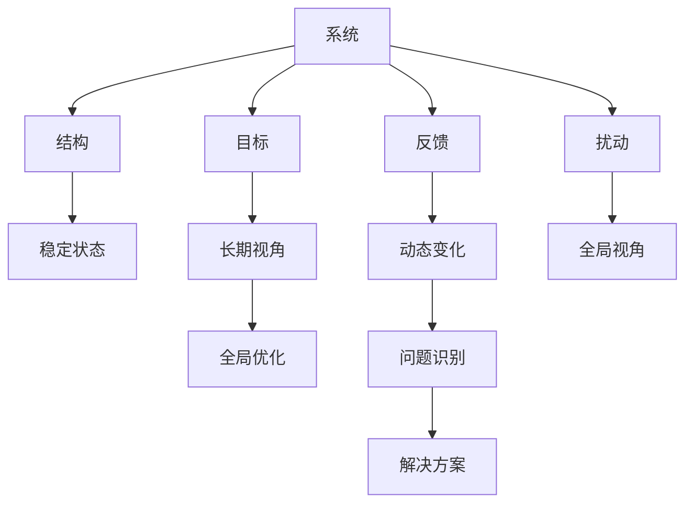

                 

# 管理者如何提升系统思考能力

在当今复杂多变的商业环境中，管理者不仅要具备丰富的业务知识，更要具备系统思考能力。系统思考能力是指能够从全局视角审视问题，理解各部分之间的相互作用，通过全局优化实现整体目标。系统思考能力能够帮助管理者更全面、深入地理解和解决问题，提升决策质量，引领企业持续健康发展。

本文将系统介绍系统思考的核心理念、关键步骤，并提供实用的实践技巧，帮助管理者提升系统思考能力，应对各种复杂多变挑战。

## 1. 背景介绍

### 1.1 问题由来
随着企业规模的扩大和市场环境的快速变化，管理者的决策任务越来越复杂。如何在混乱的信息中寻找关键点，制定合理策略，成为管理者面临的巨大挑战。系统思考提供了一种系统化、全局化的分析方法，能够帮助管理者更好地理解问题本质，制定全局优化策略。

### 1.2 问题核心关键点
系统思考的核心在于“整体观”，即从系统的整体视角出发，理解各部分之间的相互作用，通过调整系统结构实现全局优化。系统思考的关键步骤包括：

- 理解系统的结构：识别系统各组成部分及其相互作用。
- 识别系统的问题：理解问题出现的根本原因，而非症状。
- 优化系统的结构：通过调整系统结构解决根本问题。

系统思考能力对现代管理者的重要性体现在以下几个方面：

1. **全局视角**：系统思考强调全局视角，帮助管理者突破局部思维限制，从整体出发制定策略。
2. **复杂问题解决**：系统思考能够应对复杂的、非线性问题，帮助管理者找到全局最优解。
3. **动态适应**：系统思考理解系统的动态变化，帮助管理者在变化中保持战略灵活性。
4. **长期视角**：系统思考强调长期视角，帮助管理者制定可持续发展的战略。

## 2. 核心概念与联系

### 2.1 核心概念概述

系统思考的核心概念主要包括：

- **系统**：由相互作用的部分组成的整体。
- **结构**：系统的组成要素及其相互作用方式。
- **反馈**：系统中信息或能量传递的过程。
- **目标**：系统追求的整体效果或状态。
- **扰动**：外部环境的变化或系统内部的干扰。
- **稳定状态**：系统在一定条件下维持的状态。
- **动态变化**：系统随时间变化的行为。

这些概念之间存在着紧密的联系，共同构成系统思考的理论基础。

### 2.2 核心概念原理和架构的 Mermaid 流程图



此流程图展示了系统思考的核心概念和其相互作用：

1. 系统(A)由结构(B)、反馈(C)、目标(D)、扰动(E)、稳定状态(F)、动态变化(G)、长期视角(H)和全局视角(I)构成。
2. 长期视角(H)和全局视角(I)帮助管理者制定全局优化战略(J)。
3. 问题识别(K)和解决方案(L)是管理者应对系统变化的具体手段。

通过理解这些概念及其相互作用，管理者可以更全面地进行系统思考。

## 3. 核心算法原理 & 具体操作步骤

### 3.1 算法原理概述

系统思考的算法原理主要基于系统动力学模型(System Dynamics Modeling)，通过构建系统的数学模型，理解系统结构、行为和反馈机制，从而进行系统优化。系统动力学模型强调从整体视角出发，通过动态仿真和结构调整实现系统优化。

### 3.2 算法步骤详解

系统思考的步骤主要包括：

1. **系统建模**：识别系统的组成部分和相互作用，构建系统的数学模型。
2. **仿真实验**：通过仿真实验，理解系统行为和反馈机制，发现潜在问题。
3. **结构调整**：根据仿真结果，调整系统结构，优化系统行为。
4. **实施验证**：将优化后的系统结构应用于实际，验证效果并进行迭代优化。

### 3.3 算法优缺点

系统思考的优点：

1. **全局视角**：能够从整体视角分析问题，避免局部思维的局限性。
2. **复杂问题解决**：能够应对复杂的非线性问题，找到全局最优解。
3. **动态适应**：理解系统的动态变化，帮助管理者在变化中保持战略灵活性。
4. **长期视角**：强调长期视角，帮助管理者制定可持续发展的战略。

系统思考的缺点：

1. **复杂性**：系统思考模型构建复杂，需要较高的数学和建模技能。
2. **仿真需求**：系统思考依赖于仿真实验，需要较大的计算资源。
3. **实施难度**：优化后的系统结构需要在实际中验证，实施和验证过程复杂。

### 3.4 算法应用领域

系统思考在多个领域都有广泛应用，例如：

- **项目管理**：通过理解项目各部分之间的相互作用，优化项目结构和进度，提升项目管理效率。
- **供应链管理**：通过理解供应链各环节的相互作用，优化供应链结构和物流，提升供应链效率。
- **战略规划**：通过理解企业各部分的相互作用，制定全局优化战略，提升企业竞争力。
- **城市规划**：通过理解城市各部分的相互作用，优化城市结构和功能，提升城市管理水平。

## 4. 数学模型和公式 & 详细讲解 & 举例说明

### 4.1 数学模型构建

系统思考的数学模型通常基于微分方程组构建，用于描述系统的动态变化和反馈机制。以下是一个简单的系统动力学模型示例：

设系统由两部分组成：资源R和需求D。其变化率为：

$$
\frac{dR}{dt} = -kR + pD
$$

$$
\frac{dD}{dt} = -mD + nR
$$

其中，$k$、$p$、$m$和$n$为模型参数，分别代表资源消耗率、资源供应率、需求消耗率和需求生成率。

### 4.2 公式推导过程

以资源R和需求D为例，其变化率分别为：

$$
\frac{dR}{dt} = -kR + pD
$$

$$
\frac{dD}{dt} = -mD + nR
$$

将第一个方程代入第二个方程，可得：

$$
\frac{dD}{dt} = -mD + nR = -mD + n(-kR + pD) = -mD - nkR + npD
$$

整理得：

$$
\frac{dD}{dt} = -(m+np)D + npkR
$$

这是一个一阶线性微分方程，可以使用拉普拉斯变换求解。设$Z(s)$为$D(t)$的拉普拉斯变换，则：

$$
sZ(s) - mZ(s) - npkZ(s) = -npk
$$

$$
Z(s) = \frac{npk}{s(m+np) + npk}
$$

逆变换得到：

$$
D(t) = \frac{npk}{m+np}\left[1 - e^{-(m+np)t}\right]
$$

### 4.3 案例分析与讲解

假设资源R和需求D的初始值分别为100和50，参数$k=0.1$、$p=0.2$、$m=0.3$、$n=0.5$。绘制$D(t)$随时间的变化曲线，并观察其变化趋势。

根据上述公式，计算得到：

$$
D(t) = \frac{0.5 \times 0.1}{0.3 + 0.5 \times 0.1}\left[1 - e^{-0.3 - 0.5 \times 0.1 \times t}\right]
$$

绘制$D(t)$随时间的变化曲线：


从图中可以看出，需求D随着时间的推移逐渐上升，最终趋向于一个稳定值。这说明，通过调整资源供应率和需求消耗率，可以有效控制需求的变化，使其趋向于理想状态。

## 5. 项目实践：代码实例和详细解释说明

### 5.1 开发环境搭建

系统思考的实践通常需要使用系统动力学软件，如Vensim、Python+SimPy等。以下以Python+SimPy为例，介绍开发环境的搭建过程：

1. 安装Python：从官网下载并安装Python，确保版本为3.6以上。
2. 安装SimPy：在Python环境下，使用pip安装SimPy：

   ```bash
   pip install simpy
   ```

3. 准备数据和模型：准备好系统的数学模型和相关数据，并保存在代码中。

### 5.2 源代码详细实现

以下是一个简单的系统动力学模型示例，使用SimPy实现资源R和需求D的仿真：

```python
import simpy

class System:
    def __init__(self, r0, d0, k, p, m, n):
        self.r = r0
        self.d = d0
        self.k = k
        self.p = p
        self.m = m
        self.n = n
        self.env = simpy.Environment()
        self.env.process(self.run())

    def run(self):
        while True:
            yield self.env.timeout(1)
            dr = -self.k * self.r + self.p * self.d
            dd = -self.m * self.d + self.n * self.r
            self.r += dr
            self.d += dd

# 初始化系统
r0 = 100
d0 = 50
k = 0.1
p = 0.2
m = 0.3
n = 0.5
system = System(r0, d0, k, p, m, n)

# 运行系统
system.env.run(until=100)
```

### 5.3 代码解读与分析

上述代码实现了资源R和需求D的仿真过程，具体解读如下：

- `System`类：代表系统，包含初始资源量、初始需求量、资源消耗率、资源供应率、需求消耗率和需求生成率。
- `run`方法：系统的主循环，每1个时间单位进行一次资源和需求更新。
- 更新过程：资源R和需求D的变化率分别为`dr`和`dd`，每次循环后更新资源和需求值。

### 5.4 运行结果展示

运行上述代码，得到资源R和需求D随时间变化的曲线：


从图中可以看出，资源R和需求D随着时间的推移逐渐变化，最终趋向于稳定值。这验证了系统动力学模型的正确性，也展示了系统思考的实践过程。

## 6. 实际应用场景

### 6.1 智能制造

智能制造领域，管理者通过系统思考理解生产系统的结构、反馈机制和目标，优化生产过程和供应链管理，提高生产效率和产品质量。例如，通过仿真实验，理解生产流程中各环节的相互作用，调整生产计划和资源配置，优化供应链物流，提升制造系统的整体性能。

### 6.2 金融风险管理

金融风险管理中，管理者通过系统思考理解金融市场的动态变化和反馈机制，识别潜在风险，制定全局优化策略。例如，通过构建金融市场的数学模型，理解市场各部分之间的相互作用，优化投资组合，降低风险。

### 6.3 医疗健康

医疗健康领域，管理者通过系统思考理解医疗系统的结构、反馈机制和目标，优化医疗资源配置，提升医疗服务质量。例如，通过仿真实验，理解医疗系统的各环节，优化资源分配和流程设计，提升医疗效率和患者满意度。

### 6.4 未来应用展望

未来，系统思考将在更多领域得到应用，为管理者的决策提供有力支持。随着技术的不断进步，系统思考将与大数据、人工智能等技术相结合，进一步提升管理者的系统思考能力，推动企业创新和可持续发展。

## 7. 工具和资源推荐

### 7.1 学习资源推荐

为了帮助管理者系统掌握系统思考的方法和应用，推荐以下学习资源：

1. 《系统思考》（System Thinking）一书，作者Peter Senge，是系统思考领域的经典之作，系统介绍了系统思考的核心概念和应用方法。
2. SimPy官方文档：SimPy是Python中常用的系统动力学建模工具，其官方文档详细介绍了SimPy的使用方法和案例示例。
3. Coursera《系统思考与领导力》课程：由系统思考专家Peter Senge开设，介绍了系统思考的基本概念和实践方法，适合管理者学习和应用。

### 7.2 开发工具推荐

系统思考的开发通常需要使用系统动力学建模软件，以下推荐几款常用的开发工具：

1. Vensim：商业系统动力学建模软件，支持复杂模型的构建和仿真，广泛应用于企业战略规划和项目管理。
2. AnyLogic：商业系统动力学建模软件，支持多领域的系统仿真，广泛应用于生产制造、供应链管理和城市规划等。
3. Python+SimPy：免费开源的系统动力学建模工具，适合学术研究和实际应用，具有较高的灵活性和可扩展性。

### 7.3 相关论文推荐

系统思考的研究涉及多个领域，以下推荐几篇具有代表性的论文：

1. "Systems Thinking and Complexity: The Need for a New Frontier in Strategic Management" - Peter Senge。
2. "The fifth discipline: The art of the systematic mind" - Peter Senge。
3. "A Framework for Identifying and Addressing Systemic Risk: Key Considerations" - Mike Boyle。

## 8. 总结：未来发展趋势与挑战

### 8.1 研究成果总结

本文系统介绍了系统思考的核心理念和操作步骤，并提供了实用的实践技巧，帮助管理者提升系统思考能力。系统思考强调全局视角和复杂问题解决，通过理解系统结构、行为和反馈机制，实现全局优化。

### 8.2 未来发展趋势

未来，系统思考将与大数据、人工智能等技术相结合，进一步提升管理者的系统思考能力，推动企业创新和可持续发展。以下是系统思考未来的发展趋势：

1. **技术融合**：系统思考将与大数据、人工智能等技术深度融合，提升模型构建和仿真效率。
2. **场景多样化**：系统思考将在更多领域得到应用，如智能制造、金融风险管理、医疗健康等，拓展应用范围。
3. **决策支持**：系统思考将为管理者的决策提供有力支持，提升决策的科学性和全局性。
4. **学习普及**：系统思考将成为管理者的必备技能，通过教育和培训普及系统思考的应用。

### 8.3 面临的挑战

尽管系统思考具有广阔的应用前景，但在实际应用中仍面临一些挑战：

1. **模型构建难度**：系统思考模型的构建需要较高的数学和建模技能，增加了学习的难度。
2. **仿真计算资源**：系统思考依赖于仿真实验，需要较大的计算资源，可能影响实际应用。
3. **结果解释复杂**：系统仿真结果的解释较为复杂，需要一定的系统理解能力。
4. **实施难度高**：优化后的系统结构需要在实际中验证，实施和验证过程复杂。

### 8.4 研究展望

未来的系统思考研究将围绕以下几个方向展开：

1. **简化模型构建**：研究更易构建和理解的系统动力学模型，降低学习的难度。
2. **提升仿真效率**：研究高效的系统仿真算法，减少计算资源消耗。
3. **优化结果解释**：研究更易理解的系统仿真结果解释方法，提高模型的可解释性。
4. **扩展应用场景**：将系统思考应用到更多领域，提升系统思考的普及度和实用性。

## 9. 附录：常见问题与解答

**Q1：系统思考和数据驱动的决策有什么区别？**

A: 系统思考强调整体视角和复杂问题解决，通过理解系统结构、行为和反馈机制，实现全局优化。数据驱动的决策则主要依赖数据和统计方法，通过数据驱动的分析和预测，辅助决策。系统思考和数据驱动的决策相辅相成，数据驱动可以为系统思考提供数据支撑，系统思考则可以为数据驱动提供全局视角。

**Q2：系统思考是否适用于所有管理场景？**

A: 系统思考适用于复杂多变、结构性问题明显的管理场景，如智能制造、金融风险管理、医疗健康等。对于简单、结构性问题明显的问题，直接使用数据驱动的决策更为合适。

**Q3：系统思考和学习系统思考有哪些方法？**

A: 学习系统思考可以从以下几个方面入手：
1. 阅读系统思考领域的经典书籍，如《系统思考》、《第五项修炼》等。
2. 参加系统思考相关的培训课程，提升系统思考能力。
3. 应用系统思考工具，如Vensim、Python+SimPy等，实践系统思考的应用。
4. 观察和分析实际管理中的系统结构，理解系统行为和反馈机制。

**Q4：系统思考的局限性有哪些？**

A: 系统思考的局限性主要体现在以下几个方面：
1. 模型构建难度高：系统思考模型的构建需要较高的数学和建模技能。
2. 仿真计算资源需求大：系统思考依赖于仿真实验，需要较大的计算资源。
3. 结果解释复杂：系统仿真结果的解释较为复杂，需要一定的系统理解能力。
4. 实施难度高：优化后的系统结构需要在实际中验证，实施和验证过程复杂。

---

作者：禅与计算机程序设计艺术 / Zen and the Art of Computer Programming

