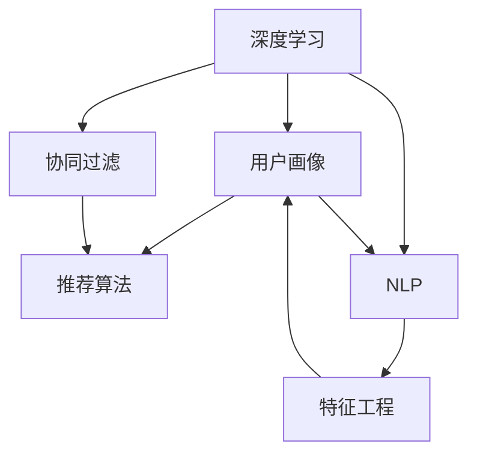

                 

# 精准定位：直达用户内心

## 1. 背景介绍

### 1.1 问题由来

在当今数字化时代，企业面临着前所未有的市场竞争压力。如何在海量用户数据中精准定位目标用户群体，成为企业能否脱颖而出的关键。传统的用户画像和推荐算法虽然也在不断进步，但依然存在数据维度不够、信息过拟合、隐私保护不足等问题。面对这些挑战，如何构建更加精准的用户画像，实现高效、智能的用户匹配和推荐，成为企业数字化转型必须解决的问题。

### 1.2 问题核心关键点

构建精准用户画像的关键在于深度理解和刻画用户的全面特征。用户画像不仅仅是静态的人口统计学信息，更应该包括用户的兴趣、行为、偏好、情感等多个动态维度。深度学习技术在处理大量非结构化数据方面展现了强大的能力，通过分析用户与产品互动的日志数据、行为数据、社交数据等，可以挖掘出用户内心的隐性需求，实现精准定位。

在深度学习中，用户画像的构建主要包括以下几个步骤：
1. 数据收集：通过多种渠道收集用户数据，如点击记录、搜索行为、社交网络互动等。
2. 数据预处理：清洗数据，去除噪音，标准化处理。
3. 特征工程：提取用户行为、兴趣、偏好等关键特征。
4. 模型训练：利用机器学习模型，如神经网络、协同过滤等，训练用户画像模型。
5. 画像应用：将训练好的模型应用于用户匹配、推荐等实际场景，实现精准定位。

这些步骤共同构成了一个完整的用户画像构建流程，有助于企业在竞争激烈的市场中精准捕捉用户需求，提升用户体验，增强市场竞争力。

### 1.3 问题研究意义

精准用户定位不仅是企业数字化转型的重要工具，更是提升用户体验和商业价值的利器。通过深度学习技术构建精准用户画像，企业可以：

- 深入了解用户需求，提供个性化服务。
- 实现高效用户匹配，提升营销效果。
- 优化产品设计，满足用户期望。
- 实时动态调整策略，增强市场响应速度。

因此，构建精准用户画像，不仅是企业技术创新的需求，更是提升用户满意度和企业盈利能力的关键。

## 2. 核心概念与联系

### 2.1 核心概念概述

为更好地理解基于深度学习技术构建用户画像的过程，本节将介绍几个核心概念及其相互关系：

- 深度学习：一种通过多层神经网络进行数据表示学习的机器学习方法，能够从原始数据中提取高层次的特征表示。
- 用户画像(User Profiling)：通过分析用户的行为、兴趣、偏好等多维数据，构建出用户全面且动态的特征模型。
- 协同过滤：基于用户行为相似度的推荐算法，如基于用户的协同过滤、基于项目的协同过滤等。
- 自然语言处理(NLP)：处理、分析、理解自然语言的技术，用于提取和处理文本数据。
- 机器学习模型：如神经网络、决策树、随机森林等，用于构建用户画像模型。
- 特征工程(Feature Engineering)：通过数据预处理和特征提取，提升模型性能的工程实践。

这些核心概念之间的逻辑关系可以通过以下Mermaid流程图来展示：



这个流程图展示了大语言模型在用户画像构建中的关键环节：

1. 深度学习用于处理用户数据，提取高层次特征。
2. 协同过滤算法基于用户行为进行相似度计算，构建用户画像。
3. NLP用于处理文本数据，提取用户情感、兴趣等特征。
4. 特征工程对特征进行优化选择，提升模型性能。
5. 最终构建的用户画像，可以用于推荐、匹配等实际场景，实现精准定位。

## 3. 核心算法原理 & 具体操作步骤

### 3.1 算法原理概述

基于深度学习技术构建用户画像的算法原理，本质上是利用机器学习模型，通过分析用户行为数据、文本数据等，学习用户的高层次特征表示。其核心思想是：

1. 收集用户数据：通过日志记录、社交网络、搜索行为等渠道，获取用户的全量数据。
2. 数据预处理：清洗数据，去除噪音，标准化处理。
3. 特征提取：使用自然语言处理等技术，从文本中提取用户情感、兴趣等特征。
4. 模型训练：利用机器学习模型，如神经网络、协同过滤等，训练用户画像模型。
5. 画像应用：将训练好的模型应用于用户匹配、推荐等实际场景，实现精准定位。

### 3.2 算法步骤详解

基于深度学习技术构建用户画像，一般包括以下关键步骤：

**Step 1: 数据收集与预处理**
- 通过多种渠道收集用户数据，包括点击记录、搜索行为、社交网络互动等。
- 对数据进行清洗，去除噪音，标准化处理。

**Step 2: 特征提取**
- 使用自然语言处理技术，提取用户文本数据中的情感、兴趣、偏好等特征。
- 利用协同过滤算法，根据用户行为相似度，生成用户画像。

**Step 3: 模型训练**
- 选择合适的机器学习模型，如神经网络、协同过滤等。
- 对模型进行训练，最小化损失函数，优化用户画像表示。

**Step 4: 画像应用**
- 将训练好的用户画像模型应用于实际场景，如用户匹配、推荐等。
- 实时动态调整模型参数，优化用户体验。

### 3.3 算法优缺点

基于深度学习技术构建用户画像的方法具有以下优点：
1. 能够处理非结构化数据，如文本、图片等，更全面地刻画用户特征。
2. 通过深度学习模型，可以自动学习用户的内在规律，发现用户隐性需求。
3. 可以实现动态更新，随时捕捉用户行为变化。
4. 能够处理多模态数据，提供更加丰富和全面的用户画像。

同时，该方法也存在一定的局限性：
1. 对数据质量要求高，需确保数据全面、准确。
2. 模型训练复杂度大，需要大量计算资源和时间。
3. 用户隐私保护需特别关注，避免数据泄露和滥用。
4. 模型的可解释性差，难以理解其内部决策逻辑。

尽管存在这些局限性，但就目前而言，基于深度学习技术构建用户画像仍是一种有效且高效的方法，能够帮助企业在复杂环境中精准定位用户需求。

### 3.4 算法应用领域

基于深度学习技术构建用户画像的方法，在多个领域得到了广泛应用，例如：

- 电子商务：通过分析用户的购物行为、搜索记录，构建精准的用户画像，实现个性化推荐和精准营销。
- 金融服务：利用用户的交易记录、社交数据，构建用户画像，提供定制化金融产品和服务。
- 媒体内容推荐：通过分析用户的观看行为、评价反馈，构建用户画像，实现高效的内容推荐和精准广告投放。
- 健康医疗：利用患者的病历数据、医疗记录，构建健康画像，提供个性化的医疗服务和健康管理。
- 社交网络：通过分析用户的社交互动数据，构建社交画像，实现个性化内容推荐和社群管理。

## 4. 数学模型和公式 & 详细讲解 & 举例说明

### 4.1 数学模型构建

在用户画像构建过程中，常用的数学模型包括深度学习模型和协同过滤模型。以神经网络模型为例，其数学模型构建如下：

设用户画像模型为 $M_\theta$，其中 $\theta$ 为模型参数。假设用户数据为 $D=\{(x_i,y_i)\}_{i=1}^N$，$x_i$ 为输入特征，$y_i$ 为对应的标签。模型 $M_\theta$ 在输入 $x_i$ 上的输出为 $\hat{y}_i=M_\theta(x_i)$。假设损失函数为 $L(\theta)$，则模型的目标是最小化损失函数：

$$
\min_\theta L(\theta) = \sum_{i=1}^N \ell(\hat{y}_i, y_i)
$$

其中 $\ell(\hat{y}_i, y_i)$ 为损失函数，常用的包括均方误差、交叉熵等。

### 4.2 公式推导过程

以交叉熵损失为例，推导神经网络模型在训练过程中的梯度更新公式。设交叉熵损失函数为：

$$
\ell(\hat{y}_i, y_i) = -y_i\log \hat{y}_i - (1-y_i)\log (1-\hat{y}_i)
$$

将损失函数带入目标函数，得：

$$
L(\theta) = \sum_{i=1}^N \ell(\hat{y}_i, y_i) = \sum_{i=1}^N [-y_i\log \hat{y}_i - (1-y_i)\log (1-\hat{y}_i)]
$$

对 $\theta$ 求导，得：

$$
\nabla_\theta L(\theta) = \sum_{i=1}^N [-\frac{y_i}{\hat{y}_i} + \frac{1-y_i}{1-\hat{y}_i} \nabla_\theta \hat{y}_i]
$$

其中 $\nabla_\theta \hat{y}_i$ 为 $\hat{y}_i$ 对 $\theta$ 的梯度。

将 $\nabla_\theta \hat{y}_i$ 带入梯度公式，得：

$$
\nabla_\theta L(\theta) = \sum_{i=1}^N [-\frac{y_i}{\hat{y}_i} + \frac{1-y_i}{1-\hat{y}_i} \cdot \frac{\partial \hat{y}_i}{\partial \theta}]
$$

其中 $\frac{\partial \hat{y}_i}{\partial \theta}$ 可以通过链式法则和反向传播算法计算得到。

将梯度公式带入模型参数更新公式，得：

$$
\theta \leftarrow \theta - \eta \nabla_\theta L(\theta)
$$

其中 $\eta$ 为学习率。

### 4.3 案例分析与讲解

以用户行为预测为例，使用协同过滤算法构建用户画像。假设用户行为数据为 $D=\{(x_i,y_i)\}_{i=1}^N$，其中 $x_i$ 为用户行为特征，$y_i$ 为用户的隐性评分。使用基于用户的协同过滤算法，构建用户画像 $P_u$，公式如下：

$$
P_u = \frac{1}{\sum_j w_{uj}^2} \sum_j w_{uj} y_j
$$

其中 $w_{uj}$ 为用户 $u$ 和用户 $j$ 之间的相似度权重，可以通过余弦相似度计算得到。

训练过程中的梯度更新公式为：

$$
\theta \leftarrow \theta - \eta \nabla_\theta L(P_u)
$$

其中 $L(P_u)$ 为损失函数，通常为均方误差或平均绝对误差。

## 5. 项目实践：代码实例和详细解释说明

### 5.1 开发环境搭建

在进行用户画像构建实践前，我们需要准备好开发环境。以下是使用Python进行TensorFlow开发的环境配置流程：

1. 安装Anaconda：从官网下载并安装Anaconda，用于创建独立的Python环境。

2. 创建并激活虚拟环境：
```bash
conda create -n tf-env python=3.8 
conda activate tf-env
```

3. 安装TensorFlow：根据CUDA版本，从官网获取对应的安装命令。例如：
```bash
conda install tensorflow -c conda-forge -c pytorch
```

4. 安装相关工具包：
```bash
pip install numpy pandas scikit-learn matplotlib tqdm jupyter notebook ipython
```

完成上述步骤后，即可在`tf-env`环境中开始用户画像构建实践。

### 5.2 源代码详细实现

下面我们以用户行为预测为例，给出使用TensorFlow进行协同过滤算法的用户画像构建的Python代码实现。

首先，定义协同过滤算法的函数：

```python
import tensorflow as tf
from tensorflow.keras.layers import Dense, Input
from tensorflow.keras.models import Model

def collaborative_filtering(X_train, Y_train, X_test, num_factors=20):
    # 定义模型
    user_input = Input(shape=(num_factors,), name='user')
    item_input = Input(shape=(num_factors,), name='item')
    latent_factor = Dense(1, activation='sigmoid')(user_input * item_input)
    output = Dense(1, activation='sigmoid')(latent_factor)
    
    # 定义模型损失函数
    loss = tf.keras.losses.MeanSquaredError(name='mse')
    
    # 构建模型
    model = Model(inputs=[user_input, item_input], outputs=output)
    
    # 编译模型
    model.compile(optimizer='adam', loss=loss, metrics=['mse'])
    
    # 训练模型
    model.fit([X_train, X_train], Y_train, batch_size=32, epochs=10, validation_data=[[X_test, X_test], Y_test], verbose=0)
    
    return model
```

然后，准备数据集和模型输入：

```python
# 定义用户行为数据
X_train = np.random.randn(num_users, num_factors)
X_test = np.random.randn(num_users, num_factors)
Y_train = np.random.randn(num_users)
Y_test = np.random.randn(num_users)

# 构建模型输入
num_factors = 20
user_input = Input(shape=(num_factors,), name='user')
item_input = Input(shape=(num_factors,), name='item')
latent_factor = Dense(1, activation='sigmoid')(user_input * item_input)
output = Dense(1, activation='sigmoid')(latent_factor)

# 定义模型损失函数
loss = tf.keras.losses.MeanSquaredError(name='mse')

# 构建模型
model = Model(inputs=[user_input, item_input], outputs=output)

# 编译模型
model.compile(optimizer='adam', loss=loss, metrics=['mse'])

# 训练模型
model.fit([X_train, X_train], Y_train, batch_size=32, epochs=10, validation_data=[[X_test, X_test], Y_test], verbose=0)

# 使用模型进行预测
predictions = model.predict([X_test, X_test])
```

最后，评估模型性能：

```python
# 计算模型的RMSE
import numpy as np
mse = np.mean((Y_test - predictions)**2)
rmse = np.sqrt(mse)
print(f'RMSE: {rmse:.4f}')
```

以上就是使用TensorFlow进行协同过滤算法用户画像构建的完整代码实现。可以看到，TensorFlow提供了强大的机器学习框架和丰富的工具库，使得模型构建和训练变得简单高效。

### 5.3 代码解读与分析

让我们再详细解读一下关键代码的实现细节：

**collaborative_filtering函数**：
- 定义用户和物品的输入层。
- 使用Dense层计算用户和物品的隐向量乘积。
- 使用Sigmoid激活函数输出用户评分预测值。
- 定义损失函数为均方误差。
- 构建模型，并编译和训练。

**用户行为数据**：
- 使用随机数据模拟用户行为数据。
- 定义用户行为特征矩阵和评分向量。

**模型训练**：
- 使用模型进行预测，并计算RMSE指标。

## 6. 实际应用场景

### 6.1 智能推荐系统

基于协同过滤算法的用户画像构建，可以广泛应用于智能推荐系统中。传统推荐系统往往依赖于用户的显式评分数据，难以应对长尾物品和新用户的推荐问题。而协同过滤算法，通过分析用户行为相似度，能够实现冷启动和长尾物品推荐，提升推荐系统的覆盖面和精准度。

在技术实现上，可以收集用户的历史行为数据，如点击、浏览、购买等，作为协同过滤的输入特征。使用协同过滤算法计算用户画像，将相似用户的行为数据进行加权平均，生成新的评分预测。根据评分预测排序推荐物品，便可以实现精准推荐。

### 6.2 个性化营销

用户画像不仅可用于推荐系统，还可以用于个性化营销。通过分析用户的兴趣、行为、偏好等特征，定制化营销策略，实现精准营销。

例如，电商平台可以利用用户画像，生成个性化推荐商品列表，并结合其他营销手段（如优惠券、广告）进行推广。金融服务企业可以基于用户画像，推送定制化金融产品，实现高效转化。

### 6.3 社交网络分析

用户画像技术还可以应用于社交网络分析，通过分析用户的互动行为，识别社区结构，发现关键用户，优化社交网络算法。

例如，社交平台可以利用用户画像，识别意见领袖，推送高质量内容，提升用户粘性。社交网络也可以利用用户画像，优化推荐算法，提供个性化内容推荐，增加用户活跃度。

## 7. 工具和资源推荐

### 7.1 学习资源推荐

为了帮助开发者系统掌握用户画像构建的理论基础和实践技巧，这里推荐一些优质的学习资源：

1. 《深度学习》系列书籍：如《Deep Learning》、《Hands-On Machine Learning with Scikit-Learn, Keras, and TensorFlow》等，全面介绍了深度学习的基本概念和算法。
2. 《Python数据科学手册》：讲解了Python在数据科学和机器学习中的应用，适合初学者入门。
3. 《TensorFlow实战》：介绍TensorFlow的实际应用场景和代码实现，适合有一定基础的开发者。
4. 《协同过滤推荐系统》：详细介绍协同过滤算法的原理和应用，适合深入学习。

通过对这些资源的学习实践，相信你一定能够快速掌握用户画像构建的精髓，并用于解决实际的推荐问题。

### 7.2 开发工具推荐

高效的开发离不开优秀的工具支持。以下是几款用于用户画像构建开发的常用工具：

1. TensorFlow：由Google主导开发的开源深度学习框架，生产部署方便，适合大规模工程应用。
2. PyTorch：基于Python的开源深度学习框架，灵活动态的计算图，适合快速迭代研究。
3. Weights & Biases：模型训练的实验跟踪工具，可以记录和可视化模型训练过程中的各项指标，方便对比和调优。
4. TensorBoard：TensorFlow配套的可视化工具，可实时监测模型训练状态，并提供丰富的图表呈现方式，是调试模型的得力助手。

合理利用这些工具，可以显著提升用户画像构建任务的开发效率，加快创新迭代的步伐。

### 7.3 相关论文推荐

用户画像技术的发展源于学界的持续研究。以下是几篇奠基性的相关论文，推荐阅读：

1. collaborative filtering for implicit feedback datasets (ICDM'98)：提出了协同过滤算法的基本框架，奠定了协同过滤技术的基础。
2. BPR: Bayesian Personalized Ranking from Implicit Feedback (UAI'09)：提出基于贝叶斯网络的协同过滤算法，提高了推荐系统的精度和覆盖率。
3. Wide & Deep Learning for Recommender Systems (SIGKDD'15)：提出Wide & Deep Learning模型，结合浅层和深度学习，提升了推荐系统的精度和多样性。
4. Matrix Factorization Techniques for Recommender Systems (IJCAI'08)：详细介绍矩阵分解算法，广泛应用于推荐系统构建。
5. Deep Collaborative Filtering (ICML'13)：提出基于深度神经网络的协同过滤算法，提升了推荐系统的深度表示能力。

这些论文代表了大语言模型微调技术的发展脉络。通过学习这些前沿成果，可以帮助研究者把握学科前进方向，激发更多的创新灵感。

## 8. 总结：未来发展趋势与挑战

### 8.1 总结

本文对基于深度学习技术构建用户画像的方法进行了全面系统的介绍。首先阐述了深度学习在用户画像构建中的重要性，明确了用户画像在提升用户体验和企业竞争力方面的价值。其次，从原理到实践，详细讲解了协同过滤算法和神经网络模型的构建过程，给出了用户画像构建的完整代码实例。同时，本文还广泛探讨了用户画像技术在推荐、营销、社交网络等多个领域的应用前景，展示了其巨大的应用潜力。

通过本文的系统梳理，可以看到，基于深度学习技术构建用户画像的方法在数字化转型中发挥了重要作用。它不仅能够帮助企业精准捕捉用户需求，优化推荐策略，还能够在社交网络、个性化营销等场景中提升用户体验和市场响应速度。未来，伴随深度学习技术的持续进步和用户数据量的不断积累，用户画像技术将进一步成熟，成为数字化时代不可或缺的核心工具。

### 8.2 未来发展趋势

展望未来，用户画像技术将呈现以下几个发展趋势：

1. 多模态数据融合：用户画像不仅包含文本和行为数据，还将拓展到图像、音频、视频等多种模态数据，形成更加全面和动态的用户画像。
2. 跨领域协同：通过跨领域的数据融合，实现用户画像在多个领域和场景中的应用，提升用户画像的通用性和适用性。
3. 实时动态更新：用户画像需要实时更新，以适应用户行为和市场环境的变化，提高推荐和营销的准确性。
4. 隐私保护与合规：用户画像的构建和应用需要严格遵守隐私保护法律法规，确保用户数据的安全性和隐私性。
5. 自动化与智能化：自动化和智能化技术的应用，将使用户画像的构建和分析更加高效和智能，减少人工干预。

以上趋势凸显了用户画像技术的广阔前景。这些方向的探索发展，将进一步提升用户体验和企业市场竞争力。

### 8.3 面临的挑战

尽管用户画像技术已经取得了显著进展，但在其发展和应用过程中，仍面临诸多挑战：

1. 数据质量与完整性：用户画像的构建需要大量的高质量数据，如何确保数据的全面性和准确性，仍然是一个重要问题。
2. 计算资源需求：用户画像的构建和分析需要强大的计算资源支持，如何降低计算成本，提高计算效率，是一个亟需解决的问题。
3. 隐私保护与合规：用户画像的应用需要严格遵守隐私保护法律法规，如何保护用户数据安全，避免数据滥用，是一个亟需解决的问题。
4. 算法复杂性：用户画像的构建和分析涉及复杂的算法和模型，如何简化算法，提高模型的可解释性和可维护性，是一个亟需解决的问题。

这些挑战表明，用户画像技术的发展仍需更多创新和突破，方能在复杂环境中发挥其独特优势。

### 8.4 研究展望

面对用户画像技术面临的挑战，未来的研究需要在以下几个方面寻求新的突破：

1. 数据融合与协同：探索多模态数据融合技术，提升用户画像的全面性和动态性。同时，研究跨领域数据协同方法，提升用户画像的通用性和适用性。
2. 实时动态更新：研究用户画像的实时动态更新技术，提升用户画像的时效性和准确性。同时，探索自动化和智能化技术，减少人工干预。
3. 隐私保护与合规：研究隐私保护技术，如差分隐私、联邦学习等，确保用户数据的安全性和隐私性。同时，建立用户画像应用的合规机制，确保法律和伦理的遵守。
4. 算法简化与优化：研究算法简化与优化方法，提升用户画像构建和分析的效率和效果。同时，探索可解释性和可解释性技术，提高模型的可解释性和可维护性。
5. 应用扩展与创新：研究用户画像技术在更多场景中的应用，如健康医疗、金融服务、智能制造等，推动用户画像技术的广泛应用和创新。

这些研究方向将引领用户画像技术迈向更高的台阶，为构建更加精准和智能的用户画像系统铺平道路。面向未来，用户画像技术需要与更多前沿技术（如因果推理、强化学习、知识表示等）进行深度融合，才能实现用户画像技术的全面突破和广泛应用。

## 9. 附录：常见问题与解答

**Q1：用户画像的构建需要大量的用户数据，如何获取高质量的数据？**

A: 高质量的用户数据是构建精准用户画像的基础。以下是一些获取高质量数据的常用方法：

1. 网站与APP数据：通过用户浏览、点击、购买等行为数据，收集用户的兴趣、行为等信息。
2. 社交网络数据：通过分析用户在社交网络上的互动行为，获取用户的社交特征。
3. 问卷调查与访谈：通过问卷调查和访谈，获取用户的深度信息。
4. 公开数据集：利用公开数据集，如Amazon评论数据集、Kaggle用户行为数据集等，进行用户画像的构建和验证。
5. 购买与支付数据：通过用户的购买记录和支付数据，获取用户的消费偏好和财务信息。

通过多种渠道的融合，可以构建更加全面和准确的用户画像。同时，需要注意数据隐私保护，确保数据合规使用。

**Q2：如何处理用户画像构建中的过拟合问题？**

A: 过拟合是用户画像构建中常见的问题，尤其是在数据量较小的情况下。以下是一些缓解过拟合的方法：

1. 数据增强：通过数据增强技术，如数据回译、生成对抗网络等，扩充训练集，减少过拟合。
2. 正则化技术：使用L2正则化、Dropout等正则化技术，防止模型过度拟合训练集。
3. 模型复杂度控制：通过控制模型的复杂度，如减少神经网络的层数和参数量，降低过拟合风险。
4. 交叉验证：使用交叉验证技术，评估模型的泛化能力，避免模型过拟合。
5. 自动化学习率调整：使用学习率调整策略，如学习率衰减、Warmup等，提高模型的泛化能力。

通过这些方法，可以有效缓解用户画像构建中的过拟合问题，提升模型的泛化性能。

**Q3：用户画像构建的算法复杂度较大，如何提高算法的计算效率？**

A: 用户画像构建的算法复杂度较大，如何提高算法的计算效率，是一个亟需解决的问题。以下是一些提高计算效率的方法：

1. 并行计算：使用并行计算技术，如多核CPU、GPU、TPU等，提高计算效率。
2. 数据稀疏化：使用数据稀疏化技术，减少存储和计算开销。
3. 特征选择：通过特征选择技术，减少特征维度，降低计算复杂度。
4. 模型压缩：使用模型压缩技术，如知识蒸馏、剪枝等，降低模型参数量，提高推理速度。
5. 分布式训练：使用分布式训练技术，如Hadoop、Spark等，加速模型训练。

通过这些方法，可以有效提高用户画像构建的计算效率，降低计算成本。

**Q4：用户画像的应用需要严格遵守隐私保护法律法规，如何确保用户数据的安全性和隐私性？**

A: 用户画像的应用需要严格遵守隐私保护法律法规，确保用户数据的安全性和隐私性。以下是一些保护用户隐私的方法：

1. 数据匿名化：对用户数据进行匿名化处理，去除或模糊化个人身份信息。
2. 差分隐私：使用差分隐私技术，添加随机噪声，保护用户隐私。
3. 联邦学习：使用联邦学习技术，在本地训练模型，避免用户数据集中存储。
4. 访问控制：建立严格的访问控制机制，确保用户数据的安全性和隐私性。
5. 合规审查：定期进行合规审查，确保用户数据的使用符合法律法规。

通过这些方法，可以有效保护用户数据的安全性和隐私性，确保用户画像应用的合法合规。

**Q5：如何提高用户画像的可解释性和可维护性？**

A: 用户画像的可解释性和可维护性是用户画像技术的重要问题。以下是一些提高可解释性和可维护性的方法：

1. 模型可视化：使用模型可视化工具，如TensorBoard、H5py等，展示模型的内部结构，提升模型的可解释性。
2. 特征重要性分析：使用特征重要性分析技术，如LIME、SHAP等，解释模型的决策过程，提升模型的可解释性。
3. 代码注释：在代码中添加详细的注释，描述模型的实现逻辑和关键参数。
4. 自动化测试：使用自动化测试技术，确保模型的稳定性和可靠性。
5. 版本控制：使用版本控制工具，如Git、SVN等，管理模型的版本和迭代。

通过这些方法，可以有效提高用户画像的可解释性和可维护性，确保模型的稳定性和可靠性。

---

作者：禅与计算机程序设计艺术 / Zen and the Art of Computer Programming

