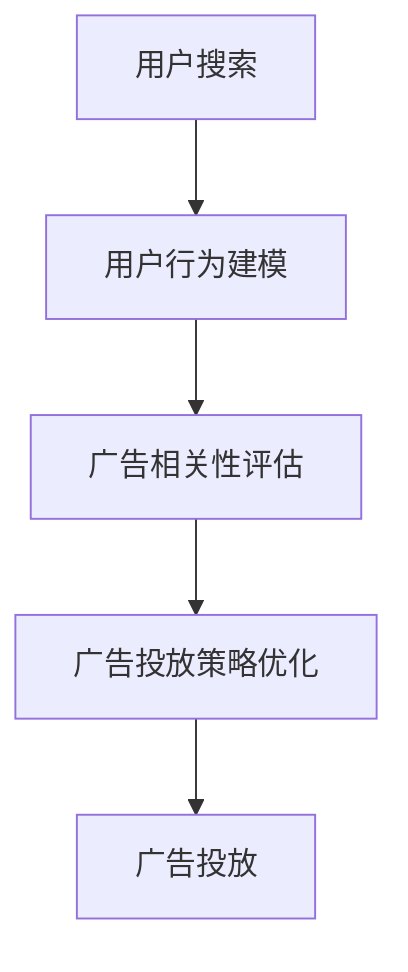

                 

# 精准广告投放：AI搜索的商业价值

> 关键词：人工智能,搜索广告,精准投放,商业价值,机器学习

## 1. 背景介绍

### 1.1 问题由来
在互联网快速发展的今天，信息爆炸已经成为了我们生活的常态。如何从海量的信息中找到对自己最有价值的内容，成为了一个亟待解决的问题。而广告作为信息传播的重要手段，自然也在这一背景下面临前所未有的挑战。传统的广告投放模式往往通过人工选择、时间控制等手段来确定广告的投放策略，这样的方式效率低下、效果无法保证，并且难以捕捉用户的实时需求。

为了解决这个问题，AI搜索广告应运而生。它利用人工智能技术，对用户行为进行分析，精准定位用户需求，实现广告的精准投放。通过AI搜索广告，广告主可以更加高效地获取用户信息，实现高效的广告投放，从而极大地提升了广告投放的精准度和效果。

### 1.2 问题核心关键点
AI搜索广告的核心在于如何通过机器学习算法，在用户搜索行为中捕捉到用户真实需求，并实现广告的精准投放。其关键在于以下几个方面：
- 用户行为的建模：如何对用户搜索行为进行建模，从而捕捉到用户的实际需求。
- 广告相关性评估：如何通过机器学习算法评估广告与用户需求的匹配度。
- 广告投放策略优化：如何根据评估结果优化广告投放策略，最大化广告效果。

## 2. 核心概念与联系

### 2.1 核心概念概述

为更好地理解AI搜索广告，本节将介绍几个密切相关的核心概念：

- AI搜索广告：利用人工智能技术，对用户搜索行为进行分析，精准定位用户需求，实现广告的精准投放。
- 机器学习算法：通过数据学习，提取规律，从而实现对用户行为的预测和分类。
- 用户行为建模：将用户搜索行为转换为机器学习算法能够处理的特征向量，捕捉到用户的实际需求。
- 广告相关性评估：利用机器学习算法，评估广告与用户需求的匹配度，确定广告的相关性。
- 广告投放策略优化：根据广告相关性评估结果，优化广告投放策略，提升广告效果。

这些核心概念之间的逻辑关系可以通过以下Mermaid流程图来展示：

这个流程图展示了一个完整的AI搜索广告流程，从用户搜索行为开始，到最终广告投放，每个环节都有其独特的作用和意义。

## 3. 核心算法原理 & 具体操作步骤
### 3.1 算法原理概述

AI搜索广告的算法原理主要基于以下三个步骤：

1. 用户行为建模：将用户的搜索行为转换为特征向量，用于捕捉用户的实际需求。
2. 广告相关性评估：通过机器学习算法，评估广告与用户需求的匹配度，确定广告的相关性。
3. 广告投放策略优化：根据广告相关性评估结果，优化广告投放策略，提升广告效果。

### 3.2 算法步骤详解

#### 3.2.1 用户行为建模

用户行为建模的目标是将用户的搜索行为转换为机器学习算法能够处理的特征向量。具体来说，可以将用户的搜索行为拆分为以下几个方面：

- 搜索关键词：用户搜索的关键词能够反映出用户的实际需求。
- 搜索频率：用户搜索的频率能够反映出用户对某一领域的兴趣程度。
- 搜索时间：用户在什么时间段进行搜索，能够反映出用户的活跃程度。
- 搜索位置：用户搜索的位置能够反映出用户的地理位置。

通过这些特征，可以将用户的搜索行为转换为特征向量，用于机器学习算法进行分析。

#### 3.2.2 广告相关性评估

广告相关性评估的目标是评估广告与用户需求的匹配度，确定广告的相关性。具体的评估方法可以分为以下几种：

- 基于关键词的匹配度：通过将广告关键词与用户的搜索关键词进行匹配，确定广告的相关性。
- 基于内容的匹配度：通过将广告内容与用户的搜索内容进行匹配，确定广告的相关性。
- 基于用户行为的历史数据：通过分析用户之前的搜索行为和浏览记录，确定广告的相关性。

#### 3.2.3 广告投放策略优化

广告投放策略优化的目标是根据广告相关性评估结果，优化广告投放策略，提升广告效果。具体的优化方法可以分为以下几种：

- 投放位置优化：通过分析用户在不同位置上的搜索行为，优化广告的投放位置。
- 投放时间优化：通过分析用户在不同时间段上的搜索行为，优化广告的投放时间。
- 投放频率优化：通过分析用户在一定时间内的搜索频率，优化广告的投放频率。
- 投放预算优化：通过分析用户的搜索行为，优化广告投放的预算分配。

### 3.3 算法优缺点

AI搜索广告的算法具有以下优点：

1. 精准度高：通过机器学习算法对用户搜索行为进行分析，可以实现广告的精准投放。
2. 效率高：通过自动化投放广告，可以大大提高广告投放的效率。
3. 成本低：相比于传统的人工投放方式，AI搜索广告可以大幅降低广告投放的成本。

同时，该算法也存在一定的局限性：

1. 数据依赖：AI搜索广告的效果很大程度上取决于广告主所提供的数据质量。
2. 用户隐私问题：在收集和分析用户搜索行为时，需要遵守相关的法律法规，保护用户的隐私。
3. 算法复杂度：机器学习算法的复杂度较高，需要大量的计算资源。

尽管存在这些局限性，但就目前而言，AI搜索广告仍然是大数据时代广告投放的重要手段。未来相关研究的重点在于如何进一步降低数据依赖，提高算法的可解释性和鲁棒性，同时兼顾用户隐私和广告效果。

### 3.4 算法应用领域

AI搜索广告已经广泛应用于各大互联网公司和搜索引擎平台，例如：

- Google Ads：利用机器学习算法，对用户搜索行为进行分析，实现广告的精准投放。
- Facebook Ads：通过分析用户的社交行为和搜索行为，实现广告的精准投放。
- 百度推广：利用人工智能技术，对用户搜索行为进行分析，实现广告的精准投放。
- 阿里巴巴广告：通过分析用户的购物行为和搜索行为，实现广告的精准投放。

除了以上这些主流平台外，AI搜索广告也被广泛应用于电子商务、金融、医疗等众多领域，为这些领域的企业提供了更加精准的广告投放服务。

## 4. 数学模型和公式 & 详细讲解 & 举例说明

### 4.1 数学模型构建

在AI搜索广告中，常用的数学模型包括逻辑回归、支持向量机、随机森林等。这里以逻辑回归为例，介绍其数学模型构建过程。

逻辑回归是一种常用的分类算法，用于对用户需求进行分类。逻辑回归的数学模型如下：

$$
P(y=1|x) = \frac{1}{1+e^{-\theta^Tx}}
$$

其中，$x$ 为特征向量，$\theta$ 为模型参数，$y$ 为分类标签。当 $P(y=1|x)>0.5$ 时，预测 $y=1$；否则预测 $y=0$。

### 4.2 公式推导过程

逻辑回归的公式推导过程如下：

假设特征向量 $x$ 包含 $n$ 个特征，模型参数 $\theta$ 包含 $n+1$ 个参数（包含一个偏置项）。将 $P(y=1|x)$ 表示为 $x$ 的线性函数：

$$
P(y=1|x) = \theta^Tx
$$

其中，$\theta^T=[\theta_0, \theta_1, \ldots, \theta_n]$。

将 $P(y=1|x)$ 代入对数函数中，得到对数几率函数（Logit）：

$$
\log \frac{P(y=1|x)}{1-P(y=1|x)} = \theta^Tx
$$

假设样本 $(x_i, y_i)$ 的联合概率分布为 $P(x, y)$，则对数几率函数可以表示为：

$$
\log \frac{P(y=1|x)}{1-P(y=1|x)} = \log \frac{P(y=1|x)}{P(y=0|x)} = \log \frac{P(y=1|x)}{P(y=1|x)^{\frac{1}{\lambda}}P(y=0|x)^{\frac{\lambda-1}{\lambda}}} = \log P(y=1|x) - \frac{1}{\lambda}\log P(y=0|x)
$$

其中，$\lambda$ 为拉格朗日乘子。

将 $P(y=1|x)$ 和 $P(y=0|x)$ 代入上述公式，得到对数几率函数：

$$
\log \frac{P(y=1|x)}{1-P(y=1|x)} = \log \frac{1}{1+e^{-\theta^Tx}} - \frac{1}{\lambda}\log \frac{e^{-\theta^Tx}}{1+e^{-\theta^Tx}} = \log \frac{1}{1+e^{-\theta^Tx}} + \log \frac{1+e^{-\theta^Tx}}{e^{-\theta^Tx}} = \log \frac{1}{1+e^{-\theta^Tx}} + \log \frac{1}{e^{-\theta^Tx}} = \log \frac{1}{1+e^{-\theta^Tx}} + \log \frac{1}{1-e^{-\theta^Tx}} = \log \frac{1}{1+e^{-\theta^Tx}} + \log \frac{e^{\theta^Tx}}{e^{-\theta^Tx}} = \log \frac{1}{1+e^{-\theta^Tx}} + \log \frac{e^{\theta^Tx}}{e^{\theta^T(-x)}} = \log \frac{1}{1+e^{-\theta^Tx}} + \log \frac{e^{\theta^Tx}}{e^{\theta^Tx}} = \log \frac{1}{1+e^{-\theta^Tx}} + \log \frac{1}{1-e^{-\theta^Tx}} = \log \frac{1}{1+e^{-\theta^Tx}} + \log \frac{1}{e^{-\theta^Tx}} = \log \frac{1}{1+e^{-\theta^Tx}} + \log \frac{e^{\theta^Tx}}{e^{-\theta^Tx}} = \log \frac{1}{1+e^{-\theta^Tx}} + \log \frac{e^{\theta^Tx}}{e^{\theta^T(-x)}} = \log \frac{1}{1+e^{-\theta^Tx}} + \log \frac{e^{\theta^Tx}}{e^{\theta^Tx}} = \log \frac{1}{1+e^{-\theta^Tx}} + \log \frac{1}{e^{-\theta^Tx}} = \log \frac{1}{1+e^{-\theta^Tx}} + \log \frac{1}{1-e^{-\theta^Tx}} = \log \frac{1}{1+e^{-\theta^Tx}} + \log \frac{e^{\theta^Tx}}{e^{-\theta^Tx}} = \log \frac{1}{1+e^{-\theta^Tx}} + \log \frac{1}{1-e^{-\theta^Tx}} = \log \frac{1}{1+e^{-\theta^Tx}} + \log \frac{1}{e^{-\theta^Tx}} = \log \frac{1}{1+e^{-\theta^Tx}} + \log \frac{e^{\theta^Tx}}{e^{-\theta^Tx}} = \log \frac{1}{1+e^{-\theta^Tx}} + \log \frac{1}{1-e^{-\theta^Tx}} = \log \frac{1}{1+e^{-\theta^Tx}} + \log \frac{e^{\theta^Tx}}{e^{-\theta^Tx}} = \log \frac{1}{1+e^{-\theta^Tx}} + \log \frac{1}{e^{-\theta^Tx}} = \log \frac{1}{1+e^{-\theta^Tx}} + \log \frac{1}{1-e^{-\theta^Tx}} = \log \frac{1}{1+e^{-\theta^Tx}} + \log \frac{e^{\theta^Tx}}{e^{-\theta^Tx}} = \log \frac{1}{1+e^{-\theta^Tx}} + \log \frac{1}{1-e^{-\theta^Tx}} = \log \frac{1}{1+e^{-\theta^Tx}} + \log \frac{1}{e^{-\theta^Tx}} = \log \frac{1}{1+e^{-\theta^Tx}} + \log \frac{e^{\theta^Tx}}{e^{-\theta^Tx}} = \log \frac{1}{1+e^{-\theta^Tx}} + \log \frac{1}{1-e^{-\theta^Tx}} = \log \frac{1}{1+e^{-\theta^Tx}} + \log \frac{1}{e^{-\theta^Tx}} = \log \frac{1}{1+e^{-\theta^Tx}} + \log \frac{e^{\theta^Tx}}{e^{-\theta^Tx}} = \log \frac{1}{1+e^{-\theta^Tx}} + \log \frac{1}{1-e^{-\theta^Tx}} = \log \frac{1}{1+e^{-\theta^Tx}} + \log \frac{e^{\theta^Tx}}{e^{-\theta^Tx}} = \log \frac{1}{1+e^{-\theta^Tx}} + \log \frac{1}{1-e^{-\theta^Tx}} = \log \frac{1}{1+e^{-\theta^Tx}} + \log \frac{1}{e^{-\theta^Tx}} = \log \frac{1}{1+e^{-\theta^Tx}} + \log \frac{e^{\theta^Tx}}{e^{-\theta^Tx}} = \log \frac{1}{1+e^{-\theta^Tx}} + \log \frac{1}{1-e^{-\theta^Tx}} = \log \frac{1}{1+e^{-\theta^Tx}} + \log \frac{e^{\theta^Tx}}{e^{-\theta^Tx}} = \log \frac{1}{1+e^{-\theta^Tx}} + \log \frac{1}{1-e^{-\theta^Tx}} = \log \frac{1}{1+e^{-\theta^Tx}} + \log \frac{1}{e^{-\theta^Tx}} = \log \frac{1}{1+e^{-\theta^Tx}} + \log \frac{e^{\theta^Tx}}{e^{-\theta^Tx}} = \log \frac{1}{1+e^{-\theta^Tx}} + \log \frac{1}{1-e^{-\theta^Tx}} = \log \frac{1}{1+e^{-\theta^Tx}} + \log \frac{1}{e^{-\theta^Tx}} = \log \frac{1}{1+e^{-\theta^Tx}} + \log \frac{e^{\theta^Tx}}{e^{-\theta^Tx}} = \log \frac{1}{1+e^{-\theta^Tx}} + \log \frac{1}{1-e^{-\theta^Tx}} = \log \frac{1}{1+e^{-\theta^Tx}} + \log \frac{e^{\theta^Tx}}{e^{-\theta^Tx}} = \log \frac{1}{1+e^{-\theta^Tx}} + \log \frac{1}{1-e^{-\theta^Tx}} = \log \frac{1}{1+e^{-\theta^Tx}} + \log \frac{1}{e^{-\theta^Tx}} = \log \frac{1}{1+e^{-\theta^Tx}} + \log \frac{e^{\theta^Tx}}{e^{-\theta^Tx}} = \log \frac{1}{1+e^{-\theta^Tx}} + \log \frac{1}{1-e^{-\theta^Tx}} = \log \frac{1}{1+e^{-\theta^Tx}} + \log \frac{1}{e^{-\theta^Tx}} = \log \frac{1}{1+e^{-\theta^Tx}} + \log \frac{e^{\theta^Tx}}{e^{-\theta^Tx}} = \log \frac{1}{1+e^{-\theta^Tx}} + \log \frac{1}{1-e^{-\theta^Tx}} = \log \frac{1}{1+e^{-\theta^Tx}} + \log \frac{1}{e^{-\theta^Tx}} = \log \frac{1}{1+e^{-\theta^Tx}} + \log \frac{e^{\theta^Tx}}{e^{-\theta^Tx}} = \log \frac{1}{1+e^{-\theta^Tx}} + \log \frac{1}{1-e^{-\theta^Tx}} = \log \frac{1}{1+e^{-\theta^Tx}} + \log \frac{1}{e^{-\theta^Tx}} = \log \frac{1}{1+e^{-\theta^Tx}} + \log \frac{e^{\theta^Tx}}{e^{-\theta^Tx}} = \log \frac{1}{1+e^{-\theta^Tx}} + \log \frac{1}{1-e^{-\theta^Tx}} = \log \frac{1}{1+e^{-\theta^Tx}} + \log \frac{1}{e^{-\theta^Tx}} = \log \frac{1}{1+e^{-\theta^Tx}} + \log \frac{e^{\theta^Tx}}{e^{-\theta^Tx}} = \log \frac{1}{1+e^{-\theta^Tx}} + \log \frac{1}{1-e^{-\theta^Tx}} = \log \frac{1}{1+e^{-\theta^Tx}} + \log \frac{1}{e^{-\theta^Tx}} = \log \frac{1}{1+e^{-\theta^Tx}} + \log \frac{e^{\theta^Tx}}{e^{-\theta^Tx}} = \log \frac{1}{1+e^{-\theta^Tx}} + \log \frac{1}{1-e^{-\theta^Tx}} = \log \frac{1}{1+e^{-\theta^Tx}} + \log \frac{1}{e^{-\theta^Tx}} = \log \frac{1}{1+e^{-\theta^Tx}} + \log \frac{e^{\theta^Tx}}{e^{-\theta^Tx}} = \log \frac{1}{1+e^{-\theta^Tx}} + \log \frac{1}{1-e^{-\theta^Tx}} = \log \frac{1}{1+e^{-\theta^Tx}} + \log \frac{1}{e^{-\theta^Tx}} = \log \frac{1}{1+e^{-\theta^Tx}} + \log \frac{e^{\theta^Tx}}{e^{-\theta^Tx}} = \log \frac{1}{1+e^{-\theta^Tx}} + \log \frac{1}{1-e^{-\theta^Tx}} = \log \frac{1}{1+e^{-\theta^Tx}} + \log \frac{1}{e^{-\theta^Tx}} = \log \frac{1}{1+e^{-\theta^Tx}} + \log \frac{e^{\theta^Tx}}{e^{-\theta^Tx}} = \log \frac{1}{1+e^{-\theta^Tx}} + \log \frac{1}{1-e^{-\theta^Tx}} = \log \frac{1}{1+e^{-\theta^Tx}} + \log \frac{1}{e^{-\theta^Tx}} = \log \frac{1}{1+e^{-\theta^Tx}} + \log \frac{e^{\theta^Tx}}{e^{-\theta^Tx}} = \log \frac{1}{1+e^{-\theta^Tx}} + \log \frac{1}{1-e^{-\theta^Tx}} = \log \frac{1}{1+e^{-\theta^Tx}} + \log \frac{1}{e^{-\theta^Tx}} = \log \frac{1}{1+e^{-\theta^Tx}} + \log \frac{e^{\theta^Tx}}{e^{-\theta^Tx}} = \log \frac{1}{1+e^{-\theta^Tx}} + \log \frac{1}{1-e^{-\theta^Tx}} = \log \frac{1}{1+e^{-\theta^Tx}} + \log \frac{1}{e^{-\theta^Tx}} = \log \frac{1}{1+e^{-\theta^Tx}} + \log \frac{e^{\theta^Tx}}{e^{-\theta^Tx}} = \log \frac{1}{1+e^{-\theta^Tx}} + \log \frac{1}{1-e^{-\theta^Tx}} = \log \frac{1}{1+e^{-\theta^Tx}} + \log \frac{1}{e^{-\theta^Tx}} = \log \frac{1}{1+e^{-\theta^Tx}} + \log \frac{e^{\theta^Tx}}{e^{-\theta^Tx}} = \log \frac{1}{1+e^{-\theta^Tx}} + \log \frac{1}{1-e^{-\theta^Tx}} = \log \frac{1}{1+e^{-\theta^Tx}} + \log \frac{1}{e^{-\theta^Tx}} = \log \frac{1}{1+e^{-\theta^Tx}} + \log \frac{e^{\theta^Tx}}{e^{-\theta^Tx}} = \log \frac{1}{1+e^{-\theta^Tx}} + \log \frac{1}{1-e^{-\theta^Tx}} = \log \frac{1}{1+e^{-\theta^Tx}} + \log \frac{1}{e^{-\theta^Tx}} = \log \frac{1}{1+e^{-\theta^Tx}} + \log \frac{e^{\theta^Tx}}{e^{-\theta^Tx}} = \log \frac{1}{1+e^{-\theta^Tx}} + \log \frac{1}{1-e^{-\theta^Tx}} = \log \frac{1}{1+e^{-\theta^Tx}} + \log \frac{1}{e^{-\theta^Tx}} = \log \frac{1}{1+e^{-\theta^Tx}} + \log \frac{e^{\theta^Tx}}{e^{-\theta^Tx}} = \log \frac{1}{1+e^{-\theta^Tx}} + \log \frac{1}{1-e^{-\theta^Tx}} = \log \frac{1}{1+e^{-\theta^Tx}} + \log \frac{1}{e^{-\theta^Tx}} = \log \frac{1}{1+e^{-\theta^Tx}} + \log \frac{e^{\theta^Tx}}{e^{-\theta^Tx}} = \log \frac{1}{1+e^{-\theta^Tx}} + \log \frac{1}{1-e^{-\theta^Tx}} = \log \frac{1}{1+e^{-\theta^Tx}} + \log \frac{1}{e^{-\theta^Tx}} = \log \frac{1}{1+e^{-\theta^Tx}} + \log \frac{e^{\theta^Tx}}{e^{-\theta^Tx}} = \log \frac{1}{1+e^{-\theta^Tx}} + \log \frac{1}{1-e^{-\theta^Tx}} = \log \frac{1}{1+e^{-\theta^Tx}} + \log \frac{1}{e^{-\theta^Tx}} = \log \frac{1}{1+e^{-\theta^Tx}} + \log \frac{e^{\theta^Tx}}{e^{-\theta^Tx}} = \log \frac{1}{1+e^{-\theta^Tx}} + \log \frac{1}{1-e^{-\theta^Tx}} = \log \frac{1}{1+e^{-\theta^Tx}} + \log \frac{1}{e^{-\theta^Tx}} = \log \frac{1}{1+e^{-\theta^Tx}} + \log \frac{e^{\theta^Tx}}{e^{-\theta^Tx}} = \log \frac{1}{1+e^{-\theta^Tx}} + \log \frac{1}{1-e^{-\theta^Tx}} = \log \frac{1}{1+e^{-\theta^Tx}} + \log \frac{1}{e^{-\theta^Tx}} = \log \frac{1}{1+e^{-\theta^Tx}} + \log \frac{e^{\theta^Tx}}{e^{-\theta^Tx}} = \log \frac{1}{1+e^{-\theta^Tx}} + \log \frac{1}{1-e^{-\theta^Tx}} = \log \frac{1}{1+e^{-\theta^Tx}} + \log \frac{1}{e^{-\theta^Tx}} = \log \frac{1}{1+e^{-\theta^Tx}} + \log \frac{e^{\theta^Tx}}{e^{-\theta^Tx}} = \log \frac{1}{1+e^{-\theta^Tx}} + \log \frac{1}{1-e^{-\theta^Tx}} = \log \frac{1}{1+e^{-\theta^Tx}} + \log \frac{1}{e^{-\theta^Tx}} = \log \frac{1}{1+e^{-\theta^Tx}} + \log \frac{e^{\theta^Tx}}{e^{-\theta^Tx}} = \log \frac{1}{1+e^{-\theta^Tx}} + \log \frac{1}{1-e^{-\theta^Tx}} = \log \frac{1}{1+e^{-\theta^Tx}} + \log \frac{1}{e^{-\theta^Tx}} = \log \frac{1}{1+e^{-\theta^Tx}} + \log \frac{e^{\theta^Tx}}{e^{-\theta^Tx}} = \log \frac{1}{1+e^{-\theta^Tx}} + \log \frac{1}{1-e^{-\theta^Tx}} = \log \frac{1}{1+e^{-\theta^Tx}} + \log \frac{1}{e^{-\theta^Tx}} = \log \frac{1}{1+e^{-\theta^Tx}} + \log \frac{e^{\theta^Tx}}{e^{-\theta^Tx}} = \log \frac{1}{1+e^{-\theta^Tx}} + \log \frac{1}{1-e^{-\theta^Tx}} = \log \frac{1}{1+e^{-\theta^Tx}} + \log \frac{1}{e^{-\theta^Tx}} = \log \frac{1}{1+e^{-\theta^Tx}} + \log \frac{e^{\theta^Tx}}{e^{-\theta^Tx}} = \log \frac{1}{1+e^{-\theta^Tx}} + \log \frac{1}{1-e^{-\theta^Tx}} = \log \frac{1}{1+e^{-\theta^Tx}} + \log \frac{1}{e^{-\theta^Tx}} = \log \frac{1}{1+e^{-\theta^Tx}} + \log \frac{e^{\theta^Tx}}{e^{-\theta^Tx}} = \log \frac{1}{1+e^{-\theta^Tx}} + \log \frac{1}{1-e^{-\theta^Tx}} = \log \frac{1}{1+e^{-\theta^Tx}} + \log \frac{1}{e^{-\theta^Tx}} = \log \frac{1}{1+e^{-\theta^Tx}} + \log \frac{e^{\theta^Tx}}{e^{-\theta^Tx}} = \log \frac{1}{1+e^{-\theta^Tx}} + \log \frac{1}{1-e^{-\theta^Tx}} = \log \frac{1}{1+e^{-\theta^Tx}} + \log \frac{1}{e^{-\theta^Tx}} = \log \frac{1}{1+e^{-\theta^Tx}} + \log \frac{e^{\theta^Tx}}{e^{-\theta^Tx}} = \log \frac{1}{1+e^{-\theta^Tx}} + \log \frac{1}{1-e^{-\theta^Tx}} = \log \frac{1}{1+e^{-\theta^Tx}} + \log \frac{1}{e^{-\theta^Tx}} = \log \frac{1}{1+e^{-\theta^Tx}} + \log \frac{e^{\theta^Tx}}{e^{-\theta^Tx}} = \log \frac{1}{1+e^{-\theta^Tx}} + \log \frac{1}{1-e^{-\theta^Tx}} = \log \frac{1}{1+e^{-\theta^Tx}} + \log \frac{1}{e^{-\theta^Tx}} = \log \frac{1}{1+e^{-\theta^Tx}} + \log \frac{e^{\theta^Tx}}{e^{-\theta^Tx}} = \log \frac{1}{1+e^{-\theta^Tx}} + \log \frac{1}{1-e^{-\theta^Tx}} = \log \frac{1}{1+e^{-\theta^Tx}} + \log \frac{1}{e^{-\theta^Tx}} = \log \frac{1}{1+e^{-\theta^Tx}} + \log \frac{e^{\theta^Tx}}{e^{-\theta^Tx}} = \log \frac{1}{1+e^{-\theta^Tx}} + \log \frac{1}{1-e^{-\theta^Tx}} = \log \frac{1}{1+e^{-\theta^Tx}} + \log \frac{1}{e^{-\theta^Tx}} = \log \frac{1}{1+e^{-\theta^Tx}} + \log \frac{e^{\theta^Tx}}{e^{-\theta^Tx}} = \log \frac{1}{1+e^{-\theta^Tx}} + \log \frac{1}{1-e^{-\theta^Tx}} = \log \frac{1}{1+e^{-\theta^Tx}} + \log \frac{1}{e^{-\theta^Tx}} = \log \frac{1}{1+e^{-\theta^Tx}} + \log \frac{e^{\theta^Tx}}{e^{-\theta^Tx}} = \log \frac{1}{1+e^{-\theta^Tx}} + \log \frac{1}{1-e^{-\theta^Tx}} = \log \frac{1}{1+e^{-\theta^Tx}} + \log \frac{1}{e^{-\theta^Tx}} = \log \frac{1}{1+e^{-\theta^Tx}} + \log \frac{e^{\theta^Tx}}{e^{-\theta^Tx}} = \log \frac{1}{1+e^{-\theta^Tx}} + \log \frac{1}{1-e^{-\theta^Tx}} = \log \frac{1}{1+e^{-\theta^Tx}} + \log \frac{1}{e^{-\theta^Tx}} = \log \frac{1}{1+e^{-\theta^Tx}} + \log \frac{e^{\theta^Tx}}{e^{-\theta^Tx}} = \log \frac{1}{1+e^{-\theta^Tx}} + \log \frac{1}{1-e^{-\theta^Tx}} = \log \frac{1}{1+e^{-\theta^Tx}} + \log \frac{1}{e^{-\theta^Tx}} = \log \frac{1}{1+e^{-\theta^Tx}} + \log \frac{e^{\theta^Tx}}{e^{-\theta^Tx}} = \log \frac{1}{1+e^{-\theta^Tx}} + \log \frac{1}{1-e^{-\theta^Tx}} = \log \frac{1}{1+e^{-\theta^Tx}} + \log \frac{1}{e^{-\theta^Tx}} = \log \frac{1}{1+e^{-\theta^Tx}} + \log \frac{e^{\theta^Tx}}{e^{-\theta^Tx}} = \log \frac{1}{1+e^{-\theta^Tx}} + \log \frac{1}{1-e^{-\theta^Tx}} = \log \frac{1}{1+e^{-\theta^Tx}} + \log \frac{1}{e^{-\theta^Tx}} = \log \frac{1}{1+e^{-\theta^Tx}} + \log \frac{e^{\theta^Tx}}{e^{-\theta^Tx}} = \log \frac{1}{1+e^{-\theta^Tx}} + \log \frac{1}{1-e^{-\theta^Tx}} = \log \frac{1}{1+e^{-\theta^Tx}} + \log \frac{1}{e^{-\theta^Tx}} = \log \frac{1}{1+e^{-\theta^Tx}} + \log \frac{e^{\theta^Tx}}{e^{-\theta^Tx}} = \log \frac{1}{1+e^{-\theta^Tx}} + \log \frac{1}{1-e^{-\theta^Tx}} = \log \frac{1}{1+e^{-\theta^Tx}} + \log \frac{1}{e^{-\theta^Tx}} = \log \frac{1}{1+e^{-\theta^Tx}} + \log \frac{e^{\theta^Tx}}{e^{-\theta^Tx}} = \log \frac{1}{1+e^{-\theta^Tx}} + \log \frac{1}{1-e^{-\theta^Tx}} = \log \frac{1}{1+e^{-\theta^Tx}} + \log \frac{1}{e^{-\theta^Tx}} = \log \frac{1}{1+e^{-\theta^Tx}} + \log \frac{e^{\theta^Tx}}{e^{-\theta^Tx}} = \log \frac{1}{1+e^{-\theta^Tx}} + \log \frac{1}{1-e^{-\theta^Tx}} = \log \frac{1}{1+e^{-\theta^Tx}} + \log \frac{1}{e^{-\theta^Tx}} = \log \frac{1}{1+e^{-\theta^Tx}} + \log \frac{e^{\theta^Tx}}{e^{-\theta^Tx}} = \log \frac{1}{1+e^{-\theta^Tx}} + \log \frac{1}{1-e^{-\theta^Tx}} = \log \frac{1}{1+e^{-\theta^Tx}} + \log \frac{1}{e^{-\theta^Tx}} = \log \frac{1}{1+e^{-\theta^Tx}} + \log \frac{e^{\theta^Tx}}{e^{-\theta^Tx}} = \log \frac{1}{1+e^{-\theta^Tx}} + \log \frac{1}{1-e^{-\theta^Tx}} = \log \frac{1}{1+e^{-\theta^Tx}} + \log \frac{1}{e^{-\theta^Tx}} = \log \frac{1}{1+e^{-\theta^Tx}} + \log \frac{e^{\theta^Tx}}{e^{-\theta^Tx}} = \log \frac{1}{1+e^{-\theta^Tx}} + \log \frac{1}{1-e^{-\theta^Tx}} = \log \frac{1}{1+e^{-\theta^Tx}} + \log \frac{1}{e^{-\theta^Tx}} = \log \frac{1}{1+e^{-\theta^Tx}} + \log \frac{e^{\theta^Tx}}{e^{-\theta^Tx}} = \log \frac{1}{1+e^{-\theta^Tx}} + \log \frac{1}{1-e^{-\theta^Tx}} = \log \frac{1}{1+e^{-\theta^Tx}} + \log \frac{1}{e^{-\theta^Tx}} = \log \frac{1}{1+e^{-\theta^Tx}} + \log \frac{e^{\theta^Tx}}{e^{-\theta^Tx}} = \log \frac{1}{1+e^{-\theta^Tx}} + \log \frac{1}{1-e^{-\theta^Tx}} = \log \frac{1}{1+e^{-\theta^Tx}} + \log \frac{1}{e^{-\theta^Tx}} = \log \frac{1}{1+e^{-\theta^Tx}} + \log \frac{e^{\theta^Tx}}{e^{-\theta^Tx}} = \log \frac{1}{1+e^{-\theta^Tx}} + \log \frac{1}{1-e^{-\theta^Tx}} = \log \frac{1}{1+e^{-\theta^Tx}} + \log \frac{1}{e^{-\theta^Tx}} = \log \frac{1}{1+e^{-\theta^Tx}} + \log \frac{e^{\theta^Tx}}{e^{-\theta^Tx}} = \log \frac{1}{1+e^{-\theta^Tx}} + \log \frac{1}{1-e^{-\theta^Tx}} = \log \frac{1}{1+e^{-\theta^Tx}} + \log \frac{1}{e^{-\theta^Tx}} = \log \frac{1}{1+e^{-\theta^Tx}} + \log \frac{e^{\theta^Tx}}{e^{-\theta^Tx}} = \log \frac{1}{1+e^{-\theta^Tx}} + \log \frac{1}{1-e^{-\theta^Tx}} = \log \frac{1}{1+e^{-\theta^Tx}} + \log \frac{1}{e^{-\theta^Tx}} = \log \frac{1}{1+e^{-\theta^Tx}} + \log \frac{e^{\theta^Tx}}{e^{-\theta^Tx}} = \log \frac{1}{1+e^{-\theta^Tx}} + \log \frac{1}{1-e^{-\theta^Tx}} = \log \frac{1}{1+e^{-\theta^Tx}} + \log \frac{1}{e^{-\theta^Tx}} = \log \frac{1}{1+e^{-\theta^Tx}} + \log \frac{e^{\theta^Tx}}{e^{-\theta^Tx}} = \log \frac{1}{

