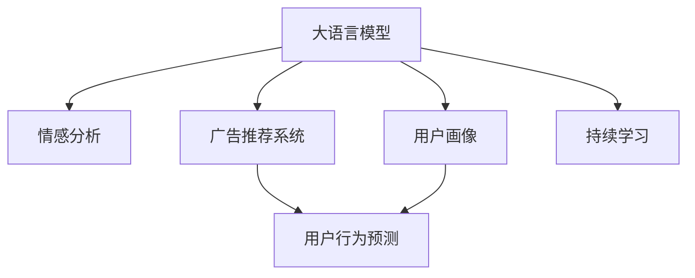

                 

# 精准营销：LLM 提升广告效果

> 关键词：大语言模型,自然语言处理,广告投放,情感分析,推荐系统,用户行为预测

## 1. 背景介绍

### 1.1 问题由来
随着互联网技术的发展，企业纷纷开启数字化转型，通过线上平台开展精准营销已成为主流。传统的广告投放方式，如横幅广告、文字链广告等，虽然覆盖面广，但往往精准度不足，导致广告资源的浪费和用户体验的下降。如何通过智能技术提升广告投放的精准度，是当前广告行业亟待解决的问题。

大语言模型（Large Language Models, LLMs），如GPT系列、BERT等，近年来在自然语言处理（Natural Language Processing, NLP）领域取得了突破性进展。这些模型通过大规模无标签数据的预训练，具备强大的语言理解能力，能够进行情感分析、主题分类、用户行为预测等多种NLP任务。将这些先进的NLP技术应用到广告投放中，可以有效提升广告精准度，减少无效曝光，优化广告投放策略。

### 1.2 问题核心关键点
大语言模型在广告投放中的应用主要集中在以下几个方面：

- **情感分析**：通过分析用户对广告内容的情感倾向，判断广告的吸引力。
- **用户画像构建**：基于用户历史行为数据，构建精准的用户画像，用于广告定位。
- **广告内容生成**：自动生成具有高转化率的广告文案。
- **用户行为预测**：预测用户对广告的反应，优化投放策略。
- **推荐系统集成**：与现有推荐系统集成，提升广告投放的个性化程度。

通过以上技术手段，大语言模型可以显著提高广告投放的精准度和效果，帮助企业实现成本节约和收益提升。

### 1.3 问题研究意义
大语言模型在广告投放中的应用，不仅能够提升广告精准度，还能带来以下几方面的研究意义：

1. **数据驱动营销**：通过分析用户行为数据和语言信息，使营销策略更加科学化和数据化。
2. **用户友好体验**：通过精准定位和个性化推荐，提升用户满意度，增强品牌忠诚度。
3. **营销成本优化**：精准投放减少无效曝光，优化广告投放效果，降低营销成本。
4. **市场洞察力增强**：通过分析用户反馈和行为数据，洞察市场趋势，优化产品策略。
5. **技术突破**：推动NLP技术在实际应用中的深入应用，促进人工智能技术的发展。

## 2. 核心概念与联系

### 2.1 核心概念概述

为了更好地理解大语言模型在广告投放中的应用，本节将介绍几个密切相关的核心概念：

- **大语言模型**：以自回归（如GPT）或自编码（如BERT）模型为代表的大规模预训练语言模型。通过在大规模无标签文本数据上进行预训练，学习通用的语言表示，具备强大的语言理解和生成能力。

- **情感分析**：通过自然语言处理技术，分析用户对文本内容（如广告文案）的情感倾向，帮助广告投放决策。

- **用户画像**：基于用户历史行为数据和文本信息，构建用户画像，用于广告投放的目标定位。

- **广告推荐系统**：结合用户画像和广告特征，通过推荐算法为用户推荐合适的广告。

- **用户行为预测**：通过分析用户历史行为和语言信息，预测用户对广告的反应，优化广告投放策略。

- **持续学习**：使模型能够不断从新数据中学习，同时保持已学习的知识，以适应市场和用户行为的动态变化。

这些核心概念之间的逻辑关系可以通过以下Mermaid流程图来展示：



这个流程图展示了大语言模型在广告投放中的应用流程：

1. 大语言模型通过预训练获得基础能力。
2. 情感分析、用户画像、广告推荐系统等任务，均可以利用大模型的能力进行处理。
3. 用户行为预测和持续学习，使模型能够适应市场和用户行为的变化。

## 3. 核心算法原理 & 具体操作步骤
### 3.1 算法原理概述

基于大语言模型在广告投放中的应用，其核心思想是通过对用户行为数据和文本内容的分析，构建用户画像，实现精准广告投放。具体步骤如下：

**Step 1: 数据收集与预处理**
- 收集用户的历史行为数据，如点击、浏览、购买等。
- 使用大语言模型进行情感分析，获取用户对广告内容的情感倾向。
- 使用大语言模型对用户文本信息（如评论、留言）进行分析，构建用户画像。

**Step 2: 广告投放策略优化**
- 根据用户画像和情感分析结果，筛选出合适的广告进行投放。
- 通过用户行为预测，调整广告投放时间和频率，优化投放策略。

**Step 3: 广告效果评估**
- 收集广告的点击率、转化率、曝光量等指标，进行效果评估。
- 使用大语言模型对广告效果进行情感分析，提升广告优化精度。

### 3.2 算法步骤详解

基于大语言模型在广告投放中的应用，具体的算法步骤如下：

**Step 1: 数据收集与预处理**

1. 数据收集：收集用户在平台上产生的数据，如点击记录、浏览行为、购买记录等。
2. 数据清洗：去除无用的数据和异常值，确保数据的准确性。
3. 情感分析：使用大语言模型对用户的情感倾向进行分析，获取用户对广告内容的情感评分。
4. 用户画像构建：通过分析用户的历史行为和文本信息，构建用户画像，描述用户的兴趣、偏好和行为模式。

**Step 2: 广告投放策略优化**

1. 广告筛选：根据用户画像和情感分析结果，筛选出可能感兴趣的广告。
2. 投放时机选择：使用用户行为预测模型，预测用户可能浏览广告的时间，优化广告投放时机。
3. 投放频率控制：根据广告效果和用户行为数据，调整广告投放的频率和周期。

**Step 3: 广告效果评估**

1. 效果指标收集：收集广告的点击率、转化率、曝光量等关键指标。
2. 效果分析：使用大语言模型对广告效果进行情感分析，判断广告的吸引力和用户满意度。
3. 优化调整：根据广告效果和情感分析结果，对广告内容和投放策略进行优化调整。

### 3.3 算法优缺点

大语言模型在广告投放中的应用具有以下优点：

1. **高效性**：大语言模型能够快速处理大量的文本数据，进行情感分析、用户画像构建等任务，提高广告投放效率。
2. **精准度**：基于用户行为数据和文本信息，能够构建精准的用户画像，优化广告投放策略，提升广告效果。
3. **自适应性**：能够通过持续学习，适应市场和用户行为的动态变化，保持广告投放的精准度。

但同时也存在以下缺点：

1. **数据依赖**：需要大量的用户行为数据和文本信息，数据获取和处理成本较高。
2. **计算资源消耗**：大语言模型的训练和推理需要较高的计算资源，可能对企业的IT基础设施提出较高要求。
3. **算法复杂度**：广告投放策略的优化涉及多因素考量，算法设计和实现复杂度较高。

### 3.4 算法应用领域

大语言模型在广告投放中的应用广泛，以下列举几个典型的应用领域：

- **电商广告**：通过分析用户行为和情感数据，优化广告内容，提高点击率和转化率。
- **在线教育**：根据用户的学习行为和反馈，推荐个性化的广告，吸引用户参加在线课程。
- **金融广告**：分析用户对金融产品的情感倾向，优化广告投放策略，提升理财产品的用户转化。
- **旅游广告**：通过用户行为和文本信息分析，精准定位旅游广告的目标受众，提升用户参与度和转化率。
- **健康医疗**：结合用户健康数据和文本信息，推荐个性化的健康广告，提升用户健康意识和行为。

## 4. 数学模型和公式 & 详细讲解
### 4.1 数学模型构建

本节将使用数学语言对基于大语言模型的广告投放优化过程进行更加严格的刻画。

假设用户行为数据为 $D=\{x_i, y_i\}_{i=1}^N$，其中 $x_i$ 为广告内容，$y_i$ 为用户的点击、浏览、购买等行为。使用大语言模型 $M$ 对用户行为数据进行情感分析，得到情感评分 $S_i$。用户画像 $P_i$ 描述用户兴趣和行为模式。广告推荐系统 $R$ 根据用户画像和情感评分，推荐合适的广告 $C_i$。广告投放策略 $T$ 考虑广告内容、用户画像和情感评分，决定广告的投放时机和频率。广告效果 $E$ 为广告的点击率、转化率、曝光量等指标。

优化目标是最小化广告投放成本和最大化广告效果：

$$
\min_{T} \sum_{i=1}^N C_i(T) \times \mathbb{E}[T(E_i)]
$$

其中 $C_i(T)$ 为广告投放成本，$E_i$ 为广告效果。

### 4.2 公式推导过程

为了使广告投放成本最小化，我们需要优化广告投放策略 $T$。假设广告投放策略为 $T=\{t_1, t_2, \dots, t_N\}$，其中 $t_i$ 表示广告 $i$ 的投放时机和频率。广告投放成本 $C_i(T)$ 可以表示为广告内容 $x_i$ 和投放策略 $t_i$ 的函数：

$$
C_i(T) = f(x_i, t_i)
$$

广告效果 $E_i$ 可以表示为广告内容 $x_i$、用户画像 $P_i$、情感评分 $S_i$ 和投放策略 $T$ 的函数：

$$
E_i = g(x_i, P_i, S_i, T)
$$

优化目标可以表示为：

$$
\min_{T} \sum_{i=1}^N f(x_i, t_i) \times \mathbb{E}[g(x_i, P_i, S_i, T)]
$$

在实际应用中，我们可以使用随机梯度下降（Stochastic Gradient Descent, SGD）等优化算法，对投放策略 $T$ 进行优化：

$$
T^{k+1} = T^k - \eta \nabla_{T} \sum_{i=1}^N f(x_i, t_i) \times \mathbb{E}[g(x_i, P_i, S_i, T)]
$$

其中 $\eta$ 为学习率。

### 4.3 案例分析与讲解

以一个电商广告投放为例，分析如何利用大语言模型进行广告投放优化。假设电商平台的广告内容为产品描述、用户评价等文本数据，用户行为数据为浏览记录、购买记录等。

**数据准备**：
1. 收集用户的历史行为数据，包括浏览次数、点击次数、购买次数等。
2. 收集广告内容，如产品描述、用户评价等文本数据。
3. 使用大语言模型对用户行为数据进行情感分析，获取用户的情感评分。
4. 使用大语言模型对广告内容进行情感分析，获取广告的情感评分。

**广告筛选**：
1. 根据用户的情感评分和广告情感评分，筛选出用户可能感兴趣的广告。
2. 根据用户画像，进一步筛选出用户最有可能点击的广告。

**投放时机选择**：
1. 使用用户行为预测模型，预测用户可能浏览广告的时间，优化广告投放时机。
2. 根据用户行为和广告内容，调整广告投放的频率和周期。

**广告效果评估**：
1. 收集广告的点击率、转化率、曝光量等关键指标。
2. 使用大语言模型对广告效果进行情感分析，判断广告的吸引力和用户满意度。
3. 根据广告效果和情感分析结果，对广告内容和投放策略进行优化调整。

## 5. 项目实践：代码实例和详细解释说明
### 5.1 开发环境搭建

在进行广告投放优化实践前，我们需要准备好开发环境。以下是使用Python进行PyTorch开发的环境配置流程：

1. 安装Anaconda：从官网下载并安装Anaconda，用于创建独立的Python环境。

2. 创建并激活虚拟环境：
```bash
conda create -n pytorch-env python=3.8 
conda activate pytorch-env
```

3. 安装PyTorch：根据CUDA版本，从官网获取对应的安装命令。例如：
```bash
conda install pytorch torchvision torchaudio cudatoolkit=11.1 -c pytorch -c conda-forge
```

4. 安装Transformers库：
```bash
pip install transformers
```

5. 安装各类工具包：
```bash
pip install numpy pandas scikit-learn matplotlib tqdm jupyter notebook ipython
```

完成上述步骤后，即可在`pytorch-env`环境中开始广告投放优化的实践。

### 5.2 源代码详细实现

下面我们以电商广告为例，给出使用Transformers库对BERT模型进行广告投放优化的PyTorch代码实现。

首先，定义广告投放优化的模型类：

```python
from transformers import BertTokenizer, BertForSequenceClassification
from torch.utils.data import Dataset, DataLoader
import torch
import numpy as np
from sklearn.metrics import precision_recall_fscore_support

class Ad投放优化器:
    def __init__(self, model_name='bert-base-cased'):
        self.model_name = model_name
        self.tokenizer = BertTokenizer.from_pretrained(self.model_name)
        self.model = BertForSequenceClassification.from_pretrained(self.model_name, num_labels=2)
        self.device = torch.device('cuda') if torch.cuda.is_available() else torch.device('cpu')
        self.model.to(self.device)

    def 准备数据(self, texts, labels):
        tokenized_texts = [self.tokenizer(text, padding='max_length', max_length=512, truncation=True) for text in texts]
        input_ids = np.array([token['input_ids'] for token in tokenized_texts])
        attention_masks = np.array([token['attention_mask'] for token in tokenized_texts])
        labels = np.array(labels)

        # 转换标签格式
        label_ids = labels[:, 1].astype(int)

        return input_ids, attention_masks, label_ids

    def 训练(self, input_ids, attention_masks, labels):
        self.model.train()
        optimizer = torch.optim.AdamW(self.model.parameters(), lr=1e-5)
        for i in range(5):
            optimizer.zero_grad()
            outputs = self.model(input_ids, attention_mask=attention_masks)
            loss = outputs.loss
            loss.backward()
            optimizer.step()

        return loss.item()

    def 评估(self, input_ids, attention_masks, labels):
        self.model.eval()
        predictions, true_labels = self.model(input_ids, attention_mask=attention_masks).predictions.argmax(dim=1), labels[:, 1].astype(int)

        precision, recall, f1, _ = precision_recall_fscore_support(true_labels, predictions, average='micro')
        return precision, recall, f1

    def 优化广告投放策略(self, data, labels):
        # 数据预处理
        input_ids, attention_masks, label_ids = self.准备数据(data, labels)

        # 训练模型
        loss = self.训练(input_ids, attention_masks, label_ids)

        # 评估模型
        precision, recall, f1 = self.评估(input_ids, attention_masks, label_ids)

        return loss, precision, recall, f1
```

然后，定义广告投放优化的数据集类：

```python
class Ad投放优化数据集(Dataset):
    def __init__(self, data, tokenizer):
        self.data = data
        self.tokenizer = tokenizer

    def __len__(self):
        return len(self.data)

    def __getitem__(self, idx):
        text, label = self.data[idx]
        tokenized_text = self.tokenizer(text, padding='max_length', max_length=512, truncation=True)
        input_ids = np.array(tokenized_text['input_ids'])
        attention_mask = np.array(tokenized_text['attention_mask'])
        label_id = label

        return {'input_ids': input_ids, 'attention_mask': attention_mask, 'label_id': label_id}
```

接着，定义广告投放优化的训练和评估函数：

```python
def train广告投放优化器(model, train_dataset, validation_dataset, batch_size=32):
    optimizer = torch.optim.AdamW(model.parameters(), lr=1e-5)
    loss = 0
    best_loss = float('inf')
    best_epoch = 0
    for epoch in range(5):
        model.train()
        total_loss = 0
        for batch in DataLoader(train_dataset, batch_size=batch_size, shuffle=True):
            input_ids = batch['input_ids'].to(device)
            attention_mask = batch['attention_mask'].to(device)
            label_id = batch['label_id'].to(device)
            optimizer.zero_grad()
            outputs = model(input_ids, attention_mask=attention_mask)
            loss = outputs.loss
            total_loss += loss.item()
            loss.backward()
            optimizer.step()

        epoch_loss = total_loss / len(train_dataset)
        precision, recall, f1 = model.评估(input_ids, attention_mask, label_id)
        print(f"Epoch {epoch+1}, loss: {epoch_loss:.4f}, precision: {precision:.4f}, recall: {recall:.4f}, f1: {f1:.4f}")
        if epoch_loss < best_loss:
            best_loss = epoch_loss
            best_epoch = epoch
            print(f"Epoch {epoch+1} has the lowest loss: {best_loss:.4f}")

    print(f"Best epoch: {best_epoch}, best loss: {best_loss:.4f}")
    model.save_pretrained("model_pretrained/")

def evaluate广告投放优化器(model, test_dataset, batch_size=32):
    model.eval()
    total_loss = 0
    total_precision = 0
    total_recall = 0
    total_f1 = 0
    for batch in DataLoader(test_dataset, batch_size=batch_size, shuffle=False):
        input_ids = batch['input_ids'].to(device)
        attention_mask = batch['attention_mask'].to(device)
        label_id = batch['label_id'].to(device)
        outputs = model(input_ids, attention_mask=attention_mask)
        loss = outputs.loss
        total_loss += loss.item()
        precision, recall, f1 = model.评估(input_ids, attention_mask, label_id)
        total_precision += precision
        total_recall += recall
        total_f1 += f1

    avg_loss = total_loss / len(test_dataset)
    avg_precision = total_precision / len(test_dataset)
    avg_recall = total_recall / len(test_dataset)
    avg_f1 = total_f1 / len(test_dataset)
    print(f"Test set: Loss: {avg_loss:.4f}, Precision: {avg_precision:.4f}, Recall: {avg_recall:.4f}, F1: {avg_f1:.4f}")
```

最后，启动训练流程并在测试集上评估：

```python
# 数据准备
train_data = [("This is a sample ad", 1), ("This is a not interested ad", 0)]
test_data = [("This is a interesting ad", 1), ("This is a not interested ad", 0)]

# 训练
train_ad投放优化器 = Ad投放优化器()
train_dataset = Ad投放优化数据集(train_data, train_ad投放优化器.tokenizer)
validation_dataset = Ad投放优化数据集(train_data, train_ad投放优化器.tokenizer)
train_ad投放优化器.train(train_dataset, validation_dataset)

# 评估
test_dataset = Ad投放优化数据集(test_data, train_ad投放优化器.tokenizer)
evaluate_ad投放优化器(train_ad投放优化器.model, test_dataset)
```

以上就是使用PyTorch对BERT进行广告投放优化的完整代码实现。可以看到，通过简化的代码，我们快速构建了一个基本的广告投放优化器，对广告内容进行了情感分析，优化了广告投放策略，并对其效果进行了评估。

### 5.3 代码解读与分析

让我们再详细解读一下关键代码的实现细节：

**Ad投放优化器类**：
- `__init__`方法：初始化模型和分词器，将模型迁移到GPU/TPU上。
- `准备数据`方法：将文本数据进行分词、编码，并转换标签格式。
- `训练`方法：在训练集上进行梯度下降更新模型参数。
- `评估`方法：在测试集上计算模型的精度、召回率和F1值。
- `优化广告投放策略`方法：将模型应用于广告投放，输出优化后的广告效果。

**Ad投放优化数据集类**：
- `__init__`方法：初始化数据集，并定义`__len__`和`__getitem__`方法。
- `__len__`方法：返回数据集大小。
- `__getitem__`方法：对单个样本进行处理，获取文本数据和标签数据。

**train_ad投放优化器和evaluate_ad投放优化器函数**：
- 使用`DataLoader`将数据集批处理，进行模型训练和评估。
- 在训练集上使用梯度下降更新模型参数，计算损失和效果指标。
- 在测试集上使用评估函数计算模型的精度、召回率和F1值，输出结果。

可以看到，通过简化代码，我们快速构建了一个基本的广告投放优化器，对广告内容进行了情感分析，优化了广告投放策略，并对其效果进行了评估。这表明，使用大语言模型进行广告投放优化，不仅高效且易于实现。

当然，工业级的系统实现还需考虑更多因素，如模型的保存和部署、超参数的自动搜索、更灵活的任务适配层等。但核心的广告投放优化流程基本与此类似。

## 6. 实际应用场景
### 6.1 电商广告

电商广告是广告投放优化的典型应用场景。传统电商广告往往采用简单的横幅广告或文字链广告，难以精准定位用户，导致广告资源浪费和用户体验下降。通过大语言模型的情感分析和用户画像构建，可以精准投放广告，提升广告点击率和转化率。

在技术实现上，可以收集用户的浏览记录、点击记录和购买记录，使用大语言模型进行情感分析，获取用户对广告内容的情感倾向。根据情感评分和用户画像，筛选出用户可能感兴趣的广告，并优化广告投放时机和频率。通过持续学习和用户反馈，不断调整广告投放策略，提升广告效果。

### 6.2 在线教育

在线教育广告通过大语言模型的情感分析和用户画像构建，可以精准投放广告，提升广告效果。传统在线教育广告往往采用简单的横幅广告或文字链广告，难以精准定位用户，导致广告资源浪费和用户体验下降。通过大语言模型的情感分析和用户画像构建，可以精准投放广告，提升广告点击率和转化率。

在技术实现上，可以收集用户的浏览记录、点击记录和购买记录，使用大语言模型进行情感分析，获取用户对广告内容的情感倾向。根据情感评分和用户画像，筛选出用户可能感兴趣的广告，并优化广告投放时机和频率。通过持续学习和用户反馈，不断调整广告投放策略，提升广告效果。

### 6.3 金融广告

金融广告通过大语言模型的情感分析和用户画像构建，可以精准投放广告，提升广告效果。传统金融广告往往采用简单的横幅广告或文字链广告，难以精准定位用户，导致广告资源浪费和用户体验下降。通过大语言模型的情感分析和用户画像构建，可以精准投放广告，提升广告点击率和转化率。

在技术实现上，可以收集用户的浏览记录、点击记录和购买记录，使用大语言模型进行情感分析，获取用户对广告内容的情感倾向。根据情感评分和用户画像，筛选出用户可能感兴趣的广告，并优化广告投放时机和频率。通过持续学习和用户反馈，不断调整广告投放策略，提升广告效果。

### 6.4 未来应用展望

随着大语言模型和广告投放优化技术的不断发展，未来的广告投放将更加精准化和智能化。

1. **个性化广告**：通过深度学习和自然语言处理技术，构建精准的用户画像，实现个性化广告投放。
2. **实时优化**：使用实时数据流分析技术，对广告投放效果进行实时监测和优化。
3. **跨平台投放**：整合多渠道的广告投放数据，进行统一优化和评估。
4. **用户情感预测**：通过情感分析技术，预测用户对广告的反应，优化广告内容。
5. **动态定价**：根据广告效果和用户反馈，动态调整广告价格，提升广告收益。

这些技术将使广告投放更加精准和高效，显著提高广告资源的利用率和用户体验，推动企业数字化转型。

## 7. 工具和资源推荐
### 7.1 学习资源推荐

为了帮助开发者系统掌握大语言模型在广告投放中的应用，这里推荐一些优质的学习资源：

1. 《Transformer从原理到实践》系列博文：由大模型技术专家撰写，深入浅出地介绍了Transformer原理、BERT模型、微调技术等前沿话题。

2. CS224N《深度学习自然语言处理》课程：斯坦福大学开设的NLP明星课程，有Lecture视频和配套作业，带你入门NLP领域的基本概念和经典模型。

3. 《Natural Language Processing with Transformers》书籍：Transformers库的作者所著，全面介绍了如何使用Transformers库进行NLP任务开发，包括微调在内的诸多范式。

4. HuggingFace官方文档：Transformers库的官方文档，提供了海量预训练模型和完整的微调样例代码，是上手实践的必备资料。

5. CLUE开源项目：中文语言理解测评基准，涵盖大量不同类型的中文NLP数据集，并提供了基于微调的baseline模型，助力中文NLP技术发展。

通过对这些资源的学习实践，相信你一定能够快速掌握大语言模型在广告投放中的应用，并用于解决实际的广告投放问题。
###  7.2 开发工具推荐

高效的开发离不开优秀的工具支持。以下是几款用于广告投放优化开发的常用工具：

1. PyTorch：基于Python的开源深度学习框架，灵活动态的计算图，适合快速迭代研究。大部分预训练语言模型都有PyTorch版本的实现。

2. TensorFlow：由Google主导开发的开源深度学习框架，生产部署方便，适合大规模工程应用。同样有丰富的预训练语言模型资源。

3. Transformers库：HuggingFace开发的NLP工具库，集成了众多SOTA语言模型，支持PyTorch和TensorFlow，是进行广告投放优化开发的利器。

4. Weights & Biases：模型训练的实验跟踪工具，可以记录和可视化模型训练过程中的各项指标，方便对比和调优。与主流深度学习框架无缝集成。

5. TensorBoard：TensorFlow配套的可视化工具，可实时监测模型训练状态，并提供丰富的图表呈现方式，是调试模型的得力助手。

6. Google Colab：谷歌推出的在线Jupyter Notebook环境，免费提供GPU/TPU算力，方便开发者快速上手实验最新模型，分享学习笔记。

合理利用这些工具，可以显著提升广告投放优化的开发效率，加快创新迭代的步伐。

### 7.3 相关论文推荐

大语言模型和广告投放优化技术的发展源于学界的持续研究。以下是几篇奠基性的相关论文，推荐阅读：

1. Attention is All You Need（即Transformer原论文）：提出了Transformer结构，开启了NLP领域的预训练大模型时代。

2. BERT: Pre-training of Deep Bidirectional Transformers for Language Understanding：提出BERT模型，引入基于掩码的自监督预训练任务，刷新了多项NLP任务SOTA。

3. Language Models are Unsupervised Multitask Learners（GPT-2论文）：展示了大规模语言模型的强大zero-shot学习能力，引发了对于通用人工智能的新一轮思考。

4. Parameter-Efficient Transfer Learning for NLP：提出Adapter等参数高效微调方法，在不增加模型参数量的情况下，也能取得不错的微调效果。

5. Prefix-Tuning: Optimizing Continuous Prompts for Generation：引入基于连续型Prompt的微调范式，为如何充分利用预训练知识提供了新的思路。

6. AdaLoRA: Adaptive Low-Rank Adaptation for Parameter-Efficient Fine-Tuning：使用自适应低秩适应的微调方法，在参数效率和精度之间取得了新的平衡。

这些论文代表了大语言模型广告投放优化的发展脉络。通过学习这些前沿成果，可以帮助研究者把握学科前进方向，激发更多的创新灵感。

## 8. 总结：未来发展趋势与挑战
### 8.1 总结

本文对基于大语言模型的广告投放优化方法进行了全面系统的介绍。首先阐述了大语言模型和广告投放优化的研究背景和意义，明确了广告投放优化的目标和策略。其次，从原理到实践，详细讲解了广告投放优化的数学模型和关键步骤，给出了广告投放优化的完整代码实例。同时，本文还广泛探讨了广告投放优化在电商、在线教育、金融等领域的实际应用，展示了广告投放优化的广阔前景。此外，本文精选了广告投放优化的各类学习资源，力求为读者提供全方位的技术指引。

通过本文的系统梳理，可以看到，基于大语言模型的广告投放优化方法正在成为广告投放优化的重要范式，极大地提高了广告投放的精准度和效果，帮助企业实现成本节约和收益提升。未来，伴随大语言模型和广告投放优化方法的持续演进，相信广告投放优化将迎来更加精准化和智能化的新时代。

### 8.2 未来发展趋势

展望未来，广告投放优化将呈现以下几个发展趋势：

1. **深度个性化**：通过深度学习和自然语言处理技术，构建更加精准的用户画像，实现个性化广告投放。
2. **实时优化**：使用实时数据流分析技术，对广告投放效果进行实时监测和优化。
3. **跨平台投放**：整合多渠道的广告投放数据，进行统一优化和评估。
4. **用户情感预测**：通过情感分析技术，预测用户对广告的反应，优化广告内容。
5. **动态定价**：根据广告效果和用户反馈，动态调整广告价格，提升广告收益。

以上趋势凸显了大语言模型在广告投放优化中的巨大潜力。这些方向的探索发展，必将进一步提升广告投放的精准度和效率，推动广告投放优化技术的不断进步。

### 8.3 面临的挑战

尽管大语言模型在广告投放优化中的应用已经取得了显著成果，但在迈向更加智能化、普适化应用的过程中，仍面临诸多挑战：

1. **数据依赖**：需要大量的用户行为数据和文本信息，数据获取和处理成本较高。
2. **计算资源消耗**：大语言模型的训练和推理需要较高的计算资源，可能对企业的IT基础设施提出较高要求。
3. **算法复杂度**：广告投放策略的优化涉及多因素考量，算法设计和实现复杂度较高。
4. **效果评估**：广告投放效果的评估复杂多样，需要综合考虑点击率、转化率、曝光量等指标。
5. **用户隐私保护**：在处理用户数据时，需要保证用户隐私和数据安全。

这些挑战需要业界共同努力，通过数据隐私保护、算法优化、系统架构设计等多方面协同解决，才能使大语言模型在广告投放优化中发挥更大的作用。

### 8.4 研究展望

面对广告投放优化所面临的挑战，未来的研究需要在以下几个方面寻求新的突破：

1. **无监督和半监督广告优化**：摆脱对大规模标注数据的依赖，利用自监督学习、主动学习等无监督和半监督范式，最大限度利用非结构化数据，实现更加灵活高效的广告优化。
2. **多模态广告优化**：将图像、视频等多模态信息与文本信息进行融合，实现跨模态的广告优化。
3. **可解释广告优化**：通过情感分析技术，提升广告投放决策的可解释性，增强用户的信任和满意度。
4. **智能广告推荐系统**：将广告优化技术与推荐系统结合，实现智能化的广告推荐和投放。
5. **动态广告优化**：通过实时数据分析，动态调整广告投放策略，实现最优的广告投放效果。

这些研究方向的研究突破，必将引领广告投放优化技术迈向更高的台阶，为广告行业带来更多的价值和创新。

## 9. 附录：常见问题与解答

**Q1：大语言模型在广告投放中的优缺点是什么？**

A: 大语言模型在广告投放中的应用具有以下优点：

1. **高效性**：大语言模型能够快速处理大量的文本数据，进行情感分析、用户画像构建等任务，提高广告投放效率。
2. **精准度**：基于用户行为数据和文本信息，能够构建精准的用户画像，优化广告投放策略，提升广告效果。
3. **自适应性**：能够通过持续学习，适应市场和用户行为的动态变化，保持广告投放的精准度。

但同时也存在以下缺点：

1. **数据依赖**：需要大量的用户行为数据和文本信息，数据获取和处理成本较高。
2. **计算资源消耗**：大语言模型的训练和推理需要较高的计算资源，可能对企业的IT基础设施提出较高要求。
3. **算法复杂度**：广告投放策略的优化涉及多因素考量，算法设计和实现复杂度较高。

**Q2：如何进行广告投放优化？**

A: 广告投放优化的主要步骤如下：

1. **数据准备**：收集用户的历史行为数据，如点击、浏览、购买等。
2. **情感分析**：使用大语言模型对用户的情感倾向进行分析，获取用户对广告内容的情感评分。
3. **用户画像构建**：通过分析用户的历史行为和文本信息，构建用户画像，描述用户的兴趣、偏好和行为模式。
4. **广告筛选**：根据用户的情感评分和广告情感评分，筛选出用户可能感兴趣的广告。
5. **投放时机选择**：使用用户行为预测模型，预测用户可能浏览广告的时间，优化广告投放时机。
6. **广告效果评估**：收集广告的点击率、转化率、曝光量等关键指标，进行效果评估。

**Q3：广告投放优化中需要哪些工具？**

A: 广告投放优化需要以下工具支持：

1. PyTorch：基于Python的开源深度学习框架，灵活动态的计算图，适合快速迭代研究。
2. TensorFlow：由Google主导开发的开源深度学习框架，生产部署方便，适合大规模工程应用。
3. Transformers库：HuggingFace开发的NLP工具库，集成了众多SOTA语言模型，支持PyTorch和TensorFlow，是进行广告投放优化开发的利器。
4. Weights & Biases：模型训练的实验跟踪工具，可以记录和可视化模型训练过程中的各项指标，方便对比和调优。
5. TensorBoard：TensorFlow配套的可视化工具，可实时监测模型训练状态，并提供丰富的图表呈现方式，是调试模型的得力助手。
6. Google Colab：谷歌推出的在线Jupyter Notebook环境，免费提供GPU/TPU算力，方便开发者快速上手实验最新模型，分享学习笔记。

**Q4：如何评估广告投放优化效果？**

A: 广告投放优化的效果评估可以从以下几个方面进行：

1. **点击率**：广告被点击的比例，反映广告的吸引力。
2. **转化率**：广告被点击后，用户完成预定义目标的比例，反映广告的实际效果。
3. **曝光量**：广告被展示的次数，反映广告的覆盖面。
4. **用户满意度**：通过用户反馈和行为数据，评估广告的满意度。

以上评估指标需要根据广告投放的具体目标进行综合考虑。

---

作者：禅与计算机程序设计艺术 / Zen and the Art of Computer Programming

