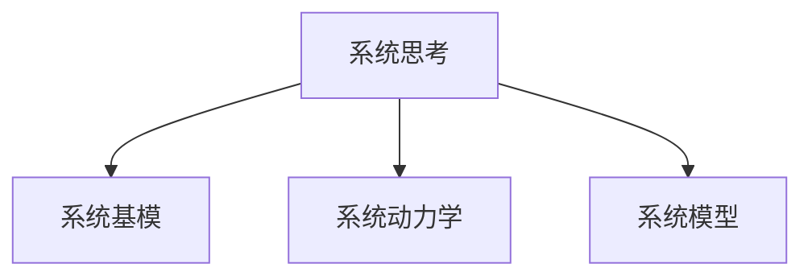

                 

# 系统思考在组织变革中的应用

## 1. 背景介绍

### 1.1 问题由来
组织变革一直是企业管理中的重要议题。随着技术和市场的快速发展，组织需要不断调整和优化其运营模式和结构，以适应外部环境的变化。传统的组织变革方法通常基于自顶向下的命令控制，往往面临执行难度大、效果差的问题。近年来，系统思考(Systems Thinking)作为一种新的组织变革方法论，因其强调全局视角、相互依赖关系和系统动态，成为一种被广泛认可和应用的创新管理工具。

### 1.2 问题核心关键点
系统思考是一种基于系统动力学(System Dynamics)原理，帮助组织从局部视角跳脱出来，考虑整体和相互作用的系统方法。其核心在于理解组织中的各种要素是如何相互关联、相互作用的，以及如何通过干预某些关键变量来改变系统的整体行为。系统思考方法论强调“整体大于部分之和”，注重通过全局视角寻找整体最优解，而不是局部最优解。

系统思考的提出者彼得·圣吉(Peter Senge)在《第五项修炼》一书中提出了“系统基模”(Systemic Basics)，描述了若干组织变革中常见的问题模式及对应的解决方案。系统思考通过构建系统模型，帮助组织识别出关键系统行为和结构性因素，从而找到突破口，进行有效的组织变革。

### 1.3 问题研究意义
系统思考在组织变革中的应用，对提升组织适应性和竞争力，提高管理效率和决策质量具有重要意义：

1. **全局视角**：帮助组织从整体出发，系统地看待问题和机会，而不是局部视角下的短视。
2. **动态理解**：理解组织的动态行为和变化趋势，而不是静止和静态的分析。
3. **相互依赖**：识别出组织内各要素之间的相互作用关系，而不是孤立分析每个部分。
4. **创新思维**：通过系统思考，组织可以发现新问题，设计新方法，提升组织创新能力。
5. **合作共赢**：系统思考促进组织成员间的沟通和协作，达到协同效应。

## 2. 核心概念与联系

### 2.1 核心概念概述

为更好地理解系统思考在组织变革中的应用，本节将介绍几个密切相关的核心概念：

- **系统思考**：一种系统动态和组织理论，强调整体性、动态性和相互依赖性。系统思考的核心在于理解和应对系统行为模式，以及系统中的关键“杠杆点”(Levers)。

- **系统基模**：彼得·圣吉提出的若干种组织行为模式，包含反馈循环、存量流、延迟等基本结构。系统基模帮助识别出组织中的常见问题模式。

- **系统动力学**：一种研究复杂系统行为和变化规律的科学方法，强调系统的动态性质和反馈机制。系统动力学基于定性与定量分析，预测系统的未来行为。

- **系统模型**：通过数学模型和仿真工具，构建和分析系统的动态行为和结构。系统模型是系统思考的重要工具，可以帮助理解系统行为和干预效果。

这些核心概念之间的逻辑关系可以通过以下Mermaid流程图来展示：



这个流程图展示了大系统思考的核心概念及其之间的关系：

1. 系统思考基于系统动力学原理，理解组织系统的动态行为。
2. 系统基模帮助识别组织中的常见问题模式，提供系统思考的框架。
3. 系统模型作为系统思考的工具，帮助分析和模拟系统行为。

这些概念共同构成了系统思考的理论基础，使其能够帮助组织识别问题、设计方案，并进行有效的组织变革。

## 3. 核心算法原理 & 具体操作步骤

### 3.1 算法原理概述

系统思考在组织变革中的应用，涉及以下几个核心步骤：

1. **系统分析**：使用系统基模和系统动力学模型，识别出组织中的关键问题及反馈循环。
2. **问题建模**：构建系统模型，量化和模拟系统的行为和结构。
3. **方案设计**：基于系统模型，提出系统干预的策略和措施。
4. **方案实施**：在组织中实施系统干预，观察和记录系统的变化。
5. **效果评估**：评估系统干预的效果，迭代改进方案。

系统思考的应用流程是一个循环迭代的过程，需要不断地进行系统分析和反馈，以确保干预措施的有效性和可持续性。

### 3.2 算法步骤详解

下面详细介绍系统思考在组织变革中的具体步骤和方法：

**Step 1: 系统分析与识别**

1. **选择系统基模**：根据组织面临的问题，选择合适的系统基模，识别出系统中的关键变量和反馈循环。常用的系统基模包括：
   - 反馈循环：描述系统中的持续性行为，如库存积压、员工疲劳等。
   - 存量流：刻画系统中的存量与流量的动态关系，如资金流动、信息流等。
   - 延迟：揭示系统中的时间滞后，如政策制定与执行的滞后时间。

2. **构建系统模型**：使用系统动力学软件（如Vensim、Stella等）构建系统模型，量化和模拟系统的行为和结构。在模型中，设置关键变量和参数，并模拟系统的动态变化。

3. **分析与讨论**：在模型中运行仿真，观察系统的行为和变化趋势，讨论可能的改进措施。通过模型模拟，可以帮助组织理解系统的行为模式和关键因素。

**Step 2: 问题建模与策略设计**

1. **模型优化**：根据系统分析结果，调整系统模型中的参数和结构，使其更准确地反映组织现状。

2. **策略设计**：在优化后的模型中，设计系统干预的策略和措施。常见的系统干预措施包括：
   - 改变关键变量：如调整库存水平、调整招聘策略等。
   - 改进反馈机制：如加强信息共享、优化流程等。
   - 引入新变量：如增加培训投入、引入新技术等。

3. **模拟与验证**：在模型中运行干预策略，观察系统的响应和变化。通过模拟验证，评估干预措施的效果和影响。

**Step 3: 方案实施与效果评估**

1. **实施干预**：在组织中实施系统干预策略，观察系统的实际变化。

2. **记录与反馈**：记录系统的变化情况和关键指标，进行定期反馈和评估。通过定期反馈，及时调整和优化干预措施。

3. **效果评估**：评估干预措施的效果，识别出成功的因素和不足之处。根据评估结果，进行迭代改进，优化系统干预策略。

4. **持续改进**：持续进行系统分析和干预，确保系统的动态适应性和持续改进。

### 3.3 算法优缺点

系统思考在组织变革中的应用，具有以下优点：

1. **全局视角**：系统思考帮助组织从全局视角看待问题，避免局部视角的短视和片面。
2. **动态理解**：通过系统动力学模型，理解系统的动态行为和变化趋势，提高决策的准确性。
3. **相互依赖**：识别出组织中各要素之间的相互作用关系，促进协同效应。
4. **创新思维**：系统思考通过模拟和仿真，发现新的问题和机会，提升组织创新能力。
5. **合作共赢**：系统思考促进组织成员间的沟通和协作，达成共识，实现合作共赢。

同时，系统思考也存在一定的局限性：

1. **复杂性高**：系统思考需要构建和分析复杂模型，对技术要求较高。
2. **成本高**：系统思考需要投入较多资源，包括时间、人力和资金等。
3. **易受干扰**：系统思考对初始数据和模型的准确性敏感，需要精心设计和验证。
4. **执行难度大**：系统思考方案的设计和实施需要高水平的管理和技术支持。

尽管如此，系统思考在组织变革中的应用，仍是一种高效、科学的管理方法论，能够帮助组织实现系统性的优化和变革。

### 3.4 算法应用领域

系统思考在组织变革中的应用，覆盖了多个领域，包括但不限于：

1. **人力资源管理**：通过系统思考，优化人力资源配置和培训策略，提升员工绩效和工作满意度。
2. **财务管理**：通过系统思考，优化资金流动和预算管理，提高资金使用效率和投资回报率。
3. **产品开发**：通过系统思考，优化产品设计和生产流程，提高产品质量和市场竞争力。
4. **客户关系管理**：通过系统思考，优化客户关系和市场策略，提高客户满意度和忠诚度。
5. **供应链管理**：通过系统思考，优化供应链结构和管理流程，提高供应链效率和响应速度。

系统思考方法论在组织变革中的应用，已经显示出巨大的潜力和价值，为组织提供了新的管理视角和创新工具。

## 4. 数学模型和公式 & 详细讲解 & 举例说明

### 4.1 数学模型构建

系统思考的数学模型构建，主要基于系统动力学理论。系统动力学模型通常使用微分方程组和代数方程组来描述系统的动态行为。以下是一个简单的系统动力学模型示例：

假设一个组织有资金流入、流出和存储的存量流模型。资金流入和流出由不同业务部门决定，而资金存储则受到公司战略和政策的影响。模型的状态变量包括：
- $F$：资金流入
- $O$：资金流出
- $S$：资金存储

模型的微分方程组为：
$$
\frac{dS}{dt} = F - O
$$
其中 $F = \alpha_1 I + \alpha_2 E$，$O = \beta_1 I + \beta_2 E$，$I$ 为收入，$E$ 为支出。

### 4.2 公式推导过程

以资金流模型为例，进行公式推导：

1. **资金流入模型**：资金流入由业务部门1和部门2决定，收入和支出的系数为 $\alpha_1$ 和 $\alpha_2$。
   $$
   F = \alpha_1 I + \alpha_2 E
   $$

2. **资金流出模型**：资金流出由部门1和部门2决定，收入和支出的系数为 $\beta_1$ 和 $\beta_2$。
   $$
   O = \beta_1 I + \beta_2 E
   $$

3. **资金存储模型**：资金存储量 $S$ 由资金流入和流出决定。
   $$
   \frac{dS}{dt} = F - O
   $$

4. **系统动力学模型**：将上述模型整合，构建完整的系统动力学模型。
   $$
   \frac{dS}{dt} = (\alpha_1 I + \alpha_2 E) - (\beta_1 I + \beta_2 E)
   $$

通过上述推导，可以建立资金流系统的动态模型，并通过仿真模拟分析系统的行为和变化。

### 4.3 案例分析与讲解

以下以一个具体的系统思考案例进行详细讲解：

**案例背景**：某公司产品销售不畅，库存积压严重。公司希望通过系统思考方法，找到问题的根源，并设计解决方案。

**系统分析**：
- **选择系统基模**：选择“存量流”系统基模，识别出库存积压问题。
- **构建系统模型**：使用系统动力学软件构建库存积压模型，设置关键变量和参数。
- **分析与讨论**：模拟库存积压模型的行为和变化，讨论可能的改进措施。

**问题建模与策略设计**：
- **模型优化**：调整模型中的关键参数和结构，使其更准确地反映库存积压现状。
- **策略设计**：在优化后的模型中，设计系统干预的策略和措施。

**方案实施与效果评估**：
- **实施干预**：在实际生产中实施系统干预策略，观察库存变化情况。
- **记录与反馈**：记录库存变化情况和关键指标，进行定期反馈和评估。
- **效果评估**：评估干预措施的效果，识别出成功的因素和不足之处。

**持续改进**：持续进行系统分析和干预，确保库存管理的动态适应性和持续改进。

## 5. 项目实践：代码实例和详细解释说明

### 5.1 开发环境搭建

在进行系统思考和系统动力学建模实践前，我们需要准备好开发环境。以下是使用Python进行SystemDynamics建模的环境配置流程：

1. 安装Anaconda：从官网下载并安装Anaconda，用于创建独立的Python环境。

2. 创建并激活虚拟环境：
```bash
conda create -n dynamics-env python=3.8 
conda activate dynamics-env
```

3. 安装相关软件包：
```bash
conda install vensim
pip install pyviz
```

4. 配置系统动力学软件：根据软件需求，进行必要的配置和安装。

完成上述步骤后，即可在`dynamics-env`环境中开始系统动力学建模实践。

### 5.2 源代码详细实现

下面我们以资金流模型为例，给出使用Python和Vensim进行系统动力学建模的代码实现。

首先，导入必要的库和模块：

```python
from vensim import VensimPy
from vensim.models.utils import *
import pandas as pd
import pyviz
```

然后，构建资金流模型：

```python
# 初始化Vensim模型
model = VensimPy()

# 定义状态变量
S = model.add_state('S', units='$')
I = model.add_state('I', units='$')
E = model.add_state('E', units='$')

# 定义流量变量
F = model.add_flow('F', source=I, target=S, amount=1.0)
O = model.add_flow('O', source=E, target=S, amount=0.5)

# 定义函数关系
model.add_function('F', equation='alpha_1*I + alpha_2*E', params={'alpha_1': 0.8, 'alpha_2': 0.2})
model.add_function('O', equation='beta_1*I + beta_2*E', params={'beta_1': 0.3, 'beta_2': 0.1})

# 初始化模型参数
model.set_value('alpha_1', 0.8)
model.set_value('alpha_2', 0.2)
model.set_value('beta_1', 0.3)
model.set_value('beta_2', 0.1)

# 运行模型仿真
model.solve(0, 24)

# 输出结果
result = model.get_result('S')
print(result)
```

在上述代码中，我们首先使用VensimPy库创建了一个系统动力学模型，定义了状态变量`S`、`I`和`E`，分别表示资金存储量、收入和支出。然后定义了资金流入`F`和流出`O`两个流量变量，并设置了各自的函数关系。最后，设置模型参数并运行仿真，输出资金存储量的变化结果。

### 5.3 代码解读与分析

在上述代码中，关键的几行代码如下：

```python
# 初始化Vensim模型
model = VensimPy()

# 定义状态变量
S = model.add_state('S', units='$')
I = model.add_state('I', units='$')
E = model.add_state('E', units='$')

# 定义流量变量
F = model.add_flow('F', source=I, target=S, amount=1.0)
O = model.add_flow('O', source=E, target=S, amount=0.5)

# 定义函数关系
model.add_function('F', equation='alpha_1*I + alpha_2*E', params={'alpha_1': 0.8, 'alpha_2': 0.2})
model.add_function('O', equation='beta_1*I + beta_2*E', params={'beta_1': 0.3, 'beta_2': 0.1})

# 初始化模型参数
model.set_value('alpha_1', 0.8)
model.set_value('alpha_2', 0.2)
model.set_value('beta_1', 0.3)
model.set_value('beta_2', 0.1)

# 运行模型仿真
model.solve(0, 24)

# 输出结果
result = model.get_result('S')
print(result)
```

- `model.add_state`方法用于添加状态变量，其中第一个参数为变量名，第二个参数为单位。
- `model.add_flow`方法用于定义流量变量，其中第一个参数为变量名，第二个参数为源状态，第三个参数为目标状态，第四个参数为流量值。
- `model.add_function`方法用于定义函数关系，其中第一个参数为变量名，第二个参数为方程字符串，第三个参数为参数字典。
- `model.set_value`方法用于设置模型参数。
- `model.solve`方法用于运行模型仿真，其中第一个参数为初始时间点，第二个参数为仿真时间范围。
- `model.get_result`方法用于获取仿真结果，其中参数为变量名。

通过以上代码，我们可以构建一个简单的资金流模型，并模拟其动态变化。

## 6. 实际应用场景

### 6.1 智能制造

系统思考在智能制造领域有广泛应用。传统制造业面临生产效率低、成本高、资源浪费等问题，通过系统思考，可以优化生产流程，提升整体效率。

**案例背景**：某汽车制造公司生产线效率低下，生产周期长，生产成本高。

**系统分析**：
- **选择系统基模**：选择“存量流”系统基模，识别出生产线效率问题。
- **构建系统模型**：使用系统动力学软件构建生产线模型，设置关键变量和参数。
- **分析与讨论**：模拟生产线模型的行为和变化，讨论可能的改进措施。

**问题建模与策略设计**：
- **模型优化**：调整模型中的关键参数和结构，使其更准确地反映生产线现状。
- **策略设计**：在优化后的模型中，设计系统干预的策略和措施。

**方案实施与效果评估**：
- **实施干预**：在实际生产中实施系统干预策略，观察生产线效率变化情况。
- **记录与反馈**：记录生产线效率变化情况和关键指标，进行定期反馈和评估。
- **效果评估**：评估干预措施的效果，识别出成功的因素和不足之处。

**持续改进**：持续进行系统分析和干预，确保生产线的动态适应性和持续改进。

### 6.2 智慧城市

系统思考在智慧城市治理中也有重要应用。智慧城市建设涉及多部门、多领域的协同工作，通过系统思考，可以优化资源配置，提升城市管理效率。

**案例背景**：某智慧城市交通管理混乱，拥堵严重，市民满意度低。

**系统分析**：
- **选择系统基模**：选择“反馈循环”系统基模，识别出交通拥堵问题。
- **构建系统模型**：使用系统动力学软件构建交通模型，设置关键变量和参数。
- **分析与讨论**：模拟交通模型的行为和变化，讨论可能的改进措施。

**问题建模与策略设计**：
- **模型优化**：调整模型中的关键参数和结构，使其更准确地反映交通现状。
- **策略设计**：在优化后的模型中，设计系统干预的策略和措施。

**方案实施与效果评估**：
- **实施干预**：在实际交通管理中实施系统干预策略，观察交通拥堵情况变化。
- **记录与反馈**：记录交通拥堵情况和关键指标，进行定期反馈和评估。
- **效果评估**：评估干预措施的效果，识别出成功的因素和不足之处。

**持续改进**：持续进行系统分析和干预，确保交通管理的动态适应性和持续改进。

### 6.3 公共卫生

系统思考在公共卫生管理中也具有重要价值。公共卫生管理涉及众多因素，通过系统思考，可以全面分析影响因素，提升公共卫生管理水平。

**案例背景**：某地区新冠疫情爆发，防控措施效果不佳，疫情扩散迅速。

**系统分析**：
- **选择系统基模**：选择“存量流”系统基模，识别出疫情传播问题。
- **构建系统模型**：使用系统动力学软件构建疫情传播模型，设置关键变量和参数。
- **分析与讨论**：模拟疫情传播模型的行为和变化，讨论可能的改进措施。

**问题建模与策略设计**：
- **模型优化**：调整模型中的关键参数和结构，使其更准确地反映疫情传播现状。
- **策略设计**：在优化后的模型中，设计系统干预的策略和措施。

**方案实施与效果评估**：
- **实施干预**：在实际疫情防控中实施系统干预策略，观察疫情传播情况变化。
- **记录与反馈**：记录疫情传播情况和关键指标，进行定期反馈和评估。
- **效果评估**：评估干预措施的效果，识别出成功的因素和不足之处。

**持续改进**：持续进行系统分析和干预，确保疫情防控的动态适应性和持续改进。

## 7. 工具和资源推荐

### 7.1 学习资源推荐

为了帮助开发者系统掌握系统思考和系统动力学方法，这里推荐一些优质的学习资源：

1. 《系统动力学概论》：彼得·圣吉所著，系统思考和系统动力学理论的入门书籍，深入浅出地介绍了系统思考的基本概念和方法。

2. 《系统动力学导论》：约瑟夫·威尔曼著，详细介绍了系统动力学模型的构建和应用，适合进阶学习。

3. 《系统思考与变革管理》：彼得·圣吉所著，结合系统思考和变革管理，帮助组织实现持续改进和创新。

4. 《System Dynamics Modeling and Simulation》：斯图尔特·阿兰著，系统动力学建模的实用指南，包含大量案例和实践技巧。

5. 《SimPy: Simulating Complex Systems》：SimPy项目官方文档，介绍如何使用Python进行系统动力学建模和仿真。

6. 《SystemDynamics with Simulink》：MATLAB官方文档，介绍如何使用Simulink进行系统动力学建模和仿真。

通过对这些资源的学习实践，相信你一定能够快速掌握系统思考和系统动力学的方法，并将其应用于实际工作中。

### 7.2 开发工具推荐

高效的开发离不开优秀的工具支持。以下是几款用于系统思考和系统动力学建模开发的常用工具：

1. Vensim：系统动力学建模和仿真软件，支持多种输入输出格式，广泛用于学术研究和工业应用。

2. Simulink：MATLAB集成环境，支持复杂系统建模和仿真，适合大规模工程应用。

3. SimPy：Python库，用于进行系统仿真，支持分布式计算和并行仿真。

4. AnyLogic：系统动力学建模和仿真软件，支持实时仿真和可视化，适合复杂系统的建模。

5. AnyLogic Modeler：与AnyLogic集成的建模环境，提供丰富的建模组件和可视化工具。

6. OMNET++：网络仿真软件，支持复杂网络系统的建模和仿真，适用于通信网络、交通系统等领域。

合理利用这些工具，可以显著提升系统思考和系统动力学的建模和仿真效率，加快创新迭代的步伐。

### 7.3 相关论文推荐

系统思考和系统动力学的发展源于学界的持续研究。以下是几篇奠基性的相关论文，推荐阅读：

1. Systems Thinking and System Dynamics in Strategic Management: A Historical Perspective（《系统思考与系统动力学在战略管理中的历史视角》）：详细介绍了系统思考和系统动力学在战略管理中的应用。

2. Factors Influencing the Performance of the D dynamically：分析了系统动力学模型在企业中的应用效果。

3. System Dynamics Modeling and Simulation：介绍了系统动力学建模和仿真的基本方法。

4. Managing Systems Thinking Skills in Organizations：探讨了如何在组织中培养和应用系统思考技能。

5. A Review of the Application of System Dynamics in Healthcare：综述了系统动力学在医疗领域的应用实例。

这些论文代表了大系统思考和系统动力学的研究进展，通过学习这些前沿成果，可以帮助研究者把握学科前进方向，激发更多的创新灵感。

## 8. 总结：未来发展趋势与挑战

### 8.1 总结

本文对系统思考在组织变革中的应用进行了全面系统的介绍。首先阐述了系统思考的理论基础和核心概念，明确了系统思考在组织变革中的独特价值。其次，从原理到实践，详细讲解了系统思考的数学模型和操作步骤，给出了系统思考任务开发的完整代码实例。同时，本文还广泛探讨了系统思考在智能制造、智慧城市、公共卫生等多个行业领域的应用前景，展示了系统思考范式的广阔潜力。此外，本文精选了系统思考的学习资源，力求为读者提供全方位的技术指引。

通过本文的系统梳理，可以看到，系统思考方法论在组织变革中的应用，对提升组织适应性和竞争力，提高管理效率和决策质量具有重要意义。系统思考通过全局视角、动态理解和相互依赖的关系，帮助组织实现系统性的优化和变革。未来，伴随系统思考理论和实践的不断演进，相信其在更多领域得到应用，为组织提供更强大的管理工具。

### 8.2 未来发展趋势

展望未来，系统思考在组织变革中的应用将呈现以下几个发展趋势：

1. **智能化应用**：结合人工智能和大数据技术，实现更精准的系统分析和预测。
2. **跨领域融合**：系统思考与其他管理方法（如精益生产、敏捷开发等）结合，实现综合优化。
3. **可视化工具**：开发更加直观的可视化工具，帮助组织更直观地理解和操作系统模型。
4. **实时仿真**：通过实时仿真，实现动态系统的持续监测和优化。
5. **开源平台**：开发更多的开源系统动力学平台，降低系统建模和仿真的门槛。
6. **工业化应用**：系统思考方法论在更多行业得到广泛应用，推动工业化生产和管理。

这些趋势凸显了系统思考方法的广泛应用前景，为组织提供了新的管理视角和创新工具。系统思考的持续发展和完善，必将在未来组织变革中发挥更大的作用。

### 8.3 面临的挑战

尽管系统思考在组织变革中的应用已经取得显著成效，但在迈向更加智能化、普适化应用的过程中，仍面临诸多挑战：

1. **复杂性高**：系统思考涉及多变量、多层次的系统建模，对技术要求较高。
2. **数据质量差**：系统思考依赖于高质量的数据输入，数据质量差可能导致模型预测不准确。
3. **模型可解释性**：系统动力学模型往往较为复杂，模型解释性不足，难以理解模型的内部机制。
4. **执行难度大**：系统思考方案的设计和实施需要高水平的管理和技术支持。
5. **应用范围有限**：系统思考方法论在某些领域的应用效果不理想，需要更多的实践验证。

尽管存在这些挑战，但通过系统思考理论与实践的不断进步，相信这些难题将逐步被克服，系统思考方法论必将在构建智能组织中发挥更大的作用。

### 8.4 研究展望

面对系统思考面临的挑战，未来的研究需要在以下几个方面寻求新的突破：

1. **多学科融合**：结合心理学、社会学、经济学等学科，综合分析组织行为和系统动态。
2. **算法优化**：开发更加高效的系统动力学算法，提高模型的可解释性和预测精度。
3. **跨领域应用**：在更多行业和领域推广系统思考方法论，验证其普适性。
4. **模型可视化**：开发更加直观的可视化工具，帮助组织更直观地理解和操作系统模型。
5. **实时仿真**：实现实时仿真系统，动态监测和优化组织行为。

这些研究方向的探索，将引领系统思考方法论迈向更高的台阶，为构建智能组织提供更强大的工具和支持。面向未来，系统思考必将在更多领域得到应用，推动组织变革和技术创新。

## 9. 附录：常见问题与解答

**Q1：系统思考与传统管理方法有何不同？**

A: 系统思考与传统管理方法的主要区别在于其全局视角和动态理解。传统管理方法往往注重局部优化和静态分析，而系统思考强调整体性、动态性和相互依赖性，通过全局视角和动态理解，帮助组织实现系统性的优化和变革。

**Q2：系统思考是否适用于所有组织变革场景？**

A: 系统思考适用于复杂系统和多变量、多层次的系统变革场景。对于简单的、单一变量的管理问题，传统管理方法可能更为直接有效。但对于多变量的复杂系统，系统思考的优势更为明显。

**Q3：如何进行系统思考的建模和仿真？**

A: 系统思考的建模和仿真通常需要具备数学建模和系统动力学软件的使用能力。推荐使用Vensim、Simulink等系统动力学软件，结合Python等编程语言进行建模和仿真。建模和仿真的关键在于理解系统的动态行为和相互依赖关系，设置合适的状态变量和参数。

**Q4：系统思考在实施过程中应注意哪些问题？**

A: 系统思考在实施过程中应注意以下几点：
1. 选择合适的系统基模，识别出系统中的关键变量和反馈循环。
2. 构建准确的系统模型，确保模型参数和结构的合理性。
3. 在模型中引入数据，进行仿真和验证。
4. 根据仿真结果，设计系统干预策略。
5. 在实际应用中实施干预措施，进行定期反馈和评估。

**Q5：如何提升系统思考的模型解释性？**

A: 提升系统思考模型的解释性，可以从以下几个方面入手：
1. 简化模型结构，减少变量和参数数量。
2. 使用可视化工具，帮助理解模型的动态行为和相互关系。
3. 在模型中引入专家知识，提供系统的物理意义和背景。
4. 通过不断迭代和优化，提高模型的解释性和可理解性。

这些问题的答案，希望能为系统思考在组织变革中的应用提供一些参考和指导。通过系统思考的理论和方法，帮助组织更好地应对变革和挑战，实现系统性的优化和创新。

