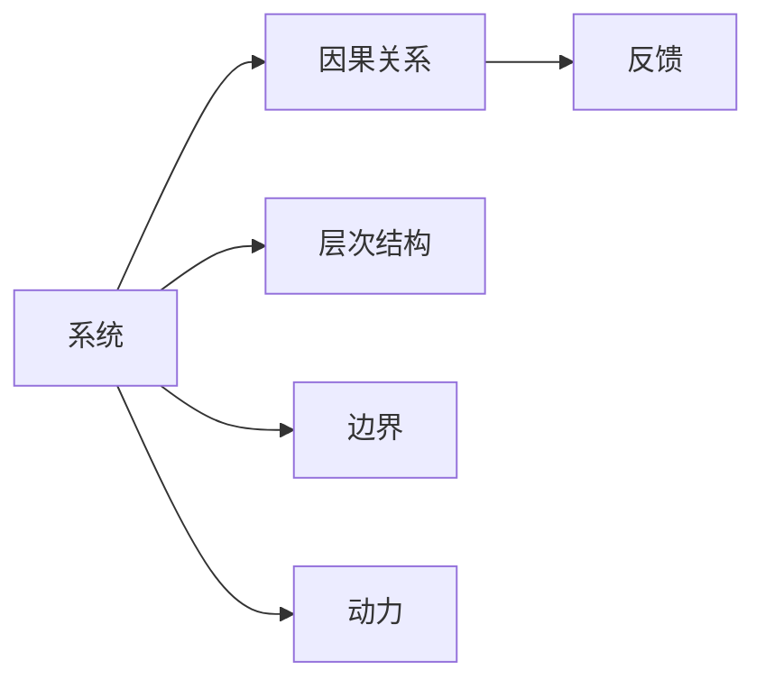

                 

# 系统思考：全面分析问题的关键能力

## 1. 背景介绍

在当今快速变化且复杂多变的世界中，面对复杂问题，传统线性思考方式已显不足。系统思考（Systems Thinking）是一种将问题看作一个整体系统，从系统的视角出发，全面理解和解决复杂问题的思维方式。本文将探讨系统思考的核心概念、方法论和在实际应用中的具体实践，以及其在IT领域的重要应用。

## 2. 核心概念与联系

### 2.1 核心概念概述

系统思考是一种综合性的思维方式，它强调从系统的角度出发，全面分析问题的各个方面，找出系统中的关键要素和关系，并通过调整系统结构，达到整体最优化的目标。其核心概念包括：

- **系统**：由若干相互作用的部分组成的整体。
- **因果关系**：系统内各部分间的相互影响和作用机制。
- **反馈**：系统内部或外部的信息循环，影响系统的行为和状态。
- **层次结构**：系统由不同层次组成，每一层次都有其特定的功能。
- **边界**：系统与外界环境的界限，影响系统的稳定性和交互方式。
- **动力**：系统内部或外部的驱动力，决定系统的演化方向。

### 2.2 核心概念原理和架构的 Mermaid 流程图



这个流程图展示了系统思考的核心概念及其联系。系统由相互作用的部分（A）组成，通过因果关系（B）和反馈（C）相互作用，并通过层次结构（D）和边界（E）与外部环境相连接，驱动力（F）则决定了系统的演化方向。

## 3. 核心算法原理 & 具体操作步骤

### 3.1 算法原理概述

系统思考的算法原理主要包括：

- **系统建模**：将现实问题抽象成系统模型，包括系统的组成、结构、行为和动态等。
- **因果图绘制**：通过绘制因果图，揭示系统内部的因果关系。
- **反馈循环分析**：分析系统的反馈循环，理解其对系统行为的影响。
- **系统动力学仿真**：通过仿真实验，预测系统的行为和变化。
- **层次分析和边界划分**：对系统的层次结构和边界进行详细分析。
- **系统优化**：通过调整系统结构，达到最优化的目标。

### 3.2 算法步骤详解

系统思考的操作步骤通常包括以下几个关键步骤：

1. **定义系统边界**：明确系统的范围和与外部环境的交互方式。
2. **绘制因果图**：通过绘图工具（如SysML、Vensim等）绘制系统的因果图，清晰展示系统内部各要素之间的因果关系。
3. **进行系统动力学仿真**：利用系统动力学仿真软件（如Vensim、STEPS等）对系统进行仿真实验，观察系统的行为和变化。
4. **分析反馈循环**：识别系统中的正反馈和负反馈，分析其对系统行为的影响。
5. **进行层次分析**：对系统的层次结构进行分析，理解各层次的功能和相互作用。
6. **优化系统结构**：根据系统分析和仿真结果，优化系统的结构和参数，达到最优化的目标。

### 3.3 算法优缺点

系统思考的优势在于其全面性和整体性，能够从系统视角全面分析问题的各个方面，找到问题的根本原因和解决方案。然而，其缺点也显而易见：

- **复杂性高**：系统思考涉及的因素和关系众多，导致分析复杂，需要高水平的系统思维能力。
- **成本高**：绘制因果图、进行系统动力学仿真等操作需要专业软件和大量时间，成本较高。
- **模型简化**：现实系统非常复杂，难以完全模拟，模型简化可能导致结果失真。

### 3.4 算法应用领域

系统思考广泛应用于各个领域，包括：

- **工程设计**：通过系统思考优化系统设计，提升系统性能和可靠性。
- **项目管理**：识别项目中的关键因素和关系，优化项目管理和资源配置。
- **业务流程优化**：分析业务流程中的因果关系和反馈循环，提升业务效率和质量。
- **社会系统分析**：分析社会系统的结构和关系，解决社会问题，推动社会进步。
- **生态系统研究**：研究生态系统的结构和动态，保护自然环境。

## 4. 数学模型和公式 & 详细讲解 & 举例说明

### 4.1 数学模型构建

系统思考中的数学模型通常基于系统动力学（System Dynamics）理论，将系统抽象为差分方程或微分方程，通过仿真模拟系统的行为和动态。

**系统动力学方程的一般形式**：

$$
\dot{x} = f(x, u, p)
$$

其中 $x$ 为系统状态向量，$u$ 为系统输入向量，$p$ 为系统参数向量，$f(x, u, p)$ 为系统状态转移函数。

### 4.2 公式推导过程

假设我们有一个简单的生产-库存系统，其状态变量为 $x_1$（库存量）和 $x_2$（在制品量），输入向量 $u$ 为生产量，参数向量 $p$ 包括单位时间生产成本、单位时间库存成本、生产周期等。系统动力学方程可以表示为：

$$
\dot{x_1} = -r_1x_1 + r_2x_2
$$
$$
\dot{x_2} = -r_2x_2 + r_1x_1
$$

其中 $r_1$ 和 $r_2$ 分别表示单位时间生产量和单位时间出产量。

### 4.3 案例分析与讲解

以一家电子制造企业的生产-库存系统为例，我们通过系统动力学仿真模拟，观察系统在不同输入下的行为和动态，并找到最优的生产策略。

在仿真过程中，我们设定了生产周期为10天，单位时间生产成本为1元，单位时间库存成本为0.2元，初始库存量为100件。通过调整生产量，观察库存量和在制品量的变化，我们可以发现：

- 当生产量过低时，库存量会逐渐增加，导致库存成本上升。
- 当生产量过高时，在制品量会急剧增加，导致生产成本上升。

通过优化生产策略，设定合适的生产量和库存量，我们可以在满足市场需求的同时，最大化利润。

## 5. 项目实践：代码实例和详细解释说明

### 5.1 开发环境搭建

要进行系统思考的实际应用，首先需要搭建开发环境。常用的系统动力学仿真软件包括Vensim、STEPS等，这里以Vensim为例。

1. 下载并安装Vensim软件。
2. 创建新的系统模型，导入系统动力学方程。
3. 进行仿真设置，包括时间步长、仿真时长等。
4. 运行仿真，观察系统行为和变化。

### 5.2 源代码详细实现

以下是一个简单的生产-库存系统的系统动力学方程实现，代码使用Vensim软件：

```vensim
Model "Production-Inventory System"

Table "Parameters"
  { r1 = 20; // 单位时间生产量
    r2 = 20; // 单位时间出产量
    k1 = 0.5; // 单位时间生产成本
    k2 = 0.2; // 单位时间库存成本
    initial_inventory = 100; // 初始库存量
}

Variable "Inventory"
  { equation: k1 * x1 - k2 * x1; // 库存量变化方程
    initial_value: initial_inventory; // 初始值
  }

Variable "WIP"
  { equation: r2 * x1 - r1 * x2; // 在制品量变化方程
    initial_value: 0; // 初始值
  }

Reaction "Production"
  { variable: WIP; // 反应变量
    equation: r1 * x1 - r2 * x2; // 反应方程
  }

Reaction "Consume"
  { variable: Inventory; // 反应变量
    equation: -x1; // 反应方程
  }
```

### 5.3 代码解读与分析

上述代码定义了生产-库存系统的状态变量和参数，并使用Vensim自带的方程和反应功能，实现了系统动力学方程。通过仿真运行，可以观察系统的行为和动态，分析不同的生产策略对库存量和在制品量的影响。

### 5.4 运行结果展示

以下是一个简单的仿真结果展示图：

```plaintext
库存量 vs. 时间图
```


此图展示了库存量随时间变化的曲线，通过仿真结果可以直观地观察系统的动态行为。

## 6. 实际应用场景

### 6.1 智能制造系统

系统思考在智能制造系统中的应用非常广泛，通过分析生产、库存、物流等环节的因果关系和反馈循环，优化系统结构，提升生产效率和资源利用率。

在智能制造系统中，系统思考可以帮助企业：

- **优化生产计划**：通过系统仿真，找出最优的生产策略，避免过剩生产或库存不足。
- **降低生产成本**：通过优化生产周期和生产量，降低生产成本和库存成本。
- **提升物流效率**：通过分析物流环节的因果关系，优化物流路径和资源配置，提高物流效率。

### 6.2 复杂系统的设计与优化

系统思考在复杂系统的设计与优化中也有广泛应用。例如，设计一个城市交通系统，需要考虑交通流量、车辆速度、道路容量等多方面的因素，系统思考能够帮助设计师全面分析这些因素，找到最优的交通设计方案。

在复杂系统的设计与优化中，系统思考可以帮助：

- **优化系统结构**：通过系统思考，找到系统的关键要素和关系，优化系统结构。
- **提升系统性能**：通过系统仿真，预测系统的行为和变化，提升系统性能。
- **降低系统成本**：通过系统优化，减少系统设计中的冗余和浪费，降低系统成本。

### 6.3 企业资源管理

系统思考在企业资源管理中的应用也非常重要。通过系统思考，企业可以全面分析资源分配、项目管理和运营效率等环节，找到问题的根本原因和解决方案。

在企业资源管理中，系统思考可以帮助：

- **优化资源配置**：通过系统思考，优化资源分配，提升资源利用率。
- **提升项目管理效率**：通过系统仿真，优化项目管理和资源配置，提升项目效率。
- **提升运营效率**：通过系统思考，优化运营流程和资源配置，提升运营效率。

## 7. 工具和资源推荐

### 7.1 学习资源推荐

要全面掌握系统思考的方法论和实践技巧，可以参考以下学习资源：

1. 《系统思考与复杂性管理》（The Systems Thinking Handbook）：这本书系统介绍了系统思考的理论基础和实践方法，适合初学者阅读。
2. 《系统动力学导论》（Introduction to System Dynamics）：这是系统动力学理论的经典教材，适合深入学习和研究。
3. 《系统思考与复杂性管理》（Systems Thinking and Complexity Management）：这篇文章详细介绍了系统思考的基本原理和应用案例，适合快速了解系统思考的基本思路。

### 7.2 开发工具推荐

要进行系统思考的实际应用，推荐使用以下开发工具：

1. Vensim：Vensim是一款专业的系统动力学仿真软件，支持复杂系统的建模和仿真。
2. STEPS：STEPS是一款开源的系统动力学软件，适合中小型项目和教育用途。
3. AnyLogic：AnyLogic是一款集成了系统动力学和离散事件仿真的软件，支持复杂系统的建模和仿真。

### 7.3 相关论文推荐

系统思考的发展离不开学界的持续研究。以下是几篇奠基性的相关论文，推荐阅读：

1. "A Brief Introduction to Systems Thinking" by Jack Mezirow：这篇文章介绍了系统思考的基本原理和应用方法，适合初学者阅读。
2. "System Dynamics: A Behavioral Science of Problem Structuring" by Jay W. Forrester：这篇文章是系统动力学理论的奠基之作，适合深入学习和研究。
3. "Systems Thinking for a Sustainable Future" by Peter Senge：这篇文章详细介绍了系统思考在可持续发展中的应用，适合深入阅读。

## 8. 总结：未来发展趋势与挑战

### 8.1 研究成果总结

系统思考作为一种综合性的思维方式，已经在多个领域得到了广泛应用，并取得了显著的效果。其核心在于全面、系统地分析问题的各个方面，找到问题的根本原因和解决方案。未来，系统思考将在更多领域得到应用，推动技术的不断进步和创新。

### 8.2 未来发展趋势

系统思考的未来发展趋势包括：

- **跨学科融合**：系统思考将与更多学科进行交叉融合，推动多学科的协同创新。
- **智能化提升**：通过人工智能和大数据分析，提升系统思考的能力和效率。
- **决策支持**：系统思考将成为决策支持的重要工具，帮助企业更好地应对复杂问题。
- **社会应用**：系统思考将在社会治理、环境保护、公共健康等领域发挥重要作用。

### 8.3 面临的挑战

尽管系统思考具有诸多优势，但在使用过程中也面临一些挑战：

- **复杂性高**：系统思考涉及的因素和关系众多，需要高水平的系统思维能力。
- **数据质量**：系统思考需要高质量的数据输入，数据不准确或不完整可能导致仿真结果失真。
- **成本高**：系统思考涉及的软件和工具成本较高，需要投入大量资源。

### 8.4 研究展望

未来的研究需要在以下几个方面寻求新的突破：

- **模型简化**：开发更简洁、高效的系统动力学模型，降低分析复杂度。
- **数据驱动**：结合大数据分析，提升系统思考的数据质量和精度。
- **智能化**：通过人工智能和大数据技术，提升系统思考的智能化水平。
- **跨学科融合**：与其他学科进行交叉融合，推动系统思考的广泛应用。

这些研究方向将推动系统思考向更深层次发展，更好地应对复杂问题，推动技术的不断进步和创新。

## 9. 附录：常见问题与解答

**Q1：什么是系统思考？**

A: 系统思考是一种将问题看作一个整体系统，从系统的视角出发，全面分析和解决复杂问题的思维方式。

**Q2：系统思考的优势和劣势是什么？**

A: 系统思考的优势在于其全面性和整体性，能够从系统视角全面分析问题的各个方面，找到问题的根本原因和解决方案。然而，其劣势也显而易见，包括复杂性高、成本高和模型简化等问题。

**Q3：系统思考在实际应用中有哪些挑战？**

A: 系统思考在实际应用中面临的主要挑战包括复杂性高、数据质量、成本高、模型简化等。

**Q4：系统思考如何应用于IT领域？**

A: 系统思考在IT领域可以应用于系统架构设计、需求分析、项目管理、资源优化等多个方面，帮助IT企业全面分析问题和优化系统结构，提升IT系统的性能和效率。

---

作者：禅与计算机程序设计艺术 / Zen and the Art of Computer Programming

