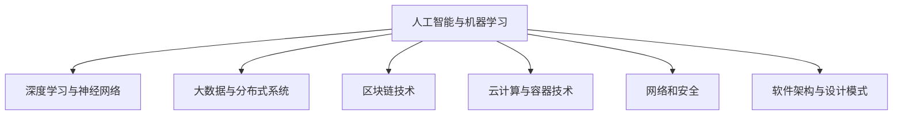
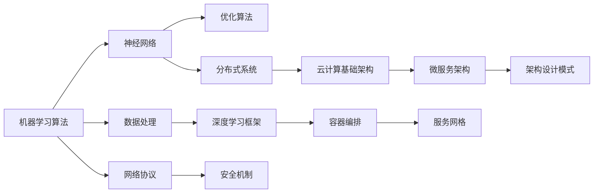

                 

# 经典书单:夯实认知根基的宝藏

---

## 1. 背景介绍

在科技飞速发展的今天，人工智能（AI）、大数据、区块链、云计算等前沿技术日益融入各行各业，对个体知识架构和认知能力提出了更高要求。作为AI与技术领域的深度参与者和实践者，我深知持续学习的重要性，并始终致力于分享和推荐优质学习资源。本文旨在通过一份精心挑选的经典书单，帮助广大从业者夯实知识根基，构建全面且深入的技术认知体系。

## 2. 核心概念与联系

### 2.1 核心概念概述

本文推荐的书单涵盖了从基础理论到前沿技术的多个层面，旨在帮助读者构建全方位、多维度的知识体系。核心概念主要包括：

- **人工智能与机器学习**：理解算法原理、模型训练、数据处理等核心概念，掌握机器学习的基础与进阶技术。
- **深度学习与神经网络**：深入学习深度学习框架、神经网络架构、优化算法等，掌握前沿的深度学习技术和应用。
- **大数据与分布式系统**：熟悉大数据技术栈，理解分布式系统设计原理和实践案例，掌握大数据处理和存储的高级技术。
- **区块链技术**：了解区块链原理、共识机制、智能合约等基础概念，掌握区块链的应用场景和实践案例。
- **云计算与容器技术**：理解云计算基础架构，掌握容器编排、服务网格、微服务架构等云计算核心技术。
- **网络和安全**：掌握网络协议、数据加密、安全机制等基本概念，熟悉安全漏洞防护和隐私保护策略。
- **软件架构与设计模式**：理解软件架构设计的核心原则，掌握常用的设计模式和技术栈，提升架构设计与开发能力。

这些核心概念之间的联系可以通过以下Mermaid流程图来展示：



这个流程图展示了各核心概念之间的相互关联与支撑，构建起完整的技术认知体系。

### 2.2 核心概念原理和架构的 Mermaid 流程图



该图简要展示了核心概念之间的关系和架构设计，帮助读者理解各技术之间的联系和应用场景。

## 3. 核心算法原理 & 具体操作步骤

### 3.1 算法原理概述

人工智能技术的核心在于算法和模型。本文将介绍几个关键算法的原理，包括监督学习、无监督学习、强化学习等，并详细讲解其操作步骤。

#### 3.1.1 监督学习

监督学习是通过有标签的数据集训练模型，使其能够对新数据进行预测。其基本流程包括：

1. **数据准备**：收集并准备有标签的数据集。
2. **模型选择**：选择适合的监督学习模型，如决策树、支持向量机、神经网络等。
3. **模型训练**：使用训练数据集训练模型，调整模型参数，使其最小化损失函数。
4. **模型评估**：使用验证集评估模型性能，确定最优参数。
5. **模型应用**：在测试集上测试模型性能，进行预测。

#### 3.1.2 无监督学习

无监督学习旨在从无标签数据中发现模式和结构，常用于数据聚类、降维、异常检测等任务。其基本流程包括：

1. **数据准备**：准备无标签的数据集。
2. **模型选择**：选择适合的无监督学习模型，如K-means、主成分分析（PCA）、自编码器等。
3. **模型训练**：使用数据集训练模型，寻找数据的内在结构。
4. **模型评估**：通过评估指标（如聚类质量、重构误差）衡量模型性能。
5. **模型应用**：将模型应用于新的数据集，发现隐藏的模式。

#### 3.1.3 强化学习

强化学习通过与环境的交互，学习最优策略以最大化累积奖励。其基本流程包括：

1. **环境定义**：定义奖励函数和环境状态空间。
2. **模型选择**：选择适合的强化学习算法，如Q-learning、SARSA、策略梯度等。
3. **模型训练**：通过与环境交互，训练模型，更新策略。
4. **策略评估**：评估策略的性能，确定最优策略。
5. **策略应用**：将最优策略应用于实际环境，实现自动化决策。

### 3.2 算法步骤详解

#### 3.2.1 监督学习算法步骤

1. **数据准备**
   - 收集有标签的数据集，确保数据质量。
   - 数据预处理，包括数据清洗、归一化、特征提取等。

2. **模型选择**
   - 根据任务特点选择合适的监督学习模型。
   - 初始化模型参数，设置超参数（如学习率、正则化参数等）。

3. **模型训练**
   - 定义损失函数，如均方误差、交叉熵等。
   - 使用优化算法（如梯度下降、Adam等）更新模型参数。
   - 通过迭代训练，最小化损失函数。

4. **模型评估**
   - 在验证集上评估模型性能，如准确率、召回率、F1值等。
   - 根据评估结果调整超参数，优化模型。

5. **模型应用**
   - 在测试集上测试模型性能，进行预测。
   - 将模型应用到实际问题中，进行业务场景验证。

#### 3.2.2 无监督学习算法步骤

1. **数据准备**
   - 收集无标签的数据集，确保数据多样性和丰富性。
   - 数据预处理，包括数据清洗、特征提取等。

2. **模型选择**
   - 根据任务特点选择合适的无监督学习模型。
   - 初始化模型参数，设置超参数。

3. **模型训练**
   - 定义损失函数，如聚类误差、重构误差等。
   - 使用优化算法更新模型参数。
   - 通过迭代训练，优化模型。

4. **模型评估**
   - 使用评估指标（如聚类质量、重构误差等）衡量模型性能。
   - 根据评估结果调整超参数，优化模型。

5. **模型应用**
   - 将模型应用于新的数据集，发现隐藏的模式。
   - 根据应用场景进行调整和优化。

#### 3.2.3 强化学习算法步骤

1. **环境定义**
   - 定义奖励函数和环境状态空间。
   - 设计状态转换模型，如马尔可夫决策过程（MDP）。

2. **模型选择**
   - 根据任务特点选择合适的强化学习算法。
   - 初始化模型参数，设置超参数。

3. **模型训练**
   - 通过与环境交互，收集状态-动作-奖励数据。
   - 使用优化算法更新模型参数。
   - 通过迭代训练，优化策略。

4. **策略评估**
   - 使用评估指标（如累积奖励、策略稳定性等）衡量策略性能。
   - 根据评估结果调整策略，优化策略。

5. **策略应用**
   - 将最优策略应用于实际环境，实现自动化决策。
   - 持续监控和调整策略，提升决策效果。

### 3.3 算法优缺点

#### 3.3.1 监督学习的优缺点

**优点**：
- 有标签数据易于获取，算法效果稳定可靠。
- 适用于分类、回归、预测等任务，应用广泛。

**缺点**：
- 依赖大量标注数据，数据收集成本高。
- 模型泛化能力受数据分布影响，可能过拟合。

#### 3.3.2 无监督学习的优缺点

**优点**：
- 不依赖标注数据，数据获取容易。
- 发现数据内在结构，适用于数据挖掘、降维等任务。

**缺点**：
- 结果难以解释，缺乏任务导向性。
- 模型性能依赖数据质量，可能出现局部最优。

#### 3.3.3 强化学习的优缺点

**优点**：
- 适应性强，适用于复杂决策问题。
- 通过与环境交互，不断优化策略。

**缺点**：
- 环境复杂性高，模型训练耗时长。
- 模型稳定性受奖励设计影响，可能出现不稳定策略。

### 3.4 算法应用领域

各算法在实际应用中具有不同的优势和适用场景。以下简要介绍其应用领域：

- **监督学习**：广泛应用于分类、回归、预测等任务，如图像识别、语音识别、推荐系统等。
- **无监督学习**：适用于数据挖掘、降维、聚类等任务，如社交网络分析、用户行为分析、异常检测等。
- **强化学习**：适用于游戏AI、机器人控制、自动驾驶等需要决策的任务，如AlphaGo、自动驾驶汽车、智能机器人等。

## 4. 数学模型和公式 & 详细讲解 & 举例说明

### 4.1 数学模型构建

本节将使用数学语言对上述算法进行更加严格的刻画。

**监督学习数学模型**：
- 输入数据：$x$，标签数据：$y$。
- 模型：$f(x;w)$，其中$w$为模型参数。
- 损失函数：$L(y, f(x;w))$。
- 优化目标：$\min_w L(y, f(x;w))$。

**无监督学习数学模型**：
- 输入数据：$x$。
- 模型：$f(x;w)$，其中$w$为模型参数。
- 损失函数：$L(x, f(x;w))$。
- 优化目标：$\min_w L(x, f(x;w))$。

**强化学习数学模型**：
- 状态：$s$，动作：$a$，奖励：$r$。
- 策略：$\pi(a|s)$，其中$\pi$为策略函数。
- 状态转移概率：$P(s'|s, a)$。
- 损失函数：$J(\pi)$。
- 优化目标：$\max_\pi J(\pi)$。

### 4.2 公式推导过程

#### 4.2.1 监督学习公式推导

监督学习的核心在于最小化损失函数，即：
$$
\min_w L(y, f(x;w))
$$
其中$L(y, f(x;w))$为损失函数，如均方误差、交叉熵等。推导过程如下：
1. **均方误差损失**：
$$
L(y, f(x;w)) = \frac{1}{n} \sum_{i=1}^n (y_i - f(x_i;w))^2
$$
2. **梯度下降更新**：
$$
w \leftarrow w - \eta \nabla_w L(y, f(x;w))
$$

#### 4.2.2 无监督学习公式推导

无监督学习的目标是最小化数据集的整体损失，即：
$$
\min_w L(x, f(x;w))
$$
其中$L(x, f(x;w))$为损失函数，如聚类误差、重构误差等。推导过程如下：
1. **K-means聚类损失**：
$$
L(x, f(x;w)) = \frac{1}{n} \sum_{i=1}^n ||x_i - f(x_i;w)||^2
$$
2. **梯度下降更新**：
$$
w \leftarrow w - \eta \nabla_w L(x, f(x;w))
$$

#### 4.2.3 强化学习公式推导

强化学习的目标是最大化累积奖励，即：
$$
\max_\pi J(\pi)
$$
其中$J(\pi)$为累积奖励函数，$P(s'|s, a)$为状态转移概率。推导过程如下：
1. **Q-learning公式**：
$$
Q(s, a) \leftarrow Q(s, a) + \alpha (r + \gamma \max_{a'} Q(s', a') - Q(s, a))
$$
2. **策略梯度公式**：
$$
\pi(a|s) \propto \exp(Q(s, a))
$$

### 4.3 案例分析与讲解

#### 4.3.1 监督学习案例

**案例**：图像分类任务

**数据准备**：收集并准备大量带标签的图像数据集。

**模型选择**：选择卷积神经网络（CNN）模型。

**模型训练**：使用梯度下降优化算法更新模型参数，最小化损失函数。

**模型评估**：在验证集上评估模型性能，如准确率、召回率等。

**模型应用**：将模型应用到实际图像分类任务中，进行预测。

#### 4.3.2 无监督学习案例

**案例**：用户行为聚类

**数据准备**：收集用户行为数据，如浏览记录、购买记录等。

**模型选择**：选择K-means聚类模型。

**模型训练**：使用梯度下降优化算法更新模型参数，最小化聚类误差。

**模型评估**：使用评估指标（如聚类质量、重构误差等）衡量模型性能。

**模型应用**：将模型应用于新的用户行为数据，发现用户行为模式。

#### 4.3.3 强化学习案例

**案例**：自动驾驶汽车决策

**环境定义**：定义奖励函数和环境状态空间，如行驶距离、安全性等。

**模型选择**：选择强化学习算法，如Q-learning、策略梯度等。

**模型训练**：通过与环境交互，收集状态-动作-奖励数据，更新策略。

**策略评估**：使用评估指标（如累积奖励、策略稳定性等）衡量策略性能。

**策略应用**：将最优策略应用于自动驾驶汽车决策中，实现自动化控制。

## 5. 项目实践：代码实例和详细解释说明

### 5.1 开发环境搭建

在开始项目实践前，我们需要准备好开发环境。以下是Python开发环境配置的详细步骤：

1. 安装Anaconda：从官网下载并安装Anaconda，用于创建独立的Python环境。
   ```bash
   conda create -n myenv python=3.8
   conda activate myenv
   ```

2. 安装必要的Python库：
   ```bash
   pip install numpy scipy matplotlib pandas scikit-learn torch torchvision transformers
   ```

3. 安装TensorFlow和其他深度学习库：
   ```bash
   pip install tensorflow
   pip install tensorflow-addons
   pip install gym pybullet
   ```

### 5.2 源代码详细实现

以下是一个基于PyTorch的监督学习项目示例，展示如何使用PyTorch进行数据加载、模型定义、训练和评估。

#### 5.2.1 数据准备

```python
import torch
from torch.utils.data import Dataset, DataLoader
from torchvision import transforms, datasets

class MyDataset(Dataset):
    def __init__(self, data_dir, transform=None):
        self.data_dir = data_dir
        self.transform = transform
        
        # 加载数据集
        self.data = datasets.ImageFolder(self.data_dir)
        
    def __len__(self):
        return len(self.data)
    
    def __getitem__(self, idx):
        img, target = self.data[idx]
        img = self.transform(img)
        return img, target

# 数据预处理
transform = transforms.Compose([
    transforms.Resize((224, 224)),
    transforms.ToTensor(),
    transforms.Normalize(mean=[0.485, 0.456, 0.406], std=[0.229, 0.224, 0.225])
])
```

#### 5.2.2 模型定义

```python
import torch.nn as nn
import torch.optim as optim

class MyModel(nn.Module):
    def __init__(self):
        super(MyModel, self).__init__()
        self.conv1 = nn.Conv2d(3, 64, kernel_size=3, stride=1, padding=1)
        self.pool = nn.MaxPool2d(kernel_size=2, stride=2)
        self.fc1 = nn.Linear(64*28*28, 256)
        self.fc2 = nn.Linear(256, 10)
        
    def forward(self, x):
        x = self.pool(F.relu(self.conv1(x)))
        x = x.view(x.size(0), -1)
        x = F.relu(self.fc1(x))
        x = self.fc2(x)
        return x

# 加载模型
model = MyModel()
```

#### 5.2.3 训练过程

```python
# 定义损失函数和优化器
criterion = nn.CrossEntropyLoss()
optimizer = optim.SGD(model.parameters(), lr=0.01, momentum=0.9)

# 训练循环
for epoch in range(num_epochs):
    for batch_idx, (data, target) in enumerate(train_loader):
        optimizer.zero_grad()
        output = model(data)
        loss = criterion(output, target)
        loss.backward()
        optimizer.step()
        
        if batch_idx % 100 == 0:
            print(f'Epoch [{epoch+1}/{num_epochs}], Step [{batch_idx*len(data)}/{len(train_dataset)}], Loss: {loss:.4f}')
```

#### 5.2.4 评估过程

```python
# 加载测试数据集
test_dataset = datasets.ImageFolder(test_data_dir)
test_loader = DataLoader(test_dataset, batch_size=batch_size, shuffle=False)

# 评估模型
correct = 0
total = 0
with torch.no_grad():
    for data, target in test_loader:
        output = model(data)
        _, predicted = torch.max(output, 1)
        total += target.size(0)
        correct += (predicted == target).sum().item()

print(f'Accuracy: {100 * correct / total:.2f}%')
```

### 5.3 代码解读与分析

#### 5.3.1 数据准备

**MyDataset类**：
- 初始化：加载数据集，定义数据预处理方式。
- `__len__`方法：返回数据集大小。
- `__getitem__`方法：返回单个数据样本及其标签。

#### 5.3.2 模型定义

**MyModel类**：
- 初始化：定义模型结构，包含卷积层、池化层、全连接层等。
- `forward`方法：定义前向传播过程。

#### 5.3.3 训练过程

**训练循环**：
- 数据迭代：在训练集上进行前向传播和反向传播。
- 优化更新：使用优化器更新模型参数。

#### 5.3.4 评估过程

**测试循环**：
- 加载测试数据集。
- 评估模型性能，计算准确率。

### 5.4 运行结果展示

通过上述代码，我们实现了一个简单的监督学习项目。在训练过程中，可以使用TensorBoard或其他可视化工具监控训练过程，确保模型收敛。在测试过程中，可以记录模型准确率和性能指标，进行效果评估。

## 6. 实际应用场景

### 6.1 图像分类

图像分类是监督学习的经典应用之一。在实际应用中，可以使用预训练的图像分类模型，如ResNet、Inception等，进行微调或迁移学习，实现特定场景下的图像分类任务。例如，在医疗影像分类中，可以通过微调ResNet模型，对不同疾病的影像进行分类和诊断。

### 6.2 用户行为分析

用户行为分析是无监督学习的典型应用。通过收集用户行为数据，如浏览记录、购买记录等，可以使用K-means聚类模型，发现用户行为模式和偏好，进行个性化推荐、市场营销等。例如，电商平台可以通过用户行为聚类，推荐相似商品，提升用户体验和销售额。

### 6.3 自动驾驶

自动驾驶是强化学习的典型应用之一。通过与环境交互，学习最优驾驶策略，实现自主决策。例如，自动驾驶汽车可以使用Q-learning算法，学习最优的行驶路径和避障策略，提高行车安全性和效率。

## 7. 工具和资源推荐

### 7.1 学习资源推荐

为了帮助读者深入学习相关知识，以下是一些优质的学习资源：

1. **Coursera**：提供众多计算机科学和人工智能课程，包括机器学习、深度学习、强化学习等。

2. **edX**：提供大量高质量的在线课程，涵盖数据科学、计算机科学、人工智能等多个领域。

3. **Kaggle**：提供数据科学竞赛平台，可以通过参与竞赛项目，实践和提升技术能力。

4. **GitHub**：提供众多开源项目和代码库，可以学习和借鉴优秀的实践经验。

5. **Stack Overflow**：提供技术问答社区，可以解决学习过程中遇到的问题和疑惑。

### 7.2 开发工具推荐

以下是一些常用的开发工具，可以帮助提高开发效率和质量：

1. **Jupyter Notebook**：免费的交互式编程环境，支持Python、R等多种语言，适合数据科学和机器学习项目。

2. **PyCharm**：专业的Python IDE，提供丰富的代码补全、调试和测试功能。

3. **Visual Studio Code**：轻量级的代码编辑器，支持多种编程语言和扩展插件。

4. **Google Colab**：免费的在线Jupyter Notebook环境，支持GPU加速和云端存储。

5. **TensorBoard**：TensorFlow的可视化工具，可以实时监控模型训练过程和性能指标。

### 7.3 相关论文推荐

为了深入理解相关理论和技术，以下是一些经典的论文推荐：

1. **《Deep Learning》**：Ian Goodfellow等著，全面介绍深度学习理论和实践，涵盖多个前沿领域。

2. **《Reinforcement Learning: An Introduction》**：Richard S. Sutton和Andrew G. Barto著，详细介绍强化学习的基本原理和算法。

3. **《Pattern Recognition and Machine Learning》**：Christopher M. Bishop著，介绍模式识别和机器学习的理论基础。

4. **《Data Science for Business》**：J. Foster和D. Kirkwood著，介绍数据科学在商业中的应用和实践。

5. **《Artificial Intelligence: A Modern Approach》**：Stuart Russell和Peter Norvig著，介绍人工智能的多个分支和最新进展。

## 8. 总结：未来发展趋势与挑战

### 8.1 研究成果总结

本文介绍了几种核心算法及其在实际应用中的基本原理和操作步骤，并给出了详细案例分析。通过系统学习和实践，读者可以掌握相关技术的基本框架和实际应用。未来，随着技术不断发展和进步，人工智能将更深入地融入各个行业，带来更广泛的应用前景和更深入的理论挑战。

### 8.2 未来发展趋势

未来人工智能技术将呈现以下几个发展趋势：

1. **自监督学习**：通过大规模无标签数据进行预训练，减少对标注数据的依赖，提升模型泛化能力。

2. **联邦学习**：通过分布式协同学习，保护数据隐私，提升模型效果和效率。

3. **对抗生成网络（GANs）**：通过生成对抗训练，生成更加逼真的数据和图像，应用于生成模型和图像处理。

4. **神经网络结构优化**：通过网络剪枝、知识蒸馏等技术，提高模型效率和效果，降低计算成本。

5. **模型解释和可解释性**：通过模型解释和可视化技术，提升模型可解释性，满足监管和伦理要求。

### 8.3 面临的挑战

尽管人工智能技术取得了巨大进展，但在实际应用中仍面临以下挑战：

1. **数据隐私和伦理问题**：如何保护数据隐私，避免数据滥用，确保算法公平性。

2. **模型可解释性**：如何解释模型决策过程，确保算法的透明性和可信性。

3. **计算资源需求**：如何优化计算资源使用，提升模型训练和推理效率。

4. **跨领域应用**：如何适应不同领域的特点，提高模型的通用性和适应性。

5. **模型鲁棒性**：如何增强模型鲁棒性，避免对抗攻击和过拟合。

### 8.4 研究展望

面对这些挑战，未来的研究需要在以下几个方面寻求新的突破：

1. **自适应学习**：通过动态调整模型参数，提升模型适应性，满足不同应用场景的需求。

2. **多模态融合**：通过融合不同模态的数据，提升模型的综合能力和表现。

3. **跨领域迁移**：通过跨领域迁移学习，提高模型在多个领域的表现。

4. **泛化能力提升**：通过自监督学习和数据增强技术，提升模型的泛化能力和泛化性能。

5. **分布式训练**：通过分布式训练和联邦学习技术，提高模型的训练效率和效果。

总之，未来人工智能技术需要不断突破现有局限，提升模型效果和效率，满足复杂应用场景的需求，为各行各业带来更多创新和价值。

## 9. 附录：常见问题与解答

### 9.1 常见问题

**Q1: 如何选择合适的数据集进行模型训练？**

**A:** 数据集的选择应根据任务特点和数据质量进行综合考虑。通常选择具有代表性、多样性、高质量的数据集。可以通过公开数据集、众包数据集等方式获取数据集，并进行数据清洗、特征工程等预处理步骤。

**Q2: 如何避免模型过拟合？**

**A:** 过拟合可以通过以下方法避免：数据增强、正则化、早停等。数据增强方法可以通过旋转、缩放、扰动等方式扩充数据集，减少模型对训练数据的依赖。正则化方法可以通过L2正则、Dropout等方式控制模型复杂度。早停方法可以通过监控验证集性能，及时停止训练，防止过拟合。

**Q3: 如何选择优化器及其参数？**

**A:** 优化器选择应根据模型特点和数据分布进行综合考虑。通常选择Adam、SGD等优化器，并设置学习率、动量等参数。学习率一般设置为0.001~0.01，动量一般设置为0.9~0.99。同时，可以通过学习率衰减、权重衰减等方式优化优化器参数。

**Q4: 如何提升模型性能？**

**A:** 模型性能可以通过以下方法提升：模型结构优化、超参数调优、数据增强等。模型结构优化可以通过网络剪枝、知识蒸馏等技术，提升模型效率和效果。超参数调优可以通过网格搜索、随机搜索等方式，寻找最优参数组合。数据增强可以通过旋转、缩放、扰动等方式扩充数据集，减少模型对训练数据的依赖。

通过以上问题解答，读者可以更好地理解人工智能技术的实际应用和优化方法，从而在实际项目中取得更好的效果。

---

**作者**：禅与计算机程序设计艺术 / Zen and the Art of Computer Programming

