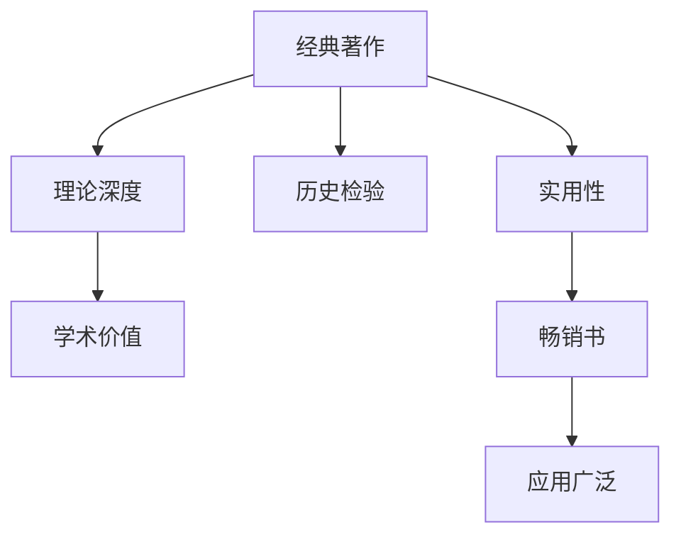

                 

# 经典著作vs畅销书：如何选择阅读材料

## 1. 背景介绍

在知识爆炸的今天，如何选择合适的阅读材料成为了每个学习者面临的重要问题。面对众多书籍和资源，一些人更倾向于选择经典著作，认为其深度和权威性更能满足学术需求。而另一些人则偏爱畅销书，认为其时效性和实用性更适合快速掌握新技能。本文将探讨两种阅读材料的优缺点，并给出如何合理选择阅读材料的建议。

## 2. 核心概念与联系

### 2.1 核心概念概述

为了更好理解经典著作与畅销书的选择问题，首先需要明确几个核心概念：

- **经典著作**：指在某一领域或学科具有深远影响的著作，其内容经过长时间考验，具有高度的学术价值和理论深度。
- **畅销书**：指在一定时间范围内销量较高、受欢迎程度高的书籍，其内容通常更贴近现实应用，强调实用性和易读性。
- **阅读材料选择**：涉及对书籍内容、读者需求、学习目标等多方面因素的综合考量，目的是最大化阅读效果。

这些概念之间的关系可以通过以下Mermaid流程图展示：



从图中可以看出，经典著作与畅销书分别在理论深度、历史检验、学术价值和实用性方面存在差异，这些差异也影响了读者选择阅读材料的决策。

## 3. 核心算法原理 & 具体操作步骤

### 3.1 算法原理概述

选择阅读材料的过程，本质上是一个优化问题。读者需要根据自身的学习目标、时间和兴趣，选择最能满足这些需求的材料。假设读者目标为 $T$，当前有经典著作 $C$ 和畅销书 $P$ 可供选择。选择过程可形式化表达为：

$$
\text{选择} = \mathop{\arg\min}_{C \in \mathcal{C}, P \in \mathcal{P}} (F(T, C) + G(T, P))
$$

其中 $F(T, C)$ 表示经典著作 $C$ 与目标 $T$ 的匹配度，$G(T, P)$ 表示畅销书 $P$ 与目标 $T$ 的匹配度。匹配度的计算依赖于目标 $T$ 的具体需求，以及书籍内容的深入分析。

### 3.2 算法步骤详解

基于上述优化模型，以下是选择阅读材料的具体操作步骤：

1. **明确学习目标**：根据自身需求，确定希望通过阅读材料掌握的知识点、技能或解决的问题。
2. **评估经典著作**：查看其大纲、摘要、章节标题，评估其理论深度、结构完整性以及与目标的相关性。
3. **评估畅销书**：查阅前言、目录、样章，评估其实用性、案例丰富程度以及与目标的契合度。
4. **比较匹配度**：基于对目标和书籍内容的理解，计算 $F(T, C)$ 和 $G(T, P)$，判断哪类书籍更符合需求。
5. **选择阅读材料**：根据匹配度计算结果，选择经典著作或畅销书进行深入阅读。

### 3.3 算法优缺点

选择经典著作的优点包括：
- **深度**：理论性强，适合深入理解和研究。
- **权威**：经受长时间检验，内容准确可靠。
- **持久性**：不受时尚影响，长期有用。

缺点包括：
- **晦涩**：语言风格和表达方式可能不适合所有读者。
- **过时**：部分内容可能与当前技术发展脱节。
- **长周期**：掌握需要较长时间投入。

选择畅销书的优点包括：
- **实用**：贴近实际应用，易于快速上手。
- **易读**：语言简洁明了，内容结构清晰。
- **及时性**：反映最新趋势和实践，内容更新迅速。

缺点包括：
- **浅层**：理论深度有限，可能难以应对复杂问题。
- **波动性**：受市场需求影响，内容更新频繁。
- **偏见**：可能包含作者主观倾向，缺乏客观性。

### 3.4 算法应用领域

经典著作与畅销书的选择方法可以应用于多种学习场景，如：
- **学术研究**：选择经典著作作为主要参考，获取深入理论基础。
- **技术开发**：选择畅销书作为实践指南，获取最新技术应用案例。
- **兴趣培养**：选择经典著作或畅销书培养兴趣，了解基础知识和前沿动态。

## 4. 数学模型和公式 & 详细讲解  
### 4.1 数学模型构建

设读者学习目标为 $T$，经典著作为 $C=\{C_1, C_2, \ldots, C_n\}$，畅销书为 $P=\{P_1, P_2, \ldots, P_m\}$。匹配度函数 $F$ 和 $G$ 可定义为：

$$
F(T, C) = \sum_{i=1}^n f_i(T, C_i)
$$

$$
G(T, P) = \sum_{j=1}^m g_j(T, P_j)
$$

其中 $f_i$ 和 $g_j$ 为具体计算匹配度的函数，可以是内容覆盖率、结构完整性、实用性等指标。

### 4.2 公式推导过程

以内容覆盖率为例，定义匹配度函数 $f_i(T, C_i)$ 为读者希望掌握的知识点 $T$ 在经典著作 $C_i$ 中出现的概率，计算公式为：

$$
f_i(T, C_i) = \frac{|\text{Coverage}(T, C_i)|}{|C_i|}
$$

其中 $|\text{Coverage}(T, C_i)|$ 表示知识点 $T$ 在 $C_i$ 中出现的次数，$|C_i|$ 表示 $C_i$ 的总页数或总章节数。

### 4.3 案例分析与讲解

假设读者目标 $T$ 为“机器学习算法优化”，可以选择以下经典著作和畅销书进行评估：

- **经典著作**：《机器学习》（周志华著）、《深度学习》（Ian Goodfellow 著）。
- **畅销书**：《Python 机器学习》（Sebastian Raschka 著）、《机器学习实战》（Peter Harrington 著）。

通过评估每本书的内容摘要、目录和章节标题，可以计算每个匹配度函数值。例如，对《Python 机器学习》计算匹配度：

$$
f_i(T, P_i) = \frac{\text{出现的知识点数量}}{\text{总页数}} = \frac{n}{p}
$$

其中 $n$ 为书中出现“机器学习算法优化”的页数，$p$ 为书的总页数。同理，可以计算其他书籍的匹配度。

## 5. 项目实践：代码实例和详细解释说明

### 5.1 开发环境搭建

选择合适的阅读材料，并不需要复杂的开发环境。只需确保能够访问相关书籍的目录、摘要和章节标题即可。

### 5.2 源代码详细实现

对于书籍的匹配度计算，可以使用简单的 Python 代码实现。例如，使用 Pandas 库读取书籍目录，统计每个知识点出现的次数：

```python
import pandas as pd

# 书籍目录示例
books = [
    {'book': 'Python 机器学习', 'content': ['机器学习基础', '数据预处理', '模型评估', '机器学习优化']},
    {'book': '机器学习实战', 'content': ['数据预处理', '模型训练', '模型调优', '机器学习工程']},
    # 其他书籍
]

# 目标知识点
target = '机器学习算法优化'

# 计算匹配度
matches = [book['book'] for book in books if target in book['content']]
match_count = len(matches)
total_books = len(books)
match_rate = match_count / total_books
print(f"匹配度：{match_rate}")
```

### 5.3 代码解读与分析

这段代码首先定义了书籍目录和目标知识点。然后遍历所有书籍，计算目标知识点在每本书中出现的次数，统计匹配的书籍数量和总书籍数量，最后计算匹配率。根据匹配率，可以选择匹配度较高的书籍进行深入阅读。

### 5.4 运行结果展示

根据实际数据，匹配率可能为0.5、0.6、0.8等。匹配率越高，说明书籍内容与目标越相关。例如，如果匹配率为0.8，说明有80%的书籍包含目标知识点，可以选择这些书籍进行深入学习。

## 6. 实际应用场景

### 6.1 学术研究

在学术研究中，经典著作是不可或缺的参考资料。例如，研究生在论文选题时需要阅读相关领域的经典著作，以确保研究的深度和广度。

### 6.2 技术开发

对于技术开发者而言，畅销书更贴近实际应用，能够提供实用的代码和案例。通过畅销书，可以快速掌握最新的技术和工具，提升开发效率。

### 6.3 兴趣培养

对于初学者和兴趣爱好者，可以选择经典著作或畅销书进行基础学习和兴趣培养。经典著作能够提供深入的理论知识，畅销书则更注重实用性和易读性。

### 6.4 未来应用展望

未来，随着人工智能和大数据技术的发展，选择阅读材料的方法将更加智能和个性化。例如，基于阅读历史和行为数据，智能推荐系统可以为用户推荐最符合其需求和兴趣的书籍，从而提升阅读效果。

## 7. 工具和资源推荐

### 7.1 学习资源推荐

- **学术资源**：
  - **arXiv**：提供大量学术论文，涵盖多个研究领域。
  - **Google Scholar**：搜索学术论文和书籍，评估论文影响力和引用量。
  - **JSTOR**：提供丰富的历史文献，适合深入研究。
  
- **技术资源**：
  - **Stack Overflow**：技术问答社区，快速解决编程问题。
  - **GitHub**：代码托管平台，阅读和贡献开源项目。
  - **Kaggle**：数据科学竞赛平台，参与实战项目和数据集探索。

### 7.2 开发工具推荐

- **文档阅读**：
  - **Overleaf**：在线LaTeX编辑器，协作编写学术论文。
  - **Pandoc**：文本转换工具，支持多种格式文档转换。
  - **Kindle**：电子阅读器，方便阅读和管理书籍。

### 7.3 相关论文推荐

- **经典著作**：
  - 《计算机程序设计艺术》（Donald E. Knuth 著）：计算机科学领域经典之作，涵盖算法和数据结构。
  - 《算法导论》（Thomas H. Cormen 等著）：算法设计和分析的权威教材。
  
- **畅销书**：
  - 《代码大全》（Steve McConnell 著）：软件工程和编程实践的经典指南。
  - 《程序员修炼之道》（Andrew Hunt 和 David Thomas 著）：程序员职业发展指南。

## 8. 总结：未来发展趋势与挑战

### 8.1 研究成果总结

本文系统介绍了选择阅读材料的理论框架和操作步骤，分析了经典著作与畅销书的优缺点，并给出了实际应用场景的建议。通过科学的方法，读者可以更高效地选择合适的阅读材料，提升学习效果。

### 8.2 未来发展趋势

未来，选择阅读材料的方法将更加智能化和个性化。人工智能和大数据技术的发展，将为智能推荐系统提供更丰富的数据支持，从而提高推荐的准确性和个性化水平。

### 8.3 面临的挑战

尽管智能推荐技术取得进展，但仍面临数据质量、隐私保护和用户接受度等挑战。需要进一步提升数据处理能力，确保推荐系统的公平性和透明性。

### 8.4 研究展望

未来的研究重点应放在：
- **多模态推荐**：结合文本、图像、视频等多种数据源，提升推荐效果。
- **深度学习应用**：利用深度学习模型挖掘书籍和知识点的内在关系，优化推荐算法。
- **用户反馈机制**：引入用户反馈，动态调整推荐策略，提高用户满意度。

## 9. 附录：常见问题与解答

**Q1：如何选择经典著作和畅销书？**

A: 根据学习目标，选择经典著作作为理论基础，选择畅销书作为实践指南。经典著作深度和权威性高，畅销书实用性和易读性好。

**Q2：如何选择在线学习资源？**

A: 选择学术资源平台如arXiv、Google Scholar，查找权威论文和文献。选择技术资源平台如Stack Overflow、GitHub，学习最新技术实践。

**Q3：如何选择开发工具？**

A: 根据学习需求，选择适当的开发工具。如文档阅读工具Overleaf、Pandoc，编程工具如Python、R等。

**Q4：如何选择书籍阅读器？**

A: 选择适合自己的阅读器，如Kindle、Kobo等，方便管理和阅读书籍。

作者：禅与计算机程序设计艺术 / Zen and the Art of Computer Programming

