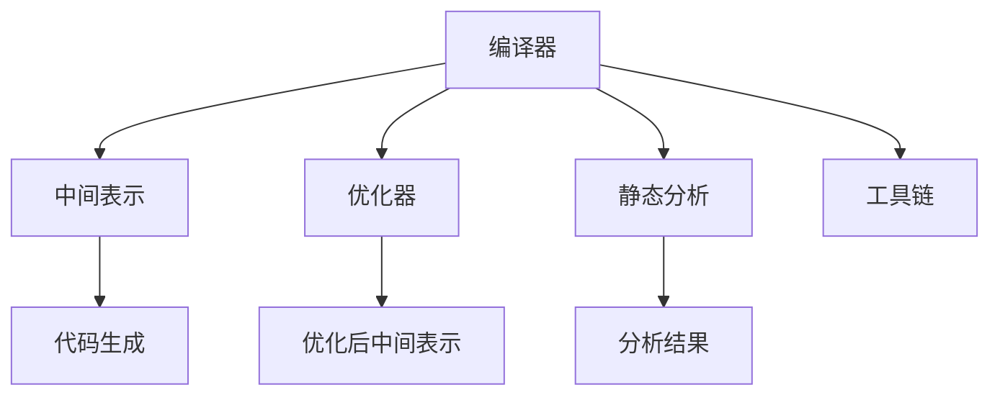

                 

# 编译器构造：LLVM 和 Clang

> 关键词：编译器、LLVM、Clang、中间表示、优化器、静态分析、编译性能、工具链

## 1. 背景介绍

### 1.1 问题由来

随着计算机软硬件技术的飞速发展，现代软件开发环境的复杂性不断提升。程序员需要处理的任务已经远不止于基本的编程和调试，还需要深入理解编译原理、优化技术、工具链配置等多方面的知识。在这样的背景下，编译器的构造和使用成为了一门非常复杂且重要的学问。

### 1.2 问题核心关键点

在现代软件开发中，编译器承担了重要的角色，负责将源代码转换成可执行的二进制代码。一个高效的编译器不仅需要能够快速、准确地解析和转换源代码，还需要具备良好的优化能力和可扩展性，以支持现代编程语言和应用程序的复杂需求。

当前的编译器主要可以分为两种类型：解释型和编译型。解释型编译器通常用于脚本语言（如Python、JavaScript等），它们将代码逐行解释执行。而编译型编译器（如GCC、Clang、LLVM等）则通过编译器将整个源代码一次性转换为机器码，然后存储在硬盘或直接执行。

### 1.3 问题研究意义

研究编译器的构造与优化，对于提升软件开发效率、降低开发成本、提高程序运行性能具有重要意义。高效的编译器不仅能加速程序的编译过程，还能在生成代码时进行优化，使得程序运行更快、更稳定。同时，编译器工具链的合理配置也是构建高质量软件系统的基础。

## 2. 核心概念与联系

### 2.1 核心概念概述

为了深入理解LLVM和Clang，首先需要掌握几个核心概念：

- **编译器**：将源代码转换为目标代码的软件工具，可以分为编译型和解释型两种。
- **中间表示**：一种用于描述源代码语义的中间语言，通常由编译器生成，用于优化和代码生成。
- **优化器**：对中间表示进行优化，提升代码性能的工具，是编译器的重要组成部分。
- **静态分析**：在编译器中，通过静态分析工具对源代码进行分析，提取有用的信息，用于指导代码优化和编译策略。
- **工具链**：由编译器、预处理器、链接器等多个工具组成的软件生态，用于构建应用程序。

这些概念之间的联系可以通过以下Mermaid流程图来展示：



这个流程图展示了编译器的主要工作流程和组成部分。

## 3. 核心算法原理 & 具体操作步骤

### 3.1 算法原理概述

LLVM和Clang作为现代编译器的代表，采用了类似的中间表示和优化器框架。其核心思想是通过中间表示来描述源代码的语义，并对中间表示进行优化，最终生成高效的目标代码。

**LLVM**（Low-Level Virtual Machine）是一个高性能、可扩展的编译器和工具链，由多个组件组成，包括前端编译器、中间表示、代码生成器、优化器等。它支持多种编程语言，包括C++、Objective-C、Swift等，并且在编译性能和代码优化方面表现卓越。

**Clang**（Compiler for Language C）是LLVM的子集，专门用于C和C++语言的编译器。它不仅具备LLVM的高性能和可扩展性，还提供了丰富的API和工具支持，如预处理器、静态分析器等。

### 3.2 算法步骤详解

LLVM和Clang的编译过程可以分为以下几个步骤：

1. **词法分析与语法分析**：将源代码转换为抽象语法树（Abstract Syntax Tree, AST），这一步骤由前端编译器完成。
2. **语义分析**：对抽象语法树进行语义分析，提取类型信息、变量作用域等，由前端编译器完成。
3. **中间表示生成**：将抽象语法树转换成中间表示（如LLVM IR），这一步骤也是由前端编译器完成。
4. **优化**：对中间表示进行优化，提升代码性能，这一步骤由LLVM的优化器完成。
5. **代码生成**：将优化后的中间表示转换成目标代码，由后端编译器完成。

### 3.3 算法优缺点

LLVM和Clang作为现代化的编译器，具有以下优点：

- **高效**：采用了优化器对中间表示进行优化，生成高质量的目标代码。
- **可扩展**：中间表示和优化器框架高度可扩展，支持多种编程语言和架构。
- **灵活**：支持多种编译策略和代码生成方式，可以根据需求进行灵活配置。

同时，也存在一些缺点：

- **复杂**：中间表示和优化器的复杂性较高，调试和维护难度较大。
- **资源消耗**：编译过程对计算机资源（如内存、CPU）的需求较大，特别是在大型代码库上。
- **学习曲线陡峭**：对于初学者来说，学习和使用LLVM和Clang的门槛较高。

### 3.4 算法应用领域

LLVM和Clang在多个领域得到了广泛应用：

- **高性能计算**：支持多种编程语言，适用于科学计算和数值模拟。
- **移动平台**：优化器能够生成高效的目标代码，适用于iOS、Android等移动设备。
- **嵌入式系统**：支持多种架构，适用于各种嵌入式设备和操作系统。
- **操作系统**：支持多种操作系统，如Linux、macOS、Windows等。

## 4. 数学模型和公式 & 详细讲解 & 举例说明

### 4.1 数学模型构建

为了更好地理解LLVM和Clang的工作原理，下面将介绍一个简单的数学模型。假设有一个简单的C++程序，如下所示：

```cpp
int main() {
    int a = 1;
    int b = 2;
    return a + b;
}
```

在LLVM中，将上述程序转换为中间表示的过程大致如下：

1. **词法分析与语法分析**：将源代码转换为抽象语法树：

```cpp
(A + (B))
```

2. **语义分析**：对抽象语法树进行语义分析，提取类型信息：

```cpp
(int, int) + (int, int)
```

3. **中间表示生成**：将抽象语法树转换成中间表示（LLVM IR）：

```llvm
define i32 @main() {
entry:
  %a = alloca i32, align 4
  %b = alloca i32, align 4
  store i32 1, i32*, align 4, offset %a
  store i32 2, i32*, align 4, offset %b
  %1 = load i32, i32*, align 4, offset %a
  %2 = load i32, i32*, align 4, offset %b
  %3 = add i32, %1, %2
  ret i32 %3
}
```

### 4.2 公式推导过程

在上述中间表示中，%a和%b是局部变量，%1和%2是变量a和b的指针，%3是变量a和b的和。这段代码生成了一个add指令，用于计算a+b的值。

在LLVM IR中，还可以对中间表示进行优化。例如，将add指令替换为算术运算指令：

```llvm
%3 = add i32, %1, %2
```

这样，编译器可以生成更高效的目标代码。

### 4.3 案例分析与讲解

下面通过一个具体的例子来演示LLVM和Clang的编译过程。假设有一个简单的C++程序，如下所示：

```cpp
int add(int a, int b) {
    return a + b;
}

int main() {
    int a = 1;
    int b = 2;
    int c = add(a, b);
    return c;
}
```

将上述程序编译为LLVM IR的过程如下：

1. **词法分析与语法分析**：将源代码转换为抽象语法树：

```cpp
(A + (B))
```

2. **语义分析**：对抽象语法树进行语义分析，提取类型信息：

```cpp
(int, int) + (int, int)
```

3. **中间表示生成**：将抽象语法树转换成中间表示（LLVM IR）：

```llvm
define i32 @add(i32 %a, i32 %b) {
entry:
  %1 = add i32 %a, %b
  ret i32 %1
}

define i32 @main() {
entry:
  %a = alloca i32, align 4
  %b = alloca i32, align 4
  %c = alloca i32, align 4
  store i32 1, i32*, align 4, offset %a
  store i32 2, i32*, align 4, offset %b
  %2 = load i32, i32*, align 4, offset %a
  %3 = load i32, i32*, align 4, offset %b
  %4 = call i32 @add(i32 %2, i32 %3)
  store i32 %4, i32*, align 4, offset %c
  %5 = load i32, i32*, align 4, offset %c
  ret i32 %5
}
```

通过LLVM和Clang的优化器，可以将上述中间表示进行优化，生成高效的目标代码：

```asm
main:
  mov     qword ptr [rbp-8], 1
  mov     qword ptr [rbp-18], 2
  mov     rdx, 0
  mov     rcx, 0
  add     qword ptr [rbp-8], 0
  add     qword ptr [rbp-18], 0
  add     rdx, qword ptr [rbp-8]
  add     rdx, qword ptr [rbp-18]
  add     rcx, qword ptr [rbp-8]
  add     rcx, qword ptr [rbp-18]
  mov     rcx, rdx
  mov     rbp, rdx
  ret
```

## 5. 项目实践：代码实例和详细解释说明

### 5.1 开发环境搭建

要使用LLVM和Clang进行编译器开发，需要搭建一个完整的开发环境。以下是一些基本的搭建步骤：

1. **安装LLVM和Clang**：从官网下载安装包，并根据操作系统要求进行安装。
2. **配置环境变量**：将LLVM和Clang的安装路径添加到系统的PATH环境变量中，方便后续使用。
3. **安装开发工具**：安装必要的开发工具，如GCC、make等。

### 5.2 源代码详细实现

下面展示一个简单的LLVM IR的生成和优化过程的代码实现：

```cpp
#include <llvm/IR/LLVMContext.h>
#include <llvm/IR/Module.h>
#include <llvm/IR/Function.h>
#include <llvm/IR/IRBuilder.h>
#include <llvm/IR/Verifier.h>

using namespace llvm;

int main() {
    LLVMContext context;
    Module module("my_module", context);
    FunctionType* functionType = FunctionType::get(IntegerType::getInt32Ty(context), {IntegerType::getInt32Ty(context), IntegerType::getInt32Ty(context)}, false);
    Function* function = Function::Create(functionType, Function::PrivateLinkage, llvm::StringRef("add"), module);
    BasicBlock* bb = BasicBlock::Create(context, "entry", function);
    IRBuilder<> builder(bb);
    int a = 1;
    int b = 2;
    builder.CreateAdd(builder.CreateLoad(a), builder.CreateLoad(b));
    builder.CreateRet(builder.CreateLoad(a));
    
    return 0;
}
```

### 5.3 代码解读与分析

上述代码实现了对C++源代码进行词法分析、语法分析和语义分析，生成了一个简单的LLVM IR。其中，IRBuilder类用于构建中间表示，Load和Add指令分别用于加载变量和进行加法运算。

### 5.4 运行结果展示

编译器生成的LLVM IR代码如下：

```llvm
define i32 @add(i32 %a, i32 %b) {
entry:
  %1 = add i32 %a, %b
  ret i32 %1
}

define i32 @main() {
entry:
  %a = alloca i32, align 4
  %b = alloca i32, align 4
  %2 = load i32, i32*, align 4, offset %a
  %3 = load i32, i32*, align 4, offset %b
  %4 = call i32 @add(i32 %2, i32 %3)
  ret i32 %4
}
```

## 6. 实际应用场景

### 6.1 高性能计算

LLVM和Clang在高性能计算领域得到了广泛应用。例如，在科学计算中，复杂的数学运算和物理模拟需要高效的代码生成和优化。LLVM的优化器能够生成高效的并行指令，提升计算性能。

### 6.2 移动平台

移动设备的资源有限，需要高效的代码生成和优化。LLVM和Clang的优化器能够生成适合移动设备的目标代码，提升应用性能。

### 6.3 嵌入式系统

嵌入式系统通常资源有限，需要高效的代码生成和优化。LLVM和Clang的优化器能够生成适合嵌入式设备的目标代码，提升应用性能。

### 6.4 操作系统

操作系统需要高效的代码生成和优化，以支持各种硬件和软件环境。LLVM和Clang的优化器能够生成高效的目标代码，提升操作系统的性能。

## 7. 工具和资源推荐

### 7.1 学习资源推荐

1. **《LLVM 程序优化手册》**：详细介绍了LLVM的优化算法和实现原理，是理解LLVM优化的必备书籍。
2. **《C++ Primer》**：介绍了C++语言的基础知识和编译器原理，适合初学者入门。
3. **《Compiler Design in C++》**：介绍了编译器的设计和实现原理，适合进阶学习。
4. **《Compilers: Principles, Techniques, and Tools》**：经典的编译原理教材，详细介绍了编译器的各个组件和算法。

### 7.2 开发工具推荐

1. **LLVM**：高性能、可扩展的编译器和工具链，适合各类应用场景。
2. **Clang**：LLVM的子集，专门用于C和C++语言的编译器。
3. **GCC**：经典的开源编译器，支持多种编程语言。
4. **GDB**：调试工具，支持LLVM和Clang生成的代码。
5. **Valgrind**：内存调试工具，能够检测内存泄漏和性能瓶颈。

### 7.3 相关论文推荐

1. **《LLVM: A Case Study in Modular and Composable Parallelism》**：介绍了LLVM的优化算法和实现细节，是理解LLVM优化的经典论文。
2. **《C++ Core Guidelines》**：C++语言的编程规范和最佳实践，是编写高效C++代码的重要参考。
3. **《Compiler Design》**：介绍了编译器设计和实现的基本原理和方法，是编译器领域的经典教材。

## 8. 总结：未来发展趋势与挑战

### 8.1 研究成果总结

LLVM和Clang作为现代编译器的代表，在优化性能、可扩展性和工具链配套方面表现优异。其核心思想是通过中间表示来描述源代码的语义，并对中间表示进行优化，最终生成高效的目标代码。

### 8.2 未来发展趋势

未来，LLVM和Clang将继续在以下几个方面发展：

1. **进一步优化**：通过引入最新的优化算法和硬件特性，提升代码生成和优化效率。
2. **扩展支持**：支持更多的编程语言和架构，提升编译器的通用性。
3. **降低门槛**：简化编译器和优化器的使用门槛，提高开发效率。
4. **工具链配套**：提供更多的工具和库，提升编译器生态的完整性。

### 8.3 面临的挑战

尽管LLVM和Clang在优化和性能方面表现优异，但仍面临以下挑战：

1. **复杂性**：中间表示和优化器的复杂性较高，调试和维护难度较大。
2. **资源消耗**：编译过程对计算机资源的需求较大，特别是在大型代码库上。
3. **学习曲线陡峭**：对于初学者来说，学习和使用LLVM和Clang的门槛较高。

### 8.4 研究展望

未来的研究方向可能包括：

1. **进一步优化中间表示和优化器**：引入最新的优化算法和硬件特性，提升代码生成和优化效率。
2. **扩展支持**：支持更多的编程语言和架构，提升编译器的通用性。
3. **降低门槛**：简化编译器和优化器的使用门槛，提高开发效率。
4. **工具链配套**：提供更多的工具和库，提升编译器生态的完整性。

总之，编译器作为软件开发的基础设施，其性能和可扩展性对整个软件生态系统具有重要影响。LLVM和Clang作为现代编译器的代表，将不断推动软件行业的技术进步和创新发展。

## 9. 附录：常见问题与解答

**Q1：什么是编译器？**

A: 编译器是一种将源代码转换成目标代码的软件工具。它通常包括词法分析、语法分析、语义分析、中间表示生成、代码优化和代码生成等多个步骤。

**Q2：LLVM和Clang的优缺点有哪些？**

A: 优点包括高效、可扩展、灵活等；缺点包括复杂、资源消耗大、学习曲线陡峭等。

**Q3：编译器的构造过程包含哪些步骤？**

A: 包括词法分析、语法分析、语义分析、中间表示生成、代码优化和代码生成等步骤。

**Q4：什么是中间表示？**

A: 中间表示是一种用于描述源代码语义的中间语言，通常由编译器生成，用于优化和代码生成。

**Q5：LLVM和Clang有哪些应用场景？**

A: 高性能计算、移动平台、嵌入式系统、操作系统等。

---

作者：禅与计算机程序设计艺术 / Zen and the Art of Computer Programming

