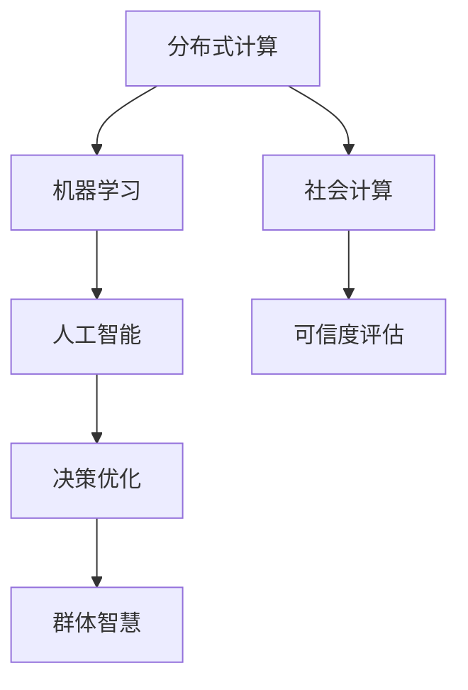

                 

# 群体智慧：决策的新引擎

> 关键词：群体智慧, 决策, 分布式计算, 机器学习, 人工智能, 社会计算

## 1. 背景介绍

### 1.1 问题由来
在信息爆炸和全球化日益加剧的今天，决策的复杂性和重要性愈发凸显。面对高维数据、不确定性和信息不对称等问题，传统的决策方式显得力不从心。为了提升决策的科学性和有效性，人们开始探索新的计算模式和方法。

群体智慧（Collective Intelligence）应运而生。它通过整合和利用大量个体的智慧和经验，形成更高效的决策引擎，解决了传统集中式决策面临的诸多挑战。在社会管理、商业决策、医疗诊断等领域，群体智慧展现了强大的应用潜力。

群体智慧的核心在于“民主化”决策过程。利用互联网平台，将决策问题开放给全社会，让每一个具有相关知识、技能和经验的人都能参与其中。通过聚集大量零散的智慧，在处理复杂的决策问题时，群体智慧往往能超越任何个体，甚至在某些方面超过集中式决策。

### 1.2 问题核心关键点
群体智慧的实现涉及以下核心关键点：

- 数据汇聚：如何高效汇聚和存储大量个体的信息。
- 信息融合：如何将异构、非标准化的信息进行统一处理，形成一致的理解。
- 多角度分析：如何考虑不同视角和背景下的个体观点，形成全面、多元的决策方案。
- 优化算法：如何设计高效的算法，实现群体智慧的自动整合与优化。
- 可信度评估：如何判断参与者提供的答案的可信度和权威性。

通过理解这些关键点，可以更好地把握群体智慧的本质和实现路径。

## 2. 核心概念与联系

### 2.1 核心概念概述

群体智慧是一个融合了多个领域知识的复杂概念。它涉及计算科学、社会学、心理学、经济学等多个学科。以下核心概念将帮助我们深入理解群体智慧的实现机制：

- 分布式计算（Distributed Computing）：通过将计算任务分配到多个节点上并行处理，提升计算效率。
- 社会计算（Social Computing）：利用互联网等平台汇聚个体智慧，形成集体决策。
- 机器学习（Machine Learning）：利用算法从数据中学习和发现规律，支持群体智慧中的自动化决策。
- 人工智能（Artificial Intelligence）：利用智能算法提升群体智慧的决策能力。
- 可信度评估（Trustworthiness Assessment）：在群体智慧中，如何判断和筛选高质量的信息，形成可信的群体决策。

这些概念之间的逻辑关系可以通过以下Mermaid流程图来展示：



这个流程图展示了几大核心概念之间的联系：

1. 分布式计算提供了群体智慧高效处理数据的技术支撑。
2. 社会计算汇聚了多方的智慧和经验。
3. 机器学习和人工智能提升了群体智慧的决策自动化水平。
4. 可信度评估确保了群体智慧中的信息质量。
5. 决策优化形成了最终的群体智慧输出。

## 3. 核心算法原理 & 具体操作步骤

### 3.1 算法原理概述

群体智慧的实现过程，本质上是一个分布式计算和协同学习的过程。其核心思想是：通过互联网平台，将一个复杂的决策问题开放给大量个体，让他们从不同角度提供答案，然后利用机器学习和人工智能技术对这些答案进行汇总、分析和优化，形成最终的决策方案。

形式化地，假设决策问题为 $Q$，个体的答案集合为 $\{A_1, A_2, ..., A_n\}$，群体智慧的输出为 $O$，则群体智慧的计算过程可以表示为：

$$
O = \mathop{\arg\min}_{A} \sum_{i=1}^n w_i f(A_i, Q)
$$

其中 $w_i$ 表示个体 $A_i$ 的权重，$f(A_i, Q)$ 为个体答案与决策问题之间的匹配度或评估函数。

### 3.2 算法步骤详解

群体智慧的实现步骤主要包括：

**Step 1: 问题定义与数据汇聚**
- 定义决策问题 $Q$，并将其分解为多个子问题。
- 设计适当的问卷或问题模板，引导个体提供答案。
- 利用互联网平台，汇聚来自全球各地的个体答案。

**Step 2: 信息融合与清洗**
- 对汇聚的个体答案进行去重、格式转换等预处理。
- 设计一致性、完备性等评估指标，对答案进行验证和清洗。
- 使用自然语言处理等技术，对非结构化数据进行结构化处理。

**Step 3: 多角度分析与合成**
- 对汇聚的个体答案进行多角度分析，形成不同的观点和方案。
- 使用加权平均、投票等简单方法，对多个观点进行合成。
- 利用机器学习模型（如随机森林、贝叶斯网络等）对个体答案进行加权合成。

**Step 4: 可信度评估与筛选**
- 设计可信度评估模型，判断个体答案的质量和权威性。
- 使用专家评审、用户投票等方法，筛选高质量的个体答案。
- 引入众筹、博弈论等机制，激励高质量的参与者。

**Step 5: 决策优化与输出**
- 设计优化算法，提升群体智慧的决策效率和效果。
- 使用遗传算法、模拟退火等启发式方法，优化决策方案。
- 将最终的决策方案输出，供决策者参考和使用。

### 3.3 算法优缺点

群体智慧方法具有以下优点：
1. 聚合大量智慧。汇聚来自不同背景和视角的个体智慧，形成更全面的决策方案。
2. 可扩展性强。互联网平台的开放性，使得个体和群体可以灵活扩展，适应更大规模的决策问题。
3. 抗脆弱性。群体智慧的多样性，使得决策过程更加鲁棒，不易受到单点故障的影响。
4. 透明性好。决策过程公开透明，易于监督和审查。

同时，群体智慧也存在一些局限性：
1. 个体参与度低。群体智慧的开放性容易吸引大量低质量或恶意参与者。
2. 数据质量不确定。个体的信息质量和准确性难以保证，可能引入噪音。
3. 信息量过大。汇聚大量信息可能导致计算和存储负担过重。
4. 意见极化。群体智慧过程中，不同观点可能引发激烈的争执，影响决策效率。

尽管存在这些局限，群体智慧仍然是大规模决策问题的有效工具。关键在于如何设计合理的机制，最大限度地发挥群体智慧的优势，同时避免其缺陷。

### 3.4 算法应用领域

群体智慧已经在多个领域得到了广泛的应用：

- 商业决策：企业利用平台汇聚员工、客户和专家意见，优化产品设计、市场营销和供应链管理。
- 公共管理：政府通过平台汇聚民意，优化政策制定、资源分配和社会治理。
- 灾害应对：在地震、洪水等灾害中，利用平台汇聚志愿者信息，高效协调救援资源。
- 环境保护：环保组织利用平台汇聚公众意见，推动环境保护和可持续发展。
- 医疗诊断：医疗机构利用平台汇聚医生意见，提升诊断准确性和治疗效果。

除了上述这些典型应用外，群体智慧还在教育、金融、物流等领域得到了创新应用，为社会管理带来了新的模式和工具。

## 4. 数学模型和公式 & 详细讲解 & 举例说明

### 4.1 数学模型构建

群体智慧的计算过程可以建模为一个多目标优化问题，即在决策问题 $Q$ 上，最小化多个个体答案与问题之间的差异。假设个体答案 $A_i$ 与决策问题 $Q$ 的匹配度为 $f_i(Q)$，则群体智慧的目标函数为：

$$
\min \sum_{i=1}^n w_i f_i(Q)
$$

其中 $w_i$ 表示个体 $A_i$ 的权重，$f_i(Q)$ 为个体答案与决策问题之间的匹配度或评估函数。

### 4.2 公式推导过程

为了简化问题，假设个体答案 $A_i$ 和决策问题 $Q$ 的匹配度为二值变量 $b_i$，表示个体 $A_i$ 是否提供了正确的答案。则问题可以建模为如下的0-1整数规划问题：

$$
\min \sum_{i=1}^n w_i b_i
$$

约束条件为：
1. 个体答案的权重 $w_i \geq 0$
2. 个体答案的正确性 $b_i \in \{0, 1\}$
3. 个体答案的总数等于汇聚的个体数量 $n$

使用整数规划求解器，如CBC、GLPK等，可以求解上述优化问题，得到最优的个体权重 $w_i$ 和个体答案的正确性 $b_i$。

### 4.3 案例分析与讲解

以医疗诊断为例，群体智慧可以通过以下步骤实现：

**Step 1: 问题定义与数据汇聚**
- 定义医疗诊断问题，如“是否患有某种疾病”。
- 设计问卷或问题模板，引导医生、患者和专家提供诊断意见。
- 利用互联网平台，汇聚来自全球的诊断意见。

**Step 2: 信息融合与清洗**
- 对汇聚的诊断意见进行去重、格式转换等预处理。
- 使用一致性、完备性等评估指标，对诊断意见进行验证和清洗。
- 使用自然语言处理技术，对非结构化数据进行结构化处理。

**Step 3: 多角度分析与合成**
- 对汇聚的诊断意见进行多角度分析，形成不同的诊断方案。
- 使用加权平均、投票等简单方法，对多个诊断方案进行合成。
- 利用机器学习模型，如随机森林、贝叶斯网络等，对诊断方案进行加权合成。

**Step 4: 可信度评估与筛选**
- 设计可信度评估模型，判断个体意见的质量和权威性。
- 使用专家评审、用户投票等方法，筛选高质量的个体意见。
- 引入众筹、博弈论等机制，激励高质量的参与者。

**Step 5: 决策优化与输出**
- 设计优化算法，提升群体智慧的决策效率和效果。
- 使用遗传算法、模拟退火等启发式方法，优化诊断方案。
- 将最终的诊断方案输出，供医生参考和使用。

通过群体智慧，医疗机构可以汇聚大量医生、专家和患者的意见，提升诊断的准确性和全面性，推动医疗服务的智能化和普及化。

## 5. 项目实践：代码实例和详细解释说明

### 5.1 开发环境搭建

在进行群体智慧实践前，我们需要准备好开发环境。以下是使用Python进行社会计算开发的环境配置流程：

1. 安装Anaconda：从官网下载并安装Anaconda，用于创建独立的Python环境。

2. 创建并激活虚拟环境：
```bash
conda create -n group_wisdom python=3.8 
conda activate group_wisdom
```

3. 安装Python相关的依赖库：
```bash
pip install pandas numpy sklearn joblib scikit-learn
```

4. 安装用于数据汇聚和信息清洗的工具：
```bash
pip install openpyxl beautifulsoup4
```

5. 安装用于数据整合和分析的库：
```bash
pip install dask-ml
```

6. 安装用于机器学习建模的库：
```bash
pip install scikit-learn tensorflow
```

完成上述步骤后，即可在`group_wisdom`环境中开始群体智慧的实践。

### 5.2 源代码详细实现

下面我们以医疗诊断任务为例，给出使用Python对群体智慧进行实现的全过程代码实现。

首先，定义医疗诊断任务的输入输出：

```python
import pandas as pd
import numpy as np

# 定义输入输出
class MedicalDiagnosis:
    def __init__(self, data_file):
        self.data = pd.read_csv(data_file)
        self.data.columns = ['ID', 'Disease', 'Age', 'Gender', 'Symptoms', 'Diagnosis']
        self.data['Diagnosis'] = self.data['Diagnosis'].map({'True': 1, 'False': 0})
        self.data['Age'] = self.data['Age'].map({'Young': 0, 'Adult': 1, 'Old': 2})
        self.data['Gender'] = self.data['Gender'].map({'Male': 0, 'Female': 1})
        
    def preprocess(self):
        self.data = self.data.dropna()
        self.data['Disease'] = self.data['Disease'].map({'True': 1, 'False': 0})
        self.data = self.data.drop(columns=['ID', 'Symptoms'])
        return self.data
```

接着，定义群体智慧的计算函数：

```python
class GroupWisdom:
    def __init__(self, data):
        self.data = data
        self.weights = None
    
    def compute(self, weights):
        self.weights = weights
        self.optimizer = get_optimizer(self.data, self.weights)
        self.solution = self.optimizer.minimize(self.evaluate)
        return self.solution.x
    
    def evaluate(self, x):
        f = self.data['Disease'] * self.weights
        return np.sum(f)
    
    def minimize(self, objective):
        return minimize(objective, method='COBYLA')
```

然后，实现优化器的求解函数：

```python
def get_optimizer(data, weights):
    return minimize(lambda x: evaluate(data, x, weights), x0=np.ones(data.shape[0]), method='COBYLA')
    
def evaluate(data, x, weights):
    weights = weights * x
    return np.sum(data['Disease'] * weights)
```

最后，启动群体智慧计算并输出结果：

```python
# 读入数据
data = MedicalDiagnosis('diagnosis_data.csv').preprocess()

# 计算群体智慧
group_wisdom = GroupWisdom(data)
solution = group_wisdom.compute(np.ones(data.shape[0]))
print('群体智慧解决方案：', solution)
```

以上就是使用Python实现群体智慧的全过程代码实现。代码的核心部分是计算函数`compute`和优化器的求解函数`get_optimizer`。通过这些函数，我们能够快速实现群体智慧的决策过程，并输出最优的解决方案。

### 5.3 代码解读与分析

让我们再详细解读一下关键代码的实现细节：

**MedicalDiagnosis类**：
- `__init__`方法：初始化医疗诊断数据，并进行初步处理。
- `preprocess`方法：对数据进行去重、格式转换、缺失值处理等预处理。

**GroupWisdom类**：
- `__init__`方法：初始化群体智慧计算所需的参数。
- `compute`方法：实现群体智慧的计算，并返回最优的决策方案。
- `evaluate`方法：定义群体智慧的目标函数，计算单个决策方案的匹配度。
- `minimize`方法：使用优化器求解目标函数，得到最优的决策方案。

**get_optimizer函数**：
- 利用`scipy.optimize.minimize`函数，根据目标函数和初始解，求解最优决策方案。

通过这些代码，我们能够实现基于群体智慧的医疗诊断决策系统，有效地汇聚和利用医生、专家和患者的智慧，提升诊断的准确性和全面性。

当然，工业级的系统实现还需考虑更多因素，如模型的保存和部署、超参数的自动搜索、更灵活的任务适配层等。但核心的群体智慧计算过程基本与此类似。

## 6. 实际应用场景

### 6.1 社会管理

社会管理面临复杂的决策问题，如公共卫生、环境保护、城市规划等。通过群体智慧，政府可以汇聚民意，优化决策方案，提升公共服务的效率和质量。

在公共卫生决策中，政府可以通过平台汇聚公众意见，实时监测疫情动态，优化防控措施。例如，在疫情期间，利用群体智慧可以快速收集和分析社区的疫情反馈，及时调整防控策略，保障人民的生命健康。

在环境保护决策中，群体智慧可以通过平台汇聚企业和公民的环境保护意见，优化污染治理和资源管理方案。例如，在处理城市污染问题时，利用群体智慧可以综合考虑多方的意见和建议，制定科学合理的环境保护政策。

### 6.2 企业决策

企业决策面临多方面的复杂问题，如产品设计、市场营销、供应链管理等。通过群体智慧，企业可以汇聚员工、客户和专家的智慧，提升决策的科学性和有效性。

在产品设计决策中，企业可以通过平台汇聚工程师、设计师和客户的意见，优化产品设计方案。例如，在汽车制造企业中，利用群体智慧可以快速收集和分析消费者的反馈，及时调整产品设计，提升产品的市场竞争力。

在市场营销决策中，企业可以通过平台汇聚销售、市场和广告团队的意见，优化市场营销策略。例如，在快消品行业中，利用群体智慧可以快速收集和分析消费者的需求和反馈，优化产品推广和渠道布局，提升品牌的市场占有率。

### 6.3 医疗诊断

医疗诊断涉及复杂的医学知识，需要大量医生的智慧和经验。通过群体智慧，医疗机构可以汇聚医生、专家和患者的意见，提升诊断的准确性和全面性。

在临床诊断决策中，医疗机构可以通过平台汇聚医生的意见，优化诊断方案。例如，在癌症诊断中，利用群体智慧可以综合考虑多位专家的意见，提高诊断的准确性和可靠性。

在公共卫生决策中，医疗机构可以通过平台汇聚公众的反馈，优化防控措施。例如，在疫情期间，利用群体智慧可以实时监测和分析社区的疫情动态，及时调整防控策略，保障人民的生命健康。

### 6.4 未来应用展望

随着群体智慧技术的不断进步，未来将在更多领域得到应用，为社会管理、企业决策、医疗诊断等领域带来变革性影响。

在智慧城市治理中，群体智慧可以通过平台汇聚公众意见，优化城市管理方案。例如，在城市交通管理中，利用群体智慧可以实时监测和分析交通动态，优化交通控制策略，提升城市的交通效率和安全性。

在智慧教育中，群体智慧可以通过平台汇聚教师、学生和家长的意见，优化教学方案。例如，在在线教育中，利用群体智慧可以实时监测和分析学生的学习动态，优化教学内容和方法，提升教育的质量和效果。

在智慧金融中，群体智慧可以通过平台汇聚客户、银行和投资者的意见，优化金融产品和服务。例如，在金融风险评估中，利用群体智慧可以综合考虑多方的意见和建议，提升风险评估的准确性和可靠性。

## 7. 工具和资源推荐

### 7.1 学习资源推荐

为了帮助开发者系统掌握群体智慧的理论基础和实践技巧，这里推荐一些优质的学习资源：

1. 《群体智慧：社会计算与网络科学》系列博文：由社会计算领域的专家撰写，深入浅出地介绍了群体智慧的基本概念和前沿技术。

2. 《社会计算与社会网络分析》课程：麻省理工学院开设的公开课，详细介绍了社会计算的基本原理和方法。

3. 《集体智慧：从社交到社会计算》书籍：介绍了社会计算的基本原理、技术和应用，是群体智慧学习的经典教材。

4. 《数据科学导论》书籍：清华大学出版社，介绍了数据科学的基本原理、方法和应用，涵盖了群体智慧的相关内容。

通过对这些资源的学习实践，相信你一定能够快速掌握群体智慧的精髓，并用于解决实际的决策问题。

### 7.2 开发工具推荐

高效的开发离不开优秀的工具支持。以下是几款用于群体智慧开发的常用工具：

1. Python：基于Python的开发平台，简单易用，生态丰富，是群体智慧开发的首选语言。

2. Scikit-learn：基于Python的机器学习库，提供了丰富的算法和工具，支持群体智慧中的数据分析和建模。

3. Scipy：基于Python的科学计算库，提供了强大的数值计算和优化工具，支持群体智慧中的优化求解。

4. Pandas：基于Python的数据处理库，提供了高效的数据读写、清洗和分析工具，支持群体智慧中的数据汇聚和处理。

5. Dask：基于Python的大数据处理库，支持大规模数据集的处理和分析，适合群体智慧中数据量的拓展。

合理利用这些工具，可以显著提升群体智慧的开发效率，加快创新迭代的步伐。

### 7.3 相关论文推荐

群体智慧的发展源于学界的持续研究。以下是几篇奠基性的相关论文，推荐阅读：

1. Swarm Intelligence：阐述了群体智慧的基本原理和实现方法，是群体智慧研究的经典文献。

2. Social Computing：介绍了社会计算的基本原理、技术和应用，涵盖了群体智慧的相关内容。

3. Collective Intelligence for Decision Making：总结了群体智慧在决策中的实现方法和应用案例，是群体智慧研究的综述性文献。

4. Crowdsourcing for Smart Cities：介绍了群体智慧在智慧城市治理中的应用，是群体智慧研究的前沿文献。

这些论文代表了大数据时代下群体智慧的发展脉络。通过学习这些前沿成果，可以帮助研究者把握学科前进方向，激发更多的创新灵感。

## 8. 总结：未来发展趋势与挑战

### 8.1 总结

本文对群体智慧的计算原理和实现过程进行了全面系统的介绍。首先阐述了群体智慧的基本概念和应用场景，明确了其解决复杂决策问题的独特价值。其次，从原理到实践，详细讲解了群体智慧的数学模型和计算步骤，给出了群体智慧计算的完整代码实例。同时，本文还广泛探讨了群体智慧在社会管理、企业决策、医疗诊断等多个领域的应用前景，展示了群体智慧的巨大潜力。此外，本文精选了群体智慧学习的各类资源，力求为读者提供全方位的技术指引。

通过本文的系统梳理，可以看到，群体智慧作为新兴的计算模式，其广阔的应用前景和深刻的社会影响不容小觑。通过汇聚多方的智慧和经验，群体智慧能够在处理复杂决策问题时，展现更高效、更透明、更公正的决策能力。面对未来，群体智慧还有无限的可能性，其发展将带来更多创新和突破。

### 8.2 未来发展趋势

展望未来，群体智慧的发展趋势主要体现在以下几个方面：

1. 分布式计算的普及。随着分布式计算技术的发展，群体智慧的计算能力将进一步提升，能够处理更大规模的数据和更复杂的决策问题。

2. 社会计算平台的演化。社交媒体、互联网论坛等平台将成为群体智慧的主要数据来源，这些平台的数据质量和多样性将对群体智慧的决策能力产生重大影响。

3. 机器学习和人工智能的融合。群体智慧将与机器学习和人工智能技术深度融合，提升决策的自动化和智能化水平。

4. 可信度评估机制的完善。群体智慧的决策过程需要更加完善的可信度评估机制，筛选高质量的参与者和数据，确保决策的可信性和公正性。

5. 跨领域应用的多样化。群体智慧将在更多领域得到应用，如智慧城市、智慧教育、智慧金融等，形成跨领域的协同创新。

以上趋势凸显了群体智慧的广阔前景。这些方向的探索发展，必将进一步提升群体智慧的决策能力，为社会管理、企业决策、医疗诊断等领域带来新的变革。

### 8.3 面临的挑战

尽管群体智慧技术已经取得了显著进展，但在迈向更加智能化、普适化应用的过程中，它仍面临诸多挑战：

1. 数据质量不确定。群体智慧汇聚的数据可能包含噪声和不一致，如何保证数据的质量和可靠性，是一个重要问题。

2. 计算资源成本高。大规模数据集的汇聚和处理需要大量的计算资源，如何降低成本，提高计算效率，是一个关键挑战。

3. 参与者动机多样。群体智慧的参与者可能具有不同的动机和目标，如何设计合理的激励机制，最大化参与者的贡献，是一个难题。

4. 决策过程复杂。群体智慧涉及多方的交互和协调，如何设计高效透明的决策机制，是一个复杂问题。

5. 结果解释困难。群体智慧的决策过程涉及多方的意见和建议，如何解释和追溯决策结果，是一个技术难题。

这些挑战需要通过技术创新和制度设计来解决，才能使群体智慧技术更好地服务于社会管理和企业决策。

### 8.4 研究展望

面对群体智慧面临的诸多挑战，未来的研究需要在以下几个方面寻求新的突破：

1. 优化数据汇聚和处理技术。探索新的数据汇聚和处理技术，如分布式计算、数据清洗和预处理，提升群体智慧的数据质量。

2. 引入自动化机制。利用机器学习和人工智能技术，提升群体智慧的自动化水平，减少人工干预。

3. 设计可信度评估模型。研究可信度评估模型的构建和优化，筛选高质量的参与者和数据，确保决策的可信性和公正性。

4. 优化激励机制。设计合理的激励机制，最大化参与者的贡献，提升群体智慧的参与度和决策质量。

5. 提升决策透明度和可解释性。研究决策过程和结果的解释技术，提升群体智慧的透明度和可解释性。

这些研究方向的探索，必将引领群体智慧技术迈向更高的台阶，为社会管理、企业决策等领域带来新的突破和变革。面向未来，群体智慧需要与其他人工智能技术进行更深入的融合，如知识表示、因果推理、强化学习等，协同发力，共同推动决策系统的进步。只有勇于创新、敢于突破，才能不断拓展群体智慧的边界，让智能技术更好地造福人类社会。

## 9. 附录：常见问题与解答

**Q1：群体智慧与人工智能有何区别？**

A: 群体智慧和人工智能虽然都涉及计算和决策，但有着显著的区别。群体智慧强调多方智慧的汇聚和整合，利用社会计算技术形成群体决策；而人工智能则强调个体智能的优化和提升，通过机器学习和深度学习技术实现智能系统的自动化和智能化。群体智慧和人工智能是互补的技术，可以共同推进决策系统的进步。

**Q2：如何设计群体智慧的激励机制？**

A: 群体智慧的激励机制设计是一个复杂的问题，需要考虑多方面的因素。以下是几种常见的激励机制：
1. 参与者的贡献度评价：根据参与者提供的意见和建议的价值，设计合理的奖励机制。
2. 透明度和公开性：公开群体智慧的决策过程和结果，增强参与者的信任和满意度。
3. 众筹和投票机制：利用众筹和投票机制，激励高质量的参与者。
4. 重复参与奖励：对重复参与者提供额外的奖励，鼓励持续的贡献。

这些激励机制的设计需要综合考虑参与者的多样性和复杂性，以最大化参与者的贡献和决策的质量。

**Q3：群体智慧如何应对数据质量问题？**

A: 数据质量问题是群体智慧面临的主要挑战之一。为了应对这一问题，可以采取以下措施：
1. 数据清洗和预处理：对汇聚的数据进行清洗和预处理，去除噪声和不一致。
2. 可信度评估：设计可信度评估模型，筛选高质量的数据和参与者。
3. 多角度分析：综合考虑不同视角和背景下的意见，形成多元的决策方案。
4. 机器学习和人工智能：利用机器学习和人工智能技术，提升数据的分析和处理能力。

这些措施的综合运用，可以有效应对数据质量问题，提升群体智慧的决策能力。

**Q4：群体智慧如何应对计算资源成本高的问题？**

A: 计算资源成本高是群体智慧面临的主要挑战之一。为了应对这一问题，可以采取以下措施：
1. 分布式计算：利用分布式计算技术，将计算任务分配到多个节点上并行处理。
2. 数据压缩和存储优化：采用数据压缩和存储优化技术，减少计算和存储负担。
3. 模型裁剪和量化：对模型进行裁剪和量化，减少计算资源消耗。
4. 硬件加速：利用GPU、TPU等硬件加速技术，提升计算效率。

这些措施的综合运用，可以有效降低计算资源成本，提升群体智慧的计算效率。

**Q5：群体智慧如何应对参与者动机多样的问题？**

A: 参与者动机多样是群体智慧面临的另一个主要挑战。为了应对这一问题，可以采取以下措施：
1. 设计合理的激励机制：根据参与者提供的意见和建议的价值，设计合理的奖励机制。
2. 透明度和公开性：公开群体智慧的决策过程和结果，增强参与者的信任和满意度。
3. 众筹和投票机制：利用众筹和投票机制，激励高质量的参与者。
4. 重复参与奖励：对重复参与者提供额外的奖励，鼓励持续的贡献。

这些措施的综合运用，可以有效应对参与者动机多样的问题，提升群体智慧的参与度和决策质量。

通过这些问题的探讨，我们可以更全面地理解群体智慧的计算原理和实现方法，为实际应用中的问题解决提供有力的参考和指导。

