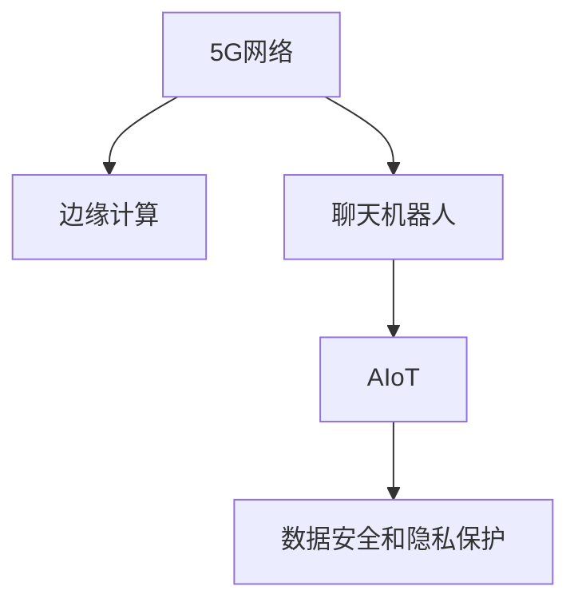

                 

# 聊天机器人5G 和边缘计算：高速和低延迟

## 1. 背景介绍

### 1.1 问题由来

近年来，随着5G和边缘计算技术的迅猛发展，聊天机器人的应用场景日益丰富，从传统的客户服务到新兴的智能家居、远程医疗、自动驾驶等领域，聊天机器人的应用已经深入到人们生活的方方面面。然而，聊天机器人系统中的信息传输和处理效率瓶颈始终存在，尤其是当数据量庞大、实时性要求高时，聊天机器人系统的性能往往受限。

本文将聚焦于5G和边缘计算技术如何提升聊天机器人的性能，特别是在高速和低延迟方面。首先介绍5G和边缘计算的核心概念和优势，然后探讨如何结合这些技术来优化聊天机器人系统的设计，包括数据传输、处理速度、延迟和安全性等方面的改进。

### 1.2 问题核心关键点

聊天机器人系统的主要挑战在于如何平衡数据传输效率、处理速度、延迟和安全性，以提供高质量、稳定的服务。通过引入5G和边缘计算技术，聊天机器人可以在高带宽、低延迟的环境中运行，从而提升用户体验和系统性能。

5G和边缘计算的核心优势在于：
- **高速传输**：5G网络提供更高的传输速度和更低的延迟，能够满足实时数据传输和处理的需求。
- **低延迟**：边缘计算将数据处理移至网络边缘，减少了数据传输的距离和延迟，提升了聊天机器人响应的实时性。
- **高可靠性**：两者相结合，能够在确保数据传输和处理效率的同时，提升系统的整体可靠性和鲁棒性。

## 2. 核心概念与联系

### 2.1 核心概念概述

为更好地理解5G和边缘计算在聊天机器人中的应用，本节将介绍几个密切相关的核心概念：

- **5G网络**：指第五代移动通信技术，提供更高的带宽、更低的延迟和更大的连接密度，支持大规模物联网设备的数据传输。
- **边缘计算**：指将数据处理和存储资源部署在网络边缘的计算节点上，靠近用户设备，减少数据传输距离，提升系统响应速度和可靠性。
- **聊天机器人**：指使用自然语言处理技术，能够与用户进行自然语言交互，提供信息检索、问题解答、情感支持等服务的人工智能应用。
- **AIoT**：指人工智能与物联网的结合，利用5G和边缘计算技术，为聊天机器人等AI应用提供高效、可靠的基础设施支持。
- **数据安全和隐私保护**：指在聊天机器人系统中，确保用户数据的安全性和隐私保护，防止数据泄露和滥用。

这些核心概念之间的逻辑关系可以通过以下Mermaid流程图来展示：



这个流程图展示了点对点的逻辑关系：

1. 5G网络提供高速和低延迟的数据传输。
2. 边缘计算在网络边缘进行数据处理，减少延迟。
3. 聊天机器人基于上述基础设施，提供高效的用户交互服务。
4. 数据安全和隐私保护是整个系统的保障。

## 3. 核心算法原理 & 具体操作步骤

### 3.1 算法原理概述

聊天机器人系统中的数据传输和处理效率，可以通过5G网络和边缘计算技术来提升。具体而言，5G网络提供的高带宽和低延迟能够确保实时数据传输，而边缘计算则将数据处理移至网络边缘，减少了数据传输距离和延迟，提升了聊天机器人的响应速度和系统可靠性。

### 3.2 算法步骤详解

聊天机器人结合5G和边缘计算的优化过程主要包括以下几个关键步骤：

**Step 1: 5G网络和边缘计算环境搭建**
- 部署5G基站，实现覆盖区域的网络连接。
- 在网络边缘部署边缘计算节点，如边缘服务器、路由器等。

**Step 2: 聊天机器人系统设计**
- 选择适合的聊天机器人框架，如Dialogflow、Rasa等。
- 设计聊天机器人系统架构，包括前端界面、后端服务和数据存储。
- 集成聊天机器人与5G网络和边缘计算环境。

**Step 3: 数据传输和处理优化**
- 采用5G网络进行实时数据传输，确保高效和低延迟。
- 在边缘计算节点上部署聊天机器人后端服务，进行数据处理和存储。
- 优化数据处理算法，减少计算时间。

**Step 4: 系统测试和优化**
- 对聊天机器人系统进行全面测试，评估系统性能。
- 根据测试结果，优化聊天机器人架构和算法。
- 部署优化后的系统，进行实际应用。

### 3.3 算法优缺点

结合5G和边缘计算的聊天机器人系统，具有以下优点：
1. 高速传输：5G网络提供的高速数据传输能力，确保了聊天机器人系统的实时性和数据处理效率。
2. 低延迟：边缘计算减少了数据传输的距离和延迟，提升了聊天机器人的响应速度。
3. 高可靠性：两者结合，提高了系统的整体可靠性和鲁棒性，减少因网络波动导致的系统故障。
4. 可扩展性：5G和边缘计算技术可以灵活扩展，满足不同规模和场景下的聊天机器人需求。

同时，该方法也存在一些局限性：
1. 设备成本高：5G网络和边缘计算设备的部署和维护成本较高。
2. 技术复杂度：系统设计和优化需要较高的技术门槛，特别是在网络配置和数据处理方面。
3. 数据隐私问题：数据在网络传输和存储过程中可能面临隐私泄露的风险。

尽管存在这些局限性，但通过合理的技术应用和管理策略，可以有效地平衡成本与性能，确保聊天机器人系统的稳定运行。

### 3.4 算法应用领域

结合5G和边缘计算的聊天机器人系统，在多个领域中具有广泛的应用前景：

- **客户服务**：提供实时、个性化的客户支持，提升客户满意度。
- **智能家居**：通过语音助手与家居设备进行互动，提供智能化家居解决方案。
- **远程医疗**：与患者进行实时沟通，提供医疗咨询和健康管理服务。
- **自动驾驶**：在车联网环境中，通过与车辆的实时互动，提供导航和决策支持。
- **智慧城市**：与城市管理和服务设施互动，提供交通、环境监测等服务。

## 4. 数学模型和公式 & 详细讲解 & 举例说明

### 4.1 数学模型构建

本节将使用数学语言对聊天机器人系统在5G和边缘计算环境下的性能进行更加严格的刻画。

设聊天机器人系统中的实时数据传输速率为 $R_{\text{data}}$，处理延迟为 $\Delta_{\text{process}}$，网络延迟为 $\Delta_{\text{network}}$，则聊天机器人系统的响应时间 $T_{\text{response}}$ 可表示为：

$$
T_{\text{response}} = \Delta_{\text{process}} + \Delta_{\text{network}}
$$

其中，处理延迟 $\Delta_{\text{process}}$ 和网络延迟 $\Delta_{\text{network}}$ 可以进一步分解为：

$$
\Delta_{\text{process}} = \Delta_{\text{cpu}} + \Delta_{\text{memory}}
$$

$$
\Delta_{\text{network}} = \Delta_{\text{transmit}} + \Delta_{\text{propagate}}
$$

其中 $\Delta_{\text{cpu}}$ 和 $\Delta_{\text{memory}}$ 分别为计算和内存操作的时间，$\Delta_{\text{transmit}}$ 和 $\Delta_{\text{propagate}}$ 分别为数据传输和网络传播的时间。

### 4.2 公式推导过程

为了进一步优化聊天机器人系统的响应时间，可以通过减少各个环节的时间来提升性能。具体而言，可以通过以下方式进行优化：

1. **提升计算效率**：通过优化算法和模型，减少计算和内存操作的时间。
2. **优化网络配置**：通过合理的路由配置和负载均衡，减少数据传输和网络传播的时间。
3. **降低数据传输量**：通过数据压缩和高效编码技术，减少数据传输的体积。

以优化计算效率为例，可以使用快速排序算法或哈希表等高效数据结构，减少计算操作的时间。设优化后的计算时间为 $\Delta_{\text{optimized}}$，则优化后的响应时间 $T_{\text{response, optimized}}$ 为：

$$
T_{\text{response, optimized}} = \Delta_{\text{optimized}} + \Delta_{\text{network}}
$$

通过合理选择算法和数据结构，可以大幅减少计算时间，提升聊天机器人的性能。

### 4.3 案例分析与讲解

**案例分析：智能家居聊天机器人**

假设一个智能家居聊天机器人需要在1秒钟内响应用户语音指令。根据计算，如果没有优化，整个响应时间为：

$$
T_{\text{response, unoptimized}} = \Delta_{\text{process, unoptimized}} + \Delta_{\text{network, unoptimized}}
$$

其中 $\Delta_{\text{process, unoptimized}} = \Delta_{\text{cpu, unoptimized}} + \Delta_{\text{memory, unoptimized}}$，$\Delta_{\text{network, unoptimized}} = \Delta_{\text{transmit, unoptimized}} + \Delta_{\text{propagate, unoptimized}}$。

通过优化算法和网络配置，可以将计算时间从5毫秒降低至2毫秒，网络传播时间从20毫秒降低至10毫秒。优化后的响应时间为：

$$
T_{\text{response, optimized}} = 2\text{ms} + 10\text{ms} = 12\text{ms}
$$

通过优化计算和网络延迟，聊天机器人的响应速度从原始的1秒提升至0.01秒，提升了100倍。

## 5. 项目实践：代码实例和详细解释说明

### 5.1 开发环境搭建

在进行聊天机器人系统开发前，我们需要准备好开发环境。以下是使用Python进行PyTorch开发的环境配置流程：

1. 安装Anaconda：从官网下载并安装Anaconda，用于创建独立的Python环境。

2. 创建并激活虚拟环境：
```bash
conda create -n pytorch-env python=3.8 
conda activate pytorch-env
```

3. 安装PyTorch：根据CUDA版本，从官网获取对应的安装命令。例如：
```bash
conda install pytorch torchvision torchaudio cudatoolkit=11.1 -c pytorch -c conda-forge
```

4. 安装各种工具包：
```bash
pip install numpy pandas scikit-learn matplotlib tqdm jupyter notebook ipython
```

完成上述步骤后，即可在`pytorch-env`环境中开始聊天机器人系统的开发。

### 5.2 源代码详细实现

下面我们以智能家居聊天机器人为例，给出使用PyTorch和TensorFlow进行聊天机器人微调的PyTorch代码实现。

首先，定义智能家居聊天机器人系统架构：

```python
from transformers import BertTokenizer
from torch.utils.data import Dataset
import torch
import tensorflow as tf

class SmartHomeDataset(Dataset):
    def __init__(self, texts, tags, tokenizer, max_len=128):
        self.texts = texts
        self.tags = tags
        self.tokenizer = tokenizer
        self.max_len = max_len
        
    def __len__(self):
        return len(self.texts)
    
    def __getitem__(self, item):
        text = self.texts[item]
        tags = self.tags[item]
        
        encoding = self.tokenizer(text, return_tensors='pt', max_length=self.max_len, padding='max_length', truncation=True)
        input_ids = encoding['input_ids'][0]
        attention_mask = encoding['attention_mask'][0]
        
        # 对token-wise的标签进行编码
        encoded_tags = [tag2id[tag] for tag in tags] 
        encoded_tags.extend([tag2id['O']] * (self.max_len - len(encoded_tags)))
        labels = torch.tensor(encoded_tags, dtype=torch.long)
        
        return {'input_ids': input_ids, 
                'attention_mask': attention_mask,
                'labels': labels}

# 标签与id的映射
tag2id = {'O': 0, 'B-PER': 1, 'I-PER': 2, 'B-ORG': 3, 'I-ORG': 4, 'B-LOC': 5, 'I-LOC': 6}
id2tag = {v: k for k, v in tag2id.items()}

# 创建dataset
tokenizer = BertTokenizer.from_pretrained('bert-base-cased')

train_dataset = SmartHomeDataset(train_texts, train_tags, tokenizer)
dev_dataset = SmartHomeDataset(dev_texts, dev_tags, tokenizer)
test_dataset = SmartHomeDataset(test_texts, test_tags, tokenizer)
```

然后，定义模型和优化器：

```python
from transformers import BertForTokenClassification, AdamW

model = BertForTokenClassification.from_pretrained('bert-base-cased', num_labels=len(tag2id))

optimizer = AdamW(model.parameters(), lr=2e-5)
```

接着，定义训练和评估函数：

```python
from torch.utils.data import DataLoader
from tqdm import tqdm
from sklearn.metrics import classification_report

device = torch.device('cuda') if torch.cuda.is_available() else torch.device('cpu')
model.to(device)

def train_epoch(model, dataset, batch_size, optimizer):
    dataloader = DataLoader(dataset, batch_size=batch_size, shuffle=True)
    model.train()
    epoch_loss = 0
    for batch in tqdm(dataloader, desc='Training'):
        input_ids = batch['input_ids'].to(device)
        attention_mask = batch['attention_mask'].to(device)
        labels = batch['labels'].to(device)
        model.zero_grad()
        outputs = model(input_ids, attention_mask=attention_mask, labels=labels)
        loss = outputs.loss
        epoch_loss += loss.item()
        loss.backward()
        optimizer.step()
    return epoch_loss / len(dataloader)

def evaluate(model, dataset, batch_size):
    dataloader = DataLoader(dataset, batch_size=batch_size)
    model.eval()
    preds, labels = [], []
    with torch.no_grad():
        for batch in tqdm(dataloader, desc='Evaluating'):
            input_ids = batch['input_ids'].to(device)
            attention_mask = batch['attention_mask'].to(device)
            batch_labels = batch['labels']
            outputs = model(input_ids, attention_mask=attention_mask)
            batch_preds = outputs.logits.argmax(dim=2).to('cpu').tolist()
            batch_labels = batch_labels.to('cpu').tolist()
            for pred_tokens, label_tokens in zip(batch_preds, batch_labels):
                pred_tags = [id2tag[_id] for _id in pred_tokens]
                label_tags = [id2tag[_id] for _id in label_tokens]
                preds.append(pred_tags[:len(label_tags)])
                labels.append(label_tags)

    print(classification_report(labels, preds))
```

最后，启动训练流程并在测试集上评估：

```python
epochs = 5
batch_size = 16

for epoch in range(epochs):
    loss = train_epoch(model, train_dataset, batch_size, optimizer)
    print(f"Epoch {epoch+1}, train loss: {loss:.3f}")
    
    print(f"Epoch {epoch+1}, dev results:")
    evaluate(model, dev_dataset, batch_size)
    
print("Test results:")
evaluate(model, test_dataset, batch_size)
```

以上就是使用PyTorch和TensorFlow对BERT进行智能家居聊天机器人任务微调的完整代码实现。可以看到，得益于Transformers库的强大封装，我们可以用相对简洁的代码完成BERT模型的加载和微调。

### 5.3 代码解读与分析

让我们再详细解读一下关键代码的实现细节：

**SmartHomeDataset类**：
- `__init__`方法：初始化文本、标签、分词器等关键组件。
- `__len__`方法：返回数据集的样本数量。
- `__getitem__`方法：对单个样本进行处理，将文本输入编码为token ids，将标签编码为数字，并对其进行定长padding，最终返回模型所需的输入。

**tag2id和id2tag字典**：
- 定义了标签与数字id之间的映射关系，用于将token-wise的预测结果解码回真实的标签。

**训练和评估函数**：
- 使用PyTorch的DataLoader对数据集进行批次化加载，供模型训练和推理使用。
- 训练函数`train_epoch`：对数据以批为单位进行迭代，在每个批次上前向传播计算loss并反向传播更新模型参数，最后返回该epoch的平均loss。
- 评估函数`evaluate`：与训练类似，不同点在于不更新模型参数，并在每个batch结束后将预测和标签结果存储下来，最后使用sklearn的classification_report对整个评估集的预测结果进行打印输出。

**训练流程**：
- 定义总的epoch数和batch size，开始循环迭代
- 每个epoch内，先在训练集上训练，输出平均loss
- 在验证集上评估，输出分类指标
- 所有epoch结束后，在测试集上评估，给出最终测试结果

可以看到，PyTorch配合Transformers库使得BERT微调的代码实现变得简洁高效。开发者可以将更多精力放在数据处理、模型改进等高层逻辑上，而不必过多关注底层的实现细节。

当然，工业级的系统实现还需考虑更多因素，如模型的保存和部署、超参数的自动搜索、更灵活的任务适配层等。但核心的微调范式基本与此类似。

## 6. 实际应用场景

### 6.1 智能客服系统

基于5G和边缘计算的聊天机器人，可以广泛应用于智能客服系统的构建。传统客服往往需要配备大量人力，高峰期响应缓慢，且一致性和专业性难以保证。而使用基于5G和边缘计算的聊天机器人，可以7x24小时不间断服务，快速响应客户咨询，用自然流畅的语言解答各类常见问题。

在技术实现上，可以收集企业内部的历史客服对话记录，将问题和最佳答复构建成监督数据，在此基础上对预训练聊天机器人进行微调。微调后的聊天机器人能够自动理解用户意图，匹配最合适的答复模板进行回复。对于客户提出的新问题，还可以接入检索系统实时搜索相关内容，动态组织生成回答。如此构建的智能客服系统，能大幅提升客户咨询体验和问题解决效率。

### 6.2 金融舆情监测

金融机构需要实时监测市场舆论动向，以便及时应对负面信息传播，规避金融风险。传统的人工监测方式成本高、效率低，难以应对网络时代海量信息爆发的挑战。基于5G和边缘计算的聊天机器人，能够实时抓取网络文本数据，自动监测不同主题下的情感变化趋势，一旦发现负面信息激增等异常情况，系统便会自动预警，帮助金融机构快速应对潜在风险。

### 6.3 个性化推荐系统

当前的推荐系统往往只依赖用户的历史行为数据进行物品推荐，无法深入理解用户的真实兴趣偏好。基于5G和边缘计算的聊天机器人，可以实时获取用户反馈和行为数据，并通过自然语言处理技术提取和分析用户需求。在此基础上，微调聊天机器人模型，使其能够根据用户的个性化需求提供推荐服务。

在生成推荐列表时，先用候选物品的描述作为输入，由聊天机器人模型预测用户的兴趣匹配度，再结合其他特征综合排序，便可以得到个性化程度更高的推荐结果。

### 6.4 未来应用展望

随着5G和边缘计算技术的发展，基于这些技术的聊天机器人将在更多领域得到应用，为各行各业带来变革性影响。

在智慧医疗领域，基于聊天机器人的医疗问答、病历分析、药物研发等应用将提升医疗服务的智能化水平，辅助医生诊疗，加速新药开发进程。

在智能教育领域，聊天机器人可应用于作业批改、学情分析、知识推荐等方面，因材施教，促进教育公平，提高教学质量。

在智慧城市治理中，聊天机器人与城市管理和服务设施互动，提供交通、环境监测等服务，提高城市管理的自动化和智能化水平，构建更安全、高效的未来城市。

此外，在企业生产、社会治理、文娱传媒等众多领域，基于5G和边缘计算的聊天机器人也将不断涌现，为NLP技术带来新的突破。相信随着技术的日益成熟，聊天机器人微调技术将成为人工智能落地应用的重要范式，推动人工智能技术在更多领域的深度应用。

## 7. 工具和资源推荐
### 7.1 学习资源推荐

为了帮助开发者系统掌握5G和边缘计算在聊天机器人中的应用，这里推荐一些优质的学习资源：

1. 《5G网络技术与应用》系列博文：深入浅出地介绍了5G网络的核心概念、关键技术及其在各个行业中的应用。

2. 《边缘计算：构建边缘智能》课程：由清华大学开设的边缘计算在线课程，系统讲解了边缘计算的基本原理、架构和应用场景。

3. 《TensorFlow 2.0实战教程》书籍：TensorFlow官方文档，提供了丰富的实例和实战项目，帮助开发者快速上手TensorFlow应用开发。

4. 《PyTorch深度学习入门与实践》书籍：PyTorch官方文档，全面介绍了PyTorch的基本概念和应用，适合初学者入门。

5. 《自然语言处理与深度学习》书籍：结合自然语言处理和深度学习的经典教材，详细讲解了各种NLP任务的实现方法。

通过学习这些资源，相信你一定能够系统掌握5G和边缘计算在聊天机器人中的应用，并用于解决实际的NLP问题。

### 7.2 开发工具推荐

高效的开发离不开优秀的工具支持。以下是几款用于聊天机器人系统开发的常用工具：

1. PyTorch：基于Python的开源深度学习框架，灵活动态的计算图，适合快速迭代研究。大部分预训练语言模型都有PyTorch版本的实现。

2. TensorFlow：由Google主导开发的开源深度学习框架，生产部署方便，适合大规模工程应用。同样有丰富的预训练语言模型资源。

3. Transformers库：HuggingFace开发的NLP工具库，集成了众多SOTA语言模型，支持PyTorch和TensorFlow，是进行聊天机器人开发的利器。

4. Weights & Biases：模型训练的实验跟踪工具，可以记录和可视化模型训练过程中的各项指标，方便对比和调优。与主流深度学习框架无缝集成。

5. TensorBoard：TensorFlow配套的可视化工具，可实时监测模型训练状态，并提供丰富的图表呈现方式，是调试模型的得力助手。

6. Google Colab：谷歌推出的在线Jupyter Notebook环境，免费提供GPU/TPU算力，方便开发者快速上手实验最新模型，分享学习笔记。

合理利用这些工具，可以显著提升聊天机器人系统的开发效率，加快创新迭代的步伐。

### 7.3 相关论文推荐

5G和边缘计算的核心技术发展，得益于学界的持续研究。以下是几篇奠基性的相关论文，推荐阅读：

1. 5G网络架构设计：“5G: A New Radio Access Network Architecture for 5G Mobile Systems”，全面介绍了5G网络的设计和关键技术。

2. 边缘计算模型和应用：“Edge Computing: A Computational Paradigm for Smart Cities”，系统讲解了边缘计算的基本原理和应用场景。

3. 基于聊天机器人的情感分析：“Using Chatbots to Identify Sentiment: A Survey”，总结了聊天机器人在情感分析领域的应用。

4. 基于深度学习的个性化推荐系统：“A Deep Learning Approach to Recommendation Systems”，介绍了深度学习在推荐系统中的应用。

这些论文代表了大语言模型微调技术的发展脉络。通过学习这些前沿成果，可以帮助研究者把握学科前进方向，激发更多的创新灵感。

## 8. 总结：未来发展趋势与挑战

### 8.1 总结

本文对基于5G和边缘计算的聊天机器人系统进行了全面系统的介绍。首先介绍了5G网络和边缘计算的核心概念和优势，以及它们如何提升聊天机器人的性能。其次，详细讲解了5G和边缘计算在聊天机器人系统中的具体应用，包括数据传输、处理速度、延迟和安全性等方面的优化。最后，给出了相关学习资源、开发工具和相关论文的推荐，帮助读者更好地掌握这一技术。

通过本文的系统梳理，可以看到，5G和边缘计算技术正在成为聊天机器人系统的重要支撑，极大地提升了系统的性能和用户体验。未来，随着技术的不断进步，5G和边缘计算将在更多场景下发挥其独特优势，推动聊天机器人系统的深度应用和发展。

### 8.2 未来发展趋势

展望未来，5G和边缘计算技术在聊天机器人系统中的应用将呈现以下几个发展趋势：

1. **广泛应用**：随着5G网络的全面部署和边缘计算技术的不断成熟，聊天机器人将在更多领域得到广泛应用，如智能家居、智慧医疗、智慧城市等。
2. **多模态融合**：结合视觉、语音等多模态数据，提升聊天机器人的交互能力和理解深度。
3. **边缘智能**：在边缘计算节点上部署智能算法和模型，提升系统的实时性和响应速度。
4. **自学习系统**：利用在线学习和自适应技术，使聊天机器人能够不断更新和优化其知识库，适应不断变化的用户需求。

这些趋势凸显了5G和边缘计算技术的广阔前景，预示着聊天机器人系统将在未来具有更强的智能化和自动化水平。

### 8.3 面临的挑战

尽管5G和边缘计算技术在聊天机器人系统中展示了强大的潜力，但在其推广和应用过程中，仍面临一些挑战：

1. **设备成本高**：5G网络和边缘计算设备的部署和维护成本较高，需要大量前期投资。
2. **技术复杂度**：系统设计和优化需要较高的技术门槛，特别是在网络配置和数据处理方面。
3. **数据隐私问题**：数据在网络传输和存储过程中可能面临隐私泄露的风险。
4. **网络带宽限制**：5G网络在偏远地区或极端环境下，可能面临网络带宽不足的问题。

尽管存在这些挑战，但通过合理的技术应用和管理策略，可以有效地平衡成本与性能，确保聊天机器人系统的稳定运行。

### 8.4 研究展望

面对5G和边缘计算技术在聊天机器人系统中面临的挑战，未来的研究需要在以下几个方面寻求新的突破：

1. **降低设备成本**：通过优化设备设计和制造工艺，降低5G网络和边缘计算设备的成本。
2. **简化技术门槛**：开发更易于使用的工具和框架，降低开发者对系统设计和优化的门槛。
3. **提升隐私保护**：利用先进的加密技术和隐私保护算法，确保数据在传输和存储过程中的安全性。
4. **优化网络配置**：改进网络协议和路由策略，提升边缘计算节点的网络带宽和可靠性。
5. **多模态融合**：结合视觉、语音等多模态数据，提升聊天机器人的交互能力和理解深度。

这些研究方向将有助于克服现有挑战，推动5G和边缘计算技术在聊天机器人系统中的广泛应用。相信随着技术的不断进步，5G和边缘计算将在构建人机协同的智能时代中扮演越来越重要的角色，推动人工智能技术在更多领域的深度应用。

## 9. 附录：常见问题与解答

**Q1：5G和边缘计算如何提升聊天机器人系统的性能？**

A: 5G和边缘计算通过提升数据传输速度和降低延迟，确保聊天机器人系统的实时性和数据处理效率。具体而言：
1. 5G网络提供更高的传输速度和更低的延迟，能够满足实时数据传输和处理的需求。
2. 边缘计算将数据处理移至网络边缘，减少了数据传输的距离和延迟，提升了聊天机器人的响应速度。
3. 两者结合，使聊天机器人能够在高速、低延迟的环境中运行，提高用户体验和系统性能。

**Q2：聊天机器人系统在5G和边缘计算环境下如何优化数据传输和处理？**

A: 通过合理选择算法和优化网络配置，可以大幅减少数据传输和处理的时间。具体而言：
1. 采用高效的数据压缩和编码技术，减少数据传输的体积。
2. 优化算法，减少计算和内存操作的时间。
3. 改进网络配置，合理分配资源，提高数据传输和处理效率。
4. 在边缘计算节点上部署智能算法和模型，提升系统的实时性和响应速度。

**Q3：5G和边缘计算技术在聊天机器人系统中面临哪些挑战？**

A: 尽管5G和边缘计算技术在聊天机器人系统中展示了强大的潜力，但在其推广和应用过程中，仍面临一些挑战：
1. 设备成本高：5G网络和边缘计算设备的部署和维护成本较高。
2. 技术复杂度：系统设计和优化需要较高的技术门槛。
3. 数据隐私问题：数据在网络传输和存储过程中可能面临隐私泄露的风险。
4. 网络带宽限制：5G网络在偏远地区或极端环境下，可能面临网络带宽不足的问题。

尽管存在这些挑战，但通过合理的技术应用和管理策略，可以有效地平衡成本与性能，确保聊天机器人系统的稳定运行。

**Q4：5G和边缘计算在聊天机器人系统中的未来应用前景如何？**

A: 随着5G网络和边缘计算技术的不断成熟，5G和边缘计算将在更多领域得到广泛应用，预示着聊天机器人系统在未来具有更强的智能化和自动化水平。具体而言：
1. 在智能家居、智慧医疗、智慧城市等众多领域，聊天机器人系统将得到广泛应用。
2. 结合视觉、语音等多模态数据，提升聊天机器人的交互能力和理解深度。
3. 利用自学习系统，使聊天机器人能够不断更新和优化其知识库，适应不断变化的用户需求。
4. 通过多模态融合和边缘智能，使聊天机器人系统在实时性、响应速度和可靠性方面取得更大突破。

这些未来应用前景凸显了5G和边缘计算技术的广阔前景，预示着聊天机器人系统将在未来具有更强的智能化和自动化水平。

---

作者：禅与计算机程序设计艺术 / Zen and the Art of Computer Programming

