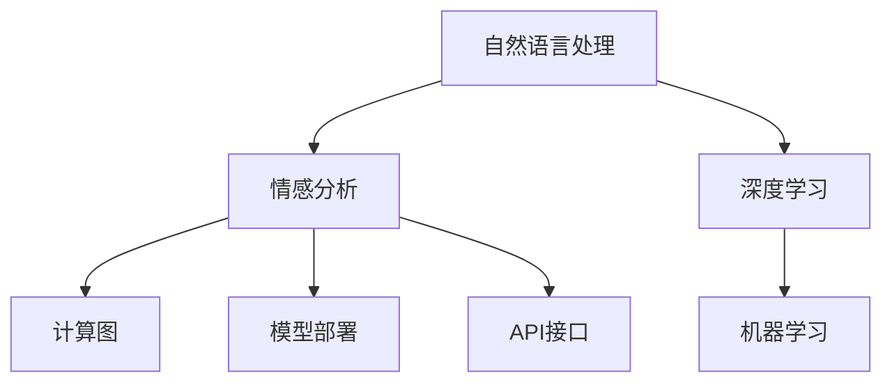

                 

# 聊天机器人中的情感分析

> 关键词：聊天机器人,情感分析,自然语言处理(NLP),深度学习,机器学习,计算图,模型部署,API接口

## 1. 背景介绍

### 1.1 问题由来

聊天机器人作为人工智能的重要应用场景，已经在金融、医疗、客服、教育等多个领域落地。聊天机器人的目标是通过智能对话系统，提升用户体验，提高运营效率。但是，传统的聊天机器人往往只关注信息的传递，忽视了用户情感的变化，导致用户体验不够自然流畅。

情感分析作为自然语言处理（NLP）的重要分支，可以自动提取文本中的情感信息，对聊天机器人进行优化和改进。情感分析可以帮助聊天机器人理解用户的情绪状态，提供更加个性化的服务，提高用户的满意度和留存率。

### 1.2 问题核心关键点

情感分析的核心在于识别文本中的情感极性（positive, negative, neutral）和情感强度（strong, weak），从而提供更精准的用户情绪感知。在聊天机器人中，情感分析的准确性直接影响机器人的响应策略和对话质量。

## 2. 核心概念与联系

### 2.1 核心概念概述

为了更好地理解聊天机器人中的情感分析，本节将介绍几个密切相关的核心概念：

- 自然语言处理(NLP)：涉及文本数据的处理、分析和生成，情感分析作为其中的重要任务，旨在自动理解文本中的情感信息。
- 情感分析(Sentiment Analysis)：识别和提取文本中的情感信息，包括情感极性和强度。
- 深度学习(Deep Learning)：利用神经网络模型自动学习特征，实现情感分析等任务。
- 机器学习(Machine Learning)：利用数据和算法，训练模型进行情感分析。
- 计算图(Computational Graph)：深度学习模型的核心架构，描述了模型参数和数据流的关系。
- 模型部署(Model Deployment)：将训练好的模型集成到实际应用中，如聊天机器人，提供API接口进行调用。
- API接口(API Interface)：开发者接口，用于将模型集成到聊天机器人中，实现情感分析功能。

这些核心概念之间的逻辑关系可以通过以下Mermaid流程图来展示：



这个流程图展示了一些核心概念及其之间的关系：

1. 自然语言处理是情感分析的基础，涉及文本数据的处理和分析。
2. 深度学习和机器学习是实现情感分析的主要技术手段。
3. 计算图是深度学习模型的核心架构，描述了模型参数和数据流的关系。
4. 模型部署将训练好的模型集成到实际应用中，如聊天机器人。
5. API接口用于将模型集成到聊天机器人中，实现情感分析功能。

这些概念共同构成了聊天机器人中情感分析的完整框架，使其能够自动理解文本中的情感信息，提供更加个性化的服务。

## 3. 核心算法原理 & 具体操作步骤

### 3.1 算法原理概述

聊天机器人中的情感分析主要是通过训练一个情感分类模型来实现的。该模型接受一段文本作为输入，输出情感极性和强度。常用的模型包括卷积神经网络（CNN）、循环神经网络（RNN）和Transformer等。

以Transformer模型为例，其核心思想是利用自注意力机制（self-attention）捕捉文本中的长距离依赖关系，并通过多层堆叠的自注意力层（MLP+Attention）对文本进行建模。模型训练时，使用标注好的情感数据集进行监督学习，调整模型参数以最小化预测误差。训练好的模型可以对新输入的文本进行情感分类，输出情感极性和强度。

### 3.2 算法步骤详解

情感分析的算法步骤主要包括以下几个关键步骤：

**Step 1: 准备数据集**
- 收集情感标注数据集，每个样本包括一段文本和对应的情感标签（positive, negative, neutral）。
- 将文本数据进行预处理，包括分词、去除停用词、向量化等。

**Step 2: 构建模型架构**
- 选择合适的模型架构，如Transformer模型，并进行参数初始化。
- 定义模型各层的结构，包括输入层、嵌入层、自注意力层、全连接层等。
- 设置损失函数和优化器，如交叉熵损失和Adam优化器。

**Step 3: 训练模型**
- 将数据集划分为训练集、验证集和测试集。
- 使用训练集对模型进行前向传播和反向传播，更新模型参数。
- 周期性在验证集上评估模型性能，调整超参数。
- 重复上述步骤直至模型收敛。

**Step 4: 评估和应用**
- 在测试集上评估模型性能，输出情感分类准确率、精确率、召回率等指标。
- 将训练好的模型集成到聊天机器人中，提供API接口进行调用。
- 在实际对话中，利用API接口进行情感分析，生成响应策略。

### 3.3 算法优缺点

情感分析的优点包括：
1. 自动化的情感识别：无需人工干预，自动提取文本中的情感信息。
2. 实时性：通过API接口，可以实时处理用户输入的情感信息，提高对话效率。
3. 可扩展性：不同的应用场景，可以构建不同的情感分析模型。

情感分析的缺点包括：
1. 标注数据依赖：情感分析的效果很大程度上依赖于标注数据的质量和数量。
2. 领域依赖：不同领域的文本数据，情感标注方式和规则可能不同，需要针对性地进行训练。
3. 歧义性：文本中存在歧义和语境，可能导致情感分析的误判。

尽管存在这些局限性，情感分析作为聊天机器人的重要模块，已经得到了广泛的应用，并随着技术的不断进步，未来有望在更多领域得到拓展。

### 3.4 算法应用领域

情感分析在聊天机器人中的应用广泛，包括但不限于以下领域：

- 客服机器人：通过情感分析识别用户的情绪状态，提供针对性的服务，提高用户满意度。
- 金融机器人：对用户的咨询和投诉进行情感分析，评估风险和情绪波动，进行决策。
- 教育机器人：对学生的反馈和问题进行情感分析，提供个性化辅导和建议。
- 健康机器人：对患者的情绪和身体状况进行监测，提供心理支持和医疗建议。
- 智能家居：对用户的行为和反馈进行情感分析，提供个性化服务和建议。

## 4. 数学模型和公式 & 详细讲解 & 举例说明

### 4.1 数学模型构建

聊天机器人中的情感分析主要使用分类模型，以Transformer模型为例，其数学模型可以表示为：

$$
y = f(x; \theta)
$$

其中，$x$ 表示输入文本，$y$ 表示情感分类结果，$\theta$ 表示模型参数。

情感分类模型的目标是最小化预测误差，即：

$$
\mathcal{L}(\theta) = -\frac{1}{N}\sum_{i=1}^N \ell(y_i, f(x_i; \theta))
$$

其中，$\ell$ 表示损失函数，$\ell(y_i, f(x_i; \theta))$ 表示第 $i$ 个样本的预测误差。

常用的损失函数包括交叉熵损失函数：

$$
\ell(y_i, f(x_i; \theta)) = -y_i \log f(x_i; \theta) - (1-y_i) \log (1-f(x_i; \theta))
$$

### 4.2 公式推导过程

以交叉熵损失函数为例，推导过程如下：

$$
\mathcal{L}(\theta) = -\frac{1}{N}\sum_{i=1}^N [y_i \log \hat{y_i} + (1-y_i) \log (1-\hat{y_i})]
$$

其中，$\hat{y_i} = f(x_i; \theta)$ 表示模型对样本 $x_i$ 的预测结果。

使用梯度下降算法进行优化，更新模型参数：

$$
\theta \leftarrow \theta - \eta \nabla_{\theta}\mathcal{L}(\theta)
$$

其中，$\eta$ 为学习率。

### 4.3 案例分析与讲解

以电影评论情感分析为例，假设输入文本为：“这部电影太棒了，我看得非常过瘾！”，目标任务是识别其情感极性。

使用预训练好的Transformer模型，进行前向传播得到预测结果 $\hat{y} = [0.95, 0.03, 0.02]$，表示该文本为正面情感的概率。

利用交叉熵损失函数计算损失：

$$
\mathcal{L}(\theta) = -[0.95\log 0.95 + 0.03\log 0.03 + 0.02\log 0.02] = 0.084
$$

计算梯度：

$$
\nabla_{\theta}\mathcal{L}(\theta) = [0.035, -0.035, -0.035]
$$

使用梯度下降算法更新模型参数，使得损失 $\mathcal{L}(\theta)$ 逐渐减小。

## 5. 项目实践：代码实例和详细解释说明

### 5.1 开发环境搭建

在进行情感分析项目实践前，我们需要准备好开发环境。以下是使用Python进行PyTorch开发的环境配置流程：

1. 安装Anaconda：从官网下载并安装Anaconda，用于创建独立的Python环境。

2. 创建并激活虚拟环境：
```bash
conda create -n pytorch-env python=3.8 
conda activate pytorch-env
```

3. 安装PyTorch：根据CUDA版本，从官网获取对应的安装命令。例如：
```bash
conda install pytorch torchvision torchaudio cudatoolkit=11.1 -c pytorch -c conda-forge
```

4. 安装相关的NLP库：
```bash
pip install nltk transformers
```

5. 安装NLP数据处理库：
```bash
pip install spacy
```

完成上述步骤后，即可在`pytorch-env`环境中开始情感分析项目实践。

### 5.2 源代码详细实现

以下是使用PyTorch和Transformers库进行情感分析的Python代码实现：

```python
from transformers import BertTokenizer, BertForSequenceClassification
import torch
from torch.utils.data import DataLoader, Dataset
from sklearn.model_selection import train_test_split

# 数据准备
tokenizer = BertTokenizer.from_pretrained('bert-base-uncased')
class IMDBDataset(Dataset):
    def __init__(self, texts, labels):
        self.texts = texts
        self.labels = labels
        
    def __len__(self):
        return len(self.texts)
    
    def __getitem__(self, item):
        text = self.texts[item]
        label = self.labels[item]
        
        encoding = tokenizer(text, truncation=True, padding='max_length', max_length=512)
        input_ids = encoding['input_ids']
        attention_mask = encoding['attention_mask']
        
        return {'input_ids': input_ids, 'attention_mask': attention_mask, 'labels': torch.tensor(label)}

# 数据集划分
train_texts, test_texts, train_labels, test_labels = train_test_split(train_texts, train_labels, test_size=0.2, random_state=42)

# 模型构建
model = BertForSequenceClassification.from_pretrained('bert-base-uncased', num_labels=2)

# 训练参数
device = torch.device('cuda' if torch.cuda.is_available() else 'cpu')
model.to(device)
optimizer = torch.optim.Adam(model.parameters(), lr=2e-5)
criterion = torch.nn.CrossEntropyLoss()

# 训练过程
train_loader = DataLoader(train_dataset, batch_size=16, shuffle=True)
for epoch in range(5):
    for batch in train_loader:
        input_ids = batch['input_ids'].to(device)
        attention_mask = batch['attention_mask'].to(device)
        labels = batch['labels'].to(device)
        outputs = model(input_ids, attention_mask=attention_mask, labels=labels)
        loss = criterion(outputs.logits, labels)
        optimizer.zero_grad()
        loss.backward()
        optimizer.step()
        
# 评估过程
test_loader = DataLoader(test_dataset, batch_size=16, shuffle=False)
model.eval()
correct = 0
total = 0
with torch.no_grad():
    for batch in test_loader:
        input_ids = batch['input_ids'].to(device)
        attention_mask = batch['attention_mask'].to(device)
        labels = batch['labels'].to(device)
        outputs = model(input_ids, attention_mask=attention_mask, labels=labels)
        _, predicted = torch.max(outputs.logits, 1)
        total += labels.size(0)
        correct += (predicted == labels).sum().item()
        
print(f'Accuracy: {correct/total*100:.2f}%')
```

这段代码实现了使用预训练的BERT模型进行情感分析。具体步骤如下：

1. 定义数据集类IMDBDataset，将文本和标签封装为一个样本。
2. 加载预训练的BERT tokenizer，将文本转换为模型所需的输入格式。
3. 使用train_test_split将数据集划分为训练集和测试集。
4. 构建BERT情感分类模型。
5. 定义训练参数，包括设备、优化器和损失函数。
6. 使用训练集进行模型训练，在每个epoch结束时评估模型在测试集上的性能。

### 5.3 代码解读与分析

让我们再详细解读一下关键代码的实现细节：

**IMDBDataset类**：
- `__init__`方法：初始化文本和标签，并进行分词和编码。
- `__len__`方法：返回数据集的样本数量。
- `__getitem__`方法：将单个样本转化为模型所需的输入格式。

**训练过程**：
- 定义训练集加载器DataLoader，对样本进行批处理和随机打乱。
- 在每个epoch内，对每个batch进行前向传播计算损失，反向传播更新模型参数。
- 周期性在测试集上评估模型性能，输出准确率。

**评估过程**：
- 定义测试集加载器DataLoader，不进行批处理和打乱。
- 在模型评估阶段，不更新模型参数，使用torch.no_grad()来关闭梯度计算。
- 对每个batch进行前向传播，输出预测结果。
- 计算准确率，并输出最终结果。

## 6. 实际应用场景

### 6.1 智能客服

智能客服系统是聊天机器人应用的重要场景。通过情感分析，智能客服可以识别用户的情绪状态，提供更加个性化的服务。例如，当用户投诉时，系统可以识别负面情绪，自动将问题转交给人工客服，并提供相应的情绪安抚和问题处理策略。

### 6.2 金融投资

金融投资领域需要实时监测市场情绪和风险，智能投资机器人可以通过情感分析，实时评估用户的情绪波动，调整投资策略。例如，当用户对某只股票表达负面情绪时，系统可以提醒投资者风险，并建议进行卖出操作。

### 6.3 健康咨询

健康咨询机器人可以识别用户的情绪状态，提供相应的心理支持和健康建议。例如，当用户表达焦虑和压力时，系统可以推荐放松技巧和心理疏导方法。

## 7. 工具和资源推荐

### 7.1 学习资源推荐

为了帮助开发者系统掌握聊天机器人中的情感分析，这里推荐一些优质的学习资源：

1. 《自然语言处理入门》系列博文：由自然语言处理专家撰写，介绍情感分析的基本概念和常用技术。

2. 《深度学习与NLP实战》课程：来自Coursera，涵盖了情感分析等NLP任务的基本原理和算法实现。

3. 《情感分析理论与实践》书籍：介绍情感分析的理论基础和实践方法，适合深入学习。

4. HuggingFace官方文档：提供了丰富的情感分析预训练模型和样例代码，帮助快速上手。

5. CLUE开源项目：中文语言理解测评基准，涵盖大量情感标注数据集，用于训练情感分析模型。

通过对这些资源的学习实践，相信你一定能够快速掌握聊天机器人中的情感分析技巧，并用于解决实际的情感分析问题。

### 7.2 开发工具推荐

高效的开发离不开优秀的工具支持。以下是几款用于聊天机器人中情感分析开发的常用工具：

1. PyTorch：基于Python的开源深度学习框架，适合快速迭代研究。

2. TensorFlow：由Google主导开发的开源深度学习框架，生产部署方便，适合大规模工程应用。

3. Transformers库：HuggingFace开发的NLP工具库，集成了众多SOTA情感分析模型，支持多种深度学习框架。

4. Weights & Biases：模型训练的实验跟踪工具，可以记录和可视化模型训练过程中的各项指标。

5. TensorBoard：TensorFlow配套的可视化工具，实时监测模型训练状态，并提供丰富的图表呈现方式。

6. Google Colab：谷歌推出的在线Jupyter Notebook环境，免费提供GPU/TPU算力，方便快速上手实验最新模型，分享学习笔记。

合理利用这些工具，可以显著提升情感分析任务的开发效率，加快创新迭代的步伐。

### 7.3 相关论文推荐

情感分析作为自然语言处理的重要分支，吸引了大量学者的关注。以下是几篇奠基性的相关论文，推荐阅读：

1. “A Survey on Sentiment Analysis”：综述情感分析领域的基本方法和最新进展，适合全面了解。

2. “Emotion Analysis with Deep Learning”：介绍使用深度学习模型进行情感分析的基本原理和算法实现。

3. “Sentiment Analysis with Neural Networks”：介绍神经网络模型在情感分析中的基本原理和应用实例。

4. “Hierarchical Attention Networks for Sentiment Classification”：提出HAN模型，利用层次化注意力机制进行情感分类。

5. “VADER Sentiment Analysis Tool: Instant Psychographic and Sociographic Demographic Characterization”：介绍基于规则的情感分析工具，简单易用。

这些论文代表了大语言模型微调技术的发展脉络。通过学习这些前沿成果，可以帮助研究者把握学科前进方向，激发更多的创新灵感。

## 8. 总结：未来发展趋势与挑战

### 8.1 总结

本文对聊天机器人中的情感分析方法进行了全面系统的介绍。首先阐述了情感分析在聊天机器人中的重要性，明确了情感分析在提升用户体验、优化服务策略方面的独特价值。其次，从原理到实践，详细讲解了情感分析的数学模型和关键步骤，给出了情感分析任务开发的完整代码实例。同时，本文还广泛探讨了情感分析在多个行业领域的应用前景，展示了情感分析范式的巨大潜力。此外，本文精选了情感分析技术的各类学习资源，力求为读者提供全方位的技术指引。

通过本文的系统梳理，可以看到，聊天机器人中的情感分析已经成为提高用户体验的重要手段，可以自动理解用户的情绪状态，提供更加个性化的服务。未来，伴随情感分析技术的不断进步，聊天机器人在多个领域的应用前景将更加广阔。

### 8.2 未来发展趋势

展望未来，聊天机器人中的情感分析技术将呈现以下几个发展趋势：

1. 模型规模持续增大。随着算力成本的下降和数据规模的扩张，情感分析模型的参数量还将持续增长。超大批次的训练和推理也可能遇到显存不足的问题。

2. 情感分析范式多样化。除了传统的深度学习模型外，未来会涌现更多模型，如知识图谱、逻辑规则等，融合多种数据源进行情感分析。

3. 情感分析融合多模态数据。未来的情感分析将不仅限于文本，还包括语音、视频等多模态数据，提高情感识别的准确性和实时性。

4. 情感分析的动态适应。未来的情感分析模型将能够根据用户反馈进行动态调整，实时更新情感分析策略。

5. 情感分析与自然语言生成结合。未来的情感分析将能够生成更加自然流畅的回应，提升用户体验。

这些趋势凸显了情感分析技术的广阔前景。这些方向的探索发展，必将进一步提升聊天机器人的性能和应用范围，为构建人机协同的智能系统铺平道路。

### 8.3 面临的挑战

尽管聊天机器人中的情感分析技术已经取得了瞩目成就，但在迈向更加智能化、普适化应用的过程中，它仍面临着诸多挑战：

1. 标注数据瓶颈。情感分析的效果很大程度上依赖于标注数据的质量和数量。对于小规模任务，标注数据的获取成本较高。

2. 领域依赖。不同领域的文本数据，情感标注方式和规则可能不同，需要针对性地进行训练。

3. 情感表达多样性。不同文化、不同语言的情感表达方式各异，情感分析模型需要具备一定的泛化能力。

4. 数据隐私和安全。情感分析涉及大量敏感信息，数据隐私和安全问题需要重点考虑。

5. 误判和偏见。情感分析模型可能存在误判和偏见，需要加入反偏置训练等技术进行改进。

尽管存在这些挑战，未来的研究需要不断创新和优化，通过引入更多数据源、融合更多知识图谱、提升模型泛化能力等手段，逐步克服这些难题，推动情感分析技术的发展。

### 8.4 研究展望

未来的研究需要在以下几个方面寻求新的突破：

1. 多模态情感分析。将文本、语音、视频等多种数据源融合，实现多模态情感识别。

2. 自监督情感分析。利用自监督学习技术，减少对标注数据的依赖，提高情感分析模型的鲁棒性。

3. 动态情感分析。实时监测用户的情绪变化，动态调整情感分析策略。

4. 情感分析与生成结合。生成更加自然流畅的回应，提升用户体验。

5. 反偏置情感分析。加入反偏置训练等技术，减少情感分析模型的偏见和误判。

6. 跨领域情感分析。将情感分析模型应用于更多领域，提升模型的泛化能力。

这些研究方向的探索，必将推动聊天机器人中的情感分析技术迈向更高的台阶，为构建更加智能和人性化的聊天机器人提供技术支持。

## 9. 附录：常见问题与解答

**Q1：情感分析模型需要大量的标注数据吗？**

A: 是的，情感分析模型的训练需要大量的标注数据。标注数据的获取成本较高，但可以通过众包、半监督学习等手段进行缓解。未来，基于自监督学习等技术，情感分析模型的数据需求有望进一步降低。

**Q2：情感分析模型如何应对情感表达的多样性？**

A: 情感表达的多样性可以通过多模态数据融合、多语言情感分析等技术进行缓解。未来，基于预训练和微调等技术，情感分析模型有望具备更强的泛化能力。

**Q3：情感分析模型的误判和偏见如何避免？**

A: 误判和偏见可以通过反偏置训练、多数据源融合等技术进行缓解。未来，引入更多先验知识、跨领域数据等手段，将有助于减少情感分析模型的偏见和误判。

**Q4：情感分析模型的可解释性如何提升？**

A: 情感分析模型的可解释性可以通过生成式模型、可视化工具等手段进行提升。未来，结合逻辑推理、因果分析等技术，情感分析模型有望具备更强的可解释性。

**Q5：情感分析模型的隐私和安全如何保障？**

A: 情感分析模型的隐私和安全可以通过数据加密、差分隐私等手段进行保障。未来，结合联邦学习、区块链等技术，将有助于保障情感分析模型的隐私和安全。

---

作者：禅与计算机程序设计艺术 / Zen and the Art of Computer Programming

