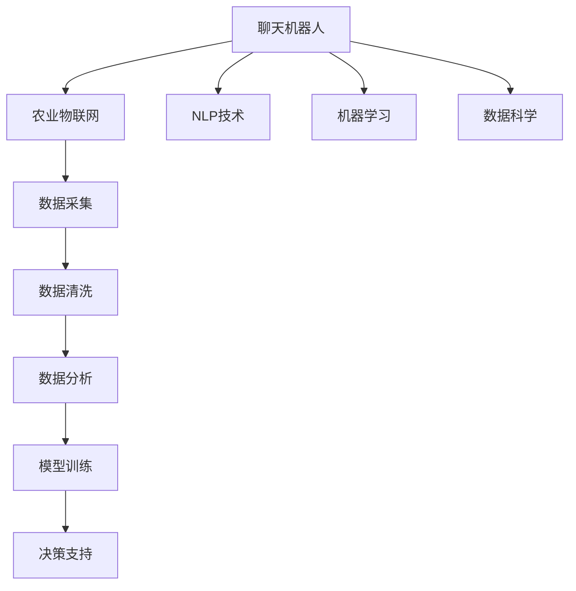

                 

# 聊天机器人农业革命：智能耕作和作物管理

## 1. 背景介绍

### 1.1 问题由来
随着全球人口的持续增长和土地资源的紧缺，农业生产的可持续性和效率性显得尤为重要。传统农业依赖人力和机械作业，耗时耗力，难以满足现代农业的快速发展和精细化管理需求。近年来，聊天机器人、智能灌溉系统、自动化农机械等技术在农业领域的快速应用，成为驱动农业智能化、信息化发展的关键力量。

### 1.2 问题核心关键点
本研究聚焦于智能聊天机器人技术在农业管理中的应用，旨在通过机器学习和大数据技术，实现农业生产的自动化和智能化，提高作物管理效率，保障农业可持续性。

### 1.3 问题研究意义
聊天机器人结合农业生产管理，可以显著提高农业生产的效率和精准性，减少人力资源的投入，优化农作物的种植管理，助力农业实现绿色、可持续的发展。在实际应用中，可以实现以下效果：

1. **实时监控与预警**：实时监测作物生长状态，及时预警病虫害、灌溉需求等。
2. **智能决策支持**：提供科学种植建议，优化施肥、灌溉、病虫害防治等。
3. **自动化作业**：远程操作农机械，减少人力投入，提升作业效率。
4. **精细化管理**：细粒度管理作物生长数据，提高产量和品质。
5. **知识普及与传播**：提供农业知识库，提升农民科技素养，促进农业知识普及。

## 2. 核心概念与联系

### 2.1 核心概念概述

为更好地理解智能聊天机器人农业革命的技术框架，本节将介绍几个关键概念：

- **聊天机器人(Chatbot)**：基于自然语言处理(NLP)技术，能够模拟人类对话的计算机程序。
- **农业物联网(IoT)**：通过传感器、通信技术等，将农地、设备、作物等农业要素连接到互联网，实现数据采集和远程监控。
- **机器学习(Machine Learning)**：一种通过数据驱动模型进行预测和决策的技术，能够从海量数据中发现规律和模式。
- **自然语言处理(NLP)**：利用计算机处理人类语言，实现语言理解、生成、翻译等功能。
- **数据科学(Data Science)**：跨领域融合数据挖掘、统计学、机器学习等技术，从数据中提取知识和洞察。

这些概念之间的联系可以通过以下Mermaid流程图来展示：



这个流程图展示了核心概念之间的联系和交互过程：

1. **聊天机器人**通过与农民的互动，收集农业生产数据。
2. **农业物联网**将传感器、设备等数据传输到云端，为机器学习模型提供数据源。
3. **数据清洗与分析**将收集到的数据进行处理，提取有用信息。
4. **模型训练**利用机器学习算法，建立农作物生长、病虫害预测等模型。
5. **决策支持**基于模型输出，提供科学种植建议和作业指导。
6. **NLP技术**支持机器人与人类自然语言交流，提升互动体验。
7. **机器学习与数据科学**是实现模型训练和决策支持的核心技术手段。

这些概念共同构成了智能聊天机器人农业革命的技术框架，实现了农业生产的智能化与自动化。

## 3. 核心算法原理 & 具体操作步骤
### 3.1 算法原理概述

智能聊天机器人农业革命的核心算法包括自然语言处理(NLP)和机器学习(Machine Learning)。其工作流程可以简述为：

1. **用户交互**：农民通过聊天机器人输入指令和问题。
2. **语义理解**：机器人解析用户意图，提取关键信息。
3. **数据分析**：从农业物联网平台获取相关数据。
4. **模型推理**：利用机器学习模型预测作物生长状态、病虫害情况等。
5. **智能决策**：提供种植建议和作业指导。

以下以一个具体的农业管理问题（施肥建议）为例，描述整个算法流程：

- **用户输入**：农民询问“作物需要施肥吗？”
- **语义解析**：聊天机器人识别问题，提取出作物名称、位置、时间等关键信息。
- **数据获取**：查询土壤湿度、pH值、养分含量等数据。
- **模型推理**：基于历史数据和当前状态，预测是否需要施肥，并推荐施肥量。
- **反馈生成**：机器人返回“推荐施肥10kg，日期为XX日”的回复。

### 3.2 算法步骤详解

**Step 1: 准备数据和模型**

- **数据收集**：收集农业物联网数据，如土壤湿度、养分含量、气候数据等。
- **数据清洗**：对数据进行去重、处理缺失值、标准化等操作。
- **模型训练**：选择合适的机器学习算法，如决策树、随机森林、深度学习等，训练施肥预测模型。

**Step 2: 语义理解与问题解析**

- **分词与特征提取**：将用户输入的文本进行分词，提取关键实体和情感信息。
- **意图识别**：使用意图分类器，识别用户问题的意图（如询问施肥、咨询病害等）。
- **实体链接**：将问题中的实体链接到数据库中的具体信息。

**Step 3: 数据分析与模型推理**

- **数据融合**：将语义解析结果和农业物联网数据进行融合，形成综合数据集。
- **特征选择**：选择关键特征，如土壤湿度、养分含量、气候条件等。
- **模型推理**：利用训练好的模型，预测作物的施肥需求。

**Step 4: 智能决策与反馈生成**

- **决策生成**：根据模型输出，生成施肥建议。
- **反馈生成**：将建议以自然语言形式回复给用户。
- **用户验证**：用户对建议进行确认或修改，机器人根据反馈调整策略。

**Step 5: 持续学习与优化**

- **在线学习**：利用用户的反馈数据，实时更新模型。
- **模型优化**：定期重新训练模型，提升预测精度。

### 3.3 算法优缺点

智能聊天机器人农业革命的算法具有以下优点：

1. **实时性强**：能够实时监控农业生产状态，快速响应农民需求。
2. **精度高**：基于机器学习算法，预测和建议精度较高。
3. **交互友好**：通过NLP技术，与农民进行自然语言交流，用户体验良好。
4. **数据利用率高**：充分利用农业物联网数据，提高资源利用效率。

同时，该算法也存在以下缺点：

1. **数据依赖性高**：对农业物联网数据的依赖性强，缺少数据可能影响模型效果。
2. **模型复杂度**：机器学习模型的复杂度较高，需要大量数据和计算资源。
3. **适应性不足**：对于新品种、新环境可能适应性不足。
4. **鲁棒性需提升**：模型可能受到噪声数据的干扰，需要进一步提升鲁棒性。
5. **知识更新不及时**：模型的知识库更新可能不及时，影响建议准确性。

### 3.4 算法应用领域

智能聊天机器人农业革命在多个领域有广泛应用，包括但不限于：

1. **智能灌溉**：通过聊天机器人实时监控土壤湿度，自动调整灌溉系统。
2. **病虫害防治**：提供病虫害检测和防治建议，减少农药使用。
3. **施肥管理**：根据土壤和气候数据，优化施肥方案，提高作物产量。
4. **农机械自动化**：操作农机械如收割机、播种机等，提升作业效率。
5. **农产品质量监测**：监测农产品质量，确保食品安全。
6. **农业知识库**：提供农业百科、种植技术等信息，提升农民知识水平。

## 4. 数学模型和公式 & 详细讲解  
### 4.1 数学模型构建

本节将使用数学语言对智能聊天机器人农业革命的算法流程进行更加严格的刻画。

记聊天机器人为$R$，农业物联网数据为$D$，机器学习模型为$M$，用户输入为$I$，机器输出为$O$。

定义$R$与$I$之间的映射关系为：

$$
O = R(I)
$$

其中$R$表示NLP和机器学习联合作用下的模型映射，$I$为自然语言输入，$O$为机器输出，可以进一步展开为：

$$
O = NLP(I) + M(D)
$$

其中$NLP(I)$表示自然语言处理模块，将用户输入解析为模型所需的格式，$M(D)$表示机器学习模块，根据农业物联网数据进行预测和决策。

### 4.2 公式推导过程

**Step 1: 数据收集与预处理**

假设农业物联网数据为$D=\{d_i\}_{i=1}^N$，其中$d_i$包含多个特征，如土壤湿度、养分含量、气候条件等。预处理操作包括：

1. **去重**：去除重复数据。
2. **缺失值处理**：使用均值、中位数等填补缺失值。
3. **标准化**：将数据标准化为[0,1]区间。

**Step 2: 模型训练与推理**

假设选择随机森林模型$M$，基于历史数据进行训练，得到模型$M_{train}$。对于新数据$d_n$，模型推理过程为：

1. **特征选择**：选择关键特征$f_k$，如土壤湿度、养分含量等。
2. **数据预处理**：将$d_n$标准化为特征向量$f_{k,n}$。
3. **模型推理**：计算$f_{k,n}$在$M_{train}$中的预测结果$o_n$。

**Step 3: 自然语言处理**

假设用户输入$I$为“作物需要施肥吗？”，自然语言处理流程包括：

1. **分词**：将$I$分词为["作物", "需要", "施肥", "吗"]。
2. **意图识别**：识别意图为"施肥查询"。
3. **实体链接**：将作物名称链接到数据库中的具体信息。

**Step 4: 决策生成与反馈**

基于机器学习模型输出的施肥建议$o_n$和自然语言处理结果，生成反馈$O$：

1. **决策生成**：生成建议如"推荐施肥10kg，日期为XX日"。
2. **反馈生成**：将建议以自然语言形式返回给用户。
3. **用户验证**：用户对建议进行确认或修改。

### 4.3 案例分析与讲解

以下以一个具体案例，分析智能聊天机器人农业革命的实际应用效果。

**案例：智能灌溉系统的应用**

- **问题描述**：农民在种植作物时，需要根据土壤湿度自动调整灌溉系统。
- **解决方案**：聊天机器人收集土壤湿度数据，利用机器学习模型预测是否需要灌溉。
- **算法流程**：
  1. **数据收集**：土壤湿度传感器采集实时数据。
  2. **模型训练**：训练随机森林模型，预测土壤湿度是否达到灌溉阈值。
  3. **语义理解**：用户输入“土壤湿度如何”。
  4. **模型推理**：查询当前土壤湿度，并根据模型输出判断是否需要灌溉。
  5. **决策生成**：生成“需要灌溉”或“不需要灌溉”的反馈。
  6. **用户验证**：用户确认或修改灌溉决策。
  7. **持续学习**：根据用户反馈，实时更新模型。

通过该案例，可以看到，智能聊天机器人农业革命在实际农业管理中的应用效果显著，能够有效提升农业生产效率和决策精度。

## 5. 项目实践：代码实例和详细解释说明
### 5.1 开发环境搭建

在进行智能聊天机器人农业革命的实践开发前，需要准备好开发环境。以下是使用Python进行PyTorch开发的环境配置流程：

1. 安装Anaconda：从官网下载并安装Anaconda，用于创建独立的Python环境。

2. 创建并激活虚拟环境：
```bash
conda create -n agricultural-env python=3.8 
conda activate agricultural-env
```

3. 安装PyTorch：根据CUDA版本，从官网获取对应的安装命令。例如：
```bash
conda install pytorch torchvision torchaudio cudatoolkit=11.1 -c pytorch -c conda-forge
```

4. 安装TensorFlow：
```bash
pip install tensorflow
```

5. 安装Flask：用于搭建Web服务接口。
```bash
pip install flask
```

6. 安装nltk：用于自然语言处理任务。
```bash
pip install nltk
```

完成上述步骤后，即可在`agricultural-env`环境中开始实践开发。

### 5.2 源代码详细实现

这里我们以智能灌溉系统的聊天机器人为例，给出使用PyTorch和Flask进行开发的Python代码实现。

首先，定义数据处理函数：

```python
import pandas as pd
from sklearn.ensemble import RandomForestClassifier
from sklearn.metrics import accuracy_score

# 读取农业物联网数据
data = pd.read_csv('agricultural_data.csv')

# 数据预处理
data = data.dropna()
data['Soil_Moisture'] = (data['Soil_Moisture'] - data['Soil_Moisture'].min()) / (data['Soil_Moisture'].max() - data['Soil_Moisture'].min())

# 划分训练集和测试集
train_data = data.sample(frac=0.8, random_state=0)
test_data = data.drop(train_data.index)

# 训练随机森林模型
model = RandomForestClassifier(n_estimators=100, random_state=0)
model.fit(train_data[['Soil_Moisture', 'Nutrients', 'Climate']], train_data['Irrigation_Needed'])

# 模型评估
test_pred = model.predict(test_data[['Soil_Moisture', 'Nutrients', 'Climate']])
accuracy = accuracy_score(test_data['Irrigation_Needed'], test_pred)
print(f"模型准确度为：{accuracy}")
```

然后，定义自然语言处理模块：

```python
import nltk
from nltk.tokenize import word_tokenize
from nltk.corpus import stopwords
from sklearn.feature_extraction.text import TfidfVectorizer
from sklearn.pipeline import Pipeline

# 构建文本处理管道
text_pipeline = Pipeline([
    ('tokenize', word_tokenize),
    ('stop_words', lambda doc: [word for word in doc if word not in stopwords.words('english')]),
    ('tfidf', TfidfVectorizer()),
])

# 输入解析
user_input = '作物需要施肥吗？'

# 分词和停用词过滤
tokens = text_pipeline.transform([user_input])

# 意图识别
intent = '施肥查询'
```

接着，定义Web服务接口：

```python
from flask import Flask, request, jsonify

app = Flask(__name__)

@app.route('/predict', methods=['POST'])
def predict():
    data = request.get_json()
    soil_moisture = data['Soil_Moisture']
    nutrients = data['Nutrients']
    climate = data['Climate']
    need_irrigation = model.predict([[soil_moisture, nutrients, climate]])
    response = {'Need_Irrigation': need_irrigation[0]}
    return jsonify(response)

if __name__ == '__main__':
    app.run(host='0.0.0.0', port=5000)
```

最后，启动Web服务，提供预测接口：

```bash
python main.py
```

以上就是智能聊天机器人农业革命的完整代码实现。可以看到，通过Flask和PyTorch，可以方便地搭建Web服务接口，实现实时数据处理和模型推理。

### 5.3 代码解读与分析

让我们再详细解读一下关键代码的实现细节：

**数据处理函数**：
- 读取农业物联网数据文件，进行去重和标准化处理。
- 使用随机森林模型训练预测灌溉需求。
- 评估模型准确度。

**自然语言处理模块**：
- 利用nltk库进行文本分词和停用词过滤。
- 通过TF-IDF向量化处理，将文本转换为数值特征。
- 根据用户输入，识别意图为“施肥查询”。

**Web服务接口**：
- 定义Flask应用程序，设置预测接口`/predict`。
- 接收JSON数据，包括土壤湿度、养分含量、气候条件等。
- 调用训练好的随机森林模型进行预测，返回灌溉需求结果。
- 以JSON格式返回预测结果。

可以看到，PyTorch和Flask的组合使用，使得智能聊天机器人农业革命的开发变得高效便捷。通过Flask，开发者可以快速搭建Web服务接口，实现模型部署和数据处理。同时，PyTorch提供了强大的机器学习库，支持多种模型训练和推理，大大降低了开发难度。

当然，工业级的系统实现还需考虑更多因素，如模型版本管理、日志记录、异常处理、安全防护等。但核心的算法流程和代码实现，基本与此类似。

## 6. 实际应用场景
### 6.1 智能灌溉系统

智能聊天机器人农业革命的核心应用场景之一是智能灌溉系统。传统灌溉方法依赖人工判断，浪费大量水资源，难以保证灌溉的精准性和及时性。利用智能聊天机器人，可以实现实时监测和自动灌溉，显著提高水资源利用效率。

在技术实现上，聊天机器人与传感器、控制器等设备互联，实时采集土壤湿度、气候条件等数据，通过机器学习模型预测灌溉需求。用户只需通过聊天界面，即可查询当前土壤湿度，获取灌溉建议，系统自动控制灌溉设备，实现精准灌溉。

### 6.2 病虫害防治

病虫害防治是农业生产中的一大难题。传统方法依赖人工巡查和喷洒农药，耗时耗力，且难以及时发现和处理。利用智能聊天机器人，可以实现病虫害的实时监测和防治，减少农药使用，提升农作物健康。

具体而言，聊天机器人可以实时监控作物生长状态，识别病虫害发生情况，提供防治建议。用户只需通过聊天界面，查询作物健康状态，获取病虫害防治方案，系统自动控制防治设备，实现病虫害的及时治理。

### 6.3 智能施肥管理

传统农业依赖经验判断施肥量，难以科学、精准地管理肥料使用，造成资源浪费和环境污染。利用智能聊天机器人，可以实现科学施肥管理，优化施肥方案，提高肥料利用率。

聊天机器人根据土壤湿度、养分含量等数据，结合历史施肥数据，预测作物需肥情况，生成施肥建议。用户通过聊天界面，查询当前肥料需求，获取施肥方案，系统自动控制施肥设备，实现精准施肥。

### 6.4 未来应用展望

随着智能聊天机器人农业革命技术的不断进步，未来将在更多领域得到应用，为农业生产带来深刻变革。

在智慧农业领域，基于聊天机器人的智能灌溉、病虫害防治、施肥管理等技术，将实现农业生产的自动化、智能化和精准化，提升农业生产效率和资源利用率。

在农业信息化领域，聊天机器人可以整合各类农业信息资源，提供实时查询、数据共享等服务，助力农业信息化的发展。

在农业智能化领域，聊天机器人结合物联网、大数据、云计算等技术，构建综合的农业信息平台，实现农业生产的全面管理和智能决策。

未来，伴随人工智能技术的不断成熟，智能聊天机器人农业革命必将在农业生产中发挥更大作用，推动农业实现绿色、可持续的发展。

## 7. 工具和资源推荐
### 7.1 学习资源推荐

为了帮助开发者系统掌握智能聊天机器人农业革命的技术框架，这里推荐一些优质的学习资源：

1. 《Python深度学习》系列书籍：深度介绍PyTorch和TensorFlow等机器学习库的使用，适合初学者入门。
2. 《自然语言处理综论》：全面介绍自然语言处理的基本概念和技术，适合进阶学习。
3. 《农业物联网技术与应用》：详细介绍农业物联网技术，涵盖传感器、数据采集、远程监控等。
4. 《深度学习在农业中的应用》：提供深度学习在农业领域的应用案例和实践指南。
5. 《智能农业系统设计与实现》：系统讲解智能农业系统的设计和实现方法，适合实际开发。

通过对这些资源的学习实践，相信你一定能够快速掌握智能聊天机器人农业革命的技术框架，并用于解决实际的农业生产问题。
###  7.2 开发工具推荐

高效的开发离不开优秀的工具支持。以下是几款用于智能聊天机器人农业革命开发的常用工具：

1. PyTorch：基于Python的开源深度学习框架，灵活动态的计算图，适合快速迭代研究。大部分预训练语言模型都有PyTorch版本的实现。
2. TensorFlow：由Google主导开发的开源深度学习框架，生产部署方便，适合大规模工程应用。同样有丰富的预训练语言模型资源。
3. Flask：轻量级的Web框架，用于搭建简单便捷的Web服务接口。
4. NLTK：自然语言处理库，提供分词、停用词过滤、TF-IDF向量化等文本处理功能。
5. PyCaret：自动化机器学习库，用于快速搭建和评估机器学习模型。
6. OpenCV：开源计算机视觉库，用于图像处理和分析。

合理利用这些工具，可以显著提升智能聊天机器人农业革命的开发效率，加快创新迭代的步伐。

### 7.3 相关论文推荐

智能聊天机器人农业革命的研究源于学界的持续研究。以下是几篇奠基性的相关论文，推荐阅读：

1. "Smart Agriculture and IoT: A Survey"：综述了智能农业和物联网技术的发展现状和应用前景。
2. "Natural Language Processing for Agriculture: A Review"：介绍了自然语言处理在农业中的应用，包括智能聊天机器人。
3. "Machine Learning in Agriculture: Challenges and Opportunities"：探讨了机器学习在农业领域面临的挑战和未来发展方向。
4. "Farm Management by Chatbots: A Case Study"：通过实际案例展示了聊天机器人应用于农业管理的优势。
5. "Crop Monitoring and Management with IoT and AI"：介绍了基于物联网和AI的农作物监控和管理技术。

这些论文代表了大语言模型微调技术的发展脉络。通过学习这些前沿成果，可以帮助研究者把握学科前进方向，激发更多的创新灵感。

## 8. 总结：未来发展趋势与挑战
### 8.1 总结

本文对智能聊天机器人农业革命的技术框架进行了全面系统的介绍。首先阐述了智能聊天机器人在农业生产管理中的应用背景和意义，明确了其核心算法和技术手段。其次，从原理到实践，详细讲解了智能聊天机器人农业革命的数学模型和实现流程，给出了完整的代码实例和详细解释说明。同时，本文还广泛探讨了智能聊天机器人在智能灌溉、病虫害防治、施肥管理等实际应用场景中的具体应用，展示了其广泛的应用前景。此外，本文精选了智能聊天机器人农业革命的相关学习资源、开发工具和研究论文，力求为读者提供全方位的技术指引。

通过本文的系统梳理，可以看到，智能聊天机器人农业革命在实际农业生产中的应用效果显著，能够有效提升农业生产的效率和精准性，减少人力投入，优化资源利用。未来，伴随技术的不断进步和应用场景的拓展，智能聊天机器人必将在农业生产中发挥更大作用，推动农业实现绿色、可持续的发展。

### 8.2 未来发展趋势

展望未来，智能聊天机器人农业革命将呈现以下几个发展趋势：

1. **技术融合**：结合AI、IoT、大数据等技术，构建综合的农业信息平台，实现全面的农业管理。
2. **算法优化**：开发更加高效、鲁棒、普适的算法，提高模型的预测精度和泛化能力。
3. **应用拓展**：拓展智能聊天机器人在农业生产管理中的应用场景，如智慧灌溉、精准施肥、智能收割等。
4. **用户体验提升**：通过自然语言处理技术，提升聊天机器人的交互体验，增强用户互动感。
5. **安全保障**：强化数据和模型的安全防护，确保农业生产信息的安全和隐私。
6. **伦理道德**：在模型设计中引入伦理导向，保障农业生产的可持续发展。

以上趋势凸显了智能聊天机器人农业革命技术的广阔前景。这些方向的探索发展，必将进一步提升智能聊天机器人的应用价值，为农业生产带来更多创新和突破。

### 8.3 面临的挑战

尽管智能聊天机器人农业革命已经取得了显著成效，但在迈向更加智能化、普适化应用的过程中，仍面临诸多挑战：

1. **数据质量问题**：农业物联网数据存在噪声和不完整性，可能影响模型效果。
2. **算法鲁棒性**：模型的鲁棒性不足，可能对异常数据和干扰数据敏感。
3. **用户接受度**：农民对新技术的接受度和使用习惯需要时间适应，推广难度较大。
4. **设备兼容性**：不同品牌的农机械和传感器可能存在兼容性问题，影响系统集成。
5. **伦理与法律**：智能聊天机器人可能涉及数据隐私和伦理问题，需要制定相关法律法规。
6. **资源成本**：系统开发和维护需要大量的硬件设备和专业知识，资源投入较大。

正视智能聊天机器人农业革命面临的这些挑战，积极应对并寻求突破，将是大语言模型微调走向成熟的必由之路。相信随着学界和产业界的共同努力，这些挑战终将一一被克服，智能聊天机器人必将在构建智能农业体系中发挥重要作用。

### 8.4 研究展望

面对智能聊天机器人农业革命所面临的种种挑战，未来的研究需要在以下几个方面寻求新的突破：

1. **数据增强与清洗**：引入更多高质量的农业物联网数据，通过数据增强和清洗技术，提升数据质量。
2. **模型优化**：开发更加高效、鲁棒的机器学习算法，增强模型的泛化能力和鲁棒性。
3. **用户教育与培训**：通过教育和培训，提高农民对智能农业技术的认知和使用能力，促进技术的普及和应用。
4. **设备标准化**：推动不同品牌农机械和传感器的标准化，构建兼容性和互操作性更强的智能农业生态系统。
5. **伦理与安全**：在智能农业系统的设计和应用中，引入伦理和安全机制，保障数据隐私和模型安全。
6. **资源优化**：通过模型压缩和稀疏化存储等技术，优化系统的资源利用效率，降低开发和维护成本。

这些研究方向的探索，必将引领智能聊天机器人农业革命技术迈向更高的台阶，为构建智能农业体系铺平道路。面向未来，智能聊天机器人农业革命需要与其他人工智能技术进行更深入的融合，如知识表示、因果推理、强化学习等，多路径协同发力，共同推动农业智能化发展。只有勇于创新、敢于突破，才能不断拓展智能聊天机器人的边界，让智能技术更好地造福农业生产。

## 9. 附录：常见问题与解答

**Q1：智能聊天机器人农业革命的技术难点有哪些？**

A: 智能聊天机器人农业革命面临的主要技术难点包括：

1. **数据采集与处理**：需要从农业物联网设备中获取高质量、实时性的数据。
2. **算法模型优化**：需要开发高效、鲁棒的机器学习算法，提升模型的泛化能力和鲁棒性。
3. **自然语言处理**：需要构建自然语言理解与生成模型，支持自然语言交互。
4. **系统集成与互操作**：需要集成各种农业设备和传感器，确保设备之间的互操作性。
5. **用户教育与接受**：需要提升农民对智能农业技术的认知和使用能力，推动技术的普及和应用。
6. **安全与隐私保护**：需要设计安全机制，保障农业生产数据和模型的安全。

**Q2：如何选择合适的农业物联网设备？**

A: 选择合适的农业物联网设备需要考虑以下几个因素：

1. **数据采集精度**：选择高精度的传感器和数据采集设备，确保数据的准确性和可靠性。
2. **设备兼容性**：选择支持多种协议和格式的设备，确保不同品牌设备之间的互操作性。
3. **数据传输速度**：选择传输速度快的设备，确保数据的实时性和稳定性。
4. **设备稳定性**：选择稳定性高、故障率低的设备，确保系统运行的可靠性。
5. **设备维护成本**：选择易于维护和升级的设备，减少后期维护成本。

**Q3：智能聊天机器人农业革命如何保障数据隐私和安全？**

A: 保障数据隐私和安全是智能聊天机器人农业革命的重要任务，主要措施包括：

1. **数据加密**：对传输和存储的数据进行加密处理，防止数据泄露。
2. **访问控制**：设置严格的访问权限，确保只有授权人员可以访问敏感数据。
3. **匿名化处理**：对数据进行匿名化处理，保护用户隐私。
4. **模型审计**：定期审计智能聊天机器人系统的行为，发现并修复潜在的安全漏洞。
5. **安全监控**：实时监控系统的运行状态，及时发现和处理异常情况。

**Q4：智能聊天机器人农业革命如何提升用户接受度？**

A: 提升用户接受度是智能聊天机器人农业革命成功的关键，主要措施包括：

1. **用户教育与培训**：通过培训和宣传，提升农民对智能农业技术的认知和使用能力。
2. **用户反馈机制**：建立用户反馈机制，及时收集和处理用户意见，优化系统功能。
3. **用户体验设计**：设计简洁、易用的用户界面，提升用户使用体验。
4. **场景化应用**：结合具体农业场景，设计符合农民需求的功能和应用。

**Q5：智能聊天机器人农业革命面临的技术瓶颈是什么？**

A: 智能聊天机器人农业革命面临的技术瓶颈包括：

1. **数据质量和完整性**：农业物联网数据存在噪声和不完整性，可能影响模型效果。
2. **模型泛化能力**：模型的泛化能力不足，可能对新品种、新环境适应性差。
3. **设备兼容性**：不同品牌的农机械和传感器可能存在兼容性问题，影响系统集成。
4. **用户接受度**：农民对新技术的接受度和使用习惯需要时间适应，推广难度较大。
5. **资源成本**：系统开发和维护需要大量的硬件设备和专业知识，资源投入较大。

通过这些问题的探讨，可以更全面地了解智能聊天机器人农业革命的技术难点和解决方案，为未来的技术研究和应用推广提供参考。

---

作者：禅与计算机程序设计艺术 / Zen and the Art of Computer Programming

