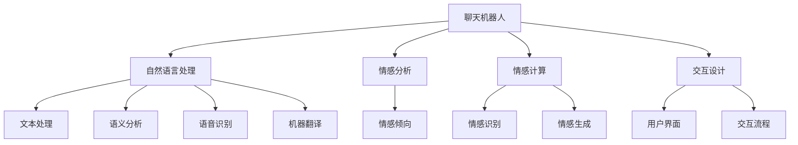

                 

# 聊天机器人情感连接：建立有意义的关系

> 关键词：聊天机器人, 情感分析, 自然语言处理(NLP), 对话系统, 交互体验, 用户体验(UX), 情感计算

## 1. 背景介绍

### 1.1 问题由来

随着人工智能技术的发展，聊天机器人（Chatbot）已经从简单的问答系统进化为能够进行自然对话、具备一定情感能力的智能助手。聊天机器人广泛应用于客户服务、智能家居、医疗咨询、教育辅助等多个领域，极大地提升了用户体验。然而，现有聊天机器人大多只关注对话的准确性和流畅性，忽略了对话过程中的情感因素，导致用户与机器人的互动显得生硬和机械。如何构建具有情感连接的聊天机器人，让机器人在对话中表现得更加自然、人性化，成为了当前研究的热点问题。

### 1.2 问题核心关键点

构建具有情感连接的聊天机器人，需要在自然语言处理(NLP)的基础上，结合情感计算和交互设计，使得机器人能够识别和理解用户的情感状态，并能够适当地回应和调整自身的情感表达，从而构建更加自然、流畅的对话。

1. **情感分析**：通过分析用户的话语，识别出其中的情感倾向，如积极、消极、中性等。
2. **情感响应**：根据用户情感，机器人需要能够提供适当的情感回应，如安慰、鼓励、道歉等。
3. **情感对话策略**：在对话过程中，机器人需要根据用户的情感状态，动态调整自己的对话策略，如语调、语气、使用词汇等，以适应用户的情感变化。

这些关键点要求聊天机器人不仅要具备自然语言处理能力，还需要具备情感计算和交互设计能力。只有综合运用这些技术，才能构建出具有情感连接的聊天机器人。

### 1.3 问题研究意义

情感连接的聊天机器人能够显著提升用户体验和互动质量，带来更高的用户满意度和粘性。通过识别用户的情感状态，聊天机器人能够提供更加个性化的服务，满足用户的情感需求，从而构建起更加紧密的情感联系。在客户服务、医疗咨询等领域，情感连接的聊天机器人有望成为用户与系统之间沟通的桥梁，提供更加贴心和高效的服务。

## 2. 核心概念与联系

### 2.1 核心概念概述

为更好地理解聊天机器人情感连接的构建方法，本节将介绍几个密切相关的核心概念：

- **聊天机器人（Chatbot）**：一种能够模拟人类对话的计算机程序，通常使用自然语言处理技术，能够理解和生成自然语言文本。
- **情感分析（Sentiment Analysis）**：通过分析文本中的情感线索，识别出文本所表达的情感倾向，如积极、消极、中性等。
- **自然语言处理（NLP）**：使计算机能够理解和生成人类语言的技术，包括文本处理、语义分析、语音识别、机器翻译等。
- **情感计算（Affective Computing）**：研究如何通过计算技术，识别、理解、生成和表达人类情感的技术。
- **交互设计（User Interaction Design）**：设计人机交互界面和体验，使交互过程更加自然、易用和愉悦。
- **情感连接（Emotional Connection）**：使机器人能够理解并回应用户的情感，构建起自然、和谐的情感联系。

这些核心概念之间的逻辑关系可以通过以下Mermaid流程图来展示：



这个流程图展示出聊天机器人在不同模块和技术之间的联系：

1. 聊天机器人通过自然语言处理模块处理输入的文本或语音，得到语义表示。
2. 情感分析模块从语义表示中识别出情感倾向，如积极、消极、中性等。
3. 情感计算模块通过计算技术，进一步分析用户的情感状态，如愤怒、悲伤、愉快等。
4. 交互设计模块根据情感分析结果，设计用户界面和交互流程，使交互过程更加自然、易用。
5. 自然语言处理、语音识别和机器翻译模块提供多种语言支持，使聊天机器人能够与不同语言背景的用户进行交互。

## 3. 核心算法原理 & 具体操作步骤

### 3.1 算法原理概述

聊天机器人的情感连接构建过程，可以概括为以下几个步骤：

1. **情感分析**：识别用户输入的文本中的情感倾向。
2. **情感响应策略**：根据用户情感，选择适当的情感响应策略。
3. **情感对话生成**：生成符合情感响应策略的对话文本。
4. **情感反馈收集**：收集用户对聊天机器人的反馈，进一步调整情感响应策略。

通过不断迭代和优化这些步骤，聊天机器人可以逐渐构建起更加自然、流畅的情感连接。

### 3.2 算法步骤详解

**Step 1: 情感分析**

情感分析是聊天机器人情感连接的第一步。通过分析用户输入的文本，识别其中的情感倾向。常见的情感分析方法包括：

- **基于词典的方法**：使用情感词典，统计文本中正面、负面和中性词语的频率，判断文本情感倾向。
- **基于机器学习的方法**：使用有标注的情感数据集，训练情感分类模型，如朴素贝叶斯、支持向量机等。
- **基于深度学习的方法**：使用预训练的语言模型（如BERT、GPT）进行情感分类，如使用BERT进行情感分析，输入句子得到表示向量，通过分类器得到情感类别。

**Step 2: 情感响应策略**

根据情感分析结果，选择适当的情感响应策略。常见的策略包括：

- **正面情感策略**：使用鼓励、安慰、支持的语言，如“加油”、“没问题，我们会解决的”。
- **负面情感策略**：使用道歉、同情、解决方案的语言，如“对不起，让您不愉快了”、“请放心，我们会尽快解决”。
- **中性情感策略**：使用中性的回答，如“好的，我明白了”、“请稍等，我来查一下”。

**Step 3: 情感对话生成**

根据情感响应策略，生成符合策略的对话文本。可以使用模板匹配、生成式模型等方法：

- **模板匹配**：使用预先定义的对话模板，根据情感响应策略选择适合的模板进行填充。
- **生成式模型**：使用语言模型或生成对抗网络（GAN）等模型，根据情感响应策略生成新的对话文本。

**Step 4: 情感反馈收集**

收集用户对聊天机器人的情感反馈，进一步调整情感响应策略。可以通过调查问卷、用户反馈、行为分析等方式获取反馈。

### 3.3 算法优缺点

聊天机器人情感连接的构建方法具有以下优点：

1. **提升用户体验**：通过识别和理解用户的情感，聊天机器人能够提供更加个性化和情感化的服务，提升用户满意度。
2. **提高情感响应准确性**：根据用户情感选择适当的情感响应策略，提高对话的自然度和真实感。
3. **多语言支持**：自然语言处理和机器翻译模块的支持，使得聊天机器人能够与不同语言背景的用户进行交流。

然而，该方法也存在一些缺点：

1. **依赖标注数据**：情感分析的准确性依赖于标注数据的质量和数量，获取高质量标注数据的成本较高。
2. **情感理解的局限性**：情感计算技术尚未完全成熟，机器人对复杂情感的理解和生成仍存在局限性。
3. **模型复杂度高**：需要同时处理自然语言处理、情感分析、情感计算和交互设计等多个模块，模型复杂度较高。
4. **可解释性不足**：情感计算模型的决策过程缺乏可解释性，难以对其推理逻辑进行分析和调试。

尽管存在这些缺点，但聊天机器人情感连接的构建方法仍是大语言模型和自然语言处理技术发展的必然趋势。未来研究需要进一步降低情感分析的依赖，提高情感理解的准确性，同时降低模型复杂度，提高可解释性。

### 3.4 算法应用领域

聊天机器人情感连接的构建方法在多个领域具有广泛的应用前景：

- **客户服务**：在客服系统中，情感连接的聊天机器人能够更好地理解用户的情感需求，提供更加贴心和高效的服务。
- **医疗咨询**：在医疗咨询系统中，情感连接的聊天机器人能够理解患者的情感状态，提供更加安慰和支持的回答。
- **教育辅助**：在教育应用中，情感连接的聊天机器人能够理解学生的情感状态，提供更加个性化的学习建议和辅导。
- **智能家居**：在智能家居系统中，情感连接的聊天机器人能够理解用户的情感状态，提供更加自然和智能的家庭管理服务。

## 4. 数学模型和公式 & 详细讲解 & 举例说明

### 4.1 数学模型构建

假设聊天机器人接收到用户输入的文本 $x$，通过自然语言处理模块得到语义表示 $z$。情感分析模块将语义表示 $z$ 映射到情感倾向 $s \in \{pos, neg, neu\}$，表示用户的情感状态为正面、负面或中性。情感响应策略模块根据情感倾向 $s$，选择适当的情感响应策略 $r \in \{pos, neg, neu\}$，并使用对话生成模型生成对话文本 $y$。

情感反馈收集模块对用户对聊天机器人的反馈进行收集，将其映射到情感反馈 $f \in \{high, low, medium\}$，表示用户的情感反馈为高、中、低。情感反馈收集模块对情感响应策略 $r$ 进行更新，以提高未来的情感响应准确性。

### 4.2 公式推导过程

以基于预训练语言模型的情感分析为例，推导情感分类模型的损失函数及其梯度计算公式。

假设情感分类模型为 $M_{\theta}$，其中 $\theta$ 为模型参数。使用BERT模型作为情感分类器，输入句子 $x$ 得到表示向量 $z$，然后通过分类器 $M_{\theta}$ 得到情感类别 $s$，即：

$$
s = M_{\theta}(z)
$$

假设情感分类器的损失函数为交叉熵损失，则损失函数为：

$$
\ell(s, f) = -\log P(s=f)
$$

其中 $P(s=f)$ 表示模型预测情感分类 $s$ 与用户反馈 $f$ 的匹配概率。

使用梯度下降算法优化模型参数 $\theta$，得到参数更新公式为：

$$
\theta \leftarrow \theta - \eta \nabla_{\theta}\ell(s,f) - \eta\lambda\theta
$$

其中 $\eta$ 为学习率，$\lambda$ 为正则化系数。

在实际应用中，情感分类器的输出 $s$ 和用户反馈 $f$ 需要进行量化，通常将正面情感、负面情感和中性情感分别编码为 1、-1 和 0，情感反馈编码为 3、1、-1。

### 4.3 案例分析与讲解

以一个简单的情感分析案例为例，展示如何使用BERT进行情感分类：

1. **数据准备**：收集标注好的情感数据集，将文本和对应的情感标签进行划分。

2. **模型训练**：使用BERT模型作为情感分类器，将文本输入模型得到表示向量，然后通过分类器得到情感分类。

3. **模型评估**：在测试集上对模型进行评估，计算准确率、召回率和F1分数等指标。

4. **应用测试**：将训练好的情感分类模型应用于聊天机器人，根据用户输入的文本进行情感分析，并选择适当的情感响应策略。

## 5. 项目实践：代码实例和详细解释说明

### 5.1 开发环境搭建

在进行情感连接的聊天机器人开发前，我们需要准备好开发环境。以下是使用Python进行PyTorch开发的环境配置流程：

1. 安装Anaconda：从官网下载并安装Anaconda，用于创建独立的Python环境。

2. 创建并激活虚拟环境：
```bash
conda create -n chatbot-env python=3.8 
conda activate chatbot-env
```

3. 安装PyTorch：根据CUDA版本，从官网获取对应的安装命令。例如：
```bash
conda install pytorch torchvision torchaudio cudatoolkit=11.1 -c pytorch -c conda-forge
```

4. 安装Transformer库：
```bash
pip install transformers
```

5. 安装各类工具包：
```bash
pip install numpy pandas scikit-learn matplotlib tqdm jupyter notebook ipython
```

完成上述步骤后，即可在`chatbot-env`环境中开始开发实践。

### 5.2 源代码详细实现

下面我们以基于BERT的情感分析模块为例，给出使用PyTorch进行聊天机器人开发的PyTorch代码实现。

首先，定义情感分析的数据处理函数：

```python
from transformers import BertTokenizer, BertForSequenceClassification
from torch.utils.data import Dataset, DataLoader
import torch

class SentimentDataset(Dataset):
    def __init__(self, texts, labels):
        self.texts = texts
        self.labels = labels
        self.tokenizer = BertTokenizer.from_pretrained('bert-base-cased')
        
    def __len__(self):
        return len(self.texts)
    
    def __getitem__(self, item):
        text = self.texts[item]
        label = self.labels[item]
        
        encoding = self.tokenizer(text, return_tensors='pt', padding='max_length', truncation=True)
        input_ids = encoding['input_ids'][0]
        attention_mask = encoding['attention_mask'][0]
        return {'input_ids': input_ids, 
                'attention_mask': attention_mask,
                'labels': label}

# 标签与id的映射
label2id = {'pos': 1, 'neg': 0, 'neu': 2}
id2label = {v: k for k, v in label2id.items()}

# 创建dataset
tokenizer = BertTokenizer.from_pretrained('bert-base-cased')

train_dataset = SentimentDataset(train_texts, train_labels)
test_dataset = SentimentDataset(test_texts, test_labels)
```

然后，定义情感分析的模型和优化器：

```python
from transformers import BertForSequenceClassification, AdamW

model = BertForSequenceClassification.from_pretrained('bert-base-cased', num_labels=3)

optimizer = AdamW(model.parameters(), lr=2e-5)
```

接着，定义训练和评估函数：

```python
from torch.utils.data import DataLoader
from tqdm import tqdm
from sklearn.metrics import classification_report

device = torch.device('cuda') if torch.cuda.is_available() else torch.device('cpu')
model.to(device)

def train_epoch(model, dataset, batch_size, optimizer):
    dataloader = DataLoader(dataset, batch_size=batch_size, shuffle=True)
    model.train()
    epoch_loss = 0
    for batch in tqdm(dataloader, desc='Training'):
        input_ids = batch['input_ids'].to(device)
        attention_mask = batch['attention_mask'].to(device)
        labels = batch['labels'].to(device)
        model.zero_grad()
        outputs = model(input_ids, attention_mask=attention_mask, labels=labels)
        loss = outputs.loss
        epoch_loss += loss.item()
        loss.backward()
        optimizer.step()
    return epoch_loss / len(dataloader)

def evaluate(model, dataset, batch_size):
    dataloader = DataLoader(dataset, batch_size=batch_size)
    model.eval()
    preds, labels = [], []
    with torch.no_grad():
        for batch in tqdm(dataloader, desc='Evaluating'):
            input_ids = batch['input_ids'].to(device)
            attention_mask = batch['attention_mask'].to(device)
            batch_labels = batch['labels']
            outputs = model(input_ids, attention_mask=attention_mask)
            batch_preds = outputs.logits.argmax(dim=2).to('cpu').tolist()
            batch_labels = batch_labels.to('cpu').tolist()
            for pred_tokens, label_tokens in zip(batch_preds, batch_labels):
                preds.append(pred_tokens[:len(label_tokens)])
                labels.append(label_tokens)
                
    print(classification_report(labels, preds))
```

最后，启动训练流程并在测试集上评估：

```python
epochs = 5
batch_size = 16

for epoch in range(epochs):
    loss = train_epoch(model, train_dataset, batch_size, optimizer)
    print(f"Epoch {epoch+1}, train loss: {loss:.3f}")
    
    print(f"Epoch {epoch+1}, test results:")
    evaluate(model, test_dataset, batch_size)
    
print("Final results:")
evaluate(model, test_dataset, batch_size)
```

以上就是使用PyTorch对BERT进行情感分析模块的完整代码实现。可以看到，得益于Transformer库的强大封装，我们可以用相对简洁的代码完成BERT模型的加载和情感分析任务。

### 5.3 代码解读与分析

让我们再详细解读一下关键代码的实现细节：

**SentimentDataset类**：
- `__init__`方法：初始化文本、标签、分词器等关键组件。
- `__len__`方法：返回数据集的样本数量。
- `__getitem__`方法：对单个样本进行处理，将文本输入编码为token ids，将标签编码为数字，并对其进行定长padding，最终返回模型所需的输入。

**label2id和id2label字典**：
- 定义了标签与数字id之间的映射关系，用于将模型预测结果解码回真实的标签。

**训练和评估函数**：
- 使用PyTorch的DataLoader对数据集进行批次化加载，供模型训练和推理使用。
- 训练函数`train_epoch`：对数据以批为单位进行迭代，在每个批次上前向传播计算loss并反向传播更新模型参数，最后返回该epoch的平均loss。
- 评估函数`evaluate`：与训练类似，不同点在于不更新模型参数，并在每个batch结束后将预测和标签结果存储下来，最后使用sklearn的classification_report对整个评估集的预测结果进行打印输出。

**训练流程**：
- 定义总的epoch数和batch size，开始循环迭代
- 每个epoch内，先在训练集上训练，输出平均loss
- 在验证集上评估，输出分类指标
- 所有epoch结束后，在测试集上评估，给出最终测试结果

可以看到，PyTorch配合Transformer库使得BERT情感分析任务的代码实现变得简洁高效。开发者可以将更多精力放在数据处理、模型改进等高层逻辑上，而不必过多关注底层的实现细节。

当然，工业级的系统实现还需考虑更多因素，如模型的保存和部署、超参数的自动搜索、更灵活的任务适配层等。但核心的情感分析范式基本与此类似。

## 6. 实际应用场景

### 6.1 智能客服系统

基于情感连接的聊天机器人可以广泛应用于智能客服系统中，提升客户服务体验。传统的客服系统往往需要配备大量人力，高峰期响应缓慢，且服务质量不稳定。而使用情感连接的聊天机器人，能够7x24小时不间断服务，快速响应客户咨询，用自然流畅的语言解答各类常见问题。

在技术实现上，可以收集企业内部的历史客服对话记录，将问题和最佳答复构建成监督数据，在此基础上对预训练聊天机器人进行情感连接构建。情感连接的聊天机器人能够自动理解用户意图，匹配最合适的回答，并在用户情绪低落时提供相应的情感支持和安慰。对于客户提出的新问题，还可以接入检索系统实时搜索相关内容，动态组织生成回答。如此构建的智能客服系统，能大幅提升客户咨询体验和问题解决效率。

### 6.2 金融舆情监测

金融机构需要实时监测市场舆论动向，以便及时应对负面信息传播，规避金融风险。传统的人工监测方式成本高、效率低，难以应对网络时代海量信息爆发的挑战。基于情感连接的聊天机器人，能够实时抓取网络文本数据，自动监测不同情感倾向的舆情变化，一旦发现负面信息激增等异常情况，系统便会自动预警，帮助金融机构快速应对潜在风险。

### 6.3 个性化推荐系统

当前的推荐系统往往只依赖用户的历史行为数据进行物品推荐，无法深入理解用户的真实兴趣偏好。基于情感连接的聊天机器人，可以结合用户的情感状态，提供更加个性化和情感化的推荐内容。

在实践中，可以收集用户浏览、点击、评论、分享等行为数据，提取和用户交互的物品标题、描述、标签等文本内容。将文本内容作为模型输入，用户的后续行为（如是否点击、购买等）作为监督信号，在此基础上微调预训练语言模型。微调后的模型能够从文本内容中准确把握用户的兴趣点。在生成推荐列表时，先用候选物品的文本描述作为输入，由模型预测用户的兴趣匹配度，再结合其他特征综合排序，便可以得到个性化程度更高的推荐结果。

### 6.4 未来应用展望

随着情感连接聊天机器人的不断发展，其在更多领域得到应用，为传统行业带来变革性影响。

在智慧医疗领域，基于情感连接的聊天机器人能够提供更加贴心和专业的医疗咨询，辅助医生诊疗，提高患者满意度。

在智能教育领域，情感连接的聊天机器人能够理解学生的情感状态，提供更加个性化的学习建议和辅导，提高学习效果。

在智慧城市治理中，情感连接的聊天机器人能够监测舆情变化，及时回应公众关切，构建更加和谐的社区环境。

此外，在企业生产、社会治理、文娱传媒等众多领域，情感连接的聊天机器人也将不断涌现，为各行各业注入新的活力。相信随着技术的日益成熟，情感连接的聊天机器人必将在构建人机协同的智能时代中扮演越来越重要的角色。

## 7. 工具和资源推荐
### 7.1 学习资源推荐

为了帮助开发者系统掌握情感连接的聊天机器人理论基础和实践技巧，这里推荐一些优质的学习资源：

1. 《情感计算与人工智能》系列博文：由情感计算专家撰写，深入浅出地介绍了情感计算的基本概念、技术和应用。

2. 《聊天机器人开发实战》课程：从零基础开始，介绍聊天机器人开发的基础知识和技能，包括情感分析、情感生成等。

3. 《Natural Language Processing with Transformers》书籍：Transformers库的作者所著，全面介绍了如何使用Transformers库进行NLP任务开发，包括情感分析、情感生成等。

4. 《Dialogue Systems: From Theory to Application》书籍：介绍对话系统开发的理论基础和实践方法，涵盖情感连接、情感生成等多个方面。

5. 《深度学习与自然语言处理》课程：斯坦福大学开设的NLP明星课程，系统讲解自然语言处理的基本概念和技术，包括情感分析等。

通过对这些资源的学习实践，相信你一定能够快速掌握情感连接的聊天机器人构建的精髓，并用于解决实际的NLP问题。

### 7.2 开发工具推荐

高效的开发离不开优秀的工具支持。以下是几款用于聊天机器人情感连接开发的常用工具：

1. PyTorch：基于Python的开源深度学习框架，灵活动态的计算图，适合快速迭代研究。大部分预训练语言模型都有PyTorch版本的实现。

2. TensorFlow：由Google主导开发的开源深度学习框架，生产部署方便，适合大规模工程应用。同样有丰富的预训练语言模型资源。

3. Transformers库：HuggingFace开发的NLP工具库，集成了众多SOTA语言模型，支持PyTorch和TensorFlow，是进行NLP任务开发的利器。

4. Weights & Biases：模型训练的实验跟踪工具，可以记录和可视化模型训练过程中的各项指标，方便对比和调优。与主流深度学习框架无缝集成。

5. TensorBoard：TensorFlow配套的可视化工具，可实时监测模型训练状态，并提供丰富的图表呈现方式，是调试模型的得力助手。

6. Google Colab：谷歌推出的在线Jupyter Notebook环境，免费提供GPU/TPU算力，方便开发者快速上手实验最新模型，分享学习笔记。

合理利用这些工具，可以显著提升聊天机器人情感连接构建的开发效率，加快创新迭代的步伐。

### 7.3 相关论文推荐

聊天机器人情感连接的构建方法涉及情感计算、自然语言处理等多个领域，以下是几篇奠基性的相关论文，推荐阅读：

1. "Towards Emotionally intelligent Machines"：提出了情感计算的基本概念和框架，讨论了情感识别、情感生成等技术。

2. "A Survey on Sentiment Analysis in Social Media"：综述了情感分析在社交媒体中的应用，介绍了不同情感分析方法的优势和不足。

3. "Emotion AI: Exploring Emotion Analysis of Real-time Dialogues in Natural Language"：探讨了在自然对话中实现情感分析的技术，讨论了不同情感分析方法的优缺点。

4. "Emotionally Intelligent Chatbots: A Survey"：综述了情感连接的聊天机器人技术，讨论了不同情感分析方法的应用效果和挑战。

5. "A Survey of Affective Computing for Healthcare"：综述了情感计算在医疗领域的应用，探讨了情感计算对患者情绪的影响。

这些论文代表了大语言模型情感计算和情感连接构建的研究进展，通过学习这些前沿成果，可以帮助研究者把握学科前进方向，激发更多的创新灵感。

## 8. 总结：未来发展趋势与挑战

### 8.1 总结

本文对聊天机器人情感连接的构建方法进行了全面系统的介绍。首先阐述了情感连接的聊天机器人构建的背景和意义，明确了情感连接在提升用户体验和互动质量方面的独特价值。其次，从原理到实践，详细讲解了情感分析、情感响应策略、情感对话生成等关键步骤，给出了聊天机器人情感连接的完整代码实现。同时，本文还广泛探讨了情感连接的聊天机器人在多个领域的应用前景，展示了情感连接聊天机器人的巨大潜力。最后，本文精选了聊天机器人情感连接构建的相关学习资源、开发工具和论文，力求为读者提供全方位的技术指引。

通过本文的系统梳理，可以看到，情感连接的聊天机器人能够显著提升用户体验和互动质量，构建更加自然、流畅的对话，成为未来聊天机器人发展的重要方向。

### 8.2 未来发展趋势

展望未来，聊天机器人情感连接的构建方法将呈现以下几个发展趋势：

1. **情感理解的深化**：随着深度学习技术的不断进步，聊天机器人对复杂情感的理解和生成能力将不断提升，能够更好地识别和回应用户的情感需求。

2. **多模态交互**：结合语音识别、图像识别等技术，实现语音、文本、图像等多种模态的情感交互，提高用户的沉浸感和互动体验。

3. **实时情感反馈**：通过实时监测用户情感反馈，动态调整聊天机器人的对话策略，进一步提升情感连接的自然度和实时性。

4. **个性化服务**：结合用户历史行为数据和情感状态，提供更加个性化和定制化的服务，满足不同用户的情感需求。

5. **跨领域应用**：情感连接的聊天机器人将逐渐应用于更多领域，如金融、医疗、教育、娱乐等，为各行各业带来新的创新和变革。

以上趋势凸显了聊天机器人情感连接构建技术的广阔前景。这些方向的探索发展，必将进一步提升聊天机器人的性能和应用范围，为构建人机协同的智能时代提供新的技术路径。

### 8.3 面临的挑战

尽管聊天机器人情感连接的构建方法已经取得了显著成果，但在迈向更加智能化、普适化应用的过程中，仍面临诸多挑战：

1. **情感理解的准确性**：情感计算技术尚未完全成熟，聊天机器人对复杂情感的理解和生成仍存在局限性，可能无法准确捕捉用户的情感变化。

2. **情感响应的多样性**：情感连接的聊天机器人需要能够提供多种情感回应策略，但现有的回应策略仍然较为单一，无法涵盖所有情境。

3. **计算资源的需求**：情感连接的聊天机器人涉及自然语言处理、情感分析等多个模块，计算资源需求较大，如何降低计算成本，提高计算效率，仍是重要挑战。

4. **用户隐私的保护**：情感连接的聊天机器人需要收集和分析用户的情感数据，如何保护用户隐私，确保数据安全，将是未来研究的重要方向。

5. **跨文化情感差异**：不同文化背景的用户对情感表达的方式和理解可能存在差异，如何设计跨文化的情感连接策略，仍然需要深入研究。

6. **可解释性和可控性**：情感连接的聊天机器人往往具有较高的复杂度，难以解释其内部工作机制和决策逻辑，如何提高模型的可解释性和可控性，仍需进一步研究。

尽管存在这些挑战，但聊天机器人情感连接的构建方法仍是大语言模型和自然语言处理技术发展的必然趋势。未来研究需要在上述方向上继续发力，以实现更加智能、普适、安全、高效的情感连接的聊天机器人。

### 8.4 研究展望

面向未来，聊天机器人情感连接的构建技术需要在以下几个方面寻求新的突破：

1. **跨模态情感分析**：结合语音识别、图像识别等技术，实现多模态情感分析，提高情感理解的准确性。

2. **深度情感生成**：使用生成对抗网络（GAN）等技术，实现更加自然、多样化的情感生成，提高情感响应的多样性和真实感。

3. **可解释的情感计算**：引入因果分析和博弈论工具，提高情感计算模型的可解释性和可控性，增强用户对聊天机器人的信任感。

4. **情感连接模型融合**：将符号化的先验知识，如知识图谱、逻辑规则等，与神经网络模型进行巧妙融合，引导情感连接过程学习更准确、合理的语言模型。

5. **多任务联合学习**：结合情感连接和自然语言理解、知识图谱等任务，实现多任务联合学习，提高模型的综合性能和应用范围。

6. **跨文化情感识别**：研究和设计跨文化的情感识别和情感响应策略，提高聊天机器人的跨文化适应性和普适性。

这些研究方向的探索，必将引领聊天机器人情感连接构建技术迈向更高的台阶，为构建安全、可靠、可解释、可控的智能系统铺平道路。面向未来，聊天机器人情感连接的构建技术还需要与其他人工智能技术进行更深入的融合，如知识表示、因果推理、强化学习等，多路径协同发力，共同推动自然语言理解和智能交互系统的进步。只有勇于创新、敢于突破，才能不断拓展情感连接的聊天机器人的边界，让智能技术更好地造福人类社会。

## 9. 附录：常见问题与解答

**Q1：聊天机器人如何识别用户的情感？**

A: 聊天机器人通常使用情感分析技术来识别用户的情感。常见的情感分析方法包括基于词典的方法、基于机器学习的方法和基于深度学习的方法。基于词典的方法通过统计文本中正面、负面和中性词语的频率，判断文本情感倾向；基于机器学习的方法使用标注好的情感数据集，训练情感分类模型；基于深度学习的方法使用预训练的语言模型进行情感分类。

**Q2：情感连接的聊天机器人如何生成情感响应？**

A: 情感连接的聊天机器人根据用户情感选择适当的情感响应策略，并使用对话生成模型生成对话文本。常见的情感响应策略包括正面情感策略、负面情感策略和中性情感策略。对话生成模型可以使用模板匹配、生成式模型等方法，根据情感响应策略生成新的对话文本。

**Q3：如何提高情感连接的聊天机器人的准确性？**

A: 提高情感连接的聊天机器人的准确性，需要从数据、模型和算法多个方面进行优化。具体方法包括：
1. 数据方面：收集更多标注数据，提高情感分析的准确性；
2. 模型方面：使用更深、更宽的模型，提高情感分析的精度；
3. 算法方面：引入更多的正则化技术，防止过拟合；
4. 结合用户历史行为数据，提高情感连接的个性化程度；
5. 动态调整对话策略，提高情感响应的灵活性和多样性。

**Q4：如何保护用户隐私？**

A: 保护用户隐私是情感连接的聊天机器人开发中的重要问题。具体方法包括：
1. 数据匿名化：在数据收集过程中，对用户信息进行匿名化处理，保护用户隐私；
2. 数据加密：使用加密技术保护用户数据的安全；
3. 访问控制：设置严格的访问控制策略，防止未经授权的访问；
4. 数据最小化：仅收集必要的用户信息，减少数据泄露的风险；
5. 透明规则：向用户透明说明数据收集和使用的规则，增强用户信任。

这些方法能够帮助聊天机器人情感连接技术在保护用户隐私的同时，提升用户体验和互动质量。

---

作者：禅与计算机程序设计艺术 / Zen and the Art of Computer Programming

