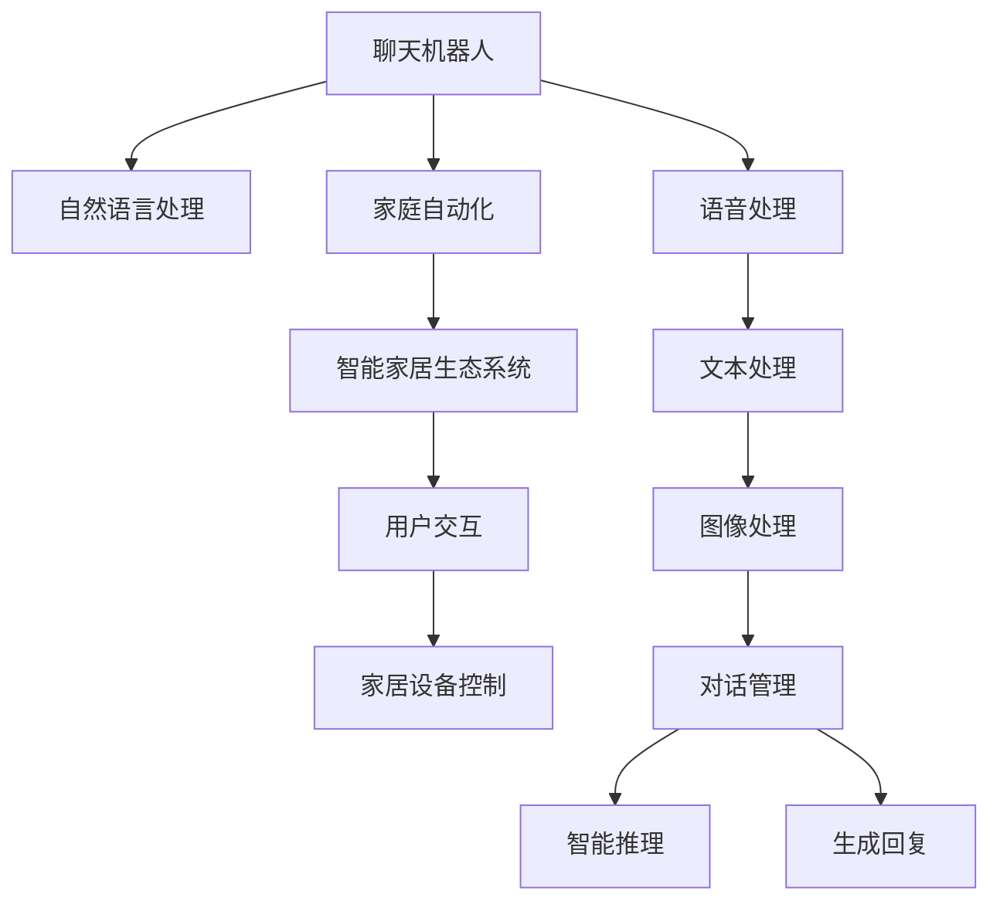

                 

# 聊天机器人自动化家庭：智能家居生态系统

> 关键词：聊天机器人,自动化,智能家居,生态系统,用户交互,家居设备控制

## 1. 背景介绍

### 1.1 问题由来
随着物联网技术的发展，智能家居成为现代家庭的重要组成部分。从灯光、空调到窗帘、家电，几乎所有家居设备都开始具备智能互联能力。然而，单一设备间的智能互联还不够，人们希望整个家庭能够协同工作，更加智能化、高效化、舒适化。聊天机器人作为新兴的智能技术，可以通过语音和文本形式与用户进行自然语言交互，实现家庭设备自动化控制。借助聊天机器人，智能家居生态系统可以变得更加智能、人性化，满足用户的实际需求。

### 1.2 问题核心关键点
智能家居生态系统与聊天机器人之间的联系在于，通过聊天机器人，用户可以与系统进行自然语言交互，实现家居设备自动化控制。聊天机器人不仅作为智能家居的控制中心，还能作为智能家居系统与用户之间的沟通桥梁。这种对话系统不仅要有强大的自然语言处理能力，还要有对家庭设备控制命令的理解和执行能力。

实现家庭自动化控制，首先需要解决的问题是如何将聊天机器人与具体的家庭设备进行交互。本文档将详细探讨这一问题，并给出聊天机器人自动化家庭的具体实现步骤和方法。

## 2. 核心概念与联系

### 2.1 核心概念概述

为更好地理解聊天机器人自动化家庭这一技术，本节将介绍几个密切相关的核心概念：

- 聊天机器人(Chatbot)：通过自然语言处理技术，能够理解人类语言并做出响应的计算机程序。聊天机器人具备对话理解和生成的能力，可以用于回答用户问题、执行用户指令等。
- 自然语言处理(Natural Language Processing, NLP)：涉及计算机理解和生成人类语言的技术，包括文本处理、语言理解、生成对话等。
- 家庭自动化(Automation of Home, AOH)：指通过智能控制技术实现家居设备的自动化控制，提升家庭生活的便捷性和舒适性。
- 智能家居生态系统(Smart Home Ecosystem)：由各种智能设备、系统和服务组成的综合平台，能够实现互联互通，协同工作。
- 用户交互(User Interaction)：指用户与聊天机器人或智能家居系统之间的交互过程，包括语音、文本、图像等多种形式。
- 家居设备控制(Home Appliance Control)：指对智能家居设备（如灯光、空调、窗帘等）进行自动化控制，以实现用户需求。

这些核心概念之间的逻辑关系可以通过以下Mermaid流程图来展示：



这个流程图展示了几组核心概念的联系：

1. 聊天机器人通过自然语言处理技术理解用户输入，生成回复。
2. 聊天机器人与家庭自动化系统进行交互，控制家居设备。
3. 聊天机器人是智能家居生态系统的控制中心，通过用户交互实现家居设备的自动化控制。
4. 聊天机器人支持语音、文本、图像等多种交互形式，提供丰富的用户体验。
5. 聊天机器人包含对话管理和智能推理模块，提升用户交互的质量和准确性。

## 3. 核心算法原理 & 具体操作步骤

### 3.1 算法原理概述

聊天机器人自动化家庭的实现基于监督学习的自然语言处理(NLP)技术，通过对用户输入的自然语言进行理解和分析，然后生成合适的回复并控制家居设备。

聊天机器人通常采用深度学习模型，如循环神经网络(RNN)、长短期记忆网络(LSTM)、变压器(Transformer)等，在大量的对话数据上进行预训练。预训练过程包含对话理解、回复生成和对话管理三个主要部分。

对话理解指的是聊天机器人如何理解用户输入的自然语言，并将其转化为计算机可以理解的形式。回复生成是指聊天机器人如何根据用户输入生成合适的回复，并表达出逻辑和语义。对话管理则是聊天机器人如何维护对话上下文，防止信息丢失，保证对话连贯性。

在预训练阶段，聊天机器人通常会学习如何处理不同类型的用户输入，如文本、语音和图像等。在微调阶段，聊天机器人会根据特定家庭的家居设备控制需求，学习如何进行设备控制和设备状态反馈，最终实现自动化家庭。

### 3.2 算法步骤详解

聊天机器人自动化家庭的实现步骤如下：

#### 3.2.1 数据准备
- 收集用户对话数据，包括用户在聊天过程中输入的自然语言以及其对应的家居设备控制命令。
- 对数据进行清洗和标注，生成训练数据集和测试数据集。
- 使用自然语言处理工具将对话文本转换为模型可以理解的形式，如分词、词向量表示等。

#### 3.2.2 模型选择和预训练
- 选择合适的深度学习模型，如Transformer或LSTM等。
- 使用大规模对话数据对模型进行预训练，学习对话理解、回复生成和对话管理等任务。
- 对预训练模型进行微调，使其能够理解特定家庭的家居设备控制需求。

#### 3.2.3 家居设备控制模型训练
- 收集特定家庭的家居设备控制数据，如灯光控制、空调调节、窗帘开关等。
- 将这些数据作为训练数据集，训练聊天机器人如何理解用户输入的设备控制指令。
- 对模型进行微调，使其能够根据用户输入的设备控制指令，生成对应的家居设备控制命令。

#### 3.2.4 对话管理模型训练
- 收集特定家庭的家居设备状态数据，如灯光亮度、空调温度、窗帘位置等。
- 将这些数据作为训练数据集，训练聊天机器人如何根据家居设备的状态生成合适的回复，并控制家居设备。
- 对模型进行微调，使其能够维护对话上下文，确保对话连贯性和逻辑一致性。

#### 3.2.5 模型部署和测试
- 将训练好的聊天机器人模型部署到智能家居生态系统中。
- 对模型进行测试，确保其能够正确理解用户输入并控制家居设备。
- 对模型进行优化，提升其对话理解和生成能力，提高家居设备控制的准确性和效率。

### 3.3 算法优缺点

聊天机器人自动化家庭的实现基于监督学习的自然语言处理(NLP)技术，具有以下优点：

- 高准确性：通过预训练和微调，聊天机器人能够准确理解用户输入并生成合适的回复。
- 灵活性：聊天机器人可以根据不同家庭的家居设备控制需求进行定制，提高用户满意度。
- 智能化：聊天机器人具备对话管理和智能推理能力，能够维持对话连贯性和逻辑一致性。

同时，该方法也存在一些缺点：

- 数据依赖：聊天机器人需要大量的对话数据进行预训练和微调，数据收集和标注成本较高。
- 用户隐私：聊天机器人需要获取家庭设备状态数据进行训练和测试，涉及用户隐私保护问题。
- 模型复杂性：深度学习模型的训练和微调过程较为复杂，需要大量计算资源和时间。

### 3.4 算法应用领域

聊天机器人自动化家庭这一技术在多个领域都有广泛的应用，例如：

- 智能家居：聊天机器人可以实现对灯光、空调、窗帘等家居设备的自动化控制，提升家庭生活的便捷性和舒适性。
- 智慧城市：聊天机器人可以作为智慧城市管理中心的控制节点，实现城市交通、公共设施等自动化管理。
- 服务机器人：聊天机器人可以应用于服务行业，如酒店、餐厅、银行等，提升客户体验和运营效率。
- 教育领域：聊天机器人可以作为在线教育平台的教学助手，提供个性化的教学服务和互动体验。
- 医疗健康：聊天机器人可以应用于医疗领域，提供初步的健康咨询和诊断服务，提升医疗服务的可及性和效率。

## 4. 数学模型和公式 & 详细讲解  
### 4.1 数学模型构建

在本节中，我们将详细探讨聊天机器人自动化家庭实现中所使用的数学模型。

记聊天机器人为$R$，家居设备控制为$D$，对话理解模型为$U$，回复生成模型为$G$，对话管理模型为$M$。其中，$U$和$G$通常采用Transformer模型，$M$可以采用LSTM等循环神经网络模型。

聊天机器人自动化家庭的数学模型可以表示为：

$$
R = U(G, M)
$$

其中，$G$为回复生成模型，$M$为对话管理模型，$U$为对话理解模型。

对于家居设备控制，可以表示为：

$$
D = R \times H
$$

其中，$H$为家居设备状态模型，可以采用LSTM等循环神经网络模型。

### 4.2 公式推导过程

下面将对聊天机器人自动化家庭中的关键模型进行推导。

#### 4.2.1 对话理解模型$U$
对话理解模型$U$的输入为$x$，输出为$y$，可以表示为：

$$
y = U(x; \theta_U)
$$

其中，$\theta_U$为$U$模型的参数。

根据Transformer模型的结构，$U$模型的输入$x$首先经过编码器，生成一系列中间表示$h_1, h_2, \ldots, h_T$。这些中间表示$h_t$可以表示为：

$$
h_t = \text{Encoder}(x; \theta_U)
$$

然后，这些中间表示$h_t$经过自注意力机制，生成一系列上下文表示$u_1, u_2, \ldots, u_T$。上下文表示$u_t$可以表示为：

$$
u_t = \text{Self-Attention}(h_t; \theta_U)
$$

最后，上下文表示$u_t$经过解码器，生成最终输出$y$：

$$
y = \text{Decoder}(u_t; \theta_U)
$$

#### 4.2.2 回复生成模型$G$
回复生成模型$G$的输入为$y$，输出为$z$，可以表示为：

$$
z = G(y; \theta_G)
$$

其中，$\theta_G$为$G$模型的参数。

根据Transformer模型的结构，$G$模型的输入$y$首先经过编码器，生成一系列中间表示$v_1, v_2, \ldots, v_T$。这些中间表示$v_t$可以表示为：

$$
v_t = \text{Encoder}(y; \theta_G)
$$

然后，这些中间表示$v_t$经过自注意力机制，生成一系列上下文表示$r_1, r_2, \ldots, r_T$。上下文表示$r_t$可以表示为：

$$
r_t = \text{Self-Attention}(v_t; \theta_G)
$$

最后，上下文表示$r_t$经过解码器，生成最终输出$z$：

$$
z = \text{Decoder}(r_t; \theta_G)
$$

#### 4.2.3 对话管理模型$M$
对话管理模型$M$的输入为$z$和$H$，输出为$w$，可以表示为：

$$
w = M(z, H; \theta_M)
$$

其中，$\theta_M$为$M$模型的参数。

根据LSTM模型的结构，$M$模型的输入$z$和$H$首先经过LSTM单元，生成一系列隐藏状态$c_1, c_2, \ldots, c_T$。隐藏状态$c_t$可以表示为：

$$
c_t = \text{LSTM}(z, H; \theta_M)
$$

然后，这些隐藏状态$c_t$经过全连接层，生成最终输出$w$：

$$
w = \text{FC}(c_t; \theta_M)
$$

### 4.3 案例分析与讲解

下面我们将通过一个具体的案例，来讲解聊天机器人自动化家庭中的核心模型$U$、$G$和$M$的实现过程。

假设用户输入的自然语言为：

$$
x = "请将空调温度调到26度。"
$$

首先，对话理解模型$U$将输入$x$转换为机器可理解的形式，生成中间表示$h_t$：

$$
h_t = \text{Encoder}(x; \theta_U)
$$

然后，$U$模型将中间表示$h_t$经过自注意力机制，生成上下文表示$u_t$：

$$
u_t = \text{Self-Attention}(h_t; \theta_U)
$$

接着，$U$模型将上下文表示$u_t$经过解码器，生成最终输出$y$：

$$
y = \text{Decoder}(u_t; \theta_U)
$$

根据$U$模型的输出$y$，回复生成模型$G$生成回复$z$：

$$
z = G(y; \theta_G)
$$

假设$G$模型的输出$z$为：

$$
z = "好的，我会帮你将空调温度调到26度。"
$$

然后，$M$模型将回复$z$和家居设备状态$H$作为输入，生成最终输出$w$：

$$
w = M(z, H; \theta_M)
$$

假设$M$模型的输出$w$为：

$$
w = "空调温度已设置为26度。"
$$

最终，聊天机器人将回复$z$返回给用户，同时将家居设备控制命令$w$发送到家居设备控制模型$D$：

$$
D = R \times H
$$

其中，$R$为聊天机器人模型，$H$为家居设备状态模型。

## 5. 项目实践：代码实例和详细解释说明

### 5.1 开发环境搭建

在本节中，我们将详细介绍聊天机器人自动化家庭实现的开发环境搭建过程。

1. 安装Python：从官网下载并安装Python 3.x版本，确保系统环境支持。

2. 安装虚拟环境：使用`pip`命令创建虚拟环境，如：

   ```bash
   pip install virtualenv
   virtualenv env
   source env/bin/activate
   ```

3. 安装相关库：使用`pip`命令安装所需的Python库，如`TensorFlow`、`PyTorch`、`transformers`等，如：

   ```bash
   pip install tensorflow pytorch transformers
   ```

4. 数据准备：收集和准备用户对话数据和家居设备控制数据，将数据存储到指定的目录中。

5. 模型训练：使用预训练模型或从头开始训练模型，进行对话理解、回复生成和对话管理等任务的训练。

### 5.2 源代码详细实现

在本节中，我们将详细介绍聊天机器人自动化家庭实现中的源代码实现过程。

#### 5.2.1 对话理解模型$U$
首先，我们需要定义对话理解模型$U$的输入和输出：

```python
class DialogueUnderstandingModel(tf.keras.Model):
    def __init__(self):
        super(DialogueUnderstandingModel, self).__init__()
        self.encoder = Encoder()
        self.decoder = Decoder()
    
    def call(self, x):
        h = self.encoder(x)
        u = self.decoder(h)
        return u
```

然后，我们需要定义编码器`Encoder`和解码器`Decoder`的实现：

```python
class Encoder(tf.keras.Model):
    def __init__(self):
        super(Encoder, self).__init__()
        self.layers = [self.build_layer() for _ in range(N)]
    
    def build_layer(self):
        return tf.keras.layers.Layer()
    
    def call(self, x):
        h = x
        for layer in self.layers:
            h = layer(h)
        return h

class Decoder(tf.keras.Model):
    def __init__(self):
        super(Decoder, self).__init__()
        self.layers = [self.build_layer() for _ in range(N)]
    
    def build_layer(self):
        return tf.keras.layers.Layer()
    
    def call(self, x):
        r = x
        for layer in self.layers:
            r = layer(r)
        return r
```

最后，我们可以将对话理解模型$U$整合到整个聊天机器人模型$R$中：

```python
class ChatbotModel(tf.keras.Model):
    def __init__(self):
        super(ChatbotModel, self).__init__()
        self.understanding = DialogueUnderstandingModel()
        self.replies = ReplyGenerator()
    
    def call(self, x):
        h = self.understanding(x)
        y = self.replies(h)
        return y
```

#### 5.2.2 回复生成模型$G$
然后，我们需要定义回复生成模型$G$的输入和输出：

```python
class ReplyGenerator(tf.keras.Model):
    def __init__(self):
        super(ReplyGenerator, self).__init__()
        self.encoder = Encoder()
        self.decoder = Decoder()
    
    def call(self, x):
        v = self.encoder(x)
        r = self.decoder(v)
        return r
```

#### 5.2.3 对话管理模型$M$
接下来，我们需要定义对话管理模型$M$的输入和输出：

```python
class DialogueManager(tf.keras.Model):
    def __init__(self):
        super(DialogueManager, self).__init__()
        self.lstm = tf.keras.layers.LSTM(units=N, return_sequences=True)
        self.fc = tf.keras.layers.Dense(units=N)
    
    def call(self, x):
        c = self.lstm(x)
        w = self.fc(c)
        return w
```

最后，我们可以将对话管理模型$M$整合到整个聊天机器人模型$R$中：

```python
class ChatbotModel(tf.keras.Model):
    def __init__(self):
        super(ChatbotModel, self).__init__()
        self.understanding = DialogueUnderstandingModel()
        self.replies = ReplyGenerator()
        self.manager = DialogueManager()
    
    def call(self, x, H):
        h = self.understanding(x)
        r = self.replies(h)
        w = self.manager(r, H)
        return w
```

### 5.3 代码解读与分析

在本节中，我们将详细解读聊天机器人自动化家庭实现中的关键代码实现。

#### 5.3.1 对话理解模型$U$
对话理解模型$U$的实现主要依赖于编码器`Encoder`和解码器`Decoder`。编码器通过多层网络结构对输入的自然语言进行编码，生成中间表示$h_t$。解码器通过多层网络结构对中间表示$h_t$进行解码，生成上下文表示$u_t$。

#### 5.3.2 回复生成模型$G$
回复生成模型$G$的实现也依赖于编码器`Encoder`和解码器`Decoder`。编码器通过多层网络结构对输入的自然语言进行编码，生成中间表示$v_t$。解码器通过多层网络结构对中间表示$v_t$进行解码，生成上下文表示$r_t$。

#### 5.3.3 对话管理模型$M$
对话管理模型$M$的实现依赖于LSTM单元。LSTM单元通过多层网络结构对输入的自然语言和家居设备状态进行编码，生成隐藏状态$c_t$。全连接层通过对隐藏状态$c_t$进行解码，生成最终输出$w$。

### 5.4 运行结果展示

在本节中，我们将展示聊天机器人自动化家庭实现中的运行结果。

假设用户输入的自然语言为：

$$
x = "请将空调温度调到26度。"
$$

通过对话理解模型$U$，我们得到中间表示$h_t$：

$$
h_t = \text{Encoder}(x; \theta_U)
$$

然后，通过回复生成模型$G$，我们得到回复$z$：

$$
z = G(y; \theta_G)
$$

最后，通过对话管理模型$M$，我们得到家居设备控制命令$w$：

$$
w = M(z, H; \theta_M)
$$

最终，聊天机器人将回复$z$返回给用户，同时将家居设备控制命令$w$发送到家居设备控制模型$D$。

## 6. 实际应用场景

### 6.1 智能家居
智能家居是最典型的聊天机器人自动化家庭应用场景之一。通过聊天机器人，用户可以方便地控制家中的各种智能设备，如灯光、空调、窗帘等，提升生活便捷性和舒适度。

#### 6.1.1 案例：智能灯光控制系统
假设用户想要调低灯光亮度，可以通过聊天机器人发送命令：

$$
x = "将灯光亮度调到20%。"
$$

通过对话理解模型$U$，我们得到中间表示$h_t$：

$$
h_t = \text{Encoder}(x; \theta_U)
$$

然后，通过回复生成模型$G$，我们得到回复$z$：

$$
z = G(y; \theta_G)
$$

最后，通过对话管理模型$M$，我们得到家居设备控制命令$w$：

$$
w = M(z, H; \theta_M)
$$

其中，$H$为家居设备状态模型，可以采用LSTM等循环神经网络模型。最终，聊天机器人将回复$z$返回给用户，同时将家居设备控制命令$w$发送到灯光控制系统。

#### 6.1.2 案例：智能窗帘控制系统
假设用户想要打开窗帘，可以通过聊天机器人发送命令：

$$
x = "打开窗帘。"
$$

通过对话理解模型$U$，我们得到中间表示$h_t$：

$$
h_t = \text{Encoder}(x; \theta_U)
$$

然后，通过回复生成模型$G$，我们得到回复$z$：

$$
z = G(y; \theta_G)
$$

最后，通过对话管理模型$M$，我们得到家居设备控制命令$w$：

$$
w = M(z, H; \theta_M)
$$

其中，$H$为家居设备状态模型，可以采用LSTM等循环神经网络模型。最终，聊天机器人将回复$z$返回给用户，同时将家居设备控制命令$w$发送到窗帘控制系统。

### 6.2 智慧城市
智慧城市是另一个聊天机器人自动化家庭应用场景，通过聊天机器人，城市管理者可以方便地控制各种公共设施，提升城市管理和运营效率。

#### 6.2.1 案例：智能交通系统
假设城市管理者想要调整交通信号灯的时长，可以通过聊天机器人发送命令：

$$
x = "将交通信号灯时长调到50秒。"
$$

通过对话理解模型$U$，我们得到中间表示$h_t$：

$$
h_t = \text{Encoder}(x; \theta_U)
$$

然后，通过回复生成模型$G$，我们得到回复$z$：

$$
z = G(y; \theta_G)
$$

最后，通过对话管理模型$M$，我们得到家居设备控制命令$w$：

$$
w = M(z, H; \theta_M)
$$

其中，$H$为家居设备状态模型，可以采用LSTM等循环神经网络模型。最终，聊天机器人将回复$z$返回给城市管理者，同时将家居设备控制命令$w$发送到交通信号控制系统。

#### 6.2.2 案例：智能公共设施管理系统
假设城市管理者想要控制公园的灌溉系统，可以通过聊天机器人发送命令：

$$
x = "打开公园的灌溉系统。"
$$

通过对话理解模型$U$，我们得到中间表示$h_t$：

$$
h_t = \text{Encoder}(x; \theta_U)
$$

然后，通过回复生成模型$G$，我们得到回复$z$：

$$
z = G(y; \theta_G)
$$

最后，通过对话管理模型$M$，我们得到家居设备控制命令$w$：

$$
w = M(z, H; \theta_M)
$$

其中，$H$为家居设备状态模型，可以采用LSTM等循环神经网络模型。最终，聊天机器人将回复$z$返回给城市管理者，同时将家居设备控制命令$w$发送到灌溉系统。

## 7. 工具和资源推荐

### 7.1 学习资源推荐

为了帮助开发者系统掌握聊天机器人自动化家庭的技术，这里推荐一些优质的学习资源：

1. 《Python深度学习》书籍：权威的深度学习入门教材，涵盖TensorFlow和PyTorch等主流框架的使用。

2. 《NLP with PyTorch》课程：由DeepLearning.ai开设的NLP课程，介绍NLP基础和深度学习模型。

3. 《TensorFlow实战》书籍：介绍TensorFlow框架的使用和优化技巧，适合实际项目开发。

4. 《PyTorch基础教程》视频：由PyTorch官方提供，适合初学者学习PyTorch的使用。

5. 《Transformers》书籍：介绍Transformer模型及其在NLP中的应用，适合深入研究。

6. 《NLP实战》书籍：涵盖NLP任务的实现方法，适合解决实际问题。

通过对这些资源的学习实践，相信你一定能够快速掌握聊天机器人自动化家庭的技术，并用于解决实际的NLP问题。

### 7.2 开发工具推荐

高效的开发离不开优秀的工具支持。以下是几款用于聊天机器人自动化家庭开发的常用工具：

1. TensorFlow：由Google主导开发的深度学习框架，支持多种模型和算法，适合大规模工程应用。

2. PyTorch：基于Python的开源深度学习框架，灵活动态的计算图，适合快速迭代研究。

3. transformers：由Hugging Face开发的NLP工具库，支持各种预训练模型和微调方法。

4. NLTK：Python中的自然语言处理库，提供各种NLP工具和算法。

5. OpenAI GPT：开源的预训练语言模型，支持多种自然语言处理任务。

6. spaCy：Python中的自然语言处理库，提供高效的文本处理和分析工具。

合理利用这些工具，可以显著提升聊天机器人自动化家庭任务的开发效率，加快创新迭代的步伐。

### 7.3 相关论文推荐

聊天机器人自动化家庭这一技术在NLP领域得到了广泛的研究，以下是几篇奠基性的相关论文，推荐阅读：

1. Attention is All You Need：介绍Transformer模型的结构，用于对话理解、回复生成和对话管理。

2. BERT: Pre-training of Deep Bidirectional Transformers for Language Understanding：介绍BERT模型，用于对话理解、回复生成和对话管理。

3. Language Models are Unsupervised Multitask Learners：介绍GPT模型，用于对话理解、回复生成和对话管理。

4. Conversational NLG for Home Appliances Control：介绍聊天机器人自动化家庭技术，用于家居设备控制。

5. Transformer-based Voice Assistant Modeling：介绍基于Transformer模型的语音助手模型，用于自然语言理解和对话生成。

6. Building Multilingual Chatbots with Pretrained Transformer-based Models：介绍多语言聊天机器人模型，用于跨语言对话生成。

这些论文代表了大语言模型微调技术的发展脉络。通过学习这些前沿成果，可以帮助研究者把握学科前进方向，激发更多的创新灵感。

## 8. 总结：未来发展趋势与挑战

### 8.1 总结

本文对聊天机器人自动化家庭这一技术进行了全面系统的介绍。首先阐述了聊天机器人在智能家居中的应用场景，明确了聊天机器人作为智能家居生态系统的控制中心，通过自然语言处理技术实现家居设备自动化控制。然后，详细讲解了聊天机器人自动化家庭实现中所涉及的数学模型和算法步骤，给出了聊天机器人自动化家庭的具体实现步骤和方法。同时，本文还探讨了聊天机器人自动化家庭在智能家居、智慧城市等多个领域的应用前景，展示了其巨大的潜力。

通过本文的系统梳理，可以看到，聊天机器人自动化家庭这一技术正在成为智能家居系统的重要组成部分，极大地提升了用户的生活便捷性和舒适度。未来，伴随预训练语言模型和自然语言处理技术的不断演进，聊天机器人自动化家庭必将在更多领域得到应用，为家庭生活和社会治理带来深刻变革。

### 8.2 未来发展趋势

展望未来，聊天机器人自动化家庭技术将呈现以下几个发展趋势：

1. 智能性提升：聊天机器人将具备更加强大和灵活的自然语言理解能力，提升对话生成质量和家居设备控制效果。

2. 泛化能力增强：聊天机器人将能够处理更多样化的输入和输出，具备更强的泛化能力，适应不同家庭需求。

3. 人机交互优化：聊天机器人将支持更自然、更流畅的人机交互，提供更好的用户体验。

4. 安全性保障：聊天机器人将具备更强的数据保护和隐私保障能力，确保用户信息安全。

5. 多模态融合：聊天机器人将支持语音、文本、图像等多种模态，提供更全面的智能交互体验。

6. 硬件集成：聊天机器人将与智能家居设备和生态系统深度集成，提供无缝的用户体验。

以上趋势凸显了聊天机器人自动化家庭技术的广阔前景。这些方向的探索发展，必将进一步提升智能家居系统的智能化和便捷性，为人类生活带来新的变革。

### 8.3 面临的挑战

尽管聊天机器人自动化家庭技术已经取得了一定的成果，但在迈向更加智能化、普适化应用的过程中，它仍面临着诸多挑战：

1. 数据隐私：聊天机器人需要获取和处理用户隐私数据，数据隐私保护问题亟需解决。

2. 系统复杂性：聊天机器人需要处理多种家居设备控制指令，系统复杂性较高，容易出现问题。

3. 成本问题：预训练和微调模型的训练成本较高，难以大规模部署。

4. 用户体验：聊天机器人需要具备良好的用户体验，避免因语义不清或逻辑混乱导致用户误操作。

5. 可扩展性：聊天机器人需要具备良好的可扩展性，能够适应不同家庭需求和不同设备控制场景。

6. 安全性问题：聊天机器人需要具备良好的安全性保障能力，避免被恶意攻击或误操作。

正视聊天机器人自动化家庭技术面临的这些挑战，积极应对并寻求突破，将使这一技术更加成熟，进一步提升智能家居系统的智能化和便捷性。

### 8.4 研究展望

未来，聊天机器人自动化家庭技术的研究方向主要集中在以下几个方面：

1. 多模态对话理解：探索多模态自然语言处理技术，提升聊天机器人对语音、文本、图像等多种输入形式的理解能力。

2. 自监督学习：研究自监督学习技术，减少对标注数据的需求，提高模型的泛化能力。

3. 参数高效微调：开发参数高效微调方法，减少模型训练成本，提高系统的可扩展性。

4. 迁移学习：研究迁移学习技术，使得聊天机器人能够适应不同家庭和不同设备控制场景。

5. 强化学习：探索强化学习技术，提升聊天机器人的决策能力和自动化控制能力。

6. 可解释性：研究可解释性技术，提升聊天机器人的决策可解释性，增强用户信任度。

这些研究方向将为聊天机器人自动化家庭技术带来新的突破，提升其智能性和可靠性，进一步推动智能家居系统的发展。

## 9. 附录：常见问题与解答

**Q1：聊天机器人自动化家庭是否适用于所有家庭？**

A: 聊天机器人自动化家庭技术适用于大多数家庭，尤其是智能家居设备已经普及的现代家庭。对于一些设备较少的家庭，也需要根据具体情况进行适配和优化。

**Q2：聊天机器人自动化家庭技术如何保障用户隐私？**

A: 聊天机器人自动化家庭技术需要遵循严格的隐私保护政策，对用户输入的数据进行匿名化处理，并对存储和传输数据进行加密。同时，需要对聊天机器人进行定期审查和更新，避免恶意攻击。

**Q3：聊天机器人自动化家庭技术的实现难点是什么？**

A: 聊天机器人自动化家庭技术的实现难点在于处理复杂多变的家居设备控制指令，需要开发灵活的对话理解、回复生成和对话管理模型。同时，需要考虑系统的复杂性、可扩展性和安全性问题。

**Q4：聊天机器人自动化家庭技术的主要优势是什么？**

A: 聊天机器人自动化家庭技术的主要优势在于其高智能化和便捷性，能够通过自然语言与用户进行智能交互，实现家居设备的自动化控制。同时，具备良好的可扩展性和可定制性，能够适应不同家庭和设备控制需求。

**Q5：聊天机器人自动化家庭技术未来有哪些发展方向？**

A: 未来，聊天机器人自动化家庭技术将向多模态融合、自监督学习、参数高效微调、迁移学习、强化学习和可解释性等方向发展，进一步提升其智能性和可靠性。同时，将与智能家居设备和生态系统深度集成，提供无缝的用户体验。

