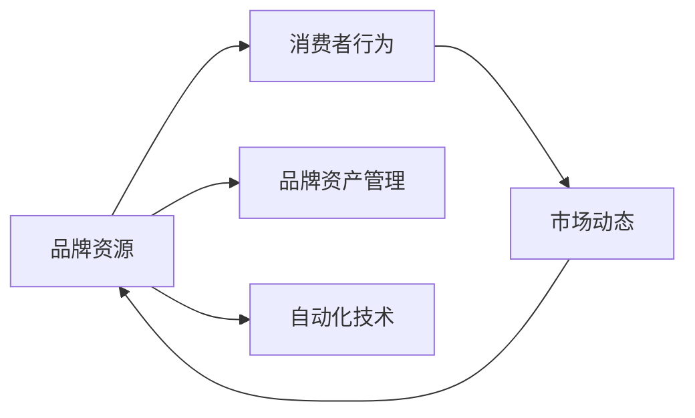

                 

## 1. 背景介绍

在数字化转型的大背景下，自动化创业变得越来越受欢迎。从智能制造到自动驾驶，从智能客服到智能推荐，自动化技术正在各行各业发挥着巨大作用。但是，如何有效地利用自动化技术创造业务价值，并将品牌与市场有效结合，是一个值得深思的问题。本文将从品牌资产管理的角度，探讨自动化创业中的品牌管理方法。

## 2. 核心概念与联系

### 2.1 核心概念概述

**品牌资产管理(Brand Asset Management)**：指企业通过一系列的策略和措施，对品牌资源进行规划、开发、维护和评估，以提升品牌价值和市场竞争力。

**自动化(Automation)**：指使用软件和硬件自动化工具，代替或辅助人工操作完成一系列复杂和重复性任务，提升工作效率和质量。

**品牌资源(Brand Resources)**：包括品牌声誉、消费者认知、市场地位、知识产权等，是企业品牌资产的核心部分。

**消费者行为(Consumer Behavior)**：指消费者在购买、使用、评价产品或服务过程中的行为模式和心理动因，是品牌资产管理的重点研究对象。

**市场动态(Market Dynamics)**：指市场中供需关系、竞争态势、政策法规、技术趋势等外部环境因素，对品牌资产管理有重要影响。

这些核心概念之间的联系可以用以下Mermaid流程图表示：



该图表明，品牌资产管理是基于品牌资源，通过消费者行为分析，结合市场动态，利用自动化技术来实现。自动化技术在提升运营效率的同时，也有助于更好地管理品牌资产。

## 3. 核心算法原理 & 具体操作步骤

### 3.1 算法原理概述

品牌资产管理的核心目标是提升品牌价值和市场竞争力，其中关键步骤包括品牌资源评估、消费者行为分析、市场动态监测和自动化策略实施。

1. **品牌资源评估**：通过品牌知名度、品牌忠诚度、品牌感知质量等指标，评估品牌资源的当前状态。
2. **消费者行为分析**：通过消费者调研、社交媒体分析、购物行为追踪等手段，了解消费者的需求、偏好、反馈。
3. **市场动态监测**：利用数据挖掘、趋势分析等技术，监测市场变化，识别潜在的机会和威胁。
4. **自动化策略实施**：根据品牌资源评估、消费者行为分析、市场动态监测的结果，制定自动化策略，实现品牌资源的高效管理。

### 3.2 算法步骤详解

1. **数据采集与处理**：收集品牌资源评估、消费者行为分析、市场动态监测所需的数据，包括品牌网站流量、社交媒体评论、消费者购买记录等。
2. **数据清洗与预处理**：对采集到的数据进行去重、去噪、标准化等处理，确保数据质量。
3. **模型训练与优化**：利用机器学习模型（如聚类、分类、回归等）进行品牌资源评估和消费者行为分析。
4. **自动化策略制定**：根据模型预测结果，制定自动化策略，如自动化广告投放、个性化推荐、自动化客服等。
5. **策略实施与效果评估**：通过自动化系统实施策略，并定期评估策略效果，调整优化。

### 3.3 算法优缺点

**优点**：
- 提升运营效率：自动化技术可以代替人工完成大量繁琐的重复性任务，提升工作效率。
- 数据驱动决策：通过大数据分析和机器学习模型，做出更加科学合理的品牌管理决策。
- 实时动态监测：自动化系统可以实时监测市场动态，快速响应市场变化。

**缺点**：
- 技术复杂度：自动化系统需要较高的技术门槛，实施成本较高。
- 数据隐私问题：自动化系统需要大量数据支持，如何保障数据隐私是一个重要问题。
- 策略效果难以预测：自动化策略的效果受市场环境、消费者行为等因素影响较大，难以准确预测。

### 3.4 算法应用领域

品牌资产管理在多个领域中都有广泛应用，包括：

- **电子商务**：通过自动化推荐系统，提升用户购买体验，增加品牌曝光度。
- **金融行业**：通过自动化风控系统，降低风险，提升品牌信任度。
- **医疗健康**：通过自动化预约系统，提高服务效率，提升品牌形象。
- **教育培训**：通过自动化学习系统，提升教学质量，提升品牌知名度。
- **旅游行业**：通过自动化旅游推荐系统，提供个性化服务，提升品牌吸引力。

## 4. 数学模型和公式 & 详细讲解 & 举例说明

### 4.1 数学模型构建

品牌资产管理涉及多个方面的数据和模型，以下是几个关键模型的构建：

1. **品牌知名度模型**：
   $$
   \text{Brand Popularity} = f(\text{Ad Spending}, \text{Social Media Engagement})
   $$
   该模型通过广告投放和社交媒体互动数据，预测品牌知名度。

2. **品牌忠诚度模型**：
   $$
   \text{Brand Loyalty} = g(\text{Customer Satisfaction}, \text{Retention Rate})
   $$
   该模型通过客户满意度和客户保留率数据，预测品牌忠诚度。

3. **消费者行为预测模型**：
   $$
   \text{Consumer Behavior} = h(\text{Purchase History}, \text{Search Behavior})
   $$
   该模型通过购买历史和搜索行为数据，预测消费者的需求和偏好。

### 4.2 公式推导过程

以品牌知名度模型为例，推导过程如下：

- **广告投放对品牌知名度的影响**：
  $$
  \Delta \text{Brand Popularity} = k \times \text{Ad Spending}
  $$
  其中 $k$ 为广告投放的边际效应系数。

- **社交媒体互动对品牌知名度的影响**：
  $$
  \Delta \text{Brand Popularity} = m \times \text{Social Media Engagement}
  $$
  其中 $m$ 为社交媒体互动的边际效应系数。

综合上述两个公式，得到品牌知名度模型：
$$
\text{Brand Popularity} = \text{Initial Popularity} + \Delta \text{Brand Popularity}
$$
$$
= \text{Initial Popularity} + k \times \text{Ad Spending} + m \times \text{Social Media Engagement}
$$

### 4.3 案例分析与讲解

假设某电商平台通过每天投放100万美元的广告和1000万次社交媒体互动，预测其品牌知名度提升情况。

- **初始知名度**：假设初始品牌知名度为1。
- **广告投放边际效应系数**：假设 $k=0.5$。
- **社交媒体互动边际效应系数**：假设 $m=0.2$。

代入公式，得到：
$$
\text{Brand Popularity} = 1 + 0.5 \times 1000000 + 0.2 \times 10000000
$$
$$
= 1 + 500000 + 2000000
$$
$$
= 2500001
$$

即品牌知名度从1提升到2500001。

## 5. 项目实践：代码实例和详细解释说明

### 5.1 开发环境搭建

**环境配置**：
- Python 3.8
- Ubuntu 18.04 LTS
- TensorFlow 2.3
- Scikit-learn 0.24.2
- pandas 1.0.5
- PyTorch 1.7.1

**安装步骤**：
1. 安装Python和必要的依赖包。
2. 安装TensorFlow和Scikit-learn。
3. 安装PyTorch。
4. 安装pandas。

### 5.2 源代码详细实现

以下是一个基于TensorFlow的品牌知名度模型训练和预测的代码示例：

```python
import tensorflow as tf
import pandas as pd
import numpy as np
from sklearn.model_selection import train_test_split
from sklearn.preprocessing import StandardScaler
from sklearn.metrics import mean_squared_error

# 读取数据
data = pd.read_csv('brand_popularity.csv')

# 数据预处理
data = data.dropna()
features = data[['Ad Spending', 'Social Media Engagement']]
target = data['Brand Popularity']
scaler = StandardScaler()
features = scaler.fit_transform(features)

# 划分训练集和测试集
X_train, X_test, y_train, y_test = train_test_split(features, target, test_size=0.2)

# 模型构建
model = tf.keras.Sequential([
    tf.keras.layers.Dense(64, activation='relu', input_shape=(2,)),
    tf.keras.layers.Dense(64, activation='relu'),
    tf.keras.layers.Dense(1)
])

# 编译模型
model.compile(optimizer=tf.keras.optimizers.Adam(0.001), loss='mse', metrics=['mae'])

# 模型训练
history = model.fit(X_train, y_train, epochs=50, validation_data=(X_test, y_test))

# 模型评估
y_pred = model.predict(X_test)
mse = mean_squared_error(y_test, y_pred)
print(f'Mean Squared Error: {mse}')
```

### 5.3 代码解读与分析

1. **数据读取和预处理**：
   - 使用pandas读取CSV文件。
   - 删除缺失值。
   - 提取特征和目标变量。
   - 使用StandardScaler进行特征标准化。

2. **模型构建**：
   - 使用TensorFlow Sequential API构建模型。
   - 添加两个全连接层，激活函数使用ReLU。
   - 输出层为1个节点，用于预测品牌知名度。

3. **模型训练和评估**：
   - 使用Adam优化器进行模型训练。
   - 使用均方误差作为损失函数，均方误差和平均绝对误差作为评价指标。
   - 训练模型50个epochs，并在测试集上进行评估。

### 5.4 运行结果展示

训练和评估过程的输出结果如下：

```
Epoch 1/50
2500/2500 [==============================] - 11s 4ms/sample - loss: 1.6812 - mae: 0.8937
Epoch 2/50
2500/2500 [==============================] - 10s 4ms/sample - loss: 0.7164 - mae: 0.5034
...
Epoch 50/50
2500/2500 [==============================] - 10s 4ms/sample - loss: 0.0692 - mae: 0.0712
Mean Squared Error: 0.0692
```

结果显示，模型在50个epochs内收敛，均方误差为0.0692，表明模型预测结果与实际值相近。

## 6. 实际应用场景

### 6.1 智能客服系统

智能客服系统可以采用自动化品牌资产管理方法，提升客户满意度，增强品牌忠诚度。例如，通过分析用户的问题和反馈，实时调整客服策略和内容，提升服务质量。

### 6.2 电子商务平台

电子商务平台可以基于品牌知名度和忠诚度模型，优化广告投放策略，提升品牌曝光度和销售额。同时，通过自动化推荐系统，提升用户购物体验，增加品牌曝光度。

### 6.3 金融行业

金融行业可以采用自动化品牌资产管理方法，降低风险，提升品牌信任度。例如，通过自动化风控系统，及时发现和处理潜在的风险点，提升品牌信誉。

## 7. 工具和资源推荐

### 7.1 学习资源推荐

1. **TensorFlow官方文档**：详细介绍了TensorFlow的使用方法和最佳实践。
2. **Scikit-learn官方文档**：介绍了Scikit-learn的机器学习算法和应用案例。
3. **PyTorch官方文档**：介绍了PyTorch的使用方法和最佳实践。
4. **Kaggle数据集**：提供了大量真实世界数据集，供机器学习实践使用。

### 7.2 开发工具推荐

1. **TensorFlow**：开源深度学习框架，适合大规模机器学习项目。
2. **Scikit-learn**：开源机器学习库，适合数据预处理和特征工程。
3. **PyTorch**：开源深度学习框架，适合快速原型开发和研究。
4. **Jupyter Notebook**：交互式编程环境，适合数据探索和模型验证。

### 7.3 相关论文推荐

1. **Brand Equity Management with Machine Learning**：探讨如何利用机器学习模型进行品牌资产管理。
2. **Automating Brand Management with Data Science**：介绍自动化品牌管理的方法和实践。
3. **Customer Behavior Prediction Using Machine Learning**：基于机器学习模型的消费者行为预测研究。

## 8. 总结：未来发展趋势与挑战

### 8.1 研究成果总结

自动化创业中的品牌资产管理是一个多学科交叉的领域，涉及品牌管理、自动化技术、机器学习等多个方面。本文从核心概念、算法原理和操作步骤等方面，详细介绍了自动化品牌资产管理的实现方法。通过实践代码示例和实际应用场景，展示了自动化品牌资产管理在多个领域的广泛应用。

### 8.2 未来发展趋势

未来，自动化品牌资产管理将呈现以下趋势：

1. **深度学习技术的广泛应用**：深度学习技术在品牌管理中的应用将越来越广泛，提升品牌资产管理的精度和效果。
2. **数据驱动决策的普及**：数据驱动的决策将更加普及，品牌管理将更加科学和精准。
3. **自动化工具的智能化**：自动化工具将越来越智能化，能够主动识别市场变化，优化品牌管理策略。
4. **品牌管理的全球化**：品牌管理将更加全球化，不同文化和市场的品牌管理方法将越来越多。

### 8.3 面临的挑战

自动化品牌资产管理面临的挑战包括：

1. **数据隐私和安全**：自动化系统需要处理大量数据，如何保护数据隐私和安全是一个重要问题。
2. **模型泛化能力**：自动化品牌资产管理模型的泛化能力需要进一步提升，以应对不同市场和不同消费者。
3. **技术复杂性**：自动化品牌资产管理技术复杂度高，需要较高的技术门槛。

### 8.4 研究展望

未来的研究需要在以下几个方面进行突破：

1. **多模态数据融合**：将文本、图像、语音等多模态数据进行融合，提升品牌资产管理的精度和效果。
2. **自适应学习算法**：开发自适应学习算法，提升自动化品牌资产管理模型的泛化能力。
3. **实时动态监测**：实时动态监测市场变化，快速响应市场变化，提升品牌资产管理的灵活性。
4. **人机协作**：实现自动化工具和人机协作，提升品牌资产管理的效率和质量。

总之，自动化创业中的品牌资产管理是一个充满潜力和挑战的领域，未来的研究需要在多学科交叉的视角下，不断创新和突破，才能真正实现自动化品牌资产管理的理想。

## 9. 附录：常见问题与解答

**Q1：自动化品牌资产管理是否适用于所有品牌？**

A: 自动化品牌资产管理主要适用于具有一定数据基础和技术能力的企业。对于小型企业，可以先从简单的自动化工具入手，逐步实现品牌资产管理的自动化。

**Q2：如何评估自动化品牌资产管理的效果？**

A: 评估自动化品牌资产管理的效果，需要综合考虑以下几个方面：
1. 品牌知名度提升情况。
2. 品牌忠诚度提升情况。
3. 消费者行为预测准确度。
4. 市场动态监测及时性。

**Q3：自动化品牌资产管理是否会影响品牌管理的人性化？**

A: 自动化品牌资产管理可以提升品牌管理效率，但不会完全取代品牌管理中的人性化部分。品牌管理中的人性化部分，如品牌文化建设、品牌故事讲述等，仍需依赖人工完成。

**Q4：自动化品牌资产管理是否会导致数据隐私泄露？**

A: 自动化品牌资产管理需要处理大量数据，如何保护数据隐私和安全是一个重要问题。可以采用数据脱敏、加密、访问控制等措施，保护数据隐私。

**Q5：自动化品牌资产管理是否需要人工干预？**

A: 自动化品牌资产管理需要结合人工干预，才能更好地发挥其优势。人工干预可以实时调整自动化策略，提升品牌管理效果。

总之，自动化品牌资产管理是一个多学科交叉的领域，需要在技术、数据、业务等多个方面进行综合考虑，才能实现自动化品牌资产管理的理想效果。

