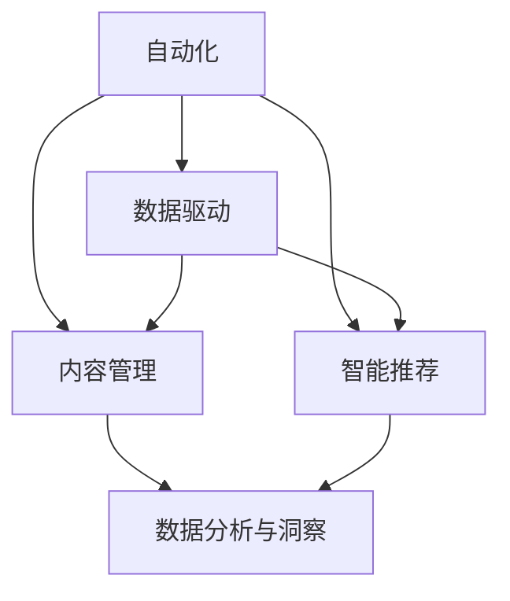

                 

# 自动化创业中的社交媒体运营

## 1. 背景介绍

### 1.1 问题由来

在数字化转型的大潮中，社交媒体运营已成为现代企业核心竞争力之一。然而，传统的手工运营方式费时费力，且效果不稳定。自动化技术的高速发展为社交媒体运营注入了新活力。利用自动化工具，企业可以大幅提升运营效率，降低成本，同时产出更多高价值内容。

### 1.2 问题核心关键点

社交媒体自动化运营的核心在于，通过数据驱动的算法和智能工具，实现内容的自动生成、分发与优化。具体来说，关键点包括：

- 内容自动化生成：利用自然语言处理(NLP)、计算机视觉(CV)等技术，自动生成或推荐高相关性内容。
- 数据分析与洞察：通过数据挖掘和大数据分析，提炼用户行为、兴趣和偏好，以指导内容策略。
- 分发优化：根据用户行为、时间、地域等特征，智能推荐分发内容，提升用户参与度。
- 社交互动：利用聊天机器人、智能客服等工具，提升用户互动体验，解决用户疑问。

### 1.3 问题研究意义

自动化社交媒体运营不仅能节省大量人力成本，同时能提升运营效率和效果。具体意义包括：

- 提升内容质量：自动化工具可以实时生成、优化内容，确保内容紧跟热点，提升用户参与度。
- 提高运营效率：自动化工具能高效处理海量数据，减少人工操作，加快内容发布与反馈循环。
- 增强互动体验：通过智能客服、自动化推荐等功能，提升用户互动体验，促进用户留存和转化。
- 降低运营成本：自动化工具减少了人力和物力成本，让企业以更低的成本获得更高的效益。

## 2. 核心概念与联系

### 2.1 核心概念概述

为更好地理解自动化社交媒体运营方法，本节将介绍几个密切相关的核心概念：

- 自动化(Automation)：通过算法和智能工具，实现自动化执行某一过程或任务，减少人工干预。
- 数据驱动(Datadriven)：利用数据挖掘、机器学习等技术，以数据为依据进行决策和优化。
- 内容管理(Content Management)：对企业发布在社交媒体上的各类内容进行集中管理和优化。
- 智能推荐(Recommendation)：利用算法模型，根据用户行为和偏好，自动推荐相关内容。
- 数据分析与洞察(Analytics)：通过对社交媒体数据的分析，提炼用户行为、兴趣和偏好。

这些核心概念之间的逻辑关系可以通过以下Mermaid流程图来展示：



这个流程图展示了几大核心概念及其之间的关系：

1. 自动化通过算法和工具实现任务的自动化执行。
2. 数据驱动利用数据和算法进行决策和优化。
3. 内容管理集中管理和优化企业内容。
4. 智能推荐根据用户行为和偏好，自动推荐内容。
5. 数据分析与洞察通过分析数据，提炼用户行为和偏好。

这些核心概念共同构成了自动化社交媒体运营的基础框架，使其能够高效、准确地实现运营目标。

## 3. 核心算法原理 & 具体操作步骤

### 3.1 算法原理概述

自动化社交媒体运营的本质是通过算法和智能工具，实现内容的自动生成、分发与优化。其核心思想是：利用大数据和机器学习技术，对社交媒体数据进行分析和挖掘，提炼出用户行为和偏好，以指导内容生成和分发策略。

具体而言，可以分为以下几个步骤：

1. **数据收集与清洗**：从社交媒体平台收集用户互动数据，包括点赞、评论、分享等行为。
2. **内容生成**：利用NLP技术自动生成或推荐相关内容，如自动生成新闻、摘要、图片等。
3. **数据分析与洞察**：通过对用户互动数据的分析，提炼用户兴趣、行为和偏好，以指导内容生成和分发策略。
4. **内容分发**：根据用户行为、时间、地域等特征，智能推荐分发内容，提升用户参与度。
5. **互动优化**：利用聊天机器人、智能客服等工具，提升用户互动体验，解决用户疑问。

### 3.2 算法步骤详解

以下是自动化社交媒体运营的详细步骤：

**Step 1: 数据收集与清洗**
- 使用API工具从社交媒体平台抓取用户互动数据，包括点赞、评论、分享等。
- 对原始数据进行清洗，去除噪音和异常值，确保数据质量。

**Step 2: 内容生成**
- 利用NLP技术，如BERT、GPT等，自动生成或推荐相关内容。
- 根据热点话题、热门标签等，生成具有高度相关性的内容。
- 使用图像生成技术，如GANs，自动生成与内容匹配的图片。

**Step 3: 数据分析与洞察**
- 利用机器学习模型，如协同过滤、神经网络等，分析用户互动数据。
- 提炼用户兴趣、行为和偏好，识别出高活跃用户和潜在用户。
- 根据用户特征，推荐个性化内容，提升用户参与度。

**Step 4: 内容分发**
- 利用推荐算法，如深度学习模型，智能推荐分发内容。
- 根据用户行为、时间、地域等特征，优化内容分发策略。
- 使用A/B测试等方法，不断优化内容分发效果。

**Step 5: 互动优化**
- 利用聊天机器人、智能客服等工具，提升用户互动体验。
- 解决用户疑问，增强用户黏性，提高用户满意度。
- 根据用户反馈，不断调整互动策略，提高互动效果。

### 3.3 算法优缺点

自动化社交媒体运营具有以下优点：
1. 高效：通过自动化工具，可以大幅提升运营效率，减少人工干预。
2. 灵活：可根据用户行为和偏好，动态调整内容生成和分发策略。
3. 低成本：减少了人力和物力成本，降低运营成本。
4. 数据驱动：以数据为依据，进行科学决策和优化。

同时，该方法也存在一些局限性：
1. 数据依赖：运营效果高度依赖于数据的准确性和全面性。
2. 用户偏好：算法可能难以捕捉用户的长期行为和偏好，导致内容推荐不准确。
3. 内容质量：自动生成内容可能缺乏创意和深度，难以满足用户多样化的需求。
4. 技术门槛：需要较高的技术水平和数据处理能力，实施难度较大。

尽管存在这些局限性，但就目前而言，自动化社交媒体运营已经是大数据时代企业运营的重要手段。未来相关研究的重点在于如何进一步降低实施难度，提高算法效果，同时兼顾数据隐私和用户体验等因素。

### 3.4 算法应用领域

自动化社交媒体运营技术已在多个领域得到应用，例如：

- 新闻机构：通过自动化新闻生成和推荐系统，快速响应热点事件，提升新闻质量。
- 电商平台：利用智能推荐算法，提升商品推荐效果，增加销售转化率。
- 旅游行业：通过社交媒体数据分析，优化旅游内容，提升用户参与度和满意度。
- 金融行业：利用自动化内容生成和数据分析，提供个性化的金融资讯和投资建议。
- 健康医疗：通过社交媒体数据分析，监测公共健康动态，提供科学的健康建议。

除了上述这些典型应用外，自动化社交媒体运营技术也在更多领域中得到应用，如娱乐、教育、政府等，为各行业的数字化转型提供了新的解决方案。随着技术的不断进步，相信自动化社交媒体运营将在更多领域得到广泛应用，为社会经济带来新的动力。

## 4. 数学模型和公式 & 详细讲解  
### 4.1 数学模型构建

本节将使用数学语言对自动化社交媒体运营的数学模型进行更加严格的刻画。

记社交媒体用户为 $U=\{u_i\}_{i=1}^N$，其互动数据为 $\mathcal{D}=\{(d_i, o_i)\}_{i=1}^N$，其中 $d_i$ 为互动数据，$o_i$ 为标签，如点赞、评论、分享等。记自动化社交媒体运营系统为 $S$，其核心组件包括内容生成模块 $G$、数据分析与洞察模块 $A$ 和内容分发模块 $D$。

定义系统 $S$ 在用户 $u_i$ 上的损失函数为 $\ell(S,u_i)$，用于衡量系统生成的内容与用户互动的匹配度。则在数据集 $\mathcal{D}$ 上的经验风险为：

$$
\mathcal{L}(S) = \frac{1}{N} \sum_{i=1}^N \ell(S,u_i)
$$

微调的目标是最小化经验风险，即找到最优系统参数：

$$
S^* = \mathop{\arg\min}_{S} \mathcal{L}(S)
$$

在实践中，我们通常使用基于梯度的优化算法（如SGD、Adam等）来近似求解上述最优化问题。设 $\eta$ 为学习率，则参数的更新公式为：

$$
S \leftarrow S - \eta \nabla_{S}\mathcal{L}(S)
$$

其中 $\nabla_{S}\mathcal{L}(S)$ 为损失函数对系统参数 $S$ 的梯度，可通过反向传播算法高效计算。

### 4.2 公式推导过程

以下我们以新闻推荐系统为例，推导智能推荐算法的基本公式及其梯度的计算。

假设系统 $S$ 在用户 $u_i$ 上的推荐内容为 $c_i \in \mathcal{C}$，其真实行为 $o_i \in \{0,1\}$，即是否点击了推荐内容。则智能推荐系统的损失函数定义为：

$$
\ell(S,u_i) = -[o_i\log P(o_i|c_i) + (1-o_i)\log(1-P(o_i|c_i))]
$$

其中 $P(o_i|c_i)$ 为内容 $c_i$ 被用户 $u_i$ 点击的概率，通常使用 sigmoid 函数进行建模。将 $P(o_i|c_i)$ 代入经验风险公式，得：

$$
\mathcal{L}(S) = -\frac{1}{N}\sum_{i=1}^N[o_i\log P(o_i|c_i)+(1-o_i)\log(1-P(o_i|c_i))]
$$

根据链式法则，损失函数对内容 $c_i$ 的梯度为：

$$
\frac{\partial \mathcal{L}(S)}{\partial c_i} = -\frac{1}{N}\sum_{i=1}^N (\frac{o_i}{P(o_i|c_i)}-\frac{1-o_i}{1-P(o_i|c_i)}) \frac{\partial P(o_i|c_i)}{\partial c_i}
$$

其中 $\frac{\partial P(o_i|c_i)}{\partial c_i}$ 可进一步递归展开，利用自动微分技术完成计算。

在得到损失函数的梯度后，即可带入参数更新公式，完成系统的迭代优化。重复上述过程直至收敛，最终得到适应用户行为的最优推荐系统参数 $S^*$。

## 5. 项目实践：代码实例和详细解释说明
### 5.1 开发环境搭建

在进行自动化社交媒体运营的实践前，我们需要准备好开发环境。以下是使用Python进行PyTorch开发的环境配置流程：

1. 安装Anaconda：从官网下载并安装Anaconda，用于创建独立的Python环境。

2. 创建并激活虚拟环境：
```bash
conda create -n pytorch-env python=3.8 
conda activate pytorch-env
```

3. 安装PyTorch：根据CUDA版本，从官网获取对应的安装命令。例如：
```bash
conda install pytorch torchvision torchaudio cudatoolkit=11.1 -c pytorch -c conda-forge
```

4. 安装各类工具包：
```bash
pip install numpy pandas scikit-learn matplotlib tqdm jupyter notebook ipython
```

完成上述步骤后，即可在`pytorch-env`环境中开始自动化社交媒体运营的开发实践。

### 5.2 源代码详细实现

下面我以自动化新闻推荐系统为例，给出使用PyTorch进行智能推荐系统的PyTorch代码实现。

首先，定义新闻推荐系统的数据处理函数：

```python
from torch.utils.data import Dataset
import torch

class NewsDataset(Dataset):
    def __init__(self, texts, labels):
        self.texts = texts
        self.labels = labels
        self.tokenizer = BertTokenizer.from_pretrained('bert-base-uncased')

    def __len__(self):
        return len(self.texts)
    
    def __getitem__(self, item):
        text = self.texts[item]
        label = self.labels[item]
        encoding = self.tokenizer(text, return_tensors='pt', max_length=128, padding='max_length', truncation=True)
        input_ids = encoding['input_ids'][0]
        attention_mask = encoding['attention_mask'][0]
        
        # 对标签进行编码
        label = torch.tensor(label, dtype=torch.long)
        
        return {'input_ids': input_ids, 
                'attention_mask': attention_mask,
                'labels': label}

# 定义新闻推荐系统的模型
from transformers import BertForSequenceClassification, AdamW

model = BertForSequenceClassification.from_pretrained('bert-base-uncased', num_labels=2)

# 定义优化器
optimizer = AdamW(model.parameters(), lr=2e-5)
```

然后，定义训练和评估函数：

```python
from torch.utils.data import DataLoader
from tqdm import tqdm
from sklearn.metrics import classification_report

device = torch.device('cuda') if torch.cuda.is_available() else torch.device('cpu')
model.to(device)

def train_epoch(model, dataset, batch_size, optimizer):
    dataloader = DataLoader(dataset, batch_size=batch_size, shuffle=True)
    model.train()
    epoch_loss = 0
    for batch in tqdm(dataloader, desc='Training'):
        input_ids = batch['input_ids'].to(device)
        attention_mask = batch['attention_mask'].to(device)
        labels = batch['labels'].to(device)
        model.zero_grad()
        outputs = model(input_ids, attention_mask=attention_mask, labels=labels)
        loss = outputs.loss
        epoch_loss += loss.item()
        loss.backward()
        optimizer.step()
    return epoch_loss / len(dataloader)

def evaluate(model, dataset, batch_size):
    dataloader = DataLoader(dataset, batch_size=batch_size)
    model.eval()
    preds, labels = [], []
    with torch.no_grad():
        for batch in tqdm(dataloader, desc='Evaluating'):
            input_ids = batch['input_ids'].to(device)
            attention_mask = batch['attention_mask'].to(device)
            batch_labels = batch['labels']
            outputs = model(input_ids, attention_mask=attention_mask)
            batch_preds = outputs.logits.argmax(dim=2).to('cpu').tolist()
            batch_labels = batch_labels.to('cpu').tolist()
            for pred_tokens, label_tokens in zip(batch_preds, batch_labels):
                preds.append(pred_tokens[:len(label_tokens)])
                labels.append(label_tokens)
                
    print(classification_report(labels, preds))
```

最后，启动训练流程并在测试集上评估：

```python
epochs = 5
batch_size = 16

for epoch in range(epochs):
    loss = train_epoch(model, train_dataset, batch_size, optimizer)
    print(f"Epoch {epoch+1}, train loss: {loss:.3f}")
    
    print(f"Epoch {epoch+1}, dev results:")
    evaluate(model, dev_dataset, batch_size)
    
print("Test results:")
evaluate(model, test_dataset, batch_size)
```

以上就是使用PyTorch对新闻推荐系统进行智能推荐开发的完整代码实现。可以看到，得益于Transformer库的强大封装，我们可以用相对简洁的代码完成新闻推荐系统的开发。

### 5.3 代码解读与分析

让我们再详细解读一下关键代码的实现细节：

**NewsDataset类**：
- `__init__`方法：初始化文本、标签等关键组件，并定义BertTokenizer进行文本编码。
- `__len__`方法：返回数据集的样本数量。
- `__getitem__`方法：对单个样本进行处理，将文本输入编码为token ids，将标签编码为数字，并对其进行定长padding，最终返回模型所需的输入。

**BertForSequenceClassification**：
- 定义新闻推荐系统的模型，使用BertForSequenceClassification作为预训练模型，设置输出层为2（即二分类任务），损失函数为交叉熵损失。

**训练和评估函数**：
- 使用PyTorch的DataLoader对数据集进行批次化加载，供模型训练和推理使用。
- 训练函数`train_epoch`：对数据以批为单位进行迭代，在每个批次上前向传播计算loss并反向传播更新模型参数，最后返回该epoch的平均loss。
- 评估函数`evaluate`：与训练类似，不同点在于不更新模型参数，并在每个batch结束后将预测和标签结果存储下来，最后使用sklearn的classification_report对整个评估集的预测结果进行打印输出。

**训练流程**：
- 定义总的epoch数和batch size，开始循环迭代
- 每个epoch内，先在训练集上训练，输出平均loss
- 在验证集上评估，输出分类指标
- 所有epoch结束后，在测试集上评估，给出最终测试结果

可以看到，PyTorch配合Transformer库使得新闻推荐系统的代码实现变得简洁高效。开发者可以将更多精力放在数据处理、模型改进等高层逻辑上，而不必过多关注底层的实现细节。

当然，工业级的系统实现还需考虑更多因素，如模型的保存和部署、超参数的自动搜索、更灵活的任务适配层等。但核心的智能推荐范式基本与此类似。

## 6. 实际应用场景
### 6.1 智能推荐系统

基于自动化社交媒体运营的智能推荐系统，已广泛应用于各大电商平台，如淘宝、京东等。通过分析用户行为和偏好，智能推荐系统能够快速响应用户需求，提升用户体验和购买转化率。

具体实现时，系统会根据用户的历史行为、浏览记录、搜索记录等，构建用户画像，识别出用户的兴趣点，推荐相关商品。同时，系统还能够实时监控商品库存、价格等动态信息，智能调整推荐策略，以最大化用户满意度。

### 6.2 广告投放系统

自动化社交媒体运营技术也被广泛应用于广告投放领域。通过分析用户行为和偏好，智能推荐系统能够精准匹配用户，提升广告投放效果。

广告系统会根据用户的兴趣、年龄、地理位置等特征，智能推荐相关广告内容，实现更高的广告转化率。同时，系统还能够实时监控广告效果，动态调整投放策略，最大化广告投放ROI。

### 6.3 社交媒体内容管理

社交媒体平台利用自动化运营技术，能够高效管理平台上的各类内容。通过智能推荐算法，平台能够自动推荐优质内容，提升用户参与度和留存率。

例如，微博平台利用智能推荐算法，对用户关注的内容进行优化排序，确保用户看到更多感兴趣的内容，提升用户活跃度。同时，平台还能够根据用户行为，智能推荐新内容，增加内容多样性。

### 6.4 未来应用展望

随着自动化社交媒体运营技术的不断进步，其在更多领域的应用前景将更加广阔。

在智能客服领域，通过自动化聊天机器人，提升客户服务效率，降低人工成本。机器人能够实时响应用户咨询，快速解决用户问题，提升客户满意度。

在智慧城市领域，利用自动化运营技术，提升城市治理效率。通过智能推荐算法，实时监控城市动态，提升城市管理智能化水平，打造更安全、高效的城市环境。

在金融行业，通过自动化运营技术，提升金融风险控制和资产管理能力。系统能够实时监控市场动态，预测市场趋势，提升风险预警和资产配置效率。

此外，在医疗、教育、政府等众多领域，自动化社交媒体运营技术也将不断涌现，为各行各业数字化转型提供新的解决方案。相信随着技术的不断成熟，自动化社交媒体运营必将在更广阔的应用领域大放异彩。

## 7. 工具和资源推荐
### 7.1 学习资源推荐

为了帮助开发者系统掌握自动化社交媒体运营的理论基础和实践技巧，这里推荐一些优质的学习资源：

1. 《深度学习与社交媒体数据分析》系列博文：由大模型技术专家撰写，深入浅出地介绍了深度学习在社交媒体数据分析中的应用。

2. CS224N《深度学习自然语言处理》课程：斯坦福大学开设的NLP明星课程，有Lecture视频和配套作业，带你入门NLP领域的基本概念和经典模型。

3. 《社交媒体自动化运营技术》书籍：全面介绍了社交媒体自动化运营的各个环节，包括内容生成、数据分析、智能推荐等。

4. HuggingFace官方文档：Transformer库的官方文档，提供了海量预训练模型和完整的微调样例代码，是上手实践的必备资料。

5. SocialAI开源项目：基于社交媒体数据的AI项目，包含多种自动化运营范式，帮助你掌握社交媒体数据驱动的算法。

通过对这些资源的学习实践，相信你一定能够快速掌握自动化社交媒体运营的精髓，并用于解决实际的运营问题。
###  7.2 开发工具推荐

高效的开发离不开优秀的工具支持。以下是几款用于自动化社交媒体运营开发的常用工具：

1. PyTorch：基于Python的开源深度学习框架，灵活动态的计算图，适合快速迭代研究。大部分预训练语言模型都有PyTorch版本的实现。

2. TensorFlow：由Google主导开发的开源深度学习框架，生产部署方便，适合大规模工程应用。同样有丰富的预训练语言模型资源。

3. Transformers库：HuggingFace开发的NLP工具库，集成了众多SOTA语言模型，支持PyTorch和TensorFlow，是进行自动化运营开发的利器。

4. Weights & Biases：模型训练的实验跟踪工具，可以记录和可视化模型训练过程中的各项指标，方便对比和调优。与主流深度学习框架无缝集成。

5. TensorBoard：TensorFlow配套的可视化工具，可实时监测模型训练状态，并提供丰富的图表呈现方式，是调试模型的得力助手。

6. Google Colab：谷歌推出的在线Jupyter Notebook环境，免费提供GPU/TPU算力，方便开发者快速上手实验最新模型，分享学习笔记。

合理利用这些工具，可以显著提升自动化社交媒体运营任务的开发效率，加快创新迭代的步伐。

### 7.3 相关论文推荐

自动化社交媒体运营技术的发展源于学界的持续研究。以下是几篇奠基性的相关论文，推荐阅读：

1. Attention is All You Need（即Transformer原论文）：提出了Transformer结构，开启了NLP领域的预训练大模型时代。

2. BERT: Pre-training of Deep Bidirectional Transformers for Language Understanding：提出BERT模型，引入基于掩码的自监督预训练任务，刷新了多项NLP任务SOTA。

3. Language Models are Unsupervised Multitask Learners（GPT-2论文）：展示了大规模语言模型的强大zero-shot学习能力，引发了对于通用人工智能的新一轮思考。

4. Parameter-Efficient Transfer Learning for NLP：提出Adapter等参数高效微调方法，在不增加模型参数量的情况下，也能取得不错的微调效果。

5. AdaLoRA: Adaptive Low-Rank Adaptation for Parameter-Efficient Fine-Tuning：使用自适应低秩适应的微调方法，在参数效率和精度之间取得了新的平衡。

这些论文代表了大模型微调技术的发展脉络。通过学习这些前沿成果，可以帮助研究者把握学科前进方向，激发更多的创新灵感。

## 8. 总结：未来发展趋势与挑战

### 8.1 总结

本文对自动化社交媒体运营方法进行了全面系统的介绍。首先阐述了自动化运营的基本原理和关键技术，明确了运营的效率、成本、效果等方面的核心点。其次，从原理到实践，详细讲解了智能推荐、内容生成、数据分析等关键技术，给出了具体的代码实现和应用案例。同时，本文还广泛探讨了自动化运营技术在电商、广告、内容管理等多个领域的应用前景，展示了技术的多样性和潜力。最后，本文精选了相关的学习资源和开发工具，力求为读者提供全方位的技术指引。

通过本文的系统梳理，可以看到，自动化社交媒体运营技术正在成为数字化转型的重要手段，极大地提升了企业的运营效率和用户满意度。未来，伴随技术的不断成熟，自动化运营将进一步优化和拓展，为各行各业带来更多创新和价值。

### 8.2 未来发展趋势

展望未来，自动化社交媒体运营技术将呈现以下几个发展趋势：

1. 智能推荐技术进一步升级。利用深度强化学习、元学习等技术，提升推荐算法的智能性和个性化。
2. 内容生成技术不断进步。引入多模态融合、生成对抗网络等技术，提升内容的丰富性和创意性。
3. 实时动态调整。利用流式计算和大数据技术，实现实时动态优化，提升运营效率和效果。
4. 多渠道融合。结合社交媒体、邮件、短信等多种渠道，实现全方位的用户互动和服务。
5. 用户行为预测。利用时间序列分析、回归模型等技术，预测用户行为，提前进行干预。

以上趋势凸显了自动化社交媒体运营技术的广阔前景。这些方向的探索发展，必将进一步提升企业的运营效率和用户满意度，为数字化转型注入新的动力。

### 8.3 面临的挑战

尽管自动化社交媒体运营技术已经取得了瞩目成就，但在迈向更加智能化、普适化应用的过程中，它仍面临着诸多挑战：

1. 数据隐私和安全。用户数据隐私保护和数据安全问题是自动化运营技术发展的首要难题。如何在保护用户隐私的前提下，利用数据进行精准运营，是亟待解决的问题。
2. 算法偏见。自动化运营系统可能学习到有偏见的数据，导致推荐结果的不公和歧视。如何消除算法偏见，保障推荐结果的公平性和公正性，是重要的研究方向。
3. 模型解释性。自动化运营系统的决策过程通常缺乏可解释性，难以对其推理逻辑进行分析和调试。如何赋予模型更强的可解释性，将是亟待攻克的难题。
4. 技术集成难度。自动化运营技术往往需要与企业现有系统进行集成，可能面临技术壁垒和适配问题。如何实现无缝集成，提高技术应用的灵活性，是亟需解决的问题。
5. 用户需求多样性。用户需求和行为的多样性，给自动化运营系统的设计带来了挑战。如何更好地理解用户需求，设计更灵活、个性化的运营策略，是重要的研究方向。

正视自动化社交媒体运营面临的这些挑战，积极应对并寻求突破，将是大数据时代企业运营的重要课题。相信随着学界和产业界的共同努力，这些挑战终将一一被克服，自动化运营技术必将在构建人机协同的智能时代中扮演越来越重要的角色。

### 8.4 研究展望

面对自动化社交媒体运营所面临的种种挑战，未来的研究需要在以下几个方面寻求新的突破：

1. 引入多模态数据融合。将社交媒体数据与用户行为、地理位置、情感分析等多模态数据结合，提升推荐系统的综合性能。
2. 优化推荐算法。引入更多先进算法，如深度强化学习、元学习等，提升推荐系统的智能化和个性化。
3. 增强模型可解释性。引入可解释性算法，如LIME、SHAP等，提升模型的可解释性和透明性。
4. 保护用户隐私。引入隐私保护技术，如差分隐私、联邦学习等，确保用户数据的安全和隐私。
5. 多渠道融合技术。利用统一的用户画像和推荐系统，实现跨渠道的用户互动和服务。

这些研究方向的探索，必将引领自动化社交媒体运营技术迈向更高的台阶，为数字化转型注入新的活力。面向未来，自动化运营技术还需要与其他人工智能技术进行更深入的融合，如知识表示、因果推理、强化学习等，多路径协同发力，共同推动自然语言理解和智能交互系统的进步。只有勇于创新、敢于突破，才能不断拓展社交媒体运营的边界，让智能技术更好地造福社会。

## 9. 附录：常见问题与解答

**Q1：自动化社交媒体运营是否适用于所有类型的社交媒体平台？**

A: 自动化社交媒体运营技术在大规模社交媒体平台（如微博、微信、抖音等）上已得到了广泛应用。但对于一些小型或特定领域的社交媒体平台，需要根据平台特性进行适配和优化。需要关注平台的数据格式、API接口、用户行为等特点，设计合适的算法和模型。

**Q2：如何选择合适的社交媒体运营策略？**

A: 选择合适的社交媒体运营策略，需要综合考虑平台特性、用户需求和业务目标。一般而言，以下策略可以考虑：

1. 内容优化策略：通过数据分析，优化内容主题、形式和发布时间，提升用户参与度和互动效果。
2. 个性化推荐策略：利用智能推荐算法，针对不同用户群体推荐个性化内容，提高用户满意度和留存率。
3. 用户互动策略：通过智能客服、聊天机器人等工具，提升用户互动体验，解决用户疑问，增加用户粘性。
4. 实时监控策略：利用实时监控和数据分析，及时调整运营策略，优化资源配置，提高运营效率。

**Q3：自动化社交媒体运营过程中需要注意哪些问题？**

A: 自动化社交媒体运营过程中，需要注意以下问题：

1. 数据隐私和安全性：确保用户数据隐私和安全，避免数据泄露和滥用。
2. 算法偏见和公平性：避免算法偏见，确保推荐结果的公平性和公正性。
3. 模型可解释性：提升模型的可解释性，便于分析和调试。
4. 技术适配和集成：确保与企业现有系统的无缝集成，提高技术应用的灵活性。
5. 用户需求多样性：理解用户需求的多样性，设计更灵活、个性化的运营策略。

以上问题需要在运营过程中不断迭代优化，确保自动化运营技术的高效、安全、透明和公平。

**Q4：自动化社交媒体运营的效果如何评估？**

A: 自动化社交媒体运营效果的评估，需要考虑多个方面，包括但不限于：

1. 用户参与度：通过统计点赞、评论、分享等行为指标，评估用户参与度和互动效果。
2. 内容质量：通过用户反馈、点击率等指标，评估内容的质量和用户满意度。
3. 用户留存率：通过用户留存率等指标，评估用户粘性和长期价值。
4. 转化率：通过购买转化率、订阅率等指标，评估运营效果和业务价值。

以上指标需要结合具体的运营场景和业务目标进行综合评估，以不断优化运营策略，提升运营效果。

---

作者：禅与计算机程序设计艺术 / Zen and the Art of Computer Programming

