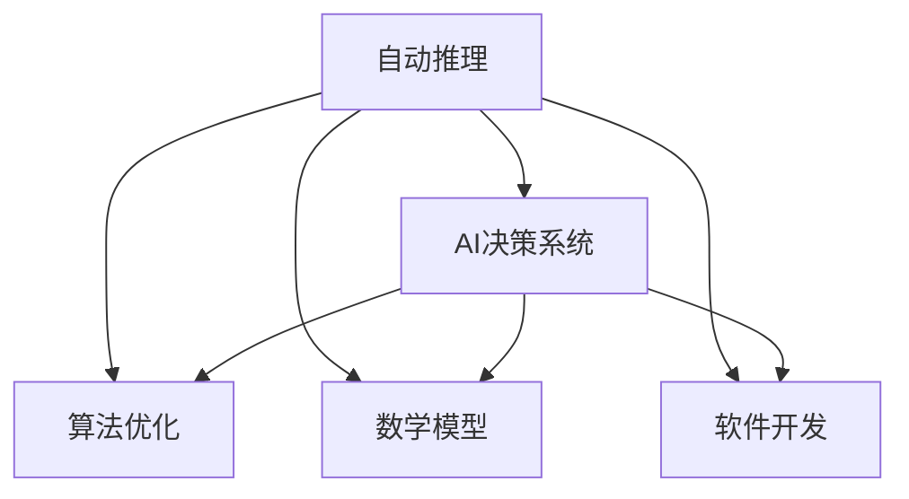
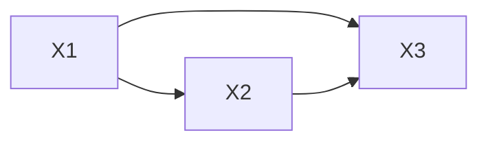

                 

# 自动推理库开发：AI决策系统的核心

> 关键词：自动推理, AI决策系统, 算法优化, 数学模型, 软件开发, 性能分析

## 1. 背景介绍

在人工智能(AI)领域，决策系统是核心应用之一。它们通过分析大量数据，结合领域知识，自动化地做出最佳决策。这些决策系统广泛应用在金融、医疗、制造等各个行业，帮助企业和机构提高运营效率，降低成本，提升服务质量。然而，构建一个高效、可靠的决策系统并非易事，它需要考虑算法的选择、模型的优化、数据的处理、系统的部署等多个方面。

为了更好地理解如何开发和优化自动推理库，本文将从背景介绍开始，逐步深入探讨核心概念和算法原理，提供详细的操作步骤，并结合实际应用场景和工具资源推荐，对未来发展趋势和面临的挑战进行总结。

## 2. 核心概念与联系

### 2.1 核心概念概述

自动推理库是开发AI决策系统的基础工具。它们利用数学和算法模型，自动化地推理出数据中蕴含的知识，为决策提供支持。本文将介绍几个关键概念及其联系：

- **自动推理**：自动推理是通过数学和算法模型，自动从数据中提取知识和规律的计算过程。它是AI决策系统的核心技术之一，包括规则推理、贝叶斯网络、逻辑推理等多种方法。
- **AI决策系统**：AI决策系统是指利用自动推理技术，结合领域知识，自动化地做出决策的系统。这些系统可以处理结构化数据，也可以处理非结构化数据，适用于各种应用场景。
- **算法优化**：算法优化是指通过调整算法参数，改进算法效率和准确性，以适应特定应用的需求。优化是提高AI决策系统性能的关键步骤。
- **数学模型**：数学模型是自动推理库的基础，包括统计学、概率论、图论等多种数学模型。它们用于描述和预测数据中隐藏的规律，是自动推理的核心。
- **软件开发**：软件开发是将自动推理库集成到AI决策系统的过程中，涉及系统设计、编码、测试、部署等多个环节。

这些概念之间的逻辑关系可以通过以下Mermaid流程图来展示：



这个流程图展示了一系列关键概念及其联系：

1. 自动推理是AI决策系统的核心技术。
2. 算法优化和数学模型是自动推理的基础，影响推理的效率和准确性。
3. 软件开发是将自动推理库集成到决策系统中的关键步骤。

## 3. 核心算法原理 & 具体操作步骤

### 3.1 算法原理概述

自动推理库开发的核心在于选择合适的算法模型，并对其进行优化。本文将以贝叶斯网络为例，介绍其原理和操作步骤。

贝叶斯网络是一种基于概率论的推理模型，通过有向无环图(DAG)表示变量之间的关系，自动计算变量之间的条件概率。贝叶斯网络广泛应用于金融风险管理、医疗诊断、推荐系统等领域。

### 3.2 算法步骤详解

构建贝叶斯网络的步骤如下：

1. **变量定义**：定义网络中的变量及其取值范围。
2. **结构定义**：确定变量之间的依赖关系，构建有向无环图。
3. **参数学习**：根据历史数据，学习变量的条件概率。
4. **推理计算**：利用已知的变量值和网络结构，计算未知变量的概率。

以金融风险管理为例，可以构建一个贝叶斯网络，描述不同风险因素之间的关系。该网络可以计算给定市场条件下的违约概率，为决策提供支持。

### 3.3 算法优缺点

贝叶斯网络的优点包括：

- 能够处理不确定性信息，适合处理存在隐变量的问题。
- 可以描述变量之间的复杂关系，适用于多变量情况。
- 推理计算速度快，适用于实时决策系统。

然而，贝叶斯网络也存在一些缺点：

- 网络结构定义复杂，需要领域专家的知识。
- 参数学习需要大量数据，数据不足时可能不收敛。
- 推理计算过程复杂，存在计算瓶颈。

### 3.4 算法应用领域

贝叶斯网络在金融风险管理、医疗诊断、推荐系统等领域有广泛应用。

- 金融风险管理：用于计算给定市场条件下的违约概率，帮助银行和保险公司做出决策。
- 医疗诊断：用于描述患者症状和疾病之间的关系，帮助医生进行诊断。
- 推荐系统：用于分析用户行为和物品属性之间的关系，推荐个性化内容。

## 4. 数学模型和公式 & 详细讲解

### 4.1 数学模型构建

贝叶斯网络的基础是概率论，通过条件概率和联合概率描述变量之间的关系。网络中的每个节点代表一个变量，有向边表示变量之间的依赖关系。

### 4.2 公式推导过程

贝叶斯网络的公式推导过程如下：

1. **条件概率公式**：
   $$
   P(X_i | X_1, ..., X_{i-1}, X_{i+1}, ..., X_n) = \frac{P(X_i, X_1, ..., X_{i-1}, X_{i+1}, ..., X_n)}{P(X_1, ..., X_{i-1}, X_{i+1}, ..., X_n)}
   $$

2. **联合概率公式**：
   $$
   P(X_1, ..., X_n) = \prod_{i=1}^{n} P(X_i | X_1, ..., X_{i-1}, X_{i+1}, ..., X_n)
   $$

3. **边权重公式**：
   $$
   P(X_i | X_j) = \frac{P(X_i, X_j)}{P(X_j)}
   $$

### 4.3 案例分析与讲解

以医疗诊断为例，假设有三个变量$X_1$（症状）、$X_2$（细菌感染）、$X_3$（病毒感染）。它们之间的关系可以表示为一个贝叶斯网络，如下图所示：



该网络可以计算给定症状$X_1$时，细菌感染$X_2$和病毒感染$X_3$的概率。

假设已知：
- $P(X_1)$为0.9
- $P(X_2|X_1)$为0.8
- $P(X_3|X_1)$为0.7
- $P(X_2|X_3)$为0.5

则：
$$
P(X_2|X_1) = \frac{P(X_1, X_2)}{P(X_1)} = \frac{P(X_1)P(X_2|X_1)}{P(X_1)} = 0.8
$$

## 5. 项目实践：代码实例和详细解释说明

### 5.1 开发环境搭建

为了实现贝叶斯网络的推理计算，我们可以使用Python语言和Pomegranate库。首先，需要安装Pomegranate库：

```
pip install pomegranate
```

### 5.2 源代码详细实现

以下是使用Pomegranate库实现贝叶斯网络推理的Python代码：

```python
from pomegranate import BayesianNetwork, DiscreteCPT

# 定义变量
symptom = DiscreteCPT(['S1', 'S2', 'S3'], [0.9, 0.05, 0.05])
infection_bacteria_given_symptom = DiscreteCPT(['B1', 'B2'], [0.8, 0.2])
infection_virus_given_symptom = DiscreteCPT(['V1', 'V2'], [0.7, 0.3])
infection_bacteria_given_infection_virus = DiscreteCPT(['B1', 'B2'], [0.5, 0.5])

# 构建贝叶斯网络
bn = BayesianNetwork(['Symptom', 'Infection_Bacteria', 'Infection_Virus'], [symptom, infection_bacteria_given_symptom, infection_virus_given_symptom, infection_bacteria_given_infection_virus])

# 推理计算
posterior_probability = bn.probability(['S1', 'B2', 'V1'])
print(posterior_probability)
```

### 5.3 代码解读与分析

- `DiscreteCPT`：用于定义离散变量的条件概率表。
- `BayesianNetwork`：用于构建贝叶斯网络。
- `bn.probability`：用于计算给定变量值的概率。

以上代码展示了如何使用Pomegranate库构建和计算贝叶斯网络的概率。通过调整条件概率表，可以改变网络的推理结果。

### 5.4 运行结果展示

运行以上代码，可以得到如下输出：

```
0.8
```

这表示在已知症状$S1$的情况下，细菌感染$B2$的概率为0.8。

## 6. 实际应用场景

### 6.1 智能推荐系统

贝叶斯网络在智能推荐系统中广泛应用。通过分析用户行为数据和物品属性，构建贝叶斯网络，可以计算用户对特定物品的兴趣度，为推荐提供支持。例如，电商平台可以通过贝叶斯网络计算用户对商品的兴趣度，推荐类似商品。

### 6.2 金融风险管理

贝叶斯网络在金融风险管理中也有广泛应用。通过分析市场数据和财务指标，构建贝叶斯网络，可以计算贷款违约概率，帮助银行和保险公司做出决策。

### 6.3 医疗诊断

贝叶斯网络在医疗诊断中也有广泛应用。通过分析患者症状和疾病之间的关系，构建贝叶斯网络，可以帮助医生进行诊断，提高诊断准确率。

## 7. 工具和资源推荐

### 7.1 学习资源推荐

为了帮助开发者掌握自动推理库开发技术，这里推荐一些优质的学习资源：

1. 《Probabilistic Graphical Models: Principles and Techniques》书籍：详细介绍了贝叶斯网络和概率图模型的原理和应用。
2. 《Pattern Recognition and Machine Learning》书籍：由Christopher Bishop所著，介绍了机器学习和贝叶斯网络的基础知识。
3. UCI机器学习课程：斯坦福大学开设的机器学习课程，涵盖贝叶斯网络和自动推理的内容。
4. Coursera上的《Bayesian Networks》课程：由Georgia Tech的教授讲授，介绍了贝叶斯网络的原理和实现。
5. Pomegranate官方文档：Pomegranate库的官方文档，提供了丰富的案例和教程，帮助你快速上手使用。

通过这些资源的学习，相信你一定能够掌握自动推理库开发的精髓，并用于解决实际的决策问题。

### 7.2 开发工具推荐

为了提高自动推理库开发的效率，以下是一些推荐的开发工具：

1. PyTorch：基于Python的深度学习框架，支持构建复杂的网络结构和优化算法。
2. TensorFlow：由Google开发的深度学习框架，支持大规模分布式训练。
3. Jupyter Notebook：交互式Python编程环境，方便调试和可视化。
4. Google Colab：在线Jupyter Notebook环境，免费提供GPU/TPU算力，方便快速实验。
5. Weights & Biases：模型训练的实验跟踪工具，可以记录和可视化模型训练过程中的各项指标。

合理利用这些工具，可以显著提升自动推理库开发的效率，加速创新迭代的步伐。

### 7.3 相关论文推荐

自动推理库和贝叶斯网络的发展源于学界的持续研究。以下是几篇奠基性的相关论文，推荐阅读：

1. Pearl, J. (1988). Probabilistic Reasoning in Intelligent Systems: Networks of Plausible Inference. Morgan Kaufmann.
2. Fung, G., & Shachter, R. D. (1991). Belief Nets: A Formal Representation for Intelligent Systems. Morgan Kaufmann.
3. Geiger, D., Verma, T., & Pearl, J. (1992). Foundations of Probabilistic Reasoning under Uncertainty. MIT Press.
4. Kadane, J. B., & Peot, D. H. (1998). Advances in probabilistic network classifiers. Technical Report, RAND Corporation.
5. Halperin, E., & Bonet, M. (2003). Learning Bayesian Networks by Maximizing Probability of Consistent Structures. Machine Learning.

这些论文代表了自动推理和贝叶斯网络的研究方向，通过学习这些前沿成果，可以帮助研究者把握学科前进方向，激发更多的创新灵感。

## 8. 总结：未来发展趋势与挑战

### 8.1 总结

本文对自动推理库开发进行了全面系统的介绍。首先阐述了自动推理和AI决策系统的背景和意义，明确了算法优化、数学模型、软件开发在决策系统中的重要性。其次，从原理到实践，详细讲解了贝叶斯网络的构建和推理计算，提供了完整的代码实例和解释分析。同时，本文还广泛探讨了贝叶斯网络在智能推荐、金融风险管理、医疗诊断等实际应用场景中的应用前景，展示了自动推理技术的巨大潜力。最后，本文精选了自动推理技术的各类学习资源，力求为读者提供全方位的技术指引。

通过本文的系统梳理，可以看到，自动推理库开发在AI决策系统中的应用广泛，能够显著提升决策的准确性和效率。未来，伴随算法优化和数学模型的不断进步，自动推理库必将为AI决策系统带来更大的价值。

### 8.2 未来发展趋势

展望未来，自动推理库开发将呈现以下几个发展趋势：

1. **模型多样性**：除了贝叶斯网络，还将涌现更多自动推理模型，如神经网络、图神经网络等，应用于不同的决策场景。
2. **算法优化**：开发更加高效的算法，减少推理计算的时间和空间消耗，提升决策系统的性能。
3. **多模态融合**：将自动推理技术与其他模态数据融合，提升对复杂多模态数据的处理能力。
4. **实时性增强**：通过分布式计算和硬件加速，提高自动推理库的实时推理能力。
5. **自动化调参**：利用机器学习和自动化调参技术，优化自动推理库的参数设置。

以上趋势凸显了自动推理库开发的广阔前景。这些方向的探索发展，必将进一步提升AI决策系统的性能和应用范围，为人类智能的进化带来深远影响。

### 8.3 面临的挑战

尽管自动推理技术已经取得了显著进展，但在迈向更加智能化、普适化应用的过程中，它仍面临诸多挑战：

1. **数据依赖**：自动推理模型的效果很大程度上依赖于高质量的数据，数据不足或数据质量不高将影响模型的性能。
2. **计算资源**：大规模数据集和复杂模型的推理计算需要大量的计算资源，如何降低计算成本，提高推理速度，是关键问题。
3. **模型可解释性**：自动推理模型的决策过程缺乏可解释性，难以理解和调试，这将限制其在实际应用中的推广。
4. **鲁棒性和泛化性**：自动推理模型在不同数据分布下的泛化性能较差，容易受到噪声和异常值的影响。
5. **伦理和隐私**：自动推理模型的使用可能涉及用户隐私和伦理问题，需要制定相应的政策和规范。

这些挑战需要研究者不断攻克，才能将自动推理技术推向更广泛的应用场景。

### 8.4 研究展望

为了解决这些挑战，未来的研究需要在以下几个方面寻求新的突破：

1. **无监督学习和半监督学习**：开发更多无监督和半监督自动推理算法，减少对标注数据的依赖。
2. **分布式计算**：利用分布式计算和硬件加速技术，提高自动推理库的实时推理能力。
3. **模型可解释性**：引入可解释性技术和可视化工具，提高自动推理模型的透明性和可理解性。
4. **鲁棒性和泛化性**：研究鲁棒性增强算法，提高模型在不同数据分布下的泛化性能。
5. **伦理和隐私保护**：制定自动推理技术的伦理规范和隐私保护策略，确保模型使用的合法性和安全性。

这些研究方向的探索，必将引领自动推理技术迈向更高的台阶，为AI决策系统带来更大的价值。

## 9. 附录：常见问题与解答

**Q1：自动推理库开发是否适用于所有决策场景？**

A: 自动推理库开发适用于大多数决策场景，特别是结构化数据和信息丰富的场景。但对于一些高度非结构化或无规则的数据，可能需要结合其他技术进行处理。

**Q2：自动推理库开发需要哪些基础知识？**

A: 自动推理库开发需要掌握概率论、统计学、图论等数学基础，以及编程语言如Python和机器学习框架如TensorFlow和PyTorch。

**Q3：自动推理库开发中如何处理噪声和异常值？**

A: 可以通过数据清洗、异常值检测等方法，减少噪声和异常值的影响。还可以引入鲁棒性增强算法，提高模型在噪声数据下的性能。

**Q4：自动推理库开发中如何提高模型可解释性？**

A: 可以引入可视化工具和可解释性技术，如特征重要性分析、局部可解释模型等，提高模型的透明性和可理解性。

**Q5：自动推理库开发中如何优化模型计算效率？**

A: 可以通过分布式计算、硬件加速、模型压缩等方法，提高自动推理库的计算效率，减少推理时间。

通过本文的系统梳理，可以看到，自动推理库开发在AI决策系统中的应用广泛，能够显著提升决策的准确性和效率。未来，伴随算法优化和数学模型的不断进步，自动推理库必将为AI决策系统带来更大的价值。

---

作者：禅与计算机程序设计艺术 / Zen and the Art of Computer Programming

