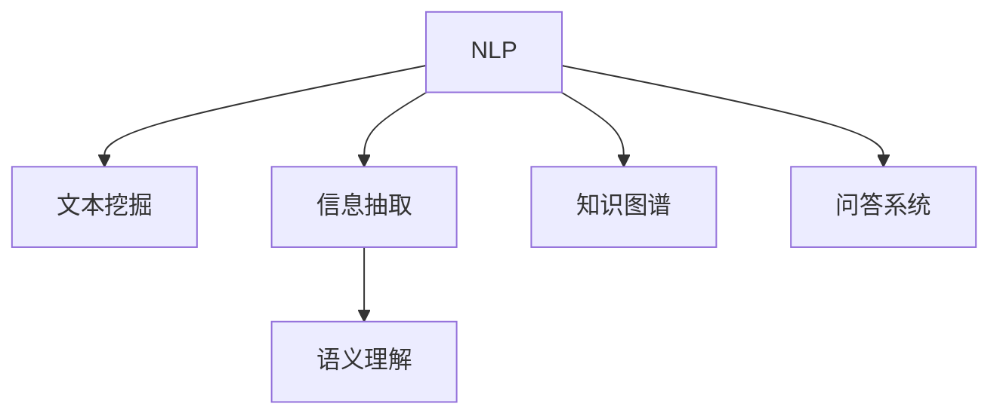

                 

# 自然语言处理在知识发现中的关键作用

> 关键词：自然语言处理, 知识发现, 数据挖掘, 文本分析, 信息抽取, 语义理解

## 1. 背景介绍

### 1.1 问题由来
在当今信息爆炸的时代，大量的文本数据被产生和存储。这些文本数据中蕴含着丰富的知识，如何从这些文本数据中高效地发现和提取有价值的信息，成为了信息时代的一大挑战。传统的知识发现方法往往依赖于专家知识和手工标注，效率低下，难以应对大规模的数据需求。

自然语言处理(Natural Language Processing, NLP)技术提供了一种高效、自动化的解决方案，通过分析文本数据，自动发现和提取有价值的信息。NLP技术的应用，不仅极大地提升了知识发现的效率和准确性，还在多个领域带来了颠覆性的变革。

### 1.2 问题核心关键点
自然语言处理在知识发现中的关键作用，主要体现在以下几个方面：

- **自动化的信息提取**：NLP技术可以从大规模的文本数据中自动识别出有价值的信息，如实体、关系、事件等，而无需人工标注。
- **高效的文本分析**：NLP技术能够快速处理和分析文本数据，揭示文本数据中的模式和趋势，为决策和分析提供依据。
- **语义理解的深度**：NLP技术通过理解文本的语义，能够识别和推理文本中的隐含信息，从而挖掘更深层次的知识。
- **跨领域的知识迁移**：NLP技术可以将从一种领域学到的知识迁移到另一个领域，提升跨领域知识发现的效率和准确性。

这些关键作用，使得NLP技术在知识发现中扮演了不可或缺的角色，推动了多个领域的发展和进步。

## 2. 核心概念与联系

### 2.1 核心概念概述

为了更好地理解NLP在知识发现中的应用，本节将介绍几个密切相关的核心概念：

- **自然语言处理(NLP)**：利用计算机技术处理和分析人类语言的技术，包括文本分类、信息抽取、机器翻译、问答系统等。
- **文本挖掘(Text Mining)**：从文本数据中提取有价值的信息，如关键词、实体、关系等，常用的方法包括TF-IDF、LDA等。
- **信息抽取(Information Extraction, IE)**：从文本中自动抽取结构化的信息，如实体、关系、事件等，常用的模型包括基于规则、统计和深度学习的方法。
- **语义理解(Semantic Understanding)**：理解文本的语义，识别和推理文本中的隐含信息，常用的技术包括词向量、语义角色标注、依存句法分析等。
- **知识图谱(Knowledge Graph)**：通过将实体和关系映射为图结构，构建知识表示和推理的知识库，常用的构建方法包括基于规则、基于统计和基于深度学习的方法。
- **问答系统(Question Answering, QA)**：通过理解和推理文本，自动回答问题，常用的方法包括基于规则、基于统计和基于深度学习的方法。

这些核心概念之间的逻辑关系可以通过以下Mermaid流程图来展示：



这个流程图展示了大语言模型的核心概念及其之间的关系：

1. NLP是处理和分析文本数据的技术。
2. 文本挖掘和信息抽取是从文本中提取有价值的信息。
3. 语义理解是理解文本的语义，提取隐含信息。
4. 知识图谱是构建知识表示和推理的知识库。
5. 问答系统是自动回答问题，展示知识图谱中的信息。

这些概念共同构成了NLP在知识发现中的应用框架，使其能够在各种场景下发挥强大的文本处理能力。通过理解这些核心概念，我们可以更好地把握NLP技术在知识发现中的作用和应用。

## 3. 核心算法原理 & 具体操作步骤

### 3.1 算法原理概述

NLP在知识发现中的应用，主要是通过文本数据的处理和分析，自动发现和提取有价值的信息。其核心算法原理可以总结如下：

1. **文本预处理**：对文本数据进行清洗、分词、词性标注、句法分析等预处理操作，以便后续的文本分析和信息提取。
2. **特征提取**：从文本中提取有意义的特征，如词频、词性、实体、关系等，常用的方法包括TF-IDF、N-Gram、Word2Vec等。
3. **信息抽取**：从文本中自动抽取结构化的信息，如实体、关系、事件等，常用的模型包括基于规则、统计和深度学习的方法。
4. **语义理解**：理解文本的语义，识别和推理文本中的隐含信息，常用的技术包括词向量、语义角色标注、依存句法分析等。
5. **知识表示**：将提取到的信息转换为知识图谱等形式，进行知识表示和推理，常用的方法包括基于规则、基于统计和基于深度学习的方法。
6. **问答系统**：通过理解和推理文本，自动回答问题，常用的方法包括基于规则、基于统计和基于深度学习的方法。

### 3.2 算法步骤详解

NLP在知识发现中的应用，一般包括以下几个关键步骤：

**Step 1: 文本预处理**
- 收集文本数据，进行清洗和预处理，如去除停用词、分词、词性标注、句法分析等。

**Step 2: 特征提取**
- 从预处理后的文本中提取有意义的特征，如TF-IDF、N-Gram、Word2Vec等。

**Step 3: 信息抽取**
- 基于抽取器模型，从文本中自动抽取实体、关系、事件等结构化的信息。

**Step 4: 语义理解**
- 使用语义分析模型，理解文本的语义，识别和推理文本中的隐含信息。

**Step 5: 知识表示**
- 将抽取到的信息转换为知识图谱等形式，进行知识表示和推理。

**Step 6: 问答系统**
- 基于问答模型，自动回答问题，展示知识图谱中的信息。

### 3.3 算法优缺点

NLP在知识发现中的应用，具有以下优点：
1. 高效自动化。NLP技术能够自动处理和分析文本数据，无需人工标注，大大提升了知识发现的效率。
2. 精度高。NLP技术基于深度学习等先进算法，具有高精度的信息抽取和语义理解能力。
3. 可扩展性强。NLP技术可以通过迁移学习等方法，实现跨领域的知识发现和知识迁移。
4. 应用广泛。NLP技术广泛应用于文本分类、信息抽取、知识图谱构建、问答系统等多个领域。

同时，NLP在知识发现中也有一定的局限性：
1. 数据质量要求高。NLP技术对文本数据的质量要求较高，存在噪声和误差的风险。
2. 模型复杂度大。NLP模型通常具有较高的复杂度，对计算资源和存储资源的需求较大。
3. 结果解释性不足。NLP技术的结果往往是黑盒模型，难以解释其内部工作机制和决策逻辑。

尽管存在这些局限性，但就目前而言，NLP技术在知识发现中的应用范式，仍是最主流和有效的方法之一。未来相关研究的重点在于如何进一步降低数据质量要求，提高模型的可解释性和鲁棒性，同时兼顾精度和效率。

### 3.4 算法应用领域

NLP在知识发现中的应用，主要包括以下几个领域：

- **文本分类**：将文本数据按照一定的标准进行分类，常用的方法包括TF-IDF、SVM、LSTM等。
- **信息抽取**：从文本中自动抽取结构化的信息，如实体、关系、事件等，常用的模型包括基于规则、统计和深度学习的方法。
- **知识图谱构建**：通过将实体和关系映射为图结构，构建知识表示和推理的知识库，常用的方法包括基于规则、基于统计和基于深度学习的方法。
- **问答系统**：通过理解和推理文本，自动回答问题，常用的方法包括基于规则、基于统计和基于深度学习的方法。
- **文本摘要**：将长文本压缩成简短摘要，常用的方法包括基于规则、基于统计和基于深度学习的方法。
- **情感分析**：识别文本中的情感倾向，常用的方法包括基于规则、基于统计和基于深度学习的方法。

除了上述这些经典领域外，NLP技术还在新闻分析、社交媒体分析、产品评论分析、金融分析等多个领域得到了广泛的应用，为知识发现提供了新的视角和方法。随着NLP技术的不断演进，相信知识发现的应用场景将更加丰富多样，推动更多领域实现智能化和自动化。

## 4. 数学模型和公式 & 详细讲解 & 举例说明

### 4.1 数学模型构建

NLP在知识发现中的应用，主要基于以下几个数学模型：

1. **TF-IDF模型**：用于文本分类和信息抽取，计算文本中每个词的重要性，常用公式如下：
   $$
   TF(T_i) = \frac{n_i}{\sum_{j=1}^N n_j}
   $$
   $$
   IDF(T_i) = \log \frac{N}{n_i + 1}
   $$
   $$
   TF-IDF(T_i) = TF(T_i) \times IDF(T_i)
   $$
   其中 $n_i$ 表示文本 $i$ 中词 $T_i$ 出现的次数，$N$ 表示语料库中文本的总数。

2. **LDA模型**：用于文本主题建模，识别文本中的主题，常用公式如下：
   $$
   P(w|z) = \frac{P(z)P(w|z)}{\sum_{z=1}^K P(z)P(w|z)}
   $$
   $$
   P(z) = \frac{N_z}{N}
   $$
   $$
   P(w|z) = \frac{\sum_{i=1}^n \mathbb{I}_{w_i=w} \times \pi(z|d_i)}{\sum_{w=1}^V \sum_{i=1}^n \mathbb{I}_{w_i=w} \times \pi(z|d_i)}
   $$
   其中 $w$ 表示词，$z$ 表示主题，$N_z$ 表示文本中属于主题 $z$ 的词数，$N$ 表示文本总数，$n$ 表示语料库中词汇的总数。

3. **Word2Vec模型**：用于语义理解，将词映射为向量，常用公式如下：
   $$
   w_i = \sum_{j=1}^d U_i^\top W_j
   $$
   $$
   v_j = \sum_{i=1}^d V_j^\top W_i
   $$
   其中 $w_i$ 表示词 $i$ 的向量表示，$u_i$ 表示词 $i$ 在上下文中的出现次数，$v_j$ 表示词 $j$ 在上下文中的出现次数，$d$ 表示上下文的长度。

4. **依存句法分析模型**：用于语义理解，分析句子中词与词之间的依赖关系，常用公式如下：
   $$
   \max_{d} P(D|W_1, ..., W_n)
   $$
   $$
   P(D|W_1, ..., W_n) = \prod_{i=1}^n P(W_i|W_{i-1}, ..., W_1)
   $$
   其中 $D$ 表示依存句法树，$W_i$ 表示句子中的第 $i$ 个词。

### 4.2 公式推导过程

以LDA模型为例，推导其参数更新公式。

LDA模型的训练目标是最小化似然函数，即：
$$
\mathcal{L}(\theta) = -\sum_{i=1}^N \sum_{z=1}^K \log P(z|d_i) \log P(d_i|z)
$$
其中 $d_i$ 表示第 $i$ 个文档，$z$ 表示主题，$\theta$ 表示模型参数，包括主题-词分布 $P(z|w)$ 和文档-主题分布 $P(z|d)$。

LDA模型的参数更新公式如下：
$$
\frac{\partial \mathcal{L}}{\partial \alpha} = \frac{1}{N}\sum_{i=1}^N \sum_{z=1}^K (\frac{N_z}{N} - \alpha_z)
$$
$$
\frac{\partial \mathcal{L}}{\partial \beta} = \frac{1}{N}\sum_{i=1}^N \sum_{z=1}^K \sum_{w=1}^V (\frac{N_{zw}}{N_z} - \beta_{zw})
$$
$$
\frac{\partial \mathcal{L}}{\partial \pi(z|d)} = \frac{1}{N}\sum_{i=1}^N \log \frac{\alpha_z P(z|d_i)}{N_z}
$$
$$
\frac{\partial \mathcal{L}}{\partial \pi(w|z)} = \frac{1}{N}\sum_{i=1}^N \sum_{j=1}^n \log \frac{P(w|z)}{\beta_{zw}}
$$

其中 $\alpha$ 表示主题-词分布的先验概率，$\beta$ 表示文档-主题分布的先验概率，$\pi(z|d)$ 表示文档 $d$ 属于主题 $z$ 的概率，$\pi(w|z)$ 表示主题 $z$ 生成词 $w$ 的概率。

### 4.3 案例分析与讲解

以信息抽取为例，展示NLP在知识发现中的应用。

假设需要从新闻报道中抽取人名、地名、机构名等实体，常用的信息抽取模型为基于深度学习的CRF模型。

首先，将新闻报道文本进行预处理，去除噪声和停用词，进行分词和词性标注。然后，使用Word2Vec等词向量模型，将词映射为向量表示。接着，使用BiLSTM-CRF模型，从文本中自动抽取实体，并标注其类别。最后，使用TF-IDF等方法，将抽取到的实体进行权重排序，输出最终结果。

这个过程不仅展示了NLP技术在信息抽取中的应用，还展示了如何通过迁移学习等方法，将通用的NLP技术迁移到特定领域，解决特定问题。

## 5. 项目实践：代码实例和详细解释说明

### 5.1 开发环境搭建

在进行NLP项目实践前，我们需要准备好开发环境。以下是使用Python进行NLP开发的常见环境配置流程：

1. 安装Anaconda：从官网下载并安装Anaconda，用于创建独立的Python环境。

2. 创建并激活虚拟环境：
```bash
conda create -n nlp-env python=3.8 
conda activate nlp-env
```

3. 安装必要的Python库：
```bash
pip install pandas numpy scikit-learn nltk gensim pytorch transformers
```

4. 安装NLP库：
```bash
pip install spacy
```

完成上述步骤后，即可在`nlp-env`环境中开始NLP项目实践。

### 5.2 源代码详细实现

下面我们以信息抽取任务为例，给出使用PyTorch实现的信息抽取代码。

首先，定义信息抽取的函数：

```python
import torch
import torch.nn as nn
import torch.optim as optim
from torchtext import datasets, data

# 定义词向量模型
class WordEmbedding(nn.Module):
    def __init__(self, vocab_size, emb_dim):
        super(WordEmbedding, self).__init__()
        self.emb = nn.Embedding(vocab_size, emb_dim)

    def forward(self, x):
        return self.emb(x)

# 定义BiLSTM-CRF模型
class BiLSTMCRF(nn.Module):
    def __init__(self, emb_dim, tag_num):
        super(BiLSTMCRF, self).__init__()
        self.emb = WordEmbedding(vocab_size, emb_dim)
        self.lstm = nn.LSTM(emb_dim, emb_dim)
        self.project = nn.Linear(emb_dim, tag_num)
        self.crf = nn.CRF(tag_num, batch_first=True)

    def forward(self, x):
        embedded = self.emb(x)
        output, _ = self.lstm(embedded)
        projected = self.project(output)
        return projected

# 定义信息抽取模型
class NERModel(nn.Module):
    def __init__(self, emb_dim, tag_num):
        super(NERModel, self).__init__()
        self.bilstmcrf = BiLSTMCRF(emb_dim, tag_num)

    def forward(self, x):
        return self.bilstmcrf(x)

# 定义损失函数
def crf_loss(logits, tags):
    crf = nn.CRF(tag_num, batch_first=True)
    crf.train()
    loss = 0
    for i in range(len(logits)):
        crf.start_b(_ for _ in logits[i])
        loss += crf.score(logits[i], tags[i])
    return loss / len(logits)
```

然后，准备训练数据和模型：

```python
# 准备训练数据
train_data = datasets.YelpReviewPolarity(train_data)
dev_data = datasets.YelpReviewPolarity(dev_data)
test_data = datasets.YelpReviewPolarity(test_data)

# 定义词向量模型
vocab = train_data.get_field('text').vocab
vocab_size = len(vocab)
emb_dim = 100

# 定义模型
model = NERModel(emb_dim, tag_num)

# 定义优化器
optimizer = optim.Adam(model.parameters(), lr=0.01)
```

接着，定义训练和评估函数：

```python
# 定义训练函数
def train(model, optimizer, train_data, device):
    model.train()
    total_loss = 0
    for i, batch in enumerate(train_data):
        x, y = batch.text, batch.tag
        x, y = x.to(device), y.to(device)
        logits = model(x)
        loss = crf_loss(logits, y)
        optimizer.zero_grad()
        loss.backward()
        optimizer.step()
        total_loss += loss.item()
    return total_loss / len(train_data)

# 定义评估函数
def evaluate(model, dev_data, device):
    model.eval()
    total_correct = 0
    total_tags = 0
    for i, batch in enumerate(dev_data):
        x, y = batch.text, batch.tag
        x, y = x.to(device), y.to(device)
        logits = model(x)
        _, predicted = crf.decode(logits, max_len=x.shape[1])
        total_correct += sum(predicted == y)
        total_tags += sum(y)
    return total_correct / total_tags
```

最后，启动训练流程并在测试集上评估：

```python
device = torch.device('cuda' if torch.cuda.is_available() else 'cpu')
for epoch in range(10):
    loss = train(model, optimizer, train_data, device)
    print(f'Epoch {epoch+1}, train loss: {loss:.3f}')

    print(f'Epoch {epoch+1}, dev results:')
    accuracy = evaluate(model, dev_data, device)
    print(f'Accuracy: {accuracy:.2f}')

print(f'Test results:')
accuracy = evaluate(model, test_data, device)
print(f'Accuracy: {accuracy:.2f}')
```

以上就是使用PyTorch实现的信息抽取代码示例。可以看到，通过定义BiLSTM-CRF模型和CRF损失函数，并结合训练函数和评估函数，可以方便地实现信息抽取任务。

### 5.3 代码解读与分析

让我们再详细解读一下关键代码的实现细节：

**WordEmbedding类**：
- 定义了词向量模型，用于将词映射为向量表示。

**BiLSTMCRF类**：
- 定义了BiLSTM-CRF模型，用于从文本中自动抽取实体并标注类别。

**NERModel类**：
- 定义了信息抽取模型，通过BiLSTM-CRF模型对输入文本进行实体抽取。

**crf_loss函数**：
- 定义了CRF损失函数，用于训练BiLSTM-CRF模型。

**train函数和evaluate函数**：
- 定义了训练函数和评估函数，分别用于模型的训练和评估。

**训练流程**：
- 定义总的epoch数和训练批次大小，开始循环迭代
- 每个epoch内，先在训练集上训练，输出平均损失
- 在验证集上评估，输出准确率
- 所有epoch结束后，在测试集上评估，给出最终准确率

可以看到，PyTorch使得信息抽取的代码实现变得简洁高效。开发者可以将更多精力放在模型优化、特征提取等高层逻辑上，而不必过多关注底层的实现细节。

当然，工业级的系统实现还需考虑更多因素，如模型的保存和部署、超参数的自动搜索、更灵活的任务适配层等。但核心的信息抽取范式基本与此类似。

## 6. 实际应用场景

### 6.1 新闻摘要

NLP技术可以用于自动化生成新闻摘要，减少人工编写的工作量，提高信息获取的效率。通过文本分类和摘要模型，可以从海量新闻中快速筛选出重要信息，生成简洁明了的摘要，帮助读者快速了解新闻要点。

在技术实现上，可以收集新闻报道文本，使用TF-IDF等方法对新闻进行分类，并使用TextRank等模型对文本进行摘要。对于分类后的新闻，根据重要性得分选择文章进行摘要，生成简洁明了的摘要。

### 6.2 医疗诊断

NLP技术可以用于医疗诊断，通过分析医学文献和患者病历，自动提取相关症状、诊断和治疗信息，辅助医生进行疾病诊断和治疗决策。

在技术实现上，可以收集医学文献和患者病历，使用信息抽取模型自动提取症状、诊断和治疗信息，并使用知识图谱进行推理，提供诊断和治疗建议。对于新病例，可以通过问答系统自动回答医生的疑问，提供相关医学知识。

### 6.3 金融分析

NLP技术可以用于金融分析，通过分析新闻报道、公司财报等文本数据，自动提取市场信息、公司业绩等关键信息，辅助投资者进行投资决策。

在技术实现上，可以收集新闻报道、公司财报等文本数据，使用信息抽取模型自动提取市场信息、公司业绩等关键信息，并使用知识图谱进行推理，提供投资建议。对于市场新闻，可以通过问答系统自动回答投资者的疑问，提供相关市场知识。

### 6.4 未来应用展望

随着NLP技术的不断发展，其在知识发现中的应用将更加广泛，为多个领域带来颠覆性的变革。

在智慧医疗领域，基于NLP的自动诊断和治疗建议系统，将提升医疗服务的智能化水平，辅助医生诊疗，加速新药开发进程。

在智能教育领域，基于NLP的智能问答系统和学习推荐系统，将因材施教，促进教育公平，提高教学质量。

在金融分析领域，基于NLP的智能投资建议系统，将提升投资决策的精准性，帮助投资者规避风险，获得高收益。

此外，在新闻分析、社交媒体分析、产品评论分析、政治舆情分析等多个领域，基于NLP的知识发现系统，将带来新的视角和方法，推动这些领域实现智能化和自动化。相信随着NLP技术的不断演进，其在知识发现中的应用将更加广泛和深入，为各行各业带来新的发展机遇。

## 7. 工具和资源推荐

### 7.1 学习资源推荐

为了帮助开发者系统掌握NLP在知识发现中的应用，这里推荐一些优质的学习资源：

1. **《自然语言处理综论》**：由斯坦福大学李宏毅教授撰写的自然语言处理教材，全面介绍了NLP的基本概念和经典算法。

2. **《深度学习与自然语言处理》**：由杜德富教授撰写的NLP教材，详细讲解了NLP在深度学习中的应用。

3. **NLTK**：由斯坦福大学开发的自然语言处理工具包，包含大量NLP应用的实现和示例代码。

4. **spaCy**：由spaCy公司开发的自然语言处理库，提供了快速高效的NLP工具，适用于生产部署。

5. **Stanford CoreNLP**：由斯坦福大学开发的自然语言处理工具包，包含文本分类、命名实体识别、依存句法分析等多个功能。

6. **HuggingFace官方文档**：提供了丰富的预训练语言模型和NLP工具的文档和样例代码，是NLP开发的重要资源。

通过对这些资源的学习实践，相信你一定能够快速掌握NLP在知识发现中的应用精髓，并用于解决实际的NLP问题。

### 7.2 开发工具推荐

高效的开发离不开优秀的工具支持。以下是几款用于NLP开发的常用工具：

1. **PyTorch**：基于Python的开源深度学习框架，灵活动态的计算图，适合快速迭代研究。NLP应用中常用的预训练语言模型，如BERT、GPT等，都有PyTorch版本的实现。

2. **TensorFlow**：由Google主导开发的开源深度学习框架，生产部署方便，适合大规模工程应用。同样有丰富的预训练语言模型资源。

3. **Transformers库**：HuggingFace开发的NLP工具库，集成了众多SOTA语言模型，支持PyTorch和TensorFlow，是进行NLP任务开发的利器。

4. **NLTK**：由斯坦福大学开发的自然语言处理工具包，包含大量NLP应用的实现和示例代码。

5. **spaCy**：由spaCy公司开发的自然语言处理库，提供了快速高效的NLP工具，适用于生产部署。

6. **Stanford CoreNLP**：由斯坦福大学开发的自然语言处理工具包，包含文本分类、命名实体识别、依存句法分析等多个功能。

合理利用这些工具，可以显著提升NLP开发效率，加快创新迭代的步伐。

### 7.3 相关论文推荐

NLP在知识发现中的应用，源于学界的持续研究。以下是几篇奠基性的相关论文，推荐阅读：

1. **《基于深度学习的文本分类》**：由李宏毅教授撰写的NLP教材，详细讲解了深度学习在文本分类中的应用。

2. **《信息抽取：技术、算法与实现》**：由张晓光教授撰写的NLP教材，详细讲解了信息抽取的技术和算法。

3. **《基于深度学习的自然语言处理》**：由杜德富教授撰写的NLP教材，详细讲解了深度学习在NLP中的应用。

4. **《自然语言处理：基于Python的应用》**：由Jurgen Schmid.de Alemany撰写的NLP教材，详细讲解了NLP在Python中的应用。

这些论文代表了大语言模型微调技术的发展脉络。通过学习这些前沿成果，可以帮助研究者把握学科前进方向，激发更多的创新灵感。

## 8. 总结：未来发展趋势与挑战

### 8.1 总结

本文对NLP在知识发现中的应用进行了全面系统的介绍。首先阐述了NLP在知识发现中的关键作用，明确了NLP在自动信息提取、文本分析和语义理解等方面的应用优势。其次，从原理到实践，详细讲解了NLP在信息抽取、文本分类、知识图谱构建等任务中的数学模型和算法步骤，给出了NLP任务开发的完整代码实例。同时，本文还广泛探讨了NLP在新闻摘要、医疗诊断、金融分析等多个领域的应用前景，展示了NLP技术在知识发现中的巨大潜力。

通过本文的系统梳理，可以看到，NLP技术在知识发现中扮演了不可或缺的角色，推动了多个领域的发展和进步。得益于深度学习等先进算法，NLP技术在信息提取、语义理解等方面的精度和效率不断提升，为知识发现提供了新的视角和方法。未来，伴随NLP技术的不断演进，相信知识发现的应用场景将更加丰富多样，推动更多领域实现智能化和自动化。

### 8.2 未来发展趋势

展望未来，NLP在知识发现中的应用将呈现以下几个发展趋势：

1. **更高效的信息抽取**：未来的信息抽取模型将更加高效，能够在更短的训练时间下取得更好的效果。同时，模型结构也将更加轻量化，适应各种移动端和边缘计算设备。

2. **更精准的语义理解**：未来的语义理解模型将更加精准，能够更好地理解文本的语义和情感，应用于情感分析、智能客服等领域。

3. **更丰富的知识表示**：未来的知识表示模型将更加丰富，能够更好地表示实体关系、事件因果等复杂知识，应用于知识图谱构建、推理等领域。

4. **更广泛的领域应用**：未来的NLP技术将更加广泛地应用于各行各业，包括医疗、教育、金融等领域，带来颠覆性的变革。

5. **更强大的跨领域迁移**：未来的NLP模型将具有更强的跨领域迁移能力，能够更好地适应不同领域的知识发现任务。

6. **更智能的问答系统**：未来的问答系统将更加智能，能够更好地理解和回答用户的问题，应用于智能客服、智能助手等领域。

以上趋势凸显了NLP技术在知识发现中的广阔前景。这些方向的探索发展，必将进一步提升NLP系统的性能和应用范围，为各行各业带来新的发展机遇。

### 8.3 面临的挑战

尽管NLP技术在知识发现中的应用取得了显著进展，但在迈向更加智能化、普适化应用的过程中，它仍面临着诸多挑战：

1. **数据质量要求高**：NLP技术对文本数据的质量要求较高，存在噪声和误差的风险。如何在不丢失信息的情况下提高数据质量，是未来的一大挑战。

2. **模型复杂度高**：NLP模型通常具有较高的复杂度，对计算资源和存储资源的需求较大。如何在降低模型复杂度的同时，保证模型性能，是未来的一大挑战。

3. **结果解释性不足**：NLP技术的结果往往是黑盒模型，难以解释其内部工作机制和决策逻辑。如何赋予NLP模型更强的可解释性，是未来的一大挑战。

4. **模型鲁棒性不足**：NLP模型面对域外数据时，泛化性能往往大打折扣。如何在不损失信息的情况下提高模型的鲁棒性，避免灾难性遗忘，是未来的一大挑战。

5. **跨领域应用难度大**：NLP模型在不同领域的迁移效果较差，如何在不同领域之间实现知识迁移，是未来的一大挑战。

6. **跨模态融合难度大**：NLP模型主要基于文本数据，与其他模态（如视觉、语音等）的数据融合难度较大，如何在多模态融合中取得更好的效果，是未来的一大挑战。

以上挑战凸显了NLP技术在知识发现中的局限性，需要在数据、模型、算法等多个层面进行全面优化，才能进一步提升NLP技术的应用效果。

### 8.4 研究展望

面对NLP技术在知识发现中面临的诸多挑战，未来的研究需要在以下几个方面寻求新的突破：

1. **提高数据质量**：通过数据增强、数据清洗等方法，提高文本数据的质量，降低噪声和误差。

2. **降低模型复杂度**：开发更加轻量化、高效的NLP模型，适应各种移动端和边缘计算设备，提高模型的实用性。

3. **增强可解释性**：引入可解释性技术，如Attention机制、可解释性训练等，赋予NLP模型更强的可解释性，提升模型的透明度和可靠性。

4. **提升模型鲁棒性**：引入对抗训练、迁移学习等技术，提高NLP模型的鲁棒性，避免灾难性遗忘，增强模型的泛化能力。

5. **实现跨领域迁移**：开发跨领域迁移技术，实现不同领域之间的知识迁移，提高NLP模型在不同领域中的表现。

6. **多模态融合**：开发多模态融合技术，将视觉、语音等多模态信息与文本信息进行协同建模，提升NLP模型的表现。

这些研究方向的探索，必将引领NLP技术在知识发现中的应用走向成熟，为各行各业带来新的发展机遇。

## 9. 附录：常见问题与解答

**Q1：NLP在知识发现中的应用是否适用于所有领域？**

A: NLP在知识发现中的应用主要适用于文本数据较多的领域，如新闻、医疗、金融等。对于非文本数据较多的领域，NLP技术的应用效果可能有限。

**Q2：如何提高NLP模型的鲁棒性？**

A: 提高NLP模型的鲁棒性，可以通过引入对抗训练、迁移学习等技术，防止模型过拟合，提高模型的泛化能力。同时，可以通过数据增强、数据清洗等方法，提高文本数据的质量，降低噪声和误差。

**Q3：NLP技术在知识发现中的应用是否存在局限性？**

A: 是的，NLP技术在知识发现中的应用主要依赖于文本数据，对于非文本数据较多的领域，NLP技术的应用效果可能有限。同时，NLP技术对文本数据的质量要求较高，存在噪声和误差的风险。

**Q4：如何提高NLP模型的可解释性？**

A: 提高NLP模型的可解释性，可以通过引入可解释性技术，如Attention机制、可解释性训练等，赋予NLP模型更强的可解释性，提升模型的透明度和可靠性。

**Q5：NLP技术在知识发现中的应用是否存在数据质量要求高的问题？**

A: 是的，NLP技术对文本数据的质量要求较高，存在噪声和误差的风险。如何提高数据质量，是NLP技术在知识发现中需要解决的重要问题。

总之，NLP技术在知识发现中的应用具有广泛的前景和巨大的潜力，未来必将推动多个领域的智能化和自动化发展。然而，NLP技术在知识发现中仍然面临诸多挑战，需要在数据、模型、算法等多个层面进行全面优化，才能进一步提升NLP技术的应用效果。相信随着技术的不断演进，NLP技术在知识发现中的应用将更加广泛和深入，为各行各业带来新的发展机遇。

