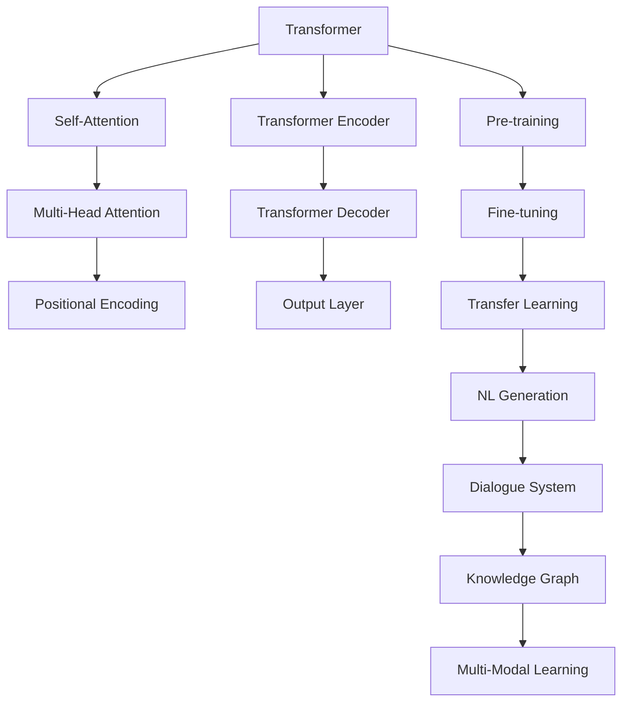

                 

# 自然语言处理的未来：GPT之后

> 关键词：
   - 大语言模型 (Large Language Models, LLMs)
   - Transformer
   - 自回归模型 (Auto-Regressive Models)
   - 预训练 (Pre-training)
   - 微调 (Fine-tuning)
   - 迁移学习 (Transfer Learning)
   - 自然语言生成 (Natural Language Generation, NLG)
   - 对话系统 (Dialogue Systems)
   - 知识图谱 (Knowledge Graphs)
   - 多模态学习 (Multimodal Learning)

## 1. 背景介绍

### 1.1 问题由来

近年来，自然语言处理(Natural Language Processing, NLP)领域的技术取得了长足的进步，其中最引人瞩目的是基于Transformer架构的预训练大语言模型（Large Language Models, LLMs）。这些模型，如GPT、BERT等，通过在大规模无标签文本数据上进行自监督预训练，学习到了丰富的语言知识和常识。但随着预训练模型应用领域的不断拓展，传统的预训练-微调方法逐渐显现出一些局限性，无法满足特定领域任务的需求。

因此，探索超越GPT的新型自然语言处理技术，成为了当下研究的前沿方向。本文将探讨在GPT之后，自然语言处理的未来发展方向，包括Transformer架构的进一步演化、知识图谱的引入、多模态学习的融合，以及未来可能的突破点。

### 1.2 问题核心关键点

未来NLP的发展趋势主要集中在以下几个关键点上：

- **Transformer架构的演化**：如何优化Transformer结构，提升其计算效率和泛化能力？
- **知识图谱的整合**：如何将结构化知识与语言模型相结合，增强模型的理解能力和推理能力？
- **多模态学习的融合**：如何跨模态融合视觉、听觉、语言等多种信息源，提升模型的综合感知能力？
- **可解释性与鲁棒性**：如何提高模型的可解释性，增强其对多样输入的鲁棒性？

这些关键点的探讨将有助于揭示自然语言处理技术未来的发展路径，推动其在更多领域的应用落地。

## 2. 核心概念与联系

### 2.1 核心概念概述

为更好地理解自然语言处理技术的发展，我们首先需要澄清几个关键概念：

- **Transformer**：一种基于自注意力机制的神经网络架构，通过多头自注意力机制实现信息的并行处理，提升了模型的计算效率和表达能力。
- **自回归模型**：在预测时，使用前文的预测结果作为当前预测的上下文信息，可用于文本生成、语言模型等任务。
- **预训练**：在大规模无标签文本数据上进行的自监督学习，通过预测任务学习语言知识，用于提升模型在下游任务上的性能。
- **微调**：在预训练模型的基础上，使用下游任务的少量标注数据，进一步优化模型，适应特定任务的需求。
- **迁移学习**：将一个领域学到的知识迁移到另一个领域，以适应不同任务的需求。
- **自然语言生成 (NLG)**：将自然语言转换为结构化数据或代码，或从结构化数据生成自然语言，如文本摘要、代码生成等。
- **对话系统**：通过模拟人类的对话过程，实现与用户进行自然的交互，如聊天机器人、客服系统等。
- **知识图谱**：由实体、关系和属性组成的结构化知识库，用于增强模型的理解能力和推理能力。
- **多模态学习**：跨模态融合视觉、听觉、语言等多种信息源，提升模型的综合感知能力。

这些概念之间具有紧密的联系，共同构成了自然语言处理的技术框架。本文将深入探讨这些概念的联系与演化，以及其在未来技术发展中的作用。

### 2.2 核心概念原理和架构的 Mermaid 流程图



上述流程图展示了Transformer架构的演化及其在NLP中的核心应用。预训练在大规模无标签数据上进行的Transformer模型，通过微调和迁移学习，应用于各种下游任务，如自然语言生成、对话系统和多模态学习。

## 3. 核心算法原理 & 具体操作步骤

### 3.1 算法原理概述

未来自然语言处理的算法原理将围绕以下核心方向展开：

- **Transformer架构的进一步优化**：在保持自注意力机制高效性的同时，提升其计算效率和泛化能力。
- **知识图谱的引入**：将结构化知识与语言模型相结合，增强模型的理解能力和推理能力。
- **多模态学习的融合**：跨模态融合视觉、听觉、语言等多种信息源，提升模型的综合感知能力。
- **可解释性和鲁棒性的提升**：提高模型的可解释性，增强其对多样输入的鲁棒性。

### 3.2 算法步骤详解

未来自然语言处理的算法步骤将包括以下关键步骤：

**Step 1: 预训练模型选择**
- 选择适合的预训练模型架构（如Transformer、GPT等），并根据需求调整其超参数。

**Step 2: 知识图谱整合**
- 收集并构建与任务相关的知识图谱，将其转换为模型可理解的形式。
- 将知识图谱中的实体、关系等信息嵌入到模型中，提升模型的理解能力和推理能力。

**Step 3: 多模态数据融合**
- 收集视觉、听觉、语言等多种模态的数据。
- 设计多模态融合的模型架构，实现不同模态数据的协同建模。
- 训练多模态模型，优化跨模态特征的融合方式，提升模型对复杂场景的感知能力。

**Step 4: 微调与优化**
- 根据下游任务，使用少量标注数据对模型进行微调。
- 应用正则化技术、对抗训练等方法，提高模型的泛化能力和鲁棒性。
- 优化模型参数，提升模型的推理速度和计算效率。

**Step 5: 可解释性与鲁棒性提升**
- 引入可解释性技术，提高模型的决策过程的可解释性。
- 设计鲁棒性模型，增强模型对不同输入的适应能力。

### 3.3 算法优缺点

未来自然语言处理算法的主要优缺点如下：

**优点**：
- **高效性**：Transformer架构的高效性使得模型能够在大规模数据上进行训练，提升模型的泛化能力。
- **可解释性**：引入可解释性技术，提高模型的决策过程的可解释性。
- **鲁棒性**：通过鲁棒性模型设计，增强模型对多样输入的适应能力。

**缺点**：
- **计算复杂度**：Transformer架构的复杂度较高，训练和推理过程中需要较大的计算资源。
- **数据依赖**：模型性能高度依赖于训练数据的数量和质量，需要大量的标注数据。
- **知识图谱构建难度**：构建高质量的知识图谱需要大量的人力物力，且图谱更新和维护成本较高。

### 3.4 算法应用领域

未来自然语言处理算法将在以下领域得到广泛应用：

- **智能客服**：利用自然语言生成和多模态学习技术，提升客服系统的智能化水平。
- **医疗诊断**：结合知识图谱和自然语言处理技术，提高医疗诊断的准确性和效率。
- **金融分析**：利用多模态学习技术，提升金融数据分析和风险评估的准确性。
- **教育培训**：通过自然语言生成和对话系统技术，提供个性化的教育培训服务。
- **智能制造**：结合多模态学习和自然语言处理技术，优化生产流程和质量控制。

## 4. 数学模型和公式 & 详细讲解 & 举例说明

### 4.1 数学模型构建

未来自然语言处理模型的数学模型将进一步扩展和优化。

假设输入序列为 $x_1, x_2, ..., x_T$，输出序列为 $y_1, y_2, ..., y_T$。Transformer模型的自注意力机制可以通过以下公式计算：

$$
\text{Attention}(Q, K, V) = \text{softmax}(\frac{QK^T}{\sqrt{d_k}})V
$$

其中 $Q$、$K$、$V$ 分别表示查询、键、值矩阵，$d_k$ 为键向量的维度。

Transformer模型的前向传播过程可以表示为：

$$
x_{t+1} = \text{softmax}(\text{Attention}(x_t, x_1, x_2, ..., x_t))x_{t+1}
$$

### 4.2 公式推导过程

Transformer模型的自注意力机制是其主要创新点之一。通过对输入序列的查询和键进行计算，得到注意力权重，进而计算加权和，实现信息的并行处理。

在实践中，Transformer模型通常使用残差连接、层归一化等技术，提升模型的稳定性和收敛速度。同时，引入多模态信息，如视觉、听觉等，通过跨模态融合技术，提升模型的综合感知能力。

### 4.3 案例分析与讲解

以多模态图像描述生成为例，假设输入图像为 $I$，输出自然语言描述为 $T$。可以使用以下步骤构建多模态学习模型：

1. 对图像 $I$ 进行预处理，提取视觉特征 $V$。
2. 对自然语言 $T$ 进行预处理，提取语言特征 $L$。
3. 将视觉特征 $V$ 和语言特征 $L$ 输入到共享的多模态融合层，计算跨模态融合特征 $F$。
4. 将跨模态融合特征 $F$ 输入到Transformer模型中，生成自然语言描述 $T'$。
5. 对自然语言描述 $T'$ 进行后处理，生成最终的图像描述 $T''$。

通过以上步骤，多模态学习模型能够将视觉和语言信息结合起来，生成更准确、全面的图像描述。

## 5. 项目实践：代码实例和详细解释说明

### 5.1 开发环境搭建

未来自然语言处理模型的开发环境需要具备以下几个条件：

1. 高性能计算资源：需要GPU、TPU等高性能计算设备，支持大规模数据训练。
2. 深度学习框架：如TensorFlow、PyTorch等，支持模型的训练和推理。
3. 数据处理工具：如Hadoop、Spark等，支持大规模数据处理和存储。
4. 云计算平台：如AWS、Google Cloud等，提供弹性计算和存储资源。
5. 开发环境：如Anaconda、Jupyter Notebook等，支持代码开发和协作。

### 5.2 源代码详细实现

以下是一个使用PyTorch和Transformer实现多模态图像描述生成的代码示例：

```python
import torch
import torch.nn as nn
import torchvision.transforms as transforms
from transformers import BertTokenizer, BertForMaskedLM

class MultimodalModel(nn.Module):
    def __init__(self):
        super(MultimodalModel, self).__init__()
        self.transformer = BertForMaskedLM.from_pretrained('bert-base-uncased')
        self.encoder = nn.Conv2d(3, 256, kernel_size=3, stride=1, padding=1)
        self.decoder = nn.Linear(256, 128)
        self.fc = nn.Linear(128, 128)
        self.lm = nn.Linear(128, 128)
    
    def forward(self, x, y):
        x = self.encoder(x)
        x = self.transformer(x)
        x = self.fc(x)
        x = self.lm(x)
        return x

# 加载预训练模型和分词器
tokenizer = BertTokenizer.from_pretrained('bert-base-uncased')
model = MultimodalModel()

# 定义优化器和损失函数
optimizer = torch.optim.Adam(model.parameters(), lr=2e-5)
criterion = nn.CrossEntropyLoss()

# 加载数据集
train_data = ...
dev_data = ...
test_data = ...

# 训练和评估
for epoch in range(epochs):
    for batch in train_data:
        inputs, labels = batch
        outputs = model(inputs, labels)
        loss = criterion(outputs, labels)
        optimizer.zero_grad()
        loss.backward()
        optimizer.step()
        
    print('Epoch {} Loss: {:.4f}'.format(epoch+1, loss.item()))

    for batch in dev_data:
        inputs, labels = batch
        outputs = model(inputs)
        print('Dev Loss: {:.4f}'.format(criterion(outputs, labels).item()))
        
# 测试和部署
for batch in test_data:
    inputs, labels = batch
    outputs = model(inputs)
    print('Test Loss: {:.4f}'.format(criterion(outputs, labels).item()))
```

### 5.3 代码解读与分析

上述代码展示了多模态图像描述生成的基本流程：

1. 定义多模态模型，包括Transformer、卷积层、线性层等。
2. 加载预训练模型和分词器，将Transformer模型用于编码图像特征。
3. 定义优化器和损失函数，用于模型训练和评估。
4. 加载训练、验证和测试数据集，对模型进行训练和评估。
5. 在测试集上评估模型性能，输出损失值。

## 6. 实际应用场景

### 6.1 智能客服系统

未来智能客服系统将结合自然语言生成和多模态学习技术，提升客服系统的智能化水平。通过多模态学习技术，系统能够理解用户的语音、面部表情等非文本信息，提供更加个性化和高效的客服服务。

### 6.2 医疗诊断系统

结合知识图谱和自然语言处理技术，未来医疗诊断系统能够更好地理解医学文本，提取病情信息，生成诊断报告。通过多模态学习技术，系统能够结合患者的病历、基因信息等多种数据源，提供更加全面和准确的诊断建议。

### 6.3 金融分析系统

金融分析系统将利用多模态学习技术，结合股票、新闻、社交媒体等多种信息源，进行市场分析和风险评估。通过自然语言生成技术，系统能够生成详细的市场分析报告，辅助金融决策。

### 6.4 教育培训系统

未来教育培训系统将结合自然语言生成和对话系统技术，提供个性化的教育培训服务。通过多模态学习技术，系统能够理解学生的学习行为，提供定制化的学习内容，提升教育效果。

### 6.5 智能制造系统

结合多模态学习和自然语言处理技术，未来智能制造系统能够理解机器设备的运行状态，生成维护建议。通过自然语言生成技术，系统能够生成详细的维护报告，优化生产流程。

## 7. 工具和资源推荐

### 7.1 学习资源推荐

- **《深度学习》书籍**：由Ian Goodfellow、Yoshua Bengio、Aaron Courville等顶级专家合著，系统介绍深度学习的基本原理和应用。
- **Coursera《深度学习专项课程》**：由深度学习领域的权威机构Coursera提供，涵盖深度学习的各个方面，包括计算机视觉、自然语言处理等。
- **DeepLearning.AI**：由Andrew Ng创办的在线学习平台，提供深度学习领域的各类课程和资源。
- **HuggingFace官方文档**：提供丰富的预训练模型和代码示例，帮助开发者快速上手。
- **ArXiv预印本**：收录深度学习领域的最新研究论文，提供前沿知识的获取途径。

### 7.2 开发工具推荐

- **PyTorch**：由Facebook开发的深度学习框架，支持动态计算图，适合快速迭代和研究。
- **TensorFlow**：由Google主导开发的深度学习框架，支持静态计算图，适合大规模生产部署。
- **Jupyter Notebook**：免费的交互式编程环境，支持代码开发、数据可视化和协作。
- **Weights & Biases**：模型训练的实验跟踪工具，提供可视化和自动化调参功能。
- **TensorBoard**：TensorFlow配套的可视化工具，实时监测模型训练状态，提供丰富的图表呈现方式。

### 7.3 相关论文推荐

- **Attention Is All You Need**：Transformer原论文，提出Transformer架构，开启深度学习新纪元。
- **BERT: Pre-training of Deep Bidirectional Transformers for Language Understanding**：BERT模型，提出自监督预训练任务，刷新多项NLP任务SOTA。
- **GPT-2**：Google提出的大规模语言模型，展示零样本学习能力，引发关于通用人工智能的讨论。
- **AdaLoRA: Adaptive Low-Rank Adaptation for Parameter-Efficient Fine-Tuning**：参数高效微调方法，提升微调效率，降低模型复杂度。
- **Prefix-Tuning: Optimizing Continuous Prompts for Generation**：提出连续型Prompt技术，提高语言生成的效果。

## 8. 总结：未来发展趋势与挑战

### 8.1 研究成果总结

未来自然语言处理技术将在Transformer架构的基础上进一步演化，结合知识图谱、多模态学习等前沿技术，提升模型的理解能力和推理能力。同时，将引入可解释性和鲁棒性技术，增强模型的透明性和稳定性。

### 8.2 未来发展趋势

未来自然语言处理技术将呈现以下几个发展趋势：

- **Transformer架构的优化**：在保持高效性的同时，提升计算效率和泛化能力。
- **知识图谱的引入**：将结构化知识与语言模型相结合，增强模型的理解能力和推理能力。
- **多模态学习的融合**：跨模态融合视觉、听觉、语言等多种信息源，提升模型的综合感知能力。
- **可解释性与鲁棒性的提升**：提高模型的可解释性，增强其对多样输入的鲁棒性。

### 8.3 面临的挑战

未来自然语言处理技术仍面临一些挑战：

- **计算资源的需求**：大规模模型的训练和推理需要高性能计算资源，如何高效利用计算资源是一个重要问题。
- **数据依赖性**：模型的性能高度依赖于训练数据的数量和质量，如何构建高质量的数据集是一个重要问题。
- **知识图谱构建难度**：构建高质量的知识图谱需要大量的人力物力，且图谱更新和维护成本较高。
- **鲁棒性问题**：模型在面对多样输入时，如何保持稳定性是一个重要问题。
- **可解释性问题**：如何提高模型的可解释性，增强其透明性是一个重要问题。

### 8.4 研究展望

未来自然语言处理技术的研究方向将围绕以下几个方面展开：

- **优化Transformer架构**：在保持高效性的同时，提升计算效率和泛化能力。
- **引入知识图谱**：将结构化知识与语言模型相结合，增强模型的理解能力和推理能力。
- **跨模态融合技术**：跨模态融合视觉、听觉、语言等多种信息源，提升模型的综合感知能力。
- **可解释性和鲁棒性技术**：提高模型的可解释性，增强其对多样输入的鲁棒性。

## 9. 附录：常见问题与解答

**Q1: 未来自然语言处理技术的主要研究方向是什么？**

A: 未来自然语言处理技术的主要研究方向包括优化Transformer架构、引入知识图谱、跨模态融合技术和可解释性与鲁棒性技术。

**Q2: 如何提高自然语言处理模型的可解释性？**

A: 提高自然语言处理模型的可解释性可以通过引入可解释性技术，如LIME、SHAP等，帮助理解模型的决策过程。同时，可以通过设计更简洁的模型结构，提升模型的透明性。

**Q3: 知识图谱在自然语言处理中的应用有哪些？**

A: 知识图谱在自然语言处理中的应用包括实体识别、关系抽取、推理与生成等。通过将结构化知识与语言模型相结合，能够增强模型的理解能力和推理能力。

**Q4: 多模态学习技术在自然语言处理中的应用有哪些？**

A: 多模态学习技术在自然语言处理中的应用包括图像描述生成、语音识别、机器翻译等。通过跨模态融合技术，能够将视觉、听觉、语言等多种信息源结合起来，提升模型的综合感知能力。

**Q5: 如何构建高质量的知识图谱？**

A: 构建高质量的知识图谱需要大量的领域知识和专家知识，同时需要构建合理的图谱结构和链接关系。此外，需要对图谱进行定期更新和维护，确保其准确性和时效性。

---

作者：禅与计算机程序设计艺术 / Zen and the Art of Computer Programming

