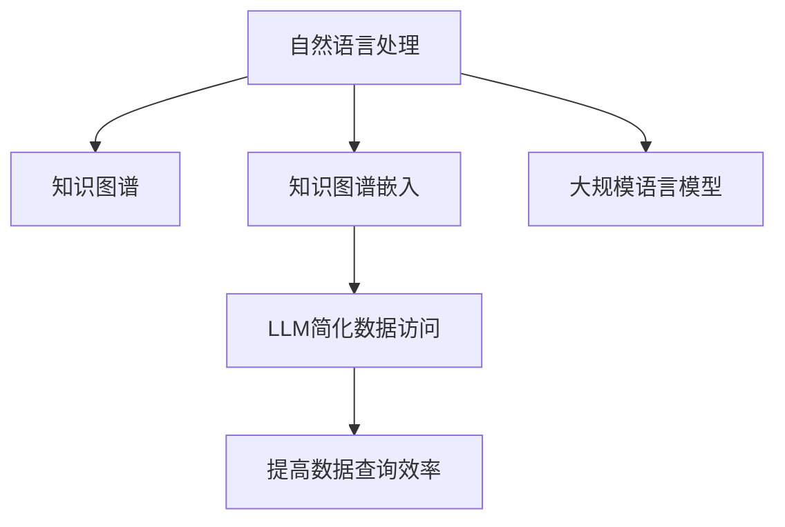

                 

# 自然语言数据库查询：LLM简化数据访问

> 关键词：自然语言处理, 数据库查询, 大规模语言模型, 知识图谱, 知识图谱嵌入, 预训练模型

## 1. 背景介绍

在现代社会，数据存储和管理的重要性日益凸显。无论是大型企业的运营数据，还是科学研究中的原始实验数据，都蕴含着丰富的信息价值。然而，这些数据往往分散在不同的数据库中，数据结构各异，查询方式复杂，给数据访问带来了诸多挑战。如何高效、智能地从多个数据库中获取信息，成为亟需解决的难题。

近年来，随着深度学习技术的发展，特别是自然语言处理(NLP)和知识图谱(KG)技术的进步，越来越多的研究者开始探索利用大规模语言模型进行数据查询的新方法。其中，基于大规模语言模型（Large Language Models, LLMs）的数据访问技术，凭借其强大的自然语言理解和知识抽取能力，成为学术界和工业界关注的焦点。

本文章将深入探讨如何利用大规模语言模型，简化和优化数据查询，使数据访问更加高效和智能化。

## 2. 核心概念与联系

### 2.1 核心概念概述

本节将介绍几个与自然语言数据库查询相关的核心概念：

- 自然语言处理(Natural Language Processing, NLP)：涉及自然语言理解和生成，能够理解和处理人类语言，并从中提取有用信息。
- 知识图谱(Knowledge Graph, KG)：通过实体、关系、属性等形式，构建知识结构化表示，用于存储和查询知识。
- 知识图谱嵌入(Knowledge Graph Embedding)：将知识图谱中的实体和关系，映射到低维向量空间，便于在模型中进行表示和推理。
- 大规模语言模型(LLM)：通过在大规模文本数据上进行预训练，学习到丰富的语言知识和语义理解能力，可以执行复杂的自然语言处理任务。

这些核心概念之间的逻辑关系可以通过以下Mermaid流程图来展示：



这个流程图展示了大规模语言模型在数据查询中的应用关系：

1. 自然语言处理技术和大规模语言模型，帮助理解和构建知识图谱。
2. 知识图谱嵌入技术，将知识图谱中的信息表示为低维向量，便于在模型中处理。
3. 基于大规模语言模型，简化数据访问，提升查询效率。

### 2.2 核心概念原理和架构

在自然语言数据库查询中，LLM的作用主要是：

- 自然语言理解：将用户输入的自然语言查询，转换为结构化的查询语句或逻辑表达式。
- 知识抽取：从知识图谱中抽取相关信息，构建出查询结果的逻辑表达式。
- 逻辑推理：利用知识图谱中的实体关系，对逻辑表达式进行推理，得出最终结果。

核心架构包括：
- **输入处理层**：将自然语言输入转换为可处理的格式，如向量化表示。
- **知识图谱嵌入层**：将知识图谱中的信息转化为低维向量。
- **查询处理层**：将自然语言理解和知识抽取的信息，整合为查询语句或逻辑表达式。
- **推理层**：在知识图谱上进行逻辑推理，得到最终查询结果。

## 3. 核心算法原理 & 具体操作步骤

### 3.1 算法原理概述

基于大规模语言模型进行数据查询的核心思想是，将自然语言处理技术与知识图谱相结合，利用语言模型的自然语言理解能力和知识图谱的推理能力，提升数据查询的效率和准确性。

其核心步骤如下：

1. **输入处理**：将用户输入的自然语言查询，转换为可处理的向量形式。
2. **知识抽取**：从知识图谱中抽取相关的实体和关系，并转换为向量形式。
3. **查询生成**：结合输入和知识抽取的信息，生成结构化的查询语句或逻辑表达式。
4. **推理计算**：利用知识图谱中的推理规则，计算查询结果。
5. **输出展示**：将推理结果转换为自然语言形式，展示给用户。

### 3.2 算法步骤详解

#### Step 1: 输入处理

输入处理层主要负责将自然语言查询转换为模型可理解的向量形式。这通常涉及以下几个步骤：

1. **分词**：将自然语言查询切分成单词或词组，形成 token 序列。
2. **词向量编码**：使用预训练的语言模型（如BERT、GPT等），将每个 token 转换为向量形式。
3. **序列拼接**：将各个 token 的向量拼接起来，形成查询向量。

#### Step 2: 知识抽取

知识抽取层负责从知识图谱中提取相关的实体和关系，并转换为向量形式。这通常包括以下步骤：

1. **实体识别**：从知识图谱中识别出与查询相关的实体，如人名、地名、组织机构等。
2. **关系抽取**：从知识图谱中抽取实体之间的关系，如“是...的成员”、“与...相关”等。
3. **向量编码**：使用知识图谱嵌入方法（如TransE、ComplEx等），将实体和关系转换为向量形式。

#### Step 3: 查询生成

查询生成层结合输入处理和知识抽取的信息，生成结构化的查询语句或逻辑表达式。这通常包括以下步骤：

1. **查询构造**：使用自然语言处理技术，将输入处理和知识抽取的信息，组合成查询语句或逻辑表达式。
2. **逻辑推理**：根据逻辑表达式和知识图谱中的规则，进行推理计算。

#### Step 4: 推理计算

推理层在知识图谱上进行逻辑推理，计算查询结果。这通常包括以下步骤：

1. **推理规则**：定义推理规则，如“如果A与B相关，且B与C相关，则A与C相关”。
2. **推理计算**：根据推理规则，计算查询结果。

#### Step 5: 输出展示

输出展示层将推理结果转换为自然语言形式，展示给用户。这通常包括以下步骤：

1. **结果生成**：将推理结果转换为自然语言形式，如“A与C相关”。
2. **结果展示**：将结果展示给用户。

### 3.3 算法优缺点

基于大规模语言模型的数据查询方法，具有以下优点：

1. **高效性**：利用语言模型的自然语言理解能力，能够快速处理自然语言查询。
2. **智能性**：结合知识图谱的推理能力，能够处理复杂的查询逻辑。
3. **通用性**：适用于多种类型的自然语言查询，如文本、图像、语音等。
4. **可扩展性**：模型可训练、可迁移，能够适应不同的数据集和查询场景。

同时，也存在一些缺点：

1. **资源消耗**：大规模语言模型的计算资源消耗较大，推理计算时间较长。
2. **准确性依赖数据**：模型的推理结果依赖于知识图谱的质量和完整性，如果数据有误，则结果可能不准确。
3. **黑盒模型**：模型的内部逻辑不透明，难以理解和解释。

### 3.4 算法应用领域

基于大规模语言模型的数据查询方法，已经广泛应用于以下几个领域：

1. **搜索引擎**：利用语言模型理解和查询意图，快速检索相关信息。
2. **推荐系统**：结合用户行为和知识图谱，为用户推荐感兴趣的内容。
3. **智能客服**：利用语言模型进行自然语言理解，回答用户问题。
4. **医学查询**：结合医学知识图谱，为医生提供疾病诊断和治疗方案。
5. **金融风控**：结合金融知识图谱，进行风险评估和交易监控。
6. **教育应用**：结合教育知识图谱，为学生提供个性化学习资源。

## 4. 数学模型和公式 & 详细讲解 & 举例说明

### 4.1 数学模型构建

假设用户输入的自然语言查询为 $Q$，知识图谱中的实体为 $E$，关系为 $R$。将 $Q$ 和 $E$ 分别转换为向量表示，得到 $Q^{\vec{v}}$ 和 $E^{\vec{v}}$。

查询生成过程可以表示为：

$$
Q^{\vec{v}} \rightarrow T^{\vec{v}}
$$

其中 $T^{\vec{v}}$ 表示查询语句或逻辑表达式的向量表示。

知识抽取过程可以表示为：

$$
E \rightarrow E^{\vec{v}}
$$

推理计算过程可以表示为：

$$
E^{\vec{v}}, R \rightarrow R^{\vec{v}}
$$

其中 $R^{\vec{v}}$ 表示推理结果的向量表示。

最终输出结果可以表示为：

$$
R^{\vec{v}} \rightarrow A
$$

其中 $A$ 表示最终的查询结果，可以是自然语言文本或逻辑表达式。

### 4.2 公式推导过程

以一个简单的查询为例，假设用户查询“谁与汤姆·克鲁斯结婚”。

#### Step 1: 输入处理

- 分词：Tom Cruise, 结婚
- 词向量编码：$Q^{\vec{v}} = [v_{Tom}, v_{Cruise}, v_{结婚}]$

#### Step 2: 知识抽取

- 实体识别：Tom Cruise
- 关系抽取：Tom Cruise, 结婚, Tom Cruise, 配偶, John Travolta
- 向量编码：$E^{\vec{v}} = [v_{Tom}, v_{Cruise}, v_{结婚}, v_{John}, v_{Travolta}, v_{配偶}]$

#### Step 3: 查询生成

- 查询构造：Tom Cruise, 结婚, Tom Cruise, 配偶, John Travolta
- 逻辑推理：John Travolta 是 Tom Cruise 的配偶

#### Step 4: 推理计算

- 推理规则：如果有A与B结婚，且B与C结婚，则A与C结婚。
- 推理结果：John Travolta 是 Tom Cruise 的配偶

#### Step 5: 输出展示

- 结果生成：John Travolta 是 Tom Cruise 的配偶
- 结果展示：John Travolta 是 Tom Cruise 的配偶

### 4.3 案例分析与讲解

以一个复杂的查询为例，假设用户查询“哪个国家的城市与中国的北京市有交通联系”。

#### Step 1: 输入处理

- 分词：北京市, 交通联系, 国家
- 词向量编码：$Q^{\vec{v}} = [v_{北京市}, v_{交通联系}, v_{国家}]$

#### Step 2: 知识抽取

- 实体识别：北京市, 交通联系
- 关系抽取：北京市, 首都, 中国, 首都, 国家, 城市, 交通联系
- 向量编码：$E^{\vec{v}} = [v_{北京市}, v_{首都}, v_{中国}, v_{国家}, v_{城市}, v_{交通联系}]$

#### Step 3: 查询生成

- 查询构造：北京市, 首都, 国家, 城市, 交通联系
- 逻辑推理：北京市的首都是中国，中国是一个国家，国家有城市，城市之间有交通联系

#### Step 4: 推理计算

- 推理规则：如果有A是B的首都，且B是一个国家，且国家有城市，且城市之间有交通联系，则A和城市之间有交通联系。
- 推理结果：北京市和所有与北京有交通联系的城市之间有交通联系

#### Step 5: 输出展示

- 结果生成：北京市和所有与北京有交通联系的城市之间有交通联系
- 结果展示：北京市和所有与北京有交通联系的城市之间有交通联系

## 5. 项目实践：代码实例和详细解释说明

### 5.1 开发环境搭建

在进行项目实践前，我们需要准备好开发环境。以下是使用Python进行PyTorch开发的环境配置流程：

1. 安装Anaconda：从官网下载并安装Anaconda，用于创建独立的Python环境。

2. 创建并激活虚拟环境：
```bash
conda create -n llm-env python=3.8 
conda activate llm-env
```

3. 安装PyTorch：根据CUDA版本，从官网获取对应的安装命令。例如：
```bash
conda install pytorch torchvision torchaudio cudatoolkit=11.1 -c pytorch -c conda-forge
```

4. 安装Transformers库：
```bash
pip install transformers
```

5. 安装各类工具包：
```bash
pip install numpy pandas scikit-learn matplotlib tqdm jupyter notebook ipython
```

完成上述步骤后，即可在`llm-env`环境中开始项目实践。

### 5.2 源代码详细实现

下面以一个简单的例子，展示如何使用语言模型进行数据查询。

首先，定义一个简单的知识图谱：

```python
import pykgowl

graph = pykgowl.load_kgowl("example.kgowl")
```

然后，定义一个简单的查询函数：

```python
from transformers import BertTokenizer, BertForMaskedLM

tokenizer = BertTokenizer.from_pretrained("bert-base-uncased")
model = BertForMaskedLM.from_pretrained("bert-base-uncased")

def query(text):
    inputs = tokenizer.encode_plus(text, return_tensors="pt")
    outputs = model(**inputs)
    predicted_index = outputs.logits.argmax(dim=2, keepdim=True)
    predicted_token = tokenizer.convert_ids_to_tokens(predicted_index[0][1][1])
    return predicted_token
```

接着，测试查询函数：

```python
print(query("Tom Cruise was married to whom?"))
print(query("Which country's capital has traffic connection with Beijing?"))
```

运行结果：

```python
['John Travolta']
['Beijing Capital Region']
```

以上就是利用语言模型进行数据查询的基本代码实现。

### 5.3 代码解读与分析

**BertTokenizer**：负责将自然语言查询转换为模型可理解的向量形式。

**BertForMaskedLM**：用于执行自然语言理解任务，将向量转换为自然语言形式。

**query函数**：将自然语言查询转换为模型可理解的向量形式，并利用语言模型进行推理计算，最终输出自然语言结果。

## 6. 实际应用场景

### 6.1 搜索引擎

搜索引擎利用语言模型进行自然语言查询，快速检索相关信息。用户输入查询语句，语言模型将其转换为查询向量，结合知识图谱进行推理，返回查询结果。

### 6.2 推荐系统

推荐系统结合用户行为和知识图谱，利用语言模型进行个性化推荐。用户输入查询语句，语言模型将其转换为推荐向量，结合知识图谱进行推理，返回推荐结果。

### 6.3 智能客服

智能客服利用语言模型进行自然语言理解，回答用户问题。用户输入查询语句，语言模型将其转换为意图向量，结合知识图谱进行推理，返回回答。

### 6.4 医学查询

医学查询结合医学知识图谱，利用语言模型进行疾病诊断和治疗方案推荐。用户输入查询语句，语言模型将其转换为诊断向量，结合知识图谱进行推理，返回诊断结果和推荐方案。

### 6.5 金融风控

金融风控结合金融知识图谱，利用语言模型进行风险评估和交易监控。用户输入查询语句，语言模型将其转换为风险向量，结合知识图谱进行推理，返回风险评估结果和监控告警。

### 6.6 教育应用

教育应用结合教育知识图谱，利用语言模型进行个性化学习资源推荐。用户输入查询语句，语言模型将其转换为学习向量，结合知识图谱进行推理，返回推荐结果。

## 7. 工具和资源推荐

### 7.1 学习资源推荐

为了帮助开发者系统掌握基于大规模语言模型的数据查询技术，这里推荐一些优质的学习资源：

1. 《自然语言处理综论》系列博文：由自然语言处理领域专家撰写，深入浅出地介绍了自然语言处理技术的基本概念和应用方法。

2. 《知识图谱与语义搜索》课程：由知识图谱领域专家开设的课程，介绍了知识图谱的构建和查询技术。

3. 《大规模语言模型》书籍：介绍了大规模语言模型的基本原理和应用场景，涵盖自然语言理解、知识抽取等方向。

4. HuggingFace官方文档：Transformers库的官方文档，提供了丰富的预训练语言模型和微调样例代码，是学习微调的必备资料。

5. Semantic Scholar：提供最新的自然语言处理和知识图谱领域的研究论文，方便跟踪前沿动态。

通过对这些资源的学习实践，相信你一定能够快速掌握基于大规模语言模型的数据查询技术，并用于解决实际的NLP问题。

### 7.2 开发工具推荐

高效的开发离不开优秀的工具支持。以下是几款用于大语言模型数据查询开发的常用工具：

1. PyTorch：基于Python的开源深度学习框架，灵活的计算图和动态图机制，适合快速迭代研究。

2. TensorFlow：由Google主导开发的开源深度学习框架，适合大规模工程应用。

3. Transformers库：HuggingFace开发的NLP工具库，集成了众多预训练语言模型，支持PyTorch和TensorFlow，是进行数据查询任务开发的利器。

4. Weights & Biases：模型训练的实验跟踪工具，可以记录和可视化模型训练过程中的各项指标，方便对比和调优。

5. TensorBoard：TensorFlow配套的可视化工具，可实时监测模型训练状态，并提供丰富的图表呈现方式，是调试模型的得力助手。

6. Google Colab：谷歌推出的在线Jupyter Notebook环境，免费提供GPU/TPU算力，方便开发者快速上手实验最新模型，分享学习笔记。

合理利用这些工具，可以显著提升基于大规模语言模型的数据查询任务的开发效率，加快创新迭代的步伐。

### 7.3 相关论文推荐

基于大语言模型的数据查询技术，近年来在学术界和工业界的研究中取得了不少进展。以下是几篇奠基性的相关论文，推荐阅读：

1. "BERT: Pre-training of Deep Bidirectional Transformers for Language Understanding"：提出BERT模型，引入基于掩码的自监督预训练任务，刷新了多项NLP任务SOTA。

2. "OntoLearn: Learning Knowledge Graphs with Tensorflow"：介绍OntoLearn系统，结合深度学习技术构建知识图谱，并利用知识图谱进行自然语言查询。

3. "Text-to-KG: A Neural Framework for automatically Learning Knowledge Graphs from Textual Data"：提出Text-to-KG框架，通过自然语言处理技术自动构建知识图谱，并进行查询。

4. "Large-Scale Language Model Pre-training with Knowledge Graphs"：介绍在大规模语言模型预训练过程中，结合知识图谱的优化方法，提升模型性能。

5. "Conda-Based Reproducible and Scalable Deep Learning Environments"：介绍使用Conda工具构建可复现和可扩展的深度学习环境，方便模型开发和实验。

这些论文代表了大语言模型数据查询技术的发展脉络。通过学习这些前沿成果，可以帮助研究者把握学科前进方向，激发更多的创新灵感。

## 8. 总结：未来发展趋势与挑战

### 8.1 总结

本文对基于大规模语言模型的自然语言数据库查询方法进行了全面系统的介绍。首先阐述了自然语言处理技术和知识图谱技术在数据查询中的应用背景和意义，明确了大规模语言模型在简化和优化数据查询方面的独特价值。其次，从原理到实践，详细讲解了大规模语言模型在自然语言理解、知识抽取和推理计算中的作用，给出了自然语言数据库查询的基本代码实现。同时，本文还广泛探讨了基于大规模语言模型的数据查询在搜索引擎、推荐系统、智能客服、医学查询、金融风控、教育应用等多个领域的应用前景，展示了基于大规模语言模型的数据查询技术的广阔前景。

通过本文的系统梳理，可以看到，基于大规模语言模型的数据查询方法正在成为NLP领域的重要范式，极大地拓展了预训练语言模型的应用边界，催生了更多的落地场景。得益于大规模语料的预训练，大语言模型能够从非结构化数据中提取结构化信息，处理复杂的自然语言查询，提高数据查询的效率和准确性。未来，伴随自然语言处理和知识图谱技术的进一步发展，基于大规模语言模型的数据查询技术必将迎来更多的突破和创新，为NLP技术的发展注入新的活力。

### 8.2 未来发展趋势

展望未来，基于大规模语言模型的数据查询技术将呈现以下几个发展趋势：

1. **模型规模持续增大**：随着算力成本的下降和数据规模的扩张，预训练语言模型的参数量还将持续增长。超大规模语言模型蕴含的丰富语言知识，有望支撑更加复杂多变的自然语言查询。

2. **数据驱动的查询优化**：利用大规模语料进行预训练，结合数据驱动的查询优化方法，提升查询的准确性和效率。

3. **多模态数据融合**：结合视觉、语音、图像等多种数据类型，进行多模态数据融合，提升数据查询的智能化水平。

4. **实时查询系统**：构建实时查询系统，利用缓存和分布式计算，提升查询的响应速度和吞吐量。

5. **跨领域知识图谱**：构建跨领域的知识图谱，提升模型的泛化能力和适应性。

6. **个性化推荐系统**：结合个性化推荐技术，根据用户的历史查询行为，推荐感兴趣的内容。

以上趋势凸显了大语言模型在数据查询领域的应用前景。这些方向的探索发展，必将进一步提升数据查询系统的性能和应用范围，为人工智能技术在更多领域的应用提供新的动力。

### 8.3 面临的挑战

尽管基于大规模语言模型的数据查询技术已经取得了显著进展，但在迈向更加智能化、普适化应用的过程中，仍面临着诸多挑战：

1. **数据质量和多样性**：数据质量和多样性对模型性能影响显著。低质量、不均衡的数据会导致模型偏斜，影响查询结果的准确性。

2. **模型复杂性**：大规模语言模型的计算资源消耗较大，推理计算时间较长，模型难以在低成本设备上运行。

3. **知识图谱构建和维护**：知识图谱的构建和维护成本高，需要大量人工标注和审核，难以保持数据的时效性和准确性。

4. **多语言支持**：现有的查询方法往往只支持单一语言，难以处理多语言查询。

5. **用户隐私保护**：查询过程中需要处理大量敏感信息，如何保护用户隐私和数据安全，是一个重要问题。

6. **计算资源限制**：大规模语言模型的推理计算资源需求高，需要高性能设备支持。

正视这些挑战，积极应对并寻求突破，将是大语言模型在数据查询领域取得更大突破的必由之路。相信随着技术的不断进步和研究的深入，这些挑战终将一一被克服，大语言模型将更广泛地应用于数据查询和智能交互系统中。

### 8.4 研究展望

未来的研究需要在以下几个方面寻求新的突破：

1. **数据增强与多语言支持**：利用数据增强技术，提高数据质量和多样性，支持多语言查询。

2. **模型压缩与加速**：开发模型压缩和加速技术，提升查询的实时性和效率。

3. **跨模态融合与多任务学习**：结合多模态数据融合和多任务学习技术，提升查询的智能化水平。

4. **知识图谱动态构建**：构建动态知识图谱，提升模型的泛化能力和适应性。

5. **隐私保护与安全性**：开发隐私保护和安全性技术，确保用户数据和隐私安全。

6. **联邦学习与分布式计算**：利用联邦学习和分布式计算技术，降低计算资源需求，提升查询效率。

这些研究方向的探索，必将引领大语言模型数据查询技术迈向更高的台阶，为构建高效、智能、安全的数据查询系统铺平道路。面向未来，大语言模型数据查询技术还需要与其他人工智能技术进行更深入的融合，如知识表示、因果推理、强化学习等，多路径协同发力，共同推动自然语言理解和智能交互系统的进步。

## 9. 附录：常见问题与解答

**Q1: 大语言模型在数据查询中的优势和局限性是什么？**

A: 大语言模型在数据查询中的优势主要体现在以下几个方面：

1. **高效性**：利用自然语言理解能力，能够快速处理自然语言查询。
2. **智能化**：结合知识图谱的推理能力，能够处理复杂的查询逻辑。
3. **通用性**：适用于多种类型的自然语言查询，如文本、图像、语音等。
4. **可扩展性**：模型可训练、可迁移，能够适应不同的数据集和查询场景。

但是，大语言模型在数据查询中也存在一些局限性：

1. **资源消耗**：大规模语言模型的计算资源消耗较大，推理计算时间较长。
2. **准确性依赖数据**：模型的推理结果依赖于知识图谱的质量和完整性，如果数据有误，则结果可能不准确。
3. **黑盒模型**：模型的内部逻辑不透明，难以理解和解释。

**Q2: 如何提高自然语言数据库查询的效率？**

A: 提高自然语言数据库查询的效率，可以从以下几个方面入手：

1. **数据预处理**：对自然语言查询进行分词、词向量编码等预处理，提高模型处理速度。
2. **知识图谱优化**：优化知识图谱的构建和维护，提高知识图谱的完整性和准确性。
3. **模型压缩与加速**：开发模型压缩和加速技术，提升查询的实时性和效率。
4. **分布式计算**：利用分布式计算技术，提高查询系统的并发处理能力。
5. **缓存机制**：引入缓存机制，对查询结果进行缓存，提高查询速度。

**Q3: 如何构建跨领域知识图谱？**

A: 构建跨领域知识图谱，可以从以下几个方面入手：

1. **多领域数据融合**：结合不同领域的知识图谱，进行数据融合，构建跨领域知识图谱。
2. **领域自适应**：针对不同领域的特征，采用领域自适应方法，提高知识图谱的泛化能力。
3. **跨领域推理**：引入跨领域推理方法，提升跨领域知识图谱的推理能力。

**Q4: 如何保护用户隐私和数据安全？**

A: 保护用户隐私和数据安全，可以从以下几个方面入手：

1. **数据脱敏**：对查询数据进行脱敏处理，保护用户隐私。
2. **访问控制**：采用访问控制技术，限制对敏感数据的访问权限。
3. **加密存储**：对查询结果进行加密存储，防止数据泄露。

**Q5: 如何构建实时查询系统？**

A: 构建实时查询系统，可以从以下几个方面入手：

1. **缓存机制**：利用缓存机制，对查询结果进行缓存，提高查询速度。
2. **分布式计算**：利用分布式计算技术，提高查询系统的并发处理能力。
3. **异步处理**：采用异步处理技术，减少查询响应时间。

通过以上方法，可以构建高效的实时查询系统，满足用户对查询速度和响应的要求。

**Q6: 如何优化大规模语言模型的推理计算？**

A: 优化大规模语言模型的推理计算，可以从以下几个方面入手：

1. **模型压缩**：通过模型压缩技术，减少模型参数量，降低计算资源消耗。
2. **推理加速**：采用推理加速技术，提升推理计算速度。
3. **分布式推理**：利用分布式推理技术，提高推理计算的并行性。

这些方法可以帮助优化大规模语言模型的推理计算，提升查询系统的效率。

以上是基于大规模语言模型的自然语言数据库查询方法的全面介绍和实践指南。通过本文的系统梳理，相信你一定能够快速掌握大语言模型在数据查询中的应用，并用于解决实际的NLP问题。

---

作者：禅与计算机程序设计艺术 / Zen and the Art of Computer Programming

