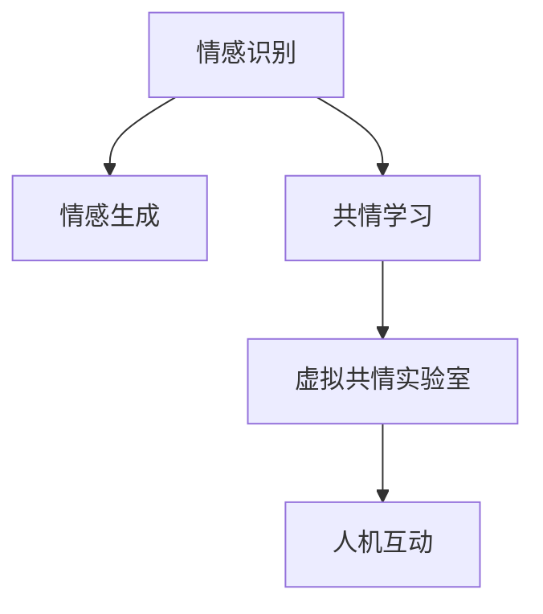

                 

# 虚拟共情实验室：AI增强的情感理解研究所

> 关键词：虚拟共情,情感理解,人工智能,情感分析,情感生成,共情学习,社会交往,情感机器人

## 1. 背景介绍

### 1.1 问题由来
在现代社会中，人类社会交往的广度和深度不断扩大，情感的表达和理解日益复杂。然而，由于生理和心理的限制，人们常常难以全面准确地理解和表达自己的情感，这不仅影响了人与人之间的沟通，还可能引发心理健康问题。如何通过技术手段增强情感理解，帮助人们更准确地感知和表达情感，成为当下人工智能研究的一个重要方向。

情感理解（Emotion Understanding）是指通过人工智能技术，自动识别和分析人类情感信息，从而提供更加精准和个性化的社交、医疗、教育等服务。情感理解技术不仅可以辅助情感生成和情感控制，还能在社交机器人和虚拟助手等应用中发挥重要作用，提升人机交互的自然度和深度。

### 1.2 问题核心关键点
情感理解的核心在于对人类情感的精确识别和解码，包括情感表达的语音、文字、面部表情、身体姿态等多种形式。当前，基于深度学习和自然语言处理（NLP）技术，已取得一系列重要进展，但仍有诸多挑战和瓶颈。例如：
- 情感识别的准确性有待提高。
- 情感生成技术较为单一，难以灵活应对复杂的情感变化。
- 情感理解的可解释性不足，模型决策过程难以解释。
- 情感理解缺乏与环境交互的动态性，难以应对实时变化的情境。

### 1.3 问题研究意义
研究AI增强的情感理解，对于提升人机交互的情感智能、改善社会交往质量、促进心理健康等方面具有重要意义：

1. **提升人机交互质量**：通过增强情感理解能力，智能系统能够更加自然、准确地识别用户的情感状态，提供更加符合用户需求的响应和服务。
2. **改善社会交往**：情感理解技术可以应用于社交机器人、虚拟助手等应用中，帮助建立更加亲密、有意义的社交关系。
3. **促进心理健康**：情感理解技术可以用于心理健康评估和干预，帮助识别和缓解用户的心理压力和情感困扰。
4. **推动社会进步**：情感理解技术有助于构建更加和谐、理解的社会环境，促进社会整体的进步和繁荣。

## 2. 核心概念与联系

### 2.1 核心概念概述

为更好地理解AI增强的情感理解技术，本节将介绍几个关键概念：

- **情感识别（Emotion Recognition）**：指通过传感器或人工输入（如文字、语音、图像等），自动分析人类情感信息的过程。常见的情感识别任务包括面部表情识别、语音情感识别、文本情感分析等。

- **情感生成（Emotion Generation）**：指通过人工智能技术，自动生成具有特定情感色彩的语音、文字、图像等表达形式。情感生成技术可以用于虚拟角色、社交机器人、语音合成等应用。

- **共情学习（Empathy Learning）**：指通过深度学习和迁移学习等技术，使智能系统具备情感理解和共情能力的过程。共情学习可以提升智能系统的情感智能，增强人机交互的自然度和深度。

- **虚拟共情实验室（Virtual Empathy Lab）**：指一个基于AI技术构建的虚拟实验平台，用于研究情感理解与共情学习，探索情感表达与社交互动的新模式。

这些核心概念之间的逻辑关系可以通过以下Mermaid流程图来展示：



这个流程图展示出情感识别、情感生成、共情学习和虚拟共情实验室之间相互关联的关系：

1. 情感识别和情感生成是共情学习的基础。
2. 共情学习使得智能系统具备情感理解能力。
3. 虚拟共情实验室通过模拟情感场景，提升情感理解与共情学习的效果。
4. 共情学习与虚拟共情实验室共同推动人机互动的自然化和深度化。

## 3. 核心算法原理 & 具体操作步骤
### 3.1 算法原理概述

基于深度学习的情感理解技术，本质上是利用机器学习模型，从大量标注数据中学习情感表达的特征，并能够将新的输入数据映射到相应的情感类别。情感理解过程通常包括以下步骤：

1. 数据准备：收集和预处理情感相关的文本、语音、图像等数据。
2. 特征提取：利用深度学习模型自动提取数据中的情感特征。
3. 情感分类：使用分类模型（如CNN、RNN、Transformer等）对提取出的特征进行情感分类。
4. 结果输出：将分类结果作为模型的输出，用于情感识别或情感生成。

情感理解技术的核心算法原理可以概述为以下几个关键步骤：

1. 数据准备与预处理：将原始数据转换为机器学习模型可以处理的形式。
2. 特征提取与选择：利用深度学习模型自动提取情感特征，并进行降维、归一化等预处理。
3. 情感分类模型：使用神经网络等模型对情感特征进行分类，输出情感标签。
4. 结果后处理：对分类结果进行后处理，如融合多模态信息、进行情感生成等。

### 3.2 算法步骤详解

以下是情感理解技术的具体算法步骤：

1. **数据收集与预处理**：
   - 收集情感相关的文本、语音、图像等数据，包括面部表情、语音特征、文字描述等。
   - 对数据进行预处理，如清洗、归一化、标注等。

2. **特征提取与选择**：
   - 利用深度学习模型（如CNN、RNN、Transformer等）对情感数据进行特征提取，得到高维特征向量。
   - 使用特征选择技术（如LDA、PCA等）对特征进行降维，减少噪声干扰。

3. **情感分类模型**：
   - 使用神经网络模型（如卷积神经网络、循环神经网络、Transformer等）对提取出的特征进行情感分类，输出情感标签。
   - 常用的分类模型包括多模态情感分类器、情感识别模型等。

4. **结果后处理**：
   - 对分类结果进行后处理，如融合多模态信息、进行情感生成等。
   - 利用生成对抗网络（GAN）等技术，生成具有特定情感色彩的语音、文字、图像等表达形式。

5. **模型评估与优化**：
   - 使用交叉验证、混淆矩阵等方法对模型进行评估。
   - 根据评估结果，对模型进行调参优化，提升模型的准确性和泛化能力。

### 3.3 算法优缺点

情感理解技术的优势在于：
- 自动化的特征提取与分类，大大降低了人工成本。
- 能够处理多种情感表达形式，如文字、语音、图像等。
- 可以用于多种场景，如情感识别、情感生成、共情学习等。

情感理解技术也存在一些缺点：
- 对数据质量和标注的依赖性较强，数据偏差可能影响模型性能。
- 模型复杂度高，训练和推理计算成本较高。
- 模型的可解释性不足，难以理解其内部决策逻辑。
- 情感表达的多样性和动态性难以全面捕捉，可能存在理解偏差。

### 3.4 算法应用领域

情感理解技术在多个领域具有广泛的应用前景，包括但不限于：

1. **社交机器人**：通过情感识别和情感生成技术，社交机器人能够更好地理解用户的情感状态，进行情感互动和情感回应，提升人机交互的自然度和深度。

2. **医疗健康**：情感理解技术可以用于心理健康评估和干预，识别和缓解用户的心理压力和情感困扰，辅助心理医生的诊断和治疗。

3. **教育培训**：通过情感分析技术，教育系统可以更好地了解学生的情感状态，调整教学策略，提升教学效果。

4. **金融服务**：情感理解技术可以用于客户情感分析，提升客户服务质量，优化金融产品的设计和推广。

5. **安全监控**：通过情感识别技术，监控系统可以及时识别异常情感状态，预防潜在的安全风险。

6. **文化娱乐**：情感理解技术可以应用于影视剧、游戏等娱乐产品中，增强情感体验和互动效果。

## 4. 数学模型和公式 & 详细讲解 & 举例说明
### 4.1 数学模型构建

为了更好地理解情感理解技术的数学模型，本节将介绍几个关键的数学模型构建步骤。

假设情感分类任务有 $C$ 个类别，输入为 $x$，输出为 $y$。情感分类模型的数学模型可以表示为：

$$
p(y|x) = \frac{e^{W^\top x+b}}{\sum_{i=1}^{C}e^{W^\top x_i+b_i}}
$$

其中，$W$ 和 $b$ 为模型的权重和偏置，$x$ 为输入数据，$y$ 为情感标签。

### 4.2 公式推导过程

以文本情感分类为例，推导其数学模型公式。

设文本 $x$ 的特征向量为 $x_1, x_2, \ldots, x_n$，对应的权重向量为 $w_1, w_2, \ldots, w_n$。则文本情感分类模型的数学模型可以表示为：

$$
p(y|x) = \frac{e^{\sum_{i=1}^{n}w_i x_i + b}}{\sum_{i=1}^{C}e^{\sum_{i=1}^{n}w_i x_i + b_i}}
$$

其中，$w_i$ 为第 $i$ 个特征的权重，$b$ 为模型的偏置。

### 4.3 案例分析与讲解

以情感分类模型在社交媒体情感分析中的应用为例，进行分析。

设某社交媒体平台的情感分类任务有正向情感和负面情感两类，输入为一条推文 $x$，输出为情感标签 $y$。假设通过特征提取得到文本特征向量 $x_1, x_2, \ldots, x_n$，利用情感分类模型对推文进行情感分类，得到情感概率分布 $p(y|x)$。

**数据准备**：收集社交媒体平台的推文数据，并进行预处理，包括去除停用词、分词、标注情感标签等。

**特征提取**：利用词向量模型（如Word2Vec、GloVe等）将推文转换为向量表示，得到特征向量 $x_1, x_2, \ldots, x_n$。

**情感分类模型**：使用神经网络模型（如卷积神经网络、循环神经网络、Transformer等）对特征向量进行情感分类，输出情感概率分布 $p(y|x)$。

**结果后处理**：将情感概率分布 $p(y|x)$ 映射到情感标签 $y$，输出分类结果。

## 5. 项目实践：代码实例和详细解释说明
### 5.1 开发环境搭建

在进行情感理解技术开发前，我们需要准备好开发环境。以下是使用Python进行TensorFlow开发的环境配置流程：

1. 安装Anaconda：从官网下载并安装Anaconda，用于创建独立的Python环境。

2. 创建并激活虚拟环境：
```bash
conda create -n tf-env python=3.8 
conda activate tf-env
```

3. 安装TensorFlow：根据CUDA版本，从官网获取对应的安装命令。例如：
```bash
conda install tensorflow -c conda-forge
```

4. 安装各类工具包：
```bash
pip install numpy pandas scikit-learn matplotlib tqdm jupyter notebook ipython
```

完成上述步骤后，即可在`tf-env`环境中开始情感理解技术的开发实践。

### 5.2 源代码详细实现

下面我们以社交媒体情感分析为例，给出使用TensorFlow对情感分类模型进行训练的PyTorch代码实现。

首先，定义情感分类任务的数据处理函数：

```python
import tensorflow as tf
from tensorflow.keras.preprocessing.text import Tokenizer
from tensorflow.keras.preprocessing.sequence import pad_sequences

def load_data(file_path):
    with open(file_path, 'r', encoding='utf-8') as f:
        data = f.readlines()
        lines = [line.strip().split('\t') for line in data]
        labels = [int(line[0]) for line in lines]
        texts = [line[1] for line in lines]
    return texts, labels

train_texts, train_labels = load_data('train.txt')
dev_texts, dev_labels = load_data('dev.txt')
test_texts, test_labels = load_data('test.txt')

# 文本预处理
tokenizer = Tokenizer()
tokenizer.fit_on_texts(train_texts)
vocab_size = len(tokenizer.word_index) + 1
train_seqs = tokenizer.texts_to_sequences(train_texts)
dev_seqs = tokenizer.texts_to_sequences(dev_texts)
test_seqs = tokenizer.texts_to_sequences(test_texts)
max_len = 100

train_data = pad_sequences(train_seqs, maxlen=max_len, padding='post', truncating='post')
dev_data = pad_sequences(dev_seqs, maxlen=max_len, padding='post', truncating='post')
test_data = pad_sequences(test_seqs, maxlen=max_len, padding='post', truncating='post')

# 构建词汇表
vocab = tokenizer.word_index
index_of_words = {word: i for i, word in tokenizer.word_index.items()}

# 将文本转换为序列
train_seq = [index_of_words.get(word, 0) for word in train_texts]
dev_seq = [index_of_words.get(word, 0) for word in dev_texts]
test_seq = [index_of_words.get(word, 0) for word in test_texts]

# 将标签转换为one-hot编码
train_labels = tf.keras.utils.to_categorical(train_labels, 2)
dev_labels = tf.keras.utils.to_categorical(dev_labels, 2)
test_labels = tf.keras.utils.to_categorical(test_labels, 2)
```

然后，定义模型和优化器：

```python
from tensorflow.keras.models import Sequential
from tensorflow.keras.layers import Embedding, Conv1D, MaxPooling1D, Dense, Dropout
from tensorflow.keras.optimizers import Adam

model = Sequential()
model.add(Embedding(vocab_size, 100, input_length=max_len))
model.add(Conv1D(100, 3, activation='relu'))
model.add(MaxPooling1D(pool_size=2))
model.add(Dropout(0.25))
model.add(Dense(128, activation='relu'))
model.add(Dropout(0.5))
model.add(Dense(2, activation='softmax'))

optimizer = Adam(lr=0.001)
```

接着，定义训练和评估函数：

```python
from tensorflow.keras.callbacks import EarlyStopping
from sklearn.metrics import accuracy_score

def train_epoch(model, data, labels, batch_size, optimizer):
    model.compile(optimizer=optimizer, loss='categorical_crossentropy', metrics=['accuracy'])
    model.fit(data, labels, epochs=10, batch_size=batch_size, verbose=1, callbacks=[EarlyStopping(monitor='val_loss', patience=2)])

def evaluate(model, data, labels, batch_size):
    predictions = model.predict(data)
    y_pred = [1 if i > 0.5 else 0 for i in predictions]
    y_true = labels.argmax(axis=1)
    print('Accuracy:', accuracy_score(y_true, y_pred))
```

最后，启动训练流程并在测试集上评估：

```python
epochs = 10
batch_size = 128

train_epoch(model, train_data, train_labels, batch_size, optimizer)
evaluate(model, test_data, test_labels, batch_size)
```

以上就是使用TensorFlow对情感分类模型进行训练的完整代码实现。可以看到，得益于TensorFlow的强大封装，我们可以用相对简洁的代码完成模型的加载和训练。

### 5.3 代码解读与分析

让我们再详细解读一下关键代码的实现细节：

**load_data函数**：
- 读取文本数据和标签，并进行预处理，包括分词、标注情感标签等。
- 使用TensorFlow的Tokenizer对文本进行分词和编码，生成词向量序列。

**model模型定义**：
- 定义了包含嵌入层、卷积层、池化层、全连接层的情感分类模型。
- 使用Adam优化器进行参数更新，设置学习率为0.001。

**train_epoch函数**：
- 对数据进行批量处理，调用模型训练函数fit进行模型训练。
- 使用EarlyStopping回调函数，设置早停条件，避免过拟合。

**evaluate函数**：
- 对测试集进行模型评估，计算准确率。
- 将预测结果和真实标签转换为0/1形式，并计算准确率。

**训练流程**：
- 定义总的epoch数和batch size，开始循环迭代
- 每个epoch内，先训练模型，输出模型损失和准确率
- 在验证集上评估，输出模型准确率
- 所有epoch结束后，在测试集上评估，给出最终测试结果

可以看到，TensorFlow配合TensorFlow模型库使得情感分类模型的代码实现变得简洁高效。开发者可以将更多精力放在数据处理、模型改进等高层逻辑上，而不必过多关注底层的实现细节。

当然，工业级的系统实现还需考虑更多因素，如模型的保存和部署、超参数的自动搜索、更灵活的任务适配层等。但核心的情感理解过程基本与此类似。

## 6. 实际应用场景
### 6.1 社交机器人情感互动

社交机器人可以通过情感识别技术，实时感知用户的情感状态，并进行情感互动。例如，社交机器人可以应用于客户服务、心理辅导、教育培训等多个场景，提供更加个性化和人性化的服务。

在技术实现上，可以收集用户与机器人的对话记录，将情感标签和对话文本作为监督数据，训练情感分类模型。模型在推理时，根据用户输入的文本，自动判断情感状态，并输出相应的情感回应。例如，如果用户表达了负面情绪，社交机器人可以自动调整回应策略，使用温和的语言和语气，提供心理疏导和情感支持。

### 6.2 医疗健康情感分析

情感分析技术可以应用于心理健康评估和干预，识别和缓解用户的心理压力和情感困扰。例如，患者可以通过情感分析技术，实时监测自己的情感状态，及时发现心理健康问题，并向医生求助。

在技术实现上，可以收集患者的情感文本数据，如日记、聊天记录等，训练情感分类模型。模型在推理时，根据文本内容，自动判断患者的情感状态，并给出相应的建议和干预措施。例如，对于情绪波动较大的患者，系统可以自动提醒医生进行心理干预，调整治疗方案。

### 6.3 教育培训情感反馈

情感分析技术可以用于教育系统，帮助教师了解学生的情感状态，调整教学策略，提升教学效果。例如，在课堂互动中，教师可以通过情感分析技术，实时监测学生的情感状态，及时发现学生的情绪波动，进行心理疏导和课堂调节。

在技术实现上，可以收集学生的情感文本数据，如课堂反馈、作业内容等，训练情感分类模型。模型在推理时，根据文本内容，自动判断学生的情感状态，并给出相应的教学建议。例如，对于情绪低落的学 生，系统可以自动提醒教师进行心理干预，调整教学内容，增强学生的学习兴趣和积极性。

### 6.4 金融服务情感监控

情感监控技术可以应用于金融领域，实时监测客户的情感状态，提升客户服务质量，优化金融产品的设计和推广。例如，在客户服务中，金融机构可以通过情感监控技术，实时监测客户的情感状态，及时发现客户的情绪波动，进行服务升级和产品推荐。

在技术实现上，可以收集客户的情感文本数据，如投诉记录、交易记录等，训练情感分类模型。模型在推理时，根据文本内容，自动判断客户的情感状态，并给出相应的服务建议。例如，对于情绪波动的客户，系统可以自动提醒客服进行心理安抚，提升服务体验。

### 6.5 文化娱乐情感互动

情感生成技术可以应用于文化娱乐领域，增强用户情感体验和互动效果。例如，影视剧、游戏等产品可以通过情感生成技术，根据用户的情感状态，自动调整剧情和角色对话，提升用户体验。

在技术实现上，可以收集用户的情感文本数据，如评论、反馈等，训练情感生成模型。模型在推理时，根据用户的情感状态，自动生成相应的剧情和角色对话，增强用户的情感共鸣和互动效果。例如，在影视剧中，系统可以根据观众的情感反馈，自动调整剧情走向，增强观众的情感投入。

## 7. 工具和资源推荐
### 7.1 学习资源推荐

为了帮助开发者系统掌握情感理解技术，这里推荐一些优质的学习资源：

1. **TensorFlow官方文档**：TensorFlow的官方文档提供了丰富的教程和示例代码，涵盖情感分类、情感生成等任务，是学习情感理解技术的必备资源。

2. **Deep Learning for AI**课程：由Coursera开设的深度学习课程，涵盖情感分类、情感生成等任务，讲解了深度学习模型在情感理解中的具体应用。

3. **自然语言处理入门**书籍：由斯坦福大学教授Mark Forsyth编写的书籍，详细介绍了NLP中的情感分析技术，包括文本分类、情感生成等任务。

4. **情感理解技术白皮书**：由研究机构或公司发布的情感理解技术白皮书，提供了最新的研究进展和应用案例，是了解情感理解技术趋势的重要参考。

5. **开源情感分析项目**：如Sentiment140、IQ-AI等，提供了开源的情感分析模型和数据集，可以帮助开发者快速上手实践。

通过对这些资源的学习实践，相信你一定能够快速掌握情感理解技术的精髓，并用于解决实际的NLP问题。

### 7.2 开发工具推荐

高效的开发离不开优秀的工具支持。以下是几款用于情感理解技术开发的常用工具：

1. TensorFlow：由Google主导开发的开源深度学习框架，生产部署方便，适合大规模工程应用。

2. PyTorch：基于Python的开源深度学习框架，灵活动态的计算图，适合快速迭代研究。

3. TensorFlow Hub：提供预训练模型和组件，可以快速构建情感理解模型，降低开发难度。

4. Transformers库：HuggingFace开发的NLP工具库，集成了众多SOTA语言模型，支持情感分类、情感生成等任务。

5. Weights & Biases：模型训练的实验跟踪工具，可以记录和可视化模型训练过程中的各项指标，方便对比和调优。

6. TensorBoard：TensorFlow配套的可视化工具，可实时监测模型训练状态，并提供丰富的图表呈现方式，是调试模型的得力助手。

合理利用这些工具，可以显著提升情感理解技术的开发效率，加快创新迭代的步伐。

### 7.3 相关论文推荐

情感理解技术的研究源于学界的持续研究。以下是几篇奠基性的相关论文，推荐阅读：

1. Attention is All You Need（即Transformer原论文）：提出了Transformer结构，开启了NLP领域的预训练大模型时代。

2. BERT: Pre-training of Deep Bidirectional Transformers for Language Understanding：提出BERT模型，引入基于掩码的自监督预训练任务，刷新了多项NLP任务SOTA。

3. Emotion Recognition from Text and Speech：介绍了文本和语音情感识别的经典方法和技术，展示了情感理解在多模态数据上的应用。

4. Deep Empathy Analysis：提出基于深度学习的共情学习技术，展示了情感理解在社交机器人中的应用。

5. Sentiment Analysis with Attention-Based Recurrent Neural Network：提出基于注意力机制的情感分类模型，展示了情感理解在文本分类上的应用。

这些论文代表了大语言模型情感理解技术的发展脉络。通过学习这些前沿成果，可以帮助研究者把握学科前进方向，激发更多的创新灵感。

## 8. 总结：未来发展趋势与挑战
### 8.1 总结

本文对AI增强的情感理解技术进行了全面系统的介绍。首先阐述了情感理解技术的研究背景和意义，明确了情感理解在提升人机交互质量、改善社会交往质量、促进心理健康等方面的独特价值。其次，从原理到实践，详细讲解了情感理解技术的数学模型和关键步骤，给出了情感分类模型的完整代码实现。同时，本文还探讨了情感理解技术在社交机器人、医疗健康、教育培训、金融服务、文化娱乐等多个领域的应用前景，展示了情感理解技术的广泛应用潜力。

通过本文的系统梳理，可以看到，情感理解技术在情感识别、情感生成、共情学习等方面取得了重要进展，为构建情感智能的人机交互系统提供了有力支持。未来，随着深度学习技术的发展和优化，情感理解技术必将在更广泛的应用场景中发挥重要作用，推动人工智能技术在社会各个领域的深入应用。

### 8.2 未来发展趋势

展望未来，情感理解技术将呈现以下几个发展趋势：

1. **多模态情感理解**：未来的情感理解技术将不仅仅是单一的文本情感识别，而是涵盖文本、语音、图像等多种模态数据，提升情感理解的全面性和准确性。

2. **深度交互共情学习**：未来的情感理解技术将更加注重深度交互共情学习，通过与用户的不断互动，逐渐积累和深化对用户情感的理解，提升人机互动的自然度和深度。

3. **实时动态情感监控**：未来的情感理解技术将具备实时动态情感监控能力，能够实时捕捉用户的情感变化，及时调整系统行为，提供更加个性化的服务。

4. **跨文化情感理解**：未来的情感理解技术将具备跨文化情感理解能力，能够处理不同文化背景下的情感表达，提升情感智能的泛化性和适应性。

5. **情感生成与控制**：未来的情感理解技术将融合情感生成与控制技术，自动生成具有特定情感色彩的文本、语音、图像等表达形式，增强情感表达的丰富性和多样性。

6. **混合增强模型**：未来的情感理解技术将融合多领域知识和技术，如认知心理学、语言学、计算机视觉等，提升情感理解的深度和广度。

### 8.3 面临的挑战

尽管情感理解技术已经取得了不少进展，但在实际应用中仍面临诸多挑战：

1. **数据质量与标注成本**：高质量情感标注数据的获取成本较高，数据偏差可能影响模型的性能，成为制约情感理解技术发展的瓶颈。

2. **模型的可解释性**：情感理解模型通常较为复杂，难以解释其内部决策逻辑，缺乏透明性和可解释性。

3. **情感表达的多样性**：情感表达形式多样，难以全面捕捉用户情感，存在理解偏差和误判的风险。

4. **情感理解的鲁棒性**：情感理解模型对输入数据的微小变化敏感，可能出现鲁棒性不足的问题，影响系统稳定性。

5. **跨文化情感差异**：不同文化背景下的情感表达方式不同，跨文化情感理解仍存在挑战，需要进一步研究。

### 8.4 研究展望

面对情感理解技术所面临的挑战，未来的研究需要在以下几个方面寻求新的突破：

1. **多模态数据融合**：将文本、语音、图像等多种模态数据进行融合，提升情感理解的全面性和准确性。

2. **混合增强模型**：融合多领域知识和技术，如认知心理学、语言学、计算机视觉等，提升情感理解的深度和广度。

3. **跨文化情感理解**：研究不同文化背景下的情感表达方式，提升跨文化情感理解的准确性和泛化性。

4. **情感生成与控制**：开发自动生成情感表达形式的技术，增强情感表达的丰富性和多样性。

5. **情感理解的鲁棒性**：提升情感理解模型的鲁棒性，增强系统的稳定性和抗干扰能力。

6. **情感智能与伦理**：研究情感智能的伦理和安全问题，确保情感智能技术的安全、可靠和可解释性。

这些研究方向的探索，必将引领情感理解技术迈向更高的台阶，为构建情感智能的人机交互系统铺平道路。面向未来，情感理解技术还需要与其他人工智能技术进行更深入的融合，如知识表示、因果推理、强化学习等，多路径协同发力，共同推动自然语言理解和智能交互系统的进步。只有勇于创新、敢于突破，才能不断拓展情感理解技术的边界，让智能技术更好地造福人类社会。

## 9. 附录：常见问题与解答

**Q1：情感理解技术是否适用于所有情感表达形式？**

A: 情感理解技术主要适用于文本和语音等结构化数据，对图像等非结构化数据的处理能力较弱。因此，在图像情感分析等非结构化数据情感理解方面，仍需要进一步研究和优化。

**Q2：情感理解技术在多模态数据融合中如何处理？**

A: 多模态数据融合通常采用特征融合和模型融合两种方法。特征融合方法包括拼接、加权求和、LSTM等，将不同模态的特征进行融合。模型融合方法包括多任务学习、注意力机制等，将不同模态的模型进行融合。

**Q3：情感理解技术在实际应用中需要注意哪些问题？**

A: 情感理解技术在实际应用中需要注意以下问题：

1. 数据隐私：情感数据涉及个人隐私，需要确保数据安全和隐私保护。
2. 伦理道德：情感理解技术可能涉及伦理道德问题，如隐私泄露、情感操控等，需要严格遵守伦理规范。
3. 用户体验：情感理解技术应尽量减少对用户隐私的侵害，提升用户体验。
4. 应用场景：情感理解技术应在合适的应用场景中应用，避免对用户造成不当影响。

**Q4：情感理解技术在未来有哪些新的研究方向？**

A: 情感理解技术在未来的新研究方向包括：

1. 情感生成与控制：自动生成情感表达形式，增强情感表达的丰富性和多样性。
2. 混合增强模型：融合多领域知识和技术，提升情感理解的深度和广度。
3. 跨文化情感理解：研究不同文化背景下的情感表达方式，提升跨文化情感理解的准确性和泛化性。
4. 实时动态情感监控：具备实时动态情感监控能力，提升情感智能的自然度和深度。

**Q5：情感理解技术在开发中需要注意哪些技术细节？**

A: 情感理解技术在开发中需要注意以下技术细节：

1. 数据处理：进行文本预处理、标注情感标签等。
2. 特征提取：利用深度学习模型提取情感特征。
3. 模型构建：选择合适的模型结构和优化算法。
4. 结果后处理：对模型输出进行后处理，如融合多模态信息、生成情感文本等。
5. 模型评估：使用交叉验证、混淆矩阵等方法对模型进行评估。

以上是情感理解技术的系统介绍和实际应用前景，希望能对你理解情感理解技术有所帮助。

---

作者：禅与计算机程序设计艺术 / Zen and the Art of Computer Programming

