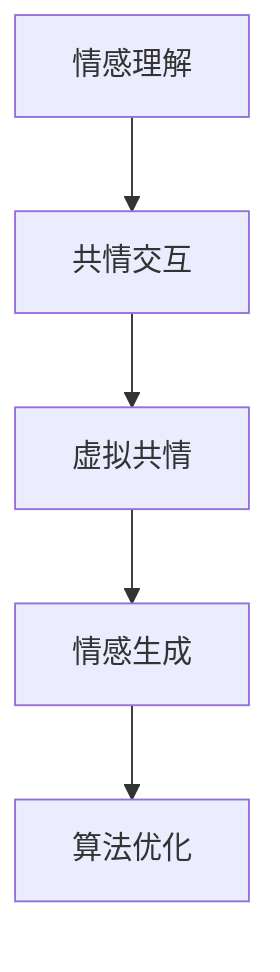

                 

# 虚拟共情能力培养：AI增强的情感理解训练

## 1. 背景介绍

### 1.1 问题由来

在人类社会中，情感的理解和共情能力是建立人际关系、提供优质服务、促进社会和谐的基石。然而，受限于物理距离、生理状态、文化背景等因素，人与人之间的共情能力有时难以跨越。特别是在数字化时代，人们越来越依赖于在线沟通，但屏幕沟通带来的"冷冰冰"感受，往往让人感到孤独和疏远。

为了解决这一问题，研究人员提出了"虚拟共情"的概念，即利用人工智能技术，增强人与人之间的情感理解和共情能力，打破物理和心理的隔阂。这一概念背后，蕴含着对AI技术的深远期望，要求AI不仅能够理解和生成自然语言，还需要具备更高层次的情感理解和共情能力，以实现"人机协同"的共情交流。

### 1.2 问题核心关键点

虚拟共情能力的培养，本质上是利用AI技术提升人类情感理解和共情能力的工程。其核心关键点包括：

1. **情感理解**：AI需要具备理解人类情感的深度模型，包括识别、分类、生成情感等。
2. **共情交互**：AI需要具备共情能力，能够根据人类情感生成合适的回复，甚至辅助人类进行情感表达。
3. **算法优化**：需要选择合适的算法和模型架构，以及有效的训练方法，以优化情感理解与共情交互的效果。
4. **人机协同**：需要构建人机协同的对话系统，使AI能够实时接收人类情感，并作出恰当的回应。
5. **应用场景**：需要寻找实际应用场景，如客服、教育、医疗等领域，验证虚拟共情能力的有效性。

这些问题围绕着AI与人类情感交流的核心，构成了虚拟共情能力培养的关键脉络。通过系统理解和解决这些问题，AI才能真正实现"共情"功能，为人类社会带来实质性的帮助。

## 2. 核心概念与联系

### 2.1 核心概念概述

为更好地理解虚拟共情能力的培养，本节将介绍几个密切相关的核心概念：

- **情感理解**：指AI能够识别、分析人类情感的能力，通常包括情绪、态度、意图等维度。
- **共情交互**：指AI能够根据理解到的情感信息，生成合乎情境的回复，实现情感共情。
- **虚拟共情**：指利用AI技术，增强人与人之间的情感理解和共情能力，跨越物理和心理的隔阂。
- **情感生成**：指AI能够根据上下文信息，生成表达情感的语句，实现自然语言生成。
- **算法优化**：指为提升情感理解与共情交互效果，进行的一系列算法和模型优化工作。

这些核心概念之间的逻辑关系可以通过以下Mermaid流程图来展示：



这个流程图展示了几大核心概念之间的关系：

1. 情感理解是共情交互的基础，共情交互是虚拟共情的关键。
2. 情感生成作为情感理解的一种应用，在虚拟共情中扮演重要角色。
3. 算法优化贯穿始终，是提升情感理解和共情交互效果的必要手段。

## 3. 核心算法原理 & 具体操作步骤
### 3.1 算法原理概述

虚拟共情能力培养的算法原理，主要分为两大部分：情感理解和共情交互。

### 3.2 算法步骤详解

#### 情感理解算法步骤

**Step 1: 数据准备**
- 收集和标注情感数据。常用的情感数据集包括IMDB电影评论、Twitter情感分类等。标注数据集的大小和质量直接影响模型的训练效果。

**Step 2: 模型选择**
- 选择合适的情感理解模型，如情感分类模型、情感分析模型等。通常使用基于深度学习的模型，如CNN、RNN、Transformer等。

**Step 3: 模型训练**
- 将数据集划分为训练集和验证集。使用训练集训练情感理解模型，并在验证集上进行验证，根据评估指标调整超参数。

**Step 4: 模型评估**
- 在测试集上评估情感理解模型的性能，常用指标包括准确率、F1-score、情感分类精度等。

**Step 5: 微调与优化**
- 根据实际应用需求，对情感理解模型进行微调，以适应特定的情感识别任务。

#### 共情交互算法步骤

**Step 1: 数据准备**
- 收集和标注共情交互数据。常用的共情数据集包括客服对话、心理咨询对话等。标注数据集的大小和质量直接影响模型的训练效果。

**Step 2: 模型选择**
- 选择合适的共情交互模型，如对话生成模型、情感共情生成模型等。通常使用基于深度学习的模型，如Seq2Seq、Transformer等。

**Step 3: 模型训练**
- 将数据集划分为训练集和验证集。使用训练集训练共情交互模型，并在验证集上进行验证，根据评估指标调整超参数。

**Step 4: 模型评估**
- 在测试集上评估共情交互模型的性能，常用指标包括BLEU、ROUGE、情感共情准确率等。

**Step 5: 微调与优化**
- 根据实际应用需求，对共情交互模型进行微调，以适应特定的情感共情任务。

### 3.3 算法优缺点

虚拟共情能力培养的算法具有以下优点：

1. **高效性**：通过深度学习模型，能够在较短的时间内处理大量的情感数据。
2. **准确性**：深度学习模型在情感理解和共情交互上，具有较高的准确率和泛化能力。
3. **灵活性**：可以适应不同的应用场景，如客服、心理咨询、教育等。
4. **可解释性**：可以通过特征分析和模型可视化，了解情感理解与共情交互的内部机制。

同时，这些算法也存在一定的局限性：

1. **数据依赖**：情感理解与共情交互模型需要大量的标注数据进行训练，数据获取和标注成本较高。
2. **模型复杂性**：深度学习模型结构复杂，训练过程耗时较长，且容易过拟合。
3. **应用场景限制**：当前模型在处理特定领域和特定情感时，效果可能不尽如人意。
4. **隐私问题**：情感数据涉及个人隐私，需采取严格的隐私保护措施。

尽管存在这些局限性，但基于深度学习的情感理解与共情交互模型，已经在情感分析、客服对话、心理咨询等多个领域取得显著成果，展示了其在虚拟共情能力培养中的巨大潜力。

### 3.4 算法应用领域

虚拟共情能力培养的算法，主要应用于以下几个领域：

- **客服对话系统**：利用情感理解和共情交互技术，提升客服系统的用户满意度，减少客服成本。
- **心理咨询系统**：通过情感分析与共情生成，辅助心理咨询师进行情绪识别和情感共情。
- **情感分析系统**：对社交媒体、新闻评论等文本进行情感分类和情感分析，了解公众情绪。
- **教育辅助系统**：在教育领域，通过情感识别和共情生成，增强师生互动，提升教育效果。
- **娱乐互动系统**：在游戏中加入情感识别与共情交互，提升用户体验，增强游戏沉浸感。

这些应用场景展示了虚拟共情能力培养的广泛前景，预示着AI技术在人类情感交流中的重要角色。

## 4. 数学模型和公式 & 详细讲解 & 举例说明

### 4.1 数学模型构建

虚拟共情能力培养涉及的数学模型主要包括情感理解模型和共情交互模型。下面分别介绍这两种模型的数学构建。

#### 情感理解模型

情感理解模型通常使用基于深度学习的分类模型，如卷积神经网络(CNN)、递归神经网络(RNN)、Transformer等。假设模型为$f: X \rightarrow [0, 1]$，其中$X$为输入文本，$[0, 1]$为情感标签空间。

情感理解模型的目标是最小化交叉熵损失函数，即：

$$
\mathcal{L}_{emotion} = -\frac{1}{N} \sum_{i=1}^N y_i \log f(x_i)
$$

其中，$y_i \in \{0, 1\}$表示样本$x_i$的真实情感标签，$f(x_i)$表示模型对$x_i$的情感分类预测。

#### 共情交互模型

共情交互模型通常使用基于深度学习的生成模型，如Seq2Seq、Transformer等。假设模型为$g: X \rightarrow Y$，其中$X$为上下文信息，$Y$为回复文本。

共情交互模型的目标是最小化交叉熵损失函数，即：

$$
\mathcal{L}_{emotion\ gen} = -\frac{1}{N} \sum_{i=1}^N \log \text{Pr}(y_i|x_i)
$$

其中，$y_i$表示模型生成的回复文本，$\text{Pr}(y_i|x_i)$表示模型在给定$x_i$的情况下生成$y_i$的概率。

### 4.2 公式推导过程

#### 情感理解模型

情感理解模型通常使用分类交叉熵损失函数。假设模型$f$的输出为$\hat{y}$，真实标签为$y$，则交叉熵损失函数为：

$$
\mathcal{L}_{emotion} = -\frac{1}{N} \sum_{i=1}^N y_i \log f(x_i)
$$

其中，$y_i \in \{0, 1\}$表示样本$x_i$的真实情感标签，$f(x_i)$表示模型对$x_i$的情感分类预测。

#### 共情交互模型

共情交互模型通常使用生成模型的交叉熵损失函数。假设模型$g$的输出为$\hat{y}$，真实标签为$y$，则交叉熵损失函数为：

$$
\mathcal{L}_{emotion\ gen} = -\frac{1}{N} \sum_{i=1}^N \log \text{Pr}(y_i|x_i)
$$

其中，$y_i$表示模型生成的回复文本，$\text{Pr}(y_i|x_i)$表示模型在给定$x_i$的情况下生成$y_i$的概率。

### 4.3 案例分析与讲解

以情感分类模型为例，介绍其在情感理解中的应用。假设模型使用Transformer模型进行情感分类，输入文本为电影评论，输出为情感标签。具体实现步骤如下：

**Step 1: 数据准备**

- 收集并标注IMDB电影评论数据集，每个评论对应一个情感标签（正面或负面）。

**Step 2: 模型选择**

- 选择Transformer模型作为情感分类模型，包含编码器和解码器。

**Step 3: 模型训练**

- 将数据集划分为训练集和验证集。使用训练集训练模型，并在验证集上进行验证。

**Step 4: 模型评估**

- 在测试集上评估模型的性能，计算准确率、F1-score等指标。

**Step 5: 微调与优化**

- 根据实际应用需求，对模型进行微调，调整超参数，优化模型结构。

假设模型在训练集上的交叉熵损失函数为$\mathcal{L}_{emotion} = -\frac{1}{N} \sum_{i=1}^N y_i \log f(x_i)$，其中$f(x_i)$为模型对$x_i$的情感分类预测。在训练过程中，使用反向传播算法计算梯度，并根据梯度下降等优化算法更新模型参数，最小化损失函数。

以共情交互模型为例，介绍其在共情生成中的应用。假设模型使用Seq2Seq模型进行共情生成，输入为用户的情感描述，输出为回复文本。具体实现步骤如下：

**Step 1: 数据准备**

- 收集并标注客服对话数据集，每个对话包含用户的情感描述和客服的回复。

**Step 2: 模型选择**

- 选择Seq2Seq模型作为共情交互模型，包含编码器和解码器。

**Step 3: 模型训练**

- 将数据集划分为训练集和验证集。使用训练集训练模型，并在验证集上进行验证。

**Step 4: 模型评估**

- 在测试集上评估模型的性能，计算BLEU、ROUGE等指标。

**Step 5: 微调与优化**

- 根据实际应用需求，对模型进行微调，调整超参数，优化模型结构。

假设模型在训练集上的交叉熵损失函数为$\mathcal{L}_{emotion\ gen} = -\frac{1}{N} \sum_{i=1}^N \log \text{Pr}(y_i|x_i)$，其中$y_i$表示模型生成的回复文本，$\text{Pr}(y_i|x_i)$表示模型在给定$x_i$的情况下生成$y_i$的概率。在训练过程中，使用反向传播算法计算梯度，并根据梯度下降等优化算法更新模型参数，最小化损失函数。

## 5. 项目实践：代码实例和详细解释说明

### 5.1 开发环境搭建

在进行虚拟共情能力培养的实践前，我们需要准备好开发环境。以下是使用Python进行TensorFlow和PyTorch开发的环境配置流程：

1. 安装Anaconda：从官网下载并安装Anaconda，用于创建独立的Python环境。

2. 创建并激活虚拟环境：
```bash
conda create -n pytorch-env python=3.8 
conda activate pytorch-env
```

3. 安装PyTorch：根据CUDA版本，从官网获取对应的安装命令。例如：
```bash
conda install pytorch torchvision torchaudio cudatoolkit=11.1 -c pytorch -c conda-forge
```

4. 安装TensorFlow：
```bash
pip install tensorflow tensorflow-addons==0.16.0
```

5. 安装各类工具包：
```bash
pip install numpy pandas scikit-learn matplotlib tqdm jupyter notebook ipython
```

完成上述步骤后，即可在`pytorch-env`环境中开始实践。

### 5.2 源代码详细实现

这里以情感分类模型和共情生成模型为例，给出使用TensorFlow和PyTorch实现情感理解与共情交互的代码。

#### 情感分类模型

首先，定义情感分类模型的数据处理函数：

```python
from tensorflow.keras.preprocessing.text import Tokenizer
from tensorflow.keras.preprocessing.sequence import pad_sequences

def preprocess(texts, max_len):
    tokenizer = Tokenizer()
    tokenizer.fit_on_texts(texts)
    sequences = tokenizer.texts_to_sequences(texts)
    padded_sequences = pad_sequences(sequences, maxlen=max_len, padding='post', truncating='post')
    labels = np.array([int(x) for x in labels])
    return padded_sequences, labels
```

然后，定义模型和优化器：

```python
from tensorflow.keras.models import Sequential
from tensorflow.keras.layers import Embedding, LSTM, Dense
from tensorflow.keras.optimizers import Adam

model = Sequential()
model.add(Embedding(input_dim=10000, output_dim=64, input_length=max_len))
model.add(LSTM(128))
model.add(Dense(1, activation='sigmoid'))
model.compile(loss='binary_crossentropy', optimizer=Adam(lr=0.001), metrics=['accuracy'])

optimizer = Adam(lr=0.001)
```

接着，定义训练和评估函数：

```python
def train(model, data, batch_size, epochs):
    model.fit(data['input'], data['label'], batch_size=batch_size, epochs=epochs, validation_split=0.2)

def evaluate(model, test_data, batch_size):
    test_loss, test_acc = model.evaluate(test_data['input'], test_data['label'], batch_size=batch_size)
    print('Test accuracy:', test_acc)
```

最后，启动训练流程并在测试集上评估：

```python
max_len = 256
batch_size = 64
epochs = 10

# 假设数据集已经按照texts和labels的格式准备就绪
data = preprocess(train_texts, max_len)
test_data = preprocess(test_texts, max_len)

train(model, data, batch_size, epochs)
evaluate(model, test_data, batch_size)
```

以上代码展示了使用TensorFlow实现情感分类模型的基本流程。通过定义数据处理函数、模型和优化器，以及训练和评估函数，可以实现情感分类的完整微调过程。

#### 共情生成模型

共情生成模型的实现，可以参照Seq2Seq模型的结构进行设计。以对话生成模型为例，代码实现如下：

首先，定义数据处理函数：

```python
from tensorflow.keras.preprocessing.text import Tokenizer
from tensorflow.keras.preprocessing.sequence import pad_sequences

def preprocess(texts, max_len):
    tokenizer = Tokenizer()
    tokenizer.fit_on_texts(texts)
    sequences = tokenizer.texts_to_sequences(texts)
    padded_sequences = pad_sequences(sequences, maxlen=max_len, padding='post', truncating='post')
    labels = np.array([int(x) for x in labels])
    return padded_sequences, labels
```

然后，定义模型和优化器：

```python
from tensorflow.keras.models import Model
from tensorflow.keras.layers import Input, LSTM, Dense

encoder_inputs = Input(shape=(None,))
encoder_lstm = LSTM(128)(encoder_inputs)
encoder_outputs = encoder_lstm

decoder_inputs = Input(shape=(None,))
decoder_lstm = LSTM(128, return_sequences=True)(decoder_inputs)
decoder_outputs = decoder_lstm

decoder_dense = Dense(100, activation='tanh')(decoder_outputs)
decoder_outputs = Dense(1, activation='sigmoid')(decoder_dense)

model = Model([encoder_inputs, decoder_inputs], decoder_outputs)
model.compile(loss='binary_crossentropy', optimizer=Adam(lr=0.001), metrics=['accuracy'])
```

接着，定义训练和评估函数：

```python
def train(model, data, batch_size, epochs):
    model.fit([data['input'], data['input']], data['label'], batch_size=batch_size, epochs=epochs, validation_split=0.2)

def evaluate(model, test_data, batch_size):
    test_loss, test_acc = model.evaluate([test_data['input'], test_data['input']], test_data['label'], batch_size=batch_size)
    print('Test accuracy:', test_acc)
```

最后，启动训练流程并在测试集上评估：

```python
max_len = 256
batch_size = 64
epochs = 10

# 假设数据集已经按照texts和labels的格式准备就绪
data = preprocess(train_texts, max_len)
test_data = preprocess(test_texts, max_len)

train(model, data, batch_size, epochs)
evaluate(model, test_data, batch_size)
```

以上代码展示了使用TensorFlow实现共情生成模型的基本流程。通过定义数据处理函数、模型和优化器，以及训练和评估函数，可以实现共情生成的完整微调过程。

### 5.3 代码解读与分析

这里我们详细解读一下关键代码的实现细节：

**情感分类模型代码**

- `preprocess`函数：定义了文本预处理流程，包括分词、填充和编码。
- `model`定义：使用Keras的Sequential模型，包含了嵌入层、LSTM层和全连接层，用于情感分类。
- `compile`函数：指定损失函数、优化器和评估指标。
- `train`函数：使用模型训练数据集，并在验证集上进行验证。
- `evaluate`函数：在测试集上评估模型性能。

**共情生成模型代码**

- `preprocess`函数：定义了文本预处理流程，包括分词、填充和编码。
- `model`定义：使用Keras的Sequential模型，包含了编码器和解码器，用于共情生成。
- `compile`函数：指定损失函数、优化器和评估指标。
- `train`函数：使用模型训练数据集，并在验证集上进行验证。
- `evaluate`函数：在测试集上评估模型性能。

这些代码展示了使用TensorFlow实现情感分类和共情生成模型的基本流程。开发者可以根据实际需求，对模型结构和训练方法进行优化和改进。

## 6. 实际应用场景

### 6.1 智能客服系统

基于虚拟共情能力的AI增强，智能客服系统可以实现更加人性化、高效化的服务体验。在客服系统中，情感理解与共情交互技术可以自动识别用户情绪，并提供情绪化的回复，提升用户体验。

在技术实现上，可以收集企业内部的历史客服对话记录，将问题和最佳答复构建成监督数据，在此基础上对预训练情感理解与共情交互模型进行微调。微调后的模型能够自动理解用户意图，匹配最合适的回答，甚至在用户情绪激动时，进行情绪安抚和问题解决。

### 6.2 心理咨询系统

在心理咨询领域，虚拟共情能力可以通过情感理解与共情交互技术，辅助心理咨询师进行情绪识别和情感共情。心理咨询师可以使用这些技术，快速识别出用户的情绪状态，并提供针对性的心理咨询和情感支持。

在技术实现上，可以收集和标注心理咨询对话数据集，使用这些数据训练情感理解和共情生成模型。训练后的模型可以在心理咨询系统中，自动理解用户的情绪变化，并生成合适的回复。这不仅可以减轻心理咨询师的工作压力，还可以提高咨询效率和质量。

### 6.3 情感分析系统

情感分析系统可以对社交媒体、新闻评论等文本进行情感分类和情感分析，了解公众情绪。这些信息对于舆情监测、市场分析等具有重要价值。

在技术实现上，可以收集和标注情感数据集，使用这些数据训练情感理解模型。训练后的模型可以在情感分析系统中，自动识别文本情感，生成情感标签。这些标签可以作为舆情监测、市场分析等任务的输入，辅助决策制定。

### 6.4 娱乐互动系统

在游戏领域，虚拟共情能力可以通过情感理解与共情交互技术，增强游戏互动的沉浸感和情感深度。在游戏对话中，AI可以根据玩家的情感状态，生成个性化的回复和任务提示，提升游戏体验。

在技术实现上，可以收集和标注游戏对话数据集，使用这些数据训练情感理解和共情生成模型。训练后的模型可以在游戏中，自动理解玩家情绪，并提供合适的回复和任务提示。这可以增强游戏角色的互动性和玩家粘性，提升游戏质量和用户满意度。

## 7. 工具和资源推荐

### 7.1 学习资源推荐

为了帮助开发者系统掌握虚拟共情能力的培养，这里推荐一些优质的学习资源：

1. 《深度学习理论与实践》系列书籍：全面介绍深度学习理论和技术，包括情感理解和共情交互的基础知识。
2. CS229《机器学习》课程：斯坦福大学开设的经典课程，涵盖了情感分析和共情交互的深度学习方法。
3. 《自然语言处理入门》在线教程：介绍自然语言处理的基础知识和常见技术，包括情感理解和共情交互的实现。
4. HuggingFace官方文档：提供丰富的预训练模型和详细的微调样例代码，是学习情感理解和共情交互的重要资源。
5. Kaggle竞赛：参与情感分析、共情生成等竞赛，积累实战经验，提高模型性能。

通过对这些资源的学习实践，相信你一定能够快速掌握虚拟共情能力的培养方法，并用于解决实际的情感理解与共情交互问题。

### 7.2 开发工具推荐

高效的开发离不开优秀的工具支持。以下是几款用于虚拟共情能力培养开发的常用工具：

1. TensorFlow：基于Python的开源深度学习框架，支持动态图和静态图计算，适合复杂模型的训练和推理。
2. PyTorch：基于Python的开源深度学习框架，支持动态图和GPU加速，适合快速迭代研究。
3. Keras：基于TensorFlow或Theano的高级神经网络API，提供简单易用的接口，适合初学者和研究人员。
4. Transformers库：HuggingFace开发的NLP工具库，集成了多种深度学习模型，支持微调和推理。
5. TensorBoard：TensorFlow配套的可视化工具，可以实时监测模型训练状态，并提供丰富的图表呈现方式。

合理利用这些工具，可以显著提升虚拟共情能力培养的开发效率，加快创新迭代的步伐。

### 7.3 相关论文推荐

虚拟共情能力培养的研究源于学界的持续探索。以下是几篇奠基性的相关论文，推荐阅读：

1. "A Survey on Sentiment Analysis"（情感分析综述）：介绍情感分析的基本概念和常用方法，总结最新研究成果。
2. "Attention is All You Need"（Transformer原论文）：提出Transformer结构，开创了深度学习模型的新纪元。
3. "Language Models are Unsupervised Multitask Learners"（语言模型是无监督多任务学习者）：展示了大规模语言模型的强大zero-shot学习能力。
4. "Sequence-to-Sequence Learning with Neural Networks"（Seq2Seq模型）：介绍Seq2Seq模型及其在对话生成中的应用。
5. "Adversarial Machine Learning"（对抗机器学习）：研究对抗样本对深度学习模型的影响，提升模型的鲁棒性。

这些论文代表了虚拟共情能力培养的研究方向和前沿成果，值得深入学习和借鉴。

## 8. 总结：未来发展趋势与挑战

### 8.1 总结

本文对虚拟共情能力培养的算法原理和操作步骤进行了详细讲解，并给出了具体实现代码实例。通过系统理解情感理解和共情交互的算法原理，可以构建高效、鲁棒的虚拟共情系统，提升人类情感交流的效率和质量。

本文从情感理解与共情交互的角度，探讨了虚拟共情能力培养的核心概念和关键技术，并展示了其在智能客服、心理咨询、情感分析、游戏互动等多个实际应用场景中的应用潜力。通过这些案例分析，可以更好地理解虚拟共情能力培养的实际价值和应用前景。

### 8.2 未来发展趋势

展望未来，虚拟共情能力培养技术将呈现以下几个发展趋势：

1. **深度模型的进一步发展**：随着深度学习模型的不断进步，情感理解和共情交互的算法性能将持续提升，能够处理更加复杂和多样化的情感数据。
2. **多模态融合**：将视觉、听觉等多模态信息与文本信息结合，提升情感理解和共情交互的准确性和全面性。
3. **人机协同增强**：结合人类情感理解和AI技术，构建更加智能和灵活的共情系统，提升用户体验和系统性能。
4. **个性化定制**：根据用户个性化需求，定制情感理解和共情交互的模型和策略，提供更加贴近用户的情感交流体验。
5. **跨领域应用拓展**：将虚拟共情技术应用于更多领域，如教育、医疗、娱乐等，提升各行业的智能化水平。

这些趋势预示着虚拟共情能力培养技术将迎来更大的发展空间，为人类情感交流带来更深远的影响。

### 8.3 面临的挑战

尽管虚拟共情能力培养技术已经取得了一定成果，但在迈向更加智能化、普适化的应用过程中，仍面临诸多挑战：

1. **数据获取和标注**：情感理解和共情交互模型需要大量的标注数据，数据获取和标注成本较高。
2. **模型复杂性**：深度学习模型结构复杂，训练过程耗时较长，且容易过拟合。
3. **隐私保护**：情感数据涉及个人隐私，需采取严格的隐私保护措施。
4. **伦理和道德**：虚拟共情技术需考虑伦理和道德问题，避免误导用户和带来负面影响。
5. **跨领域适应性**：不同领域和任务对情感理解和共情交互的要求不同，模型需要具备较强的跨领域适应性。

尽管存在这些挑战，但通过不断优化算法和模型，采用更先进的数据处理和隐私保护技术，虚拟共情能力培养技术将在未来取得更大的突破，成为人类情感交流的重要工具。

### 8.4 研究展望

面对虚拟共情能力培养面临的诸多挑战，未来的研究需要在以下几个方面寻求新的突破：

1. **无监督和半监督学习**：探索无监督和半监督学习方法，降低对标注数据的需求，提升模型泛化能力。
2. **模型压缩和优化**：开发更加高效的模型压缩和优化技术，提高模型的推理速度和资源利用率。
3. **跨模态融合**：研究多模态信息融合方法，提升情感理解和共情交互的准确性和全面性。
4. **可解释性增强**：提升模型输出的可解释性，增强用户对系统的信任和满意度。
5. **伦理和道德约束**：建立虚拟共情技术的伦理和道德规范，确保技术应用的合法性和正当性。

这些研究方向将为虚拟共情能力培养技术的进一步发展提供新的思路和方法，推动人工智能技术在情感交流领域的应用和普及。

## 9. 附录：常见问题与解答

**Q1：虚拟共情能力培养的关键技术是什么？**

A: 虚拟共情能力培养的关键技术包括情感理解和共情交互。情感理解主要涉及情感分类、情感分析等技术，共情交互主要涉及对话生成、情绪安抚等技术。这些技术依赖于深度学习模型和大量标注数据，是构建虚拟共情系统的基础。

**Q2：如何提高虚拟共情系统的准确性和鲁棒性？**

A: 提高虚拟共情系统的准确性和鲁棒性需要从数据、模型和算法等多个方面进行优化。具体方法包括：
1. 数据方面：收集和标注更多高质量的情感数据，增加模型的训练样本。
2. 模型方面：选择合适的深度学习模型，如Transformer、Seq2Seq等，并进行参数微调和结构优化。
3. 算法方面：引入对抗训练、正则化等技术，防止模型过拟合，提高模型的鲁棒性。

**Q3：虚拟共情系统有哪些应用场景？**

A: 虚拟共情系统可以在多个领域和场景中得到应用，如：
1. 智能客服系统：提高客服系统的用户体验和效率。
2. 心理咨询系统：辅助心理咨询师进行情绪识别和情感共情。
3. 情感分析系统：了解公众情绪，辅助舆情监测和市场分析。
4. 娱乐互动系统：增强游戏互动的沉浸感和情感深度。
5. 医疗健康：提升医疗咨询和心理辅导的智能化水平。

**Q4：虚拟共情系统如何保护用户隐私？**

A: 虚拟共情系统在保护用户隐私方面需要采取多种措施，包括：
1. 数据匿名化：对用户数据进行匿名化处理，保护用户身份信息。
2. 数据加密：采用加密技术，保护用户数据在传输和存储过程中的安全性。
3. 隐私协议：制定明确的隐私保护协议，告知用户数据的使用方式和保护措施。
4. 用户控制：赋予用户对数据的访问和控制权，确保用户可以随时查看和删除自己的数据。

**Q5：虚拟共情系统在多模态融合方面有哪些研究方向？**

A: 多模态融合是虚拟共情系统的一个重要研究方向，具体包括：
1. 视觉-语言融合：将视觉信息与文本信息结合，提升情感理解和共情交互的准确性。
2. 听觉-语言融合：将听觉信息与文本信息结合，增强情感交流的真实性和自然性。
3. 跨模态学习：研究跨模态学习算法，提升模型在不同模态数据上的泛化能力。

这些研究方向将为虚拟共情系统带来新的突破，提升其在实际应用中的表现。

---

作者：禅与计算机程序设计艺术 / Zen and the Art of Computer Programming

