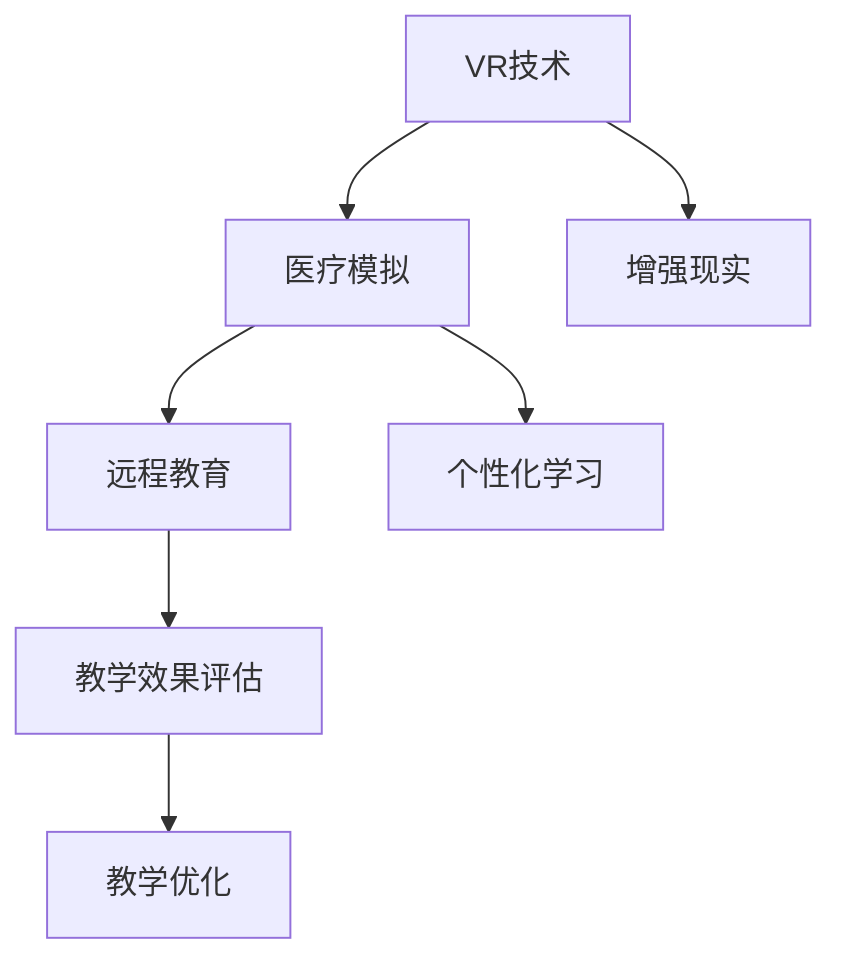

                 

# 虚拟医疗训练：全球医疗教育的数字化升级

> 关键词：虚拟医疗, 数字化教育, 医疗模拟, 远程培训, 教学效果提升

## 1. 背景介绍

### 1.1 问题由来

随着现代医疗水平的不断提升，医学教育的重要性日益凸显。然而，传统的医疗教育仍然面临诸多挑战，如医疗资源分布不均、实习机会不足、培训成本高昂等。虚拟医疗训练作为一种新兴的教育手段，通过模拟真实医疗情境，弥补了传统教育的不足，为全球医疗教育带来了新的突破。

### 1.2 问题核心关键点

虚拟医疗训练的核心关键点包括：

- **虚拟现实(VR)与增强现实(AR)技术**：为医学教育提供沉浸式的模拟环境。
- **模拟软件与平台**：基于VR/AR技术，构建各类医学模拟场景。
- **远程协作与培训**：通过网络实现远程教学与互动，提高教学覆盖面。
- **个性化学习**：根据学员需求，提供个性化的学习内容与指导。
- **教学效果评估**：通过模拟测试与反馈，持续优化教学方法。

### 1.3 问题研究意义

虚拟医疗训练的实施，对于提升全球医疗教育质量、扩大医疗人才供应、推动医学科技的进步具有重要意义：

1. **弥补资源差距**：尤其是在医疗资源匮乏地区，虚拟医疗训练可以有效解决实习机会不足的问题。
2. **降低培训成本**：与实体模拟相比，虚拟训练大大降低了设备成本与培训成本。
3. **提高教学效率**：通过VR/AR技术，模拟真实医疗情境，能显著提升学员的学习效率和体验感。
4. **强化实践能力**：虚拟训练提供了一个安全的模拟环境，让学员在不断试错中提升技能。
5. **支持远程教育**：虚拟医疗训练打破了地理限制，可以更广泛地覆盖全球学员。

## 2. 核心概念与联系

### 2.1 核心概念概述

为了更好地理解虚拟医疗训练的全貌，本节将介绍几个关键概念：

- **虚拟现实(Virtual Reality, VR)**：通过计算机模拟创建仿真环境，让用户沉浸其中进行交互和体验。
- **增强现实(Augmented Reality, AR)**：在真实世界基础上增加计算机生成的信息，实现虚实结合的交互。
- **医疗模拟(Simulation in Medicine)**：通过模拟真实的医疗情境，为医学生提供实践与学习的机会。
- **远程教育(Remote Education)**：通过网络平台实现教师与学员的远程互动和教学。
- **个性化学习(Personalized Learning)**：根据学员特点和需求，提供量身定制的学习内容与路径。
- **教学效果评估(Instructional Evaluation)**：通过模拟测试与反馈，持续优化教学内容和方法。

这些概念之间的逻辑关系可以通过以下Mermaid流程图来展示：



这个流程图展示了几类关键技术的相互关系：

1. VR技术为医疗模拟提供沉浸式环境，增强现实进一步提升了学习体验。
2. 医疗模拟为远程教育提供了一个可交互的模拟平台，远程教育又通过网络扩展了教学范围。
3. 个性化学习能够根据学员需求提供定制化的学习路径，教学效果评估则帮助优化教学内容。

## 3. 核心算法原理 & 具体操作步骤
### 3.1 算法原理概述

虚拟医疗训练的核心算法原理主要基于VR/AR技术，通过模拟真实医疗情境，提供沉浸式学习环境。其核心思想是：

1. **创建虚拟医疗环境**：利用计算机图形学和物理引擎，创建高逼真度的医疗模拟场景。
2. **虚拟互动与反馈**：通过传感器和追踪设备，实现学员与虚拟环境的互动，提供即时反馈。
3. **模拟测试与评估**：设计各类模拟测试，评估学员的学习效果，根据结果调整教学内容。

### 3.2 算法步骤详解

虚拟医疗训练的实施步骤包括以下几个关键环节：

**Step 1: 准备虚拟场景与模拟器**
- 选择合适的VR/AR软件平台，如Unity3D、Unreal Engine等。
- 设计医疗模拟场景，包括手术室、病房、诊断室等各类医疗环境。
- 添加医疗设备、道具，以及模型和动画。

**Step 2: 添加交互元素与反馈机制**
- 根据医学教育需求，设计虚拟设备的操作界面，如手术器械、患者身体模型等。
- 实现学员与虚拟设备的交互，如手术操作、诊断检查等。
- 设计即时反馈机制，如显示手术效果、错误提示等，帮助学员纠正错误。

**Step 3: 集成远程协作功能**
- 利用网络技术，实现远程教学和互动。
- 设计在线讨论、直播等功能，提高远程教学的互动性。
- 利用VR/AR技术，实现远程协作，如远程手术指导、远程病理诊断等。

**Step 4: 个性化学习路径设计**
- 根据学员特点，设计个性化的学习路径。
- 将学习内容分为不同模块，提供选修和必修课程。
- 动态调整学习进度，适应学员的学习节奏。

**Step 5: 教学效果评估与优化**
- 设计各类模拟测试，评估学员的学习效果。
- 分析测试结果，找出薄弱环节。
- 根据评估结果，优化教学内容和方法。

### 3.3 算法优缺点

虚拟医疗训练方法具有以下优点：

1. **沉浸式学习**：通过VR/AR技术，学员能够在高逼真度的模拟环境中进行实践，增强学习体验。
2. **灵活性强**：根据学员需求，提供个性化的学习路径，灵活调整学习内容。
3. **成本较低**：相比于实体模拟，虚拟训练大大降低了设备成本和培训成本。
4. **安全性高**：提供了一个安全的模拟环境，减少学员在真实医疗环境中的操作风险。
5. **互动性强**：通过远程协作与互动，增强了教学的互动性和参与度。

同时，虚拟医疗训练也存在一些局限性：

1. **技术门槛高**：需要专业的技术团队进行开发与维护，对技术要求较高。
2. **硬件需求大**：需要高性能计算机和专用设备，成本较高。
3. **内容局限性**：受限于虚拟场景的设计和内容，可能无法完全模拟真实医疗情境。
4. **互动体验不足**：相比于实体模拟，虚拟互动可能缺乏真实感和真实操作体验。
5. **技术更新快**：需要持续跟进最新的技术发展，保持虚拟场景和设备的先进性。

### 3.4 算法应用领域

虚拟医疗训练已经在多个领域得到了广泛应用，例如：

- **医学教育培训**：在医学院校、医院等场所，用于手术技能培训、临床实习等。
- **远程医疗**：通过网络平台，提供远程手术指导、病理诊断等医疗服务。
- **模拟医学研究**：在科研机构，用于医学模拟、病理研究等。
- **健康教育**：在社区、学校等场所，进行健康知识普及和疾病预防教育。
- **心理健康教育**：在心理诊所、学校等场所，进行心理干预和心理治疗。

## 4. 数学模型和公式 & 详细讲解  
### 4.1 数学模型构建

虚拟医疗训练的数学模型主要涉及虚拟场景的构建、学员与虚拟环境的交互，以及教学效果的评估。以下是对这些模型的详细介绍。

**虚拟场景构建模型**
虚拟场景的构建主要涉及场景几何建模、光照与阴影模拟、物理模拟等。以Unity3D为例，其场景构建流程如下：

1. **几何建模**：利用Unity的3D建模工具，创建虚拟场景的几何模型。
2. **材质与纹理**：为模型添加材质和纹理，提升视觉真实度。
3. **光照与阴影**：通过光照与阴影模型，模拟自然光与环境光效果。
4. **物理模拟**：利用Unity的物理引擎，模拟物体的运动与碰撞。

**学员与虚拟环境交互模型**
学员与虚拟环境的交互主要涉及传感器数据处理、反馈机制设计等。以Oculus Rift为例，其交互流程如下：

1. **传感器数据采集**：利用Oculus Rift的传感器，采集学员的手部动作、头部运动等数据。
2. **动作转换**：将传感器数据转换为虚拟环境中的动作指令，如手术操作、诊断检查等。
3. **反馈机制设计**：根据学员的动作，设计即时反馈机制，如显示手术效果、错误提示等。

**教学效果评估模型**
教学效果评估主要涉及模拟测试设计与评估指标选择。以SurgSim平台为例，其评估流程如下：

1. **测试场景设计**：根据教学目标，设计模拟测试场景。
2. **评估指标选择**：选择与教学目标相关的评估指标，如手术成功率、操作时间等。
3. **评估结果分析**：分析评估结果，找出学员的薄弱环节。

### 4.2 公式推导过程

以手术模拟为例，假设手术场景的几何模型为 $S$，传感器数据为 $D$，学员的操作指令为 $A$，手术效果为 $E$。手术模拟的评估模型可以表示为：

$$
E = f(S, D, A)
$$

其中 $f$ 表示评估函数，可以根据具体的评估指标选择合适的函数形式。

具体到评估指标，如手术成功率，可以表示为：

$$
成功率 = \frac{成功手术数}{总手术数}
$$

在评估过程中，可以设计多个测试场景，对学员进行多轮测试，通过多次测试的平均值来评估学员的手术水平。

### 4.3 案例分析与讲解

**案例一：手术模拟训练**
某医学院校利用Unity3D平台，设计了一套手术模拟训练系统。该系统包括手术室模型、手术器械模型、患者模型等，学员可以通过VR设备进入虚拟手术室，进行肝移植手术操作。系统根据学员的操作过程，提供即时反馈和错误提示，帮助学员纠正错误。训练结束后，系统通过模拟测试评估学员的手术水平，并生成个性化反馈报告。

**案例二：远程医疗手术指导**
某医院利用Oculus Rift设备，搭建了一套远程手术指导系统。该系统包括虚拟手术室、手术操作界面、实时视频通信等功能。主治医师可以在远程医疗平台上，实时指导手术操作，并通过VR设备进行可视化指导。学员可以在虚拟手术室中进行操作，系统根据操作过程，提供实时反馈和指导建议。

**案例三：心理干预与治疗**
某心理诊所利用AR技术，开发了一套心理健康评估与治疗系统。该系统包括虚拟心理治疗室、虚拟患者模型、互动场景等，心理治疗师可以在AR设备上，与虚拟患者进行互动，进行心理干预和心理治疗。系统根据治疗过程，评估治疗效果，提供个性化反馈报告。

## 5. 项目实践：代码实例和详细解释说明
### 5.1 开发环境搭建

在进行虚拟医疗训练的开发前，我们需要准备好开发环境。以下是使用Unity3D进行虚拟医疗训练开发的详细配置流程：

1. 安装Unity3D：从官网下载安装Unity3D，并创建新项目。

2. 安装VR/AR插件：通过Unity Asset Store下载VR/AR插件，如WerckerVR、Vuforia等，并安装到项目中。

3. 安装物理引擎：安装Unity的物理引擎，如PhysX、BoneVR等，用于模拟物理交互。

4. 安装建模工具：安装Unity的3D建模工具，如Unity Asset Graph，用于创建和编辑场景。

5. 安装光照与阴影插件：安装Unity的光照与阴影插件，如OptiShade、RealShade等，用于提升视觉真实度。

完成上述步骤后，即可在Unity3D环境中开始虚拟医疗训练的开发。

### 5.2 源代码详细实现

下面我们以手术模拟训练为例，给出使用Unity3D进行虚拟医疗训练开发的详细代码实现。

**Unity3D代码示例**

首先，定义手术室场景：

```csharp
using UnityEngine;
using UnityEngine.UI;

public class SurgeryRoom : MonoBehaviour
{
    public GameObject patient;
    public GameObject surgeon;

    void Start()
    {
        patient.SetActive(true);
        surgeon.SetActive(true);
        // 场景初始化代码
    }
}
```

然后，定义手术器械与交互逻辑：

```csharp
public class SurgicalTool : MonoBehaviour
{
    public GameObject knife;
    public GameObject scalpel;
    public GameObject forceps;

    void Update()
    {
        if (Input.GetMouseButtonDown(0))
        {
            if (Input.GetMouseButtonDown(0))
            {
                // 使用手术刀操作
                knife.SetActive(true);
                scalpel.SetActive(false);
                forceps.SetActive(false);
            }
            else if (Input.GetMouseButtonDown(1))
            {
                // 使用手术刀操作
                scalpel.SetActive(true);
                knife.SetActive(false);
                forceps.SetActive(false);
            }
            else if (Input.GetMouseButtonDown(2))
            {
                // 使用手术刀操作
                forceps.SetActive(true);
                knife.SetActive(false);
                scalpel.SetActive(false);
            }
        }
    }
}
```

接着，定义实时反馈机制：

```csharp
public class SurgicalFeedback : MonoBehaviour
{
    public GameObject resultText;

    void Update()
    {
        if (resultText.transform.localScale.x < 1.0f)
        {
            // 显示结果反馈
            resultText.transform.localScale = new Vector3(1.0f, 1.0f, 1.0f);
        }
        else
        {
            // 隐藏结果反馈
            resultText.transform.localScale = new Vector3(0.0f, 0.0f, 0.0f);
        }
    }
}
```

最后，启动训练流程并测试：

```csharp
void Update()
{
    // 手术模拟代码
}
```

### 5.3 代码解读与分析

让我们再详细解读一下关键代码的实现细节：

**SurgeryRoom类**：
- `Start`方法：初始化手术室场景，设定患者和手术工具的初始状态。

**SurgicalTool类**：
- `Update`方法：根据鼠标操作，切换不同的手术工具，实现交互操作。

**SurgicalFeedback类**：
- `Update`方法：根据手术结果，显示或隐藏反馈信息，提供即时反馈。

**训练流程代码**：
- `Update`方法：在每个帧更新，执行手术模拟操作，实现教学过程。

这些代码展示了Unity3D中虚拟医疗训练的基本实现流程，开发者可以根据实际需求，进行扩展和优化。

## 6. 实际应用场景
### 6.1 智能医疗培训

虚拟医疗训练技术已经在智能医疗培训中得到了广泛应用，为医学生提供了大量高质量的实践机会。传统医学培训往往面临设备不足、实习机会有限等问题，虚拟医疗训练则能够有效解决这些问题。

在具体应用中，可以利用Unity3D等平台，构建各类手术、诊断、病理等模拟场景。学员可以在虚拟环境中进行实践操作，系统根据操作过程，提供即时反馈和评估报告。通过反复训练，学员能够快速掌握各类医学技能，提升实践能力。

### 6.2 远程医疗手术指导

远程医疗手术指导技术，通过虚拟医疗训练系统，实现了主治医师与手术学员的远程互动。传统远程手术指导往往依赖于高清视频和音频，而虚拟医疗训练则能够提供更为丰富的交互体验。

在具体应用中，可以利用Oculus Rift等VR设备，搭建远程手术指导平台。主治医师可以在平台上，实时指导手术操作，并提供可视化反馈。学员可以在虚拟环境中进行操作，系统根据操作过程，提供即时反馈和指导建议。这种远程手术指导方式，不仅提高了教学效率，还减少了手术风险。

### 6.3 心理干预与治疗

虚拟医疗训练技术同样适用于心理健康教育与治疗。通过AR技术，心理治疗师可以在虚拟环境中与患者进行互动，进行心理干预和心理治疗。虚拟环境提供了更为安全、私密的互动空间，能够有效缓解患者的心理压力。

在具体应用中，可以利用AR技术，构建虚拟心理治疗室、虚拟患者模型、互动场景等。心理治疗师可以在虚拟环境中，与患者进行互动，提供心理干预和治疗。系统根据治疗过程，评估治疗效果，提供个性化反馈报告。这种虚拟心理治疗方式，能够有效提升治疗效果，降低治疗成本。

### 6.4 未来应用展望

随着虚拟医疗训练技术的不断发展，未来将在更多领域得到应用，为医疗教育带来新的突破。

1. **智能医疗诊断**：利用虚拟医疗训练系统，进行各类医学诊断模拟，提升诊断能力。
2. **远程医疗支持**：在偏远地区，利用虚拟医疗训练系统，进行远程医疗支持，提高医疗覆盖面。
3. **医疗研究与教育**：在医学研究机构，利用虚拟医疗训练系统，进行医学模拟与教育，提升科研水平。
4. **健康知识普及**：在社区、学校等场所，利用虚拟医疗训练系统，进行健康知识普及与疾病预防教育。
5. **心理治疗与干预**：在心理诊所、学校等场所，利用虚拟医疗训练系统，进行心理干预与治疗，提升治疗效果。

这些应用场景的拓展，将使虚拟医疗训练技术在医疗教育中发挥更大的价值。

## 7. 工具和资源推荐
### 7.1 学习资源推荐

为了帮助开发者系统掌握虚拟医疗训练的技术基础和实践技巧，这里推荐一些优质的学习资源：

1. **Unity3D官方文档**：Unity3D官方提供的文档，详细介绍了Unity3D的开发环境和编程接口。

2. **WerckerVR插件文档**：WerckerVR插件官方提供的文档，介绍了VR设备的使用方法和编程接口。

3. **PhysX官方文档**：PhysX官方提供的文档，详细介绍了物理引擎的使用方法和编程接口。

4. **OptiShade插件文档**：OptiShade插件官方提供的文档，介绍了光照与阴影技术的使用方法和编程接口。

5. **《虚拟现实技术及应用》书籍**：全面介绍了虚拟现实技术的原理、开发和应用，适合初学者入门。

通过对这些资源的学习实践，相信你一定能够快速掌握虚拟医疗训练的技术实现，并用于解决实际的医疗教育问题。

### 7.2 开发工具推荐

高效的开发离不开优秀的工具支持。以下是几款用于虚拟医疗训练开发的常用工具：

1. **Unity3D**：业内领先的3D游戏和虚拟现实开发平台，提供了强大的建模、渲染和物理模拟功能。

2. **Oculus Rift**：目前最流行的VR设备之一，支持实时数据采集和交互操作。

3. **WerckerVR插件**：Unity3D平台的VR开发插件，提供了丰富的VR功能，如追踪器、控制器等。

4. **PhysX物理引擎**：Unity3D平台的原生物理引擎，支持复杂物理模拟和碰撞检测。

5. **OptiShade插件**：Unity3D平台的光照与阴影插件，提供了高效的光照渲染技术。

6. **Unity Asset Graph**：Unity3D平台的3D建模工具，支持快速创建和编辑场景。

合理利用这些工具，可以显著提升虚拟医疗训练的开发效率，加快创新迭代的步伐。

### 7.3 相关论文推荐

虚拟医疗训练技术的发展源于学界的持续研究。以下是几篇奠基性的相关论文，推荐阅读：

1. **Virtual Reality in Medical Education: A Review**：综述了虚拟现实在医学教育中的应用，介绍了相关技术和案例。

2. **Simulation-Based Medical Education: A Review**：综述了模拟技术在医学教育中的应用，介绍了相关技术和案例。

3. **A Review of Virtual Reality and Augmented Reality in Medical Training**：综述了虚拟现实和增强现实在医学培训中的应用，介绍了相关技术和案例。

这些论文代表了大语言模型微调技术的发展脉络。通过学习这些前沿成果，可以帮助研究者把握学科前进方向，激发更多的创新灵感。

## 8. 总结：未来发展趋势与挑战
### 8.1 总结

本文对虚拟医疗训练方法进行了全面系统的介绍。首先阐述了虚拟医疗训练的研究背景和意义，明确了虚拟医疗训练在提升医疗教育质量、扩大医疗人才供应、推动医学科技的进步方面的独特价值。其次，从原理到实践，详细讲解了虚拟医疗训练的数学模型和关键步骤，给出了虚拟医疗训练任务开发的完整代码实例。同时，本文还广泛探讨了虚拟医疗训练在智能医疗培训、远程医疗手术指导、心理干预与治疗等多个领域的应用前景，展示了虚拟医疗训练技术的广阔前景。

通过本文的系统梳理，可以看到，虚拟医疗训练技术正在成为医疗教育的重要范式，极大地拓展了医疗教育的应用边界，催生了更多的落地场景。未来，伴随虚拟医疗训练技术的持续演进，相信将在全球医疗教育中发挥更加重要的作用。

### 8.2 未来发展趋势

展望未来，虚拟医疗训练技术将呈现以下几个发展趋势：

1. **技术不断成熟**：随着虚拟现实和增强现实技术的不断进步，虚拟医疗训练的技术也将不断成熟，提供更为沉浸式和逼真的训练环境。
2. **应用场景广泛**：除了传统的医疗教育，虚拟医疗训练还将拓展到智能医疗诊断、远程医疗支持等多个领域，发挥更大的价值。
3. **个性化学习普及**：根据学员的需求和特点，提供个性化的学习路径和内容，提高学习效率和效果。
4. **智能辅助诊断**：利用虚拟医疗训练系统，进行各类医学诊断模拟，提升诊断能力。
5. **远程医疗支持**：在偏远地区，利用虚拟医疗训练系统，进行远程医疗支持，提高医疗覆盖面。
6. **医疗研究与教育**：在医学研究机构，利用虚拟医疗训练系统，进行医学模拟与教育，提升科研水平。

以上趋势凸显了虚拟医疗训练技术的广阔前景。这些方向的探索发展，必将进一步提升虚拟医疗训练的质量和应用范围，为全球医疗教育带来新的突破。

### 8.3 面临的挑战

尽管虚拟医疗训练技术已经取得了瞩目成就，但在迈向更加智能化、普适化应用的过程中，它仍面临着诸多挑战：

1. **技术门槛高**：需要专业的技术团队进行开发与维护，对技术要求较高。
2. **硬件需求大**：需要高性能计算机和专用设备，成本较高。
3. **内容局限性**：受限于虚拟场景的设计和内容，可能无法完全模拟真实医疗情境。
4. **互动体验不足**：相比于实体模拟，虚拟互动可能缺乏真实感和真实操作体验。
5. **技术更新快**：需要持续跟进最新的技术发展，保持虚拟场景和设备的先进性。

### 8.4 研究展望

面对虚拟医疗训练面临的挑战，未来的研究需要在以下几个方面寻求新的突破：

1. **简化开发流程**：开发更易于使用的虚拟医疗训练平台，降低技术门槛，提高开发效率。
2. **降低硬件成本**：开发低成本、高性能的虚拟医疗训练设备，提高设备的可及性。
3. **丰富模拟内容**：根据医疗需求，设计更丰富、更真实的虚拟医疗场景，提升模拟效果。
4. **增强互动体验**：引入更多的交互技术，提升虚拟医疗训练的互动性和沉浸感。
5. **持续技术更新**：持续跟进最新技术发展，保持虚拟医疗训练的先进性和时效性。

这些研究方向的探索，必将引领虚拟医疗训练技术迈向更高的台阶，为全球医疗教育带来新的突破。

## 9. 附录：常见问题与解答

**Q1：虚拟医疗训练是否适用于所有医学领域？**

A: 虚拟医疗训练适用于大部分医学领域，但对于一些需要高度互动、高风险的操作，如急诊手术、高级手术等，可能存在局限性。

**Q2：虚拟医疗训练是否需要昂贵的设备？**

A: 虚拟医疗训练的硬件需求较大，初期投资较高。但随着技术的不断成熟和成本的降低，预计未来设备成本将逐步下降。

**Q3：虚拟医疗训练如何保证真实性？**

A: 虚拟医疗训练通过高逼真度的模拟环境，可以最大程度地模拟真实医疗情境。但需要注意，模拟环境的设计和优化至关重要，需要专业团队进行设计。

**Q4：虚拟医疗训练的互动性如何？**

A: 虚拟医疗训练的互动性主要取决于虚拟场景和交互设计。目前已经有较为成熟的交互技术，但还需要进一步优化，提升沉浸感和真实感。

**Q5：虚拟医疗训练的学习效果如何？**

A: 虚拟医疗训练的学习效果与虚拟场景的设计和教学方法密切相关。设计合理、教学内容丰富的虚拟医疗训练系统，可以显著提升学习效果。

---

作者：禅与计算机程序设计艺术 / Zen and the Art of Computer Programming

