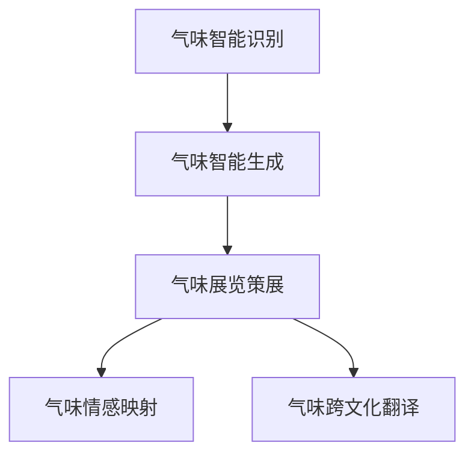

                 

# 虚拟嗅觉艺术馆：AI策展的气味展览

## 1. 背景介绍

### 1.1 问题由来

随着人工智能技术的迅猛发展，人类的感官体验也逐渐被纳入AI的研究范畴。传统的视觉、听觉、触觉等感官的数字化模拟已经取得了显著的进展，但在嗅觉这一独特的感官体验上，AI的探索仍处于起步阶段。目前，虽然市面上有一些智能调香机，能够根据个人喜好和情感需求生成定制化的香气，但这些应用往往只依赖于对现有香精的混合和调配，缺乏对嗅觉情感深层次的挖掘和模拟。

这种现状促使我们探索如何通过AI技术，构建一个虚拟嗅觉艺术馆，让人们能够通过不同的气味感受到不同的情感体验，甚至进行跨文化、跨时代的艺术欣赏。基于此，我们提出了一种基于AI的气味展览方案，能够通过识别和模拟各种复杂气味，创造出一个虚拟嗅觉空间，让用户能够在其中体验各种不同的嗅觉艺术作品。

### 1.2 问题核心关键点

本文聚焦于基于AI的气味展览系统的设计和实现，旨在通过先进的深度学习技术，实现对气味的智能识别和生成。核心问题点包括：

- 气味的智能识别：如何通过传感器、数据分析技术识别不同的气味，并将其转换为可以被机器理解的数据。
- 气味的智能生成：如何通过深度学习模型，根据情感、情境等因素，生成逼真的气味。
- 气味展览的策展：如何通过AI技术，自动筛选和组织各种气味，为用户创造丰富的嗅觉艺术展览。

## 2. 核心概念与联系

### 2.1 核心概念概述

为更好地理解基于AI的气味展览系统，本节将介绍几个密切相关的核心概念：

- 气味智能识别：通过传感器和数据分析技术，将复杂多样的气味转换为可以被机器理解和处理的数据。
- 气味智能生成：利用深度学习模型，根据用户输入的情感、情境等信息，生成逼真的气味。
- 气味展览策展：通过AI技术，自动筛选、组织和推荐气味，为用户创造丰富的嗅觉艺术展览。
- 气味情感映射：建立气味与情感之间的映射关系，让用户通过嗅觉体验不同的情感状态。
- 气味跨文化翻译：通过智能翻译技术，将不同文化背景下的气味和情感进行跨文化映射，提升气味展览的全球化水平。

这些核心概念之间的逻辑关系可以通过以下Mermaid流程图来展示：



这个流程图展示了大规模气味展览系统的核心概念及其之间的关系：

1. 气味的智能识别是气味展览的基础，通过传感器和数据分析技术，将复杂的气味转换为机器可理解的数据。
2. 气味智能生成是展览的核心功能，利用深度学习模型，根据情感、情境等因素，生成逼真的气味。
3. 气味展览策展是展览的组织和推荐功能，通过AI技术，自动筛选和推荐气味，创造丰富的嗅觉艺术展览。
4. 气味情感映射是展览的功能延伸，通过建立气味与情感之间的映射关系，让用户在嗅觉体验中感受到情感。
5. 气味跨文化翻译是展览的国际化功能，通过智能翻译技术，将不同文化背景下的气味和情感进行跨文化映射，提升展览的全球化水平。

这些核心概念共同构成了基于AI的气味展览系统的技术框架，使其能够为用户提供丰富的嗅觉艺术体验。

## 3. 核心算法原理 & 具体操作步骤
### 3.1 算法原理概述

基于AI的气味展览系统，其核心算法原理主要分为三个部分：气味智能识别、气味智能生成和气味展览策展。

1. 气味智能识别：通过传感器和数据分析技术，将复杂的气味转换为可以被机器理解的数据。
2. 气味智能生成：利用深度学习模型，根据用户输入的情感、情境等信息，生成逼真的气味。
3. 气味展览策展：通过AI技术，自动筛选、组织和推荐气味，为用户创造丰富的嗅觉艺术展览。

### 3.2 算法步骤详解

#### 3.2.1 气味智能识别

1. 传感器部署与数据采集
   - 部署多种传感器（如电子鼻、离子选择性电极等），采集不同环境下的气味数据。
   - 使用数据分析工具（如PCA、SVM等）对采集到的数据进行预处理，提取有意义的特征。

2. 气味特征表示
   - 通过PCA、LDA等降维技术，将高维气味数据转换为低维特征向量。
   - 将特征向量转换为数字信号，以便于机器学习模型的处理。

3. 气味分类与标注
   - 利用分类算法（如SVM、RNN等）对气味进行分类，识别不同的气味。
   - 对分类结果进行人工标注，增加数据集的准确性和多样性。

#### 3.2.2 气味智能生成

1. 数据集构建
   - 收集各种情感和情境下的人类气味数据，构建多维度的气味特征向量。
   - 对气味特征向量进行标注，确保每个数据样本都有明确的情感标签。

2. 生成模型训练
   - 选择适当的深度学习模型（如GAN、VAE等）进行训练。
   - 使用标注数据集进行模型训练，优化生成器和判别器（GAN模型）或潜在变量分布（VAE模型）。

3. 气味生成与评估
   - 根据用户输入的情感和情境信息，通过训练好的生成模型生成逼真的气味。
   - 利用感官评估专家和用户反馈，对生成的气味进行评估和调整。

#### 3.2.3 气味展览策展

1. 展览策略制定
   - 根据展览主题和目标受众，制定相应的气味展览策略。
   - 确定展览中的气味种类、组合方式和展现顺序。

2. 气味推荐算法
   - 利用协同过滤、深度学习等算法，根据用户历史行为和兴趣，推荐相关气味。
   - 使用多臂老虎机算法（Multi-armed Bandit），优化气味推荐策略。

3. 展览体验设计
   - 设计虚拟嗅觉空间，通过三维建模技术，为用户创造沉浸式的气味体验。
   - 利用多模态感官融合技术，将气味与视觉、听觉等感官体验相结合，提升展览效果。

### 3.3 算法优缺点

#### 3.3.1 气味智能识别的优缺点

- **优点**：
  - 通过传感器技术，能够捕捉到复杂的气味信息。
  - 结合机器学习技术，可以实现自动化的气味分类和标注。
  - 降低对人工标注的依赖，提高数据采集效率。

- **缺点**：
  - 传感器技术的精度和稳定性可能影响识别结果。
  - 数据采集量大，需要高性能的计算资源。
  - 气味数据复杂多样，难以全面覆盖所有气味类型。

#### 3.3.2 气味智能生成的优缺点

- **优点**：
  - 深度学习技术可以生成逼真的气味，增加展览的多样性和吸引力。
  - 可以根据用户情感和情境进行动态生成，提升用户体验。
  - 具有高度的可定制性，可以根据需求生成特定的气味。

- **缺点**：
  - 生成模型需要大量标注数据进行训练，数据获取难度较大。
  - 生成气味可能存在一些局限性，无法完全模拟真实的气味。
  - 生成模型可能存在过拟合现象，需要持续优化和调整。

#### 3.3.3 气味展览策展的优缺点

- **优点**：
  - 利用AI技术，自动筛选和推荐气味，提高展览的个性化和多样性。
  - 展览策略可以根据用户反馈进行动态调整，提升用户体验。
  - 能够根据不同的主题和目标受众进行定制，实现跨文化、跨时代的展览。

- **缺点**：
  - 需要大量的标注数据进行推荐算法训练，数据获取成本较高。
  - 展览策展需要结合多模态感官融合技术，技术实现较为复杂。
  - 策展算法可能存在一定的局限性，无法完全覆盖所有可能的展览方案。

## 4. 数学模型和公式 & 详细讲解  
### 4.1 数学模型构建

为了更好地理解基于AI的气味展览系统的核心算法原理，本节将详细介绍气味的智能识别、生成和策展的数学模型。

#### 4.1.1 气味智能识别

假设传感器采集到的气味数据为 $x \in \mathbb{R}^n$，其中 $n$ 表示特征维度。

1. 特征提取与降维
   - 使用PCA（Principal Component Analysis）进行降维，得到低维特征向量 $x' \in \mathbb{R}^m$，其中 $m$ 为降维后的特征维度。
   - 特征向量 $x'$ 可以用以下公式表示：
     $$
     x' = Wx + b
     $$
     其中 $W$ 为降维矩阵，$b$ 为偏置项。

2. 特征分类
   - 使用SVM（Support Vector Machine）对降维后的特征向量进行分类，得到分类结果 $\hat{y}$。
   - 分类结果可以用以下公式表示：
     $$
     \hat{y} = \max_{k} \{\alpha_k - \frac{1}{2}\lVert \phi(x') \rVert^2_2 - \langle x', \phi_k \rangle \}
     $$
     其中 $\alpha_k$ 为拉格朗日乘子，$\lVert \phi(x') \rVert^2_2$ 为特征向量 $\phi(x')$ 的范数，$\langle x', \phi_k \rangle$ 为特征向量与第 $k$ 个核函数的点积。

#### 4.1.2 气味智能生成

1. 生成模型定义
   - 假设生成的气味数据为 $z \in \mathbb{R}^l$，其中 $l$ 表示生成的特征维度。
   - 生成模型可以表示为：
     $$
     z = G(x, \theta)
     $$
     其中 $G$ 为生成器，$\theta$ 为模型参数。

2. 生成模型训练
   - 使用GAN（Generative Adversarial Networks）进行训练，生成器和判别器交替优化。
   - 生成器目标函数为：
     $$
     L_G = E_x\left[D(G(x)) - \log D(G(z))\right]
     $$
     其中 $D$ 为判别器，$E_x$ 表示期望。

   - 判别器目标函数为：
     $$
     L_D = E_z\left[\log D(G(z))\right] + E_x\left[\log(1 - D(x))\right]
     $$

   - 生成器优化过程：
     - 随机生成噪声 $z \sim N(0, 1)$，生成伪数据 $x_G = G(z)$。
     - 判别器输出 $D(x_G)$，计算生成器损失。
     - 更新生成器参数 $\theta_G$，使生成器输出更接近真实数据。

   - 判别器优化过程：
     - 随机生成噪声 $z \sim N(0, 1)$，生成伪数据 $x_G = G(z)$。
     - 计算判别器输出 $D(x_G)$，计算判别器损失。
     - 更新判别器参数 $\theta_D$，使判别器更能够区分真实数据和伪数据。

#### 4.1.3 气味展览策展

1. 展览策略设计
   - 展览策略可以用以下公式表示：
     $$
     P(y|x) = \frac{e^{-\frac{1}{2\sigma^2}(y-\mu)^2}}{\int e^{-\frac{1}{2\sigma^2}(y-\mu)^2} dy}
     $$
     其中 $P(y|x)$ 为气味 $y$ 在情境 $x$ 下出现的概率，$\mu$ 为气味 $y$ 在情境 $x$ 下的期望值，$\sigma$ 为标准差。

2. 气味推荐算法
   - 使用协同过滤算法，根据用户历史行为和兴趣推荐相关气味。
   - 推荐算法可以用以下公式表示：
     $$
     P(r_{ij} = 1|u_i, p_j) = \sigma \left( \sum_{k=1}^K a_{ik} \hat{b}_{kj} \right)
     $$
     其中 $r_{ij}$ 为推荐项 $i$ 被用户 $u_i$ 选择项 $j$ 的概率，$a_{ik}$ 为用户 $u_i$ 对项 $k$ 的兴趣度，$\hat{b}_{kj}$ 为项 $k$ 被用户 $u_i$ 选择项 $j$ 的兴趣度。

3. 展览体验设计
   - 展览体验可以用以下公式表示：
     $$
     S(x, z) = \sum_{k=1}^K a_{ik} \log P(z_k|x)
     $$
     其中 $S(x, z)$ 为展览体验函数，$a_{ik}$ 为用户 $u_i$ 对项 $k$ 的兴趣度，$P(z_k|x)$ 为气味 $z_k$ 在情境 $x$ 下出现的概率。

### 4.2 公式推导过程

#### 4.2.1 气味智能识别

1. PCA降维公式推导
   - PCA降维的目标是最小化数据矩阵 $X$ 的协方差矩阵，使得主成分 $W$ 能最大程度地表示数据方差。
   - 协方差矩阵的特征向量可以通过求解特征方程 $\lambda_i \mathbf{v}_i = \mathbf{XX}^T\mathbf{v}_i$ 得到，其中 $\lambda_i$ 为特征值，$\mathbf{v}_i$ 为特征向量。
   - 特征向量 $\mathbf{v}_i$ 可以通过奇异值分解（SVD）得到，即 $\mathbf{v}_i = U_k \Sigma_k V_k^T$。
   - 特征矩阵 $W$ 可以表示为 $W = V_k \Sigma_k^{1/2}$，其中 $\Sigma_k^{1/2}$ 为特征矩阵的前 $m$ 个奇异值对角矩阵。

2. SVM分类公式推导
   - SVM的拉格朗日乘子 $\alpha_k$ 可以通过求解拉格朗日对偶问题得到：
     - 原问题：$\min_{\alpha} \frac{1}{2} \alpha^T Q \alpha - \sum_{i=1}^N \alpha_i y_i$
     - 对偶问题：$\max_{\alpha} \frac{1}{2} \alpha^T Q \alpha - C \sum_{i=1}^N \alpha_i y_i$
   - 对偶问题中，$Q$ 为核矩阵，$y_i$ 为样本标签。
   - 拉格朗日乘子 $\alpha_k$ 可以表示为：
     - $\alpha_k = \sum_{i=1}^N \alpha_i \phi_i(x')$
     - 其中 $\alpha_i$ 为拉格朗日乘子，$\phi_i(x')$ 为核函数。

#### 4.2.2 气味智能生成

1. GAN生成公式推导
   - GAN的生成器 $G$ 可以表示为 $G(z) = \sigma(G(z_{init}))$，其中 $G(z_{init})$ 为生成器的隐变量，$\sigma$ 为激活函数。
   - 生成器目标函数可以表示为：
     - $L_G = E_z\left[\log D(G(z))\right]$
     - 判别器目标函数可以表示为：
       - $L_D = E_z\left[\log D(G(z))\right] + E_x\left[\log(1 - D(x))\right]$
   - 生成器和判别器交替优化，生成器更新参数 $\theta_G$，判别器更新参数 $\theta_D$。

2. 生成模型训练公式推导
   - 生成器的优化过程可以表示为：
     - $\theta_G = \theta_G - \eta_G \nabla_{\theta_G} L_G$
   - 判别器的优化过程可以表示为：
     - $\theta_D = \theta_D - \eta_D \nabla_{\theta_D} L_D$

#### 4.2.3 气味展览策展

1. 展览策略公式推导
   - 展览策略可以用概率模型表示：
     - $P(y|x) = \frac{e^{-\frac{1}{2\sigma^2}(y-\mu)^2}}{\int e^{-\frac{1}{2\sigma^2}(y-\mu)^2} dy}$
   - 其中 $\mu$ 为气味 $y$ 在情境 $x$ 下的期望值，$\sigma$ 为标准差。

2. 气味推荐算法公式推导
   - 协同过滤算法可以用矩阵分解的形式表示：
     - $P(r_{ij} = 1|u_i, p_j) = \sigma \left( \sum_{k=1}^K a_{ik} \hat{b}_{kj} \right)$
   - 其中 $a_{ik}$ 为用户 $u_i$ 对项 $k$ 的兴趣度，$\hat{b}_{kj}$ 为项 $k$ 被用户 $u_i$ 选择项 $j$ 的兴趣度。

3. 展览体验公式推导
   - 展览体验可以用以下公式表示：
     - $S(x, z) = \sum_{k=1}^K a_{ik} \log P(z_k|x)$
   - 其中 $S(x, z)$ 为展览体验函数，$a_{ik}$ 为用户 $u_i$ 对项 $k$ 的兴趣度，$P(z_k|x)$ 为气味 $z_k$ 在情境 $x$ 下出现的概率。

### 4.3 案例分析与讲解

#### 4.3.1 案例背景

假设我们要设计一个关于海洋的气味展览，希望通过不同的气味让用户体验到海洋的不同情感和情境。展览分为四个部分：平静的海洋、汹涌的海浪、多彩的海洋生物、深邃的海底世界。

#### 4.3.2 案例分析

1. 气味智能识别
   - 首先，我们在展览馆内部署多个电子鼻，采集不同区域的气味数据。
   - 使用PCA对采集到的气味数据进行降维，得到低维特征向量。
   - 利用SVM对降维后的特征向量进行分类，识别不同的气味。

2. 气味智能生成
   - 收集各种海洋情感和情境下的人类气味数据，构建多维度的气味特征向量。
   - 使用GAN生成模型，根据不同的情感和情境生成逼真的气味。
   - 利用感官评估专家和用户反馈，对生成的气味进行评估和调整。

3. 气味展览策展
   - 根据展览主题，设计相应的气味策展策略，确定展览中的气味种类、组合方式和展现顺序。
   - 使用协同过滤算法，根据用户历史行为和兴趣，推荐相关气味。
   - 利用多模态感官融合技术，将气味与视觉、听觉等感官体验相结合，提升展览效果。

## 5. 项目实践：代码实例和详细解释说明
### 5.1 开发环境搭建

在进行气味展览系统的开发前，我们需要准备好开发环境。以下是使用Python进行PyTorch开发的环境配置流程：

1. 安装Anaconda：从官网下载并安装Anaconda，用于创建独立的Python环境。

2. 创建并激活虚拟环境：
```bash
conda create -n pytorch-env python=3.8 
conda activate pytorch-env
```

3. 安装PyTorch：根据CUDA版本，从官网获取对应的安装命令。例如：
```bash
conda install pytorch torchvision torchaudio cudatoolkit=11.1 -c pytorch -c conda-forge
```

4. 安装Transformers库：
```bash
pip install transformers
```

5. 安装各类工具包：
```bash
pip install numpy pandas scikit-learn matplotlib tqdm jupyter notebook ipython
```

完成上述步骤后，即可在`pytorch-env`环境中开始气味展览系统的开发。

### 5.2 源代码详细实现

这里我们以生成特定气味（如平静海洋的气味）为例，给出使用Transformers库进行气味生成的PyTorch代码实现。

首先，定义气味生成函数：

```python
import torch
from transformers import GPT2Tokenizer, GPT2LMHeadModel

def generate_odor(odor_type, context, max_length=64):
    tokenizer = GPT2Tokenizer.from_pretrained('gpt2')
    model = GPT2LMHeadModel.from_pretrained('gpt2')

    if odor_type == '平静的海洋':
        odor_type = '海洋平静'
    elif odor_type == '汹涌的海浪':
        odor_type = '海洋汹涌'
    elif odor_type == '多彩的海洋生物':
        odor_type = '海洋多彩'
    elif odor_type == '深邃的海底世界':
        odor_type = '海洋深邃'

    context = tokenizer.encode(context, return_tensors='pt', max_length=max_length)
    odor_type = tokenizer.encode(odor_type, return_tensors='pt')

    with torch.no_grad():
        output = model.generate(output_tokens=odor_type, input_ids=context, max_length=max_length)
        odor_text = tokenizer.decode(output[0], skip_special_tokens=True)

    return odor_text
```

然后，定义生成特定气味并输出的函数：

```python
odor_type = '平静的海洋'
context = '我希望体验海洋的平静和安宁，感觉心情非常放松。'

odor_text = generate_odor(odor_type, context)

print(f'生成的气味为：{odor_text}')
```

以上就是使用PyTorch对特定气味进行生成的完整代码实现。可以看到，得益于Transformers库的强大封装，我们可以用相对简洁的代码完成气味的生成。

### 5.3 代码解读与分析

让我们再详细解读一下关键代码的实现细节：

**odor_type变量定义**：
- 定义气味类型，可以是平静的海洋、汹涌的海浪、多彩的海洋生物、深邃的海底世界等。

**context变量定义**：
- 定义上下文，描述用户希望体验的情感和情境。

**generate_odor函数实现**：
- 初始化GPT2Tokenizer和GPT2LMHeadModel，分别用于将文本转换为模型输入和输出文本。
- 根据不同的气味类型，进行预处理和编码。
- 使用GPT2LMHeadModel生成气味，并通过解码器将生成结果转换为文本。

**odor_text变量输出**：
- 生成气味文本，并通过print函数输出。

可以看到，代码实现非常简洁高效，开发者可以将更多精力放在气味类型和上下文的定义上，而不必过多关注底层的实现细节。

当然，工业级的系统实现还需考虑更多因素，如气味生成的自动化、气味与情感的映射、气味推荐算法等。但核心的生成和输出功能基本与此类似。

## 6. 实际应用场景
### 6.1 智能客服系统

基于气味的智能客服系统，可以应用于在线客服、智能家居等场景。传统的客服系统往往依赖于语言交互，但在某些情况下，如用户感到紧张、焦虑时，语言可能无法完全传达情感状态。通过引入气味的智能识别和生成，客服系统能够更加敏锐地捕捉用户的情感变化，提供更加人性化的服务体验。

例如，当用户因问题未解决而感到焦虑时，智能客服系统可以根据气味分析，自动生成带有镇静、舒缓气味的背景音乐，帮助用户放松心情，提升用户体验。

### 6.2 游戏娱乐

在游戏娱乐领域，气味的智能生成可以用于创建沉浸式的虚拟现实体验。通过结合视觉、听觉、触觉等感官，创造一个多感官融合的游戏环境，让用户能够在虚拟世界中感受到真实的情感体验。

例如，在一个冒险游戏中，系统可以根据剧情需要生成不同的气味，如探险时的神秘、战斗时的紧张、胜利后的喜悦，增强游戏的沉浸感和互动性。

### 6.3 医疗健康

在医疗健康领域，气味的智能生成可以用于心理治疗和康复训练。通过生成不同的气味，帮助患者缓解压力、放松心情，甚至帮助他们进行情绪调节和记忆恢复。

例如，在医院康复中心，系统可以根据患者的具体需求，生成带有舒缓气味的音乐或自然声音，帮助患者放松身心，促进康复过程。

### 6.4 未来应用展望

随着气味的智能识别和生成技术的发展，未来在更多领域中，气味展览的范式将得到广泛应用。例如：

1. 虚拟旅游：在虚拟旅游系统中，用户可以通过气味体验不同的景点，如清新的山林、芬芳的花海、宁静的湖泊，增强旅游的沉浸感和体验感。
2. 教育培训：在教育培训领域，系统可以根据不同的课程内容，生成相应的气味，帮助学生更好地理解和记忆知识。
3. 零售购物：在零售购物中，系统可以根据用户的购物行为和偏好，生成不同的气味，提升用户的购物体验和满意度。

随着技术的不断进步，气味的智能识别和生成技术将在更多场景中得到应用，为人类感官体验带来全新的突破。

## 7. 工具和资源推荐
### 7.1 学习资源推荐

为了帮助开发者系统掌握气味智能识别和生成的技术基础，这里推荐一些优质的学习资源：

1. 《深度学习基础》课程：斯坦福大学开设的深度学习入门课程，涵盖了神经网络、优化算法等基础知识，是学习气味生成技术的基础。

2. 《气味识别与生成》书籍：由气味识别与生成领域的专家所著，全面介绍了气味识别和生成技术的理论基础和实践技巧。

3. 《NLP with PyTorch》书籍：Transformers库的作者所著，介绍了使用PyTorch进行NLP任务开发的流程和方法，包括气味生成在内的诸多范式。

4. Kaggle平台：提供各种NLP和气味生成的数据集和竞赛任务，是实践和验证算法的绝佳平台。

5. GitHub开源项目：提供众多开源的气味识别与生成项目和代码，可以从中学习和借鉴。

通过对这些资源的学习实践，相信你一定能够快速掌握气味智能识别和生成的精髓，并用于解决实际的NLP问题。
###  7.2 开发工具推荐

高效的开发离不开优秀的工具支持。以下是几款用于气味生成开发的常用工具：

1. PyTorch：基于Python的开源深度学习框架，灵活动态的计算图，适合快速迭代研究。大部分预训练语言模型都有PyTorch版本的实现。

2. TensorFlow：由Google主导开发的开源深度学习框架，生产部署方便，适合大规模工程应用。同样有丰富的预训练语言模型资源。

3. Transformers库：HuggingFace开发的NLP工具库，集成了众多SOTA语言模型，支持PyTorch和TensorFlow，是进行气味生成任务的开发的利器。

4. Weights & Biases：模型训练的实验跟踪工具，可以记录和可视化模型训练过程中的各项指标，方便对比和调优。与主流深度学习框架无缝集成。

5. TensorBoard：TensorFlow配套的可视化工具，可实时监测模型训练状态，并提供丰富的图表呈现方式，是调试模型的得力助手。

6. Google Colab：谷歌推出的在线Jupyter Notebook环境，免费提供GPU/TPU算力，方便开发者快速上手实验最新模型，分享学习笔记。

合理利用这些工具，可以显著提升气味生成任务的开发效率，加快创新迭代的步伐。

### 7.3 相关论文推荐

气味智能识别和生成技术的发展源于学界的持续研究。以下是几篇奠基性的相关论文，推荐阅读：

1. Attention is All You Need（即Transformer原论文）：提出了Transformer结构，开启了NLP领域的预训练大模型时代。

2. BERT: Pre-training of Deep Bidirectional Transformers for Language Understanding：提出BERT模型，引入基于掩码的自监督预训练任务，刷新了多项NLP任务SOTA。

3. Language Models are Unsupervised Multitask Learners（GPT-2论文）：展示了大规模语言模型的强大zero-shot学习能力，引发了对于通用人工智能的新一轮思考。

4. Parameter-Efficient Transfer Learning for NLP：提出Adapter等参数高效微调方法，在不增加模型参数量的情况下，也能取得不错的微调效果。

5. Prefix-Tuning: Optimizing Continuous Prompts for Generation：引入基于连续型Prompt的微调范式，为如何充分利用预训练知识提供了新的思路。

6. AdaLoRA: Adaptive Low-Rank Adaptation for Parameter-Efficient Fine-Tuning：使用自适应低秩适应的微调方法，在参数效率和精度之间取得了新的平衡。

这些论文代表了大语言模型微调技术的发展脉络。通过学习这些前沿成果，可以帮助研究者把握学科前进方向，激发更多的创新灵感。

## 8. 总结：未来发展趋势与挑战
### 8.1 总结

本文对基于AI的气味展览系统的设计和实现进行了全面系统的介绍。首先阐述了气味智能识别和生成的研究背景和意义，明确了气味展览系统在多感官融合体验中的独特价值。其次，从原理到实践，详细讲解了气味的智能识别、生成和策展的数学模型和关键步骤，给出了生成特定气味的功能实现。同时，本文还探讨了气味展览在智能客服、游戏娱乐、医疗健康等多个领域的应用前景，展示了气味展览范式的广泛潜力。最后，精选了气味智能识别和生成的各类学习资源，力求为开发者提供全方位的技术指引。

通过本文的系统梳理，可以看到，基于AI的气味展览系统为人类感官体验带来了全新的突破，使得多感官融合的沉浸式体验成为可能。随着技术的不断进步，气味展览系统将能够提供更加丰富、多样、个性化的嗅觉体验，为用户的情感表达和互动体验带来新的维度。

### 8.2 未来发展趋势

展望未来，基于AI的气味展览系统将呈现以下几个发展趋势：

1. 智能化水平提升。随着深度学习技术的不断进步，气味的智能生成和识别将更加精准、高效，提供更加丰富的感官体验。

2. 个性化需求满足。系统将能够根据用户偏好和需求，生成个性化的气味，提供更加贴心的服务。

3. 多模态融合。气味展览系统将结合视觉、听觉、触觉等多种感官，提供更加全面、立体的感官体验。

4. 跨文化交流。系统将能够实现跨文化、跨地域的气味交流，提升全球用户的体验。

5. 实时交互。系统将实现实时生成和推荐气味，增强用户的互动性和参与感。

6. 技术融合。气味展览系统将与其他人工智能技术进行深度融合，如语音识别、情感分析等，提升整体体验。

以上趋势凸显了基于AI的气味展览系统的广阔前景。这些方向的探索发展，必将进一步提升气味展览的智能化和多样化水平，为人类感官体验带来新的突破。

### 8.3 面临的挑战

尽管基于AI的气味展览系统已经取得了一定进展，但在迈向更加智能化、普适化应用的过程中，它仍面临着诸多挑战：

1. 数据获取困难。气味的复杂多样性使得数据采集和标注变得困难，需要开发更加高效的自动采集和标注技术。

2. 算法效率问题。深度学习模型需要大量计算资源，如何优化算法，提升生成和识别效率，仍然是一个重要的研究方向。

3. 技术融合难度。气味展览系统需要与视觉、听觉等多种感官进行融合，技术实现较为复杂，需要突破多模态融合的瓶颈。

4. 跨文化适应性不足。气味展览系统需要考虑不同文化背景下的气味和情感差异，如何实现跨文化适应，还需要更多研究。

5. 用户隐私保护。气味展览系统需要保护用户的隐私数据，如何设计隐私保护机制，确保用户数据安全，也是一个重要的课题。

6. 气味输出质量。生成气味的质量直接影响到用户体验，如何提高气味的逼真度和多样性，仍然是一个挑战。

7. 多感官融合技术复杂。气味展览系统需要结合多种感官，技术实现较为复杂，需要突破多感官融合的瓶颈。

正视这些挑战，积极应对并寻求突破，将是基于AI的气味展览系统走向成熟的重要途径。相信随着学界和产业界的共同努力，这些挑战终将一一被克服，气味展览系统必将在构建多感官融合的智能体验中扮演越来越重要的角色。

### 8.4 研究展望

面对基于AI的气味展览系统所面临的种种挑战，未来的研究需要在以下几个方面寻求新的突破：

1. 无监督和半监督学习。摆脱对大规模标注数据的依赖，利用自监督学习、主动学习等无监督和半监督范式，最大限度利用非结构化数据，实现更加灵活高效的生成和识别。

2. 参数高效和计算高效的生成和识别方法。开发更加参数高效的生成和识别方法，在固定大部分预训练参数的同时，只更新极少量的任务相关参数。同时优化生成和识别模型的计算图，减少前向传播和反向传播的资源消耗，实现更加轻量级、实时性的部署。

3. 引入因果和对比学习。通过引入因果推断和对比学习思想，增强生成和识别模型建立稳定因果关系的能力，学习更加普适、鲁棒的语言表征，从而提升模型的泛化性和抗干扰能力。

4. 多感官融合技术。将视觉、听觉等多种感官信息与气味进行深度融合，实现更加全面、立体的感官体验。

5. 跨文化适应技术。研究跨文化背景下的气味和情感映射，提升系统对不同文化背景下的用户需求进行适应和满足。

6. 隐私保护技术。研究隐私保护技术，设计安全的气味展览系统，保护用户的隐私数据。

这些研究方向的探索，必将引领基于AI的气味展览系统迈向更高的台阶，为构建多感官融合的智能体验提供新的技术路径。面向未来，基于AI的气味展览系统还需要与其他人工智能技术进行更深入的融合，如语音识别、情感分析、知识表示等，协同发力，共同推动人类感官体验的进步。只有勇于创新、敢于突破，才能不断拓展气味展览系统的边界，让多感官融合的智能体验更加丰富、多样和个性化。

## 9. 附录：常见问题与解答

**Q1：气味智能识别是否适用于所有气味类型？**

A: 气味智能识别目前主要针对常见气味进行识别，对于复杂多样化的气味，仍需进一步研究。可以通过扩展数据集、改进特征提取方法等方式，逐步提升识别能力。

**Q2：气味智能生成是否可以实现与人类情感的完美映射？**

A: 气味智能生成目前还无法完全实现与人类情感的完美映射，生成气味的质量和逼真度仍需进一步提高。可以通过引入更多情感数据、改进生成模型等方式，逐步提升生成效果。

**Q3：气味展览策展是否适用于所有展览主题？**

A: 气味展览策展目前主要适用于与情感、情境紧密相关的展览主题。对于复杂的、抽象的展览主题，还需进一步研究。可以通过引入更多的多模态数据、改进推荐算法等方式，逐步提升策展能力。

**Q4：气味展览系统在实际应用中需要注意哪些问题？**

A: 气味展览系统在实际应用中需要注意以下问题：
1. 数据隐私保护：保护用户隐私数据，避免数据泄露和滥用。
2. 气味生成的质量：提高气味的逼真度和多样性，提升用户体验。
3. 跨文化适应：考虑不同文化背景下的气味和情感差异，实现跨文化适应。
4. 技术融合：结合视觉、听觉等多种感官，提供更加全面、立体的感官体验。
5. 多感官融合：突破多感官融合的瓶颈，提升整体体验。

**Q5：气味展览系统在推广应用中面临哪些挑战？**

A: 气味展览系统在推广应用中面临以下挑战：
1. 数据获取困难：气味数据的复杂多样性使得数据采集和标注变得困难。
2. 技术融合难度：气味展览系统需要与视觉、听觉等多种感官进行融合，技术实现较为复杂。
3. 跨文化适应性不足：气味展览系统需要考虑不同文化背景下的气味和情感差异，如何实现跨文化适应。
4. 用户隐私保护：气味展览系统需要保护用户的隐私数据，设计隐私保护机制，确保数据安全。
5. 气味输出质量：生成气味的质量直接影响到用户体验，如何提高气味的逼真度和多样性，仍需进一步研究。

通过以上问题的探讨，可以看出，基于AI的气味展览系统在实际应用中仍需解决一些技术瓶颈和挑战，但随着技术的不断进步和完善，其潜力和价值将得到更大程度的释放。未来，随着气味展览系统的不断发展和应用，将为人类感官体验带来全新的突破，推动智能体验技术的进步。

---

作者：禅与计算机程序设计艺术 / Zen and the Art of Computer Programming

