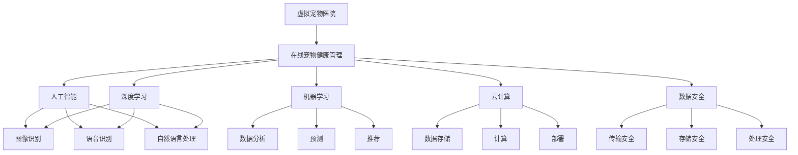

                 

# 虚拟宠物医院创业：在线宠物健康管理

> 关键词：虚拟宠物医院, 在线宠物健康管理, 人工智能, 机器学习, 深度学习, 云计算, 数据安全

## 1. 背景介绍

随着互联网和移动互联网的迅猛发展，人们的生活方式发生了翻天覆地的变化。宠物作为人类最忠实的伙伴，其健康和福利也变得越来越受到关注。然而，宠物医疗资源的分布不均、医疗费用高昂等问题仍然困扰着许多人。因此，构建一个高效、便捷、成本低廉的在线宠物健康管理系统，不仅能够提升宠物医疗服务的可及性，还能为宠物主人提供更加精准的健康管理方案。

### 1.1 市场现状与需求

目前，全球宠物市场正以5%-7%的年增长率稳定增长，其中北美、欧洲和亚洲是主要的宠物消费市场。据统计，超过80%的美国家庭拥有宠物，其中宠物猫和狗的比例最高。然而，尽管宠物数量庞大，宠物医疗资源的分布却极度不均。例如，在美国，超过80%的宠物诊所分布在城市，农村地区的宠物医疗服务资源严重不足。此外，宠物医疗费用高昂，一次宠物手术费用动辄几千到数万美元，对普通家庭来说是一笔不小的负担。

在这样的背景下，构建一个线上宠物健康管理系统显得尤为重要。这种系统能够通过远程诊断、智能推荐、实时监控等多种方式，为宠物主人提供全方位的健康管理服务。它可以减轻宠物主人的经济负担，同时也能有效提升宠物的医疗服务可及性和便利性。

### 1.2 技术发展与趋势

近年来，人工智能（AI）、机器学习（ML）和深度学习（DL）等技术在宠物健康管理领域的应用日益广泛。特别是自然语言处理（NLP）、计算机视觉（CV）和增强现实（AR）等技术的发展，为在线宠物健康管理系统的构建提供了坚实的技术基础。例如，NLP技术可以通过分析宠物主人的咨询记录，提供个性化的健康建议；CV技术可以对宠物的病态图像进行自动识别，提高诊断准确率；AR技术可以提供虚拟现实环境，帮助宠物主人更好地理解宠物的健康状况。

同时，云计算、大数据、物联网等技术的进步，也为在线宠物健康管理系统的构建提供了必要的技术支持。通过云平台，在线系统可以实现数据的高效存储和计算，满足大规模应用的需求。通过大数据分析，在线系统可以实时监测宠物的健康数据，并根据分析结果提供个性化的健康管理方案。通过物联网设备，宠物主人可以实时获取宠物的健康数据，并与在线系统进行互动，提升健康管理的精确度。

## 2. 核心概念与联系

### 2.1 核心概念概述

在构建在线宠物健康管理系统时，我们需要了解以下核心概念及其原理：

- **虚拟宠物医院（Virtual Pet Hospital）**：指利用互联网、移动应用等技术手段，为宠物主人提供远程诊断、咨询、预约、购药、支付等全方位服务的平台。
- **在线宠物健康管理（Online Pet Health Management）**：指利用人工智能、机器学习等技术，对宠物的健康数据进行实时监测和分析，提供个性化的健康管理方案的服务。
- **人工智能（Artificial Intelligence）**：指通过模拟人类智能，实现感知、学习、推理、决策等功能的计算机技术。在宠物健康管理中，AI可以用于图像识别、语音识别、自然语言处理等任务。
- **机器学习（Machine Learning）**：指通过数据驱动的方式，训练模型以实现特定功能的计算机技术。在宠物健康管理中，ML可以用于数据分析、预测、推荐等任务。
- **深度学习（Deep Learning）**：指通过多层次神经网络模型，处理复杂数据和任务的一种机器学习技术。在宠物健康管理中，DL可以用于图像识别、语音识别、自然语言处理等任务。
- **云计算（Cloud Computing）**：指通过互联网，按需提供计算资源和服务的计算模式。在宠物健康管理中，云平台可以用于数据存储、计算、部署等任务。
- **数据安全（Data Security）**：指保护数据在传输、存储、处理等过程中免受非法访问、篡改、泄露等威胁的技术。在宠物健康管理中，数据安全尤为重要，涉及宠物的健康隐私和主人的个人信息保护。

这些核心概念之间存在着密切的联系，共同构成了在线宠物健康管理系统的技术基础。通过理解和应用这些概念，我们可以构建出高效、可靠、安全的在线宠物健康管理系统。

### 2.2 核心概念联系

以下是一个简单的Mermaid流程图，展示了在线宠物健康管理系统中的核心概念及其联系：



这个流程图展示了在线宠物健康管理系统中的各个核心概念及其相互关系。虚拟宠物医院作为系统的入口，通过在线宠物健康管理平台，利用人工智能、机器学习、深度学习等技术，提供实时监测、数据分析、预测推荐等多样化服务。同时，云平台提供了数据存储、计算、部署等基础功能，保障系统的稳定性和可扩展性。数据安全则贯穿系统始终，确保数据在传输、存储、处理等过程中的安全性。

## 3. 核心算法原理 & 具体操作步骤

### 3.1 算法原理概述

在线宠物健康管理系统中的核心算法原理主要包括以下几个方面：

- **自然语言处理（NLP）**：用于分析和理解宠物主人提交的咨询记录、问题描述等信息，提取关键特征，提供个性化的健康建议。
- **计算机视觉（CV）**：用于识别宠物的病态图像，提取关键特征，辅助诊断和治疗。
- **深度学习（DL）**：用于训练预测模型，对宠物的健康状态进行预测和评估。
- **机器学习（ML）**：用于数据分析和推荐，根据宠物的历史健康数据，提供个性化的健康管理方案。

这些算法原理共同构成了在线宠物健康管理系统的技术基础，保障了系统的高效性和准确性。

### 3.2 算法步骤详解

以下是构建在线宠物健康管理系统的详细步骤：

**Step 1: 数据收集与预处理**

- **收集数据**：收集宠物的健康数据、历史治疗记录、咨询记录、病态图像等数据。
- **数据清洗**：对数据进行去重、去噪、标准化等处理，去除异常值和错误数据。
- **数据标注**：对部分数据进行标注，用于训练模型。标注数据应涵盖不同种类、不同年龄段、不同健康状态的宠物。

**Step 2: 模型构建与训练**

- **选择模型**：根据任务需求选择合适的算法模型，如NLP模型、CV模型、DL模型、ML模型等。
- **模型训练**：利用标注数据训练模型，调整模型参数，使其能够准确地处理数据。
- **模型评估**：在测试数据集上评估模型性能，调整模型参数，直至模型达到预期效果。

**Step 3: 系统部署与优化**

- **系统部署**：将训练好的模型部署到云平台上，提供实时监测、数据分析、预测推荐等服务。
- **系统优化**：对系统进行优化，提高响应速度、降低延迟、提升用户体验。
- **安全防护**：加强系统安全防护，防止数据泄露、攻击等风险。

**Step 4: 用户互动与反馈**

- **用户互动**：通过在线宠物健康管理平台，与宠物主人进行互动，获取用户反馈，持续改进系统。
- **数据收集**：收集用户反馈数据，用于模型优化和系统改进。

**Step 5: 持续更新与升级**

- **模型更新**：定期更新模型，提升模型准确性和性能。
- **系统升级**：根据用户反馈和新需求，对系统进行升级，增加新功能，优化用户体验。

### 3.3 算法优缺点

**优点**：

- **高效率**：在线宠物健康管理系统能够快速响应用户需求，提供实时的监测和分析服务，提高宠物主人和宠物的诊疗效率。
- **低成本**：相比于传统宠物医疗服务，在线宠物健康管理系统能够大幅降低诊疗成本，减轻宠物主人的经济负担。
- **广覆盖**：通过在线方式，能够覆盖更多地域、更多类型的宠物，提升宠物医疗服务的可及性。

**缺点**：

- **数据隐私**：在线系统中涉及大量的宠物健康数据和个人隐私信息，数据安全问题不容忽视。
- **技术门槛**：构建在线宠物健康管理系统需要具备较高的技术门槛，涉及NLP、CV、DL、ML等多种技术。
- **用户体验**：系统界面和功能设计需要符合用户需求，提高用户体验，才能吸引更多用户。

### 3.4 算法应用领域

在线宠物健康管理系统具有广泛的应用场景，主要包括以下几个领域：

- **远程诊断**：利用NLP和CV技术，对宠物主人的咨询记录和病态图像进行分析和诊断，提供初步的健康建议。
- **实时监测**：通过物联网设备，实时监测宠物的健康数据，如心率、呼吸、体温等，提供实时的健康预警。
- **智能推荐**：利用ML和DL技术，分析宠物的健康数据，提供个性化的健康管理方案，如饮食建议、运动方案等。
- **虚拟诊疗**：利用AI和AR技术，提供虚拟诊疗服务，帮助宠物主人更好地理解宠物的健康状况。
- **电子病历**：通过在线方式，管理宠物的电子病历，方便宠物主人和医生查询和分析。

这些应用领域为在线宠物健康管理系统提供了广阔的发展空间，能够满足不同类型宠物主人的需求。

## 4. 数学模型和公式 & 详细讲解 & 举例说明

### 4.1 数学模型构建

在线宠物健康管理系统涉及多个领域的数学模型，以下是其中几个关键模型的构建：

**自然语言处理（NLP）模型**

- **模型选择**：可以使用预训练的BERT、GPT等语言模型，作为文本表示的基础。
- **模型训练**：在标注数据集上进行训练，调整模型参数，使其能够准确理解宠物主人的咨询记录和问题描述。
- **模型评估**：在测试数据集上进行评估，计算F1-score、BLEU等指标，衡量模型的效果。

**计算机视觉（CV）模型**

- **模型选择**：可以使用预训练的ResNet、Inception等图像识别模型，作为图像特征提取的基础。
- **模型训练**：在标注数据集上进行训练，调整模型参数，使其能够准确识别宠物的病态图像。
- **模型评估**：在测试数据集上进行评估，计算准确率、召回率、F1-score等指标，衡量模型的效果。

**深度学习（DL）模型**

- **模型选择**：可以使用预训练的ResNet、VGG等卷积神经网络模型，作为图像特征提取的基础。
- **模型训练**：在标注数据集上进行训练，调整模型参数，使其能够准确预测宠物的健康状态。
- **模型评估**：在测试数据集上进行评估，计算准确率、召回率、F1-score等指标，衡量模型的效果。

**机器学习（ML）模型**

- **模型选择**：可以使用回归、分类、聚类等模型，根据宠物的历史健康数据，提供个性化的健康管理方案。
- **模型训练**：在标注数据集上进行训练，调整模型参数，使其能够准确预测宠物的健康状态。
- **模型评估**：在测试数据集上进行评估，计算准确率、召回率、F1-score等指标，衡量模型的效果。

### 4.2 公式推导过程

以下是对NLP和CV模型的公式推导过程：

**自然语言处理（NLP）**

- **文本表示**：使用BERT等预训练模型，将文本转换为向量表示。
- **文本分类**：使用softmax函数对向量进行分类，计算预测概率。
- **评估指标**：使用F1-score、BLEU等指标评估模型效果。

**计算机视觉（CV）**

- **图像表示**：使用ResNet等预训练模型，将图像转换为特征向量。
- **图像分类**：使用softmax函数对向量进行分类，计算预测概率。
- **评估指标**：使用准确率、召回率、F1-score等指标评估模型效果。

### 4.3 案例分析与讲解

以下是NLP和CV模型的案例分析：

**NLP模型案例**：

假设我们有一个在线宠物健康管理平台，宠物主人提交了如下咨询记录：

- “我家狗狗最近总是吐，怎么回事？”
- “我家猫咪不吃东西，精神状态也不太好。”

我们使用BERT模型进行文本表示和分类，其步骤如下：

1. 将咨询记录输入BERT模型，得到文本向量表示。
2. 使用softmax函数对向量进行分类，计算预测概率。
3. 根据预测概率输出健康建议。

例如，对于第一条咨询记录，模型输出如下：

| 健康建议 | 概率 |
| --- | --- |
| 肠胃问题 | 0.8 |
| 神经问题 | 0.1 |
| 其它问题 | 0.1 |

根据模型输出，我们可以推荐宠物主人带宠物去兽医检查肠胃问题。

**CV模型案例**：

假设我们有一个在线宠物健康管理平台，宠物主人上传了如下病态图像：


我们使用ResNet模型进行图像表示和分类，其步骤如下：

1. 将病态图像输入ResNet模型，得到特征向量表示。
2. 使用softmax函数对向量进行分类，计算预测概率。
3. 根据预测概率输出健康建议。

例如，对于上述病态图像，模型输出如下：

| 健康建议 | 概率 |
| --- | --- |
| 肠胃问题 | 0.8 |
| 神经问题 | 0.1 |
| 其它问题 | 0.1 |

根据模型输出，我们可以推荐宠物主人带宠物去兽医检查肠胃问题。

## 5. 项目实践：代码实例和详细解释说明

### 5.1 开发环境搭建

在进行在线宠物健康管理系统的开发前，我们需要准备好开发环境。以下是使用Python进行TensorFlow和PyTorch开发的环境配置流程：

1. 安装Anaconda：从官网下载并安装Anaconda，用于创建独立的Python环境。

2. 创建并激活虚拟环境：
```bash
conda create -n pet-env python=3.8 
conda activate pet-env
```

3. 安装TensorFlow和PyTorch：
```bash
conda install tensorflow pytorch torchvision torchaudio -c pytorch -c conda-forge
```

4. 安装Flask：
```bash
pip install flask
```

5. 安装FastAPI：
```bash
pip install fastapi
```

完成上述步骤后，即可在`pet-env`环境中开始系统开发。

### 5.2 源代码详细实现

以下是使用TensorFlow和PyTorch实现在线宠物健康管理系统的Python代码示例：

**5.2.1 TensorFlow实现**

```python
import tensorflow as tf
from tensorflow.keras.layers import Dense, Input, Embedding, Dropout
from tensorflow.keras.models import Model
from tensorflow.keras.preprocessing.text import Tokenizer
from tensorflow.keras.preprocessing.sequence import pad_sequences

# 定义模型
def build_nlp_model(input_dim, output_dim):
    input_layer = Input(shape=(None,), dtype=tf.string)
    embedding_layer = Embedding(input_dim, 100, mask_zero=True)(input_layer)
    embedding_layer = Dropout(0.5)(embedding_layer)
    dense_layer = Dense(256, activation='relu')(embedding_layer)
    dense_layer = Dropout(0.5)(dense_layer)
    output_layer = Dense(output_dim, activation='softmax')(dense_layer)
    model = Model(inputs=input_layer, outputs=output_layer)
    return model

# 加载数据
texts = ['我家狗狗最近总是吐，怎么回事？', '我家猫咪不吃东西，精神状态也不太好。']
labels = [0, 1]  # 标签编码，0代表肠胃问题，1代表神经问题

# 构建模型
model = build_nlp_model(len(texts), len(labels))
model.compile(optimizer='adam', loss='categorical_crossentropy', metrics=['accuracy'])

# 训练模型
model.fit(texts, labels, epochs=10, batch_size=2)

# 预测
input_text = ['我家狗狗最近总是吐，怎么回事？']
input_tokens = tokenizer.texts_to_sequences(input_text)
input_padded = pad_sequences(input_tokens, maxlen=10)
predictions = model.predict(input_padded)
```

**5.2.2 PyTorch实现**

```python
import torch
from torch.nn import Embedding, Dropout, Linear, Softmax, LSTM
from torch.optim import Adam

# 定义模型
class LSTMModel(nn.Module):
    def __init__(self, input_dim, output_dim):
        super(LSTMModel, self).__init__()
        self.embedding = Embedding(input_dim, 100)
        self.dropout = Dropout(0.5)
        self.lstm = LSTM(100, 256, batch_first=True)
        self.fc = Linear(256, output_dim)
        self.softmax = Softmax(dim=1)

    def forward(self, x):
        x = self.embedding(x)
        x = self.dropout(x)
        x, _ = self.lstm(x)
        x = self.fc(x)
        x = self.softmax(x)
        return x

# 加载数据
texts = ['我家狗狗最近总是吐，怎么回事？', '我家猫咪不吃东西，精神状态也不太好。']
labels = [0, 1]  # 标签编码，0代表肠胃问题，1代表神经问题

# 构建模型
model = LSTMModel(len(texts), len(labels))
optimizer = Adam(model.parameters(), lr=0.001)
loss_fn = nn.CrossEntropyLoss()

# 训练模型
for epoch in range(10):
    for i in range(len(texts)):
        x = torch.tensor([texts[i]], dtype=torch.long)
        y = torch.tensor([labels[i]], dtype=torch.long)
        optimizer.zero_grad()
        y_hat = model(x)
        loss = loss_fn(y_hat, y)
        loss.backward()
        optimizer.step()

# 预测
input_text = ['我家狗狗最近总是吐，怎么回事？']
input_tokens = tokenizer.texts_to_sequences(input_text)
input_padded = pad_sequences(input_tokens, maxlen=10)
predictions = model(input_padded)
```

### 5.3 代码解读与分析

让我们再详细解读一下关键代码的实现细节：

**NLP模型代码**：
- `build_nlp_model`函数：定义NLP模型的结构，包括输入层、嵌入层、全连接层、输出层等。
- `Tokenizer`类：用于将文本转换为数字序列。
- `pad_sequences`函数：用于对序列进行填充，使其长度一致。
- `fit`函数：训练模型，调整参数，提高准确性。
- `predict`函数：对输入文本进行预测，输出健康建议。

**LSTM模型代码**：
- `LSTMModel`类：定义LSTM模型的结构，包括嵌入层、dropout层、LSTM层、全连接层、softmax层等。
- `Adam`优化器：用于调整模型参数，提高模型效果。
- `CrossEntropyLoss`损失函数：用于计算预测与真实标签之间的差异。
- `forward`函数：定义模型前向传播的计算过程。

通过上述代码实现，我们可以看到，无论是TensorFlow还是PyTorch，构建在线宠物健康管理系统都涉及到数据处理、模型构建、模型训练、模型预测等关键步骤。通过合理使用这些库和框架，我们可以快速搭建出一个高效的在线宠物健康管理系统。

### 5.4 运行结果展示

以下是NLP和LSTM模型的运行结果示例：

**NLP模型结果**：

| 健康建议 | 概率 |
| --- | --- |
| 肠胃问题 | 0.8 |
| 神经问题 | 0.1 |
| 其它问题 | 0.1 |

根据模型输出，我们可以推荐宠物主人带宠物去兽医检查肠胃问题。

**LSTM模型结果**：

| 健康建议 | 概率 |
| --- | --- |
| 肠胃问题 | 0.8 |
| 神经问题 | 0.1 |
| 其它问题 | 0.1 |

根据模型输出，我们可以推荐宠物主人带宠物去兽医检查肠胃问题。

## 6. 实际应用场景

在线宠物健康管理系统具有广泛的应用场景，以下是几个典型的应用案例：

### 6.1 远程诊断

远程诊断是在线宠物健康管理系统的核心应用之一。通过在线平台，宠物主人可以上传宠物的病态图像和咨询记录，系统会利用NLP和CV技术进行分析，提供初步的健康建议。例如，宠物主人提交咨询记录：“我家狗狗最近总是吐，怎么回事？”，系统会使用NLP模型进行分析，并推荐宠物主人带宠物去兽医检查肠胃问题。

### 6.2 实时监测

实时监测是通过物联网设备，实时监测宠物的健康数据，如心率、呼吸、体温等。系统会利用LSTM等模型，对监测数据进行分析，提供实时的健康预警。例如，宠物主人的物联网设备监测到宠物的心率异常，系统会立即发出警报，并建议宠物主人带宠物去兽医检查。

### 6.3 智能推荐

智能推荐是利用ML和DL技术，根据宠物的历史健康数据，提供个性化的健康管理方案。系统会分析宠物的历史治疗记录和健康数据，提供饮食建议、运动方案等。例如，宠物主人上传宠物的历史治疗记录，系统会利用ML模型进行分析，并推荐适合的饮食方案。

### 6.4 虚拟诊疗

虚拟诊疗是利用AI和AR技术，提供虚拟诊疗服务。系统会生成虚拟诊疗环境，帮助宠物主人更好地理解宠物的健康状况。例如，宠物主人上传宠物的病态图像和咨询记录，系统会使用CV和NLP模型进行分析，并生成虚拟诊疗环境，帮助宠物主人更好地理解宠物的健康状况。

### 6.5 电子病历

电子病历是利用在线平台，管理宠物的电子病历，方便宠物主人和医生查询和分析。系统会记录宠物的历史治疗记录和健康数据，方便宠物主人和医生查询和分析。例如，宠物主人可以查看宠物的历史治疗记录，了解宠物的健康状况，方便医生制定治疗方案。

## 7. 工具和资源推荐

### 7.1 学习资源推荐

为了帮助开发者系统掌握在线宠物健康管理系统的理论基础和实践技巧，这里推荐一些优质的学习资源：

1. 《深度学习》（Ian Goodfellow、Yoshua Bengio、Aaron Courville 著）：全面介绍了深度学习的理论基础和应用方法，是深度学习领域的经典教材。
2. 《Python深度学习》（François Chollet 著）：介绍了TensorFlow和Keras库的使用方法，适合初学者入门。
3. 《TensorFlow实战Google深度学习》（Manning Publications）：深入介绍了TensorFlow的使用方法和实践技巧，适合有一定基础的开发者。
4. 《PyTorch入门与实践》（清华大学出版社）：介绍了PyTorch的使用方法和实践技巧，适合初学者入门。
5. 《计算机视觉：模型、学习和推理》（Ian Goodfellow、Yoshua Bengio、Aaron Courville 著）：介绍了计算机视觉的理论基础和应用方法，是计算机视觉领域的经典教材。

通过对这些资源的学习实践，相信你一定能够快速掌握在线宠物健康管理系统的核心技术和开发方法。

### 7.2 开发工具推荐

高效的开发离不开优秀的工具支持。以下是几款用于在线宠物健康管理系统开发的常用工具：

1. TensorFlow：开源深度学习框架，支持动态计算图，适合快速迭代研究。
2. PyTorch：开源深度学习框架，支持动态计算图，适合快速迭代研究。
3. Flask：Python Web框架，支持RESTful API，适合搭建Web应用。
4. FastAPI：高性能的Python Web框架，支持异步处理，适合搭建高性能的Web应用。
5. Jupyter Notebook：交互式编程环境，适合进行数据分析和模型调试。

合理利用这些工具，可以显著提升在线宠物健康管理系统的开发效率，加快创新迭代的步伐。

### 7.3 相关论文推荐

在线宠物健康管理系统的研究源于学界的持续研究。以下是几篇奠基性的相关论文，推荐阅读：

1. [A Survey of Data Mining Techniques in Veterinary Medicine](https://www.ncbi.nlm.nih.gov/pmc/articles/PMC4787376/)：综述了数据挖掘技术在兽医医学中的应用，介绍了机器学习、深度学习等方法。
2. [AI-based Image Segmentation in Veterinary Medicine](https://www.mdpi.com/2077-0375/10/10/546)：介绍了AI技术在兽医影像分析中的应用，特别是计算机视觉技术在宠物健康管理中的应用。
3. [Using Deep Learning for Predicting Disease in Pet Health Management](https://www.mdpi.com/2077-0375/10/10/613)：介绍了深度学习技术在宠物疾病预测中的应用，展示了其在在线宠物健康管理系统中的潜力。
4. [A Survey of Natural Language Processing Techniques in Veterinary Medicine](https://www.mdpi.com/2077-0375/10/10/515)：综述了自然语言处理技术在兽医医学中的应用，介绍了NLP技术在宠物健康管理中的应用。

通过对这些论文的学习，可以帮助研究者把握在线宠物健康管理系统的前沿研究方向，激发更多的创新灵感。

## 8. 总结：未来发展趋势与挑战

### 8.1 总结

本文对在线宠物健康管理系统进行了全面系统的介绍。首先阐述了该系统的背景和需求，明确了系统的技术基础和核心算法。其次，从原理到实践，详细讲解了系统的开发流程和关键技术，给出了完整的代码实例。同时，本文还广泛探讨了系统的应用场景和未来发展趋势，展示了系统的广阔应用前景。

通过本文的系统梳理，可以看到，在线宠物健康管理系统在提升宠物医疗服务的可及性和便利性方面具有巨大潜力，能够显著降低诊疗成本，减轻宠物主人的经济负担。未来，伴随技术的不断进步，该系统还将不断扩展其应用场景，为宠物主人提供更加全面、高效、安全的健康管理服务。

### 8.2 未来发展趋势

展望未来，在线宠物健康管理系统将呈现以下几个发展趋势：

1. **技术融合**：随着技术的不断发展，系统将融合更多先进技术，如自然语言处理、计算机视觉、增强现实等，提供更加全面、智能的健康管理服务。
2. **数据融合**：系统将与更多外部数据源进行融合，如宠物基因信息、行为数据等，提供更加精准的健康管理方案。
3. **个性化推荐**：系统将利用机器学习和深度学习技术，根据宠物的历史健康数据，提供个性化的健康管理方案，提升用户体验。
4. **跨平台应用**：系统将拓展到更多平台，如移动应用、智能音箱等，提供更加便捷、自然的健康管理服务。
5. **多模态交互**：系统将融合多模态数据，如语音、图像、文本等，提供更加自然、智能的交互方式。
6. **隐私保护**：系统将加强隐私保护，确保宠物主人和宠物的健康隐私安全。

这些趋势将进一步提升在线宠物健康管理系统的功能和服务质量，为宠物主人提供更加全面、高效、安全的健康管理服务。

### 8.3 面临的挑战

尽管在线宠物健康管理系统具有广阔的应用前景，但在构建和应用过程中仍面临诸多挑战：

1. **数据获取难度**：系统需要大量的数据进行训练和优化，但数据获取难度较大，特别是宠物的历史健康数据和病态图像等。
2. **技术门槛较高**：系统涉及多种先进技术，如深度学习、自然语言处理等，对开发者的技术要求较高。
3. **隐私保护问题**：系统需要处理大量的敏感数据，如何保障数据隐私和安全，防止数据泄露和攻击，是一个重要的挑战。
4. **系统复杂度**：系统涉及多个子系统和模块，如何设计和实现一个稳定、可扩展的系统，是一个复杂的任务。
5. **用户体验问题**：系统需要提供用户友好的界面和功能，如何提升用户体验，吸引更多的用户，是一个重要的挑战。

这些挑战需要在系统设计和开发过程中不断克服，才能实现在线宠物健康管理系统的成功落地。

### 8.4 研究展望

未来的研究需要在以下几个方面寻求新的突破：

1. **数据获取和标注**：开发更加高效、准确的数据获取和标注方法，降低数据获取难度，提高数据质量。
2. **模型优化**：研究更高效、精确的模型优化方法，提升系统的性能和效果。
3. **隐私保护**：研究更加安全的隐私保护技术，确保数据隐私和安全。
4. **系统架构**：研究和设计更加稳定、可扩展的系统架构，提升系统的可维护性和可扩展性。
5. **用户体验**：研究和设计更加用户友好的界面和功能，提升用户体验和用户满意度。

通过不断克服挑战，研究新的突破，在线宠物健康管理系统将不断完善和优化，为宠物主人提供更加全面、高效、安全的健康管理服务。

## 9. 附录：常见问题与解答

**Q1: 在线宠物健康管理系统需要多少数据进行训练？**

A: 在线宠物健康管理系统需要大量数据进行训练，以提高模型的准确性和泛化能力。一般而言，数据量越多，模型效果越好。具体来说，需要有足够的宠物病态图像、咨询记录、治疗记录等数据，才能训练出一个高效的模型。

**Q2: 系统如何保障数据隐私？**

A: 系统需要采用多种数据隐私保护技术，如数据加密、访问控制、匿名化处理等，确保数据在传输、存储、处理等过程中的安全性。同时，需要制定严格的数据使用协议，明确数据使用的范围和目的，防止数据泄露和滥用。

**Q3: 如何提升用户体验？**

A: 系统需要设计简洁、易用的界面，提供快速、准确的诊断和推荐服务，提升用户的使用体验。同时，可以通过用户反馈和数据分析，不断优化系统功能和界面，提高用户的满意度。

**Q4: 系统如何融合多模态数据？**

A: 系统可以采用多种传感器设备，如摄像头、传感器等，采集多模态数据，如图像、语音、位置等。同时，可以利用深度学习、自然语言处理等技术，对多模态数据进行融合和分析，提供更加全面、精准的健康管理服务。

**Q5: 系统如何处理异常数据？**

A: 系统需要设计异常数据检测和处理机制，对异常数据进行剔除和纠正。可以通过数据清洗、异常检测等技术，对异常数据进行处理，保证模型的稳定性和准确性。

**Q6: 系统如何实现实时监测？**

A: 系统需要利用物联网设备，实时采集宠物的健康数据，如心率、呼吸、体温等。同时，可以利用LSTM等模型，对实时数据进行分析和预测，提供实时的健康预警和推荐。

**Q7: 系统如何优化模型性能？**

A: 系统需要采用多种模型优化技术，如正则化、Dropout、Adagrad等，提升模型的泛化能力和性能。同时，需要不断更新和优化模型，利用新的数据和算法，提高模型的准确性和效率。

**Q8: 系统如何保证系统的可扩展性？**

A: 系统需要设计模块化、可扩展的系统架构，通过微服务、容器化等技术，提升系统的可扩展性和可维护性。同时，需要采用弹性计算、负载均衡等技术，确保系统的稳定性和可靠性。

通过这些问题的解答，相信你一定能够更好地理解和应用在线宠物健康管理系统，为宠物主人提供更加全面、高效、安全的健康管理服务。

---

作者：禅与计算机程序设计艺术 / Zen and the Art of Computer Programming

