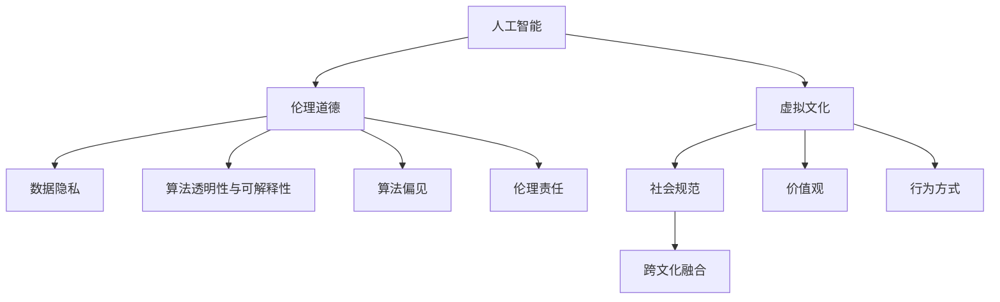

                 

# 虚拟文化：AI塑造的新型社会规范

> 关键词：人工智能,社会规范,虚拟文化,伦理道德,技术融合,公共讨论

## 1. 背景介绍

### 1.1 问题由来

随着人工智能技术的飞速发展，AI正逐渐渗透到生活的方方面面，从智能家居到智慧医疗，从无人驾驶到虚拟助手，AI的应用场景日益多样化。但与此同时，AI技术的广泛应用也引发了一系列社会伦理道德问题。这些新兴现象挑战了传统的社会规范，重新定义了人类在数字时代的行为准则。本文旨在深入探讨AI技术如何塑造虚拟文化，以及在此过程中所面临的伦理道德困境。

### 1.2 问题核心关键点

AI技术塑造虚拟文化的核心问题包括以下几个方面：

1. **数据隐私与监控**：AI系统需要大量数据进行训练，但这些数据往往涉及个人隐私。如何在保障数据隐私的同时，充分利用数据资源，是一个亟需解决的问题。

2. **算法透明性与可解释性**：AI模型的决策过程往往是"黑箱"操作，难以解释其内部逻辑。如何提高算法的透明度和可解释性，增强公众信任，是另一个重要议题。

3. **偏见与歧视**：AI模型可能因为训练数据的偏见，产生对某些群体的歧视性结果。如何减少算法偏见，保证模型的公平性，是一个关键挑战。

4. **伦理道德约束**：AI技术的广泛应用可能带来伦理道德上的争议，如自动决策的伦理责任归属、AI武器化等问题。如何在技术创新和伦理道德之间找到平衡，是社会需要共同面对的问题。

5. **跨文化融合**：不同文化背景下的AI技术应用，可能存在差异。如何在全球范围内推广AI技术，促进文化交流与融合，也是一个重要议题。

### 1.3 问题研究意义

研究AI技术对虚拟文化的影响，有助于我们理解AI如何在现代社会中重新定义行为规范，以及如何应对由此引发的伦理道德问题。这不仅对AI技术本身的发展具有指导意义，也对社会治理、公共政策制定提供了重要参考。通过深入探讨这些问题，我们可以为AI技术的健康发展制定更加科学合理的规范和标准，推动人工智能技术的公平、公正、透明、可信的广泛应用。

## 2. 核心概念与联系

### 2.1 核心概念概述

为更好地理解AI技术如何塑造虚拟文化，本节将介绍几个密切相关的核心概念：

1. **人工智能(AI)**：基于计算机科学、数学、统计学等领域的知识，通过算法、模型等工具，实现模拟、扩展人类智能的技术。

2. **虚拟文化(Virtual Culture)**：在虚拟空间（如互联网、社交媒体、虚拟现实等）中形成的新型社会规范、价值观和行为方式。

3. **伦理道德(Ethics & Morality)**：涉及人类行为正当性的道德原则，是社会规范的重要组成部分。

4. **数据隐私(Data Privacy)**：个人数据的保护问题，涉及信息收集、存储、传输和使用等方面的隐私权保护。

5. **算法透明性与可解释性(Algorithm Transparency & Interpretability)**：算法的决策过程和结果可以被理解、解释和验证，确保公众信任。

6. **算法偏见(Algorithm Bias)**：算法模型因训练数据存在偏见，导致输出结果偏向某些群体，影响公平性和公正性。

7. **伦理责任(Ethical Responsibility)**：涉及AI系统在决策和操作中的伦理责任归属，是公共讨论的重要议题。

这些核心概念之间的逻辑关系可以通过以下Mermaid流程图来展示：



这个流程图展示了大语言模型的核心概念及其之间的关系：

1. 人工智能通过大量数据的处理和算法的优化，创造出虚拟文化，并深刻影响社会规范、价值观和行为方式。
2. 虚拟文化的形成涉及伦理道德问题，涉及数据隐私保护、算法透明性与可解释性、算法偏见等关键要素。
3. 伦理责任是虚拟文化讨论中的重要话题，涉及AI系统在决策和操作中的责任归属。

## 3. 核心算法原理 & 具体操作步骤

### 3.1 算法原理概述

AI技术塑造虚拟文化的核心在于数据驱动的模型训练和决策过程。以下将详细阐述这一过程的数学模型和算法原理。

假设我们有一个通用的AI模型 $\mathcal{M}$，其输入为 $\mathbf{x}$，输出为 $\mathbf{y}$，表示为 $\mathcal{M}(\mathbf{x}) = \mathbf{y}$。AI模型通过大量标注数据进行训练，学习到输入和输出之间的映射关系。虚拟文化的形成，即通过AI模型在虚拟空间中生成和传播的规则、规范和行为模式。

### 3.2 算法步骤详解

1. **数据收集**：收集与虚拟文化相关的数据，包括用户行为、互动记录、社交媒体内容等。
2. **数据预处理**：对收集的数据进行清洗、去噪、归一化等预处理，确保数据质量。
3. **模型训练**：使用机器学习或深度学习算法，训练AI模型 $\mathcal{M}$。
4. **虚拟空间应用**：将训练好的模型应用于虚拟空间，生成和传播虚拟文化。
5. **伦理评估**：对生成的虚拟文化进行伦理道德评估，确保符合社会规范和价值观。

### 3.3 算法优缺点

**优点**：

1. **效率高**：AI模型可以快速处理大量数据，生成虚拟文化。
2. **可定制性**：通过不同的数据和算法，可以生成各种类型的虚拟文化。
3. **动态更新**：AI模型可以实时更新，适应虚拟空间中的新变化。

**缺点**：

1. **数据偏见**：训练数据可能存在偏见，导致模型输出结果不公平。
2. **算法黑箱**：模型决策过程难以解释，缺乏透明性。
3. **伦理风险**：模型可能在决策中引入伦理道德问题。

### 3.4 算法应用领域

AI技术塑造虚拟文化的广泛应用包括以下几个方面：

1. **智能推荐系统**：通过AI模型分析用户行为数据，推荐个性化内容，塑造用户虚拟文化。
2. **虚拟社交平台**：AI模型分析用户互动数据，生成虚拟社交规则和行为规范。
3. **虚拟现实与游戏**：AI模型生成虚拟世界，设定虚拟行为准则。
4. **智能客服与助手**：AI模型通过与用户的互动，塑造虚拟服务规范。
5. **新闻与信息过滤**：AI模型分析新闻内容，生成信息过滤规则和推荐列表。

## 4. 数学模型和公式 & 详细讲解

### 4.1 数学模型构建

为了更好地理解AI技术塑造虚拟文化的数学模型，我们首先构建一个简单的数学框架。假设我们有一个二分类问题，输入为 $\mathbf{x} \in \mathbb{R}^d$，输出为 $\mathbf{y} \in \{0,1\}$。我们的目标是找到一个最优的模型参数 $\theta$，使得模型在数据集 $D$ 上的损失函数最小化。

**损失函数**：
$$
\mathcal{L}(\theta) = \frac{1}{N} \sum_{i=1}^N \ell(M_{\theta}(x_i),y_i)
$$

**优化目标**：
$$
\theta^* = \mathop{\arg\min}_{\theta} \mathcal{L}(\theta)
$$

其中，$\ell$ 为损失函数，通常为交叉熵损失或均方误差损失。

### 4.2 公式推导过程

以交叉熵损失函数为例，进行公式推导。假设模型 $M_{\theta}$ 的输出为 $\hat{y}$，真实标签为 $y$，则交叉熵损失函数为：

$$
\ell(M_{\theta}(x),y) = -y\log \hat{y} + (1-y)\log(1-\hat{y})
$$

将其代入经验风险公式，得：

$$
\mathcal{L}(\theta) = -\frac{1}{N}\sum_{i=1}^N [y_i\log M_{\theta}(x_i)+(1-y_i)\log(1-M_{\theta}(x_i))]
$$

通过反向传播算法，求解损失函数对模型参数 $\theta$ 的梯度，进行模型优化。

### 4.3 案例分析与讲解

以社交平台的内容推荐为例，分析AI模型如何生成和传播虚拟文化。

1. **数据收集**：收集用户的浏览历史、点赞记录、评论内容等数据。
2. **模型训练**：使用深度学习算法（如卷积神经网络、循环神经网络等）训练推荐模型 $\mathcal{M}$。
3. **虚拟文化形成**：模型根据用户的兴趣和行为，推荐个性化内容，形成虚拟社交规范和行为准则。
4. **伦理评估**：对推荐内容进行伦理审查，确保不推荐有害信息，不侵犯用户隐私。

## 5. 项目实践：代码实例和详细解释说明

### 5.1 开发环境搭建

在进行AI模型训练和虚拟文化生成之前，我们需要准备好开发环境。以下是使用Python进行TensorFlow开发的环境配置流程：

1. 安装Anaconda：从官网下载并安装Anaconda，用于创建独立的Python环境。

2. 创建并激活虚拟环境：
```bash
conda create -n tf-env python=3.8 
conda activate tf-env
```

3. 安装TensorFlow：根据CUDA版本，从官网获取对应的安装命令。例如：
```bash
conda install tensorflow==2.7 
```

4. 安装各类工具包：
```bash
pip install numpy pandas scikit-learn matplotlib tqdm jupyter notebook ipython
```

完成上述步骤后，即可在`tf-env`环境中开始AI模型训练和虚拟文化生成。

### 5.2 源代码详细实现

下面以内容推荐系统为例，给出使用TensorFlow进行深度学习模型训练的PyTorch代码实现。

```python
import tensorflow as tf
from tensorflow.keras.layers import Input, Embedding, Conv1D, Dense, GlobalMaxPooling1D, Concatenate
from tensorflow.keras.models import Model
from tensorflow.keras.optimizers import Adam

# 定义模型
inputs = Input(shape=(sequence_length,))
x = Embedding(vocab_size, embedding_dim)(inputs)
x = Conv1D(filters=64, kernel_size=3, activation='relu')(x)
x = GlobalMaxPooling1D()(x)
x = Dense(64, activation='relu')(x)
outputs = Dense(1, activation='sigmoid')(x)

model = Model(inputs=inputs, outputs=outputs)

# 编译模型
model.compile(optimizer=Adam(learning_rate=0.001), loss='binary_crossentropy', metrics=['accuracy'])

# 训练模型
model.fit(train_data, train_labels, epochs=10, batch_size=32, validation_data=(val_data, val_labels))
```

这段代码使用了TensorFlow的Keras API，定义了一个简单的深度学习模型，用于二分类任务的内容推荐。通过训练集上的优化，可以生成虚拟文化中个性化内容的推荐规则。

### 5.3 代码解读与分析

让我们再详细解读一下关键代码的实现细节：

**Keras模型定义**：
- `inputs`：输入层，用于接收序列化数据。
- `x`：嵌入层和卷积层，提取序列特征。
- `GlobalMaxPooling1D`：全局最大池化层，减少序列长度。
- `Dense`：全连接层，进行特征融合。
- `outputs`：输出层，进行二分类预测。
- `Model`：创建模型对象。

**模型编译**：
- `optimizer`：使用Adam优化器，设置学习率。
- `loss`：使用交叉熵损失函数。
- `metrics`：设置评价指标，包括精度。

**模型训练**：
- `fit`：使用训练数据进行模型训练，指定训练轮数和批次大小。
- `validation_data`：验证集用于模型评价，防止过拟合。

这段代码实现了从数据输入、模型构建、编译、训练到模型评估的完整流程，能够生成虚拟文化中的推荐规则。

## 6. 实际应用场景

### 6.1 智能推荐系统

AI技术在智能推荐系统中的应用，可以极大地提升用户体验和平台收益。通过AI模型对用户行为数据的分析，推荐个性化内容，塑造虚拟文化中的推荐规范。

### 6.2 虚拟社交平台

AI技术可以分析用户互动数据，生成虚拟社交平台中的行为规范和社交准则。通过算法优化，可以消除虚假信息、提升互动质量，营造健康的网络环境。

### 6.3 虚拟现实与游戏

AI技术可以生成虚拟现实环境和游戏规则，提升用户沉浸感和体验效果。通过不断的AI迭代，可以生成更加丰富多样的虚拟世界，增强用户互动和探索欲。

### 6.4 智能客服与助手

AI技术可以处理大量的用户查询和反馈，生成虚拟客服和助手的应答规范。通过算法优化，可以提升客服响应速度和准确率，增强用户满意度。

### 6.5 新闻与信息过滤

AI技术可以分析新闻内容，生成信息过滤规则和推荐列表。通过算法优化，可以过滤有害信息、提升信息质量，营造健康的信息环境。

## 7. 工具和资源推荐

### 7.1 学习资源推荐

为了帮助开发者系统掌握AI技术塑造虚拟文化的基本概念和实践技巧，这里推荐一些优质的学习资源：

1. 《深度学习》系列课程：斯坦福大学开设的深度学习课程，涵盖深度学习的基础理论和应用实践。

2. 《TensorFlow实战》书籍：Google官方出版的TensorFlow实战书籍，详细介绍了TensorFlow的使用方法和案例实践。

3. 《自然语言处理》课程：斯坦福大学开设的自然语言处理课程，深入讲解NLP的基础知识和前沿技术。

4. 《人工智能伦理》课程：清华大学开设的AI伦理课程，探讨AI技术的伦理道德问题。

5. 《人工智能白皮书》：工业界和学术界的权威报告，总结了AI技术的最新发展和应用前景。

通过对这些资源的学习实践，相信你一定能够快速掌握AI技术塑造虚拟文化的精髓，并用于解决实际的NLP问题。

### 7.2 开发工具推荐

高效的开发离不开优秀的工具支持。以下是几款用于AI技术塑造虚拟文化开发的常用工具：

1. TensorFlow：由Google主导开发的开源深度学习框架，生产部署方便，适合大规模工程应用。

2. PyTorch：基于Python的开源深度学习框架，灵活动态的计算图，适合快速迭代研究。

3. Keras：Keras API提供简单易用的接口，可以快速构建深度学习模型。

4. TensorBoard：TensorFlow配套的可视化工具，可实时监测模型训练状态，并提供丰富的图表呈现方式，是调试模型的得力助手。

5. Jupyter Notebook：交互式编程环境，便于开发和测试代码。

6. Weights & Biases：模型训练的实验跟踪工具，可以记录和可视化模型训练过程中的各项指标，方便对比和调优。

合理利用这些工具，可以显著提升AI技术塑造虚拟文化的开发效率，加快创新迭代的步伐。

### 7.3 相关论文推荐

AI技术塑造虚拟文化的研究源于学界的持续研究。以下是几篇奠基性的相关论文，推荐阅读：

1. AlphaGo论文：DeepMind团队开发的AlphaGo算法，展示了AI在策略游戏中的应用和潜力。

2. GANs的生成对抗网络：提出生成对抗网络（GANs），用于生成逼真图像和视频，展示了AI的创造力。

3. BERT的预训练技术：BERT模型通过预训练大规模文本数据，展示了AI在语言理解中的应用前景。

4. AlphaFold的蛋白质折叠预测：DeepMind团队开发的AlphaFold算法，成功预测蛋白质结构，展示了AI在生物医学领域的应用潜力。

5. AI伦理的伦理道德问题：探讨AI技术在伦理道德上的问题，强调伦理责任和公平性的重要性。

这些论文代表了大语言模型微调技术的发展脉络。通过学习这些前沿成果，可以帮助研究者把握学科前进方向，激发更多的创新灵感。

## 8. 总结：未来发展趋势与挑战

### 8.1 总结

本文对AI技术塑造虚拟文化的方法进行了全面系统的介绍。首先阐述了AI技术在虚拟文化中的作用和影响，明确了虚拟文化塑造的伦理道德问题。其次，从原理到实践，详细讲解了虚拟文化塑造的数学模型和算法原理，给出了虚拟文化生成的代码实现。同时，本文还广泛探讨了虚拟文化在智能推荐、虚拟社交、虚拟现实等诸多领域的应用前景，展示了AI技术的广泛应用潜力。此外，本文精选了虚拟文化塑造的各类学习资源，力求为读者提供全方位的技术指引。

通过本文的系统梳理，可以看到，AI技术正在以全新的方式塑造虚拟文化，深刻影响着人类的行为规范和社会价值观。未来，伴随AI技术的持续进步，虚拟文化必将迎来更多创新应用，为数字时代带来新的变革。

### 8.2 未来发展趋势

展望未来，AI技术塑造虚拟文化的趋势主要包括以下几个方面：

1. **多模态融合**：未来虚拟文化将更加注重多模态数据的融合，如图像、声音、文本的协同建模，提升用户体验和互动效果。

2. **个性化定制**：AI技术将通过更加精细化的用户画像分析，生成更加个性化、精准的虚拟文化推荐。

3. **社交智能**：AI技术将通过深度学习算法，提升虚拟社交平台的智能推荐和情感分析能力，增强用户互动质量。

4. **伦理治理**：未来虚拟文化将更加注重伦理道德问题，建立完善的伦理治理机制，确保AI技术的应用符合人类价值观。

5. **跨文化交流**：AI技术将促进不同文化背景下的虚拟文化交流，打破文化壁垒，推动全球文化融合。

6. **智能服务**：未来虚拟文化将更加注重智能服务的普及，提升社会治理和公共服务的智能化水平。

以上趋势凸显了AI技术在塑造虚拟文化中的重要地位，为AI技术未来的发展提供了新的方向和目标。

### 8.3 面临的挑战

尽管AI技术在虚拟文化塑造中取得了诸多成就，但在迈向更加智能化、普适化应用的过程中，它仍面临诸多挑战：

1. **数据隐私与安全**：随着AI技术的应用普及，用户数据的隐私和安全问题日益突出。如何在保障数据隐私的同时，充分利用数据资源，是一个亟需解决的问题。

2. **算法透明性与可解释性**：AI模型的决策过程往往是"黑箱"操作，难以解释其内部逻辑。如何提高算法的透明度和可解释性，增强公众信任，是另一个重要议题。

3. **伦理道德困境**：AI技术的广泛应用可能带来伦理道德上的争议，如自动决策的伦理责任归属、AI武器化等问题。如何在技术创新和伦理道德之间找到平衡，是社会需要共同面对的问题。

4. **技术标准与规范**：缺乏统一的技术标准和规范，导致不同平台和系统之间的互操作性差，阻碍了AI技术的普及和应用。

5. **跨文化差异**：不同文化背景下的AI技术应用，可能存在差异。如何在全球范围内推广AI技术，促进文化交流与融合，也是一个重要议题。

6. **技术偏见与歧视**：AI模型可能因为训练数据的偏见，产生对某些群体的歧视性结果。如何减少算法偏见，保证模型的公平性，是一个关键挑战。

以上挑战凸显了AI技术在塑造虚拟文化中仍然需要不断完善和优化，才能确保其应用的安全、可靠、公正。

### 8.4 研究展望

未来的研究需要在以下几个方面寻求新的突破：

1. **多模态融合与协同建模**：开发更加智能的多模态数据融合算法，提升用户体验和互动效果。

2. **个性化定制与推荐系统**：研究更加精细化的用户画像分析技术，生成更加个性化、精准的虚拟文化推荐。

3. **伦理治理与法律规范**：制定更加完善的伦理治理机制，确保AI技术的应用符合人类价值观。

4. **跨文化交流与融合**：探索不同文化背景下的虚拟文化交流与融合机制，打破文化壁垒，推动全球文化融合。

5. **智能服务与公共治理**：研究智能服务在社会治理和公共服务中的应用，提升社会治理智能化水平。

6. **技术标准与规范**：制定统一的技术标准和规范，促进不同平台和系统之间的互操作性。

这些研究方向的探索，必将引领AI技术在虚拟文化塑造中迈向更高的台阶，为构建安全、可靠、公正的虚拟文化奠定基础。面向未来，AI技术需要在技术创新和伦理道德之间找到平衡，才能真正发挥其在虚拟文化塑造中的潜力。

## 9. 附录：常见问题与解答

**Q1：AI技术如何影响虚拟文化的形成？**

A: AI技术通过大量数据的处理和算法的优化，生成虚拟文化中的规则、规范和行为模式。例如，智能推荐系统通过分析用户行为数据，生成个性化内容的推荐规则；虚拟社交平台通过分析用户互动数据，生成行为规范和社交准则。

**Q2：AI技术在虚拟文化中面临的主要伦理道德问题有哪些？**

A: AI技术在虚拟文化中面临的主要伦理道德问题包括：数据隐私与监控、算法透明性与可解释性、算法偏见与歧视、伦理责任归属等。这些问题需要结合具体应用场景，制定相应的伦理规范和解决方案。

**Q3：如何提高AI技术的透明度和可解释性？**

A: 提高AI技术的透明度和可解释性，可以通过以下几种方式：

1. 使用可解释性模型，如决策树、线性模型等，降低复杂度。
2. 引入对抗样本和逆向工程，分析模型的决策过程。
3. 提供模型可视化工具，展示模型的决策路径。
4. 使用可解释性技术，如LIME、SHAP等，解释模型的决策结果。

**Q4：如何应对AI技术的伦理道德挑战？**

A: 应对AI技术的伦理道德挑战，需要从多个方面进行综合治理：

1. 制定伦理规范和标准，确保AI技术的应用符合人类价值观。
2. 建立伦理治理机制，确保AI技术的应用透明和公正。
3. 引入伦理评估和审查机制，定期评估AI技术的应用效果。
4. 建立多方协作机制，加强社会各界对AI技术的监督和指导。
5. 开发伦理友好的AI技术，减少技术偏见和歧视。

**Q5：未来AI技术在虚拟文化中的应用前景有哪些？**

A: AI技术在虚拟文化中的应用前景包括：

1. 智能推荐系统：通过AI技术，生成个性化内容的推荐规则，提升用户体验。
2. 虚拟社交平台：通过AI技术，生成行为规范和社交准则，营造健康的网络环境。
3. 虚拟现实与游戏：通过AI技术，生成虚拟世界和行为准则，增强用户沉浸感和体验效果。
4. 智能客服与助手：通过AI技术，生成虚拟客服和助手的应答规范，提升用户满意度。
5. 新闻与信息过滤：通过AI技术，生成信息过滤规则和推荐列表，营造健康的信息环境。

总之，AI技术在虚拟文化中的应用前景广阔，将深刻影响人类的行为规范和社会价值观。

