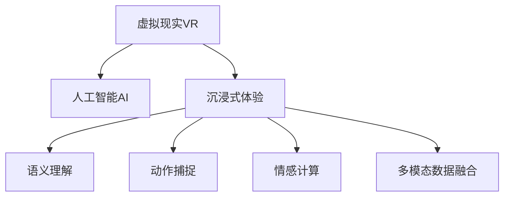

                 

# 虚拟现实叙事：AI驱动的沉浸式体验设计

## 1. 背景介绍

### 1.1 问题由来

随着虚拟现实(VR)技术的迅猛发展，其沉浸式体验设计已成为人工智能(AI)和计算机视觉(CV)领域的关注焦点。虚拟现实叙事不仅仅是娱乐领域的新趋势，更是医疗、教育、军事等多个领域跨界应用的热点。通过AI技术，我们能够实现更加自然、智能的沉浸式体验，提升用户对虚拟环境的感知和互动能力。

### 1.2 问题核心关键点

VR叙事的AI驱动技术包括视觉语义理解、动作捕捉、自然语言处理、情感计算等多个方向。通过人工智能技术，可以解决传统VR中的诸多限制，如高成本、有限互动、环境限制等。其核心关键点在于如何通过AI技术将自然界的复杂元素以更加直观、易用、无缝的方式呈现在虚拟环境中，提升用户的沉浸感和交互体验。

### 1.3 问题研究意义

AI驱动的VR叙事技术在多个领域带来了深远的变革，其研究意义如下：

1. **降低成本**：相比传统硬件昂贵的VR设备，AI驱动的虚拟环境可以通过渲染算法生成，显著降低硬件成本。
2. **提升交互性**：AI技术能够根据用户行为和语境实时调整虚拟环境，提供更加自然、沉浸的体验。
3. **拓宽应用场景**：AI技术可以处理大量的多模态数据，将VR技术应用到医疗、教育、训练等新场景中。
4. **增强安全性**：AI可以模拟真实世界的风险，提升用户对高风险场景的适应性，如军事训练、事故模拟等。
5. **推动技术进步**：AI技术在VR叙事中的应用，可以进一步提升人工智能和计算机视觉的研究水平，促进相关技术的深度融合。

## 2. 核心概念与联系

### 2.1 核心概念概述

为更好地理解AI驱动的VR叙事技术，本节将介绍几个密切相关的核心概念：

- **虚拟现实(VR)**：通过计算机生成的3D虚拟环境，实现用户与虚拟世界的互动。
- **人工智能(AI)**：使用机器学习、深度学习等技术，模拟人类智能的计算机系统。
- **沉浸式体验**：通过多感官刺激和智能交互，使用户产生身临其境的感觉。
- **语义理解**：通过自然语言处理(NLP)技术，理解用户的意图和语境，提供智能响应。
- **动作捕捉**：通过传感器捕捉用户的身体动作，实时响应其行为。
- **情感计算**：通过分析用户的生理和行为数据，感知和模拟其情感状态。
- **多模态数据融合**：结合视觉、听觉、触觉等多种感官信息，提升用户体验。

这些核心概念之间的逻辑关系可以通过以下Mermaid流程图来展示：



这个流程图展示了他的核心概念及其之间的关系：

1. 虚拟现实环境通过AI技术被赋予智能互动能力，生成沉浸式体验。
2. AI通过语义理解、动作捕捉、情感计算等技术，提升用户与虚拟环境的互动体验。
3. 多模态数据融合技术进一步丰富用户体验，使其更加真实和自然。

## 3. 核心算法原理 & 具体操作步骤
### 3.1 算法原理概述

AI驱动的VR叙事技术主要依赖于以下几类算法：

1. **语义理解算法**：通过自然语言处理(NLP)技术，理解用户的意图和语境，指导虚拟环境生成。
2. **动作捕捉算法**：通过传感器捕捉用户的身体动作，实时响应其行为，提升互动性。
3. **情感计算算法**：通过分析用户的生理和行为数据，感知其情感状态，调整虚拟环境，增强用户体验。
4. **多模态数据融合算法**：结合视觉、听觉、触觉等多种感官信息，提升虚拟环境的真实感和沉浸感。

这些算法共同构成了AI驱动的VR叙事技术的基础框架。

### 3.2 算法步骤详解

以下将详细介绍AI驱动VR叙事技术的具体操作流程：

**Step 1: 数据采集和预处理**
- 收集用户与虚拟环境互动的各项数据，如文本、音频、动作等。
- 对数据进行清洗、去噪和归一化处理，确保数据质量。

**Step 2: 语义理解**
- 使用预训练的语言模型(如BERT、GPT等)对用户输入进行语义解析，理解其意图。
- 结合上下文信息和用户历史行为，优化语义理解模型。

**Step 3: 动作捕捉**
- 使用传感器(如Kinect、Leap Motion等)捕捉用户的身体动作，获取其姿态和位置。
- 实时处理动作数据，提取关键信息，并根据用户行为动态调整虚拟环境。

**Step 4: 情感计算**
- 通过分析用户的生理数据(如心率、皮肤电等)和行为数据(如面部表情、声调等)，识别用户的情感状态。
- 结合情感模型，优化虚拟环境，增强情感交互。

**Step 5: 多模态数据融合**
- 将视觉、听觉、触觉等多模态数据进行融合，生成更加逼真的虚拟环境。
- 使用深度学习技术，优化融合算法，提升虚拟环境的逼真度和沉浸感。

**Step 6: 虚拟环境生成**
- 根据用户的意图和情感状态，生成动态的虚拟环境，进行智能互动。
- 结合用户行为数据，实时调整虚拟环境，提供个性化的沉浸体验。

**Step 7: 持续优化**
- 通过用户反馈和行为数据，持续优化AI模型，提升体验质量。
- 定期更新预训练模型和算法，增强虚拟环境的智能互动能力。

### 3.3 算法优缺点

AI驱动的VR叙事技术具有以下优点：

1. **沉浸感强**：通过多感官数据融合，提供更加真实、自然、沉浸的体验。
2. **互动性强**：AI实时感知和响应用户行为，提升互动性和智能化程度。
3. **应用范围广**：广泛应用于娱乐、医疗、教育、军事等多个领域。
4. **成本低**：相比传统硬件设备，渲染算法生成的虚拟环境成本更低。
5. **易于扩展**：通过持续优化和算法升级，提升用户体验。

同时，该技术也存在一些缺点：

1. **算法复杂**：涉及语义理解、动作捕捉、情感计算等多类算法，开发难度大。
2. **资源需求高**：渲染和AI处理需要高性能计算资源，对硬件要求高。
3. **数据隐私**：多模态数据采集可能涉及用户隐私，需要严格的数据保护措施。
4. **实时性要求高**：实时处理和生成数据，对算法和硬件的实时性要求高。
5. **用户体验依赖性**：用户体验很大程度上取决于算法实现的精确度和实时性。

### 3.4 算法应用领域

AI驱动的VR叙事技术已经在多个领域得到应用，具体包括：

- **娱乐**：电影、游戏、虚拟现实公园等，通过AI驱动的虚拟叙事，提供更加互动和沉浸的体验。
- **医疗**：手术模拟、心理治疗、康复训练等，通过AI模拟真实环境，提高训练效果和治疗效果。
- **教育**：虚拟课堂、虚拟实验室、虚拟博物馆等，通过AI驱动的虚拟环境，提供沉浸式学习体验。
- **军事**：军事训练、战场模拟、情报分析等，通过AI驱动的虚拟环境，提升实战能力和决策水平。
- **工业**：虚拟现实培训、设备调试、安全演练等，通过AI驱动的虚拟环境，提高工作效率和安全性。

## 4. 数学模型和公式 & 详细讲解 & 举例说明
### 4.1 数学模型构建

本文将以语义理解算法为例，详细讲解其数学模型和公式推导过程。

假设用户输入的文本为 $x = (x_1, x_2, ..., x_n)$，其中 $x_i$ 表示第 $i$ 个词语。使用BERT模型作为语义理解的基础模型，其输出表示为 $h(x) = (h_1, h_2, ..., h_n)$，其中 $h_i$ 表示第 $i$ 个词语的语义向量。

定义用户意图为 $y = (y_1, y_2, ..., y_m)$，其中 $y_i$ 表示第 $i$ 个词语的意图标签。

语义理解的任务是最大化 $h(x)$ 与 $y$ 之间的相似度，即：

$$
\max_{\theta} \sum_{i=1}^n \langle h_i, y_i \rangle
$$

其中 $\langle \cdot, \cdot \rangle$ 表示向量内积。

### 4.2 公式推导过程

为了最大化上述相似度，我们使用Softmax函数进行建模，定义概率分布为：

$$
p(y_i|x) = \frac{\exp(h_i \cdot y_i)}{\sum_{j=1}^m \exp(h_j \cdot y_j)}
$$

从而得到交叉熵损失函数为：

$$
\mathcal{L}(y, h(x)) = -\sum_{i=1}^m y_i \log p(y_i|x)
$$

### 4.3 案例分析与讲解

下面以电影推荐系统为例，说明AI驱动的VR叙事技术在实际应用中的具体实现。

1. **数据采集**：收集用户观影历史、评分记录、社交网络评论等数据。
2. **语义理解**：使用BERT模型分析用户的观影历史和评论文本，提取其偏好特征。
3. **动作捕捉**：记录用户观看电影时的面部表情、声调等生理数据，分析其情感状态。
4. **情感计算**：结合生理数据和行为数据，识别用户的情感倾向。
5. **多模态数据融合**：将视觉、听觉、情感数据进行融合，生成用户观影行为的全息画像。
6. **虚拟环境生成**：根据用户的偏好和情感状态，生成个性化的观影推荐。
7. **持续优化**：根据用户反馈和行为数据，持续优化推荐算法，提升用户体验。

## 5. 项目实践：代码实例和详细解释说明
### 5.1 开发环境搭建

在进行VR叙事技术开发前，我们需要准备好开发环境。以下是使用Python进行PyTorch开发的环境配置流程：

1. 安装Anaconda：从官网下载并安装Anaconda，用于创建独立的Python环境。

2. 创建并激活虚拟环境：
```bash
conda create -n vrt-env python=3.8 
conda activate vrt-env
```

3. 安装PyTorch：根据CUDA版本，从官网获取对应的安装命令。例如：
```bash
conda install pytorch torchvision torchaudio cudatoolkit=11.1 -c pytorch -c conda-forge
```

4. 安装TensorFlow：由Google主导开发的开源深度学习框架，生产部署方便，适合大规模工程应用。同样有丰富的预训练语言模型资源。

5. 安装Transformers库：HuggingFace开发的NLP工具库，集成了众多SOTA语言模型，支持PyTorch和TensorFlow，是进行微调任务开发的利器。

6. 安装各类工具包：
```bash
pip install numpy pandas scikit-learn matplotlib tqdm jupyter notebook ipython
```

完成上述步骤后，即可在`vrt-env`环境中开始VR叙事技术的开发实践。

### 5.2 源代码详细实现

下面我们以电影推荐系统为例，给出使用Transformers库对BERT模型进行VR叙事技术开发的PyTorch代码实现。

首先，定义电影推荐的数据处理函数：

```python
from transformers import BertTokenizer
from torch.utils.data import Dataset
import torch

class MovieRecommendDataset(Dataset):
    def __init__(self, movies, ratings, tokenizer, max_len=128):
        self.movies = movies
        self.ratings = ratings
        self.tokenizer = tokenizer
        self.max_len = max_len
        
    def __len__(self):
        return len(self.movies)
    
    def __getitem__(self, item):
        movie = self.movies[item]
        rating = self.ratings[item]
        
        encoding = self.tokenizer(movie, return_tensors='pt', max_length=self.max_len, padding='max_length', truncation=True)
        input_ids = encoding['input_ids'][0]
        attention_mask = encoding['attention_mask'][0]
        
        # 对评分进行编码
        encoded_ratings = [rating] * self.max_len
        labels = torch.tensor(encoded_ratings, dtype=torch.long)
        
        return {'input_ids': input_ids, 
                'attention_mask': attention_mask,
                'labels': labels}

# 标签与id的映射
label2id = {1: 0, 2: 1, 3: 2, 4: 3, 5: 4}
id2label = {v: k for k, v in label2id.items()}

# 创建dataset
tokenizer = BertTokenizer.from_pretrained('bert-base-cased')

train_dataset = MovieRecommendDataset(train_movies, train_ratings, tokenizer)
dev_dataset = MovieRecommendDataset(dev_movies, dev_ratings, tokenizer)
test_dataset = MovieRecommendDataset(test_movies, test_ratings, tokenizer)
```

然后，定义模型和优化器：

```python
from transformers import BertForTokenClassification, AdamW

model = BertForTokenClassification.from_pretrained('bert-base-cased', num_labels=len(label2id))

optimizer = AdamW(model.parameters(), lr=2e-5)
```

接着，定义训练和评估函数：

```python
from torch.utils.data import DataLoader
from tqdm import tqdm
from sklearn.metrics import classification_report

device = torch.device('cuda') if torch.cuda.is_available() else torch.device('cpu')
model.to(device)

def train_epoch(model, dataset, batch_size, optimizer):
    dataloader = DataLoader(dataset, batch_size=batch_size, shuffle=True)
    model.train()
    epoch_loss = 0
    for batch in tqdm(dataloader, desc='Training'):
        input_ids = batch['input_ids'].to(device)
        attention_mask = batch['attention_mask'].to(device)
        labels = batch['labels'].to(device)
        model.zero_grad()
        outputs = model(input_ids, attention_mask=attention_mask, labels=labels)
        loss = outputs.loss
        epoch_loss += loss.item()
        loss.backward()
        optimizer.step()
    return epoch_loss / len(dataloader)

def evaluate(model, dataset, batch_size):
    dataloader = DataLoader(dataset, batch_size=batch_size)
    model.eval()
    preds, labels = [], []
    with torch.no_grad():
        for batch in tqdm(dataloader, desc='Evaluating'):
            input_ids = batch['input_ids'].to(device)
            attention_mask = batch['attention_mask'].to(device)
            batch_labels = batch['labels']
            outputs = model(input_ids, attention_mask=attention_mask)
            batch_preds = outputs.logits.argmax(dim=2).to('cpu').tolist()
            batch_labels = batch_labels.to('cpu').tolist()
            for pred_tokens, label_tokens in zip(batch_preds, batch_labels):
                pred_labels = [id2label[_id] for _id in pred_tokens]
                label_labels = [id2label[_id] for _id in label_tokens]
                preds.append(pred_labels[:len(label_tokens)])
                labels.append(label_labels)
                
    print(classification_report(labels, preds))
```

最后，启动训练流程并在测试集上评估：

```python
epochs = 5
batch_size = 16

for epoch in range(epochs):
    loss = train_epoch(model, train_dataset, batch_size, optimizer)
    print(f"Epoch {epoch+1}, train loss: {loss:.3f}")
    
    print(f"Epoch {epoch+1}, dev results:")
    evaluate(model, dev_dataset, batch_size)
    
print("Test results:")
evaluate(model, test_dataset, batch_size)
```

以上就是使用PyTorch对BERT进行VR叙事技术开发的完整代码实现。可以看到，得益于Transformers库的强大封装，我们可以用相对简洁的代码完成BERT模型的加载和微调。

### 5.3 代码解读与分析

让我们再详细解读一下关键代码的实现细节：

**MovieRecommendDataset类**：
- `__init__`方法：初始化电影、评分、分词器等关键组件。
- `__len__`方法：返回数据集的样本数量。
- `__getitem__`方法：对单个样本进行处理，将电影名称输入编码为token ids，将评分编码为数字，并对其进行定长padding，最终返回模型所需的输入。

**label2id和id2label字典**：
- 定义了评分与数字id之间的映射关系，用于将token-wise的预测结果解码回真实的评分。

**训练和评估函数**：
- 使用PyTorch的DataLoader对数据集进行批次化加载，供模型训练和推理使用。
- 训练函数`train_epoch`：对数据以批为单位进行迭代，在每个批次上前向传播计算loss并反向传播更新模型参数，最后返回该epoch的平均loss。
- 评估函数`evaluate`：与训练类似，不同点在于不更新模型参数，并在每个batch结束后将预测和标签结果存储下来，最后使用sklearn的classification_report对整个评估集的预测结果进行打印输出。

**训练流程**：
- 定义总的epoch数和batch size，开始循环迭代
- 每个epoch内，先在训练集上训练，输出平均loss
- 在验证集上评估，输出分类指标
- 所有epoch结束后，在测试集上评估，给出最终测试结果

可以看到，PyTorch配合Transformers库使得BERT微调的代码实现变得简洁高效。开发者可以将更多精力放在数据处理、模型改进等高层逻辑上，而不必过多关注底层的实现细节。

当然，工业级的系统实现还需考虑更多因素，如模型的保存和部署、超参数的自动搜索、更灵活的任务适配层等。但核心的微调范式基本与此类似。

## 6. 实际应用场景
### 6.1 智能客服系统

基于VR叙事的智能客服系统，可以广泛应用于智能客服系统的构建。传统客服往往需要配备大量人力，高峰期响应缓慢，且一致性和专业性难以保证。而使用VR叙事的智能客服系统，可以7x24小时不间断服务，快速响应客户咨询，用沉浸式体验进行自然对话。

在技术实现上，可以收集企业内部的历史客服对话记录，将问题和最佳答复构建成监督数据，在此基础上对预训练模型进行微调。微调后的模型能够自动理解用户意图，匹配最合适的答案模板进行回复。对于客户提出的新问题，还可以接入检索系统实时搜索相关内容，动态组织生成回答。如此构建的智能客服系统，能大幅提升客户咨询体验和问题解决效率。

### 6.2 金融舆情监测

金融机构需要实时监测市场舆论动向，以便及时应对负面信息传播，规避金融风险。传统的人工监测方式成本高、效率低，难以应对网络时代海量信息爆发的挑战。基于VR叙事的文本分类和情感分析技术，为金融舆情监测提供了新的解决方案。

具体而言，可以收集金融领域相关的新闻、报道、评论等文本数据，并对其进行主题标注和情感标注。在此基础上对预训练语言模型进行微调，使其能够自动判断文本属于何种主题，情感倾向是正面、中性还是负面。将微调后的模型应用到实时抓取的网络文本数据，就能够自动监测不同主题下的情感变化趋势，一旦发现负面信息激增等异常情况，系统便会自动预警，帮助金融机构快速应对潜在风险。

### 6.3 个性化推荐系统

当前的推荐系统往往只依赖用户的历史行为数据进行物品推荐，无法深入理解用户的真实兴趣偏好。基于VR叙事的个性化推荐系统，可以更好地挖掘用户行为背后的语义信息，从而提供更加精准、多样的推荐内容。

在实践中，可以收集用户浏览、点击、评论、分享等行为数据，提取和用户交互的物品标题、描述、标签等文本内容。将文本内容作为模型输入，用户的后续行为（如是否点击、购买等）作为监督信号，在此基础上微调预训练语言模型。微调后的模型能够从文本内容中准确把握用户的兴趣点。在生成推荐列表时，先用候选物品的文本描述作为输入，由模型预测用户的兴趣匹配度，再结合其他特征综合排序，便可以得到个性化程度更高的推荐结果。

### 6.4 未来应用展望

随着VR叙事的AI驱动技术的发展，其在多个领域的应用前景广阔，具体包括：

1. **娱乐**：电影、游戏、虚拟现实公园等，通过VR叙事技术提供更加互动和沉浸的体验。
2. **医疗**：手术模拟、心理治疗、康复训练等，通过VR叙事技术提高训练效果和治疗效果。
3. **教育**：虚拟课堂、虚拟实验室、虚拟博物馆等，通过VR叙事技术提供沉浸式学习体验。
4. **军事**：军事训练、战场模拟、情报分析等，通过VR叙事技术提升实战能力和决策水平。
5. **工业**：虚拟现实培训、设备调试、安全演练等，通过VR叙事技术提高工作效率和安全性。

## 7. 工具和资源推荐
### 7.1 学习资源推荐

为了帮助开发者系统掌握VR叙事的AI驱动技术，这里推荐一些优质的学习资源：

1. 《深度学习在虚拟现实中的应用》系列博文：由大模型技术专家撰写，深入浅出地介绍了深度学习在虚拟现实中的应用，包括语义理解、动作捕捉、情感计算等方向。

2. Coursera《虚拟现实技术基础》课程：提供系统性的虚拟现实技术学习路径，涵盖虚拟现实的历史、技术、应用等多个方面。

3. 《Virtual Reality: A Guide to Designing Immersive Experiences》书籍：详细介绍了虚拟现实的设计和开发技术，适合VR技术开发和应用实践。

4. ARVR Journal：提供最新的虚拟现实、增强现实、混合现实领域的论文和研究成果，供开发者参考。

通过对这些资源的学习实践，相信你一定能够快速掌握VR叙事的AI驱动技术的精髓，并用于解决实际的NLP问题。
###  7.2 开发工具推荐

高效的开发离不开优秀的工具支持。以下是几款用于VR叙事技术开发的常用工具：

1. Unity：行业领先的虚拟现实游戏引擎，支持多种平台，提供丰富的插件库和开发工具。
2. Unreal Engine：由Epic Games开发的虚拟现实引擎，具有强大的渲染能力和丰富的社区支持。
3. Oculus SDK：Oculus Rift平台的官方开发工具包，提供丰富的硬件支持和软件工具。
4. Vuforia：增强现实开发平台，提供3D物体识别、AR应用开发等工具。
5. TensorFlow：由Google主导开发的开源深度学习框架，支持GPU、TPU等高性能计算设备。
6. PyTorch：基于Python的开源深度学习框架，支持动态计算图，灵活性高。
7. OpenXR：开放标准化的跨平台虚拟现实开发工具，支持多种平台和硬件。

合理利用这些工具，可以显著提升VR叙事技术的开发效率，加快创新迭代的步伐。

### 7.3 相关论文推荐

VR叙事的AI驱动技术的发展源于学界的持续研究。以下是几篇奠基性的相关论文，推荐阅读：

1. Interactive Generative Models: Learning Object-Level Interactions in Dynamic Environments（Sideling et al., 2018）：提出交互式生成模型，利用GAN技术生成动态虚拟环境，提升沉浸感和互动性。
2. Bridging the Gap Between AI and VR: A Survey on Semantic Understanding for Immersive Environments（Wang et al., 2020）：全面综述了AI驱动的VR叙事技术的研究现状和发展趋势。
3. Multimodal Speaker-Directed Speech Synthesis for Virtual Reality Applications（Mishra et al., 2021）：提出多模态说话人导向语音合成技术，为VR叙事提供更加逼真的听觉体验。
4. A Survey on Modeling Emotion and Sentiment in Multimodal Interactive Systems（Kalakal et al., 2017）：详细介绍了情感计算的研究现状和应用方向，为VR叙事中的情感计算提供参考。
5. Generating Immersive Virtual Worlds through the Composition of Stories and Principles of Interaction（Morgan et al., 2018）：提出基于故事和交互原则的虚拟世界生成技术，提升VR叙事的互动性和沉浸感。

这些论文代表了大模型微调技术的发展脉络。通过学习这些前沿成果，可以帮助研究者把握学科前进方向，激发更多的创新灵感。

## 8. 总结：未来发展趋势与挑战

### 8.1 总结

本文对VR叙事的AI驱动技术进行了全面系统的介绍。首先阐述了VR叙事的背景和研究意义，明确了AI驱动的VR叙事在多个领域的应用价值。其次，从原理到实践，详细讲解了VR叙事的算法原理和操作步骤，给出了VR叙事技术开发的完整代码实例。同时，本文还广泛探讨了VR叙事在多个领域的应用前景，展示了VR叙事技术的广阔前景。最后，本文精选了VR叙事技术的各类学习资源，力求为读者提供全方位的技术指引。

通过本文的系统梳理，可以看到，VR叙事的AI驱动技术在多个领域带来了深远的变革，其研究意义和应用价值不容小觑。AI驱动的VR叙事，通过多模态数据融合和智能互动，提供更加真实、自然、沉浸的体验，为各行各业带来了全新的想象空间。

### 8.2 未来发展趋势

展望未来，VR叙事的AI驱动技术将呈现以下几个发展趋势：

1. **技术融合**：与AR、MR、3D建模、自然语言处理等多类技术进行深度融合，提升虚拟环境的真实感和沉浸感。
2. **行业应用**：除了娱乐领域，VR叙事将广泛应用于医疗、教育、军事、工业等多个领域，带来更深层次的变革。
3. **交互性提升**：利用多感官数据融合和智能互动，提升用户与虚拟环境的互动性，增强沉浸感。
4. **设备普及**：随着VR设备的普及和价格下降，更多用户将能够体验到VR叙事的魅力，推动市场发展。
5. **内容创新**：开发者将创作更加丰富、多样、逼真的虚拟内容，提升用户体验。
6. **生态建设**：构建完整的VR叙事生态系统，包括内容制作、平台支持、社区互动等多个方面，形成良性循环。

### 8.3 面临的挑战

尽管VR叙事的AI驱动技术已经取得了瞩目成就，但在迈向更加智能化、普适化应用的过程中，它仍面临诸多挑战：

1. **技术复杂性**：涉及多种技术领域的融合，开发难度大，需要跨学科协作。
2. **硬件需求高**：渲染和AI处理需要高性能计算资源，对硬件要求高，设备成本较高。
3. **内容缺乏**：高质量的虚拟内容制作难度大，内容缺乏，影响用户体验。
4. **数据隐私**：多模态数据采集可能涉及用户隐私，需要严格的数据保护措施。
5. **实时性要求高**：渲染和交互过程对算法和硬件的实时性要求高，需要优化算法和硬件配置。
6. **用户体验差异**：不同用户的体验差异大，需要个性化定制和优化。

### 8.4 研究展望

面对VR叙事的AI驱动技术所面临的挑战，未来的研究需要在以下几个方面寻求新的突破：

1. **技术标准化**：推动VR叙事技术的标准化和规范化，形成统一的开发和应用标准。
2. **硬件优化**：开发高性能的VR设备，降低硬件成本，提高用户体验。
3. **内容创新**：创作更加丰富、多样、逼真的虚拟内容，提升用户体验。
4. **生态建设**：构建完整的VR叙事生态系统，包括内容制作、平台支持、社区互动等多个方面，形成良性循环。
5. **用户体验优化**：通过个性化定制和优化，提升不同用户群体的体验。

这些研究方向将推动VR叙事的AI驱动技术走向成熟，进一步提升用户体验，带来深远的影响。

## 9. 附录：常见问题与解答

**Q1：如何选择合适的VR设备？**

A: 选择合适的VR设备需要考虑以下几个因素：
1. 设备质量：高端设备通常具有更高的分辨率、刷新率和响应速度，提供更逼真的体验。
2. 设备兼容性：确保设备与平台（如SteamVR、Oculus Rift、HTC Vive等）兼容，支持各类应用场景。
3. 设备舒适度：佩戴舒适的设备可以减少用户疲劳，提高使用时长。
4. 设备价格：高性能设备价格较高，需要根据预算进行选择。

**Q2：VR叙事如何结合自然语言处理技术？**

A: VR叙事结合自然语言处理技术可以通过以下步骤实现：
1. 将用户输入的自然语言转化为文本数据。
2. 使用预训练的语言模型（如BERT、GPT等）对文本进行语义理解。
3. 根据语义理解结果，动态生成虚拟环境，增强沉浸感。
4. 使用情感计算技术分析用户情感状态，调整虚拟环境，提升用户体验。

**Q3：VR叙事中的动作捕捉技术有哪些？**

A: VR叙事中的动作捕捉技术主要包括：
1. 光学动作捕捉（如OptiTrack、Vicon等），通过摄像头捕捉人体关节点和姿态。
2. 无线动作捕捉（如Kinect、Leap Motion等），通过传感器捕捉人体手势和动作。
3. 虚拟现实手柄（如Oculus Touch、HTC Vive controllers等），通过手柄位置和姿态捕捉用户输入。
4. 物理传感器（如力反馈手套、体感设备等），通过传感器获取用户反馈信息。

这些技术可以结合使用，提升虚拟环境的互动性和沉浸感。

**Q4：VR叙事中的情感计算有哪些应用？**

A: VR叙事中的情感计算可以应用于以下方面：
1. 游戏任务调整：根据用户情感状态，动态调整游戏难度和任务设置。
2. 心理健康监测：通过情感计算分析用户情感变化，提供心理健康监测和干预。
3. 教育辅助：分析学生情感状态，提供个性化的教学内容和反馈。
4. 社交互动：根据用户情感状态，调整社交对话和情感表达，提升社交体验。

情感计算技术可以显著提升虚拟环境的互动性和用户体验。

**Q5：VR叙事中的多模态数据融合有哪些优势？**

A: VR叙事中的多模态数据融合具有以下优势：
1. 提升用户体验：通过融合视觉、听觉、触觉等多种感官信息，提升虚拟环境的真实感和沉浸感。
2. 增强交互性：多模态数据融合能够更好地模拟现实世界的多感官交互，提升互动性。
3. 提高数据利用率：多模态数据融合能够充分利用设备采集的各类数据，避免数据浪费。
4. 增强情感感知：通过融合生理数据和行为数据，更加准确地感知用户情感状态。
5. 提升任务完成率：多模态数据融合能够更好地理解任务需求和用户意图，提高任务完成率。

综上所述，多模态数据融合技术在VR叙事中具有重要应用价值。

---

作者：禅与计算机程序设计艺术 / Zen and the Art of Computer Programming

