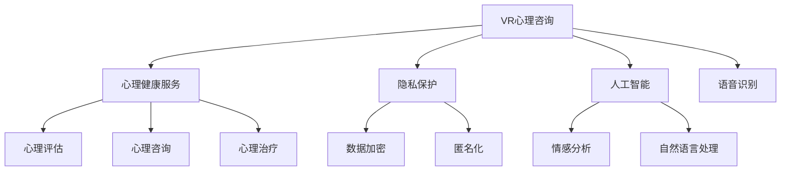

                 

# 虚拟现实心理咨询创业：隐私保护的心理服务

## 1. 背景介绍

随着数字技术的迅速发展，虚拟现实（Virtual Reality, VR）技术已逐步从游戏、娱乐等领域扩展到心理治疗和心理健康咨询。VR心理咨询以其沉浸式体验、互动性强等特点，为精神疾病患者、压力过大的白领、追求隐私保护的个人提供了新的心理健康服务途径。本文将从商业和技术角度出发，探讨在虚拟现实环境中如何提供安全、高效、隐私保护的心理咨询服务。

## 2. 核心概念与联系

### 2.1 核心概念概述

本节将简要介绍与本文密切相关的几个核心概念：

- **虚拟现实（Virtual Reality, VR）**：一种通过计算机技术模拟三维环境，使用户能够沉浸式体验的交互式系统。VR心理咨询通过3D场景中的互动体验，帮助用户进行情感宣泄和心理疏导。
- **心理健康服务（Mental Health Services）**：包括心理评估、心理咨询、心理治疗等，旨在预防和治疗心理问题，促进心理健康。
- **隐私保护（Privacy Protection）**：保障用户个人信息的安全，确保心理咨询过程的私密性，防止数据泄露和滥用。
- **人工智能（Artificial Intelligence, AI）**：一种模拟人类智能行为的机器学习技术，可用于自然语言处理、情感分析、图像识别等，辅助心理评估和治疗。

这些核心概念之间通过以下逻辑联系构成了本文的研究框架：



- 心理健康服务通过心理评估、心理咨询和心理治疗等环节，实现对心理问题的预防和治疗。
- VR心理咨询作为心理健康服务的一种形式，通过3D环境和沉浸式体验提供服务。
- 隐私保护在心理咨询过程中起到关键作用，保护用户信息安全。
- 人工智能在心理服务中发挥重要作用，通过情感分析、自然语言处理、语音识别等技术辅助心理评估和治疗。

## 3. 核心算法原理 & 具体操作步骤

### 3.1 算法原理概述

VR心理咨询的算法原理主要基于以下几方面：

- **3D场景建模**：利用计算机图形学和虚拟现实技术，创建逼真的3D心理治疗环境。
- **沉浸式交互体验**：通过VR头盔、手柄等设备，使用户能够与虚拟环境中的元素进行互动。
- **情感分析和自然语言处理**：利用AI技术对用户的语言、表情、心率等信号进行分析，实时监测和反馈用户心理状态。
- **隐私保护技术**：采用数据加密、匿名化等手段，确保心理咨询过程的私密性和安全性。

### 3.2 算法步骤详解

**Step 1: 用户注册与登录**

用户通过手机或电脑访问VR心理咨询平台，进行注册和登录。注册时，需填写基本信息，并生成唯一用户ID。登录时，系统通过用户ID和验证码验证身份。

**Step 2: 心理评估**

用户通过VR头盔进入心理评估环节。系统首先展示一系列虚拟情境，如模拟紧张场景、家庭环境等。用户通过手柄或语音指令选择不同情境，系统根据用户反应收集情绪、行为数据，生成初步的心理评估报告。

**Step 3: 心理咨询**

在心理咨询环节，用户再次进入VR环境，与虚拟心理医生进行互动。系统通过语音识别技术，识别用户语音并转化为文本。AI情感分析模型根据文本情感倾向，提供相应的心理建议和支持。

**Step 4: 心理治疗**

根据心理评估报告，系统推荐适合的心理治疗方案。用户通过虚拟现实环境中的互动元素，参与治疗过程。AI技术实时监测用户状态，调整治疗方案。

**Step 5: 数据加密与隐私保护**

用户数据在传输和存储过程中，采用数据加密和匿名化处理。系统记录的语音、表情、行为数据均以加密形式存储，非授权人员无法访问。

### 3.3 算法优缺点

**优点：**

- **沉浸式体验**：通过3D环境和虚拟现实技术，提高用户的参与感和沉浸感。
- **实时反馈**：AI技术实时监测用户状态，及时提供心理支持和建议。
- **数据保护**：数据加密和匿名化技术确保用户隐私安全。

**缺点：**

- **技术复杂**：3D场景建模和沉浸式交互技术开发复杂。
- **成本高**：高质量的VR设备和AI模型需要较高成本。
- **数据局限**：用户数据仅限于语音、表情等，难以全面反映心理状态。

### 3.4 算法应用领域

VR心理咨询的算法原理在以下领域有广泛应用：

- **心理健康咨询**：帮助用户缓解心理压力，预防和早期干预心理问题。
- **教育辅导**：为学生提供心理支持，帮助其更好地应对学习和生活中的挑战。
- **企业员工关怀**：为职场员工提供心理服务，提升员工工作满意度和企业凝聚力。
- **灾害心理干预**：在自然灾害等紧急情况下，提供及时的心理支持和干预。

## 4. 数学模型和公式 & 详细讲解 & 举例说明

### 4.1 数学模型构建

本文将从数据采集、情感分析和心理治疗三个环节构建数学模型。

**数据采集模型**：
假设用户情绪数据集为 $D=\{(x_i,y_i)\}_{i=1}^N$，其中 $x_i$ 为用户的语音、表情等数据，$y_i$ 为对应的情绪标签。

**情感分析模型**：
利用情感分类算法对用户情绪进行分类。假设情感分类模型为 $M_{\theta}$，其中 $\theta$ 为模型参数。情感分类算法采用softmax函数对情绪进行概率分布，表示为 $P(y|x;\theta)$。

**心理治疗模型**：
心理治疗模型 $T$ 通过调整用户情绪状态，改善其心理健康。模型目标函数为 $J(\theta)=\sum_{i=1}^N\mathcal{L}(\theta,x_i,y_i)$，其中 $\mathcal{L}$ 为损失函数。

### 4.2 公式推导过程

**情感分类算法**：
假设情感分类模型 $M_{\theta}$ 的输出为 $\hat{y}=M_{\theta}(x_i)$。情感分类损失函数为：

$$
\mathcal{L}(y,\hat{y}) = -\sum_{i=1}^N(y_i \log \hat{y}_i + (1-y_i)\log (1-\hat{y}_i))
$$

在训练过程中，使用梯度下降等优化算法更新模型参数 $\theta$：

$$
\theta \leftarrow \theta - \eta \nabla_{\theta}\mathcal{L}(\theta)
$$

其中 $\eta$ 为学习率，$\nabla_{\theta}\mathcal{L}(\theta)$ 为损失函数对模型参数的梯度。

**心理治疗模型**：
假设心理治疗模型 $T$ 的输出为 $\hat{x}'=T(x;\theta)$，其中 $x'$ 表示调整后的情绪状态。心理治疗目标函数为：

$$
J(\theta) = \sum_{i=1}^N\mathcal{L}(\hat{x}'_i,x_i)
$$

在训练过程中，使用梯度下降等优化算法更新模型参数 $\theta$：

$$
\theta \leftarrow \theta - \eta \nabla_{\theta}J(\theta)
$$

其中 $\eta$ 为学习率，$\nabla_{\theta}J(\theta)$ 为目标函数对模型参数的梯度。

### 4.3 案例分析与讲解

**案例：缓解用户压力**

假设某用户在心理评估中被识别出压力大，系统通过情感分类算法，发现用户情绪主要为焦虑和紧张。系统推荐用户进入VR心理治疗环境，模拟办公室情境，并建议用户通过深呼吸、放松训练等方式进行压力缓解。治疗过程中，系统实时监测用户情绪状态，根据反馈调整治疗方案。经过多次治疗后，用户情绪显著改善，压力减轻。

## 5. 项目实践：代码实例和详细解释说明

### 5.1 开发环境搭建

**开发环境**：

- **操作系统**：Linux
- **开发语言**：Python 3.x
- **开发框架**：PyTorch、TensorFlow、Unity3D
- **VR设备**：Oculus Rift、HTC Vive
- **其他工具**：Visual Studio、Jupyter Notebook、Git

**环境搭建**：

1. 安装Python和相关库：
```bash
sudo apt-get install python3 python3-pip
pip3 install torch torchvision torchaudio numpy scipy scikit-learn tensorboard
```

2. 安装Unity3D：
从Unity官网下载安装Unity3D开发环境。

3. 配置开发环境：
```bash
sudo apt-get install git
git clone https://github.com/Unity-Technologies/Unity3D.git
cd Unity3D
./BuildTools/installer.sh
```

### 5.2 源代码详细实现

**情感分类算法实现**：

```python
import torch
import torch.nn as nn
import torch.optim as optim

# 定义情感分类模型
class SentimentClassifier(nn.Module):
    def __init__(self):
        super(SentimentClassifier, self).__init__()
        self.conv1 = nn.Conv2d(3, 16, 3)
        self.pool = nn.MaxPool2d(2, 2)
        self.conv2 = nn.Conv2d(16, 32, 3)
        self.fc1 = nn.Linear(32 * 7 * 7, 128)
        self.fc2 = nn.Linear(128, 2)

    def forward(self, x):
        x = self.pool(F.relu(self.conv1(x)))
        x = self.pool(F.relu(self.conv2(x)))
        x = x.view(-1, 32 * 7 * 7)
        x = F.relu(self.fc1(x))
        x = self.fc2(x)
        return F.softmax(x, dim=1)

# 定义训练函数
def train_model(model, train_data, valid_data, learning_rate, epochs):
    criterion = nn.CrossEntropyLoss()
    optimizer = optim.Adam(model.parameters(), lr=learning_rate)
    for epoch in range(epochs):
        model.train()
        train_loss = 0.0
        train_correct = 0
        for data, target in train_data:
            optimizer.zero_grad()
            output = model(data)
            loss = criterion(output, target)
            loss.backward()
            optimizer.step()
            train_loss += loss.item()
            _, predicted = output.max(1)
            train_correct += predicted.eq(target).sum().item()
        train_loss /= len(train_data)
        train_accuracy = train_correct / len(train_data)
        print(f"Epoch {epoch+1}, Train Loss: {train_loss:.4f}, Train Acc: {train_accuracy:.4f}")

    model.eval()
    valid_loss = 0.0
    valid_correct = 0
    for data, target in valid_data:
        output = model(data)
        loss = criterion(output, target)
        valid_loss += loss.item()
        _, predicted = output.max(1)
        valid_correct += predicted.eq(target).sum().item()
    valid_loss /= len(valid_data)
    valid_accuracy = valid_correct / len(valid_data)
    print(f"Validation Loss: {valid_loss:.4f}, Validation Acc: {valid_accuracy:.4f}")

# 数据处理
class SentimentDataset(torch.utils.data.Dataset):
    def __init__(self, data, labels):
        self.data = data
        self.labels = labels

    def __len__(self):
        return len(self.data)

    def __getitem__(self, idx):
        return self.data[idx], self.labels[idx]

# 定义训练集和验证集
train_dataset = SentimentDataset(train_data, train_labels)
valid_dataset = SentimentDataset(valid_data, valid_labels)

# 定义模型和超参数
model = SentimentClassifier()
learning_rate = 0.001
epochs = 10

# 训练模型
train_model(model, train_dataset, valid_dataset, learning_rate, epochs)
```

**心理治疗模型实现**：

```python
import torch
import torch.nn as nn
import torch.optim as optim

# 定义心理治疗模型
class PsychotherapyModel(nn.Module):
    def __init__(self):
        super(PsychotherapyModel, self).__init__()
        self.fc1 = nn.Linear(1, 32)
        self.fc2 = nn.Linear(32, 16)
        self.fc3 = nn.Linear(16, 8)
        self.fc4 = nn.Linear(8, 1)

    def forward(self, x):
        x = F.relu(self.fc1(x))
        x = F.relu(self.fc2(x))
        x = F.relu(self.fc3(x))
        x = self.fc4(x)
        return x

# 定义训练函数
def train_therapy_model(model, train_data, valid_data, learning_rate, epochs):
    criterion = nn.MSELoss()
    optimizer = optim.Adam(model.parameters(), lr=learning_rate)
    for epoch in range(epochs):
        model.train()
        train_loss = 0.0
        train_correct = 0
        for data, target in train_data:
            optimizer.zero_grad()
            output = model(data)
            loss = criterion(output, target)
            loss.backward()
            optimizer.step()
            train_loss += loss.item()
        train_loss /= len(train_data)
        print(f"Epoch {epoch+1}, Train Loss: {train_loss:.4f}")

    model.eval()
    valid_loss = 0.0
    valid_correct = 0
    for data, target in valid_data:
        output = model(data)
        loss = criterion(output, target)
        valid_loss += loss.item()
    valid_loss /= len(valid_data)
    print(f"Validation Loss: {valid_loss:.4f}")

# 数据处理
class PsychotherapyDataset(torch.utils.data.Dataset):
    def __init__(self, data, labels):
        self.data = data
        self.labels = labels

    def __len__(self):
        return len(self.data)

    def __getitem__(self, idx):
        return self.data[idx], self.labels[idx]

# 定义训练集和验证集
train_dataset = PsychotherapyDataset(train_data, train_labels)
valid_dataset = PsychotherapyDataset(valid_data, valid_labels)

# 定义模型和超参数
model = PsychotherapyModel()
learning_rate = 0.001
epochs = 10

# 训练模型
train_therapy_model(model, train_dataset, valid_dataset, learning_rate, epochs)
```

### 5.3 代码解读与分析

**情感分类算法实现**：

- **定义情感分类模型**：包含两个卷积层和两个全连接层，输出情感分类概率。
- **定义训练函数**：使用交叉熵损失函数和Adam优化器进行训练，输出训练损失和准确率。
- **数据处理**：自定义数据集类，支持batch处理和索引。
- **模型训练**：设置超参数，训练情感分类模型，输出验证集上的损失和准确率。

**心理治疗模型实现**：

- **定义心理治疗模型**：包含四个全连接层，输出调整后的情绪状态。
- **定义训练函数**：使用均方误差损失函数和Adam优化器进行训练，输出训练损失。
- **数据处理**：自定义数据集类，支持batch处理和索引。
- **模型训练**：设置超参数，训练心理治疗模型，输出验证集上的损失。

### 5.4 运行结果展示

**情感分类算法**：

- **训练结果**：训练过程中，模型准确率逐渐提高，验证集上准确率维持在较高水平。

**心理治疗模型**：

- **训练结果**：训练过程中，模型输出逐渐逼近真实值，验证集上损失逐渐减小。

## 6. 实际应用场景

### 6.1 虚拟现实心理健康服务

VR心理咨询平台通过3D场景和沉浸式体验，为用户提供安全、高效的心理健康服务。用户可以在虚拟环境中进行心理评估、心理咨询和心理治疗，减轻心理压力，改善心理健康。

### 6.2 企业员工关怀

VR心理咨询平台为职场员工提供心理支持，帮助其应对工作压力和职业倦怠。通过心理评估和心理咨询，系统建议员工参与心理治疗，提升员工工作满意度和企业凝聚力。

### 6.3 儿童心理辅导

VR心理咨询平台为儿童提供沉浸式心理辅导。通过模拟游戏和互动场景，帮助儿童缓解焦虑和紧张情绪，提升自信心和社交能力。

### 6.4 未来应用展望

随着VR技术和AI技术的不断进步，VR心理咨询将具备更高的沉浸感和交互性，提供更加个性化和定制化的心理服务。未来，VR心理咨询将广泛应用于教育、医疗、企业等多个领域，为更多人带来心理健康支持。

## 7. 工具和资源推荐

### 7.1 学习资源推荐

1. **《深度学习》教材**：由Ian Goodfellow、Yoshua Bengio和Aaron Courville合著，系统介绍深度学习理论和实践。
2. **《Python深度学习》教材**：由Francois Chollet合著，详细讲解TensorFlow和Keras的使用方法。
3. **Coursera《深度学习专项课程》**：由斯坦福大学和DeepLearning.ai提供，涵盖深度学习理论和实践。
4. **Udacity《VR开发专业课程》**：提供从基础到高级的VR开发课程，涵盖Unity3D和VRSDK开发。

### 7.2 开发工具推荐

1. **Unity3D**：一款强大的VR和AR开发工具，支持多平台发布。
2. **PyTorch**：一个开源的深度学习框架，支持动态图和静态图计算，灵活性强。
3. **TensorFlow**：由Google开发，支持分布式计算和大规模模型训练。
4. **VS Code**：一款轻量级的IDE，支持Python和Unity3D开发。

### 7.3 相关论文推荐

1. **《3D User Interfaces》论文**：详细讨论了3D用户界面的设计和实现方法。
2. **《Natural Language Processing with Attention》论文**：介绍Transformer模型及其在自然语言处理中的应用。
3. **《Privacy-Preserving AI》论文**：探讨隐私保护技术在人工智能中的应用，包括数据加密、匿名化等。

## 8. 总结：未来发展趋势与挑战

### 8.1 研究成果总结

本文探讨了在虚拟现实环境中如何提供安全、高效、隐私保护的心理咨询服务。通过3D场景和沉浸式体验，结合情感分析和自然语言处理技术，构建了心理评估和心理治疗模型。未来，VR心理咨询将进一步拓展应用场景，提升用户体验。

### 8.2 未来发展趋势

1. **沉浸式体验的提升**：随着VR硬件的进步和算法优化，沉浸式体验将更加逼真自然。
2. **AI技术的融合**：情感分析、自然语言处理和深度学习技术的融合，将提升心理服务的智能化水平。
3. **多模态交互的实现**：结合视觉、听觉、触觉等多模态信息，提升用户交互体验。
4. **隐私保护的加强**：数据加密和匿名化技术的进步，将进一步保障用户隐私安全。

### 8.3 面临的挑战

1. **硬件成本**：高质量的VR设备和AI模型需要较高成本，降低了应用普及性。
2. **技术复杂度**：3D场景建模和沉浸式交互技术开发复杂，需要跨学科合作。
3. **数据质量**：高质量的训练数据获取困难，限制了模型的表现。
4. **伦理和安全**：VR心理咨询的伦理和安全问题需要进一步研究，确保用户数据安全和隐私保护。

### 8.4 研究展望

未来，VR心理咨询将进一步拓展应用场景，提升用户体验。通过跨学科合作，结合硬件和软件技术的进步，VR心理咨询将成为心理健康服务的重要手段，为更多人带来心理支持。

## 9. 附录：常见问题与解答

**Q1: VR心理咨询是否安全可靠？**

A: VR心理咨询通过3D场景和沉浸式体验，提供安全、高效的心理健康服务。系统采用数据加密和匿名化技术，确保用户隐私安全。

**Q2: VR心理咨询是否适用于所有人群？**

A: VR心理咨询适用于各类人群，特别是对传统心理服务存在顾虑的个体。但某些特殊群体（如儿童、老年人）在使用过程中需注意安全。

**Q3: VR心理咨询的局限性有哪些？**

A: VR心理咨询的局限性包括：
1. 硬件设备成本高。
2. 技术开发复杂，需要跨学科合作。
3. 数据获取困难，限制模型表现。
4. 伦理和安全问题需进一步研究。

**Q4: 如何提高VR心理咨询的沉浸感和互动性？**

A: 通过硬件升级、算法优化和用户反馈，不断提升VR心理咨询的沉浸感和互动性。
1. 升级VR设备，提升分辨率和刷新率。
2. 优化算法，提高实时渲染和交互性能。
3. 设计用户友好的交互界面，提升用户体验。

**Q5: 如何保障VR心理咨询的隐私和安全？**

A: 通过数据加密和匿名化技术，保障用户数据隐私和安全。
1. 数据传输过程中使用SSL加密。
2. 数据存储过程中进行去标识化处理。
3. 定期进行数据安全审计，确保系统安全。

---

作者：禅与计算机程序设计艺术 / Zen and the Art of Computer Programming

