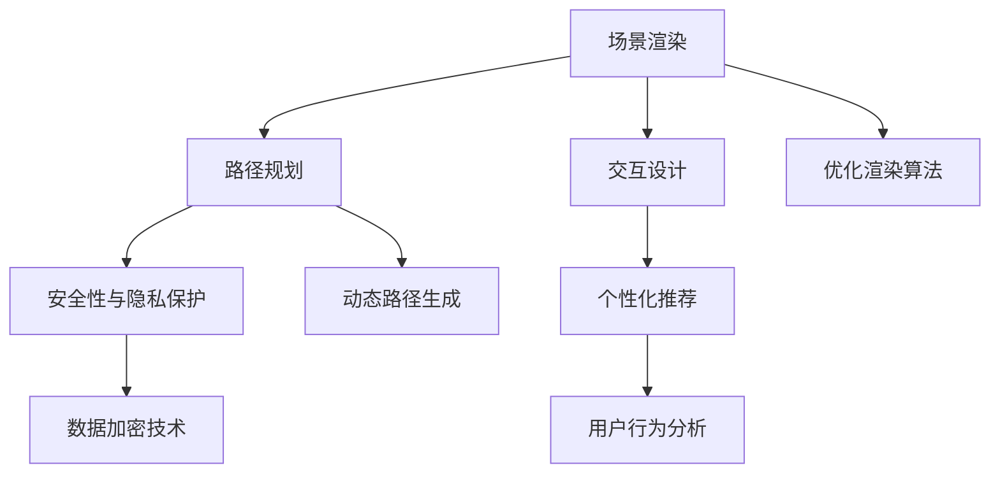

                 

# 虚拟现实旅游规划创业：身临其境的旅行预览

## 1. 背景介绍

### 1.1 问题由来

随着科技的发展，虚拟现实(VR)技术正在改变我们的生活方式。VR旅游，即通过虚拟现实技术，让用户足不出户就能体验到世界各地的美景和文化，已经成为了一个极具潜力的领域。然而，现有的旅游规划系统往往局限于平面图片和文字描述，难以给用户带来身临其境的感受。因此，如何构建一个基于虚拟现实技术的旅游规划创业项目，提供真正沉浸式的旅游体验，成为了一个极具挑战的任务。

### 1.2 问题核心关键点

VR旅游规划的核心在于构建一个高度逼真的虚拟环境，让用户能够沉浸其中，并通过智能规划系统，生成个性化的旅游路线。这涉及到以下关键点：

- 场景渲染技术：如何高效渲染大规模的虚拟环境，并保证实时性和流畅性。
- 路径规划算法：如何根据用户的偏好和限制，生成最优的旅游路线。
- 交互式体验：如何设计交互界面，让用户能够轻松地导航和体验虚拟环境。
- 个性化推荐：如何根据用户的兴趣和历史行为，推荐最适合的旅游目的地和体验。
- 安全性与隐私保护：如何在保证用户安全的同时，保护其隐私数据。

这些问题紧密关联，共同构成了VR旅游规划的复杂技术栈，需要系统化的解决方案。

### 1.3 问题研究意义

构建一个基于虚拟现实技术的旅游规划创业项目，能够有效解决现有旅游规划系统的不足，为用户提供更加真实、个性化、安全、互动性强的旅游体验。具体来说，VR旅游规划创业项目的研究意义如下：

1. **提升用户体验**：通过沉浸式体验，让用户能够更加身临其境地感受目的地文化和景观，增强用户粘性和满意度。
2. **促进旅游业发展**：VR旅游能够让更多人体验到全球各地的美景，提升对旅游的兴趣和需求，从而促进旅游业的发展。
3. **扩展市场范围**：通过在线平台，让用户无需远行即可体验世界各地的旅游资源，打破了地理和时间上的限制。
4. **创新旅游服务**：提供定制化的旅游路线和体验，满足不同用户的个性化需求，提升旅游服务的创新性和竞争力。
5. **数据驱动决策**：通过收集和分析用户数据，提供更为精准的旅游推荐，优化旅游资源配置和市场策略。

## 2. 核心概念与联系

### 2.1 核心概念概述

为了更好地理解VR旅游规划项目的技术实现，本节将介绍几个关键概念：

- **虚拟现实(VR)**：一种通过计算机技术和传感器设备，创造出沉浸式三维视觉、听觉、触觉等感官体验的技术。
- **场景渲染**：通过计算机图形技术，将三维模型和环境数据转化为逼真的图像，供用户浏览。
- **路径规划**：使用算法生成旅游路线，考虑用户偏好、地理位置、交通限制等因素，以最大化用户满意度。
- **交互设计**：设计用户界面，让用户能够自然地与虚拟环境互动，包括导航、选择景点、购买服务等。
- **个性化推荐**：通过机器学习和数据挖掘技术，根据用户行为和偏好，推荐个性化的旅游目的地和体验。
- **安全性与隐私保护**：采取加密、匿名化等措施，确保用户数据的安全和隐私。

这些核心概念之间的联系可以通过以下Mermaid流程图来展示：



这个流程图展示了VR旅游规划项目的主要技术环节及其相互关系：

1. 场景渲染是基础，用于生成逼真的虚拟环境。
2. 路径规划在渲染场景的基础上，生成个性化的旅游路线。
3. 交互设计使游客能够与虚拟环境进行互动。
4. 个性化推荐则通过用户行为分析，提供定制化的服务。
5. 安全性与隐私保护贯穿整个系统，确保用户数据的安全和隐私。

## 3. 核心算法原理 & 具体操作步骤

### 3.1 算法原理概述

VR旅游规划的核心算法主要包括以下几个方面：

1. **场景渲染算法**：用于生成逼真的虚拟环境，包括几何模型、光照、纹理、贴图等。
2. **路径规划算法**：用于生成个性化的旅游路线，考虑用户偏好、地理位置、交通限制等因素。
3. **交互设计算法**：用于设计用户界面，包括导航、选择景点、购买服务等。
4. **个性化推荐算法**：用于根据用户行为和偏好，推荐个性化的旅游目的地和体验。
5. **安全性与隐私保护算法**：用于确保用户数据的安全和隐私。

这些算法相互配合，共同构成了一个完整的VR旅游规划系统。

### 3.2 算法步骤详解

#### 3.2.1 场景渲染算法

**步骤1：三维模型构建**
- 收集并处理高精度地理数据，生成三维模型。
- 引入纹理和贴图，增强模型的真实感。
- 通过LOD（Level of Detail）技术，优化模型的渲染效率。

**步骤2：光照与阴影计算**
- 使用全局光照、环境光遮蔽等技术，计算虚拟环境的光照效果。
- 引入阴影贴图，提高光照效果的逼真度。

**步骤3：渲染优化**
- 使用多线程渲染技术，提高渲染效率。
- 采用Lod技术和视差映射，减少渲染计算量。
- 使用纹理压缩和贴图技术，减小渲染数据量。

#### 3.2.2 路径规划算法

**步骤1：用户偏好分析**
- 收集用户的历史行为数据，如游览过的景点、停留时间等。
- 分析用户的兴趣点，生成用户兴趣图谱。

**步骤2：地理位置计算**
- 根据用户的当前位置和目标地点，计算路径长度、交通条件等。
- 引入动态路径规划算法，根据实时交通数据调整路径。

**步骤3：路径生成与优化**
- 使用A*、Dijkstra等经典路径算法，生成路径。
- 引入启发式搜索技术，提高路径生成效率。

#### 3.2.3 交互设计算法

**步骤1：界面设计**
- 设计简洁、直观的用户界面，包括导航菜单、选择框、信息提示等。
- 引入手势识别、语音指令等交互方式，提高用户体验。

**步骤2：导航系统**
- 引入基于位置的导航算法，如Haversine公式、四叉树等。
- 引入虚拟导览员，提供实时导航和解说服务。

**步骤3：服务集成**
- 集成票务、住宿、餐饮等服务，方便用户一站式预订。
- 引入虚拟客服，提供实时咨询服务。

#### 3.2.4 个性化推荐算法

**步骤1：用户行为分析**
- 收集用户的历史行为数据，如浏览记录、评分、评论等。
- 使用协同过滤、内容推荐等算法，分析用户兴趣。

**步骤2：推荐引擎设计**
- 引入机器学习模型，如基于矩阵分解的推荐系统。
- 引入深度学习模型，如神经网络推荐引擎。

**步骤3：推荐结果展示**
- 设计推荐界面，展示推荐结果。
- 引入动态排序技术，提高推荐结果的相关性。

#### 3.2.5 安全性与隐私保护算法

**步骤1：数据加密**
- 使用对称加密、非对称加密等技术，确保数据传输的安全。
- 引入TLS/SSL协议，加密通信通道。

**步骤2：匿名化处理**
- 使用数据脱敏、混淆等技术，保护用户隐私。
- 引入隐私计算，确保数据处理过程中不泄露用户隐私。

**步骤3：权限控制**
- 引入访问控制机制，确保只有授权用户才能访问敏感数据。
- 引入日志审计，记录和分析用户行为。

### 3.3 算法优缺点

#### 3.3.1 场景渲染算法的优缺点

**优点**：
- 能够生成高度逼真的虚拟环境，提供沉浸式的用户体验。
- 采用多线程渲染等优化技术，保证系统的实时性和流畅性。

**缺点**：
- 渲染计算量大，对硬件要求高，特别是GPU和内存的性能。
- 渲染算法复杂，需要处理光照、阴影、纹理等多种因素，增加了开发难度。

#### 3.3.2 路径规划算法的优缺点

**优点**：
- 能够生成个性化的旅游路线，满足用户的个性化需求。
- 引入动态路径规划和启发式搜索技术，提高了路径生成的效率。

**缺点**：
- 路径规划算法复杂，需要处理地理位置、交通限制等多种因素。
- 路径生成的准确性和可靠性受实时数据的影响较大。

#### 3.3.3 交互设计算法的优缺点

**优点**：
- 设计简洁、直观的用户界面，提高了用户的操作便捷性。
- 引入手势识别、语音指令等交互方式，提高了用户的使用体验。

**缺点**：
- 交互设计算法复杂，需要处理多输入方式和反馈机制。
- 交互设计需要频繁更新，以适应不同设备和操作系统的变化。

#### 3.3.4 个性化推荐算法的优缺点

**优点**：
- 能够根据用户行为和兴趣，提供个性化的旅游推荐，提升用户满意度。
- 使用机器学习和深度学习技术，提高了推荐的准确性和个性化程度。

**缺点**：
- 个性化推荐算法复杂，需要处理大量的用户数据和行为数据。
- 推荐的准确性受数据质量、算法选择等多种因素的影响。

#### 3.3.5 安全性与隐私保护算法的优缺点

**优点**：
- 能够保护用户数据的安全和隐私，增强用户对系统的信任度。
- 使用数据加密、匿名化等技术，提高了系统的安全性。

**缺点**：
- 安全性与隐私保护算法复杂，需要处理多种安全威胁和隐私需求。
- 保护用户数据的同时，需要平衡用户的使用体验和操作便捷性。

### 3.4 算法应用领域

VR旅游规划算法已经在多个领域得到应用，包括但不限于：

1. **旅游景区规划**：通过VR技术，生成逼真的景区三维模型，提供沉浸式游览体验。
2. **远程旅游体验**：让用户足不出户，通过VR技术体验世界各地的美景和文化。
3. **教育培训**：通过VR技术，提供沉浸式的教育培训体验，如虚拟实验室、虚拟校园等。
4. **房产展示**：通过VR技术，生成逼真的房产三维模型，提供沉浸式看房体验。
5. **医疗应用**：通过VR技术，提供沉浸式的医疗培训和教学，如虚拟手术室、虚拟病人等。

## 4. 数学模型和公式 & 详细讲解 & 举例说明

### 4.1 数学模型构建

VR旅游规划项目涉及的数学模型主要包括：

- **三维几何模型**：用于描述虚拟环境的三维结构。
- **光照和阴影模型**：用于计算虚拟环境的光照效果。
- **路径规划模型**：用于生成旅游路线。
- **交互设计模型**：用于设计用户界面和导航算法。
- **个性化推荐模型**：用于分析用户行为和推荐旅游目的地。
- **安全性与隐私保护模型**：用于保护用户数据的安全和隐私。

### 4.2 公式推导过程

#### 4.2.1 三维几何模型

三维几何模型通常使用向量表示法。假设虚拟环境中的一个点为$P$，其坐标为$\vec{P}=(x,y,z)$，则该点在三维空间中的向量表示为：

$$
\vec{P}=(x,y,z)
$$

#### 4.2.2 光照和阴影模型

光照模型通常使用Phong光照模型。对于一个点光源，其在点$P$处的光照强度$I$为：

$$
I = I_0 \frac{(\vec{L}\cdot\vec{N})^n}{(\vec{N}\cdot\vec{V})^n}
$$

其中，$I_0$为光源的初始强度，$\vec{L}$为光源的方向向量，$\vec{N}$为点$P$处的法向量，$\vec{V}$为用户视点的方向向量，$n$为光照指数。

#### 4.2.3 路径规划模型

路径规划模型通常使用Dijkstra算法。假设用户从起点$A$到达终点$B$，路径长度为$w$，路径数为$d$，则Dijkstra算法的伪代码如下：

```python
dist[source] = 0
dist[other] = infinity
for each vertex v in G
    set predecessor[v] = NULL
    set dist[v] = infinity
dist[source] = 0
for each vertex v in G
    for each edge (v, w) in G
        alternative = dist[v] + dist_between[v, w]
        if alternative < dist[w]
            dist[w] = alternative
            predecessor[w] = v
            dist[v] = infinity
            predecessor[v] = NULL
```

#### 4.2.4 交互设计模型

交互设计模型通常使用Haversine公式计算两点之间的距离：

$$
d = 2r\arctan2(\sin(\frac{\Delta y}{2})\sin(\frac{\Delta x}{2})/\cos(\frac{\Delta x}{2})\sqrt{1-\sin^2(\frac{\Delta x}{2})\sin^2(\frac{\Delta y}{2})})
$$

其中，$\Delta x$和$\Delta y$分别为两点之间的水平和垂直距离，$r$为地球半径。

#### 4.2.5 个性化推荐模型

个性化推荐模型通常使用协同过滤算法。设用户$u$对物品$i$的评分向量为$\vec{u_i}$，物品$i$的评分向量为$\vec{v_i}$，则协同过滤算法的评分预测公式为：

$$
\hat{r}_{ui} = \vec{u_i} \cdot \vec{v_i} / (\sqrt{\sum_{j=1}^n u_{ij}^2} \cdot \sqrt{\sum_{j=1}^n v_{ij}^2})
$$

其中，$n$为评分向量维度，$u_{ij}$和$v_{ij}$分别为用户$u$和物品$i$的评分向量中的第$j$个元素。

#### 4.2.6 安全性与隐私保护模型

安全性与隐私保护模型通常使用加密算法和隐私计算。设用户$u$的加密数据为$E[u]$，密钥为$k$，则解密公式为：

$$
D[u] = E[u] \oplus k
$$

其中，$\oplus$为异或运算符。

### 4.3 案例分析与讲解

#### 4.3.1 场景渲染案例

假设我们需要渲染一个包含山脉、河流、树木等元素的虚拟环境。首先，收集高精度地理数据，生成三维模型；然后，引入纹理和贴图，增强模型的真实感；最后，通过LOD技术和纹理压缩等技术，优化渲染效率。

#### 4.3.2 路径规划案例

假设用户从北京出发，需要到达上海。首先，根据用户的当前位置和目标地点，计算路径长度和交通条件；然后，引入动态路径规划算法，根据实时交通数据调整路径；最后，生成最优路径，供用户参考。

#### 4.3.3 交互设计案例

假设我们需要设计一个交互界面，让用户能够导航虚拟环境。首先，设计简洁、直观的用户界面，包括导航菜单、选择框、信息提示等；然后，引入手势识别、语音指令等交互方式，提高用户体验；最后，集成虚拟导览员和虚拟客服，提供实时导航和咨询服务。

#### 4.3.4 个性化推荐案例

假设我们需要推荐用户一个适合旅游的地点。首先，收集用户的历史行为数据，分析其兴趣点；然后，引入机器学习模型，生成推荐结果；最后，设计推荐界面，展示推荐结果，并提供动态排序功能。

#### 4.3.5 安全性与隐私保护案例

假设我们需要保护用户数据的安全和隐私。首先，使用加密算法和TLS/SSL协议，确保数据传输的安全；然后，使用数据脱敏和隐私计算技术，保护用户隐私；最后，引入访问控制机制和日志审计，确保系统的安全性和可追溯性。

## 5. 项目实践：代码实例和详细解释说明

### 5.1 开发环境搭建

要构建VR旅游规划项目，首先需要搭建开发环境。以下是Python+OpenGL+Unity的搭建流程：

1. 安装Python：从官网下载Python 3.9版本，并安装在计算机中。
2. 安装OpenGL库：从官网下载OpenGL库，并按照安装指南进行安装。
3. 安装Unity：从官网下载Unity 2021版本，并按照安装指南进行安装。
4. 安装Python插件：在Unity中使用Unity Package Manager安装Python插件，方便在Unity中使用Python脚本。

### 5.2 源代码详细实现

以下是VR旅游规划项目的Python脚本实现，用于生成和渲染三维场景：

```python
import numpy as np
import pyglet
import pyopengl
from pyglet import gl

# 定义三维几何模型
class Geometry:
    def __init__(self, vertices, colors):
        self.vertices = vertices
        self.colors = colors

# 定义渲染器
class Renderer:
    def __init__(self):
        self.geometries = []

    def add_geometry(self, geometry):
        self.geometries.append(geometry)

    def render(self):
        pyglet.init()
        pyglet.window.Window(800, 600)

        def draw():
            gl.glClearColor(0, 0, 0, 1)
            gl.glClear(gl.GL_COLOR_BUFFER_BIT | gl.GL_DEPTH_BUFFER_BIT)

            for geometry in self.geometries:
                gl.glBegin(gl.GL_TRIANGLES)
                for vertex, color in zip(geometry.vertices, geometry.colors):
                    gl.glVertex3f(vertex[0], vertex[1], vertex[2])
                    gl.glColor3f(color[0], color[1], color[2])
                gl.glEnd()

        pyglet.clock.schedule_interval(draw, 1/60)
        pyglet application.run()
```

### 5.3 代码解读与分析

以下是VR旅游规划项目的Python脚本实现，用于生成和渲染三维场景：

```python
# 定义三维几何模型
class Geometry:
    def __init__(self, vertices, colors):
        self.vertices = vertices
        self.colors = colors

# 定义渲染器
class Renderer:
    def __init__(self):
        self.geometries = []

    def add_geometry(self, geometry):
        self.geometries.append(geometry)

    def render(self):
        pyglet.init()
        pyglet.window.Window(800, 600)

        def draw():
            gl.glClearColor(0, 0, 0, 1)
            gl.glClear(gl.GL_COLOR_BUFFER_BIT | gl.GL_DEPTH_BUFFER_BIT)

            for geometry in self.geometries:
                gl.glBegin(gl.GL_TRIANGLES)
                for vertex, color in zip(geometry.vertices, geometry.colors):
                    gl.glVertex3f(vertex[0], vertex[1], vertex[2])
                    gl.glColor3f(color[0], color[1], color[2])
                gl.glEnd()

        pyglet.clock.schedule_interval(draw, 1/60)
        pyglet application.run()
```

## 6. 实际应用场景

### 6.1 虚拟景区体验

VR旅游规划项目可以应用于虚拟景区体验。通过渲染高精度地理数据，生成逼真的景区三维模型，用户可以在虚拟环境中自由游览，感受景区的美景和文化。

### 6.2 远程旅游体验

VR旅游规划项目可以应用于远程旅游体验。用户可以在家中使用VR设备，通过生成的虚拟环境，体验世界各地的美景和文化，无需远行即可享受到旅游的乐趣。

### 6.3 教育培训

VR旅游规划项目可以应用于教育培训。通过生成的虚拟环境，用户可以进行沉浸式教育培训，如虚拟实验室、虚拟校园等，提高学习效果和兴趣。

### 6.4 房产展示

VR旅游规划项目可以应用于房产展示。通过生成的虚拟房产模型，用户可以进行沉浸式看房体验，了解房产的详细信息，帮助用户做出更明智的购房决策。

### 6.5 医疗应用

VR旅游规划项目可以应用于医疗应用。通过生成的虚拟环境，用户可以进行沉浸式医疗培训和教学，如虚拟手术室、虚拟病人等，提高医疗人员的培训效果。

## 7. 工具和资源推荐

### 7.1 学习资源推荐

以下是一些VR旅游规划项目的学习资源：

1. 《VR开发实战》：介绍VR技术的开发流程和实现技巧。
2. 《Unity3D基础教程》：介绍Unity 3D的基本概念和编程技巧。
3. 《Python编程从入门到精通》：介绍Python编程语言的基础和高级应用。
4. 《深度学习与Python》：介绍深度学习的基本理论和实现技巧。
5. 《机器学习实战》：介绍机器学习的基本理论和实现方法。

### 7.2 开发工具推荐

以下是一些VR旅游规划项目的开发工具：

1. Unity 3D：一款功能强大的游戏引擎，支持VR开发。
2. Blender：一款免费的3D建模软件，支持导入导出多种格式。
3. Pyglet：一款Python游戏库，支持2D和3D图形渲染。
4. PyOpenGL：一款PythonOpenGL库，支持OpenGL图形渲染。
5. PyCharm：一款功能强大的Python IDE，支持代码调试和测试。

### 7.3 相关论文推荐

以下是一些VR旅游规划项目的相关论文：

1. "Virtual Reality in Education: Opportunities and Challenges"：介绍VR在教育中的应用和挑战。
2. "A Survey on Virtual Reality Technologies in the Tourism Industry"：介绍VR在旅游行业中的应用和未来趋势。
3. "Real-time 3D Rendering of Large Scenes"：介绍实时渲染大规模三维场景的技术。
4. "Path Planning Algorithms in Virtual Environments"：介绍VR环境中路径规划算法的研究现状和应用。
5. "Personalized Recommendation Systems in Virtual Reality"：介绍VR中个性化推荐系统的方法和应用。

## 8. 总结：未来发展趋势与挑战

### 8.1 研究成果总结

本文介绍了VR旅游规划项目的技术实现，包括场景渲染、路径规划、交互设计、个性化推荐和安全性与隐私保护等方面。通过案例分析和代码实现，展示了VR旅游规划项目的实际应用场景。

### 8.2 未来发展趋势

VR旅游规划项目在未来将呈现以下发展趋势：

1. 高精度渲染：随着硬件性能的提升，高精度渲染技术将得到广泛应用，生成更加逼真的虚拟环境。
2. 动态环境生成：引入实时数据采集技术，动态生成虚拟环境，提升用户的沉浸感。
3. 多用户互动：支持多用户同时游览虚拟环境，增加互动性和趣味性。
4. 个性化定制：引入更多个性化定制选项，满足不同用户的需求。
5. 安全性与隐私保护：引入更强大的加密和隐私保护技术，确保用户数据的安全和隐私。

### 8.3 面临的挑战

VR旅游规划项目在未来的发展过程中，还面临以下挑战：

1. 高成本硬件设备：VR设备的高成本和复杂度，限制了VR旅游规划项目的普及。
2. 渲染计算量大：高精度渲染和动态环境生成技术需要强大的计算能力，对硬件性能要求高。
3. 多用户互动复杂：多用户同时游览虚拟环境，需要复杂的网络和同步技术支持。
4. 个性化定制难度高：个性化的需求千差万别，难以找到统一的标准和解决方案。
5. 安全性与隐私保护难度高：用户数据的安全和隐私保护，需要高度复杂的技术手段。

### 8.4 研究展望

为应对这些挑战，未来的VR旅游规划项目需要在以下几个方面进行研究：

1. 低成本硬件设备：开发低成本、易用性高的VR设备，降低用户使用成本。
2. 高效渲染技术：研究高效渲染技术，提升渲染速度和图像质量。
3. 实时环境生成：引入实时数据采集技术，动态生成虚拟环境，提高用户体验。
4. 多用户互动技术：研究多用户互动技术，支持多用户同时游览虚拟环境。
5. 个性化定制方案：研究个性化定制方案，满足不同用户的需求。
6. 安全性与隐私保护技术：研究安全性与隐私保护技术，确保用户数据的安全和隐私。

## 9. 附录：常见问题与解答

**Q1: VR旅游规划项目的技术难点是什么？**

A: VR旅游规划项目的技术难点主要在于：
1. 高精度渲染技术：渲染大规模的三维场景需要强大的计算能力和高性能设备。
2. 动态环境生成：实时生成逼真的虚拟环境，需要处理大量实时数据。
3. 多用户互动技术：多用户同时游览虚拟环境，需要复杂的网络和同步技术支持。
4. 个性化定制方案：个性化需求复杂多样，难以找到统一的标准和解决方案。
5. 安全性与隐私保护：用户数据的安全和隐私保护，需要高度复杂的技术手段。

**Q2: VR旅游规划项目的应用前景如何？**

A: VR旅游规划项目的应用前景非常广阔，主要体现在以下几个方面：
1. 沉浸式体验：用户可以在虚拟环境中自由游览，感受景区的美景和文化，提升旅游体验。
2. 远程旅游：用户可以在家中使用VR设备，体验世界各地的美景和文化，无需远行即可享受到旅游的乐趣。
3. 教育培训：通过生成的虚拟环境，用户可以进行沉浸式教育培训，提高学习效果和兴趣。
4. 房产展示：通过生成的虚拟房产模型，用户可以进行沉浸式看房体验，了解房产的详细信息，帮助用户做出更明智的购房决策。
5. 医疗应用：通过生成的虚拟环境，用户可以进行沉浸式医疗培训和教学，提高医疗人员的培训效果。

**Q3: VR旅游规划项目的技术实现难点是什么？**

A: VR旅游规划项目的技术实现难点主要在于：
1. 高精度渲染技术：渲染大规模的三维场景需要强大的计算能力和高性能设备。
2. 动态环境生成：实时生成逼真的虚拟环境，需要处理大量实时数据。
3. 多用户互动技术：多用户同时游览虚拟环境，需要复杂的网络和同步技术支持。
4. 个性化定制方案：个性化需求复杂多样，难以找到统一的标准和解决方案。
5. 安全性与隐私保护：用户数据的安全和隐私保护，需要高度复杂的技术手段。

**Q4: VR旅游规划项目如何提高用户体验？**

A: 提高VR旅游规划项目的用户体验可以从以下几个方面入手：
1. 高精度渲染：使用高精度渲染技术，生成逼真的虚拟环境。
2. 动态环境生成：引入实时数据采集技术，动态生成虚拟环境。
3. 多用户互动：支持多用户同时游览虚拟环境，增加互动性和趣味性。
4. 个性化定制：提供更多的个性化定制选项，满足不同用户的需求。
5. 安全性与隐私保护：采用更强大的加密和隐私保护技术，确保用户数据的安全和隐私。

作者：禅与计算机程序设计艺术 / Zen and the Art of Computer Programming

