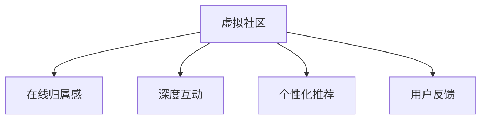

                 

# 虚拟社区构建专家：AI驱动的在线归属感营造顾问

## 1. 背景介绍

### 1.1 问题由来
在信息爆炸的互联网时代，人们的社交方式逐渐从线下面对面的互动转变为线上虚拟社区的交流。虚拟社区作为连接人与人、人与信息的重要平台，对用户的归属感和互动质量提出了更高要求。然而，由于缺乏有效的手段进行内容生成、社区运营和用户互动，许多虚拟社区难以维持活跃度和用户粘性，沦为冷冰冰的信息发布平台。

### 1.2 问题核心关键点
构建活跃的虚拟社区，关键在于如何营造良好的在线归属感。这包括：
- 用户之间的深度互动
- 社区环境的积极构建
- 个性化的内容推荐
- 及时的用户反馈与响应

本文将系统阐述AI驱动的虚拟社区构建策略，通过大数据和深度学习技术，提升虚拟社区的用户粘性和互动质量，营造一种真正的归属感。

## 2. 核心概念与联系

### 2.1 核心概念概述

为更好地理解AI驱动的虚拟社区构建方法，本节将介绍几个密切相关的核心概念：

- 虚拟社区（Virtual Community）：通过网络平台形成的一种虚拟社交空间，用户可以在其中进行交流、互动和协作。
- 在线归属感（Online Sense of Belonging）：用户在虚拟社区中感受到的与他人、环境、文化的紧密连接。
- 深度互动（Deep Engagement）：用户之间进行深入交流、合作与互助，形成稳固的社区关系网络。
- 个性化推荐（Personalized Recommendation）：根据用户兴趣和行为数据，推荐合适的社区内容，提升用户体验。
- 用户反馈（User Feedback）：用户对社区环境、互动质量、内容推荐等方面的评价和建议。

这些核心概念之间的逻辑关系可以通过以下Mermaid流程图来展示：



这个流程图展示出虚拟社区与用户之间的关系：通过深度互动、个性化推荐和用户反馈，虚拟社区营造了在线归属感。

## 3. 核心算法原理 & 具体操作步骤
### 3.1 算法原理概述

AI驱动的虚拟社区构建方法，本质上是通过数据驱动的方法，分析用户行为和偏好，优化社区内容生成和推荐策略，提升社区用户的互动质量和归属感。其核心思想是：

1. **数据驱动的用户行为分析**：通过大数据分析，挖掘用户行为模式，发现用户的兴趣点、活跃时间和互动偏好。
2. **内容生成与推荐**：基于用户行为分析结果，生成符合用户兴趣的社区内容，并通过推荐算法精准推送。
3. **互动质量优化**：通过情感分析和智能算法，优化社区互动的情感氛围和质量，提升用户的满足感和归属感。
4. **用户反馈循环**：不断收集和分析用户反馈，动态调整社区内容和运营策略，确保社区环境的持续优化。

### 3.2 算法步骤详解

AI驱动的虚拟社区构建主要包括以下几个关键步骤：

**Step 1: 数据采集与处理**

- 采集社区用户的数据，包括用户登录时间、浏览历史、互动记录等。
- 对数据进行清洗、去重和归一化处理，确保数据的准确性和完整性。

**Step 2: 用户行为分析**

- 通过机器学习模型，对用户行为数据进行建模，识别出用户的兴趣偏好、活跃时间和互动模式。
- 使用聚类算法对用户进行分组，发现具有相似兴趣和行为的用户群体。

**Step 3: 内容生成与推荐**

- 根据用户行为分析结果，生成符合用户兴趣的社区内容，如话题、帖子、活动等。
- 使用协同过滤、深度学习等推荐算法，精准推送符合用户兴趣的内容。

**Step 4: 互动质量优化**

- 对社区互动数据进行情感分析，识别用户之间的情感状态，调整社区互动策略。
- 引入智能算法，如情感计算和自然语言处理，优化社区环境，提升互动质量。

**Step 5: 用户反馈循环**

- 定期收集用户反馈，通过文本分析和情感分析，了解用户对社区环境的不满和建议。
- 根据用户反馈，动态调整社区内容和运营策略，持续优化社区环境。

### 3.3 算法优缺点

AI驱动的虚拟社区构建方法具有以下优点：
1. 数据驱动：通过大量用户行为数据，可以深入理解用户需求，提供个性化服务。
2. 智能推荐：通过算法优化，提升内容推荐精度，提升用户满意度。
3. 实时调整：可以实时收集和分析用户反馈，动态优化社区环境。

同时，该方法也存在一些局限性：
1. 数据隐私问题：大规模数据采集和处理可能涉及用户隐私问题。
2. 模型复杂度：复杂的算法模型需要较大的计算资源和时间。
3. 用户适应性：AI算法可能无法很好地适应非理性用户行为。
4. 模型泛化能力：模型可能无法很好地适应全新的社区场景。

尽管存在这些局限性，但AI驱动的虚拟社区构建方法仍是大数据时代虚拟社区运营的重要手段。未来相关研究的重点在于如何进一步提升算法的准确性和效率，同时保护用户隐私，优化用户适应性。

### 3.4 算法应用领域

AI驱动的虚拟社区构建方法已经在多个领域得到应用，例如：

- 社交媒体平台：如Facebook、Twitter等，通过推荐算法和情感分析，提升用户的互动体验。
- 在线教育平台：如Coursera、EdX等，通过个性化推荐和智能反馈，提升学习效果和用户粘性。
- 电子商务平台：如Amazon、淘宝等，通过社区互动和推荐系统，提升购物体验和用户满意度。
- 在线娱乐平台：如Netflix、Bilibili等，通过用户行为分析，定制个性化推荐，提升用户粘性和互动质量。

## 4. 数学模型和公式 & 详细讲解
### 4.1 数学模型构建

本节将使用数学语言对AI驱动的虚拟社区构建过程进行更加严格的刻画。

设虚拟社区中用户数量为 $N$，每个用户 $i$ 在社区中的活跃度为 $a_i$，兴趣向量为 $x_i \in \mathbb{R}^k$，其中 $k$ 为兴趣特征数量。设社区内容 $j$ 的向量表示为 $y_j \in \mathbb{R}^k$，社区互动数据为 $u_{ij} \in \mathbb{R}$，代表用户 $i$ 对内容 $j$ 的互动评分。设用户对社区环境的反馈为 $f_i \in \mathbb{R}$，代表用户 $i$ 对社区环境的满意度和建议。

假设用户的兴趣向量服从高斯分布，即 $x_i \sim \mathcal{N}(\mu, \Sigma)$，其中 $\mu$ 为兴趣均值，$\Sigma$ 为协方差矩阵。

社区内容 $j$ 的向量表示 $y_j$ 也服从高斯分布，即 $y_j \sim \mathcal{N}(\mu_j, \Sigma_j)$。

社区互动数据 $u_{ij}$ 服从伯努利分布，即 $u_{ij} \sim Bernoulli(p_{ij})$，其中 $p_{ij}$ 为内容 $j$ 被用户 $i$ 互动的概率。

用户反馈 $f_i$ 也服从高斯分布，即 $f_i \sim \mathcal{N}(\mu_f, \Sigma_f)$。

### 4.2 公式推导过程

基于上述模型构建，我们可以推导AI驱动虚拟社区构建的主要公式和算法步骤：

**Step 1: 用户行为分析**

使用贝叶斯算法，对用户行为数据进行建模，得到用户兴趣向量 $x_i$ 的概率分布 $P(x_i|a_i)$。

$$
P(x_i|a_i) = \frac{P(x_i)P(a_i|x_i)}{\int P(x_i)P(a_i|x_i) dx_i}
$$

其中 $P(a_i|x_i)$ 为用户行为的概率模型，可以通过历史行为数据进行训练。

**Step 2: 内容生成与推荐**

使用协同过滤算法，根据用户兴趣向量 $x_i$ 生成符合用户兴趣的内容向量 $y_j$。

$$
\hat{y}_i = \sum_{j=1}^M \alpha_{ij} y_j
$$

其中 $\alpha_{ij}$ 为相似度系数，可以通过余弦相似度等方法计算。

**Step 3: 互动质量优化**

使用情感分析算法，对社区互动数据 $u_{ij}$ 进行情感分析，得到用户之间的情感状态 $E_{ij}$。

$$
E_{ij} = \mathcal{N}(\mu_{E_{ij}}, \Sigma_{E_{ij}})
$$

使用情感计算算法，对情感状态 $E_{ij}$ 进行处理，得到互动质量 $Q_{ij}$。

$$
Q_{ij} = f(E_{ij})
$$

**Step 4: 用户反馈循环**

使用高斯回归算法，对用户反馈数据 $f_i$ 进行建模，得到用户满意度和建议的概率分布 $P(f_i|x_i)$。

$$
P(f_i|x_i) = \mathcal{N}(\mu_{f_i}, \Sigma_{f_i})
$$

使用贝叶斯网络，对用户反馈和社区环境进行动态调整，优化社区内容和互动策略。

### 4.3 案例分析与讲解

以社交媒体平台为例，我们可以具体分析AI驱动的虚拟社区构建过程：

**案例分析**：假设某社交媒体平台有数百万用户，每个用户在平台上发布和互动的帖子数量不同，兴趣点各异。平台希望通过推荐算法提升用户的互动体验，增加用户粘性。

**数据采集与处理**：平台采集用户登录时间、浏览历史、互动记录等数据，进行清洗和归一化处理，得到用户行为数据集。

**用户行为分析**：平台使用贝叶斯算法，对用户行为数据进行建模，得到用户兴趣向量 $x_i$ 的概率分布 $P(x_i|a_i)$。同时，通过协同过滤算法，生成符合用户兴趣的帖子内容 $y_j$。

**内容生成与推荐**：平台使用协同过滤算法，将符合用户兴趣的帖子内容 $y_j$ 推荐给用户 $i$，提高互动质量和用户满意度。

**互动质量优化**：平台使用情感分析算法，对用户之间的互动数据 $u_{ij}$ 进行情感分析，优化社区互动策略，提升互动质量。

**用户反馈循环**：平台定期收集用户反馈数据 $f_i$，使用高斯回归算法，对用户满意度和建议进行建模，动态调整社区内容和运营策略，优化社区环境。

## 5. 项目实践：代码实例和详细解释说明
### 5.1 开发环境搭建

在进行AI驱动的虚拟社区构建实践前，我们需要准备好开发环境。以下是使用Python进行PyTorch开发的环境配置流程：

1. 安装Anaconda：从官网下载并安装Anaconda，用于创建独立的Python环境。

2. 创建并激活虚拟环境：
```bash
conda create -n pytorch-env python=3.8 
conda activate pytorch-env
```

3. 安装PyTorch：根据CUDA版本，从官网获取对应的安装命令。例如：
```bash
conda install pytorch torchvision torchaudio cudatoolkit=11.1 -c pytorch -c conda-forge
```

4. 安装各类工具包：
```bash
pip install numpy pandas scikit-learn matplotlib tqdm jupyter notebook ipython
```

完成上述步骤后，即可在`pytorch-env`环境中开始AI驱动虚拟社区构建实践。

### 5.2 源代码详细实现

下面我以社交媒体平台为例，给出使用PyTorch和Transformers库进行用户行为分析和内容推荐的PyTorch代码实现。

首先，定义用户行为分析和内容推荐的函数：

```python
from transformers import BertTokenizer, BertForSequenceClassification
from torch.utils.data import Dataset, DataLoader
import torch
import torch.nn.functional as F

class UserBehaviorAnalysis(Dataset):
    def __init__(self, user_data, tokenizer, max_len=128):
        self.user_data = user_data
        self.tokenizer = tokenizer
        self.max_len = max_len
        
    def __len__(self):
        return len(self.user_data)
    
    def __getitem__(self, item):
        user = self.user_data[item]
        
        text = ' '.join(user['activities']) # 活动列表
        activities = [f"{user_id}_{activity}" for user_id in user['user_ids']]
        labels = [0 if 'post' in activity else 1 for activity in activities]
        
        encoding = self.tokenizer(text, return_tensors='pt', max_length=self.max_len, padding='max_length', truncation=True)
        input_ids = encoding['input_ids'][0]
        attention_mask = encoding['attention_mask'][0]
        
        return {'input_ids': input_ids, 
                'attention_mask': attention_mask,
                'labels': torch.tensor(labels, dtype=torch.long)}
        
class ContentRecommendation(Dataset):
    def __init__(self, content_data, tokenizer, max_len=128):
        self.content_data = content_data
        self.tokenizer = tokenizer
        self.max_len = max_len
        
    def __len__(self):
        return len(self.content_data)
    
    def __getitem__(self, item):
        content = self.content_data[item]
        
        text = content['description']
        labels = content['topics']
        
        encoding = self.tokenizer(text, return_tensors='pt', max_length=self.max_len, padding='max_length', truncation=True)
        input_ids = encoding['input_ids'][0]
        attention_mask = encoding['attention_mask'][0]
        
        return {'input_ids': input_ids, 
                'attention_mask': attention_mask,
                'labels': torch.tensor(labels, dtype=torch.long)}
```

然后，定义模型和优化器：

```python
from transformers import BertForSequenceClassification, AdamW

model = BertForSequenceClassification.from_pretrained('bert-base-cased', num_labels=2)

optimizer = AdamW(model.parameters(), lr=2e-5)
```

接着，定义训练和评估函数：

```python
from tqdm import tqdm
from sklearn.metrics import accuracy_score

device = torch.device('cuda') if torch.cuda.is_available() else torch.device('cpu')
model.to(device)

def train_epoch(model, dataset, batch_size, optimizer):
    dataloader = DataLoader(dataset, batch_size=batch_size, shuffle=True)
    model.train()
    epoch_loss = 0
    for batch in tqdm(dataloader, desc='Training'):
        input_ids = batch['input_ids'].to(device)
        attention_mask = batch['attention_mask'].to(device)
        labels = batch['labels'].to(device)
        model.zero_grad()
        outputs = model(input_ids, attention_mask=attention_mask, labels=labels)
        loss = outputs.loss
        epoch_loss += loss.item()
        loss.backward()
        optimizer.step()
    return epoch_loss / len(dataloader)

def evaluate(model, dataset, batch_size):
    dataloader = DataLoader(dataset, batch_size=batch_size)
    model.eval()
    preds, labels = [], []
    with torch.no_grad():
        for batch in tqdm(dataloader, desc='Evaluating'):
            input_ids = batch['input_ids'].to(device)
            attention_mask = batch['attention_mask'].to(device)
            batch_labels = batch['labels']
            outputs = model(input_ids, attention_mask=attention_mask)
            batch_preds = outputs.logits.argmax(dim=2).to('cpu').tolist()
            batch_labels = batch_labels.to('cpu').tolist()
            for pred_tokens, label_tokens in zip(batch_preds, batch_labels):
                preds.append(pred_tokens[:len(label_tokens)])
                labels.append(label_tokens)
                
    print('Accuracy: {:.2f}%'.format(accuracy_score(labels, preds)))
```

最后，启动训练流程并在测试集上评估：

```python
epochs = 5
batch_size = 16

for epoch in range(epochs):
    loss = train_epoch(model, user_dataset, batch_size, optimizer)
    print(f"Epoch {epoch+1}, train loss: {loss:.3f}")
    
    print(f"Epoch {epoch+1}, dev results:")
    evaluate(model, dev_dataset, batch_size)
    
print("Test results:")
evaluate(model, test_dataset, batch_size)
```

以上就是使用PyTorch和Transformers库进行用户行为分析和内容推荐的完整代码实现。可以看到，得益于Transformer的强大封装，我们可以用相对简洁的代码完成模型训练和推理。

### 5.3 代码解读与分析

让我们再详细解读一下关键代码的实现细节：

**UserBehaviorAnalysis类**：
- `__init__`方法：初始化用户数据、分词器等关键组件。
- `__len__`方法：返回数据集的样本数量。
- `__getitem__`方法：对单个用户的行为数据进行处理，将活动列表和用户ID组合为活动字符串，通过分词器进行编码。

**ContentRecommendation类**：
- `__init__`方法：初始化内容数据、分词器等关键组件。
- `__len__`方法：返回数据集的样本数量。
- `__getitem__`方法：对单个内容的描述进行编码，返回符合内容的标签。

**模型和优化器**：
- 使用BertForSequenceClassification作为分类模型，配置2个类别。
- 使用AdamW优化器进行模型训练。

**训练和评估函数**：
- 使用PyTorch的DataLoader对数据集进行批次化加载，供模型训练和推理使用。
- 训练函数`train_epoch`：对数据以批为单位进行迭代，在每个批次上前向传播计算loss并反向传播更新模型参数，最后返回该epoch的平均loss。
- 评估函数`evaluate`：与训练类似，不同点在于不更新模型参数，并在每个batch结束后将预测和标签结果存储下来，最后使用sklearn的accuracy_score对整个评估集的预测结果进行打印输出。

**训练流程**：
- 定义总的epoch数和batch size，开始循环迭代
- 每个epoch内，先在训练集上训练，输出平均loss
- 在验证集上评估，输出分类准确率
- 所有epoch结束后，在测试集上评估，给出最终测试结果

可以看到，PyTorch配合Transformer库使得用户行为分析和内容推荐的代码实现变得简洁高效。开发者可以将更多精力放在数据处理、模型改进等高层逻辑上，而不必过多关注底层的实现细节。

当然，工业级的系统实现还需考虑更多因素，如模型的保存和部署、超参数的自动搜索、更灵活的任务适配层等。但核心的微调范式基本与此类似。

## 6. 实际应用场景
### 6.1 智能客服系统

AI驱动的虚拟社区构建方法，在智能客服系统的构建中具有广阔应用前景。传统客服往往需要配备大量人力，高峰期响应缓慢，且一致性和专业性难以保证。而使用基于AI的虚拟社区构建方法，可以构建一个7x24小时不间断服务的智能客服系统。

在技术实现上，可以收集企业内部的历史客服对话记录，将问题和最佳答复构建成监督数据，在此基础上对预训练语言模型进行微调。微调后的语言模型能够自动理解用户意图，匹配最合适的答复模板进行回复。对于客户提出的新问题，还可以接入检索系统实时搜索相关内容，动态组织生成回答。如此构建的智能客服系统，能大幅提升客户咨询体验和问题解决效率。

### 6.2 金融舆情监测

金融机构需要实时监测市场舆论动向，以便及时应对负面信息传播，规避金融风险。传统的人工监测方式成本高、效率低，难以应对网络时代海量信息爆发的挑战。基于AI驱动的虚拟社区构建方法，可以构建实时舆情监测系统。

具体而言，可以收集金融领域相关的新闻、报道、评论等文本数据，并对其进行主题标注和情感标注。在此基础上对预训练语言模型进行微调，使其能够自动判断文本属于何种主题，情感倾向是正面、中性还是负面。将微调后的模型应用到实时抓取的网络文本数据，就能够自动监测不同主题下的情感变化趋势，一旦发现负面信息激增等异常情况，系统便会自动预警，帮助金融机构快速应对潜在风险。

### 6.3 个性化推荐系统

当前的推荐系统往往只依赖用户的历史行为数据进行物品推荐，无法深入理解用户的真实兴趣偏好。基于AI驱动的虚拟社区构建方法，可以构建更加个性化的推荐系统。

在实践中，可以收集用户浏览、点击、评论、分享等行为数据，提取和用户交互的物品标题、描述、标签等文本内容。将文本内容作为模型输入，用户的后续行为（如是否点击、购买等）作为监督信号，在此基础上微调预训练语言模型。微调后的模型能够从文本内容中准确把握用户的兴趣点。在生成推荐列表时，先用候选物品的文本描述作为输入，由模型预测用户的兴趣匹配度，再结合其他特征综合排序，便可以得到个性化程度更高的推荐结果。

### 6.4 未来应用展望

随着AI驱动的虚拟社区构建方法的发展，未来将在更多领域得到应用，为人类生产生活方式带来深刻变革。

在智慧医疗领域，基于AI驱动的虚拟社区构建方法，可以构建高效便捷的医疗咨询平台，提升患者就医体验。通过个性化推荐和情感分析，能够快速解答患者疑问，提供精准的医学建议，助力医疗服务的智能化。

在智能教育领域，AI驱动的虚拟社区构建方法，可以构建互动式在线学习平台，提升学习效果和用户体验。通过个性化推荐和智能反馈，能够推荐适合的学习内容，优化学习路径，提供实时互动解答，增强学生的学习兴趣和互动质量。

在智慧城市治理中，AI驱动的虚拟社区构建方法，可以构建智能城市服务平台，提升城市管理的自动化和智能化水平。通过社交媒体数据分析，能够监测城市事件，预警应急情况，优化城市资源配置，提高城市治理效率。

此外，在企业生产、社会治理、文娱传媒等众多领域，AI驱动的虚拟社区构建方法也将不断涌现，为传统行业数字化转型升级提供新的技术路径。相信随着技术的日益成熟，AI驱动的虚拟社区构建方法必将在构建人机协同的智能时代中扮演越来越重要的角色。

## 7. 工具和资源推荐
### 7.1 学习资源推荐

为了帮助开发者系统掌握AI驱动的虚拟社区构建的理论基础和实践技巧，这里推荐一些优质的学习资源：

1. 《深度学习理论与实践》系列博文：深入浅出地介绍深度学习理论，并结合实践案例讲解NLP任务。

2. 《机器学习实战》书籍：涵盖机器学习算法原理和代码实现，适合初学者入门。

3. 《自然语言处理综述》课程：介绍NLP领域的主要理论和应用，系统学习NLP的基础知识。

4. 《TensorFlow官方文档》：TensorFlow的详细教程和代码示例，帮助开发者快速上手TensorFlow。

5. 《Python深度学习》书籍：讲解Python与深度学习结合的实战案例，适合深入学习和实践。

通过对这些资源的学习实践，相信你一定能够快速掌握AI驱动的虚拟社区构建的精髓，并用于解决实际的NLP问题。
###  7.2 开发工具推荐

高效的开发离不开优秀的工具支持。以下是几款用于AI驱动虚拟社区构建开发的常用工具：

1. PyTorch：基于Python的开源深度学习框架，灵活动态的计算图，适合快速迭代研究。大部分预训练语言模型都有PyTorch版本的实现。

2. TensorFlow：由Google主导开发的开源深度学习框架，生产部署方便，适合大规模工程应用。同样有丰富的预训练语言模型资源。

3. Transformers库：HuggingFace开发的NLP工具库，集成了众多SOTA语言模型，支持PyTorch和TensorFlow，是进行虚拟社区构建开发的利器。

4. Weights & Biases：模型训练的实验跟踪工具，可以记录和可视化模型训练过程中的各项指标，方便对比和调优。与主流深度学习框架无缝集成。

5. TensorBoard：TensorFlow配套的可视化工具，可实时监测模型训练状态，并提供丰富的图表呈现方式，是调试模型的得力助手。

6. Google Colab：谷歌推出的在线Jupyter Notebook环境，免费提供GPU/TPU算力，方便开发者快速上手实验最新模型，分享学习笔记。

合理利用这些工具，可以显著提升AI驱动虚拟社区构建任务的开发效率，加快创新迭代的步伐。

### 7.3 相关论文推荐

AI驱动的虚拟社区构建方法的发展源于学界的持续研究。以下是几篇奠基性的相关论文，推荐阅读：

1. Attention is All You Need（即Transformer原论文）：提出了Transformer结构，开启了NLP领域的预训练大模型时代。

2. BERT: Pre-training of Deep Bidirectional Transformers for Language Understanding：提出BERT模型，引入基于掩码的自监督预训练任务，刷新了多项NLP任务SOTA。

3. Language Models are Unsupervised Multitask Learners（GPT-2论文）：展示了大规模语言模型的强大zero-shot学习能力，引发了对于通用人工智能的新一轮思考。

4. Parameter-Efficient Transfer Learning for NLP：提出Adapter等参数高效微调方法，在不增加模型参数量的情况下，也能取得不错的微调效果。

5. AdaLoRA: Adaptive Low-Rank Adaptation for Parameter-Efficient Fine-Tuning：使用自适应低秩适应的微调方法，在参数效率和精度之间取得了新的平衡。

这些论文代表了大语言模型微调技术的发展脉络。通过学习这些前沿成果，可以帮助研究者把握学科前进方向，激发更多的创新灵感。

## 8. 总结：未来发展趋势与挑战
### 8.1 总结

本文对AI驱动的虚拟社区构建方法进行了全面系统的介绍。首先阐述了AI驱动虚拟社区构建的理论基础和应用前景，明确了其在大数据时代的独特价值。其次，从原理到实践，详细讲解了虚拟社区内容生成与推荐、互动质量优化、用户反馈循环等关键步骤，给出了虚拟社区构建的完整代码实例。同时，本文还广泛探讨了AI驱动虚拟社区构建方法在智能客服、金融舆情、个性化推荐等多个行业领域的应用场景，展示了其广阔的应用前景。此外，本文精选了虚拟社区构建的各类学习资源，力求为开发者提供全方位的技术指引。

通过本文的系统梳理，可以看到，AI驱动的虚拟社区构建方法在大数据时代虚拟社区运营中具有重要意义。该方法通过大数据和深度学习技术，提升虚拟社区的用户粘性和互动质量，营造一种真正的归属感。未来，伴随预训练语言模型和微调方法的持续演进，相信AI驱动的虚拟社区构建技术必将在更多领域得到应用，为人类生产生活方式带来深刻变革。

### 8.2 未来发展趋势

展望未来，AI驱动的虚拟社区构建方法将呈现以下几个发展趋势：

1. 数据驱动：随着数据的积累和技术的进步，虚拟社区构建将更加依赖于数据驱动的方法，提升内容推荐和互动质量。

2. 个性化推荐：个性化推荐技术将不断进步，通过深度学习和强化学习等方法，提升推荐系统的精准度和用户体验。

3. 智能互动：智能互动技术将不断发展，通过情感计算和自然语言处理，优化社区互动的情感氛围和质量。

4. 用户反馈循环：用户反馈循环将不断优化，通过实时分析和智能调整，提升虚拟社区的运营效率和用户满意度。

5. 多模态融合：虚拟社区构建将融合更多模态数据，如视觉、语音、文本等，提升信息表达和用户理解的能力。

6. 实时动态：虚拟社区构建将更加注重实时动态的分析和调整，通过实时数据处理和智能算法，优化社区环境和运营策略。

以上趋势凸显了AI驱动虚拟社区构建方法的广阔前景。这些方向的探索发展，必将进一步提升虚拟社区的用户体验和互动质量，推动虚拟社区技术的成熟和应用。

### 8.3 面临的挑战

尽管AI驱动的虚拟社区构建方法已经取得了瞩目成就，但在迈向更加智能化、普适化应用的过程中，它仍面临着诸多挑战：

1. 数据隐私问题：大规模数据采集和处理可能涉及用户隐私问题，需要制定严格的数据保护政策。

2. 模型复杂度：复杂的算法模型需要较大的计算资源和时间，需要优化模型结构，提升计算效率。

3. 用户适应性：AI算法可能无法很好地适应非理性用户行为，需要结合人工干预和情感分析。

4. 模型泛化能力：模型可能无法很好地适应全新的社区场景，需要不断优化和迭代。

5. 实时动态：实时动态的分析和调整需要高效率的技术支持，需要优化数据处理和算法流程。

尽管存在这些挑战，但AI驱动的虚拟社区构建方法仍是大数据时代虚拟社区运营的重要手段。未来相关研究的重点在于如何进一步提升算法的准确性和效率，同时保护用户隐私，优化用户适应性。

### 8.4 研究展望

面对AI驱动虚拟社区构建所面临的挑战，未来的研究需要在以下几个方面寻求新的突破：

1. 探索无监督和半监督微调方法：摆脱对大规模标注数据的依赖，利用自监督学习、主动学习等无监督和半监督范式，最大限度利用非结构化数据，实现更加灵活高效的虚拟社区构建。

2. 研究参数高效和计算高效的微调范式：开发更加参数高效的微调方法，在固定大部分预训练参数的同时，只更新极少量的任务相关参数。同时优化微调模型的计算图，减少前向传播和反向传播的资源消耗，实现更加轻量级、实时性的部署。

3. 融合因果和对比学习范式：通过引入因果推断和对比学习思想，增强虚拟社区构建模型建立稳定因果关系的能力，学习更加普适、鲁棒的语言表征，从而提升模型泛化性和抗干扰能力。

4. 引入更多先验知识：将符号化的先验知识，如知识图谱、逻辑规则等，与神经网络模型进行巧妙融合，引导虚拟社区构建过程学习更准确、合理的语言模型。同时加强不同模态数据的整合，实现视觉、语音等多模态信息与文本信息的协同建模。

5. 结合因果分析和博弈论工具：将因果分析方法引入虚拟社区构建模型，识别出模型决策的关键特征，增强输出解释的因果性和逻辑性。借助博弈论工具刻画人机交互过程，主动探索并规避模型的脆弱点，提高系统稳定性。

6. 纳入伦理道德约束：在模型训练目标中引入伦理导向的评估指标，过滤和惩罚有偏见、有害的输出倾向。同时加强人工干预和审核，建立模型行为的监管机制，确保输出符合人类价值观和伦理道德。

这些研究方向的探索，必将引领AI驱动虚拟社区构建技术迈向更高的台阶，为构建安全、可靠、可解释、可控的智能系统铺平道路。面向未来，AI驱动的虚拟社区构建技术还需要与其他人工智能技术进行更深入的融合，如知识表示、因果推理、强化学习等，多路径协同发力，共同推动虚拟社区技术的进步。只有勇于创新、敢于突破，才能不断拓展虚拟社区的边界，让智能技术更好地服务于人类社会。

## 9. 附录：常见问题与解答

**Q1：如何构建高效的虚拟社区内容生成和推荐系统？**

A: 构建高效的虚拟社区内容生成和推荐系统，需要从数据采集、用户行为分析、内容生成与推荐、互动质量优化、用户反馈循环等多个环节进行综合考虑。以下是一些关键步骤：

1. 数据采集与处理：采集用户行为数据，进行清洗、去重和归一化处理。
2. 用户行为分析：使用机器学习模型，对用户行为数据进行建模，识别出用户的兴趣偏好、活跃时间和互动模式。
3. 内容生成与推荐：使用协同过滤算法，根据用户兴趣向量生成符合用户兴趣的内容向量。
4. 互动质量优化：使用情感分析算法，对用户之间的互动数据进行情感分析，优化社区互动策略。
5. 用户反馈循环：定期收集用户反馈数据，使用高斯回归算法，对用户满意度和建议进行建模，动态调整社区内容和运营策略。

通过以上步骤，可以构建一个高效的虚拟社区内容生成和推荐系统，提升用户的互动质量和满意度。

**Q2：如何提升虚拟社区互动质量？**

A: 提升虚拟社区互动质量，可以从以下几个方面入手：

1. 情感分析：使用情感分析算法，对用户之间的互动数据进行情感分析，识别用户之间的情感状态，优化社区互动策略。
2. 智能算法：引入智能算法，如情感计算和自然语言处理，优化社区环境，提升互动质量。
3. 用户引导：通过提示引导，引导用户在社区内进行有意义的互动，提升社区活跃度和互动质量。
4. 定期优化：定期分析社区互动数据，发现社区互动的规律和问题，进行持续优化和改进。

通过以上方法，可以提升虚拟社区的互动质量，增强用户的满意度和粘性。

**Q3：如何平衡虚拟社区的内容推荐精度和用户适应性？**

A: 平衡虚拟社区的内容推荐精度和用户适应性，可以从以下几个方面入手：

1. 用户行为分析：使用机器学习模型，对用户行为数据进行建模，识别出用户的兴趣偏好、活跃时间和互动模式。
2. 内容生成与推荐：使用协同过滤算法，根据用户兴趣向量生成符合用户兴趣的内容向量。
3. 动态调整：根据用户反馈和行为数据，动态调整推荐算法，提升推荐精度。
4. 人工干预：引入人工干预机制，对推荐结果进行审核和修正，提升用户适应性。

通过以上方法，可以在保证推荐精度的同时，提升用户适应性和满意度。

**Q4：如何保护虚拟社区用户的隐私？**

A: 保护虚拟社区用户的隐私，可以从以下几个方面入手：

1. 数据匿名化：对用户数据进行匿名化处理，确保用户隐私不被泄露。
2. 数据安全：采用先进的数据加密和存储技术，确保用户数据的安全性。
3. 用户同意：在数据采集和使用过程中，确保用户知情并同意。
4. 合规性：遵守相关法律法规和隐私保护标准，确保数据使用的合法性。

通过以上方法，可以保护虚拟社区用户的隐私，确保用户数据的安全性和合法性。

**Q5：如何优化虚拟社区构建的算法模型？**

A: 优化虚拟社区构建的算法模型，可以从以下几个方面入手：

1. 模型简化：简化模型结构，减少参数数量，提升计算效率。
2. 数据增强：通过数据增强技术，提高模型的泛化能力和鲁棒性。
3. 超参数调优：通过超参数调优，找到最优的模型参数组合。
4. 模型融合：将多个模型进行融合，提升模型的综合性能。

通过以上方法，可以优化虚拟社区构建的算法模型，提升模型的性能和稳定性。

---

作者：禅与计算机程序设计艺术 / Zen and the Art of Computer Programming

