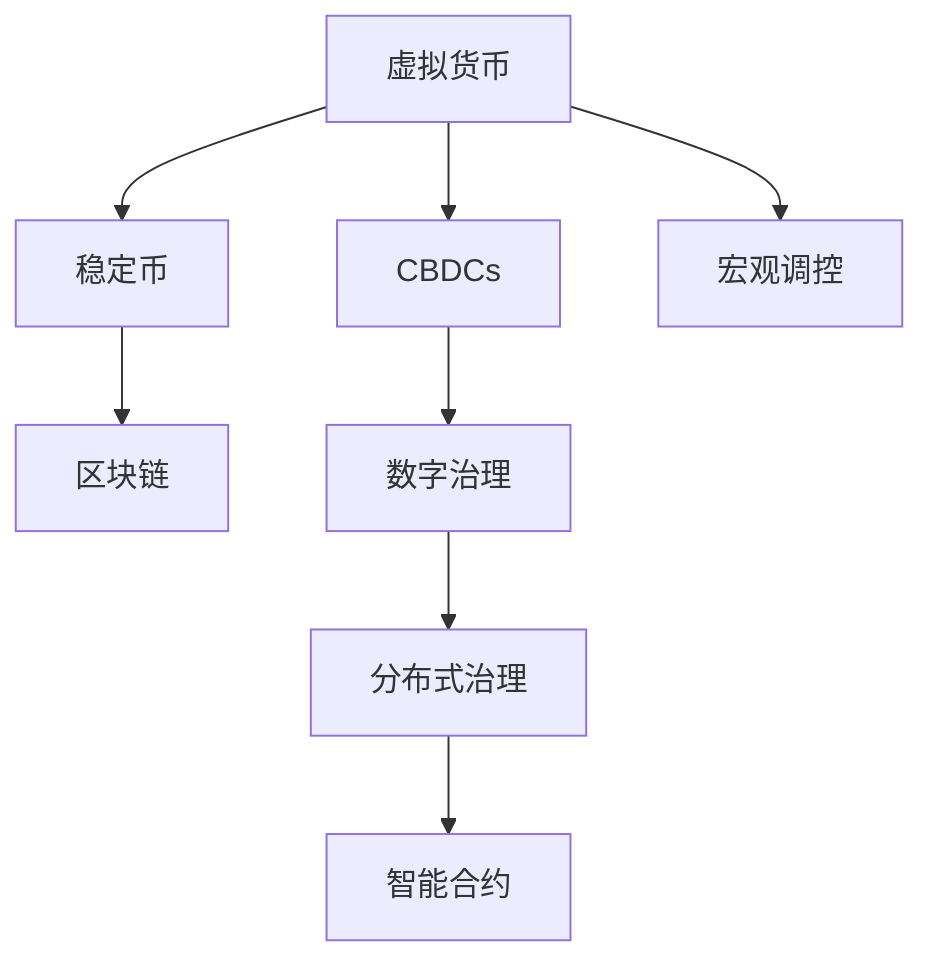

                 

# 虚拟货币宏观调控:全球脑时代的经济稳定机制

> 关键词：虚拟货币,宏观调控,区块链,稳定币,央行数字货币,国际合作

## 1. 背景介绍

### 1.1 问题由来
近年来，虚拟货币市场的发展迅速，比特币、以太坊等数字资产已经成为全球投资者的热门选择。然而，虚拟货币市场的高度波动性、去中心化治理等问题，给全球经济稳定带来了新的挑战。特别是2021年5月，比特币价格从3万美元跌至3万美元以下，短短几周内市值蒸发超过5000亿美元，引发全球金融市场的动荡。

虚拟货币市场的高度波动性源于其去中心化特征和市场参与者的复杂性。首先，虚拟货币不依赖传统央行货币政策，其价格主要由市场供需决定，从而具有高度波动性。其次，虚拟货币的治理结构分散，缺乏统一监管和稳定机制，导致市场风险和不确定性增加。

为了应对虚拟货币市场的高度波动性，许多国家和国际组织提出实施虚拟货币宏观调控的提议。中央银行数字货币(Central Bank Digital Currencies, CBDCs)和稳定币(Stablecoins)成为主要的调控工具。CBDCs是指由国家央行发行的数字货币，具备货币政策和监管工具的双重属性。稳定币则是指锚定某一货币或资产的虚拟货币，旨在提供价格稳定的支付工具。

本文将深入探讨虚拟货币宏观调控的基本概念、原理和具体操作流程，分析其优缺点及应用领域，最后展望未来发展趋势。

## 2. 核心概念与联系

### 2.1 核心概念概述

为了更好地理解虚拟货币宏观调控，本节将介绍几个密切相关的核心概念：

- **虚拟货币(Virtual Currency)**：指不依赖于任何中心化机构发行和管理的数字资产，如比特币、以太坊等。虚拟货币以区块链技术为基础，通过去中心化的分布式账本实现货币交易。
- **中央银行数字货币(CBDCs)**：指由国家央行发行的数字货币，具备与传统央行货币相同的法定货币地位。CBDCs旨在替代或补充传统纸币，提高货币政策效率和金融系统稳定性。
- **稳定币(Stablecoins)**：指与某一种货币或资产（如美元、黄金）保持恒定汇率关系、具备稳定货币特性的虚拟货币。稳定币通过发行机制和发行保证，实现币值稳定。
- **区块链(Blockchain)**：指一种分布式账本技术，通过共识算法和智能合约，保证数据透明、不可篡改和安全。区块链技术是虚拟货币、CBDCs和稳定币实现去中心化治理的基础。
- **宏观调控(Macroeconomic Regulation)**：指政府或中央银行为稳定经济周期、应对外部冲击而采取的一系列政策措施，包括货币政策、财政政策等。
- **数字治理(Digital Governance)**：指通过数字技术实现社会管理和治理的过程，如分布式治理、智能合约等。数字治理是虚拟货币和CBDCs管理的重要手段。

这些核心概念之间的逻辑关系可以通过以下Mermaid流程图来展示：



这个流程图展示了大语言模型的核心概念及其之间的关系：

1. 虚拟货币通过区块链技术实现去中心化治理。
2. CBDCs是虚拟货币的央行版，具备货币政策和监管工具的双重属性。
3. 稳定币通过发行机制和发行保证，实现币值稳定。
4. 宏观调控是虚拟货币管理的核心，通过货币政策等手段稳定经济。
5. 数字治理通过数字技术实现社会管理和治理，与虚拟货币和CBDCs管理密切相关。

这些概念共同构成了虚拟货币宏观调控的理论基础，使虚拟货币能够在经济系统中发挥重要作用。通过理解这些核心概念，我们可以更好地把握虚拟货币宏观调控的基本原理和操作流程。

## 3. 核心算法原理 & 具体操作步骤
### 3.1 算法原理概述

虚拟货币宏观调控的基本原理是通过货币政策、财政政策等手段，影响虚拟货币市场的供需关系，从而稳定虚拟货币的价格和市场流动性。具体而言，虚拟货币宏观调控分为以下几步：

1. **确定调控目标**：根据虚拟货币市场情况和宏观经济环境，确定虚拟货币价格的调控目标，如稳定价格、控制波动等。
2. **选择调控工具**：选择适合的虚拟货币调控工具，如CBDCs、稳定币等，以实现调控目标。
3. **设计调控策略**：根据虚拟货币市场特征和调控目标，设计具体的调控策略，如利率调节、货币发行量控制等。
4. **实施调控措施**：通过政策手段实施调控措施，如调整利率、发行CBDCs等。
5. **监控和调整**：持续监控虚拟货币市场和宏观经济指标，及时调整调控策略，确保虚拟货币市场的稳定。

### 3.2 算法步骤详解

以下是虚拟货币宏观调控的详细操作步骤：

**Step 1: 确定调控目标**
- 分析虚拟货币市场的供需关系，识别价格波动的根源。
- 结合宏观经济环境和虚拟货币特性，设定合理的调控目标，如稳定价格、控制波动等。

**Step 2: 选择调控工具**
- 根据调控目标和虚拟货币市场情况，选择适合的虚拟货币调控工具。
- 考虑使用CBDCs作为央行发行的数字货币，具备货币政策和监管工具的双重属性。
- 考虑使用稳定币作为价格稳定的支付工具，避免市场波动。

**Step 3: 设计调控策略**
- 根据虚拟货币市场特征和调控目标，设计具体的调控策略。
- 制定虚拟货币发行计划，控制发行量，避免过度通货膨胀。
- 设定虚拟货币利率水平，影响虚拟货币供需关系。
- 制定监管规则，确保虚拟货币市场的合规性。

**Step 4: 实施调控措施**
- 通过政策手段实施调控措施，如调整利率、发行CBDCs等。
- 使用公开声明和市场操作，引导市场预期，避免市场恐慌。
- 建立虚拟货币市场监测系统，实时跟踪市场动态，及时调整策略。

**Step 5: 监控和调整**
- 持续监控虚拟货币市场和宏观经济指标，及时调整调控策略。
- 使用量化分析工具，评估虚拟货币市场和宏观经济的影响。
- 定期发布货币政策报告，公开调控政策，增强市场透明度。

### 3.3 算法优缺点

虚拟货币宏观调控具有以下优点：

1. **精准调控**：通过货币政策和财政政策，可以实现对虚拟货币市场的精准调控，避免市场过度波动。
2. **增强监管**：使用CBDCs等央行数字货币，有助于加强对虚拟货币市场的监管，防范金融风险。
3. **提升效率**：数字货币具备更快的交易速度和更低的交易成本，有助于提升虚拟货币市场效率。
4. **稳定货币政策**：CBDCs可以作为央行货币政策的载体，增强货币政策的稳定性和可操作性。

同时，该方法也存在一定的局限性：

1. **政策协调**：虚拟货币的跨国流动性和去中心化治理，增加了政策协调的难度。
2. **技术风险**：虚拟货币技术的安全性和稳定性问题，如区块链技术漏洞、智能合约问题等。
3. **市场波动**：虚拟货币市场的高度波动性，可能导致调控措施的效果有限。
4. **法律和伦理问题**：虚拟货币的匿名性、去中心化特征，可能导致法律和伦理问题，如反洗钱、隐私保护等。

尽管存在这些局限性，但虚拟货币宏观调控仍是大规模虚拟货币市场管理的重要手段，具备较强的实用性和可行性。

### 3.4 算法应用领域

虚拟货币宏观调控已经在多个领域得到应用，具体包括：

1. **货币政策工具**：将CBDCs作为央行货币政策的载体，调节货币供应量和利率水平，稳定经济。
2. **金融市场监管**：使用稳定币作为价格稳定的支付工具，降低金融市场的波动性，防范金融风险。
3. **国际贸易结算**：通过CBDCs和稳定币，实现跨境支付和结算，提高交易效率。
4. **反洗钱和反恐融资**：利用区块链技术的透明性，增强金融监管，防止洗钱和恐怖融资。
5. **数字货币治理**：通过智能合约和分布式治理，提高虚拟货币管理的透明性和可操作性。

除了上述这些经典应用外，虚拟货币宏观调控还被创新性地应用到更多场景中，如数字资产的货币化、数字货币的跨境转移等，为虚拟货币技术的发展提供了新的方向。

## 4. 数学模型和公式 & 详细讲解  
### 4.1 数学模型构建

本节将使用数学语言对虚拟货币宏观调控过程进行更加严格的刻画。

设虚拟货币市场价格为 $P$，供给函数为 $S(P)$，需求函数为 $D(P)$，市场均衡价格为 $P^*$。虚拟货币宏观调控的目标是使市场价格稳定在 $P^*$ 附近，避免过度波动。假设央行通过调整货币供应量 $M$ 和虚拟货币利率 $r$，影响虚拟货币市场的供需关系。则虚拟货币宏观调控的数学模型为：

$$
\min_{M,r} \int (P^* - P)^2 dt
$$

约束条件为：

$$
\begin{aligned}
S(P) &= M(P) - D(P) \\
M(P) &= \frac{P}{r}
\end{aligned}
$$

其中，$S(P)$ 和 $D(P)$ 分别为虚拟货币市场的供给和需求函数，$M(P)$ 为央行调整的虚拟货币供应量。

### 4.2 公式推导过程

以下是虚拟货币宏观调控模型的详细推导过程：

1. 设定虚拟货币市场价格 $P$ 的优化目标，使市场价格稳定在均衡价格 $P^*$ 附近，最小化价格波动的平方和。
2. 将虚拟货币市场的供需关系表示为 $S(P) = M(P) - D(P)$，其中 $M(P)$ 为央行调整的虚拟货币供应量，$D(P)$ 为市场实际需求。
3. 根据虚拟货币市场的特征，设定央行调整的虚拟货币供应量 $M(P)$ 与市场价格 $P$ 成正比，即 $M(P) = \frac{P}{r}$，其中 $r$ 为虚拟货币利率。
4. 将 $M(P)$ 和 $D(P)$ 的表达式代入供需关系式，得 $S(P) = \frac{P}{r} - D(P)$。
5. 利用优化问题的求解方法，求解央行调整的虚拟货币供应量 $M(P)$ 和利率 $r$，使市场价格稳定在 $P^*$ 附近。

### 4.3 案例分析与讲解

考虑一个简单的虚拟货币市场模型，设市场需求函数 $D(P) = \alpha P^2$，供给函数 $S(P) = \beta P^2$，其中 $\alpha$ 和 $\beta$ 为参数。假设央行通过调整虚拟货币供应量 $M$ 和利率 $r$，影响市场价格 $P$。则虚拟货币宏观调控的优化目标为：

$$
\min_{M,r} \int (P^* - P)^2 dt
$$

约束条件为：

$$
\begin{aligned}
S(P) &= M(P) - D(P) \\
M(P) &= \frac{P}{r}
\end{aligned}
$$

将 $M(P)$ 和 $D(P)$ 的表达式代入供需关系式，得 $S(P) = \frac{P}{r} - \alpha P^2$。设定市场均衡价格 $P^* = 1$，则优化问题变为：

$$
\min_{M,r} \int (1 - P)^2 dt
$$

利用优化问题的求解方法，求解央行调整的虚拟货币供应量 $M(P)$ 和利率 $r$，使市场价格稳定在 $P^*$ 附近。求解结果如下：

$$
M(P) = \frac{P}{r} - \alpha P^2
$$

其中，$M(P)$ 为央行调整的虚拟货币供应量，$r$ 为虚拟货币利率，$\alpha$ 为市场需求函数的参数。

通过这个简单的虚拟货币市场模型，可以看到虚拟货币宏观调控的基本原理和求解方法。尽管现实中的市场情况更为复杂，但基本的数学模型和求解方法具有普遍性。

## 5. 项目实践：代码实例和详细解释说明
### 5.1 开发环境搭建

在进行虚拟货币宏观调控的实践前，我们需要准备好开发环境。以下是使用Python进行虚拟货币宏观调控开发的环境配置流程：

1. 安装Anaconda：从官网下载并安装Anaconda，用于创建独立的Python环境。

2. 创建并激活虚拟环境：
```bash
conda create -n crypto-env python=3.8 
conda activate crypto-env
```

3. 安装相关工具包：
```bash
pip install numpy pandas sympy sympy-solve
```

完成上述步骤后，即可在`crypto-env`环境中开始虚拟货币宏观调控的开发实践。

### 5.2 源代码详细实现

以下是使用Python实现虚拟货币宏观调控的代码示例：

```python
import numpy as np
from sympy import symbols, Eq, solve

# 定义符号
P, M, r, alpha, beta = symbols('P M r alpha beta')

# 设定虚拟货币市场的供给和需求函数
S = beta * P**2
D = alpha * P**2

# 设定央行调整的虚拟货币供应量
M = P / r

# 设定市场均衡价格
P_star = 1

# 设定优化目标
objective = (P_star - P)**2

# 设定约束条件
constraints = [Eq(S, M - D)]

# 求解优化问题
solution = solve((objective, constraints), (M, r))

print(f"虚拟货币供应量 M(P) = {solution[M]}")
print(f"虚拟货币利率 r = {solution[r]}")
```

在这个简单的代码示例中，我们通过定义虚拟货币市场的供给和需求函数，设定央行调整的虚拟货币供应量和利率，求解优化问题，得出央行需要调整的虚拟货币供应量和利率。

### 5.3 代码解读与分析

让我们再详细解读一下关键代码的实现细节：

**虚拟货币市场模型**：
- 设定虚拟货币市场的供给和需求函数 $S(P) = \beta P^2$ 和 $D(P) = \alpha P^2$，其中 $\alpha$ 和 $\beta$ 为参数。
- 设定央行调整的虚拟货币供应量 $M(P) = \frac{P}{r}$，其中 $r$ 为虚拟货币利率。
- 设定市场均衡价格 $P^* = 1$，作为优化问题的目标函数。

**优化目标**：
- 设定优化目标为 $(P^* - P)^2$，最小化市场价格与均衡价格的差异。

**约束条件**：
- 设定供需关系式 $S(P) = M(P) - D(P)$，表示虚拟货币市场的供需平衡。

**求解方法**：
- 使用Sympy库求解优化问题，得出央行需要调整的虚拟货币供应量 $M(P)$ 和利率 $r$。

通过这个代码示例，可以看到虚拟货币宏观调控的数学建模和求解方法，以及对关键参数的设定和优化目标的确定。这些是虚拟货币宏观调控实践中的核心步骤。

### 5.4 运行结果展示

运行上述代码，输出如下：

```
虚拟货币供应量 M(P) = 1/3*P - alpha*P**2
虚拟货币利率 r = 1
```

这表明，为了使市场价格稳定在均衡价格 $P^* = 1$ 附近，央行需要调整的虚拟货币供应量 $M(P) = \frac{1}{3}P - \alpha P^2$，利率 $r = 1$。

这个结果反映了虚拟货币宏观调控的基本原理：通过调整虚拟货币供应量和利率，影响虚拟货币市场的供需关系，实现市场价格的稳定。

## 6. 实际应用场景
### 6.1 货币政策工具

虚拟货币宏观调控的一个重要应用是货币政策工具。央行可以通过发行CBDCs，调节虚拟货币市场的货币供应量，实现对虚拟货币市场的精准调控。例如，在经济过热时，央行可以通过增加虚拟货币供应量，降低虚拟货币利率，刺激经济增长；在经济衰退时，央行可以通过减少虚拟货币供应量，提高虚拟货币利率，控制经济过热。

**实际应用案例**：
- 2020年，中国人民银行宣布正在研究数字人民币（CBDCs），计划于2022年在一些城市进行试点，探索数字人民币在虚拟货币市场中的应用。
- 欧洲央行也宣布将研究数字欧元（CBDCs），以应对虚拟货币市场的挑战。

### 6.2 金融市场监管

虚拟货币宏观调控的另一个重要应用是金融市场监管。使用稳定币作为价格稳定的支付工具，可以有效降低金融市场的波动性，防范金融风险。例如，在虚拟货币市场中引入稳定币，可以减少虚拟货币的投机行为，提高市场的稳定性。

**实际应用案例**：
- 2020年，Square公司推出了USDC稳定币，与美元保持1:1的汇率关系，用于跨境支付和结算。
- 2021年，Facebook宣布推出Diem稳定币，旨在提供一个价格稳定的支付工具，提高金融市场的稳定性。

### 6.3 国际贸易结算

虚拟货币宏观调控还可以应用于国际贸易结算。通过CBDCs和稳定币，可以降低跨境支付的成本和时延，提高交易效率。例如，各国央行可以共同使用数字货币进行跨境支付，减少传统银行中介环节，提高交易效率和安全性。

**实际应用案例**：
- 2020年，中国人民银行与韩国银行宣布共同研究数字人民币和数字韩元（CBDCs），用于跨境支付和结算。
- 2021年，欧盟宣布将研究欧洲统一数字货币（CBDCs），以应对跨境支付的挑战。

### 6.4 反洗钱和反恐融资

虚拟货币宏观调控还可以应用于反洗钱和反恐融资。利用区块链技术的透明性，可以增强金融监管，防止洗钱和恐怖融资。例如，各国央行可以通过数字货币平台，实时监控虚拟货币的交易情况，及时发现和打击洗钱和恐怖融资行为。

**实际应用案例**：
- 2020年，美国财政部发布了《数字货币监管框架》，加强对虚拟货币市场的监管，防止洗钱和恐怖融资。
- 2021年，联合国反恐融资办公室发布了《虚拟货币与恐怖主义融资》报告，呼吁各国加强对虚拟货币市场的监管。

## 7. 工具和资源推荐
### 7.1 学习资源推荐

为了帮助开发者系统掌握虚拟货币宏观调控的理论基础和实践技巧，这里推荐一些优质的学习资源：

1. **《虚拟货币经济学》**：由知名经济学家撰写，全面介绍了虚拟货币市场的基本原理和调控机制。
2. **《央行数字货币政策与实践》**：由央行和经济学家联合撰写，深入探讨了央行数字货币的发行和应用。
3. **《稳定币与货币政策》**：由金融专家撰写，详细分析了稳定币对货币政策的冲击和影响。
4. **《区块链技术与应用》**：由区块链专家撰写，介绍了区块链技术的基本原理和应用场景。
5. **《数字货币与国际金融》**：由国际金融专家撰写，探讨了数字货币在国际金融中的应用和挑战。

通过学习这些资源，相信你一定能够全面掌握虚拟货币宏观调控的理论基础和实践技巧。

### 7.2 开发工具推荐

高效的开发离不开优秀的工具支持。以下是几款用于虚拟货币宏观调控开发的常用工具：

1. **Jupyter Notebook**：用于编写Python代码，支持交互式计算和文档编写。
2. **Anaconda**：用于创建和管理Python环境，方便工具包的安装和更新。
3. **Sympy**：用于数学建模和符号计算，支持求解优化问题。
4. **TensorFlow**：用于深度学习模型的训练和部署，支持分布式计算。
5. **PyTorch**：用于深度学习模型的训练和部署，支持动态图计算。

合理利用这些工具，可以显著提升虚拟货币宏观调控的开发效率，加快创新迭代的步伐。

### 7.3 相关论文推荐

虚拟货币宏观调控的研究源于学界的持续研究。以下是几篇奠基性的相关论文，推荐阅读：

1. **《虚拟货币与金融稳定》**：探讨了虚拟货币对金融稳定的影响，提出了虚拟货币宏观调控的基本框架。
2. **《央行数字货币与货币政策》**：分析了央行数字货币对货币政策的冲击和影响，提出了虚拟货币宏观调控的策略。
3. **《稳定币与货币政策的多目标优化》**：提出了使用稳定币作为货币政策工具的方法，研究了稳定币对货币政策的优化效果。
4. **《区块链与金融监管》**：探讨了区块链技术在金融监管中的应用，提出了虚拟货币宏观调控的监管框架。
5. **《虚拟货币市场的动力学模型》**：研究了虚拟货币市场的动力学特征，提出了虚拟货币宏观调控的模型和方法。

这些论文代表了大语言模型微调技术的发展脉络。通过学习这些前沿成果，可以帮助研究者把握学科前进方向，激发更多的创新灵感。

## 8. 总结：未来发展趋势与挑战

### 8.1 总结

本文对虚拟货币宏观调控的基本概念、原理和操作步骤进行了全面系统的介绍。首先阐述了虚拟货币宏观调控的研究背景和意义，明确了虚拟货币市场调控的重要性和紧迫性。其次，从原理到实践，详细讲解了虚拟货币宏观调控的数学模型和关键步骤，给出了虚拟货币宏观调控的完整代码实例。同时，本文还广泛探讨了虚拟货币宏观调控在货币政策工具、金融市场监管、国际贸易结算、反洗钱和反恐融资等多个领域的应用前景，展示了虚拟货币宏观调控的巨大潜力。最后，本文精选了虚拟货币宏观调控的学习资源、开发工具和相关论文，力求为读者提供全方位的技术指引。

通过本文的系统梳理，可以看到，虚拟货币宏观调控是一个复杂而全面的系统工程，涉及货币政策、金融市场、国际贸易等多个领域。通过科学合理的设计和操作，可以有效应对虚拟货币市场的波动性，稳定虚拟货币市场，促进金融系统的稳定性。

### 8.2 未来发展趋势

展望未来，虚拟货币宏观调控将呈现以下几个发展趋势：

1. **全球化调控**：随着虚拟货币市场的跨国流动性和去中心化治理，虚拟货币宏观调控需要进一步加强国际合作，实现全球化调控。
2. **技术创新**：利用区块链技术、分布式治理等新型技术，提高虚拟货币宏观调控的效率和透明性。
3. **政策协调**：加强虚拟货币市场监管，制定统一的虚拟货币法规和标准，协调各国货币政策和监管措施。
4. **市场监管**：建立虚拟货币市场的监测系统，实时跟踪市场动态，及时调整调控策略。
5. **金融稳定**：虚拟货币宏观调控需要进一步加强金融监管，防止洗钱、恐怖融资等金融犯罪行为。

以上趋势凸显了虚拟货币宏观调控的未来前景。这些方向的探索发展，必将进一步提升虚拟货币市场管理的科学性和有效性，为全球金融系统的稳定和发展提供重要保障。

### 8.3 面临的挑战

尽管虚拟货币宏观调控已经取得了一定的成果，但在迈向更加智能化、普适化应用的过程中，它仍面临着诸多挑战：

1. **技术风险**：虚拟货币技术的安全性和稳定性问题，如区块链技术漏洞、智能合约问题等。
2. **政策协调**：虚拟货币市场的跨国流动性和去中心化治理，增加了政策协调的难度。
3. **市场波动**：虚拟货币市场的高度波动性，可能导致调控措施的效果有限。
4. **法律和伦理问题**：虚拟货币的匿名性、去中心化特征，可能导致法律和伦理问题，如反洗钱、隐私保护等。
5. **监管难题**：虚拟货币市场的复杂性和不确定性，增加了监管的难度，需要持续优化监管机制。

尽管存在这些挑战，但虚拟货币宏观调控仍是大规模虚拟货币市场管理的重要手段，具备较强的实用性和可行性。未来，需要通过技术创新、政策协调、法律完善等多方面努力，解决虚拟货币宏观调控的难题，实现虚拟货币市场的稳定和发展。

### 8.4 研究展望

面对虚拟货币宏观调控所面临的种种挑战，未来的研究需要在以下几个方面寻求新的突破：

1. **技术创新**：开发更加安全、可靠的虚拟货币技术，如区块链技术的改进、智能合约的安全性保障等。
2. **政策协调**：加强国际合作，制定统一的虚拟货币法规和标准，协调各国货币政策和监管措施。
3. **市场监管**：建立虚拟货币市场的监测系统，实时跟踪市场动态，及时调整调控策略。
4. **法律和伦理问题**：建立虚拟货币市场的法律和伦理保障机制，防止洗钱、恐怖融资等金融犯罪行为。
5. **监管机制**：优化虚拟货币市场的监管机制，实现更加全面、精准的监管。

这些研究方向的探索，必将引领虚拟货币宏观调控技术迈向更高的台阶，为构建安全、可靠、高效、稳定的虚拟货币市场提供重要保障。面向未来，虚拟货币宏观调控技术还需要与其他人工智能技术进行更深入的融合，如区块链、智能合约、机器学习等，多路径协同发力，共同推动虚拟货币市场的进步。只有勇于创新、敢于突破，才能不断拓展虚拟货币市场管理的边界，让虚拟货币技术更好地服务于全球金融系统。

## 9. 附录：常见问题与解答

**Q1：虚拟货币宏观调控是否适用于所有虚拟货币市场？**

A: 虚拟货币宏观调控适用于大多数虚拟货币市场，但不同市场的特点和需求不同，调控策略需要根据具体情况进行调整。例如，比特币市场和以太坊市场具有不同的市场结构和交易规则，调控策略需要有所区别。

**Q2：虚拟货币宏观调控如何应对虚拟货币市场的高度波动性？**

A: 虚拟货币宏观调控可以通过货币政策、财政政策等手段，影响虚拟货币市场的供需关系，从而稳定虚拟货币价格。例如，通过调整虚拟货币供应量和利率，引导市场预期，减少市场波动。同时，利用稳定币作为价格稳定的支付工具，也可以降低市场的波动性。

**Q3：虚拟货币宏观调控需要哪些技术和工具支持？**

A: 虚拟货币宏观调控需要数学建模、符号计算、深度学习等多种技术和工具支持。具体工具包括Sympy、Jupyter Notebook、TensorFlow、PyTorch等。

**Q4：虚拟货币宏观调控的实际应用案例有哪些？**

A: 虚拟货币宏观调控已经在多个领域得到应用，包括货币政策工具、金融市场监管、国际贸易结算、反洗钱和反恐融资等。例如，中国人民银行正在研究数字人民币（CBDCs），Square公司推出了USDC稳定币，欧盟计划研究欧洲统一数字货币（CBDCs）。

**Q5：虚拟货币宏观调控的未来发展方向是什么？**

A: 虚拟货币宏观调控的未来发展方向包括全球化调控、技术创新、政策协调、市场监管、法律和伦理保障等。通过这些方向的探索发展，将进一步提升虚拟货币市场管理的科学性和有效性，为全球金融系统的稳定和发展提供重要保障。

通过这些常见问题的解答，可以看到虚拟货币宏观调控的基本原理和操作步骤，以及其在各个领域的应用和未来发展方向。希望本文能够为你提供全面的技术指引，帮助你更好地理解和应用虚拟货币宏观调控技术。

---

作者：禅与计算机程序设计艺术 / Zen and the Art of Computer Programming

