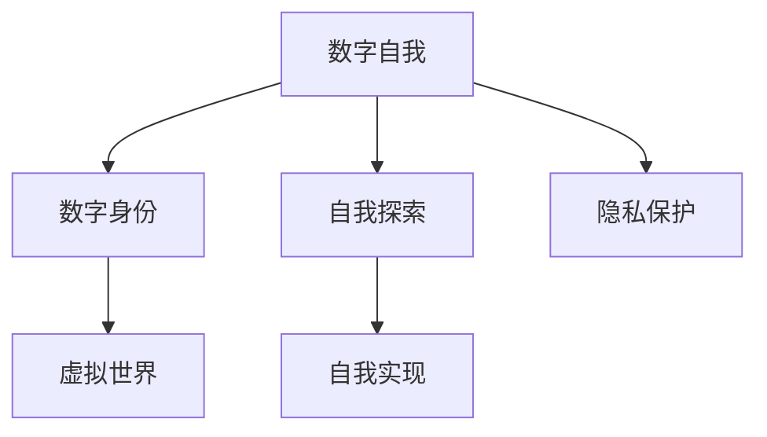

                 

# 虚拟身份认同：AI时代的自我探索

> 关键词：虚拟身份, 自我探索, AI技术, 数字自我, 数字身份, 隐私保护

## 1. 背景介绍

### 1.1 问题由来

随着人工智能（AI）技术的迅猛发展，尤其是深度学习、自然语言处理（NLP）和计算机视觉（CV）等领域的突破，使得虚拟身份认同问题成为近年来研究的热点。在虚拟身份认同的框架下，我们探索AI技术如何帮助个体构建、维护和实现其在虚拟世界中的自我认同。

### 1.2 问题核心关键点

虚拟身份认同研究的核心关键点包括：
1. **数字自我构建**：通过AI技术帮助个体在虚拟世界构建数字自我，包括虚拟形象、虚拟交互行为、虚拟经历等。
2. **数字身份保护**：在虚拟身份构建过程中，保护用户的隐私和安全，防止身份盗用、数据泄露等问题。
3. **自我探索与实现**：利用AI技术促进用户在虚拟世界中的自我探索和实现，包括自我表达、自我发现、自我实现等。
4. **跨界融合与协同**：将虚拟身份与现实世界的生活、工作、社交等活动相融合，实现跨界协同。

### 1.3 问题研究意义

虚拟身份认同的研究具有重要意义：
1. **提升生活质量**：通过AI技术在虚拟世界中的应用，提升个人的生活质量，实现自我探索和自我实现。
2. **促进社会发展**：虚拟身份认同的探索有助于推动虚拟世界的健康发展，促进社会进步。
3. **开辟新的研究方向**：研究虚拟身份认同有助于拓展AI技术的应用边界，推动相关领域的研究。
4. **保护个人隐私**：研究如何保护用户在虚拟世界中的隐私，避免身份盗用等安全问题。

## 2. 核心概念与联系

### 2.1 核心概念概述

为更好地理解虚拟身份认同的核心概念，本节将介绍几个密切相关的核心概念：

- **数字自我**：在虚拟世界中以数字化形式存在的自我，包括虚拟形象、虚拟行为、虚拟经历等。
- **数字身份**：在虚拟世界中的身份标识，用于认证和授权，确保个体在虚拟环境中的安全与隐私。
- **虚拟世界**：通过AI技术构建的虚拟空间，个体可以在其中进行各种虚拟活动。
- **自我探索**：在虚拟世界中进行探索，发现自我，提升自我认知和实现。
- **自我实现**：通过虚拟身份认同，实现个人价值和目标。
- **隐私保护**：在虚拟身份构建和探索过程中，保护用户隐私和数据安全。

这些核心概念之间的逻辑关系可以通过以下Mermaid流程图来展示：



这个流程图展示了一些核心概念及其之间的关系：

1. 数字自我基于数字身份，用于在虚拟世界中进行自我探索和自我实现。
2. 虚拟世界是自我探索和实现的环境，其中数字身份扮演了重要角色。
3. 隐私保护是构建和探索数字自我的必要条件，保护个体在虚拟世界中的安全。

## 3. 核心算法原理 & 具体操作步骤

### 3.1 算法原理概述

虚拟身份认同的算法原理基于心理学、社会学和AI技术的交叉融合。其核心思想是：利用AI技术帮助个体在虚拟世界构建数字自我，并通过数字身份保护和自我探索实现，最终实现自我认同。

形式化地，假设个体为 $S$，其在虚拟世界中的数字自我为 $S'$，数字身份为 $ID$。虚拟身份认同的过程可以表示为：

$$
S' = f(S, ID, V)
$$

其中 $f$ 为AI技术支持的虚拟身份构建函数，$V$ 为虚拟世界。

### 3.2 算法步骤详解

虚拟身份认同的算法步骤包括：

**Step 1: 数据收集与预处理**
- 收集个体的现实世界数据，包括照片、社交媒体信息、行为数据等。
- 使用AI技术对数据进行预处理，如人脸识别、语音合成、文本生成等。

**Step 2: 构建虚拟自我**
- 利用AI技术构建虚拟自我 $S'$，包括虚拟形象、虚拟行为和虚拟经历等。
- 使用深度学习模型，如GAN、VAE等，生成逼真的虚拟形象。
- 通过自然语言处理（NLP）和计算机视觉（CV）技术，模拟虚拟行为和经历。

**Step 3: 设计数字身份**
- 基于收集到的数据，设计数字身份 $ID$，包括用户名、密码、授权权限等。
- 使用AI技术进行身份验证和授权，确保个体在虚拟世界中的安全。

**Step 4: 探索与实现**
- 在虚拟世界 $V$ 中进行自我探索，发现数字自我 $S'$ 的潜在价值和能力。
- 利用AI技术进行自我实现，如虚拟职业发展、社交网络构建等。

**Step 5: 隐私保护**
- 在虚拟身份构建和探索过程中，保护个体隐私和数据安全。
- 使用加密技术、数据脱敏等手段，防止数据泄露和身份盗用。

### 3.3 算法优缺点

虚拟身份认同的算法具有以下优点：
1. **高效性**：利用AI技术可以快速构建数字自我和虚拟身份，节省时间和成本。
2. **沉浸式体验**：通过虚拟现实（VR）、增强现实（AR）等技术，提供沉浸式体验。
3. **自我实现**：帮助个体在虚拟世界中实现自我探索和自我实现，提升生活质量。

同时，该算法也存在一定的局限性：
1. **数据隐私问题**：收集和处理现实世界数据可能涉及隐私问题。
2. **技术依赖**：算法依赖于AI技术，如深度学习、自然语言处理等，技术门槛较高。
3. **用户适应性**：不同用户对虚拟身份的适应性和接受度可能不同。
4. **虚拟与现实的脱节**：虚拟身份和现实自我的脱节可能导致身份混淆和心理问题。

尽管存在这些局限性，但虚拟身份认同的算法仍在不断演进，未来有望克服现有挑战，实现更加广泛的应用。

### 3.4 算法应用领域

虚拟身份认同的算法在多个领域都有广泛应用：

- **虚拟游戏**：在游戏世界中构建虚拟自我和身份，提升游戏体验。
- **虚拟教育**：通过虚拟自我和身份在虚拟教育平台进行学习，提升教育效果。
- **虚拟商务**：在虚拟商务环境中构建虚拟自我和身份，促进商业活动。
- **虚拟社交**：在虚拟社交平台中构建虚拟自我和身份，增强社交互动。
- **虚拟医疗**：在虚拟医疗环境中构建虚拟自我和身份，提供远程医疗服务。

## 4. 数学模型和公式 & 详细讲解

### 4.1 数学模型构建

在虚拟身份认同中，数学模型主要用于描述虚拟自我的构建和行为模拟。以虚拟形象生成为例，假设虚拟形象 $I$ 可以通过深度学习模型生成，其数学模型为：

$$
I = G(z)
$$

其中 $G$ 为生成模型，$z$ 为随机噪声向量。常见的生成模型包括GAN、VAE等。

### 4.2 公式推导过程

以下以GAN模型为例，推导虚拟形象生成的公式：

假设生成器和判别器的损失函数分别为 $L_G$ 和 $L_D$，生成器的目标是最小化 $L_G$，判别器的目标是最小化 $L_D$，同时最大化 $L_D$。生成器和判别器的目标函数可以表示为：

$$
L_G = E_{z \sim p(z)} [\log D(G(z))]
$$
$$
L_D = E_{x \sim p(x)} [\log D(x)] + E_{z \sim p(z)} [\log (1-D(G(z)))
$$

其中 $p(z)$ 为随机噪声向量的分布，$p(x)$ 为真实数据的分布。

通过优化上述损失函数，生成器可以生成逼真的虚拟形象 $I$，判别器可以区分真实数据和虚拟数据，从而提升虚拟形象的质量。

### 4.3 案例分析与讲解

假设我们想生成一张虚拟人物图像，步骤如下：
1. 生成随机噪声向量 $z$。
2. 将 $z$ 输入生成模型 $G$，生成虚拟人物图像 $I$。
3. 将生成的图像输入判别模型 $D$，计算判别器输出。
4. 根据判别器输出，调整生成模型参数，直到生成的图像逼真度达到预期。

在实际应用中，GAN模型的训练需要大量的计算资源和时间，但一旦训练完成，可以高效生成高质量的虚拟形象。

## 5. 项目实践：代码实例和详细解释说明

### 5.1 开发环境搭建

在进行虚拟身份认同项目实践前，我们需要准备好开发环境。以下是使用Python进行TensorFlow开发的环境配置流程：

1. 安装Anaconda：从官网下载并安装Anaconda，用于创建独立的Python环境。

2. 创建并激活虚拟环境：
```bash
conda create -n tf-env python=3.8 
conda activate tf-env
```

3. 安装TensorFlow：根据CUDA版本，从官网获取对应的安装命令。例如：
```bash
conda install tensorflow -c tf -c conda-forge
```

4. 安装各类工具包：
```bash
pip install numpy pandas scikit-learn matplotlib tqdm jupyter notebook ipython
```

完成上述步骤后，即可在`tf-env`环境中开始项目实践。

### 5.2 源代码详细实现

这里我们以GAN模型生成虚拟形象为例，给出使用TensorFlow进行虚拟身份认同的PyTorch代码实现。

首先，定义GAN模型和生成器、判别器：

```python
import tensorflow as tf

class Generator(tf.keras.Model):
    def __init__(self, latent_dim=100, img_shape=(64, 64, 3)):
        super(Generator, self).__init__()
        self.img_shape = img_shape
        self.latent_dim = latent_dim
        
        self.dense1 = tf.keras.layers.Dense(256)
        self.dense2 = tf.keras.layers.Dense(512)
        self.dense3 = tf.keras.layers.Dense(np.prod(img_shape))
        self.reshape = tf.keras.layers.Reshape(img_shape)
        self.sigmoid = tf.keras.layers.Activation("sigmoid")
        
    def call(self, inputs):
        x = self.dense1(inputs)
        x = tf.nn.leaky_relu(x)
        x = self.dense2(x)
        x = tf.nn.leaky_relu(x)
        x = self.dense3(x)
        img = self.reshape(x)
        img = self.sigmoid(img)
        return img

class Discriminator(tf.keras.Model):
    def __init__(self, img_shape=(64, 64, 3)):
        super(Discriminator, self).__init__()
        self.img_shape = img_shape
        
        self.flatten = tf.keras.layers.Flatten()
        self.dense1 = tf.keras.layers.Dense(256)
        self.dense2 = tf.keras.layers.Dense(1)
        self.sigmoid = tf.keras.layers.Activation("sigmoid")
        
    def call(self, inputs):
        x = tf.reshape(inputs, [-1, self.img_shape[0] * self.img_shape[1] * self.img_shape[2]])
        x = self.flatten(x)
        x = self.dense1(x)
        x = tf.nn.leaky_relu(x)
        x = self.dense2(x)
        x = self.sigmoid(x)
        return x
```

然后，定义训练函数：

```python
@tf.function
def train_step(real_images):
    with tf.GradientTape() as gen_tape, tf.GradientTape() as disc_tape:
        generated_images = generator(noise)
        real_output = discriminator(real_images)
        fake_output = discriminator(generated_images)
        
        gen_loss = generator_loss(fake_output)
        disc_loss = discriminator_loss(real_output, fake_output)
        
        gradients_of_generator = gen_tape.gradient(gen_loss, generator.trainable_variables)
        gradients_of_discriminator = disc_tape.gradient(disc_loss, discriminator.trainable_variables)
        
        generator.optimizer.apply_gradients(zip(gradients_of_generator, generator.trainable_variables))
        discriminator.optimizer.apply_gradients(zip(gradients_of_discriminator, discriminator.trainable_variables))
```

最后，启动训练流程：

```python
epochs = 100

for epoch in range(epochs):
    for batch in dataset:
        train_step(batch)
```

以上就是使用TensorFlow进行虚拟身份认同的代码实现。可以看到，TensorFlow的高级API使得模型的构建和训练变得简洁高效。

### 5.3 代码解读与分析

让我们再详细解读一下关键代码的实现细节：

**Generator类**：
- `__init__`方法：初始化生成器的维度、形状等关键参数。
- `call`方法：定义生成器的前向传播过程，包括多个全连接层和激活函数。

**Discriminator类**：
- `__init__`方法：初始化判别器的形状等参数。
- `call`方法：定义判别器的前向传播过程，包括扁平化、全连接层和激活函数。

**train_step函数**：
- 通过梯度下降算法更新生成器和判别器的参数。
- 计算生成器损失和判别器损失，通过链式法则计算参数梯度。
- 应用优化器更新参数。

**epochs变量**：
- 定义训练的总轮数。

通过上述代码，我们可以实现一个简单的GAN模型，生成逼真的虚拟形象。TensorFlow的高级API使得模型构建和训练变得简单，开发者可以专注于算法和逻辑的实现。

## 6. 实际应用场景

### 6.1 虚拟游戏

虚拟游戏是虚拟身份认同的重要应用场景。在游戏世界中，玩家可以通过AI技术构建虚拟自我和身份，提升游戏体验。

在技术实现上，可以收集玩家的游戏行为数据，如角色动作、装备、任务进度等。利用GAN等生成模型，生成逼真的虚拟角色和场景，增强游戏的沉浸感。同时，通过虚拟身份设计，玩家可以自由探索游戏世界，实现自我表达和自我实现。

### 6.2 虚拟教育

在虚拟教育平台中，学生可以通过虚拟身份进行学习，提升教育效果。

通过收集学生的学习行为数据，如答题记录、课程进度等，利用NLP和AI技术生成虚拟教师和助教，提供个性化学习建议和辅导。同时，学生可以通过虚拟身份进行互动和交流，增强学习体验。

### 6.3 虚拟商务

在虚拟商务环境中，企业和消费者可以通过虚拟身份进行互动和交易。

通过收集消费者的购买行为和反馈，利用AI技术生成虚拟客服和导购，提供个性化的购物建议和服务。同时，企业可以通过虚拟身份展示产品和服务，增强品牌影响力。

### 6.4 未来应用展望

随着虚拟身份认同技术的不断发展，未来的应用场景将更加丰富：

- **虚拟社交**：在虚拟社交平台中，用户可以通过虚拟身份进行社交互动，增强社交体验。
- **虚拟医疗**：在虚拟医疗环境中，患者可以通过虚拟身份进行远程诊疗和咨询，提升医疗服务质量。
- **虚拟旅游**：在虚拟旅游平台上，用户可以通过虚拟身份进行虚拟旅游，提升旅游体验。
- **虚拟商务**：在虚拟商务环境中，企业和消费者可以通过虚拟身份进行互动和交易，增强商业活动效果。

## 7. 工具和资源推荐

### 7.1 学习资源推荐

为了帮助开发者系统掌握虚拟身份认同的理论基础和实践技巧，这里推荐一些优质的学习资源：

1. 《生成对抗网络》系列书籍：深入浅出地介绍了GAN的基本原理、算法实现和应用案例。
2. 《深度学习》系列课程：斯坦福大学和深度学习大师Yoshua Bengio等开设的深度学习课程，涵盖各种深度学习模型和算法。
3. 《AI道德与隐私》书籍：探讨AI技术的伦理道德问题，特别是隐私保护和安全问题。
4. 《虚拟身份认同》研究论文：各大顶级会议和期刊上发表的最新研究成果，涵盖虚拟身份构建、保护和探索等各个方面。

通过对这些资源的学习实践，相信你一定能够快速掌握虚拟身份认同的精髓，并用于解决实际的AI应用问题。

### 7.2 开发工具推荐

高效的开发离不开优秀的工具支持。以下是几款用于虚拟身份认同开发的常用工具：

1. TensorFlow：基于Python的开源深度学习框架，灵活动态的计算图，适合快速迭代研究。
2. PyTorch：基于Python的开源深度学习框架，灵活的动态图机制，支持深度学习模型的构建和训练。
3. OpenAI Gym：用于游戏和机器人模拟的开发环境，支持各种游戏和模拟器。
4. Unity和Unreal Engine：用于虚拟现实（VR）和增强现实（AR）的开发平台，提供丰富的图形和音频资源。
5. TensorBoard：TensorFlow配套的可视化工具，实时监测模型训练状态，并提供丰富的图表呈现方式。

合理利用这些工具，可以显著提升虚拟身份认同项目的开发效率，加快创新迭代的步伐。

### 7.3 相关论文推荐

虚拟身份认同的研究源于学界的持续研究。以下是几篇奠基性的相关论文，推荐阅读：

1. Generative Adversarial Nets（GAN原论文）：提出了GAN模型，开创了生成模型的新纪元。
2. Variational Autoencoder（VAE）：提出了一种生成模型，能够对数据进行无监督生成和降维。
3. StyleGAN：一种基于GAN的生成模型，能够生成高质量、逼真的图像。
4. GAN for Motion Capture（GAN在动作捕捉中的应用）：展示了GAN模型在动作捕捉领域的应用。
5. GAN for Facial Expression Generation（GAN在面部表情生成中的应用）：展示了GAN模型在面部表情生成方面的应用。

这些论文代表了大模型微调技术的发展脉络。通过学习这些前沿成果，可以帮助研究者把握学科前进方向，激发更多的创新灵感。

## 8. 总结：未来发展趋势与挑战

### 8.1 总结

本文对虚拟身份认同的算法原理和操作步骤进行了全面系统的介绍。首先阐述了虚拟身份认同的研究背景和意义，明确了算法在虚拟自我构建、身份保护和自我探索实现等方面的关键作用。其次，从原理到实践，详细讲解了虚拟身份认同的数学模型和关键算法，给出了具体的代码实现。同时，本文还广泛探讨了虚拟身份认同在虚拟游戏、虚拟教育、虚拟商务等多个领域的应用前景，展示了虚拟身份认同技术的巨大潜力。

通过本文的系统梳理，可以看到，虚拟身份认同技术正在成为AI应用的重要方向，极大地拓展了AI技术的应用边界，催生了更多的落地场景。未来，伴随AI技术的进一步发展，虚拟身份认同将为人类社会带来更加丰富的虚拟体验，推动社会的进步和变革。

### 8.2 未来发展趋势

展望未来，虚拟身份认同技术将呈现以下几个发展趋势：

1. **技术融合**：虚拟身份认同技术将与其他AI技术进行更深入的融合，如计算机视觉、自然语言处理、增强现实等，提供更加丰富的虚拟体验。
2. **跨界应用**：虚拟身份认同技术将拓展到更多领域，如虚拟旅游、虚拟医疗、虚拟文化等，促进跨界融合和协同。
3. **用户交互**：通过虚拟身份认同技术，增强用户与虚拟环境的互动和交互，提升用户体验和参与度。
4. **伦理道德**：虚拟身份认同技术将受到伦理道德的关注，如何在保护隐私和提升用户体验之间找到平衡，成为重要研究方向。
5. **人机协同**：虚拟身份认同技术将推动人机协同的发展，增强智能系统的自适应和自学习能力。

### 8.3 面临的挑战

尽管虚拟身份认同技术已经取得了一定进展，但在迈向更加智能化、普适化应用的过程中，仍面临诸多挑战：

1. **数据隐私问题**：虚拟身份构建和探索涉及大量个人信息，如何保护用户的隐私，防止数据泄露和身份盗用，是一个重要问题。
2. **技术门槛高**：虚拟身份认同技术涉及深度学习、自然语言处理、计算机视觉等多个领域，技术门槛较高。
3. **用户体验差异**：不同用户对虚拟身份的接受度和适应度可能不同，需要根据用户需求进行个性化设计。
4. **技术成熟度不足**：虚拟身份认同技术仍处于起步阶段，许多关键技术尚未成熟，有待进一步探索。
5. **伦理道德困境**：虚拟身份认同技术可能带来伦理道德问题，如虚拟自我与现实自我的脱节、虚拟身份的滥用等。

### 8.4 研究展望

未来，虚拟身份认同技术的研究需要在以下几个方面寻求新的突破：

1. **隐私保护技术**：研究如何保护用户隐私和数据安全，开发更加安全的虚拟身份构建和探索方法。
2. **用户友好设计**：设计更加用户友好的虚拟身份构建和探索界面，提升用户体验和参与度。
3. **多模态融合**：将虚拟身份构建和探索与多模态数据融合，提供更加全面的虚拟体验。
4. **伦理道德研究**：研究虚拟身份认同技术带来的伦理道德问题，制定相应的规范和标准。
5. **跨界应用探索**：探索虚拟身份认同技术在更多领域的应用，推动技术向深度和广度发展。

## 9. 附录：常见问题与解答

**Q1：如何构建高质量的虚拟自我？**

A: 构建高质量的虚拟自我需要收集和处理大量的现实世界数据，如照片、社交媒体信息、行为数据等。利用深度学习模型，如GAN、VAE等，生成逼真的虚拟形象。在生成过程中，还需要考虑用户需求和偏好，进行个性化设计和优化。

**Q2：虚拟身份构建过程中如何保护隐私？**

A: 虚拟身份构建过程中，需要采取多种隐私保护措施，如数据加密、数据脱敏、匿名化等。确保用户数据在传输和存储过程中不被泄露和滥用。同时，用户应具备对数据的控制权，能够在需要时删除或修改数据。

**Q3：虚拟身份在虚拟世界中的表现如何？**

A: 虚拟身份在虚拟世界中的表现取决于虚拟环境的设计和实现。通过虚拟现实（VR）和增强现实（AR）技术，可以提供沉浸式的虚拟体验，增强用户的互动和参与感。同时，虚拟身份的设计和行为模拟也需要符合用户的期望和需求，提升虚拟体验的逼真度和丰富度。

**Q4：虚拟身份认同对现实世界的影响如何？**

A: 虚拟身份认同技术的发展将对现实世界产生深远影响，包括促进社会进步、推动产业创新、提升生活质量等方面。但同时也可能带来伦理道德问题，如虚拟自我与现实自我的脱节、虚拟身份的滥用等，需要制定相应的规范和标准，确保技术的应用符合伦理道德要求。

通过本文的系统梳理，我们可以看到，虚拟身份认同技术正在成为AI应用的重要方向，具有广阔的应用前景和潜力。未来，随着技术的不断发展和成熟，虚拟身份认同技术必将在构建人机协同的智能时代中扮演越来越重要的角色。

