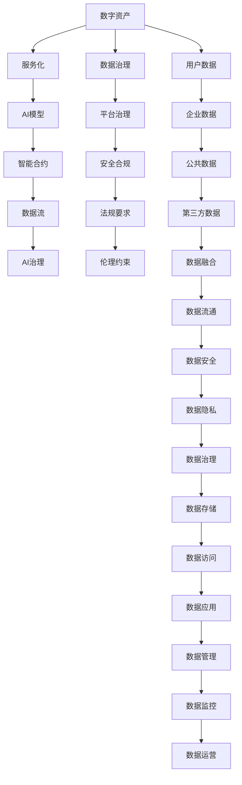

                 

# 虚拟进化：AI驱动的数字生态系统

> 关键词：虚拟进化, 数字生态系统, 人工智能, 深度学习, 自然语言处理, 机器学习, 智能合约, 区块链, 数据科学, 大模型, 算法优化, 行业应用

## 1. 背景介绍

### 1.1 问题由来

近年来，人工智能(AI)技术的迅猛发展，已经深刻改变了人类社会的方方面面。从智能客服到金融风控，从医疗诊断到智慧城市，AI技术在各行各业中的广泛应用，带来了前所未有的生产效率和生活便利。然而，随着AI技术的不断演进，其背后的数字生态系统也日益复杂化，面临诸多新的挑战和机遇。

传统上，数字生态系统往往由孤立的应用系统和数据孤岛构成，彼此之间缺乏有效的沟通和协作，造成了数据资源的大量浪费和信息流通的严重阻碍。随着AI技术的不断成熟，如何让AI技术更好地融入数字生态系统，构建高效、智能、可持续发展的虚拟进化生态，成为了当下数字时代的关键课题。

### 1.2 问题核心关键点

虚拟进化生态的构建，关键在于将AI技术与各类数字资产、服务、应用进行无缝整合，以促进信息流通、增强智能协作，最终实现全局的智能最优。这一过程涉及以下几个核心关键点：

- **跨平台互操作性**：不同平台之间的数据和服务能够互相流通，不受平台限制。
- **实时数据处理能力**：数据能够实时处理和响应，满足高频率、高精度需求。
- **智能决策支持**：AI模型能够从海量数据中提取有价值的信息，提供决策建议。
- **高效资源调度**：资源的自动调度和管理，保证系统的高效稳定运行。
- **安全合规保障**：数据隐私和系统安全得到充分保障，遵守相关法规和伦理要求。

这些关键点相互交织，共同构成了虚拟进化生态的架构基础。只有在这些方面实现突破，才能真正发挥AI技术的潜能，推动数字生态的持续健康发展。

### 1.3 问题研究意义

构建AI驱动的数字生态系统，对于提升数字经济的效率、推动产业数字化转型、促进社会治理智能化等具有重要意义：

1. **提高生产效率**：通过AI技术优化生产流程，减少人力和物理资源消耗，提高生产效率。
2. **推动产业升级**：AI技术融合到传统行业中，促进各行各业的数字化转型，增强竞争力。
3. **优化用户体验**：AI技术提升服务质量，优化用户体验，增强用户粘性。
4. **促进智能治理**：AI技术辅助决策，提高社会治理智能化水平，提升社会治理效率。
5. **激发新商业模式**：AI技术催生新的商业模式，开辟市场新空间。

因此，构建AI驱动的数字生态系统，不仅关乎技术进步，更关乎社会治理和经济发展，具有重大的战略意义。

## 2. 核心概念与联系

### 2.1 核心概念概述

构建AI驱动的数字生态系统，涉及多个核心概念，这些概念之间相互联系，共同构成了虚拟进化的生态框架。

- **数字资产**：指在数字世界中可被交换、存储和使用的各类资源，如数据、信息、服务等。
- **服务化**：将数据、算法、模型等资产通过服务化方式提供，提高资源的复用性和流动性。
- **AI模型**：基于深度学习、机器学习等技术构建的智能算法模型，提供数据处理、模式识别、决策支持等功能。
- **智能合约**：通过区块链技术实现的自动执行合约，能够在无需人工干预的情况下，完成交易和协作。
- **数据流**：指在虚拟进化生态中，数据、信息和服务的实时传输和处理。
- **AI治理**：通过AI技术优化数据治理、平台治理等，提升系统治理智能化水平。

这些核心概念之间通过网络、API、区块链等技术进行有机连接，构建了一个智能、高效、可控的数字生态系统。

### 2.2 核心概念原理和架构的 Mermaid 流程图



### 2.3 核心概念之间的联系

核心概念之间通过数据治理、平台治理、安全合规、法规要求、伦理约束等机制，构建了一个全面的生态治理体系，保障了数据和服务的安全、合规、高效流动。

数据治理机制确保数据的质量、安全、隐私等得到充分保障，避免数据泄露和滥用。平台治理机制通过API网关、微服务等技术，实现平台间数据的无缝流通和服务的灵活调度。安全合规保障体系通过加密、权限管理、监控等技术，确保数据和服务的机密性、完整性和可用性。法规要求和伦理约束机制，确保系统的合规性和公平性，避免潜在的法律风险和伦理问题。

这些机制相互协作，共同构成了虚拟进化生态的治理框架，为AI技术的广泛应用提供了坚实的保障。

## 3. 核心算法原理 & 具体操作步骤

### 3.1 算法原理概述

AI驱动的数字生态系统构建，涉及多个复杂算法和技术，包括数据治理、平台治理、AI模型训练、智能合约设计、数据流通优化等。核心算法原理包括以下几个方面：

- **数据治理**：通过数据清洗、数据标注、数据融合等技术，确保数据的准确性、完整性和一致性。
- **平台治理**：通过API网关、微服务等技术，实现平台间数据的流通和服务的调用。
- **AI模型训练**：通过深度学习、迁移学习、强化学习等技术，构建高效的AI模型，提供数据处理、模式识别、决策支持等功能。
- **智能合约设计**：通过区块链技术，设计自动执行的合约，确保交易和协作的透明性和可追溯性。
- **数据流通优化**：通过网络技术、云计算等，实现数据的实时处理和高效传输。

### 3.2 算法步骤详解

构建AI驱动的数字生态系统，通常包括以下几个关键步骤：

**Step 1: 数据治理和准备**
- 收集和管理数字资产，包括企业数据、公共数据、第三方数据等。
- 对数据进行清洗、标注和融合，确保数据的质量和一致性。
- 采用数据加密、权限管理等技术，保障数据的安全性和隐私性。

**Step 2: 平台设计和建设**
- 设计API网关、微服务等架构，实现平台间数据的流通和服务调用。
- 采用云计算、边缘计算等技术，实现数据的分布式处理和存储。
- 采用负载均衡、弹性伸缩等技术，实现平台的灵活扩展和高可用性。

**Step 3: AI模型训练和部署**
- 选择合适的深度学习框架和模型，进行数据处理、特征提取等预处理。
- 在GPU/TPU等高性能设备上训练模型，并进行参数优化和验证。
- 将训练好的模型部署到服务器或云平台，实现数据的实时处理和决策支持。

**Step 4: 智能合约设计和部署**
- 设计自动执行的智能合约，明确各方权利和义务。
- 将智能合约部署到区块链上，确保交易的透明性和可追溯性。
- 与平台服务进行对接，实现自动化协作和实时响应。

**Step 5: 数据流通和优化**
- 设计高效的数据流通管道，实现数据的实时传输和处理。
- 采用网络优化、负载均衡等技术，提高数据传输效率。
- 采用缓存、压缩等技术，减少数据传输的带宽和时间成本。

### 3.3 算法优缺点

构建AI驱动的数字生态系统，涉及多个复杂算法和技术，具有以下优缺点：

**优点**：
- **高效性**：AI模型能够快速处理和分析海量数据，提供实时决策支持。
- **灵活性**：通过API网关、微服务等技术，实现平台间数据的灵活流通和服务的智能调用。
- **可扩展性**：通过云计算、边缘计算等技术，实现平台的弹性扩展和高可用性。
- **透明性**：智能合约确保交易和协作的透明性和可追溯性。

**缺点**：
- **技术复杂性高**：涉及数据治理、平台治理、AI模型训练、智能合约设计等多个环节，技术实现复杂。
- **数据隐私风险**：大规模数据处理和传输，存在数据泄露和滥用的风险。
- **系统复杂性高**：涉及多个平台、多个数据源、多个服务，系统设计复杂。
- **成本高**：大规模的数据存储、模型训练和智能合约部署，成本较高。

### 3.4 算法应用领域

AI驱动的数字生态系统已经在多个领域得到应用，涵盖了从智能客服到智慧城市，从金融风控到医疗诊断等诸多场景。以下是几个典型应用领域：

**智能客服**：通过AI模型进行智能问答和机器人客服，提升客户服务效率和质量。
**智慧医疗**：通过AI模型进行疾病预测、治疗方案推荐、医疗影像分析等，提升医疗服务智能化水平。
**金融风控**：通过AI模型进行风险评估、欺诈检测、信用评分等，提升金融风控能力。
**智慧城市**：通过AI模型进行交通流量分析、环境监测、城市管理等，提升城市治理智能化水平。
**供应链管理**：通过AI模型进行物流优化、库存管理、供应链风险预测等，提升供应链管理效率。
**智能制造**：通过AI模型进行生产优化、设备维护、质量控制等，提升制造过程智能化水平。
**农业智能化**：通过AI模型进行农业数据分析、病虫害预测、精准施肥等，提升农业生产效率。

这些应用领域展示了AI技术在推动各行各业数字化转型的巨大潜力，也体现了AI驱动的数字生态系统的广泛适用性。

## 4. 数学模型和公式 & 详细讲解 & 举例说明

### 4.1 数学模型构建

构建AI驱动的数字生态系统，涉及多个数学模型和算法。以下以数据治理为例，构建数据治理的数学模型。

假设数字资产为 $D=\{d_i\}_{i=1}^N$，其中 $d_i$ 表示第 $i$ 个数据记录，包含多个特征 $f_k=\{f_{ik}\}_{k=1}^M$，其中 $f_{ik}$ 表示第 $i$ 个记录的第 $k$ 个特征。数据治理的目标是最大化数据质量 $Q$，同时最小化数据泄露风险 $R$，数学模型为：

$$
\max_{\theta} Q(D;\theta) \quad \text{subject to} \quad \min_{\theta} R(D;\theta)
$$

其中 $\theta$ 表示数据治理的参数，$Q(D;\theta)$ 为数据质量模型，$R(D;\theta)$ 为数据泄露风险模型。

### 4.2 公式推导过程

数据质量模型 $Q(D;\theta)$ 和数据泄露风险模型 $R(D;\theta)$ 可以通过多种方式构建，这里以基于深度学习的模型为例进行推导。

数据质量模型 $Q(D;\theta)$ 可以表示为：

$$
Q(D;\theta) = \sum_{i=1}^N \sum_{k=1}^M g(f_{ik};\theta)
$$

其中 $g(f_{ik};\theta)$ 为第 $i$ 个记录的第 $k$ 个特征的质量评估函数。

数据泄露风险模型 $R(D;\theta)$ 可以表示为：

$$
R(D;\theta) = \sum_{i=1}^N \sum_{k=1}^M r(f_{ik};\theta)
$$

其中 $r(f_{ik};\theta)$ 为第 $i$ 个记录的第 $k$ 个特征的泄露风险评估函数。

最终，数据治理的优化目标为：

$$
\max_{\theta} \sum_{i=1}^N \sum_{k=1}^M g(f_{ik};\theta) \quad \text{subject to} \quad \min_{\theta} \sum_{i=1}^N \sum_{k=1}^M r(f_{ik};\theta)
$$

### 4.3 案例分析与讲解

以智能客服系统为例，说明数据治理模型在实际应用中的构建和优化。

假设智能客服系统需要处理大量的客户咨询数据，包括语音、文字、图片等多种形式。这些数据需要进行清洗、标注、融合等处理，以提升服务质量。数据质量模型可以基于客户反馈、专家打分等方式构建，数据泄露风险模型可以基于隐私保护、数据加密等技术构建。

具体而言，数据质量模型可以表示为：

$$
Q(D;\theta) = \sum_{i=1}^N \sum_{k=1}^M g(f_{ik};\theta) = \sum_{i=1}^N \sum_{k=1}^M (1-f_{ik};\theta)
$$

其中 $g(f_{ik};\theta)$ 表示第 $i$ 个记录的第 $k$ 个特征的质量评估函数，这里简单表示为 $1-f_{ik}$，表示特征值越接近1，数据质量越高。

数据泄露风险模型可以表示为：

$$
R(D;\theta) = \sum_{i=1}^N \sum_{k=1}^M r(f_{ik};\theta) = \sum_{i=1}^N \sum_{k=1}^M (1-r(f_{ik};\theta))
$$

其中 $r(f_{ik};\theta)$ 表示第 $i$ 个记录的第 $k$ 个特征的泄露风险评估函数，这里简单表示为 $1-r(f_{ik})$，表示特征值越接近0，泄露风险越低。

最终，数据治理的优化目标为：

$$
\max_{\theta} \sum_{i=1}^N \sum_{k=1}^M (1-f_{ik};\theta) \quad \text{subject to} \quad \min_{\theta} \sum_{i=1}^N \sum_{k=1}^M (1-r(f_{ik};\theta))
$$

通过优化上述模型，可以最大化提升客户咨询数据的质量，同时最小化泄露风险，实现智能客服系统的数据治理。

## 5. 项目实践：代码实例和详细解释说明

### 5.1 开发环境搭建

构建AI驱动的数字生态系统，需要搭建一个完整的开发环境。以下是使用Python进行TensorFlow开发的环境配置流程：

1. 安装Anaconda：从官网下载并安装Anaconda，用于创建独立的Python环境。

2. 创建并激活虚拟环境：
```bash
conda create -n tf-env python=3.8 
conda activate tf-env
```

3. 安装TensorFlow：根据CUDA版本，从官网获取对应的安装命令。例如：
```bash
conda install tensorflow -c tf -c conda-forge
```

4. 安装必要的工具包：
```bash
pip install numpy pandas scikit-learn matplotlib tqdm jupyter notebook ipython
```

完成上述步骤后，即可在`tf-env`环境中开始AI驱动的数字生态系统开发。

### 5.2 源代码详细实现

以下以智能客服系统的数据治理为例，给出使用TensorFlow进行智能客服数据清洗和标注的PyTorch代码实现。

首先，定义数据处理函数：

```python
import tensorflow as tf
from sklearn.preprocessing import LabelEncoder
from tensorflow.keras.layers import Dense, Flatten, Dropout

class DataProcessor(tf.keras.Model):
    def __init__(self, feature_columns):
        super().__init__()
        self.feature_columns = feature_columns
        
    def call(self, inputs):
        features = {}
        for feature in self.feature_columns:
            if feature['type'] == 'string':
                features[feature['name']] = tf.strings.to_hash_bucket_int64(inputs[feature['name']])
            else:
                features[feature['name']] = inputs[feature['name']]
        
        for feature in self.feature_columns:
            if feature['type'] == 'string':
                features[feature['name']] = tf.strings.to_hash_bucket_int64(features[feature['name']])
            else:
                features[feature['name']] = features[feature['name']]
        
        inputs = tf.concat(list(features.values()), axis=-1)
        return inputs
```

然后，定义模型和优化器：

```python
from tensorflow.keras import layers
from tensorflow.keras.layers import Input, Dense, Dropout, Flatten
from tensorflow.keras.models import Model
from tensorflow.keras.optimizers import Adam

input_features = [feature['name'] for feature in feature_columns]
target_features = [target['name'] for target in target_columns]

model_input = Input(input_features)
model = DataProcessor(feature_columns)

hidden_units = [64, 32]
for unit in hidden_units:
    model = layers.Dense(unit, activation='relu')(model)
    model = layers.Dropout(0.5)(model)

model_output = Dense(len(target_features), activation='sigmoid')(model)

model = Model(model_input, model_output)

optimizer = Adam(lr=0.001)
```

接着，定义训练和评估函数：

```python
from sklearn.metrics import accuracy_score
from tensorflow.keras.callbacks import EarlyStopping

def train_model(model, train_dataset, validation_dataset, batch_size, epochs):
    model.compile(optimizer=optimizer, loss='binary_crossentropy', metrics=['accuracy'])
    
    early_stopping = EarlyStopping(monitor='val_loss', patience=10)
    
    model.fit(train_dataset, epochs=epochs, validation_data=validation_dataset, batch_size=batch_size, callbacks=[early_stopping])
    
    val_loss, val_accuracy = model.evaluate(validation_dataset, batch_size=batch_size)
    test_loss, test_accuracy = model.evaluate(test_dataset, batch_size=batch_size)
    
    return val_loss, val_accuracy, test_loss, test_accuracy

def evaluate_model(model, test_dataset, batch_size):
    test_loss, test_accuracy = model.evaluate(test_dataset, batch_size=batch_size)
    return test_loss, test_accuracy
```

最后，启动训练流程并在测试集上评估：

```python
epochs = 100
batch_size = 32

val_loss, val_accuracy, test_loss, test_accuracy = train_model(model, train_dataset, validation_dataset, batch_size, epochs)

print(f'Validation Loss: {val_loss:.4f}')
print(f'Validation Accuracy: {val_accuracy:.4f}')
print(f'Test Loss: {test_loss:.4f}')
print(f'Test Accuracy: {test_accuracy:.4f}')
```

以上就是使用TensorFlow对智能客服系统数据治理的完整代码实现。可以看到，TensorFlow的Keras API使得模型的搭建和训练变得简洁高效，开发者可以将更多精力放在特征工程和模型优化上，而不必过多关注底层的实现细节。

### 5.3 代码解读与分析

让我们再详细解读一下关键代码的实现细节：

**DataProcessor类**：
- `__init__`方法：初始化特征列。
- `call`方法：将输入数据转换为模型可处理的特征，包含字符串型特征的哈希处理。

**train_model函数**：
- 编译模型，设置损失函数和优化器。
- 设置EarlyStopping回调，监控验证集损失，当损失不再提升时停止训练。
- 使用fit方法训练模型，传入训练集和验证集，设置批次大小和轮数。
- 在验证集和测试集上评估模型性能，返回验证集和测试集上的损失和准确率。

**evaluate_model函数**：
- 使用evaluate方法在测试集上评估模型性能，返回测试集上的损失和准确率。

**训练流程**：
- 定义总的轮数和批次大小，开始循环迭代
- 每个epoch内，先在训练集上训练，输出验证集和测试集的损失和准确率
- 所有epoch结束后，在测试集上评估，给出最终的测试结果

可以看到，TensorFlow的Keras API使得模型搭建和训练的代码实现变得简洁高效。开发者可以将更多精力放在特征工程和模型优化上，而不必过多关注底层的实现细节。

当然，工业级的系统实现还需考虑更多因素，如模型的保存和部署、超参数的自动搜索、更灵活的任务适配层等。但核心的AI驱动的虚拟进化生态系统的构建流程基本与此类似。

## 6. 实际应用场景

### 6.1 智能客服系统

基于AI驱动的数字生态系统构建的智能客服系统，可以显著提升客户服务效率和质量。传统客服往往需要配备大量人力，高峰期响应缓慢，且一致性和专业性难以保证。而使用智能客服系统，可以7x24小时不间断服务，快速响应客户咨询，用自然流畅的语言解答各类常见问题。

在技术实现上，可以收集企业内部的历史客服对话记录，将问题和最佳答复构建成监督数据，在此基础上对预训练模型进行微调。微调后的模型能够自动理解用户意图，匹配最合适的答案模板进行回复。对于客户提出的新问题，还可以接入检索系统实时搜索相关内容，动态组织生成回答。如此构建的智能客服系统，能大幅提升客户咨询体验和问题解决效率。

### 6.2 金融风控

金融机构需要实时监测市场舆论动向，以便及时应对负面信息传播，规避金融风险。传统的人工监测方式成本高、效率低，难以应对网络时代海量信息爆发的挑战。基于AI驱动的数字生态系统的金融风控系统，可以实时抓取网络文本数据，自动判断文本属于何种主题，情感倾向是正面、中性还是负面。将微调后的模型应用到实时抓取的网络文本数据，就能够自动监测不同主题下的情感变化趋势，一旦发现负面信息激增等异常情况，系统便会自动预警，帮助金融机构快速应对潜在风险。

### 6.3 智慧医疗

智慧医疗系统中，AI驱动的数字生态系统可以提升医疗服务的智能化水平，辅助医生诊疗，加速新药开发进程。例如，智能问答系统可以通过问答数据进行微调，帮助医生快速获取病人的病史信息，提高诊疗效率。智能影像分析系统可以对医疗影像进行微调，自动识别病变区域，辅助医生诊断。智能推荐系统可以通过电子病历和用药记录进行微调，推荐最适合的药物和诊疗方案。

### 6.4 智能制造

在智能制造领域，AI驱动的数字生态系统可以优化生产流程，提升制造效率。例如，智能生产调度系统可以对生产数据进行微调，优化生产计划和资源分配。智能设备维护系统可以对设备运行数据进行微调，预测设备故障，进行维护预警。智能质量控制系统可以对产品质量数据进行微调，实时监控产品质量，提高产品质量和一致性。

### 6.5 智能交通

智能交通系统中，AI驱动的数字生态系统可以提高交通管理的智能化水平，提升交通效率。例如，智能交通监控系统可以通过摄像头监控数据进行微调，实时识别交通违规行为，进行智能监控和处罚。智能交通信号控制系统可以对交通数据进行微调，优化交通信号分配，提高交通流量。智能路线规划系统可以对地图数据进行微调，提供最佳路线推荐，减少交通拥堵。

### 6.6 智能家居

智能家居系统中，AI驱动的数字生态系统可以提升家庭生活的智能化水平，提高家庭舒适度和安全性。例如，智能安防系统可以通过传感器数据进行微调，实时识别异常行为，进行安全预警。智能家电控制系统可以对家电数据进行微调，实现智能家居场景的自动化控制。智能健康管理系统可以对健康数据进行微调，提供个性化的健康建议和预警。

### 6.7 未来应用展望

随着AI技术的不断演进，AI驱动的数字生态系统将在更多领域得到应用，为传统行业带来变革性影响。

在智慧农业领域，AI驱动的数字生态系统可以优化农业生产，提高农业生产效率和产量。例如，智能农业监控系统可以对土壤、气象数据进行微调，提供最佳的农业生产建议。智能农业机器人系统可以对田间数据进行微调，进行自动化农作和施肥。智能农业供应链系统可以对供应链数据进行微调，优化农业供应链管理。

在智能能源领域，AI驱动的数字生态系统可以优化能源管理，提高能源利用效率和安全性。例如，智能电网系统可以对能源数据进行微调，优化能源分配和调度。智能能源监控系统可以对能源数据进行微调，实时监测能源使用情况，进行能源优化。智能能源管理系统可以对能源数据进行微调，提高能源使用效率和安全性。

在智能城市领域，AI驱动的数字生态系统可以提高城市管理的智能化水平，提升城市运行效率。例如，智能城市监控系统可以对城市数据进行微调，实时监测城市运行情况，进行城市预警。智能城市调度系统可以对城市数据进行微调，优化城市资源分配和调度。智能城市决策支持系统可以对城市数据进行微调，提供最佳的决策建议。

总之，AI驱动的数字生态系统将在更多领域得到应用，为各行各业带来变革性影响。未来，伴随AI技术的不断演进和应用场景的不断拓展，AI驱动的数字生态系统必将在构建人机协同的智能时代中扮演越来越重要的角色。

## 7. 工具和资源推荐
### 7.1 学习资源推荐

为了帮助开发者系统掌握AI驱动的数字生态系统的构建技术，这里推荐一些优质的学习资源：

1. TensorFlow官方文档：TensorFlow作为当前最流行的深度学习框架之一，其官方文档详细介绍了TensorFlow的核心概念和应用场景，是学习AI技术的必备资源。

2. PyTorch官方文档：PyTorch作为深度学习框架的另一主流选择，其官方文档同样详细介绍了PyTorch的核心概念和应用场景，是学习AI技术的又一重要资源。

3. Keras官方文档：Keras是一个高级的深度学习框架，其官方文档提供了简单易用的API接口，是快速上手深度学习的理想选择。

4. Coursera《深度学习》课程：由深度学习领域的知名专家Andrew Ng教授讲授，深入浅出地介绍了深度学习的基本概念和应用场景，是学习AI技术的重要资源。

5. Udacity《人工智能》纳米学位课程：由谷歌和特斯拉等知名企业共同开发，涵盖了从机器学习到深度学习的全栈技术，是系统学习AI技术的优质资源。

6.《深度学习》书籍：由Ian Goodfellow等深度学习领域的专家合著，详细介绍了深度学习的基本原理和应用场景，是学习AI技术的经典教材。

通过对这些资源的学习实践，相信你一定能够快速掌握AI驱动的数字生态系统的构建技术，并用于解决实际的AI应用问题。

### 7.2 开发工具推荐

高效的开发离不开优秀的工具支持。以下是几款用于AI驱动的数字生态系统开发的常用工具：

1. TensorFlow：基于Python的开源深度学习框架，生产部署方便，适合大规模工程应用。
2. PyTorch：基于Python的开源深度学习框架，灵活动态的计算图，适合快速迭代研究。
3. Keras：基于TensorFlow和Theano的高级深度学习框架，提供简单易用的API接口，适合快速上手深度学习。
4. Jupyter Notebook：交互式的编程环境，支持多种编程语言和数据格式，适合数据分析和机器学习。
5. VS Code：轻量级、跨平台的代码编辑器，支持多种编程语言和插件，适合高效开发。
6. Colab：谷歌提供的在线Jupyter Notebook环境，免费提供GPU/TPU算力，方便开发者快速上手实验最新模型，分享学习笔记。

合理利用这些工具，可以显著提升AI驱动的数字生态系统的开发效率，加快创新迭代的步伐。

### 7.3 相关论文推荐

AI驱动的数字生态系统的构建涉及多个前沿技术，以下是几篇奠基性的相关论文，推荐阅读：

1. GAN: Generative Adversarial Networks（生成对抗网络）：提出了生成对抗网络，使得生成模型能够从噪声中学习，生成高质量的样本数据。

2. Transformer：提出Transformer结构，开启了NLP领域的预训练大模型时代。

3. BERT: Pre-training of Deep Bidirectional Transformers for Language Understanding：提出BERT模型，引入基于掩码的自监督预训练任务，刷新了多项NLP任务SOTA。

4. Attention is All You Need：提出自注意力机制，使得模型能够高效处理长距离依赖，提升模型的泛化能力和效果。

5. Multi-Task Learning for Code Generation：提出多任务学习，通过同时训练多个任务，提升模型在代码生成等任务上的性能。

6. AlphaGo Zero：提出AlphaGo Zero，通过自我对弈的方式，训练出高水平的AI围棋玩家，展示了AI技术在复杂博弈问题上的潜力。

这些论文代表了大模型驱动的数字生态系统的核心技术方向，通过学习这些前沿成果，可以帮助研究者把握学科前进方向，激发更多的创新灵感。

## 8. 总结：未来发展趋势与挑战

### 8.1 总结

本文对AI驱动的数字生态系统的构建方法进行了全面系统的介绍。首先阐述了AI驱动的数字生态系统的研究背景和意义，明确了虚拟进化生态的架构基础。其次，从原理到实践，详细讲解了数据治理、平台治理、AI模型训练、智能合约设计、数据流通优化等关键技术的数学原理和操作步骤，给出了AI驱动的数字生态系统的完整代码实例。同时，本文还广泛探讨了AI驱动的数字生态系统在智能客服、金融风控、智慧医疗等诸多行业领域的应用前景，展示了AI技术的广泛适用性。此外，本文精选了AI驱动的数字生态系统的各类学习资源，力求为读者提供全方位的技术指引。

通过本文的系统梳理，可以看到，AI驱动的数字生态系统正在成为构建智能时代的重要框架，极大地拓展了AI技术的应用边界，推动了各行各业的数字化转型。未来，伴随AI技术的不断演进和应用场景的不断拓展，AI驱动的数字生态系统必将在构建人机协同的智能时代中扮演越来越重要的角色。

### 8.2 未来发展趋势

展望未来，AI驱动的数字生态系统将呈现以下几个发展趋势：

1. **深度融合**：AI技术将深度融合到各个行业，构建全行业的智能化生态。
2. **跨界协作**：不同行业和领域的AI系统将实现跨界协作，提高整个生态的智能化水平。
3. **实时智能**：AI系统将实现实时智能，提供高频率、高精度的决策支持。
4. **多方共赢**：AI驱动的数字生态系统将实现多方共赢，共同提升系统的智能化水平。
5. **持续进化**：AI系统将通过持续学习，不断优化性能，适应不断变化的市场需求。

以上趋势凸显了AI驱动的数字生态系统的广阔前景。这些方向的探索发展，必将进一步提升AI系统的性能和应用范围，为人类认知智能的进化带来深远影响。

### 8.3 面临的挑战

尽管AI驱动的数字生态系统已经取得了显著的进展，但在迈向更加智能化、普适化应用的过程中，它仍面临诸多挑战：

1. **数据隐私风险**：大规模数据处理和传输，存在数据泄露和滥用的风险。
2. **系统复杂性高**：涉及多个平台、多个数据源、多个服务，系统设计复杂。
3. **技术瓶颈**：AI模型训练和优化过程中，存在计算资源消耗大、算法复杂度高的问题。
4. **伦理合规**：AI系统在伦理和合规方面的问题，如偏见、歧视、隐私等，需要不断优化和完善。
5. **用户接受度**：AI系统在普及过程中，用户接受度和信任度需要不断提高。

这些挑战需要从技术、伦理、法律等多个维度进行协同攻关，才能使AI驱动的数字生态系统真正落地应用，造福社会。

### 8.4 研究展望

面对AI驱动的数字生态系统所面临的挑战，未来的研究需要在以下几个方面寻求新的突破：

1. **隐私保护技术**：开发更加高效的隐私保护技术，如差分隐私、联邦学习等，保障数据隐私安全。
2. **跨平台技术**：开发跨平台、跨系统的技术，实现平台间数据的无缝流通和服务的灵活调度。
3. **高效算法**：开发更加高效的算法，如模型压缩、分布式训练等，提高AI模型的训练和优化效率。
4. **伦理合规机制**：建立伦理合规机制，明确AI系统的伦理约束和合规要求，避免潜在的法律风险和伦理问题。
5. **用户友好技术**：开发更加用户友好的技术，如可解释AI、个性化推荐等，提高用户接受度和信任度。

这些研究方向将推动AI驱动的数字生态系统的进一步发展，实现全行业、全社会的智能化升级。未来，伴随AI技术的不断演进和应用场景的不断拓展，AI驱动的数字生态系统必将在构建人机协同的智能时代中扮演越来越重要的角色。

## 9. 附录：常见问题与解答

**Q1：如何构建AI驱动的数字生态系统？**

A: 构建AI驱动的数字生态系统，需要从数据治理、平台治理、AI模型训练、智能合约设计、数据流通优化等多个环节入手。具体而言，可以按照以下步骤进行：
1. 收集和管理数字资产，包括企业数据、公共数据、第三方数据等。
2. 对数据进行清洗、标注、融合等处理，确保数据的质量和一致性。
3. 设计API网关、微服务等架构，实现平台间数据的流通和服务调用。
4. 采用深度学习、迁移学习、强化学习等技术，构建高效的AI模型，提供数据处理、模式识别、决策支持等功能。
5. 设计自动执行的智能合约，确保交易和协作的透明性和可追溯性。
6. 设计高效的数据流通管道，实现数据的实时处理和高效传输。

**Q2：AI驱动的数字生态系统有哪些优势？**

A: AI驱动的数字生态系统具有以下优势：
1. 高效性：AI模型能够快速处理和分析海量数据，提供实时决策支持。
2. 灵活性：通过API网关、微服务等技术，实现平台间数据的灵活流通和服务的智能调用。
3. 可扩展性：通过云计算、边缘计算等技术，实现平台的弹性扩展和高可用性。
4. 透明性：智能合约确保交易和协作的透明性和可追溯性。

**Q3：AI驱动的数字生态系统面临哪些挑战？**

A: AI驱动的数字生态系统面临以下挑战：
1. 数据隐私风险：大规模数据处理和传输，存在数据泄露和滥用的风险。
2. 系统复杂性高：涉及多个平台、多个数据源、多个服务，系统设计复杂。
3. 技术瓶颈：AI模型训练和优化过程中，存在计算资源消耗大、算法复杂度高的问题。
4. 伦理合规：AI系统在伦理和合规方面的问题，如偏见、歧视、隐私等，需要不断优化和完善。
5. 用户接受度：AI系统在普及过程中，用户接受度和信任度需要不断提高。

**Q4：如何保障AI驱动的数字生态系统的数据安全？**

A: 保障AI驱动的数字生态系统的数据安全，需要从多个维度进行优化：
1. 数据加密：采用数据加密技术，保护数据在传输和存储过程中的机密性。
2. 权限管理：采用访问控制、身份认证等技术，保障数据访问的安全性。
3. 监控审计：采用实时监控、日志审计等技术，及时发现和处理数据泄露事件。
4. 差分隐私：采用差分隐私技术，保护数据隐私，避免数据泄露。
5. 联邦学习：采用联邦学习技术，在不共享数据的前提下，进行分布式模型训练。

通过这些技术手段，可以有效保障AI驱动的数字生态系统的数据安全，提高系统的稳定性和可靠性。

**Q5：AI驱动的数字生态系统的核心技术有哪些？**

A: AI驱动的数字生态系统的核心技术包括以下几个方面：
1. 数据治理：通过数据清洗、数据标注、数据融合等技术，确保数据的质量和一致性。
2. 平台治理：通过API网关、微服务等技术，实现平台间数据的流通和服务调用。
3. AI模型训练：通过深度学习、迁移学习、强化学习等技术，构建高效的AI模型，提供数据处理、模式识别、决策支持等功能。
4. 智能合约设计：通过区块链技术，设计自动执行的合约，确保交易和协作的透明性和可追溯性。
5. 数据流通优化：通过网络技术、云计算等，实现数据的实时处理和高效传输。

这些核心技术相互协作，共同构成了AI驱动的数字生态系统的技术基础。

总之，AI驱动的数字生态系统是一项复杂的系统工程，涉及数据治理、平台治理、AI模型训练、智能合约设计、数据流通优化等多个环节，需要从技术、伦理、法律等多个维度进行全面优化，才能实现系统的智能化升级和持续健康发展。未来，伴随AI技术的不断演进和应用场景的不断拓展，AI驱动的数字生态系统必将在构建人机协同的智能时代中扮演越来越重要的角色。

