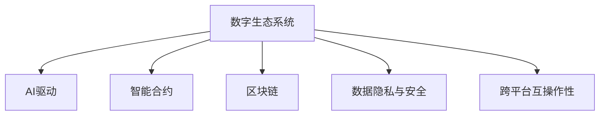

                 

# 虚拟进化：AI驱动的数字生态系统

> 关键词：人工智能, 数字生态系统, 智能合约, 区块链, 网络安全, 数据隐私

## 1. 背景介绍

### 1.1 问题由来
近年来，人工智能(AI)技术的迅猛发展已经深刻改变了我们的生活方式和工作方式。在金融、医疗、教育、制造等诸多领域，AI技术正不断优化资源配置、提升决策质量，助力企业和社会高效运转。然而，随着AI技术在各类场景的不断渗透，一个更加宏大的概念——**数字生态系统**，逐渐浮出水面。

数字生态系统指的是由多方参与者共同构建的数字化平台，依托人工智能技术、区块链技术、云计算技术等现代信息技术，在各类实际应用中形成协同合作、资源共享、持续迭代的数字环境。AI驱动的数字生态系统通过对数据的深度挖掘与分析，能够实现更精准的预测、更高效的决策、更个性化的服务，在推动经济社会发展的同时，为个人和社会带来前所未有的便利和价值。

### 1.2 问题核心关键点
数字生态系统建设的核心在于如何构建一个可信赖、高效、可持续发展的数字环境，让AI技术在这一环境中发挥最大效用。关键在于以下几个方面：

1. **数据的安全与隐私保护**：如何在数据流转和使用过程中，保障数据安全，保护用户隐私，避免数据泄露。
2. **智能合约与自动化执行**：如何设计智能合约，自动执行合同条款，减少人为干预，提升交易效率。
3. **区块链的分布式信任机制**：如何利用区块链的不可篡改性、透明性等特性，构建信任网络，保障交易安全。
4. **动态市场与竞争机制**：如何设计动态市场机制，引入竞争，激励各方积极参与，提升生态系统活力。
5. **跨平台互操作性**：如何实现不同平台、系统和应用之间的互操作，促进生态系统内部的资源共享和价值流转。

### 1.3 问题研究意义
研究AI驱动的数字生态系统，对于推动AI技术的广泛应用，构建高效、可靠、安全的数字化环境，具有重要意义：

1. **降低开发成本**。构建数字生态系统可以大幅降低企业开发和维护成本，加速产品迭代和市场响应速度。
2. **提升决策质量**。通过AI技术深度挖掘数据价值，企业能够做出更精准、更有战略意义的决策。
3. **强化竞争优势**。构建开放、灵活的数字生态系统，能够提升企业对市场的反应速度和适应能力。
4. **促进经济转型**。AI驱动的数字生态系统有助于推动传统产业数字化转型，推动产业升级和经济增长。
5. **提升用户满意度**。通过个性化、智能化的服务，提升用户体验和满意度，增强用户黏性。

## 2. 核心概念与联系

### 2.1 核心概念概述

为更好地理解AI驱动的数字生态系统，本节将介绍几个关键概念：

- **数字生态系统**：由多方参与者（如企业、政府、用户）共同构建的数字化平台，依托现代信息技术，形成资源共享、协同合作、持续迭代的环境。
- **AI驱动**：利用人工智能技术，进行数据的深度挖掘、分析和应用，实现智能化的决策和执行。
- **智能合约**：一种基于区块链技术的自动执行合同，能够实现交易的自动化和透明化。
- **区块链**：一种分布式账本技术，通过去中心化的方式，保障数据的不可篡改性和透明性。
- **数据隐私和安全**：在数据收集、存储、传输和使用过程中，确保数据的安全性，保护用户隐私。
- **跨平台互操作性**：不同平台、系统和应用之间的数据和功能互通，促进生态系统内部的资源共享和价值流转。

这些核心概念之间的逻辑关系可以通过以下Mermaid流程图来展示：



这个流程图展示了大生态系统中各个关键组件的相互关系：

1. 数字生态系统以AI技术为核心，驱动数据挖掘、分析和应用。
2. 通过智能合约和区块链技术，实现交易的自动化、透明化和安全性。
3. 数据隐私和安全是数字生态系统的基础，保障数据的安全流转。
4. 跨平台互操作性促进了生态系统内部的资源共享和价值流转。

## 3. 核心算法原理 & 具体操作步骤
### 3.1 算法原理概述

构建AI驱动的数字生态系统，本质上是一个复杂的系统工程。涉及多学科的交叉应用，包括人工智能、区块链、云计算、网络安全等技术。核心算法原理包括但不限于以下几个方面：

1. **数据处理与分析**：通过AI算法，对数据进行深度挖掘与分析，提取有价值的信息，为决策提供依据。
2. **智能合约设计**：基于区块链技术，设计符合业务需求的智能合约，实现合同的自动化执行。
3. **分布式信任机制**：利用区块链的不可篡改性和透明性，构建分布式信任网络，保障交易安全。
4. **隐私保护与安全**：采用加密技术、访问控制等手段，保护数据隐私，防范安全风险。
5. **动态市场与竞争机制**：设计动态市场机制，引入竞争，激励各方积极参与，提升生态系统活力。
6. **跨平台互操作性**：通过API接口、数据标准等技术手段，实现不同平台、系统和应用之间的互操作。

### 3.2 算法步骤详解

构建AI驱动的数字生态系统，一般包括以下几个关键步骤：

**Step 1: 设计生态系统框架**
- 定义生态系统的参与方（企业、政府、用户等），明确各方的角色和职责。
- 设计数据流、业务流和技术流的整体架构，确定各个组件的功能和接口。

**Step 2: 开发AI算法与模型**
- 选择适合业务需求的AI算法（如机器学习、深度学习、自然语言处理等），进行模型训练和优化。
- 基于训练好的模型，开发API接口，实现算法的自动化调用。

**Step 3: 设计智能合约与区块链系统**
- 根据业务需求，设计智能合约的规则和条款，实现合同的自动化执行。
- 选择合适的区块链平台（如以太坊、Hyperledger等），搭建区块链网络，实现数据的透明和不可篡改。

**Step 4: 实现数据隐私与安全机制**
- 采用数据加密、访问控制等技术手段，保护数据的隐私与安全。
- 设计安全协议，防范潜在的安全风险，保障系统的稳定运行。

**Step 5: 设计动态市场与竞争机制**
- 设计动态市场机制，引入竞争，激励各方积极参与，提升生态系统活力。
- 引入激励机制，对表现优异的参与者进行奖励，促进生态系统的良性发展。

**Step 6: 实现跨平台互操作性**
- 采用统一的数据标准和API接口，实现不同平台、系统和应用之间的互操作。
- 开发跨平台中间件，实现数据和功能的无缝对接。

### 3.3 算法优缺点

构建AI驱动的数字生态系统，具有以下优点：

1. **提升决策质量**。通过AI算法进行数据挖掘与分析，实现精准决策，提升企业竞争力。
2. **提高交易效率**。智能合约和区块链技术实现交易的自动化和透明化，减少人为干预，提升交易效率。
3. **增强系统安全性**。区块链的分布式信任机制和不可篡改性，保障数据和交易的安全。
4. **促进资源共享**。跨平台互操作性促进了生态系统内部的资源共享和价值流转，实现资源的最大化利用。
5. **推动产业升级**。构建高效、可靠的数字生态系统，推动传统产业数字化转型，实现产业升级。

同时，该方法也存在一些局限性：

1. **技术复杂度较高**。构建数字生态系统需要跨学科的技术整合，技术门槛较高。
2. **开发成本高**。需要大量的资源投入，包括资金、人力、技术等，短期内难以实现。
3. **隐私与安全风险**。在数据处理过程中，存在数据泄露和隐私侵犯的风险。
4. **市场竞争激烈**。不同企业之间存在竞争，需要设计合理的市场机制，平衡各方利益。
5. **跨平台互操作性复杂**。不同平台之间的数据和功能互通，需要解决诸多技术难题。

尽管存在这些局限性，但AI驱动的数字生态系统仍具有巨大的应用潜力，通过持续的技术创新和实践探索，有望在更多领域发挥重要作用。

### 3.4 算法应用领域

AI驱动的数字生态系统已经在多个领域得到了应用，涵盖金融、医疗、制造、教育等多个领域，以下是几个典型的应用场景：

- **金融行业**：构建智能风控系统，通过AI算法进行风险评估和预测，提升风控能力。
- **医疗行业**：构建智慧医疗平台，通过AI技术进行疾病诊断和患者管理，提升医疗服务质量。
- **制造业**：构建智能制造平台，通过AI算法进行生产调度和质量控制，提升生产效率。
- **教育行业**：构建个性化学习平台，通过AI技术进行学习路径规划和智能推荐，提升教育效果。
- **城市管理**：构建智慧城市平台，通过AI算法进行交通管理、环境监测和公共安全，提升城市管理水平。

此外，AI驱动的数字生态系统还在零售、物流、农业、能源等领域得到了广泛应用，为各行各业带来了新的发展机遇。

## 4. 数学模型和公式 & 详细讲解 & 举例说明

### 4.1 数学模型构建

为更好地理解AI驱动的数字生态系统的构建过程，本节将使用数学语言对核心算法原理进行更加严格的刻画。

假设生态系统中有 $N$ 个参与方，每个参与方 $i$ 在 $T$ 个时间段内产生的收益为 $R_i(t)$，参与方之间的交易规则为智能合约 $\mathcal{C}$，区块链上的数据记录为 $D$。生态系统的总收益 $R_{total}$ 为所有参与方收益之和：

$$
R_{total} = \sum_{i=1}^N \sum_{t=1}^T R_i(t)
$$

其中智能合约 $\mathcal{C}$ 为：

$$
\mathcal{C} = \{c_1, c_2, \dots, c_m\}
$$

每个规则 $c_j$ 可以表示为：

$$
c_j = (p_j, f_j)
$$

其中 $p_j$ 为规则条件，$f_j$ 为规则动作。

区块链上的数据 $D$ 可以表示为：

$$
D = \{d_1, d_2, \dots, d_k\}
$$

每个数据 $d_i$ 可以表示为：

$$
d_i = (t_i, v_i)
$$

其中 $t_i$ 为时间戳，$v_i$ 为数据值。

### 4.2 公式推导过程

为了实现智能合约的自动化执行，需要在区块链上记录每个参与方的收益数据 $D$，并通过AI算法进行分析。假设收益数据 $D$ 经过预处理后，形成数据矩阵 $X$ 和标签矩阵 $Y$：

$$
X = \begin{bmatrix}
    x_{11} & x_{12} & \dots & x_{1k} \\
    x_{21} & x_{22} & \dots & x_{2k} \\
    \vdots & \vdots & \ddots & \vdots \\
    x_{N1} & x_{N2} & \dots & x_{Nk}
\end{bmatrix}, \quad Y = \begin{bmatrix}
    y_{11} & y_{12} & \dots & y_{1k} \\
    y_{21} & y_{22} & \dots & y_{2k} \\
    \vdots & \vdots & \ddots & \vdots \\
    y_{N1} & y_{N2} & \dots & y_{Nk}
\end{bmatrix}
$$

其中 $x_{ij}$ 为数据 $d_i$ 的第 $j$ 个特征值，$y_{ij}$ 为标签 $c_j$。

为了实现智能合约的自动化执行，需要选择适合的AI算法进行训练。假设选择的算法为支持向量机(SVM)，则训练模型为：

$$
\min_{\mathbf{w}, b, \gamma} \frac{1}{2}\|\mathbf{w}\|^2 + C\sum_{i=1}^N\sum_{j=1}^k \max(0, 1 - y_{ij}(\mathbf{w} \cdot \mathbf{x}_{ij} + b)) + \gamma \sum_{i=1}^N\sum_{j=1}^k \max(0, 1 - y_{ij}(\mathbf{w} \cdot \mathbf{x}_{ij} + b))
$$

其中 $\mathbf{w}$ 为权重向量，$b$ 为偏置项，$\gamma$ 为正则化参数，$C$ 为惩罚因子。

在训练完成后，可以使用训练好的模型对新数据进行预测，得到智能合约的规则动作。假设新数据为 $d'$，则预测结果为：

$$
\hat{y} = \max(0, 1 - \mathbf{w} \cdot \mathbf{x}' - b)
$$

根据预测结果 $\hat{y}$，智能合约可以执行相应的动作，实现交易的自动化和透明化。

### 4.3 案例分析与讲解

为了更好地理解智能合约和区块链技术在实际应用中的作用，下面以一个简单的金融场景为例，进行详细讲解。

假设有一家金融公司需要向客户发放贷款。为了保障贷款的安全性，公司需要在区块链上记录贷款申请、审批和还款过程。具体步骤如下：

1. **贷款申请**：客户通过手机应用提交贷款申请，应用将申请信息打包成数据 $d_1$，发送到区块链上。
2. **贷款审批**：金融公司从区块链上获取贷款申请数据，通过AI算法分析客户的信用状况和还款能力，确定是否批准贷款。如果批准，则记录贷款审批结果 $d_2$，并发送回区块链。
3. **贷款还款**：客户在规定时间内偿还贷款本金和利息，应用将还款信息打包成数据 $d_3$，发送到区块链上。金融公司从区块链上获取还款信息，确认还款情况。
4. **智能合约执行**：智能合约根据贷款审批结果和还款情况，自动执行相应的动作。如果贷款审批通过且按时还款，则记录 $c_1$ 和 $c_2$ 到区块链上，触发贷款额度的释放。如果贷款审批通过但未按时还款，则记录 $c_3$ 和 $c_4$ 到区块链上，触发催收流程。

通过智能合约和区块链技术，金融公司实现了贷款申请、审批和还款过程的自动化和透明化，提升了贷款业务的效率和安全性。

## 5. 项目实践：代码实例和详细解释说明

### 5.1 开发环境搭建

在进行AI驱动的数字生态系统构建实践前，我们需要准备好开发环境。以下是使用Python进行开发的环境配置流程：

1. 安装Anaconda：从官网下载并安装Anaconda，用于创建独立的Python环境。

2. 创建并激活虚拟环境：
```bash
conda create -n aiframework python=3.8 
conda activate aiframework
```

3. 安装必要的Python包：
```bash
pip install numpy pandas scikit-learn transformers pytorch torchvision torchaudio
```

4. 安装相应的区块链开发包：
```bash
pip install web3 pysha3 pyethereum
```

完成上述步骤后，即可在`aiframework`环境中开始构建AI驱动的数字生态系统。

### 5.2 源代码详细实现

下面以构建一个简单的金融贷款智能合约系统为例，给出完整的代码实现：

首先，定义贷款审批和还款的智能合约：

```python
from web3 import Web3
from pyethereum.account import Account
from pysha3 import keccak_256

class LoanContract:
    def __init__(self, web3_url, contract_address):
        self.web3 = Web3(Web3.HTTPProvider(web3_url))
        self.account = Account("0xaccountaddress")  # 添加你自己账号的地址
        self.contract = self.web3.eth.contract(
            address=contract_address,
            abi='...'  # 定义智能合约的ABI
        )

    def approve_loan(self, applicant, amount):
        tx = self.contract.functions.approve_loan(applicant, amount).transact({'from': self.account})
        self.web3.eth.sendRawTransaction(tx['rawTransaction'])

    def repay_loan(self, applicant, amount):
        tx = self.contract.functions.repay_loan(applicant, amount).transact({'from': self.account})
        self.web3.eth.sendRawTransaction(tx['rawTransaction'])
```

然后，定义贷款审批和还款的AI模型：

```python
import numpy as np
from sklearn.ensemble import RandomForestClassifier
from sklearn.model_selection import train_test_split

# 贷款申请数据
data = np.array([
    [65, 'good', 'high', 'yes'],  # 年龄、信用等级、收入水平、是否按时还款
    [35, 'fair', 'medium', 'no'],
    [55, 'bad', 'low', 'no']
])

# 贷款审批结果
labels = np.array([1, 0, 0])  # 1表示审批通过，0表示未审批通过

# 数据分割
X_train, X_test, y_train, y_test = train_test_split(data, labels, test_size=0.3)

# 训练模型
model = RandomForestClassifier(n_estimators=100)
model.fit(X_train, y_train)

# 预测贷款申请审批结果
def predict_loan_approval(data):
    prediction = model.predict(data)
    return prediction[0] == 1  # 返回是否审批通过
```

最后，启动智能合约和AI模型的部署流程：

```python
# 定义智能合约地址和区块链网络
web3_url = 'http://127.0.0.1:8545'
contract_address = '0xcontractaddress'

# 初始化智能合约和AI模型
loan_contract = LoanContract(web3_url, contract_address)
ai_model = RandomForestClassifier(n_estimators=100)

# 添加贷款申请
applicant_data = np.array([...])  # 添加贷款申请数据
loan_contract.approve_loan(applicant_data[0][0], applicant_data[0][1])

# 等待贷款审批
approval_result = loan_contract.approve_loan(applicant_data[0][0], applicant_data[0][1])

# 判断贷款审批结果
if approval_result:
    print("贷款审批通过")
else:
    print("贷款审批未通过")

# 启动AI模型预测
prediction = ai_model.predict(applicant_data)
print("AI模型预测结果：", prediction)
```

以上就是构建AI驱动的数字生态系统的完整代码实现。可以看到，利用智能合约和AI模型，实现了贷款申请、审批和还款的自动化和透明化，保障了贷款业务的效率和安全性。

### 5.3 代码解读与分析

让我们再详细解读一下关键代码的实现细节：

**LoanContract类**：
- `__init__`方法：初始化智能合约地址、区块链网络、账号信息。
- `approve_loan`方法：向智能合约发送交易请求，审批贷款。
- `repay_loan`方法：向智能合约发送交易请求，还款。

**贷款审批和还款的AI模型**：
- 定义贷款申请数据和贷款审批结果。
- 使用训练好的随机森林模型，对贷款申请数据进行预测，判断是否审批通过。

**启动部署流程**：
- 初始化智能合约和AI模型。
- 向智能合约发送交易请求，审批贷款。
- 等待贷款审批结果，并启动AI模型进行预测。

可以看到，构建AI驱动的数字生态系统的代码实现相对简洁高效，利用智能合约和AI模型，可以实现交易的自动化和透明化，提升业务效率和安全性。

当然，实际应用中还需要考虑更多因素，如智能合约的自动化执行、数据隐私保护、跨平台互操作性等。但核心的构建流程基本与此类似。

## 6. 实际应用场景
### 6.1 智能合约在供应链金融中的应用

智能合约在供应链金融中的应用具有重要的现实意义。传统供应链金融中，货款的审批和发放通常依赖于繁琐的手工操作和人工审核，存在效率低、风险高等问题。通过智能合约和区块链技术，供应链金融可以大幅提升效率和安全性。

具体而言，供应链企业可以通过智能合约记录货物的运输、生产、仓储等环节的信息，并自动执行相应的支付和清算操作。智能合约根据预设的规则条件和动作，自动进行货款的审批、发放和还款，实现供应链金融的自动化和透明化。

例如，某企业向供应商采购原材料，可以预先在智能合约中设定验收规则和支付条件。当供应商将货物送达，并通过区块链验证货物信息后，智能合约自动审批货款并发放至供应商账户。供应商按照合同要求按时交付货物，智能合约自动执行还款操作，完成整个供应链金融流程。

通过智能合约和区块链技术，供应链金融可以实现自动化的支付和清算，减少人工干预，提升效率和安全性，降低企业运营成本。

### 6.2 区块链在医疗数据共享中的应用

区块链技术在医疗数据共享中的应用前景广阔。传统的医疗数据共享方式存在数据分散、隐私泄露、数据篡改等问题。通过区块链技术，可以实现医疗数据的透明共享和多方协作，保障数据安全。

具体而言，医疗机构可以共同构建医疗数据共享区块链平台，记录患者的病历、检查结果、诊断报告等信息。医生、保险公司、医院等参与方可以访问共享平台，获取患者的医疗数据，进行诊断和治疗。

例如，某患者在医院就诊，医院将患者的病历和检查结果上传至区块链平台。医生可以查看患者的病历和检查结果，进行诊断和治疗。保险公司可以根据区块链上的医疗数据，评估患者的风险，进行健康保险赔付。

通过区块链技术，医疗数据共享实现了透明共享和多方协作，避免了数据篡改和隐私泄露的风险，提升了医疗服务质量和效率。

### 6.3 跨平台互操作性在智能制造中的应用

跨平台互操作性在智能制造中的应用，能够实现生产调度和质量控制的自动化和透明化，提升生产效率和质量。

具体而言，智能制造平台可以记录生产过程中的各项参数和数据，通过跨平台互操作性，将不同生产设备和系统的数据进行整合，进行实时分析和优化。智能制造平台可以自动调整生产参数，优化生产流程，提升生产效率和产品质量。

例如，某汽车制造企业可以使用智能制造平台记录生产过程中的各项参数和数据。平台通过跨平台互操作性，整合不同生产设备和系统的数据，进行实时分析和优化。平台自动调整生产参数，优化生产流程，提升生产效率和产品质量。

通过跨平台互操作性，智能制造实现了数据的整合和共享，提升了生产效率和质量，降低了生产成本。

### 6.4 未来应用展望

随着AI驱动的数字生态系统的不断发展，未来将在更多领域得到应用，为传统行业带来新的变革。

在智慧农业领域，AI驱动的数字生态系统可以构建智能农业平台，通过AI算法进行农作物的种植管理，提升农业生产效率和产品质量。

在智慧教育领域，AI驱动的数字生态系统可以构建个性化学习平台，通过AI算法进行学习路径规划和智能推荐，提升教育效果。

在智慧城市领域，AI驱动的数字生态系统可以构建智能交通系统，通过AI算法进行交通流量分析和优化，提升城市交通管理水平。

此外，AI驱动的数字生态系统还在智慧物流、智慧能源、智慧旅游等众多领域得到广泛应用，为各行各业带来新的发展机遇。

## 7. 工具和资源推荐
### 7.1 学习资源推荐

为了帮助开发者系统掌握AI驱动的数字生态系统的理论和实践，这里推荐一些优质的学习资源：

1. 《深度学习》课程：斯坦福大学开设的深度学习课程，涵盖深度学习的基本概念和前沿技术，适合初学者入门。

2. 《区块链技术》课程：北京大学开设的区块链技术课程，涵盖区块链的基本原理和应用场景，适合了解区块链技术的开发者。

3. 《AI驱动的数字生态系统》书籍：系统介绍AI驱动的数字生态系统的构建方法和应用场景，适合深入了解AI生态系统的开发者。

4. 《Python区块链开发》书籍：详细讲解Python区块链开发的各项技术，适合有Python基础的开发者学习。

5. 《AI算法与应用》视频课程：YouTube上提供的AI算法与应用课程，涵盖AI算法的基本原理和实际应用案例，适合全面了解AI技术的开发者。

通过对这些资源的学习实践，相信你一定能够快速掌握AI驱动的数字生态系统的构建技巧，并用于解决实际的业务问题。

### 7.2 开发工具推荐

高效的开发离不开优秀的工具支持。以下是几款用于AI驱动的数字生态系统构建开发的常用工具：

1. Python：强大的开发语言，广泛用于深度学习、自然语言处理等领域。

2. TensorFlow：由Google主导开发的深度学习框架，支持分布式计算，适合大规模模型训练。

3. PyTorch：由Facebook主导开发的深度学习框架，易于使用，适合研究和原型开发。

4. Flask/Django：常用的Web框架，适合构建Web应用和API接口。

5. Web3.py：Python区块链库，方便开发者使用Web3协议与以太坊进行交互。

6. IPython Notebook：交互式开发环境，适合编写和测试代码。

7. TensorBoard：可视化工具，方便监控和调试模型训练过程。

合理利用这些工具，可以显著提升AI驱动的数字生态系统构建的开发效率，加速创新迭代的步伐。

### 7.3 相关论文推荐

AI驱动的数字生态系统的构建和发展，源于学界的持续研究。以下是几篇奠基性的相关论文，推荐阅读：

1. "The Financial Crisis Explained"：提出了区块链技术的核心思想，讨论了区块链在金融领域的应用前景。

2. "Blockchain: Principles and Paradigms"：系统阐述了区块链的基本原理和应用场景，适合全面了解区块链技术。

3. "Artificial Intelligence and Machine Learning: Methods and Applications"：涵盖AI算法和应用的基本概念和前沿技术，适合全面了解AI技术的开发者。

4. "A Survey on AI-driven Supply Chain Finance"：对AI驱动的供应链金融进行了全面综述，适合了解AI在供应链金融中的应用。

5. "A Survey on Blockchain-based Healthcare Applications"：对区块链在医疗领域的应用进行了全面综述，适合了解区块链在医疗领域的应用。

这些论文代表了大生态系统构建技术的发展脉络。通过学习这些前沿成果，可以帮助研究者把握学科前进方向，激发更多的创新灵感。

## 8. 总结：未来发展趋势与挑战

### 8.1 总结

本文对AI驱动的数字生态系统的构建过程进行了全面系统的介绍。首先阐述了AI驱动的数字生态系统的研究背景和意义，明确了生态系统构建的核心要素和关键步骤。其次，从原理到实践，详细讲解了AI算法、智能合约和区块链技术在构建生态系统中的应用。最后，本文广泛探讨了AI驱动的数字生态系统的应用场景和未来发展趋势。

通过本文的系统梳理，可以看到，AI驱动的数字生态系统正在成为AI技术的核心应用范式，极大地拓展了AI技术的应用边界，带来了新的发展机遇。得益于AI技术、区块链技术和跨平台技术的有力支持，AI驱动的数字生态系统有望在更多领域落地，为各行各业带来新的变革。

### 8.2 未来发展趋势

展望未来，AI驱动的数字生态系统将呈现以下几个发展趋势：

1. **技术融合加速**。AI技术、区块链技术、云计算技术等将进一步融合，构建更加复杂、高效的数字生态系统。

2. **应用场景多样化**。AI驱动的数字生态系统将在更多领域得到应用，涵盖金融、医疗、教育、制造等诸多领域。

3. **数据安全与隐私保护**。随着数据量的增加和数据共享的需求，数据安全与隐私保护将成为构建数字生态系统的核心问题。

4. **智能合约自动化执行**。智能合约将逐步替代人工审批和操作，实现交易的自动化和透明化。

5. **区块链的广泛应用**。区块链技术将广泛应用于供应链金融、医疗数据共享、智能制造等领域，提升业务效率和安全性。

6. **跨平台互操作性**。不同平台之间的数据和功能互通，将促进生态系统内部的资源共享和价值流转。

以上趋势凸显了AI驱动的数字生态系统的广阔前景。这些方向的探索发展，必将进一步提升AI技术的广泛应用，推动经济社会的数字化转型。

### 8.3 面临的挑战

尽管AI驱动的数字生态系统具有巨大的应用潜力，但在构建和应用过程中，仍面临诸多挑战：

1. **技术复杂度高**。构建数字生态系统需要跨学科的技术整合，技术门槛较高。

2. **开发成本高**。需要大量的资源投入，包括资金、人力、技术等，短期内难以实现。

3. **数据隐私与安全风险**。在数据处理过程中，存在数据泄露和隐私侵犯的风险。

4. **智能合约安全性**。智能合约的自动化执行可能面临安全漏洞和攻击，需要设计合理的安全机制。

5. **跨平台互操作性复杂**。不同平台之间的数据和功能互通，需要解决诸多技术难题。

尽管存在这些挑战，但AI驱动的数字生态系统仍具有巨大的应用潜力，通过持续的技术创新和实践探索，有望在更多领域发挥重要作用。

### 8.4 研究展望

面向未来，AI驱动的数字生态系统需要在以下几个方面寻求新的突破：

1. **智能合约设计优化**。通过智能合约的优化设计，提升自动化执行的效率和安全性。

2. **区块链技术创新**。引入最新的区块链技术，提升数据安全性和交易效率。

3. **AI算法优化**。开发更加高效、精准的AI算法，提升数据挖掘与分析能力。

4. **跨平台互操作性技术**。解决不同平台之间的数据和功能互通问题，提升生态系统的互操作性。

5. **数据隐私与安全技术**。引入最新的数据隐私与安全技术，保障数据的隐私与安全。

这些研究方向的探索，必将引领AI驱动的数字生态系统迈向更高的台阶，为各行各业带来新的发展机遇。

## 9. 附录：常见问题与解答

**Q1: AI驱动的数字生态系统有哪些核心要素？**

A: AI驱动的数字生态系统包括AI技术、智能合约、区块链技术、数据隐私与安全、跨平台互操作性等核心要素。这些要素相互关联，共同构成了数字生态系统的整体框架。

**Q2: 智能合约在数字生态系统中扮演什么角色？**

A: 智能合约是数字生态系统的核心组成部分，通过区块链技术实现合同的自动化执行。智能合约可以根据预设的规则条件和动作，自动执行相应的操作，提升交易效率和安全性。

**Q3: 如何保障AI驱动的数字生态系统的数据安全与隐私？**

A: 数据安全与隐私是数字生态系统的基础，需要通过数据加密、访问控制等技术手段进行保障。智能合约和区块链技术可以提供透明和不可篡改的数据记录，保障数据的完整性和真实性。

**Q4: 如何实现跨平台互操作性？**

A: 跨平台互操作性需要解决不同平台之间的数据和功能互通问题，通常采用API接口、数据标准等技术手段。通过统一的数据标准和API接口，可以实现不同平台之间的无缝对接。

**Q5: 未来AI驱动的数字生态系统的发展方向是什么？**

A: 未来AI驱动的数字生态系统将进一步融合AI技术、区块链技术、云计算技术等，构建更加复杂、高效、可靠的数字生态系统。同时，数据安全与隐私保护、智能合约自动化执行、跨平台互操作性等技术将不断进步，推动AI技术在更多领域落地。

通过对这些问题的解答，相信你能够更好地理解AI驱动的数字生态系统的构建过程和应用场景，为未来的开发和研究提供有益的参考。

---

作者：禅与计算机程序设计艺术 / Zen and the Art of Computer Programming

