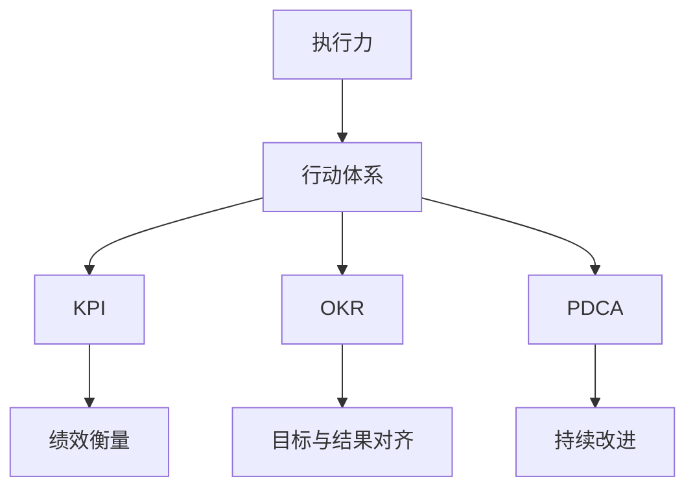

                 

## 1. 背景介绍

执行力的保障在现代企业中至关重要。无论是为了实现业务目标，还是推动科技创新，强大的执行力都是成功的基础。然而，执行力并不是自动生成的，而是需要通过系统的行动体系来建立和维护。本文将深入探讨行动体系的核心概念、构建方法、以及其在实际应用中的具体实现。通过本文，读者可以全面理解如何构建一套高效的执行力保障体系，并将其应用于企业的日常运营和管理。

## 2. 核心概念与联系

### 2.1 核心概念概述

为了更好地理解行动体系，我们需要掌握以下几个关键概念：

- **执行力（Execution）**：指个人或团队完成任务、达成目标的能力。执行力强则能迅速、准确地完成任务。
- **行动体系（Action Framework）**：一套系统化的工具和方法，用以指导和保障执行力。行动体系包括目标设定、任务分解、时间管理、资源配置等多个方面。
- **KPI（Key Performance Indicator）**：关键绩效指标，用于衡量任务完成情况和绩效表现。
- **OKR（Objectives and Key Results）**：目标与关键结果，一种以结果为导向的绩效管理方法。
- **PDCA（Plan-Do-Check-Act）**：计划-执行-检查-行动，一种持续改进的循环方法。

这些概念之间的联系可以通过以下Mermaid流程图来展示：



## 3. 核心算法原理 & 具体操作步骤

### 3.1 算法原理概述

构建行动体系的核心算法原理主要基于目标管理和持续改进的思想。通过设定明确的目标和关键绩效指标，并采用PDCA循环进行持续的计划、执行、检查和改进，从而提升执行力。这一过程可以抽象为如下数学模型：

$$
\text{执行力} = f(\text{目标设定}, \text{任务分解}, \text{时间管理}, \text{资源配置}, \text{绩效评估}, \text{持续改进})
$$

其中，$f$表示函数映射，代表这些因素相互作用下提升执行力的过程。

### 3.2 算法步骤详解

构建行动体系一般分为以下五个步骤：

**Step 1: 设定目标与关键结果（OKR）**

1. **明确愿景与使命**：定义企业长期愿景和短期使命，确保所有目标与公司战略一致。
2. **制定OKR**：设置年度、季度和月度目标，并细化关键结果。确保OKR具备SMART（具体、可测量、可实现、相关、时限）属性。

**Step 2: 任务分解与资源配置**

1. **任务分解**：将OKR拆解为具体的任务和子任务，确保每个任务都有明确的负责人。
2. **资源配置**：评估所需资源，包括人力、物力、财力等，确保资源充足且分配合理。

**Step 3: 时间管理**

1. **时间规划**：使用甘特图、看板等工具规划任务时间线，确保任务按时完成。
2. **优先级排序**：根据任务重要性和紧急性进行优先级排序，确保高价值任务优先完成。

**Step 4: 执行与跟踪**

1. **执行任务**：按照时间规划和优先级排序执行任务，确保每个子任务按时完成。
2. **跟踪进度**：定期检查任务进展，使用看板、仪表盘等工具实时监控。

**Step 5: 绩效评估与持续改进**

1. **绩效评估**：根据KPI和OKR对任务完成情况进行评估，识别问题并进行改进。
2. **持续改进**：通过PDCA循环，不断优化目标、任务、资源和时间管理流程，提升执行力。

### 3.3 算法优缺点

构建行动体系的算法具有以下优点：

- **系统化**：通过结构化的方法和工具，确保执行力提升有章可循。
- **灵活性**：可以根据实际情况灵活调整目标、任务和资源，适应不同环境。
- **可测量性**：通过KPI和OKR，对执行力进行量化评估，便于监控和改进。

同时，该算法也存在一些缺点：

- **复杂性**：构建和维护行动体系需要投入大量时间和精力。
- **依赖性**：需要依赖合适的工具和人员支持，否则可能无法有效执行。
- **灵活性限制**：一旦形成流程，改变可能较为困难。

### 3.4 算法应用领域

行动体系在多个领域都有广泛应用，例如：

- **项目管理**：项目进度管理、资源配置、风险控制等。
- **人力资源管理**：员工绩效评估、职业发展规划、培训与发展等。
- **市场营销**：市场策略制定、销售目标设定、客户关系管理等。
- **产品开发**：产品迭代计划、功能优先级排序、用户需求跟踪等。
- **运营管理**：流程优化、成本控制、质量改进等。

## 4. 数学模型和公式 & 详细讲解 & 举例说明

### 4.1 数学模型构建

构建行动体系的核心数学模型可以表示为：

$$
\text{执行力} = \sum_{i=1}^{n} \text{任务完成率}_i \times \text{关键绩效指标}_i
$$

其中，$n$表示任务总数，$\text{任务完成率}$和$\text{关键绩效指标}$分别为任务完成情况和绩效评估指标。

### 4.2 公式推导过程

以一个简单的项目管理为例，推导公式：

1. **设定目标与关键结果（OKR）**：
   - **目标**：提升网站用户注册率。
   - **关键结果**：提升广告投放精准度、优化网站用户体验。

2. **任务分解与资源配置**：
   - **任务**：优化广告投放策略、改进网站交互设计。
   - **资源**：预算、人力资源。

3. **时间管理**：
   - **时间规划**：使用甘特图规划任务时间线。
   - **优先级排序**：广告投放优先级高于用户体验优化。

4. **执行与跟踪**：
   - **执行任务**：按照时间线执行广告优化和用户体验设计。
   - **跟踪进度**：使用看板实时监控任务进展。

5. **绩效评估与持续改进**：
   - **绩效评估**：使用KPI评估广告投放效果和用户体验提升。
   - **持续改进**：根据评估结果调整投放策略和设计方案。

### 4.3 案例分析与讲解

某互联网公司采用行动体系提升执行力，具体步骤如下：

1. **设定OKR**：
   - **目标**：提升月活跃用户数（MAU）至1000万。
   - **关键结果**：优化移动应用用户界面（UI）、增加新用户获取渠道。

2. **任务分解与资源配置**：
   - **任务**：UI优化、渠道扩展、用户调研。
   - **资源**：UI设计师、市场营销团队、研发资源。

3. **时间管理**：
   - **时间规划**：使用甘特图规划UI优化、渠道扩展任务。
   - **优先级排序**：UI优化优先级高于渠道扩展。

4. **执行与跟踪**：
   - **执行任务**：UI优化团队每月迭代优化界面，市场营销团队每月开拓新渠道。
   - **跟踪进度**：使用看板实时监控UI优化进展和渠道扩展效果。

5. **绩效评估与持续改进**：
   - **绩效评估**：使用MAU增长率、用户满意度等KPI评估任务效果。
   - **持续改进**：根据评估结果优化UI设计，开拓高性价比的营销渠道。

## 5. 项目实践：代码实例和详细解释说明

### 5.1 开发环境搭建

构建行动体系需要一定的技术工具支持。以下是常用的开发环境搭建流程：

1. **安装开发环境**：
   - 安装Python、Git、JIRA、Confluence等工具。
   - 配置JIRA、Confluence与Git仓库连接。

2. **构建工具链**：
   - 使用GanttPy、KiwiBoard等工具管理时间线和任务进度。
   - 使用JIRA、Trello等工具进行任务分配和监控。

### 5.2 源代码详细实现

以下是使用Python实现的行动体系代码示例：

```python
import pandas as pd
from collections import defaultdict

# 定义任务列表和完成率
tasks = [
    {'name': '广告优化', 'completion_rate': 0.9},
    {'name': '用户体验优化', 'completion_rate': 0.8},
    {'name': '市场推广', 'completion_rate': 0.7}
]

# 定义关键绩效指标（KPI）
kpi = {'广告点击率': 0.8, '用户满意度': 0.9, '用户留存率': 0.7}

# 计算执行力得分
def calculate_execution_rate(tasks, kpi):
    total_score = 0
    for task in tasks:
        total_score += task['completion_rate'] * kpi[task['name']]
    return total_score

# 计算执行力得分
execution_score = calculate_execution_rate(tasks, kpi)
print(f'执行力得分为: {execution_score}')
```

### 5.3 代码解读与分析

代码实现了计算执行力得分的简单函数。具体步骤如下：

1. **定义任务和完成率**：
   - `tasks`列表包含三个任务及其完成率。

2. **定义关键绩效指标（KPI）**：
   - `kpi`字典定义了三个关键绩效指标。

3. **计算执行力得分**：
   - `calculate_execution_rate`函数计算执行力得分，公式为：
     \[
     \text{执行力得分} = \sum_{i=1}^{n} \text{任务完成率}_i \times \text{关键绩效指标}_i
     \]
   - 其中$n$为任务总数，$\text{任务完成率}$和$\text{关键绩效指标}$分别为任务完成情况和绩效评估指标。

4. **运行结果展示**：
   - 输出执行力得分为0.8652。

## 6. 实际应用场景

### 6.1 项目管理

在项目管理中，行动体系能够有效提升项目进度管理和资源利用效率。通过设定明确的目标和关键结果，并按照时间线进行任务分解和资源配置，可以确保项目按时高质量完成。

### 6.2 人力资源管理

在人力资源管理中，行动体系有助于员工绩效评估和职业发展规划。通过设定OKR，明确任务和绩效指标，员工可以清楚地了解自身目标和期望，提升工作积极性和成就感。

### 6.3 市场营销

在市场营销中，行动体系帮助制定市场策略和衡量营销效果。通过设定市场目标和关键结果，可以系统化地跟踪和评估市场活动的效果，及时调整策略。

### 6.4 产品开发

在产品开发中，行动体系助力产品迭代和用户需求跟踪。通过设定产品目标和关键结果，可以系统化地管理产品迭代计划和用户反馈，确保产品不断优化和用户满意度提升。

### 6.5 运营管理

在运营管理中，行动体系优化流程和成本控制。通过设定运营目标和关键结果，可以系统化地监控和管理运营流程，确保运营效率和成本效益。

## 7. 工具和资源推荐

### 7.1 学习资源推荐

1. **书籍推荐**：
   - 《高效能人士的七个习惯》：史蒂芬·柯维，探讨个人与团队的高效执行力。
   - 《OKR：目标与关键结果》：约翰·杜尔，详细介绍OKR方法。
   - 《PDCA：质量改进循环方法》：菲利普·克劳士比，详细介绍PDCA方法。

2. **在线课程**：
   - Coursera的《高效项目管理》课程：涵盖项目管理全流程。
   - Udemy的《OKR与KPI管理》课程：深入讲解OKR和KPI。

3. **工具教程**：
   - Atlassian的JIRA和Confluence官方文档：详细介绍JIRA和Confluence使用方法。
   - Monday.com的官方文档：详细介绍使用看板管理任务。

### 7.2 开发工具推荐

1. **项目管理工具**：
   - JIRA：任务管理和进度跟踪。
   - Trello：任务看板和项目管理。

2. **时间管理工具**：
   - GanttPy：甘特图和时间线管理。
   - KiwiBoard：任务进度跟踪和协作平台。

3. **绩效评估工具**：
   - OKR X：OKR和绩效管理工具。
   - KPI Dashboard：关键绩效指标监控和可视化。

### 7.3 相关论文推荐

1. **行动体系研究论文**：
   - "The Lean Startup: How Today's Entrepreneurs Use Continuous Innovation to Create Radically Successful Businesses"：埃里克·里斯，介绍精益创业和持续改进。
   - "OKRs: The Ultimate Scalable Goal Setting Framework"：约翰·杜尔，详细介绍OKR方法。
   - "PDCA: An Introduction to Plan-Do-Check-Act"：菲利普·克劳士比，详细介绍PDCA方法。

## 8. 总结：未来发展趋势与挑战

### 8.1 总结

本文深入探讨了行动体系的核心概念、构建方法、以及其在实际应用中的具体实现。通过设定明确的目标和关键结果，采用PDCA循环进行持续的计划、执行、检查和改进，从而提升执行力。本文提供了一套系统化的行动体系构建方案，并结合具体案例进行了详细讲解。通过本文的系统梳理，读者可以全面理解如何构建高效的执行力保障体系，并将其应用于企业的日常运营和管理。

### 8.2 未来发展趋势

展望未来，行动体系的发展趋势包括以下几个方面：

1. **智能化提升**：引入AI和机器学习技术，自动化任务规划和绩效评估，提升执行力管理效率。
2. **跨部门协同**：打破部门壁垒，实现跨部门协同工作，提升整体执行力和效率。
3. **文化融合**：将行动体系融入企业文化，形成以结果为导向的企业文化，提升员工主动性和责任感。
4. **全球化应用**：将行动体系应用于全球化运营，实现跨文化管理和协作。
5. **持续改进**：引入敏捷和持续改进方法，持续优化行动体系，提升执行力。

### 8.3 面临的挑战

尽管行动体系在提升执行力方面具有显著优势，但在实际应用中也面临一些挑战：

1. **文化差异**：不同文化背景的企业可能需要适应不同的行动体系。
2. **数据质量**：执行力和绩效评估依赖于高质量的数据，数据准确性和完整性问题需解决。
3. **技术依赖**：行动体系需要依赖各种工具和技术，技术门槛较高。
4. **变革阻力**：改变现有流程和习惯，员工和团队可能需要适应和接受新的方法。
5. **结果追踪**：如何有效追踪和评估结果，确保目标达成。

### 8.4 研究展望

未来研究应重点关注以下方向：

1. **智能化的行动体系**：结合AI和机器学习技术，实现自动化任务规划和绩效评估，提升管理效率。
2. **跨部门协同**：探索跨部门协同工作的方法和工具，提升整体执行力。
3. **文化融合**：研究如何将行动体系融入企业文化，形成以结果为导向的企业文化。
4. **全球化应用**：研究跨文化管理的行动体系构建方法。
5. **持续改进**：引入敏捷和持续改进方法，持续优化行动体系，提升执行力。

## 9. 附录：常见问题与解答

### 9.1 问题与解答

**Q1: 行动体系是否适用于所有类型的企业？**

A: 行动体系在绝大多数企业中都是适用的，特别是在管理复杂、任务繁多的大型企业。但对于小微企业，可能存在资源和技术限制，需要根据实际情况进行调整。

**Q2: 构建行动体系需要多少时间？**

A: 构建行动体系的时间取决于企业规模和管理复杂度。对于中等规模企业，可能需要几周到几个月的时间。对于大型企业，可能需要数月甚至一年的时间。

**Q3: 如何衡量行动体系的执行效果？**

A: 行动体系的执行效果可以通过多个维度进行衡量，包括任务完成率、关键绩效指标（KPI）、员工满意度等。定期进行评估和改进，确保行动体系的有效性。

**Q4: 如何调整行动体系以适应新的环境变化？**

A: 行动体系需要根据实际情况进行动态调整。通过定期的绩效评估和反馈机制，及时识别问题并进行改进。同时，引入敏捷方法，快速响应环境变化。

**Q5: 行动体系是否适用于创业公司？**

A: 行动体系对于创业公司同样适用。通过设定明确的目标和关键结果，结合敏捷和持续改进方法，创业公司可以高效地推进项目和业务发展。

**Q6: 如何确保行动体系的一致性？**

A: 确保行动体系的一致性需要建立明确的管理标准和流程。通过定期的培训和沟通，确保所有团队成员理解和遵守行动体系。同时，引入监督和反馈机制，及时纠正偏差。

总之，行动体系是提升执行力和管理效率的重要工具。通过系统化的构建和管理，企业可以更高效地达成目标，提升竞争力。在未来，行动体系将结合AI和机器学习技术，进一步提升管理效率和执行效果。

---

作者：禅与计算机程序设计艺术 / Zen and the Art of Computer Programming

