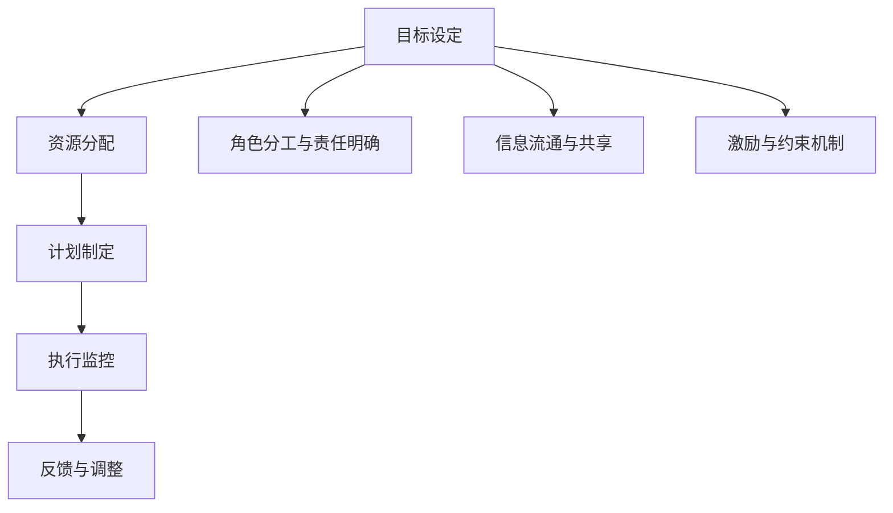

                 

# 行动体系对管理执行力的影响

在现代企业管理中，行动体系（Action System）作为管理执行力的核心，对企业运营和决策起着至关重要的作用。通过深入探讨行动体系的概念、机制与实际应用，本文旨在揭示其对管理执行力的影响，并提出相关建议，帮助企业提升管理执行力。

## 1. 背景介绍

### 1.1 管理执行力的重要性
管理执行力是企业战略落地与运营效率的关键，影响着企业目标的达成和市场竞争力的提升。其核心在于通过有效的计划、组织、领导与控制，实现资源的合理配置与目标的高效达成。行动体系作为管理执行力的基础，是确保管理执行效果的重要保障。

### 1.2 行动体系的提出与研究背景
行动体系由德国学者Max Weber提出，用以描述组织中个体与部门如何协调行动，以达成共同目标的过程。随着企业环境复杂化，行动体系的研究与应用不断发展，已成为管理学的重要组成部分。

## 2. 核心概念与联系

### 2.1 行动体系的概念
行动体系是指在特定组织中，为了达成共同目标，个体、部门、组织层级间的协调行动机制。其关键要素包括：
- **目标设定（Goal Setting）**：明确企业与各层级的具体目标。
- **资源分配（Resource Allocation）**：合理分配人员、资金、技术等资源。
- **计划制定（Planning）**：制定详细的执行计划和时间表。
- **执行监控（Execution Monitoring）**：实时监控执行进度和效果，及时调整策略。
- **反馈与调整（Feedback and Adjustment）**：根据反馈信息进行策略调整，确保目标达成。

### 2.2 行动体系的核心机制
行动体系的核心机制包括但不限于：
- **角色分工与责任明确**：确保每个成员清楚其职责，避免职责重叠与缺位。
- **信息流通与共享**：建立有效的信息流通渠道，促进信息共享与透明度。
- **激励与约束机制**：通过奖励与惩罚措施，激励员工积极参与，约束不当行为。

### 2.3 Mermaid流程图


### 2.4 行动体系与管理执行力的关系
行动体系通过协调个体与部门行动，确保管理执行力得到有效执行。目标设定确保执行力方向一致，资源分配保证执行力所需资源，计划制定明确执行力路径，执行监控和反馈调整确保执行力效果。

## 3. 核心算法原理 & 具体操作步骤

### 3.1 算法原理概述
行动体系的构建与优化遵循以下基本原理：
- **目标对齐（Goal Alignment）**：确保组织目标与个体目标的一致性。
- **资源优化（Resource Optimization）**：通过有效分配资源，提升执行力效率。
- **动态调整（Dynamic Adjustment）**：根据实时反馈信息调整行动计划，保证执行力灵活性。

### 3.2 算法步骤详解
1. **目标设定**：
   - **步骤1**：分析企业战略，明确总体目标与关键指标。
   - **步骤2**：通过KPI等工具，将总体目标分解为部门与个体目标。
   - **步骤3**：确保各层级目标具有一致性，避免目标偏差。

2. **资源分配**：
   - **步骤1**：评估资源现状，包括人员、资金、技术等。
   - **步骤2**：根据目标设定，优化资源配置，确保关键任务得到优先支持。
   - **步骤3**：动态调整资源分配，应对突发情况。

3. **计划制定**：
   - **步骤1**：制定详细的执行计划，包括时间表与任务分解。
   - **步骤2**：明确各任务的责任人，确保责任落实。
   - **步骤3**：进行风险评估，制定应急预案。

4. **执行监控**：
   - **步骤1**：实时监控执行进度，收集反馈信息。
   - **步骤2**：分析执行偏差，识别问题点。
   - **步骤3**：根据反馈信息，调整执行策略。

5. **反馈与调整**：
   - **步骤1**：定期收集执行效果数据，评估目标达成情况。
   - **步骤2**：根据评估结果，进行策略调整。
   - **步骤3**：强化成功经验，优化不足之处。

### 3.3 算法优缺点
#### 优点
- **系统性**：行动体系通过明确目标、优化资源、动态调整，确保执行力具备系统性。
- **透明度**：通过信息流通与共享机制，提升决策与执行的透明度。
- **灵活性**：动态调整机制使行动体系能够快速适应环境变化。

#### 缺点
- **复杂性**：构建与优化行动体系需要较长时间与资源投入。
- **依赖度**：对信息流通与反馈机制的依赖较高，一旦出现问题，执行力可能受阻。

### 3.4 算法应用领域
行动体系在以下领域有广泛应用：
- **项目管理（Project Management）**：确保项目按时、按质完成。
- **供应链管理（Supply Chain Management）**：优化资源配置，提高供应链效率。
- **人力资源管理（Human Resource Management）**：通过激励与约束机制，提升员工参与度。

## 4. 数学模型和公式 & 详细讲解 & 举例说明

### 4.1 数学模型构建
行动体系的目标对齐、资源优化与动态调整可以通过以下数学模型进行建模：
- **目标对齐模型**：设目标为 $G$，部门目标为 $g_i$，个体目标为 $g_j$。目标对齐问题可以建模为：
  $$
  \min_{g_i,g_j} \sum (g_i - g_j)^2 \quad \text{subject to} \quad g_i = G_i
  $$
- **资源优化模型**：设资源总量为 $R$，任务需求为 $D$。资源优化问题可以建模为：
  $$
  \min_{r_i} \sum r_i \quad \text{subject to} \quad \sum r_i D_i \leq R
  $$
- **动态调整模型**：设执行进度为 $P$，调整策略为 $A$。动态调整问题可以建模为：
  $$
  \min_{A} \sum (P_i - A_i)^2 \quad \text{subject to} \quad P_i = P_{i-1} + A_i
  $$

### 4.2 公式推导过程
以资源优化模型为例，其推导过程如下：
- **目标函数**：
  $$
  \min_{r_i} \sum r_i
  $$
  表示最小化资源总消耗。
- **约束条件**：
  $$
  \sum r_i D_i \leq R
  $$
  表示所有任务的需求总和不得超过资源总量。
- **求解方法**：
  通过线性规划等优化方法，求解上述线性约束下的最小化问题，得到最优资源分配方案。

### 4.3 案例分析与讲解
**案例**：某企业需开发新产品，需分配10名工程师与100万资金。产品开发分为市场需求分析、技术研发、市场推广三个阶段，各阶段任务需求分别为 $D_1=5,D_2=3,D_3=2$，资源消耗分别为 $R_1=2,R_2=3,R_3=1$。

**步骤**：
1. **目标设定**：确定新产品开发目标，如6个月内上市。
2. **资源分配**：通过线性规划求解资源分配问题，得到最优资源分配方案 $r_1=2,r_2=5,r_3=3$。
3. **计划制定**：制定详细执行计划，明确各阶段负责人，并设定时间表。
4. **执行监控**：实时监控执行进度，收集反馈信息，进行动态调整。
5. **反馈与调整**：根据反馈信息，优化资源配置与执行策略。

## 5. 项目实践：代码实例和详细解释说明

### 5.1 开发环境搭建
开发环境搭建分为以下步骤：
1. **选择开发平台**：选用Python作为开发语言，PyTorch作为计算框架，TensorBoard用于可视化监控。
2. **安装相关库**：安装必要的库，如Pandas、NumPy、Matplotlib等。
3. **环境配置**：配置开发环境，包括开发工具、依赖库等。

### 5.2 源代码详细实现
以下是一个简单的行动体系构建与优化的代码实现示例：

```python
import pandas as pd
import numpy as np
from scipy.optimize import linprog
from matplotlib import pyplot as plt

# 数据准备
data = pd.read_csv('resource_data.csv')

# 目标设定
total_resources = data['total_resources'][0]
tasks = data['tasks']
constraints = data['constraints']

# 资源优化问题建模
c = np.array([1, 1, 1])  # 资源消耗系数
A = np.array([[1, 1, 1]])  # 约束矩阵
b = np.array([total_resources])  # 约束向量
A_eq = np.array([[1, 0, 0], [0, 1, 0], [0, 0, 1]])  # 等式约束矩阵
b_eq = np.array([0, 0, total_resources])  # 等式约束向量
bounds = [(0, None), (0, None), (0, None)]  # 资源上限
x0_bounds = (0, None)  # 资源分配下限

# 求解优化问题
res = linprog(c, A_ub, b, A_eq, b_eq, bounds=bounds, x0=x0_bounds)
print(res)

# 可视化结果
plt.plot(range(len(tasks)), res.x)
plt.xlabel('Task')
plt.ylabel('Resource Allocation')
plt.show()
```

### 5.3 代码解读与分析
**代码解读**：
- **数据准备**：通过Pandas库读取资源数据。
- **目标设定**：获取总资源量和任务需求。
- **优化问题建模**：使用SciPy库中的linprog函数，构建并求解优化问题。
- **可视化结果**：通过Matplotlib库绘制资源分配结果。

**分析**：
- **数据处理**：确保数据准确性，避免计算误差。
- **模型构建**：合理设定目标函数与约束条件，确保模型符合实际情况。
- **求解过程**：使用科学计算库求解优化问题，得到最优资源分配方案。
- **结果可视化**：通过图形展示资源分配结果，直观理解分配方案。

### 5.4 运行结果展示
运行上述代码，输出最优资源分配方案，并通过图形展示分配结果。

## 6. 实际应用场景

### 6.1 智能制造
在智能制造中，行动体系可用于生产计划优化、资源配置与调度管理。通过精确的目标设定与动态调整，确保生产任务高效完成，提升制造效率与灵活性。

### 6.2 智能物流
智能物流领域，行动体系可应用于货物运输优化、仓储管理与配送调度。通过合理分配运输资源与仓储空间，提升物流效率，降低成本。

### 6.3 智能医疗
在智能医疗中，行动体系可用于患者诊疗路径规划、资源配置与医疗任务调度。通过优化诊疗流程，提高医疗服务效率与质量。

### 6.4 未来应用展望
未来，随着技术进步与数据积累，行动体系将在更多领域得到应用，如智能城市、智慧农业等。其应用范围将不断拓展，助力企业提升管理执行力，实现高效运营。

## 7. 工具和资源推荐

### 7.1 学习资源推荐
1. **《行动体系与管理执行力》**：详细讲解行动体系概念与实践，适合企业管理者阅读。
2. **《管理学原理》**：系统介绍管理学的基本原理与方法，涵盖行动体系等内容。
3. **Coursera《行动管理体系》课程**：通过在线课程学习行动体系的理论基础与实际应用。

### 7.2 开发工具推荐
1. **Python**：开发环境搭建的首选语言，适合快速迭代开发。
2. **PyTorch**：强大的计算框架，支持高效数学计算与模型构建。
3. **TensorBoard**：可视化工具，实时监控模型训练与执行效果。

### 7.3 相关论文推荐
1. **《行动体系：理论、方法与实践》**：论文系统介绍行动体系的概念、机制与实际应用，适合学术研究与实践。
2. **《智能制造中的行动体系优化》**：研究智能制造中行动体系的优化方法，提升生产效率。
3. **《智能物流中的行动体系设计》**：探讨智能物流中行动体系的应用，优化物流流程。

## 8. 总结：未来发展趋势与挑战

### 8.1 研究成果总结
行动体系作为管理执行力的核心，通过目标对齐、资源优化与动态调整，确保管理执行力得到有效执行。其应用广泛，在多个领域展示出显著效果。

### 8.2 未来发展趋势
未来行动体系将朝着以下几个方向发展：
- **智能化**：结合人工智能与大数据技术，提升行动体系决策与执行的智能化水平。
- **实时化**：通过实时数据监控与动态调整，确保行动体系适应环境变化。
- **协同化**：实现跨部门、跨层级的协同工作，提升整体执行力。

### 8.3 面临的挑战
尽管行动体系在管理执行力提升中发挥着重要作用，但仍面临以下挑战：
- **复杂性**：行动体系的构建与优化过程较为复杂，需要投入大量资源。
- **动态调整难度**：在快速变化环境中，动态调整机制需要灵活应对，避免执行偏差。
- **数据质量**：行动体系的优化依赖于高质量数据，数据缺失或不准确可能导致决策失误。

### 8.4 研究展望
未来行动体系研究将在以下几个方面进行探索：
- **数据驱动**：通过大数据与人工智能技术，提升行动体系的决策精度与效率。
- **人机协同**：实现人与系统间的协同工作，提升整体执行力。
- **伦理与安全**：确保行动体系的决策透明与可解释性，避免伦理与安全问题。

## 9. 附录：常见问题与解答

**Q1：行动体系如何应对快速变化的环境？**

A：行动体系通过动态调整机制，能够实时监控环境变化，并根据反馈信息调整行动策略。这包括灵活分配资源、调整目标与计划等，确保系统能够在动态环境中高效运行。

**Q2：行动体系是否适用于所有组织？**

A：行动体系适用于多数组织，但其效果与适用性受组织规模、复杂度与环境变化速度等因素影响。对于复杂度高、变化快的小型组织，行动体系可能需要更多的定制化设计与调整。

**Q3：行动体系如何与其他管理体系结合？**

A：行动体系可以与战略管理、绩效管理等管理体系结合，形成综合性的管理执行框架。通过明确目标、优化资源与动态调整，确保各管理体系协调一致。

**Q4：行动体系的构建与优化需要多长时间？**

A：行动体系的构建与优化需要较长时间与资源投入，具体时间取决于组织规模与复杂度。一般情况下，需要数周至数月不等。

**Q5：行动体系是否需要持续维护？**

A：是的，行动体系需要定期评估与优化，以应对环境变化与执行偏差。通过定期维护与调整，确保行动体系始终处于最优状态。

---

作者：禅与计算机程序设计艺术 / Zen and the Art of Computer Programming

