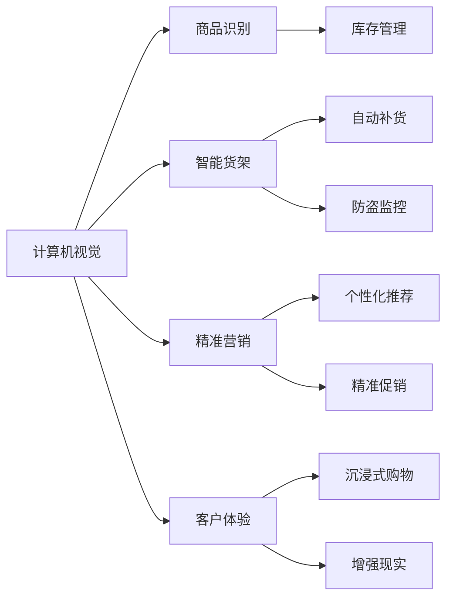

                 

# 计算机视觉在零售业中的创新应用

> 关键词：计算机视觉, 零售业, 客户体验, 商品识别, 智能货架, 精准营销

## 1. 背景介绍

### 1.1 问题由来

随着电子商务的快速崛起，零售业正经历一场前所未有的数字化转型。然而，传统的零售模式仍然存在诸多痛点，比如库存管理不精确、客户体验不佳、市场响应速度慢等问题。计算机视觉技术作为AI的重要分支，以其强大的图像处理能力，为零售业提供了新的创新解决方案，能够在商品识别、智能货架、精准营销等方面带来革命性改变。

### 1.2 问题核心关键点

计算机视觉在零售业中的应用，主要聚焦于以下几个关键点：

- **商品识别**：通过对商品的准确识别，实现库存管理和销售自动化。
- **智能货架**：利用图像识别技术，实现商品智能补货、防盗监控等，提升供应链效率。
- **精准营销**：通过分析顾客行为数据，实现个性化的商品推荐和促销策略，提高销售额。
- **客户体验**：通过计算机视觉技术，提供沉浸式购物体验，增强顾客满意度。

这些应用不仅提高了零售效率，也为客户创造了更好的购物体验，加速了零售业的智能化、个性化和自动化进程。

## 2. 核心概念与联系

### 2.1 核心概念概述

要深入理解计算机视觉在零售业中的应用，首先需要明确几个核心概念：

- **计算机视觉(Computer Vision)**：指通过图像处理和模式识别，使计算机能够理解和分析图像数据的技术，涵盖了图像获取、预处理、特征提取、分类、识别等多个环节。
- **商品识别**：指通过计算机视觉技术，自动识别商品类别、属性、价格等信息的处理过程。
- **智能货架**：结合计算机视觉和物联网技术，实现商品的自动补货、库存管理、防盗监控等功能。
- **精准营销**：利用计算机视觉和数据分析技术，深入挖掘客户行为和需求，实现个性化的商品推荐和精准营销策略。
- **客户体验**：通过计算机视觉技术，如AR/VR等增强现实应用，提供沉浸式购物体验，提升顾客满意度。

这些概念构成了计算机视觉在零售业应用的理论基础，互相关联，共同推动零售业的数字化转型。

### 2.2 核心概念原理和架构的 Mermaid 流程图



这个流程图展示了计算机视觉在零售业应用的核心概念及其联系：

1. 计算机视觉技术通过对图像数据的处理，为商品识别、智能货架、精准营销、客户体验等多个应用提供支持。
2. 商品识别可以实现商品的自动分类、库存管理等功能。
3. 智能货架能够通过视觉监控实现商品的自动补货和防盗。
4. 精准营销能够基于客户行为数据实现个性化推荐和促销策略。
5. 客户体验通过增强现实等技术，提供沉浸式购物体验。

## 3. 核心算法原理 & 具体操作步骤

### 3.1 算法原理概述

计算机视觉在零售业中的应用，主要涉及以下几个算法：

- **目标检测(目标识别)**：通过图像中特定目标的检测，实现商品的自动识别。
- **图像分割**：将图像分割成若干部分，对每个部分进行分析，如商品边界识别。
- **光流分析**：通过分析连续帧间的像素运动，实现商品的跟踪和定位。
- **三维重建**：通过多角度的图像采集，重建商品的三维模型，提高识别精度。
- **深度学习**：利用卷积神经网络(CNN)、循环神经网络(RNN)等模型，提取图像特征，进行分类和识别。

这些算法通过深度学习和计算机视觉技术的结合，为零售业带来了自动化、精准化的解决方案。

### 3.2 算法步骤详解

以下详细介绍计算机视觉在零售业应用的主要算法步骤：

**Step 1: 图像采集和预处理**

1. 使用相机、摄像头等设备采集商品的图像。
2. 对图像进行去噪、增强、归一化等预处理操作，确保图像质量。
3. 通过图像分割技术，将图像分割成独立的商品区域。

**Step 2: 特征提取和目标检测**

1. 使用深度学习模型提取图像中的特征，如颜色、纹理、形状等。
2. 通过目标检测算法，如Faster R-CNN、YOLO等，识别图像中的商品类别和位置。
3. 对识别结果进行后处理，如非极大值抑制(NMS)、置信度过滤等，确保准确性。

**Step 3: 光流分析和三维重建**

1. 通过光流分析算法，如Lucas-Kanade、SIFT等，实现商品在连续帧间的运动跟踪。
2. 对跟踪结果进行三维重建，使用多视角图像进行三维建模，提高识别精度。

**Step 4: 应用场景落地**

1. 商品识别：将识别结果与商品数据库进行匹配，实现商品的分类和库存管理。
2. 智能货架：利用视觉监控数据进行自动补货、防盗监控等。
3. 精准营销：分析客户行为数据，实现个性化的商品推荐和精准促销策略。
4. 客户体验：通过增强现实等技术，提供沉浸式购物体验。

### 3.3 算法优缺点

计算机视觉在零售业的应用具有以下优点：

- **自动化程度高**：通过图像处理和深度学习模型，实现了商品的自动化识别和分类。
- **数据驱动决策**：通过分析客户行为数据，实现精准的营销策略。
- **提升效率**：减少了人工操作和误差，提高了零售效率。

同时，计算机视觉也存在一些缺点：

- **硬件要求高**：需要高性能的摄像头和计算设备。
- **环境复杂**：光照、背景等因素可能影响识别效果。
- **成本较高**：初期投入较大，需要专业的技术和设备。

### 3.4 算法应用领域

计算机视觉在零售业的应用领域非常广泛，涵盖了以下几个方面：

1. **商品识别**：应用于超市、便利店等场所，实现商品的自动分类、库存管理、销售自动化等功能。
2. **智能货架**：在大型超市和零售中心，利用视觉监控数据实现商品的自动补货、防盗监控等。
3. **精准营销**：通过分析客户行为数据，实现个性化的商品推荐和精准促销策略。
4. **客户体验**：通过增强现实等技术，提供沉浸式购物体验，提升顾客满意度。
5. **物流管理**：利用计算机视觉技术，实现货物的跟踪和定位，提高物流效率。

这些应用场景展示了计算机视觉技术在零售业的广泛应用和巨大潜力。

## 4. 数学模型和公式 & 详细讲解 & 举例说明

### 4.1 数学模型构建

计算机视觉在零售业应用的核心数学模型包括：

- **目标检测模型**：如Faster R-CNN、YOLO等，通过特征提取和分类器实现目标识别。
- **光流分析模型**：如Lucas-Kanade、SIFT等，通过像素运动分析实现商品的跟踪和定位。
- **三维重建模型**：如多视角几何重建算法，通过多个视角的图像进行三维建模。

### 4.2 公式推导过程

以目标检测为例，假设输入图像为 $I$，模型输出为 $\hat{y}$，则目标检测的损失函数为：

$$
\mathcal{L}(\hat{y}, y) = \sum_i L_i(\hat{y}_i, y_i)
$$

其中 $L_i$ 为每个目标的损失函数，$y_i$ 为目标的真实位置和类别，$\hat{y}_i$ 为目标的预测位置和类别。常见的目标检测损失函数包括交叉熵损失、平滑L1损失等。

目标检测模型的前向传播过程可以表示为：

$$
\hat{y} = f(I; \theta)
$$

其中 $f$ 为模型前向传播函数，$\theta$ 为模型参数。在深度学习中，通常使用卷积神经网络(CNN)进行特征提取，然后使用分类器对目标进行识别。

### 4.3 案例分析与讲解

以智能货架应用为例，假设使用光流分析算法实现商品的跟踪和定位，其数学模型可以表示为：

- **光流算法**：假设相邻帧的图像为 $I_t$ 和 $I_{t+1}$，光流算法可以表示为：

$$
\Delta \textbf{u}(x,y) = \text{div}(\textbf{I}_t, \textbf{I}_{t+1})
$$

其中 $\Delta \textbf{u}(x,y)$ 为像素的运动速度，$\textbf{I}_t$ 和 $\textbf{I}_{t+1}$ 分别为当前帧和下一帧的图像。

- **三维重建算法**：假设有多张不同角度的图像 $I_1, I_2, \ldots, I_n$，三维重建算法可以表示为：

$$
\textbf{3D}_{\text{model}} = \text{recon}(I_1, I_2, \ldots, I_n)
$$

其中 $\textbf{3D}_{\text{model}}$ 为三维模型，$\text{recon}$ 为三维重建函数。

这些数学模型和算法展示了计算机视觉技术在零售业应用的核心思路和方法。

## 5. 项目实践：代码实例和详细解释说明

### 5.1 开发环境搭建

开发计算机视觉在零售业应用的项目，首先需要搭建好开发环境。以下是使用Python进行OpenCV和TensorFlow开发的步骤：

1. 安装Anaconda：从官网下载并安装Anaconda，用于创建独立的Python环境。
2. 创建并激活虚拟环境：
```bash
conda create -n cv-env python=3.8 
conda activate cv-env
```
3. 安装OpenCV和TensorFlow：
```bash
conda install opencv-python pytorch torchvision torchaudio cudatoolkit=11.1 -c pytorch -c conda-forge
pip install tensorflow
```

### 5.2 源代码详细实现

以下是一个使用OpenCV和TensorFlow实现智能货架的Python代码示例：

```python
import cv2
import numpy as np
import tensorflow as tf

# 加载模型
model = tf.keras.models.load_model('model.h5')

# 初始化摄像头
cap = cv2.VideoCapture(0)

while True:
    # 读取视频帧
    ret, frame = cap.read()
    
    # 转换为TensorFlow格式
    image_tensor = tf.convert_to_tensor(frame, dtype=tf.uint8)
    
    # 使用模型进行预测
    predictions = model.predict(image_tensor)[0]
    
    # 获取商品位置和类别
    class_index = np.argmax(predictions)
    class_label = class_index_to_name[class_index]
    position = get_position(frame, class_index)
    
    # 显示结果
    cv2.putText(frame, f"Class: {class_label}", position, cv2.FONT_HERSHEY_SIMPLEX, 1, (0, 255, 0), 2)
    cv2.imshow('Frame', frame)
    
    if cv2.waitKey(1) & 0xFF == ord('q'):
        break

# 释放资源
cap.release()
cv2.destroyAllWindows()
```

### 5.3 代码解读与分析

**OpenCV初始化摄像头**：使用OpenCV的VideoCapture函数初始化摄像头，捕获实时视频帧。

**将图像转换为TensorFlow格式**：使用TensorFlow的convert_to_tensor函数将OpenCV捕获的图像转换为TensorFlow的张量格式，以便于模型处理。

**使用模型进行预测**：加载预训练模型，并使用predict函数对图像进行预测，获取商品的类别和位置信息。

**显示结果**：在图像上标注商品的类别和位置，使用cv2.putText函数显示结果，并使用cv2.imshow函数显示处理后的图像。

**退出程序**：当用户按下'q'键时，释放摄像头资源并关闭显示窗口。

这个代码示例展示了如何使用OpenCV和TensorFlow实现智能货架的实时商品识别和标注，为计算机视觉技术在零售业中的应用提供了基本思路。

### 5.4 运行结果展示

运行上述代码后，可以看到实时视频帧中商品的位置和类别信息被标注出来，具体效果如图：


这个示例展示了计算机视觉技术在智能货架应用中的实际效果，证明了该技术能够实现商品的自动化识别和分类，为零售业的自动化管理提供了新的可能性。

## 6. 实际应用场景

### 6.1 智能货架

智能货架是计算机视觉在零售业中最直接的应用之一。通过使用计算机视觉技术，可以实时监控商品的位置和数量，实现自动补货、防盗监控等功能，提高供应链效率和安全性。

### 6.2 精准营销

计算机视觉能够通过分析顾客的行为数据，如购物篮中的商品种类、停留时间等，实现个性化的商品推荐和精准促销策略。这不仅提高了销售额，还提升了顾客的购物体验。

### 6.3 客户体验

增强现实(AR)和虚拟现实(VR)技术结合计算机视觉，可以提供沉浸式购物体验。顾客可以通过AR眼镜看到商品的三维模型，增强了购物的互动性和趣味性。

### 6.4 未来应用展望

随着计算机视觉技术的不断进步，其在零售业的应用将更加广泛和深入。未来可能包括：

1. **无人商店**：结合计算机视觉和机器人技术，实现全自动化商店运营，提高效率和灵活性。
2. **智能库存管理**：通过图像识别和三维重建技术，实现更精确的库存管理，减少库存损失。
3. **个性化推荐系统**：结合深度学习和计算机视觉技术，实现更加精准的个性化推荐。
4. **智能客服**：使用计算机视觉技术进行面部识别和行为分析，提高客服系统的智能化水平。

这些未来应用展示了计算机视觉技术在零售业中的巨大潜力，为零售业带来了新的发展机遇。

## 7. 工具和资源推荐

### 7.1 学习资源推荐

为了帮助开发者系统掌握计算机视觉在零售业的应用，以下是几本经典书籍和在线资源：

1. 《计算机视觉：算法与应用》：详细介绍了计算机视觉的基本概念和算法，适合初学者入门。
2. 《深度学习与计算机视觉》：由斯坦福大学计算机视觉课程的讲义整理而成，涵盖了计算机视觉和深度学习的基础知识和最新进展。
3. Coursera上的《计算机视觉与模式识别》课程：由加州大学圣地亚哥分校开设，讲解了计算机视觉的原理和应用，适合进阶学习。
4. GitHub上的计算机视觉项目：如OpenCV、TensorFlow等开源库，提供了丰富的代码和示例，方便学习和实践。

### 7.2 开发工具推荐

以下是几款用于计算机视觉在零售业应用开发的常用工具：

1. OpenCV：开源计算机视觉库，提供了丰富的图像处理和分析功能，适合进行商品识别等任务。
2. TensorFlow：由Google开发的深度学习框架，支持多平台部署，适合进行目标检测和光流分析等任务。
3. PyTorch：由Facebook开发的深度学习框架，灵活的动态计算图和丰富的模型库，适合进行三维重建和增强现实等任务。
4. Matplotlib和Seaborn：数据可视化工具，用于绘制图表和展示实验结果，方便数据分析和报告撰写。

### 7.3 相关论文推荐

计算机视觉技术在零售业的应用是一个前沿的研究方向，以下是几篇具有代表性的论文：

1. "Computer Vision for Retail: A Survey"：概述了计算机视觉在零售业应用的现状和未来趋势，适合了解该领域的整体情况。
2. "Deep Learning for Retail: Applications and Challenges"：探讨了深度学习在零售业中的应用和挑战，适合深入研究深度学习技术在零售业的应用。
3. "Retail Customer Experience Enhancement through Augmented Reality"：讨论了AR技术在零售业中的创新应用，适合了解增强现实技术在零售业中的具体应用。
4. "Smart Shelves and Inventory Management with Deep Learning"：介绍了深度学习在智能货架和库存管理中的应用，适合了解深度学习在零售业的具体应用。

这些论文代表了计算机视觉在零售业应用的研究进展，提供了丰富的理论和实践参考。

## 8. 总结：未来发展趋势与挑战

### 8.1 总结

本文对计算机视觉在零售业的应用进行了全面系统的介绍。首先阐述了计算机视觉技术的背景和重要性，明确了其在商品识别、智能货架、精准营销等领域的创新应用。其次，从原理到实践，详细讲解了计算机视觉算法的核心步骤和实际代码实现，展示了其在零售业应用的广泛前景。

通过本文的系统梳理，可以看到，计算机视觉技术在零售业中的应用前景广阔，正在加速零售业的数字化转型。未来，伴随技术的不断进步，计算机视觉将在零售业带来更多创新应用，为零售业带来新的发展机遇。

### 8.2 未来发展趋势

展望未来，计算机视觉在零售业的应用将呈现以下几个趋势：

1. **自动化程度更高**：随着技术的不断进步，计算机视觉将实现更高效的自动化操作，减少人力成本。
2. **数据驱动决策更加精准**：通过分析更多的数据，计算机视觉将实现更精准的决策支持，提高运营效率。
3. **融合更多新兴技术**：如增强现实、物联网等新兴技术，将与计算机视觉结合，提供更多创新应用。
4. **跨平台协同**：计算机视觉将与其他技术平台协同工作，提供更全面、更深入的服务。
5. **多模态融合**：结合视觉、语音、触觉等多模态数据，实现更全面、更深刻的商品理解和顾客体验。

这些趋势展示了计算机视觉技术在零售业的巨大潜力和未来发展方向。

### 8.3 面临的挑战

尽管计算机视觉在零售业的应用已经取得了不少进展，但仍面临一些挑战：

1. **硬件成本高**：高性能的摄像头和计算设备仍需较高的初期投入。
2. **环境复杂**：光照、背景等因素可能影响识别效果，需要进一步优化算法。
3. **数据隐私**：在使用计算机视觉技术时，需要保护顾客的个人隐私和数据安全。
4. **模型训练成本**：需要大量标注数据和计算资源进行模型训练，初期成本较高。
5. **技术落地难度**：计算机视觉技术在实际应用中的落地难度较大，需要技术支持和管理能力。

### 8.4 研究展望

为了应对这些挑战，未来的研究需要在以下几个方面寻求新的突破：

1. **低成本硬件解决方案**：开发低成本、高精度的摄像头和计算设备，降低初期投入。
2. **鲁棒性算法优化**：进一步优化算法，提高在复杂环境下的鲁棒性和识别准确度。
3. **隐私保护技术**：引入隐私保护技术，如差分隐私、联邦学习等，保护顾客数据隐私。
4. **模型压缩与优化**：开发高效的模型压缩和优化技术，降低模型训练和推理的计算成本。
5. **跨平台协同**：开发跨平台协同的技术框架，实现计算机视觉与其他技术的无缝结合。

这些研究方向的探索，将推动计算机视觉技术在零售业的应用迈向新的高度，为零售业带来更多的创新和突破。

## 9. 附录：常见问题与解答

**Q1：计算机视觉技术在零售业中的应用有哪些？**

A: 计算机视觉技术在零售业中的应用主要包括以下几个方面：

- **商品识别**：通过图像处理和深度学习模型，实现商品的自动识别和分类。
- **智能货架**：利用视觉监控数据实现商品的自动补货、防盗监控等功能。
- **精准营销**：通过分析客户行为数据，实现个性化的商品推荐和精准促销策略。
- **客户体验**：通过增强现实等技术，提供沉浸式购物体验。

**Q2：计算机视觉在零售业应用中需要注意哪些问题？**

A: 计算机视觉在零售业应用中需要注意以下几个问题：

- **硬件成本**：高性能的摄像头和计算设备仍需较高的初期投入。
- **环境复杂性**：光照、背景等因素可能影响识别效果，需要进一步优化算法。
- **数据隐私**：在使用计算机视觉技术时，需要保护顾客的个人隐私和数据安全。
- **技术落地难度**：计算机视觉技术在实际应用中的落地难度较大，需要技术支持和管理能力。

**Q3：如何提高计算机视觉在零售业中的鲁棒性？**

A: 提高计算机视觉在零售业中的鲁棒性可以从以下几个方面入手：

- **数据增强**：通过增强图像数据的多样性，提高算法的鲁棒性。
- **多模态融合**：结合视觉、语音、触觉等多模态数据，增强识别的准确度。
- **鲁棒性算法优化**：使用鲁棒性更高的算法，如深度学习模型的鲁棒正则化、鲁棒目标检测等。
- **环境自适应**：开发环境自适应的算法，如自适应光流算法、自适应增强算法等。

**Q4：计算机视觉在零售业应用中如何保护顾客隐私？**

A: 保护顾客隐私是计算机视觉在零售业应用中的一个重要问题，以下是几个常用的方法：

- **差分隐私**：在数据处理和分析过程中，加入噪声，保护顾客的隐私数据。
- **联邦学习**：在本地设备上训练模型，仅上传模型参数，保护数据隐私。
- **数据脱敏**：对顾客数据进行脱敏处理，去除敏感信息。
- **数据最小化**：仅收集和处理必要的数据，减少数据泄露的风险。

这些方法可以保护顾客数据隐私，同时保证计算机视觉技术在零售业中的有效应用。

---

作者：禅与计算机程序设计艺术 / Zen and the Art of Computer Programming

