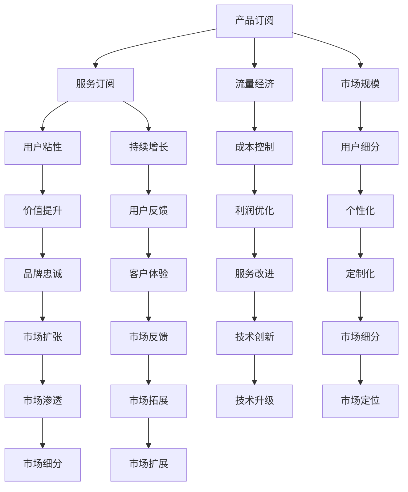

                 

# 订阅制经济的发展趋势:从产品订阅到服务订阅

> 关键词：订阅制经济,产品订阅,服务订阅,业务模式,用户体验,经济模型,市场趋势

## 1. 背景介绍

随着互联网和科技的飞速发展，订阅制经济（Subscription Economy）已经成为全球范围内最热门的商业模式之一。这种模式不仅改变了传统的销售和支付方式，也为消费者和企业带来了全新的价值体验。从基于产品的订阅，到基于服务的订阅，订阅制经济正在经历着从量变到质变的深刻转型。本文将深入探讨订阅制经济的发展趋势，从产品订阅到服务订阅，解析背后的驱动因素，并展望未来的发展前景。

## 2. 核心概念与联系

### 2.1 核心概念概述

订阅制经济是指消费者以定期支付订阅费用的方式，获取产品或服务的一种商业模式。这种模式强调持续性消费，不仅减少了单次购买的不确定性和风险，还为商家提供了稳定的收入来源。从产品订阅到服务订阅，是订阅制经济演变的两个主要阶段，代表了商业模式的演进方向和市场趋势。

### 2.2 核心概念原理和架构的 Mermaid 流程图



这个流程图展示了产品订阅向服务订阅的演进路径。从流量经济、市场规模、成本控制等驱动因素，到用户粘性、持续增长、价值提升等结果指标，每一个环节都揭示了订阅制经济的重要因素。

## 3. 核心算法原理 & 具体操作步骤

### 3.1 算法原理概述

订阅制经济的发展，从产品订阅到服务订阅，本质上是基于用户需求的演变，以及技术进步和企业战略调整的结果。这一过程可以通过以下算法原理进行概述：

1. **需求变化**：随着用户需求从单纯的产品购买向持续性服务转变，企业需要提供更加定制化、个性化的服务，以满足用户对持续价值的需求。
2. **技术进步**：云计算、人工智能等技术的发展，使得企业能够提供更加灵活、高效的订阅服务，实现按需分配资源。
3. **成本优化**：随着生产效率的提高和规模经济的发挥，服务订阅模式的成本逐渐降低，成为更具竞争力的商业模式。
4. **市场竞争**：在激烈的市场竞争中，企业通过服务订阅模式，提升用户粘性和品牌忠诚度，增强市场竞争力。

### 3.2 算法步骤详解

订阅制经济从产品订阅到服务订阅的演变，可以通过以下步骤进行详细说明：

1. **用户调研**：通过市场调研，了解用户对持续性服务的需求，确定订阅服务的内容和形式。
2. **产品设计**：根据用户需求，设计适合订阅模式的产品和服务，包括功能、定价策略等。
3. **技术实现**：利用云计算、大数据等技术，实现订阅服务的自动化、智能化管理。
4. **市场推广**：通过各种渠道推广订阅服务，吸引用户注册和付费。
5. **服务优化**：根据用户反馈，不断优化和改进订阅服务，提升用户体验。
6. **收益分析**：分析订阅服务的收益和成本，优化定价策略，提升盈利能力。

### 3.3 算法优缺点

订阅制经济从产品订阅到服务订阅的演变，具有以下优点：

1. **稳定收入**：订阅模式提供稳定的收入流，有助于企业降低不确定性，增强市场竞争力。
2. **用户粘性**：服务订阅模式通过持续提供价值，提升用户粘性和品牌忠诚度。
3. **成本控制**：规模经济和效率提升，使得服务订阅模式的成本逐渐降低。
4. **灵活性**：基于服务订阅，企业可以更加灵活地响应市场需求，调整服务内容。

然而，这一转变也存在以下缺点：

1. **投入成本高**：初期需要大量的研发投入和技术积累。
2. **风险较高**：订阅服务的成功依赖于用户需求和市场变化，存在一定的市场风险。
3. **用户迁移成本高**：用户在从产品订阅转向服务订阅时，可能会遇到迁移成本高的问题。
4. **定价复杂**：服务订阅的定价模型更加复杂，需要考虑时间、数量、频率等多个因素。

### 3.4 算法应用领域

订阅制经济从产品订阅到服务订阅的演变，广泛应用于以下领域：

1. **云计算**：如Amazon AWS、Microsoft Azure等，提供基础设施即服务（IaaS）和平台即服务（PaaS）。
2. **软件即服务（SaaS）**：如Salesforce、Slack等，提供应用软件，按需提供服务。
3. **媒体和娱乐**：如Netflix、Spotify等，提供内容订阅，按需提供娱乐服务。
4. **硬件设备**：如Apple Apple One、Google Google Play等，提供硬件设备的订阅服务。
5. **健康和健身**：如Fitbit、MyFitnessPal等，提供健康和健身设备的订阅服务。

## 4. 数学模型和公式 & 详细讲解 & 举例说明

### 4.1 数学模型构建

订阅制经济从产品订阅到服务订阅的演变，可以通过以下数学模型进行构建：

1. **用户增长模型**：描述用户数量随时间变化的趋势。
2. **收入模型**：描述订阅收入的来源和构成。
3. **成本模型**：描述提供服务所需的成本和资源。
4. **利润模型**：描述服务订阅的利润情况。

### 4.2 公式推导过程

以用户增长模型为例，假设初始用户数为$U_0$，用户增长率为$r$，时间$t$后用户数为$U_t$，则用户增长模型可以表示为：

$$
U_t = U_0(1+r)^t
$$

收入模型和成本模型可以根据具体的业务情况进行构建和推导。以SaaS模型为例，收入模型可以表示为：

$$
\text{Revenue} = \text{Subscription Fee} \times \text{User Number} \times t
$$

成本模型则包括固定成本和变动成本两部分，其中变动成本与用户数量和时间有关：

$$
\text{Cost} = \text{Fixed Cost} + \text{Subscription Fee} \times \text{User Number} + \text{Variable Cost}(t)
$$

利润模型则是在收入模型和成本模型的基础上，计算出净利润：

$$
\text{Profit} = \text{Revenue} - \text{Cost}
$$

### 4.3 案例分析与讲解

以Netflix为例，Netflix的订阅服务从DVD租赁向流媒体服务的转变，展示了订阅制经济的演变过程。Netflix通过不断优化服务内容和用户体验，提升用户粘性，实现了从产品订阅到服务订阅的平滑过渡。同时，Netflix通过数据分析和算法优化，实现了个性化推荐，提升了用户满意度和忠诚度。

## 5. 项目实践：代码实例和详细解释说明

### 5.1 开发环境搭建

订阅制经济的实现，通常需要搭建一个具有高性能计算能力和数据处理能力的开发环境。以下是一个基于Python的示例环境搭建步骤：

1. **安装Python**：下载并安装最新版本的Python，建议使用Anaconda或Miniconda进行环境管理。
2. **安装依赖包**：安装必要的依赖包，如TensorFlow、Pandas、NumPy等。
3. **设置虚拟环境**：使用conda或virtualenv创建虚拟环境，以隔离开发环境和生产环境。
4. **部署应用**：使用Flask或Django等框架，搭建Web应用，提供订阅服务。

### 5.2 源代码详细实现

以下是一个简单的订阅服务系统示例代码：

```python
import time
from flask import Flask, request

app = Flask(__name__)

# 模拟用户订阅
def subscribe(user, duration, fee):
    print(f"User {user} subscribed for {duration} months at {fee}/month")
    return True

# 模拟取消订阅
def unsubscribe(user, duration):
    print(f"User {user} unsubscribed for {duration} months")
    return True

# 模拟查询订阅状态
def check_subscription(user):
    print(f"Checking subscription status for user {user}")
    return True

@app.route('/subscribe', methods=['POST'])
def handle_subscription():
    user = request.form.get('user')
    duration = request.form.get('duration')
    fee = request.form.get('fee')
    subscribe(user, duration, fee)
    return "Subscription successful"

@app.route('/unsubscribe', methods=['POST'])
def handle_unsubscribe():
    user = request.form.get('user')
    duration = request.form.get('duration')
    unsubscribe(user, duration)
    return "Unsubscription successful"

@app.route('/check_subscription', methods=['POST'])
def handle_check_subscription():
    user = request.form.get('user')
    check_subscription(user)
    return "Subscription status checked"

if __name__ == '__main__':
    app.run(debug=True)
```

### 5.3 代码解读与分析

上述代码实现了一个简单的订阅服务系统，包括以下功能：

- 用户订阅：通过POST请求，模拟用户订阅某项服务，包括用户ID、订阅时长和费用。
- 用户取消订阅：通过POST请求，模拟用户取消订阅某项服务，包括用户ID和订阅时长。
- 订阅状态查询：通过POST请求，模拟查询用户订阅状态，包括用户ID。

### 5.4 运行结果展示

运行上述代码，可以通过以下命令启动服务：

```bash
python subscription_service.py
```

在浏览器中访问`http://localhost:5000/subscribe`，提交用户ID、订阅时长和费用，即可完成用户订阅。访问`http://localhost:5000/unsubscribe`，提交用户ID和订阅时长，即可完成用户取消订阅。访问`http://localhost:5000/check_subscription`，提交用户ID，即可查询用户订阅状态。

## 6. 实际应用场景

### 6.1 智能家居

订阅制经济在智能家居领域的应用，使得用户可以按需享受各种智能服务，如智能音箱、智能安防等。通过订阅服务，用户不仅可以获取最新的智能设备功能，还可以享受持续的技术支持和维护服务。

### 6.2 教育

在线教育平台如Coursera、Udemy等，提供各种课程的订阅服务，用户可以按需选择课程，获取丰富的知识资源。订阅服务不仅提供了稳定的收入流，还提升了用户的学习体验和满意度。

### 6.3 金融

金融服务如PayPal、Stripe等，提供各种支付服务的订阅服务，用户可以按需选择支付方式和频率。订阅服务不仅提升了支付效率，还增强了用户对支付服务的粘性。

### 6.4 未来应用展望

订阅制经济在未来的发展趋势包括以下几个方面：

1. **个性化服务**：通过数据分析和机器学习，提供更加个性化的订阅服务，满足用户多样化需求。
2. **多层次订阅**：提供不同层次的订阅服务，满足不同用户的需求，增强用户粘性。
3. **跨平台集成**：将不同的订阅服务集成到统一的平台，提升用户体验和便利性。
4. **社交订阅**：将订阅服务与社交网络结合，提升用户互动和粘性。
5. **全球化扩展**：将订阅服务扩展到全球市场，提升用户规模和市场影响力。

## 7. 工具和资源推荐

### 7.1 学习资源推荐

订阅制经济的实现，需要掌握Python、Flask、Django等技术。以下推荐一些优质的学习资源：

1. **《Flask Web开发实战》**：详细讲解Flask框架的开发和应用，适合初学者入门。
2. **《Django实战》**：涵盖Django框架的各个方面，适合中高级开发者学习。
3. **《订阅制经济案例分析》**：通过案例分析，深入理解订阅制经济在不同行业的应用。
4. **《数据分析与机器学习》**：了解数据分析和机器学习的原理和应用，提升订阅服务的个性化和智能化。

### 7.2 开发工具推荐

订阅制经济的实现，需要依赖高性能计算和数据处理工具。以下推荐一些常用的开发工具：

1. **Python**：适合开发和数据分析，具有强大的库和框架支持。
2. **Flask**：轻量级Web框架，适合搭建简单高效的服务。
3. **Django**：全栈Web框架，适合构建复杂的应用系统。
4. **TensorFlow**：深度学习框架，适合数据分析和机器学习任务。
5. **NumPy**：数值计算库，适合科学计算和数据分析。
6. **Pandas**：数据分析库，适合处理大量数据。

### 7.3 相关论文推荐

订阅制经济的发展，需要关注相关领域的最新研究成果。以下推荐一些重要的论文：

1. **《订阅制经济：一种新的商业模式》**：探讨订阅制经济的概念、优势和应用场景。
2. **《订阅制经济对企业的竞争优势》**：分析订阅制经济对企业竞争力的提升作用。
3. **《订阅制经济的市场预测与分析》**：通过数据分析，预测订阅制经济的发展趋势。
4. **《订阅制经济的全球化扩展》**：探讨订阅制经济在全球市场的推广和应用。

## 8. 总结：未来发展趋势与挑战

### 8.1 研究成果总结

订阅制经济从产品订阅到服务订阅的演变，是一个复杂而深远的过程。通过用户需求的变化、技术进步和市场竞争的驱动，订阅制经济不仅改变了传统的销售和支付方式，还为消费者和企业带来了全新的价值体验。未来，订阅制经济将继续演变，推动更多的行业实现数字化、智能化转型。

### 8.2 未来发展趋势

订阅制经济未来的发展趋势包括以下几个方面：

1. **普及化和常态化**：订阅制经济将成为主流的商业模式，普及到各个行业。
2. **多样化和个性化**：提供更多层次和个性化的订阅服务，满足用户多样化需求。
3. **智能化和自动化**：通过大数据和机器学习，实现服务的智能化和自动化管理。
4. **全球化和国际化**：将订阅服务扩展到全球市场，提升用户规模和市场影响力。

### 8.3 面临的挑战

尽管订阅制经济具有良好的发展前景，但也面临以下挑战：

1. **用户获取成本高**：订阅服务的推广和获取成本较高，需要大量的市场投入。
2. **用户流失率高**：订阅服务需要持续提供价值，否则用户流失率较高。
3. **市场竞争激烈**：订阅制经济的市场竞争激烈，需要不断创新和优化。
4. **技术要求高**：订阅服务的实现需要高水平的技术支持，存在一定的技术挑战。

### 8.4 研究展望

未来订阅制经济的研究方向包括：

1. **用户行为分析**：通过数据分析，理解用户需求和行为，优化订阅服务。
2. **市场趋势预测**：通过模型预测，了解市场变化和趋势，制定合理的策略。
3. **技术创新应用**：引入最新技术，提升订阅服务的性能和用户体验。
4. **业务模式创新**：探索新的业务模式，扩展订阅制经济的边界和应用场景。

订阅制经济从产品订阅到服务订阅的演变，是一个不断创新和优化的过程。通过技术进步和市场驱动，订阅制经济将在未来展现出更加广阔的应用前景和市场潜力。

## 9. 附录：常见问题与解答

**Q1: 订阅制经济和传统商业模式的区别是什么？**

A: 订阅制经济是一种持续性消费模式，用户通过定期支付订阅费，获取产品或服务。相较于传统的一次性购买模式，订阅制经济强调服务的持续性和互动性，能够提升用户粘性和品牌忠诚度。

**Q2: 订阅制经济的优点和缺点是什么？**

A: 订阅制经济的优点包括稳定收入、用户粘性、成本控制和灵活性。缺点包括投入成本高、风险较高、用户迁移成本高和定价复杂。

**Q3: 订阅制经济的应用场景有哪些？**

A: 订阅制经济广泛应用于云计算、软件即服务、媒体和娱乐、硬件设备、健康和健身等各个领域，提升企业和用户的价值体验。

**Q4: 订阅制经济的实现需要哪些技术和工具？**

A: 订阅制经济的实现需要Python、Flask、Django等技术，以及TensorFlow、NumPy、Pandas等工具。

**Q5: 订阅制经济的发展趋势是什么？**

A: 订阅制经济的发展趋势包括普及化和常态化、多样化和个性化、智能化和自动化、全球化和国际化。

---

作者：禅与计算机程序设计艺术 / Zen and the Art of Computer Programming

