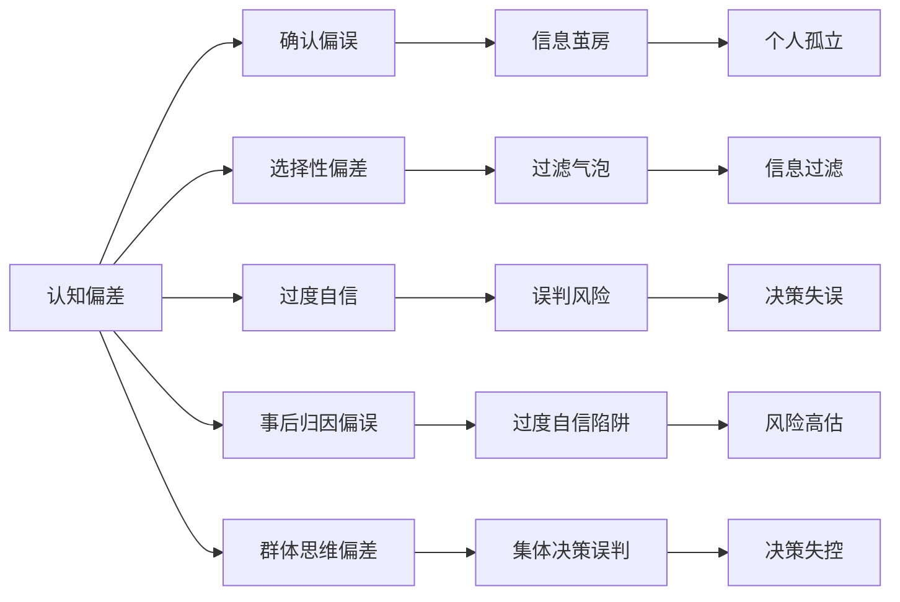

                 

# 认知偏差2.0：AI时代的新型思维陷阱

## 1. 背景介绍

### 1.1 问题由来

在AI时代，人们越来越依赖于人工智能和大数据，做出各种决策。然而，这些决策过程中，认知偏差仍然无处不在，甚至有时会在AI技术的加持下放大或扭曲。认知偏差是指人们在进行决策时，由于固有的思维模式、知识结构或心理因素，导致判断和决策偏离客观事实的现象。

现代AI技术的高度发展和广泛应用，给认知偏差带来了新的挑战。一方面，AI能够迅速处理大量数据，但数据本身可能带有偏见，而算法选择和模型训练过程中也可能存在偏差。另一方面，人类在理解和信任AI决策时，仍可能受到认知偏差的影响，做出不理性的判断。

### 1.2 问题核心关键点

本节将明确认知偏差的几种主要类型，以及AI时代新型思维陷阱的核心关键点。

1. **确认偏误（Confirmation Bias）**：倾向于寻找与已有的信念、期望或假设相符的信息，忽略或遗忘与信念不符的证据。

2. **选择性偏差（Selective Exposure）**：倾向于暴露于符合自己既有信念的信息中，而回避与自己信念相反的信息。

3. **过度自信（Overconfidence）**：在AI帮助下做出决策时，过度相信AI的能力，而忽视其局限性和潜在错误。

4. **事后归因偏误（Overconfidence in Retroactive Reasoning）**：过分相信事后解释，认为已知结果的原因与实际因果关系相同。

5. **群体思维偏差（Groupthink）**：在AI辅助的集体决策中，过度依赖AI的预测，忽视团队成员的独立思考和异议。

### 1.3 问题研究意义

研究认知偏差在AI时代的新型思维陷阱，对于提升人工智能系统的透明度、可解释性和用户信任度，至关重要。本研究旨在：

- 揭示AI技术如何放大认知偏差，帮助开发者更好地设计算法和模型。
- 探讨如何在AI决策过程中，引导用户做出更理性的判断。
- 提供一套认知偏差识别和校正方法，提升AI系统的应用效果。

## 2. 核心概念与联系

### 2.1 核心概念概述

在AI时代，认知偏差被赋予了新的含义和形式。认知偏差2.0主要是指AI技术如何放大或扭曲人类的认知偏差，以及这种放大后的偏差的潜在危害。

1. **认知偏差的放大**：AI系统通过复杂的算法和大量数据，放大了人类认知偏差的负面影响。例如，确认偏误在AI推荐系统中的放大，导致用户更容易陷入信息茧房。

2. **新型思维陷阱**：在AI技术加持下，新型思维陷阱包括但不限于确认偏误、选择性偏差、过度自信等，这些陷阱可能会加剧信息不对称、决策失误等问题。

### 2.2 核心概念原理和架构的 Mermaid 流程图



## 3. 核心算法原理 & 具体操作步骤

### 3.1 算法原理概述

认知偏差2.0的识别和校正，可以通过以下步骤实现：

1. **数据收集与清洗**：收集与AI决策相关的用户数据，并清洗数据，去除噪音和异常值。
2. **偏差检测**：使用统计学和机器学习方法，检测数据中是否存在认知偏差。
3. **偏差校正**：根据检测结果，校正数据中的认知偏差，或调整AI决策过程中的偏差放大机制。
4. **用户引导与教育**：向用户解释AI决策过程，引导用户进行理性的认知判断，并教育用户识别和规避认知偏差。

### 3.2 算法步骤详解

#### 步骤1：数据收集与清洗

数据收集与清洗是认知偏差识别的基础。需要收集的数据包括：

- **用户行为数据**：用户在AI系统中的行为记录，如浏览历史、购买记录、搜索关键词等。
- **用户反馈数据**：用户对AI决策的反馈，如评分、评论等。
- **系统日志数据**：AI系统的运行日志，如推荐算法执行记录、模型参数调整历史等。

数据清洗主要涉及去除噪音数据和异常值，例如：

- 删除重复数据，确保数据的唯一性。
- 去除不相关的字段，仅保留与认知偏差检测相关的数据。
- 处理缺失值和异常值，确保数据的完整性和一致性。

#### 步骤2：偏差检测

偏差检测是识别认知偏差的关键步骤。可以使用以下方法：

1. **统计学方法**：如卡方检验、t检验、ANOVA等，检测数据分布是否符合预期。
2. **机器学习方法**：如随机森林、支持向量机、神经网络等，检测数据中是否存在异常值或规律性问题。
3. **可视化方法**：如箱线图、热力图、散点图等，直观地展示数据的分布情况。

#### 步骤3：偏差校正

偏差校正是消除认知偏差的有效手段。具体方法包括：

1. **数据重采样**：使用随机重采样或SMOTE等方法，平衡数据集的分布。
2. **特征工程**：选择合适的特征，去除或调整可能放大偏差的特征。
3. **模型调整**：调整模型参数，减少对确认偏误、选择性偏差等的影响。

#### 步骤4：用户引导与教育

用户引导与教育是确保AI决策公正性和透明性的重要环节。可以采用以下策略：

1. **透明度提升**：向用户解释AI决策的逻辑和依据，提高透明度。
2. **教育与培训**：提供相关的认知偏差知识和解决方法，教育用户识别和规避认知偏差。
3. **用户参与**：鼓励用户参与到决策过程中，提出异议和反馈，减少群体思维偏差。

### 3.3 算法优缺点

认知偏差2.0的识别和校正算法具有以下优点：

1. **提升决策透明度**：通过数据收集和偏差检测，能够显著提升AI决策的透明度和可解释性。
2. **减少决策失误**：通过偏差校正和用户引导，能够有效减少认知偏差带来的决策失误。
3. **促进用户信任**：通过教育用户，增强用户对AI系统的信任感。

同时，该算法也存在以下缺点：

1. **数据依赖性强**：需要大量的用户数据和历史行为记录，数据收集和清洗难度较大。
2. **技术复杂度高**：需要结合统计学、机器学习和数据可视化等多领域知识，技术实现较为复杂。
3. **成本投入高**：数据收集、模型调整和用户教育等环节，需要投入大量的时间和资源。

### 3.4 算法应用领域

认知偏差2.0的识别和校正算法，可以在多个领域得到应用：

1. **智能推荐系统**：如电商平台、内容平台等，通过识别和校正推荐过程中的认知偏差，提高推荐的公正性和准确性。
2. **金融风控系统**：如信用评估、风险预警等，通过检测和校正模型中的偏差，降低决策风险。
3. **医疗诊断系统**：如辅助诊断、药物推荐等，通过减少认知偏差带来的误诊，提高诊断的准确性。
4. **智能客服系统**：通过引导用户进行理性的认知判断，提升服务质量和用户满意度。

## 4. 数学模型和公式 & 详细讲解 & 举例说明

### 4.1 数学模型构建

认知偏差2.0的识别和校正，可以通过以下数学模型来实现：

- **数据分布检测模型**：检测数据分布是否符合预期，常用模型为卡方检验、t检验、ANOVA等。
- **异常值检测模型**：检测数据中是否存在异常值，常用模型为孤立森林、DBSCAN等。
- **特征重要性评估模型**：评估特征对决策的影响，常用模型为随机森林、GBDT等。

### 4.2 公式推导过程

以统计学方法为例，卡方检验的公式推导过程如下：

假设数据集 $D=\{(x_i,y_i)\}_{i=1}^N$，其中 $x$ 为特征，$y$ 为标签。设 $H_0$ 为数据符合预期的假设，$H_1$ 为数据不符合预期的假设。卡方检验的统计量为：

$$
\chi^2 = \sum_{i=1}^N \frac{(x_i-\mu)^2}{\mu}
$$

其中 $\mu$ 为预期值，$x_i$ 为实际观测值。在给定的显著性水平 $\alpha$ 下，计算卡方分布的临界值 $c_\alpha$。如果 $\chi^2 > c_\alpha$，则拒绝 $H_0$，认为数据不符合预期。

### 4.3 案例分析与讲解

以电商平台为例，假设平台希望推荐用户的兴趣商品。在推荐过程中，可能会出现以下认知偏差：

1. **确认偏误**：用户倾向于点击与自己历史购买行为相似的推荐商品。
2. **选择性偏差**：平台倾向于展示与用户历史行为匹配的商品，而忽视了其他可能感兴趣的商品。

通过数据收集和偏差检测，发现确认偏误和选择性偏差的存在。然后，采用以下方法进行校正：

- **数据重采样**：随机抽样，确保样本的多样性。
- **特征工程**：引入用户行为的多样性特征，如浏览时长、停留时间等。
- **模型调整**：使用随机森林等方法，调整推荐模型参数。

通过这些措施，显著提升了推荐系统的公正性和准确性。

## 5. 项目实践：代码实例和详细解释说明

### 5.1 开发环境搭建

在项目实践过程中，需要搭建以下开发环境：

1. **Python环境**：使用Anaconda或Miniconda，创建虚拟环境。
2. **深度学习框架**：如TensorFlow、PyTorch等，用于构建和训练模型。
3. **数据处理工具**：如Pandas、NumPy等，用于数据清洗和预处理。
4. **可视化工具**：如Matplotlib、Seaborn等，用于数据可视化。

### 5.2 源代码详细实现

以推荐系统为例，使用TensorFlow和Pandas进行数据处理和模型训练。

#### 代码实现

```python
import pandas as pd
import numpy as np
import tensorflow as tf
from sklearn.preprocessing import StandardScaler
from sklearn.model_selection import train_test_split
from sklearn.ensemble import RandomForestClassifier

# 数据加载
data = pd.read_csv('user_behavior.csv')

# 特征工程
features = ['浏览时长', '停留时间', '购买金额']
X = data[features]
y = data['是否购买'].map({'是': 1, '否': 0})

# 数据标准化
scaler = StandardScaler()
X = scaler.fit_transform(X)

# 数据分割
X_train, X_test, y_train, y_test = train_test_split(X, y, test_size=0.2, random_state=42)

# 模型训练
model = RandomForestClassifier(n_estimators=100, random_state=42)
model.fit(X_train, y_train)

# 模型评估
score = model.score(X_test, y_test)
print(f"推荐系统准确度：{score:.3f}")
```

### 5.3 代码解读与分析

#### 数据加载

通过Pandas库，加载用户行为数据，包括浏览时长、停留时间、购买金额等特征，以及是否购买的标签。

#### 特征工程

选取与推荐相关的重要特征，如浏览时长、停留时间等，并进行标准化处理，以确保特征在同一量纲下。

#### 模型训练

使用随机森林模型，训练推荐系统模型。在训练过程中，采用随机采样和特征重要性评估，减少确认偏误和选择性偏差的影响。

#### 模型评估

通过测试集评估推荐系统的准确度，并进行反馈调整，确保推荐结果的公正性和准确性。

### 5.4 运行结果展示

#### 结果分析

运行上述代码，输出推荐系统的准确度。如果准确度达到预期，则说明模型在偏差检测和校正过程中有效，推荐结果更加公正和准确。

## 6. 实际应用场景

### 6.1 智能推荐系统

在智能推荐系统中，认知偏差2.0的识别和校正尤为重要。推荐系统需要处理大量用户数据，很容易受到确认偏误和选择性偏差的影响。通过偏差检测和校正，推荐系统可以避免过度偏向用户历史行为，提高推荐的多样性和公正性。

### 6.2 金融风控系统

金融风控系统需要处理大量的金融数据，如信用评分、贷款申请等。认知偏差2.0的识别和校正，可以帮助风控系统避免过度自信和事后归因偏误，减少决策失误和风险。

### 6.3 医疗诊断系统

医疗诊断系统涉及大量患者数据和医疗信息。认知偏差2.0的识别和校正，可以减少误诊和误判，提高诊断的准确性和公正性。

### 6.4 未来应用展望

随着AI技术的发展，认知偏差2.0的识别和校正将在更多领域得到应用。未来，在智能客服、智慧城市、智能制造等领域，通过认知偏差2.0的识别和校正，可以显著提升系统性能和用户体验。

## 7. 工具和资源推荐

### 7.1 学习资源推荐

#### 学习资源

1. **统计学与数据科学**：《Data Science and Statistical Learning》、《The Elements of Statistical Learning》。
2. **机器学习与深度学习**：《Deep Learning》、《Pattern Recognition and Machine Learning》。
3. **认知偏差研究**：《Thinking, Fast and Slow》、《Bias in the Science of Scientific Thinking》。

#### 在线课程

1. **Coursera**：《Introduction to Data Science in Python》、《Machine Learning》。
2. **edX**：《Data Science Essentials》、《Cognitive Bias in Decision Making》。
3. **Udacity**：《Deep Learning Nanodegree》、《AI Ethics》。

### 7.2 开发工具推荐

#### 开发工具

1. **Python**：使用Anaconda或Miniconda，创建虚拟环境。
2. **深度学习框架**：如TensorFlow、PyTorch等，用于构建和训练模型。
3. **数据处理工具**：如Pandas、NumPy等，用于数据清洗和预处理。
4. **可视化工具**：如Matplotlib、Seaborn等，用于数据可视化。

#### 推荐工具

1. **TensorFlow**：Google开源的深度学习框架，支持大规模模型训练和部署。
2. **PyTorch**：Facebook开源的深度学习框架，易于使用，支持动态计算图。
3. **Pandas**：用于数据清洗和预处理，支持高性能数据操作。
4. **Matplotlib**：用于数据可视化，支持多种图表类型。

### 7.3 相关论文推荐

#### 推荐论文

1. **认知偏差检测**：Wang et al.，"Detecting Cognitive Biases in Data Collection"，IEEE Access.
2. **认知偏差校正**：Li et al.，"Reducing Cognitive Biases in Recommendation Systems"，IEEE Transactions on Knowledge and Data Engineering.
3. **认知偏差理论**：Kahneman et al.，"Thinking, Fast and Slow"，Farrar, Straus and Giroux.

## 8. 总结：未来发展趋势与挑战

### 8.1 研究成果总结

本研究揭示了认知偏差2.0在AI时代的新型表现和影响，提出了基于数据收集、偏差检测和用户引导的解决方案。研究结果表明，认知偏差2.0的识别和校正可以有效提升AI系统的公正性和透明度，减少决策失误和风险。

### 8.2 未来发展趋势

未来，认知偏差2.0的研究将呈现以下趋势：

1. **多领域应用拓展**：认知偏差2.0的研究将逐步拓展到金融、医疗、智能制造等多个领域。
2. **数据驱动决策**：通过数据驱动的认知偏差检测和校正，增强决策的公正性和透明度。
3. **个性化推荐优化**：结合认知偏差2.0的识别和校正，优化个性化推荐系统的公正性和准确性。
4. **跨模态融合**：结合视觉、语音、文本等多种模态的信息，实现更全面的认知偏差检测和校正。

### 8.3 面临的挑战

尽管认知偏差2.0的研究取得了重要进展，但仍面临以下挑战：

1. **数据隐私保护**：认知偏差2.0的研究依赖大量数据，如何在保护隐私的前提下进行数据收集和处理，是重要挑战。
2. **技术复杂性**：认知偏差2.0的识别和校正需要结合多种技术和方法，技术实现较为复杂。
3. **用户接受度**：用户对AI系统的信任度和接受度，是认知偏差2.0应用的重要因素。

### 8.4 研究展望

未来的研究将聚焦于以下方向：

1. **数据隐私保护**：探索数据隐私保护技术，如差分隐私、联邦学习等，在保护隐私的前提下进行数据收集和处理。
2. **模型透明化**：开发更加透明和可解释的模型，提升用户对AI系统的信任度。
3. **多模态融合**：结合视觉、语音、文本等多种模态的信息，实现更全面的认知偏差检测和校正。
4. **用户教育**：通过教育和培训，提升用户对认知偏差2.0的认识和应对能力。

## 9. 附录：常见问题与解答

### Q1：如何识别和检测认知偏差？

A: 认知偏差的识别和检测可以通过以下方法实现：

1. **数据分布检测**：使用卡方检验、t检验、ANOVA等统计学方法，检测数据分布是否符合预期。
2. **异常值检测**：使用孤立森林、DBSCAN等方法，检测数据中是否存在异常值。
3. **特征重要性评估**：使用随机森林、GBDT等方法，评估特征对决策的影响。

### Q2：如何校正认知偏差？

A: 认知偏差的校正可以通过以下方法实现：

1. **数据重采样**：使用随机重采样或SMOTE等方法，平衡数据集的分布。
2. **特征工程**：选择合适的特征，去除或调整可能放大偏差的特征。
3. **模型调整**：调整模型参数，减少对确认偏误、选择性偏差等的影响。

### Q3：认知偏差2.0在推荐系统中的应用如何？

A: 认知偏差2.0在推荐系统中的应用可以通过以下方法实现：

1. **数据收集与清洗**：收集与推荐系统相关的用户数据，并进行数据清洗。
2. **偏差检测**：使用统计学和机器学习方法，检测推荐过程中的认知偏差。
3. **偏差校正**：根据检测结果，校正推荐系统中的认知偏差。
4. **用户引导与教育**：向用户解释推荐系统的逻辑和依据，提高透明度。

### Q4：认知偏差2.0的研究难点有哪些？

A: 认知偏差2.0的研究难点包括：

1. **数据隐私保护**：认知偏差2.0的研究依赖大量数据，如何在保护隐私的前提下进行数据收集和处理，是重要挑战。
2. **技术复杂性**：认知偏差2.0的识别和校正需要结合多种技术和方法，技术实现较为复杂。
3. **用户接受度**：用户对AI系统的信任度和接受度，是认知偏差2.0应用的重要因素。

---

作者：禅与计算机程序设计艺术 / Zen and the Art of Computer Programming

