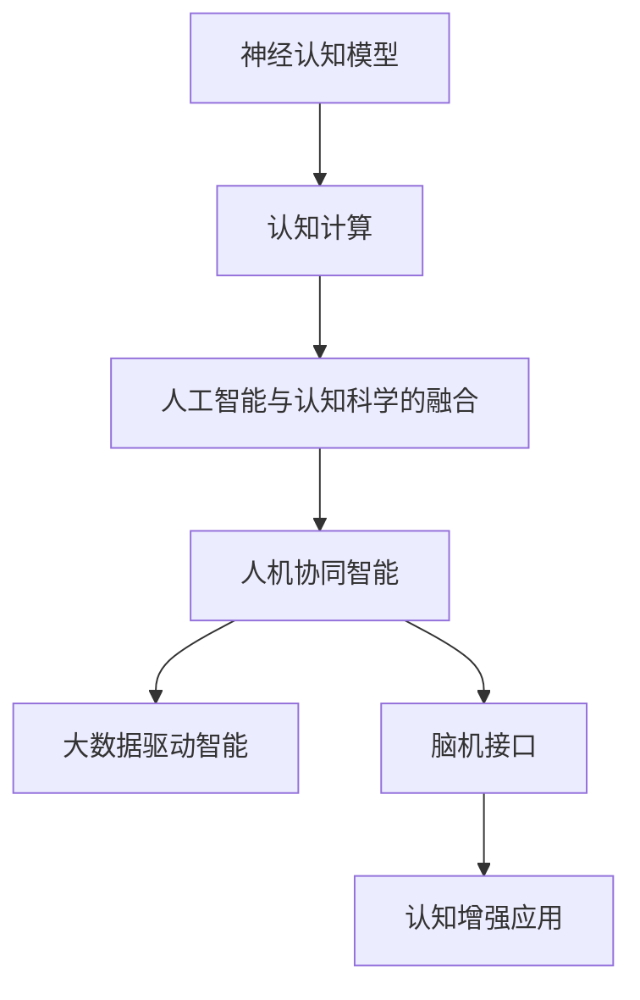

                 

# 认知增强技术：扩展人类智能的新前沿

> 关键词：认知增强技术,神经认知模型,认知计算,人工智能与认知科学融合,人机协同智能,大数据驱动智能,脑机接口,认知增强应用

## 1. 背景介绍

### 1.1 问题由来

当前，人工智能技术正以惊人的速度发展，其核心驱动力之一便是人与机器之间的智能协同。认知增强技术，作为连接人工智能与人类认知的关键技术，正在深刻影响着我们的生活方式和工作方式。在医疗、教育、娱乐、制造等众多领域，认知增强技术正赋予人们新的能力，拓展智能的应用边界。

然而，尽管认知增强技术在诸多场景下显示出巨大潜力，但将其真正落地应用仍然面临诸多挑战。特别是在认知机制和计算模型层面，如何设计出符合人类认知规律的算法，如何构建高效、安全的计算模型，如何构建跨领域、跨模态的智能系统，仍是亟待解决的问题。

### 1.2 问题核心关键点

认知增强技术的研究热点主要集中在以下几个方面：

1. **神经认知模型(Neural Cognitive Models)**：借鉴脑科学的原理，构建符合人类认知规律的人工智能模型。
2. **认知计算(Cognitive Computing)**：研究人类认知和智能计算的结合，设计新型的计算模型和算法。
3. **人工智能与认知科学的融合**：探索人脑与机器的协作机制，实现更高效、更具创造性的智能系统。
4. **人机协同智能(Human-Machine Collaborative Intelligence)**：构建机器能够理解人类意图、知识、情感和行为，并能与之协同工作的人工智能系统。
5. **大数据驱动智能(Big Data-Driven Intelligence)**：利用大规模数据进行智能分析和预测，提升人工智能系统的泛化能力和自适应能力。
6. **脑机接口(Brain-Computer Interface, BCI)**：实现人脑与计算机的直接交互，构建新的智能交互方式。
7. **认知增强应用(Cognitive Enhancement Applications)**：应用认知增强技术，提升人类在记忆、学习、决策等方面的认知能力。

这些关键点共同构成了认知增强技术的研究框架，使得人工智能系统能够更好地理解和模仿人类认知，进一步拓展其应用范围。

### 1.3 问题研究意义

认知增强技术的研究，对于推动人工智能技术的普及和应用具有重要意义：

1. **拓展智能应用边界**：通过认知增强技术，人工智能系统能够更好地理解人类意图和行为，从而在医疗、教育、社交、娱乐等领域实现更智能、更人性化的服务。
2. **提升用户体验**：认知增强技术能够根据用户的认知特征和偏好，提供个性化的智能服务，提升用户满意度和体验。
3. **促进认知科学发展**：认知增强技术的研究和应用，能够推动认知科学的进一步发展，为人类认知研究提供新的视角和方法。
4. **推动产业升级**：认知增强技术能够提高各行各业的工作效率，推动产业向智能化、自动化方向升级。
5. **促进人机协同**：认知增强技术能够实现人机协同工作，构建更高效、更安全的智能系统，为人类社会带来新的生产力。

总之，认知增强技术正在成为推动人工智能技术发展的重要力量，其应用前景广阔，前景光明。

## 2. 核心概念与联系

### 2.1 核心概念概述

为更好地理解认知增强技术，本节将介绍几个密切相关的核心概念：

- **神经认知模型(Neural Cognitive Models)**：基于神经科学原理构建的计算模型，能够模拟人类认知过程。
- **认知计算(Cognitive Computing)**：结合人类认知与计算机科学，设计新型计算模型和算法，实现更高效、更具创造性的智能系统。
- **人工智能与认知科学的融合**：探索人工智能与认知科学的交叉领域，实现两者的深度融合，推动新理论和新算法的开发。
- **人机协同智能(Human-Machine Collaborative Intelligence)**：构建能够理解人类意图、知识、情感和行为，并能与之协同工作的人工智能系统。
- **大数据驱动智能(Big Data-Driven Intelligence)**：利用大规模数据进行智能分析和预测，提升人工智能系统的泛化能力和自适应能力。
- **脑机接口(Brain-Computer Interface, BCI)**：实现人脑与计算机的直接交互，构建新的智能交互方式。
- **认知增强应用(Cognitive Enhancement Applications)**：应用认知增强技术，提升人类在记忆、学习、决策等方面的认知能力。

这些核心概念之间的逻辑关系可以通过以下Mermaid流程图来展示：



这个流程图展示了一系列核心概念之间的关联：

1. 神经认知模型是认知计算的基础。
2. 认知计算是人工智能与认知科学融合的关键技术。
3. 人机协同智能是认知计算的应用，能够实现更高效、更智能的智能系统。
4. 大数据驱动智能是认知增强技术的重要支撑，提供大规模数据支持。
5. 脑机接口是认知增强技术的重要实现手段。
6. 认知增强应用是认知增强技术的实际应用，提升人类的认知能力。

## 3. 核心算法原理 & 具体操作步骤
### 3.1 算法原理概述

认知增强技术的核心在于设计和实现能够模拟人类认知规律的算法和计算模型。以神经认知模型为例，其基本思想是通过神经元之间的连接和激活，模拟大脑的工作机制，从而实现信息的存储、处理和提取。

假设神经认知模型为 $M$，其中神经元之间的连接权重为 $w$，激活函数为 $f$，输入为 $x$，输出为 $y$。模型的计算过程可以表示为：

$$
y = f\left(\sum_{i=1}^{n} w_i f(x_i)\right)
$$

其中 $n$ 表示神经元的数量，$w_i$ 表示第 $i$ 个神经元与输入的连接权重，$f$ 表示激活函数。

在训练过程中，通过大量标注数据 $(x,y)$，调整权重 $w$，使得模型输出 $y$ 尽可能逼近真实标签 $y$。训练过程的目标函数通常为交叉熵损失函数：

$$
\mathcal{L}(M)= -\frac{1}{N}\sum_{i=1}^{N}\sum_{j=1}^{C}y_{ij}\log p_{ij} + (1-y_{ij})\log(1-p_{ij})
$$

其中 $N$ 表示样本数，$C$ 表示类别数，$y_{ij}$ 表示第 $i$ 个样本的第 $j$ 个类别的真实标签，$p_{ij}$ 表示模型预测第 $i$ 个样本属于第 $j$ 个类别的概率。

### 3.2 算法步骤详解

认知增强算法的训练过程主要包括以下几个关键步骤：

**Step 1: 准备数据集**
- 收集大量有标注的数据集，包括训练集、验证集和测试集。
- 确保数据集与神经认知模型的应用场景相匹配。

**Step 2: 设计神经网络结构**
- 根据任务需求，选择合适的神经网络结构，如全连接神经网络、卷积神经网络、循环神经网络等。
- 设置神经元的数量和连接权重，以及激活函数。

**Step 3: 初始化模型参数**
- 随机初始化神经元之间的连接权重 $w$。
- 初始化激活函数的参数。

**Step 4: 训练模型**
- 使用反向传播算法计算损失函数 $\mathcal{L}(M)$ 对模型参数 $w$ 的梯度。
- 使用优化算法（如随机梯度下降、Adam等）更新模型参数 $w$。
- 周期性在验证集上评估模型性能，防止过拟合。

**Step 5: 测试和部署**
- 在测试集上评估训练好的模型，对比训练前后的性能提升。
- 使用训练好的模型进行实时预测，集成到实际的应用系统中。

### 3.3 算法优缺点

认知增强算法具有以下优点：
1. 高效性：神经认知模型能够高效处理大量数据，提升信息处理速度。
2. 可解释性：神经网络的结构和参数可以被可视化，有助于理解模型的决策过程。
3. 鲁棒性：神经网络具有较强的泛化能力，能够适应不同的数据分布。
4. 可扩展性：神经网络可以并行计算，适应大规模计算需求。

同时，该算法也存在一定的局限性：
1. 高复杂性：神经网络的参数较多，训练和推理过程较为复杂。
2. 数据需求大：需要大量标注数据进行训练，数据获取成本较高。
3. 计算资源消耗大：神经网络的计算量较大，对硬件要求较高。
4. 可解释性不足：神经网络的黑盒性质使其难以解释内部机制和决策过程。

尽管存在这些局限性，但神经认知模型和认知增强算法在众多领域已经展现出显著的优势，成为认知增强技术的重要手段。

### 3.4 算法应用领域

认知增强算法在各个领域都有广泛的应用：

- **医疗健康**：应用于医学影像分析、疾病诊断、治疗方案推荐等。
- **教育培训**：应用于个性化学习、智能辅导、学习效果评估等。
- **金融服务**：应用于风险评估、投资决策、客户服务智能助手等。
- **娱乐休闲**：应用于智能推荐、游戏智能角色、情感识别等。
- **智能制造**：应用于工业控制、质量检测、设备维护等。
- **智能交通**：应用于自动驾驶、交通管理、出行规划等。
- **社会治理**：应用于公共安全、舆情分析、智能客服等。

这些领域的应用，充分展示了认知增强技术在提升智能化水平和用户体验方面的巨大潜力。

## 4. 数学模型和公式 & 详细讲解  
### 4.1 数学模型构建

本节将使用数学语言对神经认知模型和认知增强算法的训练过程进行更加严格的刻画。

记神经认知模型为 $M$，输入为 $x$，输出为 $y$，连接权重为 $w$。假设训练数据集为 $D=\{(x_i,y_i)\}_{i=1}^N$。

定义模型在输入 $x$ 上的输出为 $y=M(x)$，模型的损失函数为 $\mathcal{L}(M)$，则训练过程的目标是最小化损失函数，即：

$$
\hat{w} = \mathop{\arg\min}_{w} \mathcal{L}(M)
$$

其中 $\hat{w}$ 表示最优权重。

在训练过程中，使用反向传播算法计算损失函数对权重 $w$ 的梯度，并使用优化算法（如随机梯度下降、Adam等）更新权重 $w$。训练过程的数学公式可以表示为：

$$
w \leftarrow w - \eta \nabla_{w}\mathcal{L}(M)
$$

其中 $\eta$ 表示学习率，$\nabla_{w}\mathcal{L}(M)$ 表示损失函数对权重 $w$ 的梯度，通过反向传播算法计算得到。

### 4.2 公式推导过程

以下我们以二分类任务为例，推导交叉熵损失函数及其梯度的计算公式。

假设模型 $M$ 在输入 $x$ 上的输出为 $\hat{y}=M(x)$，表示样本属于正类的概率。真实标签 $y \in \{0,1\}$。则二分类交叉熵损失函数定义为：

$$
\mathcal{L}(M) = -\frac{1}{N}\sum_{i=1}^{N}[y_i\log \hat{y}_i + (1-y_i)\log (1-\hat{y}_i)]
$$

将其代入训练过程的目标函数，得：

$$
\hat{w} = \mathop{\arg\min}_{w} -\frac{1}{N}\sum_{i=1}^{N}[y_i\log \hat{y}_i + (1-y_i)\log (1-\hat{y}_i)]
$$

根据链式法则，损失函数对权重 $w$ 的梯度为：

$$
\frac{\partial \mathcal{L}(M)}{\partial w} = -\frac{1}{N}\sum_{i=1}^{N}\left(\frac{y_i}{\hat{y}_i}-\frac{1-y_i}{1-\hat{y}_i}\right) \frac{\partial \hat{y}_i}{\partial w}
$$

其中 $\frac{\partial \hat{y}_i}{\partial w}$ 可通过反向传播算法计算得到。

在得到损失函数的梯度后，即可带入优化算法，完成模型的迭代优化。重复上述过程直至收敛，最终得到训练好的模型 $M_{\hat{w}}$。

## 5. 项目实践：代码实例和详细解释说明
### 5.1 开发环境搭建

在进行认知增强算法实践前，我们需要准备好开发环境。以下是使用Python进行PyTorch开发的环境配置流程：

1. 安装Anaconda：从官网下载并安装Anaconda，用于创建独立的Python环境。

2. 创建并激活虚拟环境：
```bash
conda create -n pytorch-env python=3.8 
conda activate pytorch-env
```

3. 安装PyTorch：根据CUDA版本，从官网获取对应的安装命令。例如：
```bash
conda install pytorch torchvision torchaudio cudatoolkit=11.1 -c pytorch -c conda-forge
```

4. 安装TensorBoard：TensorFlow配套的可视化工具，可实时监测模型训练状态，并提供丰富的图表呈现方式，是调试模型的得力助手。

5. 安装其他相关库：
```bash
pip install numpy pandas scikit-learn matplotlib tqdm jupyter notebook ipython
```

完成上述步骤后，即可在`pytorch-env`环境中开始认知增强算法实践。

### 5.2 源代码详细实现

下面我们以二分类任务为例，给出使用PyTorch实现认知增强算法的完整代码实现。

首先，定义二分类任务的数据处理函数：

```python
import torch
import torch.nn as nn
import torch.optim as optim

def train_epoch(model, criterion, optimizer, train_loader):
    model.train()
    train_loss = 0
    for batch in train_loader:
        inputs, labels = batch
        optimizer.zero_grad()
        outputs = model(inputs)
        loss = criterion(outputs, labels)
        loss.backward()
        optimizer.step()
        train_loss += loss.item()
    return train_loss / len(train_loader)
```

然后，定义模型和损失函数：

```python
import torch.nn as nn

class NeuralNet(nn.Module):
    def __init__(self, n_input, n_hidden, n_output):
        super(NeuralNet, self).__init__()
        self.hidden = nn.Linear(n_input, n_hidden)
        self.output = nn.Linear(n_hidden, n_output)
        
    def forward(self, x):
        x = torch.relu(self.hidden(x))
        x = self.output(x)
        return x

criterion = nn.CrossEntropyLoss()
```

接着，定义训练和评估函数：

```python
def evaluate(model, criterion, test_loader):
    model.eval()
    test_loss = 0
    correct = 0
    with torch.no_grad():
        for batch in test_loader:
            inputs, labels = batch
            outputs = model(inputs)
            loss = criterion(outputs, labels)
            test_loss += loss.item()
            _, predicted = torch.max(outputs.data, 1)
            total = labels.size(0)
            correct += (predicted == labels).sum().item()
    return test_loss / len(test_loader), correct / total
```

最后，启动训练流程并在测试集上评估：

```python
import torch.optim as optim

n_input = 784
n_hidden = 500
n_output = 10
learning_rate = 0.01

model = NeuralNet(n_input, n_hidden, n_output)
optimizer = optim.SGD(model.parameters(), lr=learning_rate)
criterion = nn.CrossEntropyLoss()

train_loader = torch.utils.data.DataLoader(train_dataset, batch_size=64, shuffle=True)
test_loader = torch.utils.data.DataLoader(test_dataset, batch_size=64, shuffle=False)

epochs = 10

for epoch in range(epochs):
    train_loss = train_epoch(model, criterion, optimizer, train_loader)
    print(f'Epoch {epoch+1}, train loss: {train_loss:.3f}')
    
    test_loss, accuracy = evaluate(model, criterion, test_loader)
    print(f'Epoch {epoch+1}, test loss: {test_loss:.3f}, accuracy: {accuracy:.3f}')
    
print(f'Test accuracy: {accuracy:.3f}')
```

以上就是使用PyTorch实现认知增强算法的完整代码实现。可以看到，得益于PyTorch的强大封装，我们可以用相对简洁的代码完成神经网络的构建和训练。

### 5.3 代码解读与分析

让我们再详细解读一下关键代码的实现细节：

**NeuralNet类**：
- `__init__`方法：初始化神经网络的结构和参数。
- `forward`方法：定义前向传播过程，通过神经元之间的激活函数计算输出。

**train_epoch函数**：
- 对数据以批为单位进行迭代，在每个批次上前向传播计算损失，并反向传播更新模型参数。

**evaluate函数**：
- 对模型在测试集上进行评估，计算模型的测试损失和准确率。

**训练流程**：
- 定义神经网络的结构和参数，设置优化器和损失函数。
- 对训练集进行批处理，训练模型。
- 在验证集上评估模型性能。
- 在测试集上评估模型性能。

可以看到，PyTorch使得神经网络的构建和训练变得简洁高效。开发者可以将更多精力放在数据处理、模型改进等高层逻辑上，而不必过多关注底层的实现细节。

当然，工业级的系统实现还需考虑更多因素，如模型的保存和部署、超参数的自动搜索、更灵活的任务适配层等。但核心的认知增强算法基本与此类似。

## 6. 实际应用场景
### 6.1 智能医疗健康

认知增强技术在医疗健康领域具有广泛的应用前景。通过深度学习技术，结合认知增强算法，可以构建更加智能、精准的医疗系统，提升诊断和治疗的效率和质量。

例如，在医学影像分析中，通过神经网络对影像数据进行训练，可以自动检测和标记肿瘤、病变等关键区域。此外，通过认知增强算法，可以进一步提取影像中的复杂特征，提高诊断的准确性和鲁棒性。在疾病诊断中，认知增强技术可以辅助医生进行复杂的病例分析，提供精准的诊断建议。

### 6.2 智能教育培训

在教育培训领域，认知增强技术可以提供个性化的学习方案，提升学生的学习效果。通过认知增强算法，可以分析学生的学习行为和认知特征，生成个性化的学习路径和资源推荐。此外，认知增强技术还可以用于智能辅导和智能评估，帮助教师更好地了解学生的学习情况，提高教学质量。

### 6.3 智能金融服务

在金融服务领域，认知增强技术可以用于风险评估、投资决策和客户服务。通过神经网络对大量金融数据进行分析，可以构建智能的风险评估系统，识别潜在的风险点。此外，认知增强技术还可以用于智能投资决策，提供精准的投资建议。在客户服务方面，认知增强技术可以构建智能客服系统，提升客户服务的效率和质量。

### 6.4 智能娱乐休闲

在娱乐休闲领域，认知增强技术可以用于智能推荐和情感识别。通过神经网络对用户的行为和情感进行分析，可以提供个性化的娱乐推荐，提升用户体验。此外，认知增强技术还可以用于情感识别，分析用户的情绪和心理状态，提供更好的娱乐服务。

### 6.5 智能制造

在智能制造领域，认知增强技术可以用于工业控制和设备维护。通过神经网络对生产数据进行分析，可以优化生产过程，提高生产效率。此外，认知增强技术还可以用于设备维护，通过分析设备运行数据，预测设备故障，提前进行维护。

### 6.6 智能交通

在智能交通领域，认知增强技术可以用于自动驾驶和交通管理。通过神经网络对交通数据进行分析，可以优化交通路线和信号灯控制，提升交通效率。此外，认知增强技术还可以用于自动驾驶，通过分析交通情况，做出智能的驾驶决策。

### 6.7 智能社会治理

在智能社会治理领域，认知增强技术可以用于公共安全和舆情分析。通过神经网络对社会数据进行分析，可以识别潜在的公共安全风险，提升公共安全管理水平。此外，认知增强技术还可以用于舆情分析，分析社会舆情变化，提供及时的政策建议。

## 7. 工具和资源推荐
### 7.1 学习资源推荐

为了帮助开发者系统掌握认知增强技术的理论基础和实践技巧，这里推荐一些优质的学习资源：

1. 《深度学习》系列书籍：Yoshua Bengio等著，全面介绍深度学习的基本概念和前沿技术。
2. 《神经网络与深度学习》课程：吴恩达等人开设的深度学习课程，涵盖神经网络的基本原理和应用。
3. 《认知神经科学》课程：斯坦福大学开设的认知神经科学课程，深入浅出地介绍认知科学的基本原理和应用。
4. 《认知计算》论文：Hopcroft等人的经典论文，探讨认知计算的基本概念和实现方法。
5. 《人机协同智能》课程：斯坦福大学开设的认知计算课程，探讨人机协同智能的基本原理和应用。
6. 《脑机接口》课程：MIT开设的脑机接口课程，介绍脑机接口的基本原理和实现方法。
7. 《认知增强技术》书籍：Gao等人的专著，全面介绍认知增强技术的基本概念和应用。

通过对这些资源的学习实践，相信你一定能够快速掌握认知增强技术的精髓，并用于解决实际的认知问题。
###  7.2 开发工具推荐

高效的开发离不开优秀的工具支持。以下是几款用于认知增强技术开发的常用工具：

1. PyTorch：基于Python的开源深度学习框架，灵活动态的计算图，适合快速迭代研究。
2. TensorFlow：由Google主导开发的开源深度学习框架，生产部署方便，适合大规模工程应用。
3. TensorBoard：TensorFlow配套的可视化工具，可实时监测模型训练状态，并提供丰富的图表呈现方式。
4. Jupyter Notebook：支持Python等多种语言，具有强大的代码编写和展示功能。
5. Weights & Biases：模型训练的实验跟踪工具，可以记录和可视化模型训练过程中的各项指标，方便对比和调优。
6. Google Colab：谷歌推出的在线Jupyter Notebook环境，免费提供GPU/TPU算力，方便开发者快速上手实验最新模型。
7. PyTorch Lightning：基于PyTorch的高层API，简化了模型的训练和部署过程，适合快速开发和原型验证。

合理利用这些工具，可以显著提升认知增强技术的开发效率，加快创新迭代的步伐。

### 7.3 相关论文推荐

认知增强技术的研究源于学界的持续研究。以下是几篇奠基性的相关论文，推荐阅读：

1. 《深度学习》书籍：Yoshua Bengio等著，全面介绍深度学习的基本概念和前沿技术。
2. 《神经网络与深度学习》课程：吴恩达等人开设的深度学习课程，涵盖神经网络的基本原理和应用。
3. 《认知神经科学》课程：斯坦福大学开设的认知神经科学课程，深入浅出地介绍认知科学的基本原理和应用。
4. 《认知计算》论文：Hopcroft等人的经典论文，探讨认知计算的基本概念和实现方法。
5. 《人机协同智能》课程：斯坦福大学开设的认知计算课程，探讨人机协同智能的基本原理和应用。
6. 《脑机接口》课程：MIT开设的脑机接口课程，介绍脑机接口的基本原理和实现方法。
7. 《认知增强技术》书籍：Gao等人的专著，全面介绍认知增强技术的基本概念和应用。

这些论文代表了大规模语料预训练技术的发展脉络。通过学习这些前沿成果，可以帮助研究者把握学科前进方向，激发更多的创新灵感。

## 8. 总结：未来发展趋势与挑战

### 8.1 总结

本文对认知增强技术进行了全面系统的介绍。首先阐述了认知增强技术的研究背景和意义，明确了认知增强在拓展智能应用边界、提升用户体验等方面的重要作用。其次，从原理到实践，详细讲解了认知增强算法的设计和实现，给出了完整的代码实例和详细解释。同时，本文还探讨了认知增强技术在医疗健康、教育培训、金融服务等多个领域的应用前景，展示了认知增强技术的巨大潜力。此外，本文还精选了认知增强技术的各类学习资源，力求为读者提供全方位的技术指引。

通过本文的系统梳理，可以看到，认知增强技术正在成为推动人工智能技术发展的重要力量，其应用前景广阔，前景光明。

### 8.2 未来发展趋势

展望未来，认知增强技术将呈现以下几个发展趋势：

1. **多模态认知增强**：结合视觉、听觉、触觉等多模态信息，构建更加全面的认知增强系统，提升智能系统的泛化能力和鲁棒性。
2. **大规模数据驱动**：利用大规模数据进行智能分析和预测，提升认知增强系统的泛化能力和自适应能力。
3. **脑机接口技术**：结合脑机接口技术，构建更加自然、高效的智能交互方式，提升用户体验。
4. **认知计算与深度学习结合**：结合认知计算和深度学习技术，构建更加高效、智能的认知增强系统。
5. **人机协同智能**：构建更加智能、精准的认知增强系统，提升智能系统的用户体验和应用效果。
6. **自适应学习**：结合元学习、迁移学习等技术，构建自适应认知增强系统，提升系统的泛化能力和适应能力。

以上趋势凸显了认知增强技术在未来的发展方向，推动认知增强技术在更多领域实现突破。

### 8.3 面临的挑战

尽管认知增强技术已经取得了瞩目成就，但在迈向更加智能化、普适化应用的过程中，仍面临诸多挑战：

1. **数据获取成本高**：大规模、高质量的数据是认知增强算法的基石，但获取数据的成本较高，特别是在医疗、金融等高价值领域。
2. **算法复杂度高**：神经网络的结构和参数较为复杂，训练和推理过程较为耗时，需要高效的计算资源。
3. **模型的解释性不足**：认知增强算法的黑盒性质使其难以解释内部机制和决策过程，缺乏可解释性。
4. **安全性和隐私保护**：认知增强系统处理敏感数据，需要考虑数据的安全性和隐私保护。
5. **伦理道德问题**：认知增强技术的应用可能带来伦理道德问题，如数据偏见、隐私泄露等，需要慎重考虑。

尽管存在这些挑战，但未来的研究需要在以下几个方面寻求新的突破：

1. **高效数据获取**：通过数据增强、半监督学习等技术，降低数据获取成本。
2. **算法优化**：结合元学习、迁移学习等技术，提高算法的泛化能力和自适应能力。
3. **模型可解释性**：引入可解释性技术，如可解释性神经网络、因果推断等，提高模型的可解释性。
4. **安全隐私保护**：结合安全隐私技术，如差分隐私、联邦学习等，保护用户数据隐私。
5. **伦理道德规范**：制定认知增强技术的伦理道德规范，确保技术应用符合人类价值观和伦理道德。

这些研究方向的探索，必将引领认知增强技术迈向更高的台阶，为构建安全、可靠、可解释、可控的智能系统铺平道路。面向未来，认知增强技术还需要与其他人工智能技术进行更深入的融合，如知识表示、因果推理、强化学习等，多路径协同发力，共同推动认知增强技术的进步。

### 8.4 研究展望

未来，认知增强技术的研究将更加注重以下几个方向：

1. **多模态数据融合**：结合视觉、听觉、触觉等多模态数据，提升认知增强系统的泛化能力和鲁棒性。
2. **自适应学习**：结合元学习、迁移学习等技术，提升认知增强系统的泛化能力和适应能力。
3. **模型可解释性**：引入可解释性技术，如可解释性神经网络、因果推断等，提高模型的可解释性。
4. **安全隐私保护**：结合安全隐私技术，如差分隐私、联邦学习等，保护用户数据隐私。
5. **伦理道德规范**：制定认知增强技术的伦理道德规范，确保技术应用符合人类价值观和伦理道德。

总之，认知增强技术的研究前景广阔，将推动人工智能技术向更加智能化、普适化方向发展。未来，认知增强技术必将在更多领域实现突破，为人类社会带来新的生产力，推动人类社会的进步。

## 9. 附录：常见问题与解答

**Q1：认知增强技术是否适用于所有应用场景？**

A: 认知增强技术在大多数应用场景上都能取得不错的效果，特别是对于数据量较小的任务。但对于一些特定领域的任务，如医疗、金融等，仅仅依靠通用语料预训练的模型可能难以很好地适应。此时需要在特定领域语料上进一步预训练，再进行微调，才能获得理想效果。此外，对于一些需要时效性、个性化很强的任务，如对话、推荐等，认知增强方法也需要针对性的改进优化。

**Q2：如何选择合适的认知增强算法？**

A: 选择合适的认知增强算法需要考虑以下几个因素：
1. 任务需求：根据具体任务的需求，选择合适的神经网络结构。
2. 数据分布：根据数据分布的特点，选择合适的优化算法和正则化技术。
3. 计算资源：根据计算资源的限制，选择合适的算法和数据规模。
4. 模型解释性：根据模型解释性的需求，选择具有可解释性的算法。

**Q3：认知增强技术在落地部署时需要注意哪些问题？**

A: 将认知增强技术转化为实际应用，还需要考虑以下因素：
1. 模型裁剪：去除不必要的层和参数，减小模型尺寸，加快推理速度。
2. 量化加速：将浮点模型转为定点模型，压缩存储空间，提高计算效率。
3. 服务化封装：将模型封装为标准化服务接口，便于集成调用。
4. 弹性伸缩：根据请求流量动态调整资源配置，平衡服务质量和成本。
5. 监控告警：实时采集系统指标，设置异常告警阈值，确保服务稳定性。
6. 安全防护：采用访问鉴权、数据脱敏等措施，保障数据和模型安全。

认知增强技术的应用场景广泛，落地部署时需要综合考虑模型、数据、计算、服务等多方面因素，方能实现理想的效果。

---

作者：禅与计算机程序设计艺术 / Zen and the Art of Computer Programming

