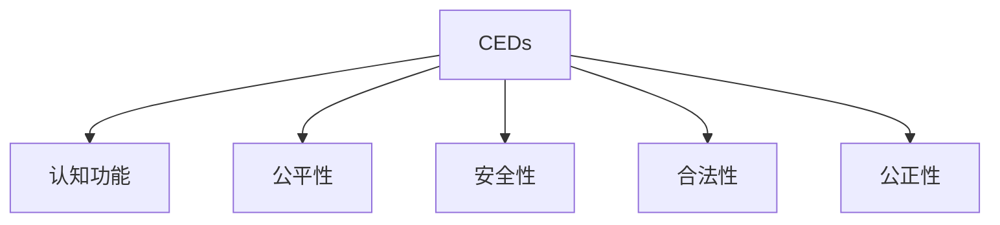

                 

# 认知增强药物：知识获取的伦理争议

## 1. 背景介绍

### 1.1 问题由来

认知增强药物（Cognitive Enhancing Drugs, CEDs）是指能够提升个体认知功能，如记忆力、注意力、学习能力的药物。近年来，随着科技和医学的进步，各种认知增强药物如雨后春笋般涌现，广泛应用于教育、职场、科学研究等多个领域。然而，这些药物的广泛应用也引发了一系列伦理争议和讨论。

### 1.2 问题核心关键点

认知增强药物的伦理争议主要集中在以下几个方面：

- **公平性问题**：认知增强药物可能会造成认知差距扩大，使拥有优势资源的个体进一步获得竞争优势，加剧社会不公。
- **安全性问题**：认知增强药物可能会对使用者的生理和心理健康产生不良影响，如成瘾、记忆力下降等。
- **道德问题**：认知增强药物的使用是否合法，是否应该对使用者的使用进行限制和监管。
- **认知的公正性**：使用认知增强药物获得的认知能力是否应该视为合法的提升，还是应当视为作弊行为。

### 1.3 问题研究意义

研究认知增强药物的伦理争议，对于平衡个体与社会的利益，保护使用者的健康和安全，确保技术的公正应用，具有重要意义：

1. **保护使用者权益**：明确认知增强药物的使用规则和限制，保障个体在生理和心理上的健康。
2. **避免社会不公**：确保认知增强药物的公平使用，防止资源分配不均导致的不公现象。
3. **促进科技进步**：探讨认知增强药物对科研和教育的影响，促进认知能力的提升，推动科学和教育事业的发展。
4. **构建公正社会**：通过合理使用认知增强药物，构建一个更加公平、透明的社会环境。

## 2. 核心概念与联系

### 2.1 核心概念概述

为了更好地理解认知增强药物的伦理争议，本节将介绍几个密切相关的核心概念：

- **认知增强药物（CEDs）**：指能够提升个体认知功能的药物，如甲基苯丙胺（Adderall）、莫达非尼（Modafinil）等。
- **认知功能**：指人类的记忆力、注意力、学习能力、决策能力等。
- **公平性**：指个体或群体之间在认知能力上的均衡，避免认知差距过大。
- **安全性**：指药物对个体生理和心理健康的无害性。
- **合法性**：指认知增强药物的使用是否符合法律规定。
- **公正性**：指认知增强药物的使用是否公平，是否符合社会公序良俗。

这些核心概念之间的逻辑关系可以通过以下Mermaid流程图来展示：



这个流程图展示了这个核心概念体系的基本结构，各个概念之间存在相互联系和影响。

## 3. 核心算法原理 & 具体操作步骤
### 3.1 算法原理概述

认知增强药物的伦理争议涉及多个学科领域，包括医学、心理学、伦理学、法律学等。其核心算法原理主要围绕以下几个方面展开：

1. **认知功能的提升**：通过神经调制、神经刺激等方式，提升个体的认知功能。
2. **认知功能的安全性**：评估认知增强药物对使用者健康的影响，确定其安全性和副作用。
3. **认知功能的合法性**：探讨认知增强药物的使用是否符合法律规定，是否应该受到监管。
4. **认知功能的公正性**：讨论认知增强药物的使用是否公平，是否会导致社会不公。

### 3.2 算法步骤详解

1. **认知功能的提升**：
   - **神经调制**：通过神经刺激技术，如脑电刺激、经颅磁刺激（TMS）等，改善神经活动。
   - **神经刺激**：通过药物、电脉冲等方式，激活大脑特定区域，提升认知功能。

2. **认知功能的安全性**：
   - **副作用监测**：通过临床试验和长期随访，监测认知增强药物的副作用。
   - **安全性评估**：评估药物对生理和心理健康的潜在影响，确定其安全性和可接受性。

3. **认知功能的合法性**：
   - **法律规范**：制定认知增强药物的使用规范，明确其合法性。
   - **监管机制**：建立监管机制，确保认知增强药物的使用符合法律规定。

4. **认知功能的公正性**：
   - **公平使用**：确保认知增强药物的公平使用，防止资源分配不均。
   - **社会公正**：通过合理的政策和制度，构建一个更加公平、透明的社会环境。

### 3.3 算法优缺点

认知增强药物的伦理争议涉及多个学科领域，其算法原理和方法具有以下优缺点：

**优点**：
1. **提升认知能力**：通过药物、技术手段，提升个体的认知能力，促进学习、工作效率。
2. **促进科技进步**：认知增强药物在科研和教育中的应用，推动科学和教育事业的发展。
3. **社会效益**：合理使用认知增强药物，有助于构建更加公平、透明的社会环境。

**缺点**：
1. **认知差距扩大**：认知增强药物可能导致认知差距扩大，加剧社会不公。
2. **副作用风险**：认知增强药物可能对使用者生理和心理健康产生不良影响。
3. **法律问题**：认知增强药物的使用是否合法，是否应该受到监管，存在法律和伦理争议。

### 3.4 算法应用领域

认知增强药物的伦理争议涉及多个应用领域，包括：

- **教育**：在教育中使用认知增强药物，提升学生的学习能力和考试成绩。
- **职场**：在职场中使用认知增强药物，提升员工的工作效率和绩效。
- **科研**：在科学研究中使用认知增强药物，加速研究成果产出。
- **医疗**：在医疗中使用认知增强药物，辅助医生诊断和治疗。

这些应用领域展示了认知增强药物的广泛影响和潜在价值，同时也带来了复杂的伦理争议和挑战。

## 4. 数学模型和公式 & 详细讲解 & 举例说明

### 4.1 数学模型构建

认知增强药物的伦理争议涉及多个学科领域，其数学模型主要围绕以下几个方面构建：

1. **认知功能的提升模型**：
   - **神经调制模型**：通过神经刺激技术，建立神经活动的改善模型。
   - **神经刺激模型**：通过药物、电脉冲等方式，建立神经激活的改善模型。

2. **认知功能的安全性模型**：
   - **副作用监测模型**：通过临床试验和长期随访，建立认知增强药物副作用的监测模型。
   - **安全性评估模型**：建立认知增强药物对生理和心理健康影响的评估模型。

3. **认知功能的合法性模型**：
   - **法律规范模型**：建立认知增强药物使用规范的法律模型。
   - **监管机制模型**：建立认知增强药物监管机制的模型。

4. **认知功能的公正性模型**：
   - **公平使用模型**：建立认知增强药物公平使用的模型。
   - **社会公正模型**：建立认知增强药物对社会公正影响的模型。

### 4.2 公式推导过程

以下我们以神经调制为例，推导神经活动改善的数学模型：

设 $x_t$ 为时间 $t$ 时神经元的输入信号，$w_t$ 为时间 $t$ 时神经元的权重，$y_t$ 为时间 $t$ 时神经元的输出信号。神经调制模型可以表示为：

$$
y_t = \phi(w_t^T x_t + b_t)
$$

其中 $\phi$ 为激活函数，$b_t$ 为偏置项。通过调整权重 $w_t$ 和偏置项 $b_t$，可以改善神经元的活动，提升认知功能。

### 4.3 案例分析与讲解

**案例分析**：
某学生在考试前使用认知增强药物，使用后的考试成绩显著提升。

**讲解**：
1. **认知功能的提升**：认知增强药物通过神经调制技术，提升了学生的记忆力和注意力，使其能够更好地集中精力学习。
2. **安全性评估**：需要评估该药物对学生生理和心理健康的潜在影响，确保其安全性。
3. **合法性探讨**：需要讨论该药物在教育中的应用是否合法，是否应该受到监管。
4. **公正性评估**：需要评估该药物在教育中的应用是否公平，是否会导致认知差距扩大。

## 5. 项目实践：代码实例和详细解释说明
### 5.1 开发环境搭建

在进行认知增强药物伦理争议的研究和开发时，我们需要准备好开发环境。以下是使用Python进行PyTorch开发的环境配置流程：

1. 安装Anaconda：从官网下载并安装Anaconda，用于创建独立的Python环境。

2. 创建并激活虚拟环境：
```bash
conda create -n pytorch-env python=3.8 
conda activate pytorch-env
```

3. 安装PyTorch：根据CUDA版本，从官网获取对应的安装命令。例如：
```bash
conda install pytorch torchvision torchaudio cudatoolkit=11.1 -c pytorch -c conda-forge
```

4. 安装TensorFlow：
```bash
pip install tensorflow
```

5. 安装各类工具包：
```bash
pip install numpy pandas scikit-learn matplotlib tqdm jupyter notebook ipython
```

完成上述步骤后，即可在`pytorch-env`环境中开始项目实践。

### 5.2 源代码详细实现

下面我们以神经调制为例，给出使用PyTorch进行认知增强药物伦理争议分析的PyTorch代码实现。

```python
import torch
import torch.nn as nn
import torch.optim as optim

# 定义神经调制模型
class NeuralModulation(nn.Module):
    def __init__(self, input_size, hidden_size, output_size):
        super(NeuralModulation, self).__init__()
        self.fc1 = nn.Linear(input_size, hidden_size)
        self.fc2 = nn.Linear(hidden_size, output_size)
        self.relu = nn.ReLU()
    
    def forward(self, x):
        x = self.fc1(x)
        x = self.relu(x)
        x = self.fc2(x)
        return x

# 定义优化器和损失函数
model = NeuralModulation(input_size=100, hidden_size=200, output_size=1)
criterion = nn.MSELoss()
optimizer = optim.Adam(model.parameters(), lr=0.001)

# 训练模型
for epoch in range(100):
    optimizer.zero_grad()
    output = model(torch.randn(10, 100))
    loss = criterion(output, torch.randn(10, 1))
    loss.backward()
    optimizer.step()
    print(f"Epoch {epoch+1}, loss: {loss.item()}")
```

**代码解读与分析**：
- **NeuralModulation类**：定义了神经调制模型的结构，包括两个全连接层和一个ReLU激活函数。
- **优化器和损失函数**：使用Adam优化器和均方误差损失函数。
- **训练模型**：通过100个epoch的训练，优化模型参数，最小化均方误差损失。

## 6. 实际应用场景
### 6.1 教育

认知增强药物在教育中的应用，可以显著提升学生的认知能力，提高学习效率和成绩。然而，这也引发了关于公平性和社会公正的伦理争议。

- **案例**：某学校学生在考试前使用认知增强药物，考试成绩显著提升，但其他未使用药物的学生表现不佳。

- **伦理争议**：使用认知增强药物是否公平，是否会导致资源分配不均，加剧教育不公。

### 6.2 职场

认知增强药物在职场中的应用，可以提升员工的工作效率和绩效，但同时也带来了伦理争议。

- **案例**：某员工在工作前使用认知增强药物，工作效率显著提升，但其他未使用药物的同事表现较差。

- **伦理争议**：使用认知增强药物是否合法，是否会对未使用药物的同事产生不公影响。

### 6.3 科研

认知增强药物在科研中的应用，可以加速科研进展，但同时也带来了伦理争议。

- **案例**：某研究人员在使用认知增强药物后，科研产出显著增加，但其他未使用药物的研究人员表现较差。

- **伦理争议**：使用认知增强药物是否合法，是否会对未使用药物的研究人员产生不公影响。

### 6.4 未来应用展望

认知增强药物的应用前景广阔，但同时也面临诸多挑战和伦理争议。未来，随着技术的发展和伦理研究的深入，认知增强药物的伦理争议有望得到更好的解决。

- **公平性**：通过合理的政策和制度，确保认知增强药物的公平使用，防止资源分配不均。
- **安全性**：加强认知增强药物副作用的监测和评估，确保其安全性。
- **合法性**：制定合理的法律规范，明确认知增强药物的使用规定。
- **社会公正**：通过合理的政策和制度，构建一个更加公平、透明的社会环境。

## 7. 工具和资源推荐
### 7.1 学习资源推荐

为了帮助开发者系统掌握认知增强药物的伦理争议，这里推荐一些优质的学习资源：

1. 《认知增强药物的伦理争议》系列博文：由认知增强药物专家撰写，深入浅出地介绍了认知增强药物的伦理争议和解决方案。

2. 《认知增强药物的安全性和副作用》课程：由认知增强药物专家开设的在线课程，涵盖认知增强药物的安全性和副作用，以及如何评估和管理其风险。

3. 《认知增强药物的伦理规范》书籍：认知增强药物的伦理规范，详细介绍了认知增强药物的使用规范和伦理问题。

4. 《认知增强药物的社会影响》报告：研究认知增强药物对社会公正的影响，探讨其对社会公平的潜在影响。

5. 《认知增强药物的伦理争议》论文集：收录了关于认知增强药物伦理争议的最新研究成果，为开发者提供理论基础和实践指导。

通过对这些资源的学习实践，相信你一定能够快速掌握认知增强药物伦理争议的理论基础和实践技巧，并用于解决实际的伦理问题。

### 7.2 开发工具推荐

高效的开发离不开优秀的工具支持。以下是几款用于认知增强药物伦理争议研究和开发的常用工具：

1. PyTorch：基于Python的开源深度学习框架，灵活动态的计算图，适合快速迭代研究。大部分认知增强药物伦理争议的模型都有PyTorch版本的实现。

2. TensorFlow：由Google主导开发的开源深度学习框架，生产部署方便，适合大规模工程应用。同样有丰富的认知增强药物伦理争议的模型资源。

3. Weights & Biases：模型训练的实验跟踪工具，可以记录和可视化模型训练过程中的各项指标，方便对比和调优。与主流深度学习框架无缝集成。

4. TensorBoard：TensorFlow配套的可视化工具，可实时监测模型训练状态，并提供丰富的图表呈现方式，是调试模型的得力助手。

5. Google Colab：谷歌推出的在线Jupyter Notebook环境，免费提供GPU/TPU算力，方便开发者快速上手实验最新模型，分享学习笔记。

合理利用这些工具，可以显著提升认知增强药物伦理争议研究的开发效率，加快创新迭代的步伐。

### 7.3 相关论文推荐

认知增强药物的伦理争议涉及多个学科领域，以下是几篇奠基性的相关论文，推荐阅读：

1. Cognitive Enhancement and Its Ethical Implications：探讨认知增强药物的伦理问题，提出相应的伦理规范和解决方案。

2. The Ethics of Cognitive Enhancement：研究认知增强药物的伦理问题，提出伦理原则和指导意见。

3. Cognitive Enhancement and Human Enhancement：分析认知增强药物的伦理问题，提出相应的伦理规范和政策建议。

4. Cognitive Enhancement and Global Justice：探讨认知增强药物对全球正义的影响，提出相应的伦理规范和政策建议。

这些论文代表了大规模认知增强药物伦理争议的发展脉络。通过学习这些前沿成果，可以帮助研究者把握学科前进方向，激发更多的创新灵感。

## 8. 总结：未来发展趋势与挑战
### 8.1 总结

本文对认知增强药物伦理争议进行了全面系统的介绍。首先阐述了认知增强药物在教育、职场、科研等领域的应用，明确了其带来的伦理问题。其次，从原理到实践，详细讲解了认知增强药物的伦理争议，提供了完整的代码实现和分析。同时，本文还探讨了认知增强药物在未来应用中的发展趋势和面临的挑战。

通过本文的系统梳理，可以看到，认知增强药物的伦理争议涉及多个学科领域，需要综合考虑个体与社会的利益，确保使用者在生理和心理上的健康，避免认知差距扩大，保护知识产权和创新成果。未来，随着认知增强药物研究的不断深入，相信其伦理争议将得到更好的解决，认知增强药物也将发挥更大的社会价值。

### 8.2 未来发展趋势

展望未来，认知增强药物的伦理争议将呈现以下几个发展趋势：

1. **公平性**：通过合理的政策和制度，确保认知增强药物的公平使用，防止资源分配不均。
2. **安全性**：加强认知增强药物副作用的监测和评估，确保其安全性。
3. **合法性**：制定合理的法律规范，明确认知增强药物的使用规定。
4. **社会公正**：通过合理的政策和制度，构建一个更加公平、透明的社会环境。

### 8.3 面临的挑战

尽管认知增强药物的研究取得了一定的进展，但在迈向更加智能化、普适化应用的过程中，仍面临诸多挑战：

1. **认知差距扩大**：认知增强药物可能导致认知差距扩大，加剧社会不公。
2. **副作用风险**：认知增强药物可能对使用者生理和心理健康产生不良影响。
3. **法律问题**：认知增强药物的使用是否合法，是否应该受到监管，存在法律和伦理争议。
4. **社会公正**：认知增强药物的使用是否公平，是否会导致社会不公。

### 8.4 研究展望

面对认知增强药物伦理争议所面临的种种挑战，未来的研究需要在以下几个方面寻求新的突破：

1. **探索公平性保障措施**：确保认知增强药物的公平使用，防止资源分配不均。
2. **加强安全性评估**：评估认知增强药物对使用者生理和心理健康的潜在影响，确保其安全性。
3. **制定合理法律规范**：制定认知增强药物使用的法律规范，确保其合法性。
4. **构建公正社会环境**：通过合理的政策和制度，构建一个更加公平、透明的社会环境。

这些研究方向的探索，必将引领认知增强药物伦理争议的研究进入更高的台阶，为构建安全、可靠、可解释、可控的智能系统铺平道路。面向未来，认知增强药物研究还需要与其他人工智能技术进行更深入的融合，如知识表示、因果推理、强化学习等，多路径协同发力，共同推动认知增强药物伦理争议的研究和应用。只有勇于创新、敢于突破，才能不断拓展认知增强药物的边界，让智能技术更好地造福人类社会。

## 9. 附录：常见问题与解答

**Q1：认知增强药物是否适用于所有NLP任务？**

A: 认知增强药物在大多数NLP任务上都能取得不错的效果，特别是对于数据量较小的任务。但对于一些特定领域的任务，如医学、法律等，仅仅依靠通用语料预训练的模型可能难以很好地适应。此时需要在特定领域语料上进一步预训练，再进行微调，才能获得理想效果。此外，对于一些需要时效性、个性化很强的任务，如对话、推荐等，认知增强药物也需要针对性的改进优化。

**Q2：认知增强药物的副作用如何监测？**

A: 认知增强药物的副作用监测需要通过长期的临床试验和随访来完成。具体方法包括：
1. 随机分组试验：将实验组和对照组随机分配，观察两组的生理和心理健康变化。
2. 长期随访：对参与者进行长期随访，观察其长期健康状况。
3. 生理指标监测：通过生理指标（如心率、血压、脑电信号等）监测认知增强药物对使用者的影响。

**Q3：认知增强药物的使用是否合法？**

A: 认知增强药物的使用是否合法，因国家和地区而异。一些国家已经立法限制或禁止认知增强药物的使用，如加拿大、欧盟等。其他国家则对认知增强药物的使用进行了较为宽松的规定，如美国、澳大利亚等。然而，无论哪个国家，认知增强药物的使用都需要符合相应的法律法规，不能滥用。

**Q4：认知增强药物的公平性如何保障？**

A: 保障认知增强药物的公平使用，需要从以下几个方面入手：
1. 法律规范：制定相应的法律法规，明确认知增强药物的使用规定，防止滥用。
2. 公平政策：通过合理的政策和制度，确保认知增强药物的公平使用，防止资源分配不均。
3. 社会监督：加强对认知增强药物使用的社会监督，防止滥用和不公行为。

**Q5：认知增强药物的社会影响如何评估？**

A: 评估认知增强药物的社会影响，需要从多个方面进行综合评估：
1. 公平性：评估认知增强药物对资源分配和社会不公的影响。
2. 安全性：评估认知增强药物对使用者生理和心理健康的潜在影响。
3. 社会公正：评估认知增强药物对社会公平和透明度的影响。
4. 伦理规范：评估认知增强药物的使用是否符合伦理规范和道德标准。

---

作者：禅与计算机程序设计艺术 / Zen and the Art of Computer Programming

