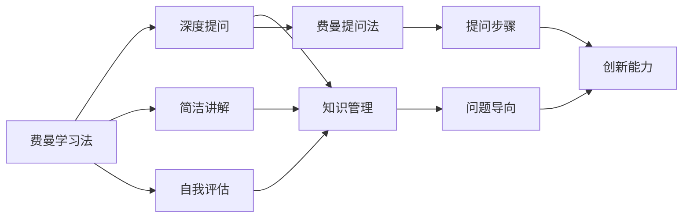

                 

# 费曼提问法:管理者思维升级的利器

> 关键词：费曼学习法, 费曼提问法, 管理者思维, 知识管理, 问题解决, 创新能力, 问题导向

## 1. 背景介绍

### 1.1 问题由来
在数字化、智能化的今天，无论是企业的管理者还是普通员工，都面临着知识更新快、信息庞杂、任务繁重等挑战。传统的学习方式已无法满足现代社会快速变化的需求，新的学习方法和思维工具应运而生。其中，费曼学习法（Feynman Learning Technique）作为一款高效、实用的学习工具，逐渐被各行业的管理者和知识工作者广泛接受。费曼学习法强调通过提问、复述、简化、类比等手段，深入理解和掌握知识，并在实际工作中应用。但费曼学习法在企业管理和组织知识管理中的应用，尚未得到系统性的探讨。本文旨在探索费曼学习法在企业管理中的应用，特别是通过费曼提问法（Feynman Question Method），提升管理者的思维能力和组织效率。

### 1.2 问题核心关键点
费曼提问法作为一种基于费曼学习法的知识管理工具，通过提出一系列深入、系统的提问，帮助管理者深入理解组织的目标、流程、策略等，从而提升决策的科学性和组织执行力。其主要应用场景包括但不限于：
- 组织目标的明确和分解
- 流程和策略的优化设计
- 团队协作和问题解决的指导
- 知识共享和创新思维的培养

本文将详细介绍费曼提问法的基本原理、操作步骤和实践案例，探讨其在企业管理中的具体应用，并对比分析其优缺点，展望未来发展趋势。

## 2. 核心概念与联系

### 2.1 核心概念概述
费曼学习法由诺贝尔物理学奖得主理查德·费曼（Richard Feynman）提出，强调通过主动学习、自我评估和内化，以深入理解复杂概念。费曼提问法作为费曼学习法的一个变种，特别强调通过提问手段，深入挖掘问题的本质，推动思维的升级和创新。

1. **费曼学习法**：一种通过主动教授他人来加深对知识的理解的学习方法，通过简洁、清晰、深入的讲解，检验自己对知识点的掌握程度。
2. **费曼提问法**：在费曼学习法的基础上，通过提问的方式，深度挖掘问题的内在逻辑和关键要素，帮助管理者思考和解决问题。
3. **问题导向**：通过深入分析问题，找出问题的根源，制定解决方案，提升管理决策的质量。
4. **知识管理**：将知识内化于组织和个人，通过系统化的知识积累和应用，提升组织的竞争力和执行力。
5. **创新能力**：通过深层次的问题挖掘和分析，培养管理者的创新思维和解决问题的能力。

这些概念相互联系，共同构成了一个以问题为导向，通过深度提问和系统分析来提升管理者思维和组织效能的知识管理框架。

### 2.2 核心概念原理和架构的 Mermaid 流程图(Mermaid 流程节点中不要有括号、逗号等特殊字符)

这个流程图展示了费曼学习法和费曼提问法的基本架构和应用路径。通过简洁讲解和自我评估，费曼学习法帮助管理者深入理解知识点；通过深度提问，费曼提问法进一步挖掘问题的本质，推动知识管理；最终目标是通过问题导向和创新能力，提升组织的管理效能。

## 3. 核心算法原理 & 具体操作步骤
### 3.1 算法原理概述
费曼提问法基于费曼学习法的原理，强调通过深入、系统的提问，挖掘问题的本质，推动管理者的思维升级。其主要原理包括以下几点：
1. **深度挖掘**：通过提出一系列深入、系统的提问，帮助管理者深入理解问题的本质。
2. **系统分析**：将问题拆解为多个层次，逐层分析和解决问题。
3. **知识内化**：将问题的解决方法内化到组织和个人，形成系统的知识管理。
4. **创新思考**：通过系统分析，培养管理者的创新思维和解决问题的能力。

### 3.2 算法步骤详解
费曼提问法的基本操作步骤包括以下几个关键步骤：

**Step 1: 选择问题**
- 确定需要解决的问题，通常为组织中存在的瓶颈或挑战。
- 问题应具有明确的目标和具体的表现形式。

**Step 2: 划分层次**
- 将问题拆分为多个层次，每个层次包含一个或多个子问题。
- 从最底层的子问题开始，逐步向上分析，直到找到问题的根源。

**Step 3: 深度提问**
- 针对每个层次的子问题，提出一系列深入、系统的提问。
- 提问应具体、明确，涵盖问题的各个方面。

**Step 4: 系统分析**
- 针对每个子问题，收集相关信息，进行系统分析。
- 通过分析，找到问题的本质和解决方案。

**Step 5: 知识内化**
- 将问题的解决方法内化到组织和个人，形成系统的知识管理。
- 通过文档、培训、知识库等方式，传播和应用知识。

**Step 6: 创新思考**
- 通过系统分析，培养管理者的创新思维和解决问题的能力。
- 鼓励团队提出新的思路和方案，推动组织不断创新。

### 3.3 算法优缺点
费曼提问法的优点在于：
1. **深度挖掘问题**：通过深度提问，帮助管理者深入理解问题的本质，避免浅层次的思考。
2. **系统分析问题**：将问题拆分为多个层次，逐层分析和解决问题，提高决策的科学性。
3. **知识内化**：将问题的解决方法内化到组织和个人，形成系统的知识管理，提升组织执行力。
4. **创新思考**：通过系统分析，培养管理者的创新思维和解决问题的能力，推动组织创新。

其缺点在于：
1. **时间和精力成本高**：深入挖掘问题需要大量的时间和精力投入。
2. **实施难度大**：需要管理者的高度配合和系统的支持，实施难度较大。
3. **难以量化**：费曼提问法的实施效果难以量化评估，需要结合实际业务进行综合评估。

### 3.4 算法应用领域
费曼提问法在企业管理中的应用领域广泛，主要包括以下几个方面：

1. **组织目标的明确和分解**：通过提问，帮助管理层明确组织的战略目标和具体任务，制定详细的执行计划。
2. **流程和策略的优化设计**：通过系统分析，识别流程和策略中的瓶颈和不足，提出改进方案。
3. **团队协作和问题解决的指导**：通过深度提问和知识分享，提升团队协作效率，解决复杂问题。
4. **知识共享和创新思维的培养**：通过系统分析，培养管理者的创新思维和知识共享能力。

这些应用领域显示了费曼提问法在企业管理中的广泛适用性和巨大潜力。

## 4. 数学模型和公式 & 详细讲解 & 举例说明（备注：数学公式请使用latex格式，latex嵌入文中独立段落使用 $$，段落内使用 $)
### 4.1 数学模型构建
在企业管理中，费曼提问法通常不涉及具体的数学模型构建，但其基本原理和操作步骤可以抽象为一种问题导向的系统分析模型。具体模型构建如下：

**目标问题**：$P$
**问题层次**：$\{L_i\}_{i=1}^n$
**深度提问**：$\{Q_j\}_{j=1}^m$
**系统分析**：$\{A_k\}_{k=1}^p$
**知识内化**：$K$
**创新思考**：$I$

其中，$P$为目标问题，$L_i$为问题层次，$Q_j$为深度提问，$A_k$为系统分析结果，$K$为知识管理结果，$I$为创新思维和解决方案。

### 4.2 公式推导过程
费曼提问法的公式推导主要涉及系统分析的结果和知识管理的过程。假设系统分析的结果为$A_k$，知识管理的结果为$K$，则知识管理的过程可以表示为：

$$K = f(A_k)$$

其中，$f$为知识管理的函数，将系统分析的结果转化为可操作的解决方案。

### 4.3 案例分析与讲解
假设一个公司面临销售增长缓慢的问题。

**Step 1: 选择问题**：销售增长缓慢。

**Step 2: 划分层次**：
- 层次1：市场分析
- 层次2：产品优化
- 层次3：营销策略

**Step 3: 深度提问**：
- 层次1：市场分析
  - 问题1：市场需求增长如何？
  - 问题2：竞争对手策略如何？
  - 问题3：目标客户群体是谁？
- 层次2：产品优化
  - 问题1：产品定位是否准确？
  - 问题2：产品质量和创新是否满足客户需求？
  - 问题3：价格策略是否合理？
- 层次3：营销策略
  - 问题1：广告效果如何？
  - 问题2：销售渠道是否覆盖面广？
  - 问题3：客户反馈如何？

**Step 4: 系统分析**：针对每个子问题，进行系统分析，收集相关信息，形成分析报告。

**Step 5: 知识内化**：将分析报告转化为可操作的解决方案，形成系统的知识管理。

**Step 6: 创新思考**：通过系统分析，培养管理者的创新思维和解决问题的能力。

### 5. 项目实践：代码实例和详细解释说明
由于费曼提问法主要依赖于管理者的思维和系统的支持，其操作过程通常不涉及具体的代码实现。但在实际应用中，可以通过一些工具和技术，辅助实现系统的知识管理和数据分析。

**开发环境搭建**：
- 安装Python和相关库，如Pandas、NumPy等，用于数据处理和分析。
- 选择合适的项目管理工具，如Jira、Trello等，用于任务管理和进度跟踪。
- 搭建知识管理系统，如Confluence、SharePoint等，用于知识共享和存储。

**源代码详细实现**：
由于费曼提问法的操作主要依赖于管理者的思维和系统的支持，具体代码实现通常涉及系统的知识管理和数据分析工具。

**代码解读与分析**：
由于费曼提问法的核心在于深度提问和系统分析，具体的代码实现通常不涉及深度学习或复杂的算法，但可以使用Python进行简单的数据分析和可视化。

**运行结果展示**：
运行结果主要表现为系统分析报告和知识管理文档，通过分析报告和文档，管理层可以清晰地看到问题的本质和解决方案。

## 6. 实际应用场景
### 6.1 智能客服系统
智能客服系统是费曼提问法的一个重要应用场景。通过深度提问和系统分析，智能客服系统可以更好地理解客户需求，提供个性化的服务。具体应用步骤如下：
1. **选择问题**：客户满意度低。
2. **划分层次**：
  - 层次1：客户反馈分析
  - 层次2：客服流程优化
  - 层次3：系统优化
3. **深度提问**：
  - 层次1：问题1：客户反馈的具体内容是什么？
  - 层次1：问题2：客户满意度低的原因是什么？
  - 层次2：问题1：当前客服流程有哪些不足？
  - 层次2：问题2：如何优化客服流程？
  - 层次3：问题1：系统存在哪些问题？
  - 层次3：问题2：如何优化系统？
4. **系统分析**：通过数据分析和系统日志，收集相关信息，形成分析报告。
5. **知识内化**：将分析报告转化为可操作的解决方案，如优化客服流程和系统。
6. **创新思考**：通过系统分析，培养客服团队的创新思维和解决问题的能力。

### 6.2 金融舆情监测
金融舆情监测是费曼提问法的另一个重要应用场景。通过深度提问和系统分析，金融舆情监测系统可以更好地理解市场动态，规避金融风险。具体应用步骤如下：
1. **选择问题**：市场舆情波动大。
2. **划分层次**：
  - 层次1：舆情分析
  - 层次2：风险识别
  - 层次3：应对策略
3. **深度提问**：
  - 层次1：问题1：舆情的主要来源是什么？
  - 层次1：问题2：舆情的主要内容是什么？
  - 层次2：问题1：风险的主要类型是什么？
  - 层次2：问题2：风险的影响程度如何？
  - 层次3：问题1：如何应对舆情波动？
  - 层次3：问题2：如何规避金融风险？
4. **系统分析**：通过舆情分析和风险识别，收集相关信息，形成分析报告。
5. **知识内化**：将分析报告转化为可操作的解决方案，如舆情监测和风险管理。
6. **创新思考**：通过系统分析，培养团队的风险管理能力和创新思维。

### 6.3 个性化推荐系统
个性化推荐系统是费曼提问法在推荐技术中的重要应用。通过深度提问和系统分析，个性化推荐系统可以更好地理解用户需求，提供个性化的推荐服务。具体应用步骤如下：
1. **选择问题**：用户推荐精准度低。
2. **划分层次**：
  - 层次1：用户需求分析
  - 层次2：推荐算法优化
  - 层次3：数据质量提升
3. **深度提问**：
  - 层次1：问题1：用户的主要兴趣点是什么？
  - 层次1：问题2：用户的历史行为数据有哪些？
  - 层次2：问题1：当前的推荐算法有哪些不足？
  - 层次2：问题2：如何优化推荐算法？
  - 层次3：问题1：数据质量存在哪些问题？
  - 层次3：问题2：如何提升数据质量？
4. **系统分析**：通过用户需求分析和推荐算法优化，收集相关信息，形成分析报告。
5. **知识内化**：将分析报告转化为可操作的解决方案，如优化推荐算法和提升数据质量。
6. **创新思考**：通过系统分析，培养团队的推荐技术能力和创新思维。

### 6.4 未来应用展望
费曼提问法作为一款高效、实用的知识管理工具，未来在企业管理中的应用前景广阔。随着技术的不断进步和应用场景的不断扩展，费曼提问法将逐渐成为管理者的必备技能。

1. **智能化应用**：结合人工智能和大数据分析，费曼提问法将更高效地挖掘问题和本质，推动管理决策的科学化。
2. **实时化应用**：通过实时数据监测和反馈，费曼提问法将实现动态调整和优化，提升问题解决的及时性。
3. **跨领域应用**：费曼提问法不仅适用于企业内部管理，还可以应用于政府、教育、医疗等多个领域，推动多领域知识管理。
4. **组织文化建设**：通过系统化的提问和分析，费曼提问法将推动组织文化的建设，提升组织的凝聚力和竞争力。
5. **持续改进**：费曼提问法将不断迭代和优化，结合最新技术和管理实践，提升管理效能。

## 7. 工具和资源推荐
### 7.1 学习资源推荐
为了帮助管理者系统掌握费曼提问法，这里推荐一些优质的学习资源：

1. **《费曼学习法》**：这是一本介绍费曼学习法的经典书籍，系统地介绍了费曼学习法的原理和操作步骤。
2. **《费曼提问法：提升问题解决能力的利器》**：这是一本介绍费曼提问法的专业书籍，详细讲解了费曼提问法的核心思想和操作步骤。
3. **在线课程《问题导向型领导力》**：这是一门介绍费曼提问法的在线课程，通过实际案例和视频讲解，帮助管理者掌握费曼提问法。
4. **知识管理工具《知识地图》**：这是一套系统化的知识管理工具，通过知识地图和知识管理系统，帮助组织更好地进行知识管理。

### 7.2 开发工具推荐
在实际应用中，费曼提问法通常依赖于系统的支持和管理工具。以下是几款常用的开发工具：

1. **项目管理工具Jira**：用于任务管理和进度跟踪，确保费曼提问法实施的进度和质量。
2. **知识管理工具Confluence**：用于知识共享和存储，帮助组织更好地进行知识管理。
3. **数据分析工具Python**：用于数据分析和可视化，辅助费曼提问法的系统分析。
4. **协作工具Slack**：用于团队协作和沟通，推动费曼提问法的实施。

### 7.3 相关论文推荐
为了深入了解费曼提问法的理论基础和实践应用，以下是几篇相关的经典论文：

1. **《费曼学习法的心理学基础》**：介绍费曼学习法的心理学原理，帮助管理者理解其核心思想。
2. **《费曼提问法在组织管理中的应用》**：探讨费曼提问法在组织管理中的应用，提供实际案例和操作步骤。
3. **《基于费曼学习法的知识管理策略》**：介绍基于费曼学习法的知识管理策略，系统地讲解其原理和操作步骤。
4. **《费曼提问法在医疗健康中的应用》**：探讨费曼提问法在医疗健康中的应用，提供实际案例和操作步骤。

## 8. 总结：未来发展趋势与挑战
### 8.1 总结
本文系统地介绍了费曼提问法的基本原理、操作步骤和实际应用，探讨了其在企业管理中的应用前景。通过深度提问和系统分析，费曼提问法帮助管理者深入理解问题和本质，推动决策的科学化和组织执行力。未来，费曼提问法将在更多领域得到应用，成为管理者思维升级的利器。

### 8.2 未来发展趋势
随着技术的不断进步和应用场景的不断扩展，费曼提问法将逐渐成为管理者的必备技能。未来主要发展趋势包括：
1. **智能化应用**：结合人工智能和大数据分析，费曼提问法将更高效地挖掘问题和本质。
2. **实时化应用**：通过实时数据监测和反馈，费曼提问法将实现动态调整和优化。
3. **跨领域应用**：费曼提问法不仅适用于企业内部管理，还可以应用于政府、教育、医疗等多个领域。
4. **组织文化建设**：通过系统化的提问和分析，费曼提问法将推动组织文化的建设，提升组织的凝聚力和竞争力。
5. **持续改进**：费曼提问法将不断迭代和优化，结合最新技术和管理实践，提升管理效能。

### 8.3 面临的挑战
费曼提问法在企业管理中的应用也面临着一些挑战：
1. **实施难度大**：费曼提问法需要管理者的高度配合和系统的支持，实施难度较大。
2. **时间和精力成本高**：深度提问和系统分析需要大量的时间和精力投入。
3. **难以量化**：费曼提问法的实施效果难以量化评估，需要结合实际业务进行综合评估。

### 8.4 研究展望
未来，费曼提问法的研究和应用将从以下几个方面进行：
1. **技术融合**：结合最新技术，如人工智能、大数据、物联网等，推动费曼提问法的创新应用。
2. **实践推广**：通过实际案例和实践经验，推广费曼提问法在企业管理中的应用。
3. **知识管理**：进一步完善知识管理工具和系统，推动知识共享和传播。
4. **组织变革**：通过系统化的提问和分析，推动组织变革和创新，提升组织竞争力。

## 9. 附录：常见问题与解答
### 9.1 Q1：费曼提问法与传统的知识管理方法有何不同？
**A**：费曼提问法强调通过深度提问和系统分析，深入挖掘问题的本质，推动管理者的思维升级。与传统的知识管理方法相比，费曼提问法更加系统化和问题导向，能够帮助管理者更好地理解问题和解决方案。

### 9.2 Q2：如何实施费曼提问法？
**A**：实施费曼提问法需要以下步骤：
1. **选择问题**：确定需要解决的问题。
2. **划分层次**：将问题拆分为多个层次，每个层次包含一个或多个子问题。
3. **深度提问**：针对每个子问题，提出一系列深入、系统的提问。
4. **系统分析**：针对每个子问题，收集相关信息，进行系统分析。
5. **知识内化**：将分析结果转化为可操作的解决方案。
6. **创新思考**：通过系统分析，培养管理者的创新思维和解决问题的能力。

### 9.3 Q3：费曼提问法在项目管理中如何应用？
**A**：费曼提问法在项目管理中主要应用于问题解决和决策支持。通过深度提问和系统分析，项目管理团队可以更好地理解项目的问题和需求，制定科学合理的解决方案。

### 9.4 Q4：费曼提问法在知识管理中的应用案例有哪些？
**A**：费曼提问法在知识管理中的应用案例包括但不限于：
1. **组织目标的明确和分解**：通过深度提问，帮助管理层明确组织的战略目标和具体任务。
2. **流程和策略的优化设计**：通过系统分析，识别流程和策略中的瓶颈和不足，提出改进方案。
3. **团队协作和问题解决的指导**：通过深度提问和知识分享，提升团队协作效率，解决复杂问题。
4. **知识共享和创新思维的培养**：通过系统分析，培养管理者的创新思维和知识共享能力。

### 9.5 Q5：费曼提问法在创新管理中的应用如何体现？
**A**：费曼提问法在创新管理中主要应用于创新思维的培养和创新问题的解决。通过深度提问和系统分析，创新团队可以更好地理解创新问题的本质，提出创新的解决方案，推动组织创新。

---

作者：禅与计算机程序设计艺术 / Zen and the Art of Computer Programming

